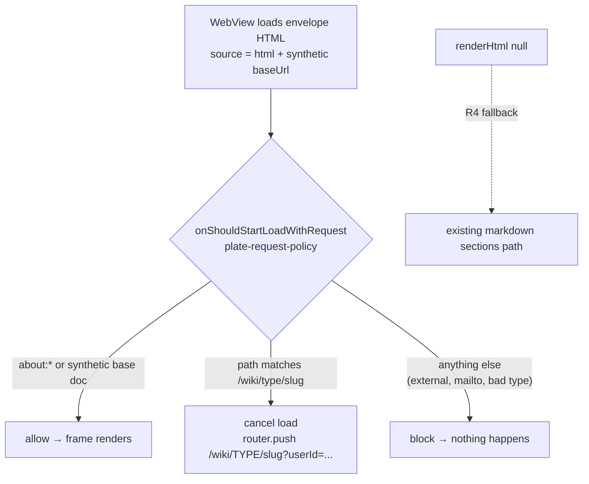

# Mobile Wiki Reader Renders the HTML Plate - Plan

## Goal Capsule

- **Objective:** The mobile wiki screen displays a wiki page's stored HTML plate render inside the existing scriptless document-frame WebView, with in-wiki taps navigating natively and un-rendered pages falling back to the current markdown path.
- **Product authority:** `docs/plans/2026-07-12-004-feat-wiki-html-plate-style-plan.md` (THINK-270), unit U4. This artifact scopes that unit for standalone execution as THINK-275; where the two disagree, the parent plan wins.
- **Open blockers:** THINK-273 (parent plan U2) must be merged and deployed to dev before this unit's device verification can run — `WikiPage.renderHtml` does not exist on `main` yet (verified: `packages/database-pg/graphql/types/` has `renderHtml` only on `Artifact`). Implementation can start against the U2-specified field shape; verification cannot. **Merge is also gated on U2** (see KTD1) — shipping the query change against a schema without the field breaks every mobile wiki page fetch.

---

## Product Contract

_Product Contract preservation: unchanged from the merged requirements-only artifact (PR #3663)._

### Summary

Replace the mobile wiki page's markdown-only rendering with the compiled HTML plate render when one exists, shown in the same scriptless WebView envelope the mobile artifacts reader already uses. In-wiki links inside the render push native wiki screens; external links stay inert; pages without a render keep the existing markdown path.

### Key Decisions

These are inherited from the parent plan and are settled, not open for re-litigation here.

- **Scriptless WebView with request interception, not an in-app HTML parser.** The render displays with `javaScriptEnabled={false}` in the document-frame envelope (parent KTD7). Navigation is achieved by intercepting WebView load requests, never by injected script or postMessage.
- **A synthetic `baseUrl` on the WebView source is mandatory.** Without one, root-relative hrefs resolve against `about:blank` and a tap never produces a request to intercept — the interception design silently dead-ends. This is the unit's central correctness trap and the one behavior no unit test can prove.
- **Only the plate body goes in the WebView.** The `DetailLayout` header and the native summary/backlinks/connected-pages/sources cards stay native, outside the frame.
- **The markdown path is a contract, not legacy.** `react-native-markdown-display` rendering remains the permanent fallback for pages with a NULL render (parent R9); it must not be removed or degraded.

### Requirements

- R1. When a wiki page's `renderHtml` is non-null, the mobile wiki screen displays it in the scriptless document-frame WebView, themed to the app's current color scheme. _(parent R7)_
- R2. Tapping an in-wiki link (`/wiki/<type>/<slug>`) inside the render cancels the WebView load and pushes the target wiki screen natively — no browser, no reload. Type segments are normalized to the uppercase form the mobile router requires. _(parent R8)_
- R3. Tapping any other link inside the render does nothing: the request is blocked and no navigation occurs. _(parent R8)_
- R4. When `renderHtml` is null, the screen renders exactly as it does today via the markdown path. _(parent R9)_
- R5. The artifacts reader screen and the native wiki chrome (backlinks and connected-pages navigation) behave unchanged.

### Acceptance Examples

- AE1. **Covers R2.** Given a topic page whose render links to `/wiki/entity/acme-corp`, when the user taps it on device, then an intercepted request is observed and the entity's wiki screen pushes natively. _(parent AE2)_
- AE2. **Covers R3.** Given a page whose render contains an external URL, when the user taps it, then nothing happens — no WebView navigation, no system browser.
- AE3. **Covers R4.** Given a page whose render is missing (compile failure or not yet backfilled), when the user opens it, then the current markdown/section rendering displays rather than an error or blank frame. _(parent AE3)_

### Scope Boundaries

- The web wiki reader is parent unit U3 (THINK-274), not this issue.
- No changes to render generation, persistence, or the GraphQL field — that is U2 (THINK-273); this unit only fetches and displays.
- No envelope changes expected in `apps/mobile/lib/document-frame.ts`; touch it only if display genuinely requires it.
- No in-WebView rendering of the native chrome (summary, backlinks, sources) — those cards stay native.

### Dependencies / Assumptions

- Depends on THINK-273 (U2) merged and deployed to dev, with dev wiki data backfilled or rebuilt, before device verification.
- Assumes the mobile wiki screen's existing `extractWikiPath` URL mapping and `isWikiPageType` guard (both currently local to `apps/mobile/app/wiki/[type]/[slug].tsx`) are reusable for the interception policy, per parent KTD7.
- Assumes the artifacts reader (`apps/mobile/app/artifacts/[id].tsx`) is the WebView pattern to mirror (originWhitelist, hidden-until-load, `setSupportMultipleWindows={false}`).

### Sources

- Parent plan U4 section, requirements R7–R9, AE2–AE3, and KTD7: `docs/plans/2026-07-12-004-feat-wiki-html-plate-style-plan.md`.
- Current mobile wiki screen (markdown path, `extractWikiPath`, `isWikiPageType`): `apps/mobile/app/wiki/[type]/[slug].tsx`.
- Scriptless envelope helper: `apps/mobile/lib/document-frame.ts` (`withDocumentFrameEnvelope`).
- Existing WebView reader pattern: `apps/mobile/app/artifacts/[id].tsx`; `renderHtml` fetch precedent in `apps/mobile/lib/graphql-queries.ts` (`ArtifactDetailQuery`).

---

## Planning Contract

### Key Technical Decisions

- KTD1. **The PR merge is gated on THINK-273 deployed to dev, because the query change is a runtime schema contract.** `WikiPageQuery` is a raw gql string in `packages/react-native-sdk/src/graphql/queries.ts` (no codegen, no build-time validation). GraphQL operation validation is all-or-nothing: requesting `renderHtml` against a deployed schema that lacks the field fails the _entire_ `wikiPage` query — every mobile wiki page would render the "couldn't be loaded" state. No defensive client-side workaround is worth the complexity (a second conditional query is overkill for a dispatcher-ordered dependency). The Linear `blockedBy` relation on THINK-273 already encodes this; the PR must not merge until U2's schema is live on dev.
- KTD2. **The fetch surface extends the SDK, not the app.** `renderHtml` is added to `WikiPageQuery` and to the `WikiPageDetail` interface in `packages/react-native-sdk/src/hooks/use-wiki-page.ts` (as `renderHtml?: string | null`, detail-query-only like `sourceMemoryCount`). The mobile app consumes it through the existing `useWikiPage` hook — no new query in `apps/mobile/lib/graphql-queries.ts`. Per the existing comment in the query, `renderHtml` must NOT be added to list/search queries.
- KTD3. **The request policy is a pure, tested module; the screen only wires it.** A new `apps/mobile/lib/wiki/plate-request-policy.ts` exports the synthetic base constant (e.g., `https://wiki.thinkwork.internal/`), a moved `extractWikiPath`, and a pure decision function mapping a request URL to one of `allow` (initial load: `about:*` or the synthetic base document itself), `push` (a `/wiki/<type>/<slug>` path — returns the uppercase-typed native route), or `block` (everything else, including malformed wiki types, mailto, and external URLs). This is the only unit-testable half of KTD7; the screen's `onShouldStartLoadWithRequest` becomes a thin adapter that calls `router.push` on `push` and returns the boolean.
- KTD4. **`extractWikiPath` moves to the lib module; the screen imports it.** It is currently file-local to the wiki screen and needed by both the markdown link handler and the new plate policy. Moving it (unchanged behavior) makes it testable and satisfies the parent-plan reuse assumption. `isWikiPageType` stays in the screen (it guards route params, not URLs).
- KTD5. **Plate mode gives the WebView an explicit viewport-derived height inside the existing ScrollView; the plate scrolls internally.** Scriptless means no content-height measurement (no postMessage channel exists to report document height), so auto-sizing the WebView to its content is impossible — do not attempt it. When `renderHtml` is present, the sections region is replaced by a WebView whose height is derived from `useWindowDimensions` (roughly the usable content height), scrolling its own content, while the native meta block above and the children/connected/backlinks cards below remain in the outer ScrollView. Nested WebView-inside-ScrollView scrolling is acceptable on iOS (the shipping platform, per TestFlight). Exact height math is an execution-time detail; the constraint that matters is: never a collapsed/zero-height frame, never a JS-based measurement scheme.
- KTD6. **originWhitelist must admit the synthetic base origin.** The artifacts reader whitelists only `about:*` because its source has no `baseUrl`. Here the initial document URL _is_ the synthetic base, so the whitelist is `["about:*", "<synthetic-base-origin>*"]`; anything else would punt the initial load to the OS browser or blank the frame. The request-policy function remains the navigation gate — the whitelist only prevents the WebView from externalizing loads.
- KTD7. **Envelope, theming, and load-flash handling reuse existing helpers verbatim.** `withDocumentFrameEnvelope(renderHtml, isDark ? "dark" : "light")` from `apps/mobile/lib/document-frame.ts` (CSP + viewport + theme stamp), memoized on `[renderHtml, isDark]` so theme flips regenerate the source; hidden-until-`onLoadEnd` opacity pattern and `setSupportMultipleWindows={false}` / `allowsLinkPreview={false}` copied from the artifacts reader. No changes expected in `document-frame.ts`.
- KTD8. **Plate mode composes with the existing wiki/split/graph view modes; only the sections region is swapped.** The view-mode toggle, graph split, promoted/parent chips, summary, sources affordance, aliases, and the children/connected/backlinks cards render exactly as today in both branches. The plate branch replaces only the `page.sections.map(...)` markdown region.

### High-Level Technical Design

Request flow for a tap inside the plate (directional guidance, not implementation specification):

The `baseUrl` is what makes branch D reachable at all: root-relative hrefs in the plate resolve against it into absolute URLs that fire interceptable requests. Without it they resolve against `about:blank` and no request ever reaches the policy — which is why AE1's device observation is the load-bearing verification step.

### Implementation Units

Plan-local U-IDs (distinct from the parent plan's U1–U4). All three units land in **one PR** (see Checkpoint PR boundary below).

### U1. SDK wiki detail query carries renderHtml

- **Goal:** `useWikiPage` returns `renderHtml` on the detail query.
- **Requirements:** R1 (fetch half); KTD1, KTD2.
- **Dependencies:** none in-repo; **merge** gated on THINK-273 deployed to dev (KTD1).
- **Files:**
  - `packages/react-native-sdk/src/graphql/queries.ts` — add `renderHtml` to `WikiPageQuery`'s detail selection (with the existing detail-only warning comment extended to cover it).
  - `packages/react-native-sdk/src/hooks/use-wiki-page.ts` — add `renderHtml?: string | null` to `WikiPageDetail`.
- **Approach:** Mirror how `sourceMemoryCount`/`parent` were added as detail-only fields. The SDK has no codegen; the interface is the contract. Rebuild the SDK (`dist/`) is a workspace-build concern, not a source change.
- **Test scenarios:** Test expectation: none — pure query-string/type addition with no logic; behavior is proven by U3's device verification and the dev GraphQL endpoint (U2's AE3 already proves the field server-side).
- **Verification:** `pnpm --filter @thinkwork/react-native-sdk build` and monorepo typecheck green; `renderHtml` absent from all list/search queries.

### U2. Plate request policy as a pure, tested module

- **Goal:** The navigation decision for every WebView request is a pure function with full unit coverage, and `extractWikiPath` is importable.
- **Requirements:** R2, R3 (policy half); KTD3, KTD4.
- **Dependencies:** none.
- **Files:**
  - `apps/mobile/lib/wiki/plate-request-policy.ts` — new: synthetic base constant, `extractWikiPath` (moved verbatim from the wiki screen), and the decision function (`allow` / `push` with route / `block`).
  - `apps/mobile/lib/wiki/plate-request-policy.test.ts` — new: vitest, colocated like `source-rows.test.ts`.
  - `apps/mobile/app/wiki/[type]/[slug].tsx` — delete the local `extractWikiPath`, import it from the new module (markdown link handler behavior unchanged).
- **Approach:** The decision function takes the request URL (and the base constant) and returns a discriminated result; it owns uppercase type normalization by reusing `extractWikiPath`. It performs no navigation — the screen adapts `push` results into `router.push` with the current `userId` param.
- **Test scenarios:**
  - Happy path: `about:blank` → allow; the synthetic base document URL itself → allow; `https://wiki.thinkwork.internal/wiki/entity/acme-corp` → push with route `/wiki/ENTITY/acme-corp` (uppercase type, slug preserved). _Covers AE1 (policy half)._
  - Edge cases: relative-looking `/wiki/topic/x` already resolved by the WebView to an absolute base-origin URL → push `/wiki/TOPIC/x`; slug with encoded characters round-trips through `encodeURIComponent`; trailing query/hash on a wiki URL still matches.
  - Error paths: `https://external.example/page` → block; `mailto:a@b.c` → block; `/wiki/bogus-type/x` → block (type not in enum); `/wiki/entity/` (missing slug) → block; `https://wiki.thinkwork.internal/admin` → block. _Covers AE2 (policy half)._
  - `extractWikiPath` regression: the existing markdown-handler cases (absolute URL with any host, relative path, lowercase→uppercase mapping) still pass after the move.
- **Verification:** `pnpm --filter @thinkwork/mobile test` green including the new file; the wiki screen compiles with the imported `extractWikiPath` and the markdown tap path is behaviorally identical.

### U3. Wiki screen renders the plate with native interception and fallback

- **Goal:** The wiki screen shows the plate WebView when `renderHtml` is present, falls back to markdown when null, and keeps all native chrome and view modes intact.
- **Requirements:** R1, R2, R3, R4, R5; AE1–AE3; KTD5–KTD8.
- **Dependencies:** U1, U2.
- **Files:**
  - `apps/mobile/app/wiki/[type]/[slug].tsx` — plate branch replacing the sections region; `onShouldStartLoadWithRequest` adapter; WebView props per KTD6/KTD7; height per KTD5.
- **Approach:** Memoize `withDocumentFrameEnvelope(page.renderHtml, theme)`; render the WebView with `javaScriptEnabled={false}`, `source={{ html, baseUrl: SYNTHETIC_BASE }}`, originWhitelist per KTD6, hidden-until-`onLoadEnd`, `setSupportMultipleWindows={false}`, `allowsLinkPreview={false}`. The adapter calls the U2 policy: `push` → cancel + `router.push(route + userId param)`; `allow` → true; `block` → false. Everything outside `page.sections.map(...)` is untouched (KTD8).
- **Execution note:** The baseUrl-resolution behavior cannot be proven by unit tests (scriptless — the tap→request chain only exists in a real WebView). Prefer getting to a simulator smoke check early over expanding unit coverage; the pure policy is already covered by U2.
- **Test scenarios:** The mobile suite is pure-logic vitest (no RN component rendering), so screen-level assertions are device-verified rather than unit-tested. If a small pure helper emerges (e.g., "plate mode active?" predicate on `renderHtml`), test it: non-null non-empty string → plate; null/undefined/empty → markdown. _Covers AE3 (branch selection half)._
- **Verification:** the device/simulator flows in the Verification Contract below — this unit owns all five.

### Checkpoint PR boundary

**One PR for U1+U2+U3** (branch `eric1/think-275-mobile-wiki-reader-renders-the-html-plate-think-270-u4` or the dispatcher's auto branch). Justification for grouping: U1 alone is a fetch of a field nothing displays; U2 alone is a policy nothing calls; neither is independently verifiable or valuable, and the parent plan and the Linear issue both specify one PR for this unit. The PR merges only after THINK-273 is merged **and deployed to dev** (KTD1).

### Rollout / sequencing notes

1. Implementation can start immediately against the U2-specified field shape (`WikiPage.renderHtml: String`, nullable, detail query only — confirmed against `docs/plans/2026-07-12-007-feat-wiki-render-persistence-plan.md` R4).
2. Local gates (tests, typecheck, lint, SDK build) can go green before THINK-273 lands; the PR then **waits** for THINK-273 deployed to dev before merge (KTD1).
3. Device verification additionally needs dev wiki data backfilled or rebuilt (THINK-273 AE4/backfill), then runs the flows below.
4. No migration, no Terraform, no Lambda changes — this is client-only; the merge pipeline's mobile impact is source-only (TestFlight build cadence is unchanged by this PR).

### Risks

- **Silent dead-end if `baseUrl` is dropped or the whitelist blocks the base origin** — taps do nothing and no test catches it. Mitigation: AE1's explicit "intercepted request observed" step is mandatory, not optional; KTD6 documents the whitelist coupling.
- **Nested scrolling feel (WebView inside ScrollView)** — acceptable on iOS per KTD5; if it proves unusable during verification, the fallback is moving chrome cards above the WebView and letting the WebView own the remaining flex — a layout-only change, no contract change.
- **Merging ahead of U2 deploy breaks all mobile wiki pages** (KTD1) — mitigated by the Linear `blockedBy` relation and the explicit merge gate in the PR description.
- **`renderHtml` accidentally added to list queries** — N+1 on the server per the existing SDK comment; U1 verification explicitly checks its absence.

### Deferred to implementation

- Exact WebView height math and inset handling (`disableBottomInset` on `DetailLayout` as the artifacts reader does, or padding) — KTD5 sets the constraint, not the pixels.
- Whether the plate branch needs `pointerEvents`/scroll-indicator tweaks in split (graph) view mode — resolve on device.
- The synthetic base hostname literal — any fixed, non-routable origin works; keep it a named constant.

---

## Verification Contract

Gates (all must pass before the PR merges):

| Gate              | Command / evidence                                                                     | Owner unit |
| ----------------- | -------------------------------------------------------------------------------------- | ---------- |
| Mobile unit tests | `pnpm --filter @thinkwork/mobile test` (includes the new policy suite)                 | U2         |
| SDK build         | `pnpm --filter @thinkwork/react-native-sdk build`                                      | U1         |
| Monorepo checks   | `pnpm lint && pnpm typecheck && pnpm test && pnpm format:check` (pre-commit) + CI      | all        |
| Merge gate        | THINK-273 merged and deployed to dev (dev GraphQL schema serves `WikiPage.renderHtml`) | U1 (KTD1)  |

End-to-end user flows (real device/simulator — or Expo web fallback — signed into deployed dev, after THINK-273 is deployed and dev wiki data is backfilled/rebuilt; these are the flows verification drives, per the parent plan's U4 contract):

1. **Plate render + theme (R1):** From mobile search, open a wiki entity page that has a stored render — the plate displays inside the scriptless WebView with house styling; toggle the app color scheme — the plate follows (dark/light theme stamp).
2. **In-wiki tap navigates natively (AE1/R2):** Tap an in-wiki link inside the render — confirm an intercepted request is actually observed (the baseUrl-resolution behavior no unit test can prove) and the target wiki screen pushes natively with no browser and no reload; the pushed route carries the uppercase type segment.
3. **External tap inert (AE2/R3):** Tap an external URL in a render — nothing happens: no WebView navigation, no system browser.
4. **Fallback (AE3/R4):** Open a page known to lack a render — the existing markdown/section rendering displays; no error, no blank frame.
5. **Chrome + regression (R5):** On a plate-rendered page, the summary/sources/aliases block, children, connected-pages, and backlinks cards render natively and their taps still navigate; the wiki/split/graph view toggle still works; open a document artifact in the artifacts reader — unchanged behavior.

---

## Definition of Done

- All three units merged to `main` in one PR with all CI checks green, **after** THINK-273 is deployed to dev.
- The five verification flows above observed against deployed dev on a device/simulator and evidence recorded on THINK-275.
- The markdown fallback path is intact (R4 is a permanent contract), `extractWikiPath` behavior is unchanged for the markdown handler, and `renderHtml` appears in no list/search query.
- No changes to `apps/mobile/lib/document-frame.ts` (or, if one proved genuinely necessary, it is called out in the PR description with the reason).
