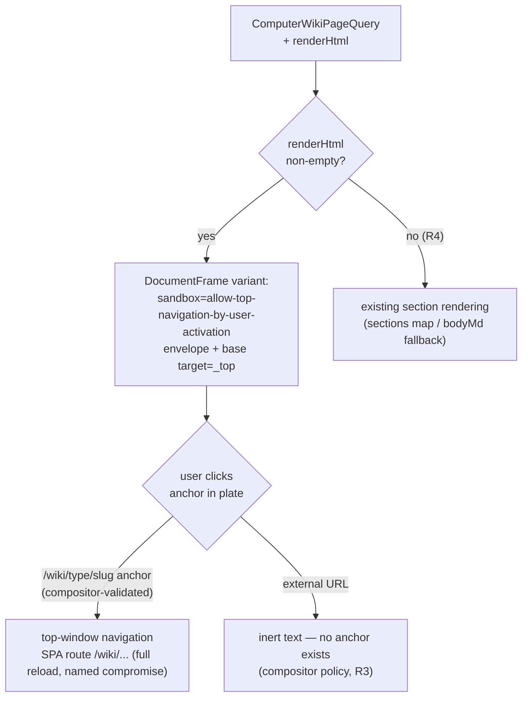

# Web Wiki Reader Renders the HTML Plate - Plan

## Goal Capsule

- **Objective:** The web full-page wiki reader displays a wiki page's stored HTML plate render through the framed document presentation, with in-wiki link clicks navigating the SPA route and un-rendered pages falling back to the current section rendering.
- **Product authority:** `docs/plans/2026-07-12-004-feat-wiki-html-plate-style-plan.md` (THINK-270), unit U3. This artifact scopes that unit for standalone execution as THINK-274; where the two disagree, the parent plan wins.
- **Open blockers:** THINK-273 (parent plan U2) must be merged and deployed to dev before this unit's browser verification can run — `WikiPage.renderHtml` does not exist on `main` yet (verified: `packages/database-pg/graphql/types/` has `renderHtml` only on `Artifact`). Implementation can start against the U2-specified field shape; verification cannot. **Merge is also gated on U2 deployed to dev** (see KTD1) — shipping the query change against a schema without the field breaks every web wiki page fetch.

---

## Product Contract

_Product Contract preservation: unchanged from the merged requirements-only artifact (PR #3664)._

### Summary

When a wiki page carries a compiled HTML plate render, the web full-page wiki reader (`WikiPageView`) displays it through the same framed presentation the HTML-report reader uses, instead of the hand-rendered section layout. Clicking an in-wiki link inside the render navigates the app to that wiki page; external links stay inert; pages without a render keep the existing section rendering. Search palette and entity dossier entry points are unchanged.

### Key Decisions

These are inherited from the parent plan and are settled, not open for re-litigation here.

- **Relaxed frame sandbox plus `<base target="_top">`, not script-based navigation.** The wiki frame renders with `sandbox="allow-top-navigation-by-user-activation"` and an injected `<base target="_top">` so a user click on a `/wiki/...` anchor navigates the top window into the SPA route (parent KTD7). No `allow-scripts`, no postMessage surface — the render stays scriptless.
- **A full SPA reload on in-wiki link clicks is the named v1 compromise.** The click navigates via top-window navigation, so the route rehydrates state. Acceptable because the frame stays scriptless; a follow-up can move to an interception scheme without touching stored renders.
- **Artifact call sites keep `sandbox=""` byte-for-byte.** Only the wiki call site relaxes the sandbox. The document-artifact reader's containment posture must not change, whether the frame gains props or the wiki gets a thin wrapper.
- **Navigation-target safety lives in the compositor, not the frame.** The compositor's internal-link policy (parent KTD5, shipped in U1) is the sole control on which hrefs survive as anchors; the frame CSP does not constrain top-level navigation. This unit trusts the stored render and changes only presentation.
- **The section rendering path is a contract, not legacy.** The existing hand-rendered section layout remains the permanent fallback for pages with a NULL render (parent R9); it must not be removed or degraded.

### Requirements

- R1. When a wiki page's `renderHtml` is non-null, the web full-page wiki reader displays it through the framed document presentation, with the frame sandbox exactly `allow-top-navigation-by-user-activation` and `<base target="_top">` injected into the envelope, themed to the app's current theme. _(parent R6)_
- R2. Clicking an in-wiki link (`/wiki/<type>/<slug>`) inside the render navigates the app to that wiki page. _(parent R8)_
- R3. External URLs in a rendered page are inert text and do not navigate. _(parent R8)_
- R4. When `renderHtml` is null, the page renders exactly as it does today via the section rendering path. _(parent R9)_
- R5. Tenant document palettes apply to the displayed wiki plate the same way they do to document plates. _(parent AE4/R5)_
- R6. The surrounding reader chrome (header, breadcrumbs, related memories) and the search palette and entity dossier entry points behave unchanged, and document-artifact frame call sites keep `sandbox=""`.

### Acceptance Examples

- AE1. **Covers R2.** Given a topic page whose render links to `/wiki/entity/acme-corp`, when the user clicks it, then the app lands on that entity's wiki page (full reload accepted). _(parent AE2)_
- AE2. **Covers R3.** Given a page whose render contains an external URL, when the user clicks it, then nothing navigates — the URL renders as inert text.
- AE3. **Covers R4.** Given a page whose render is missing (compile failure or not yet backfilled), when the user opens it, then the current section rendering displays rather than an error or blank frame. _(parent AE3)_
- AE4. **Covers R5.** Given a tenant with a custom document palette, when a user views a wiki page, then the wiki plate reflects the tenant palette the same way document plates do. _(parent AE4)_

### Scope Boundaries

- The mobile wiki reader is parent unit U4 (THINK-275), not this issue.
- No changes to render generation, persistence, or the GraphQL field — that is U2 (THINK-273); this unit only fetches and displays.
- No restyling of the search palette results, entity dossier card, or graph views — only the full-page reader changes.
- No compositor or plate-registry changes — the internal-link policy and wiki plates are U1 (THINK-272).
- No client-side interception scheme for reload-free in-wiki navigation — deferred follow-up per the named compromise.

### Dependencies / Assumptions

- Depends on THINK-273 (U2) merged and deployed to dev, with dev wiki data backfilled or rebuilt, before browser verification. As of this artifact both THINK-272 and THINK-273 are still pre-implementation.
- Assumes the framed presentation in `apps/web/src/components/workbench/DocumentFrame.tsx` (`withDocumentFrameEnvelope`, srcDoc + CSP envelope + theme stamping) is the pattern to reuse, extended with optional sandbox/base-target variation or wrapped, per parent U3 — implementer's choice, provided artifact call sites are behaviorally byte-identical.
- Assumes verification is a real browser against deployed dev, per the parent plan's U3 flows: search palette → wiki page plate render, in-wiki link click navigation, external link inert, fallback page, dossier entry, light/dark plus tenant palette.

### Sources

- Parent plan U3 section, requirements R6/R8/R9, AE2–AE4, and KTD5/KTD7: `docs/plans/2026-07-12-004-feat-wiki-html-plate-style-plan.md`.
- Current web wiki reader (section rendering path, entry points): `apps/web/src/components/memory/WikiPageView.tsx`; page query `ComputerWikiPageQuery` in `apps/web/src/lib/graphql-queries.ts`.
- Framed presentation to reuse: `apps/web/src/components/workbench/DocumentFrame.tsx` (`sandbox=""` today) and its test `DocumentFrame.test.tsx`; `renderHtml` fetch precedent in `ArtifactDetailForRouteQuery`.
- Sibling unit artifact (shape precedent): `docs/plans/2026-07-12-005-feat-mobile-wiki-plate-reader-plan.md` (THINK-275).
- U2 field-shape authority: `docs/plans/2026-07-12-007-feat-wiki-render-persistence-plan.md` (THINK-273) — `WikiPage.renderHtml: String` nullable, detail query only, `Artifact.renderHtml` precedent.

---

## Planning Contract

### Key Technical Decisions

- KTD1. **The PR merge is gated on THINK-273 deployed to dev, because the query change is a runtime schema contract.** `ComputerWikiPageQuery` is a raw `gql` string in `apps/web/src/lib/graphql-queries.ts`, and that file is explicitly **excluded from graphql-codegen** (`codegen.ts` documents: `"!src/lib/graphql-queries.ts"`) — so adding `renderHtml` is validated by nothing at build time. GraphQL operation validation is all-or-nothing at runtime: requesting `renderHtml` against a deployed schema that lacks the field fails the _entire_ `wikiPage` query, and every web wiki page would render the error state. No defensive dual-query workaround is worth the complexity for a dispatcher-ordered dependency; the Linear `blockedBy` relation on THINK-273 encodes the gate, and the PR must not merge until U2's schema is live on dev. (Same reasoning as the sibling mobile plan's KTD1.)
- KTD2. **`DocumentFrame` gains opt-in variant props with defaults that keep every existing call site byte-identical; no wrapper component.** `DocumentFrameProps` gets an optional sandbox-variant flag (e.g., `navigation?: "none" | "top-by-user-activation"`, default `"none"`), and `withDocumentFrameEnvelope` gains an optional options parameter that injects `<base target="_top">` into the envelope head (immediately after the CSP meta + theme style) only when asked. Defaults preserve today's behavior exactly: `ArtifactBodyView` keeps rendering `sandbox=""` with no base tag, and `PlatePreviewPanel` (which calls `withDocumentFrameEnvelope` directly) keeps producing identical bytes. A separate `WikiPlateFrame` wrapper was rejected: it would duplicate the iframe/theme/testid plumbing to avoid a prop default, and the byte-identity requirement is enforceable by tests either way.
- KTD3. **The frame's sandbox and the base tag travel together as one variant, chosen by the wiki call site.** When the wiki variant is on, the iframe sandbox is exactly `allow-top-navigation-by-user-activation` and the envelope carries `<base target="_top">`; neither appears without the other (a base tag without the sandbox grant is a dead click; the grant without the base tag never fires because frame-internal navigation stays in the frame). Navigation-target safety remains entirely the compositor's internal-link policy (parent KTD5) — the hrefs that survive as anchors in a wiki render are validated `/wiki/<type>/<slug>` paths plus the compositor's existing inert-anchor set (`#` fragments and `mailto:`, per `isInertHref`); no external `http(s)` target is reachable, so granting top navigation does not widen what a stored render can reach. Named consequence of the variant: under `<base target="_top">`, a `mailto:` click may open the mail client and a `#` fragment click retargets the top window rather than scrolling the plate — accepted v1 behavior, no external navigation either way.
- KTD4. **The fetch stays in the legacy query file and the hand-maintained interface; no codegen migration in this unit.** `renderHtml` is added to `ComputerWikiPageQuery`'s selection and to the hand-declared `WikiPageDetail` interface in `WikiPageView.tsx` as `renderHtml?: string | null` — detail query only, never to `WikiSearchQuery` or other list/graph/dossier selections (THINK-273 R4 scope: detail-only exposure). Migrating the wiki queries to typed `graphql()` codegen operations is out of scope; this unit follows the file's existing convention.
- KTD5. **The plate branch replaces only the sections region; all other chrome is untouched.** `WikiPageView` renders the framed plate in place of the sorted-sections map and the `bodyMd` fallback block when `renderHtml` is a non-empty string; the page header (`usePageHeaderActions` breadcrumbs), in-page title/badge/compiled-date header, summary, aliases, and `RelatedMemories` all render identically in both branches. Entry points (`wiki.$type.$slug` route, `ChatSidebar.openSearchWiki`, `EntityDossierCard`) are not touched — they navigate to the same route (R6).
- KTD6. **Theming reuses `useTheme` → `documentThemeToken` inside `DocumentFrame` unchanged.** The wiki call site uses the `DocumentFrame` component (not a hand-rolled iframe), so light/dark stamping (`data-theme`, `color-scheme`) and CSP come free and stay consistent with the artifact reader (R1 theming, R5 via the render's baked tenant palette).
- KTD7. **Frame height: full-height plate region inside the existing page scroll, execution-time exact.** The default `DocumentFrame` height (`h-[560px]`) is wrong for a primary reading surface; the wiki call site should use the `fullHeight` variant or an explicit tall layout so the plate is the page's reading pane. The binding constraint is: never a collapsed or letterboxed frame that makes the wiki feel worse than the section layout; exact layout classes are an implementation detail to settle in the browser.

### High-Level Technical Design

Render and navigation flow (directional guidance, not implementation specification):

The compositor's link policy (parent KTD5, ships with U1/THINK-272 — still pre-implementation as of this artifact) is what makes the relaxed sandbox safe: external and malformed `http(s)` hrefs never survive as anchors, so the only reachable navigation targets are validated wiki routes (plus the compositor's pre-existing `#`/`mailto:` anchor set, per KTD3). THINK-272 is a transitive precondition via THINK-273 (parent sequencing U1 → U2 → U3): renders with live wiki anchors cannot exist on dev without it, and today's compositor fails safe by inerting all non-`#`/`mailto:` hrefs.

### Assumptions

Recorded autonomously (headless planning run):

- The `data-testid="document-frame"` testid is shared by both variants; tests distinguish them by the `sandbox` attribute value, not by testid.
- An empty-string `renderHtml` is treated the same as null (fallback) — defensive branch guard, matching `ArtifactBodyView`'s falsy check on `displayHtml`.
- No codegen regeneration is needed in this PR: the changed query file is excluded from codegen, and the schema change (with codegen regen in all consumers) ships with THINK-273.

---

## Implementation Units

Plan-local U-IDs (distinct from the parent plan's U1–U4). All three units land in **one PR** (see Checkpoint PR boundary below).

### U1. Wiki detail query and interface carry renderHtml

- **Goal:** `WikiPageView`'s data layer returns `renderHtml` on the detail query.
- **Requirements:** R1 (fetch half); KTD1, KTD4.
- **Dependencies:** none in-repo; **merge** gated on THINK-273 deployed to dev (KTD1).
- **Files:**
  - `apps/web/src/lib/graphql-queries.ts` — add `renderHtml` to `ComputerWikiPageQuery`'s `wikiPage` selection.
  - `apps/web/src/components/memory/WikiPageView.tsx` — add `renderHtml?: string | null` to the local `WikiPageDetail` interface.
- **Approach:** Mirror `ArtifactDetailForRouteQuery`'s `renderHtml` selection. Do not touch `WikiSearchQuery` or any list/graph/dossier selection (KTD4).
- **Test scenarios:** Test expectation: none — pure query-string/type addition with no logic; behavior is proven by U3's rendering tests and the dev browser verification.
- **Verification:** monorepo typecheck green; `renderHtml` appears in no wiki list/search query (grep).

### U2. DocumentFrame opt-in navigation variant

- **Goal:** `DocumentFrame`/`withDocumentFrameEnvelope` can produce the wiki presentation (relaxed sandbox + `<base target="_top">`) while every existing call site stays byte-identical.
- **Requirements:** R1 (frame half), R6 (artifact posture); KTD2, KTD3, KTD6.
- **Dependencies:** none.
- **Files:**
  - `apps/web/src/components/workbench/DocumentFrame.tsx` — optional variant prop on `DocumentFrameProps`; optional envelope option injecting `<base target="_top">`; iframe sandbox derived from the variant (`""` default, `allow-top-navigation-by-user-activation` for the wiki variant).
  - `apps/web/src/components/workbench/DocumentFrame.test.tsx` — extend.
- **Approach:** The base tag is injected in `withDocumentFrameEnvelope` alongside the CSP meta and theme style so it lands inside `<head>` in every envelope shape (with or without an existing `<head>`/`<html>`). The sandbox attribute must remain literally present on the iframe in both variants (an absent sandbox attribute is a fully privileged frame — never allowed).
- **Test scenarios:**
  - Default variant: iframe `sandbox` attribute is exactly `""` (the existing assertion stays, proving artifact call sites are unchanged); envelope contains no `<base` tag.
  - Wiki variant: iframe `sandbox` attribute is exactly `allow-top-navigation-by-user-activation` (no other tokens); envelope contains `<base target="_top">` inside the head, after the CSP meta.
  - Envelope without an `<html>`/`<head>` wrapper still receives CSP + theme + base in the wiki variant (prepend path).
  - Default-variant envelope output for a fixed input is byte-identical to the pre-change output (covers `PlatePreviewPanel`, which calls `withDocumentFrameEnvelope` directly).
  - Theme stamping (`data-theme`, `color-scheme`) unchanged in both variants.
- **Verification:** `pnpm --filter @thinkwork/web test` green including the untouched default-variant assertions; `ArtifactBodyView.test.tsx` passes unmodified.

### U3. WikiPageView renders the plate with section fallback

- **Goal:** The wiki reader shows the framed plate when `renderHtml` is present, keeps the exact existing section rendering when it is not, and leaves all chrome and entry points unchanged.
- **Requirements:** R1–R6, AE1–AE4; KTD5, KTD7.
- **Dependencies:** U1, U2.
- **Files:**
  - `apps/web/src/components/memory/WikiPageView.tsx` — plate branch replacing the sections region (sorted-sections map + `bodyMd` fallback block) when `renderHtml` is non-empty; existing rendering otherwise.
  - `apps/web/src/components/memory/WikiPageView.test.tsx` — extend.
- **Approach:** Render `<DocumentFrame html={page.renderHtml} title={page.title} …/>` with the wiki variant prop (KTD3) and a full-height reading-pane layout (KTD7). Header, summary, aliases, and `RelatedMemories` render in both branches (KTD5). In-wiki click navigation needs no client code: the compositor-validated anchor plus the variant's sandbox/base combination performs top-window navigation into the SPA route (R2, full reload accepted).
- **Test scenarios:**
  - Covers AE3/R4: `renderHtml` null + sections present → section rendering (assert a known section heading renders, no iframe); `renderHtml` non-empty → iframe with `data-testid="document-frame"` present and section markup absent.
  - Covers R1: the wiki iframe's `sandbox` attribute is exactly `allow-top-navigation-by-user-activation` and its `srcdoc` contains `<base target="_top">`.
  - Empty-string `renderHtml` → section rendering (falsy guard).
  - `renderHtml` present with zero sections → plate renders (no dependency on sections for the plate branch).
  - Chrome invariance: title/summary/aliases and mocked `RelatedMemories` render in both branches.
- **Verification:** `pnpm --filter @thinkwork/web test` green; the real-browser flows in the Verification Contract below — this unit owns all six.

### Checkpoint PR boundary

**One PR for U1+U2+U3** (branch `eric1/think-274-web-wiki-reader-renders-the-html-plate-think-270-u3` or the dispatcher's auto branch). Justification for grouping: U1 alone fetches a field nothing displays; U2 alone is a frame variant nothing uses; neither is independently verifiable or valuable, and the parent plan and the Linear issue both specify one PR for this unit. The PR merges only after THINK-273 is merged **and deployed to dev** (KTD1).

No Linear child issues: THINK-274 is itself the shippable unit (a child of THINK-270), the sibling THINK-275 set the one-issue/one-PR precedent, and the plan-local units are not independently shippable.

### Rollout / sequencing notes

1. Implementation can start immediately against the U2-specified field shape (`WikiPage.renderHtml: String`, nullable, detail query only — confirmed against `docs/plans/2026-07-12-007-feat-wiki-render-persistence-plan.md` R4).
2. Local gates (web tests, typecheck, lint) can go green before THINK-273 lands; the PR then **waits** for THINK-273 deployed to dev before merge (KTD1).
3. Browser verification additionally needs dev wiki data backfilled or rebuilt (THINK-273 backfill/AE1), then runs the flows below.
4. No migration, no Terraform, no Lambda, no codegen changes — this is web-client-only; the merge pipeline's web deploy is the only rollout surface, and the section fallback (R4) means pages without renders are unaffected at any deploy order.

### Risks

- **Merging ahead of the U2 dev deploy breaks all web wiki pages** (KTD1) — the raw-gql query is invisible to codegen and CI, so nothing but the merge gate catches it. Mitigated by the Linear `blockedBy` relation and an explicit merge-gate callout in the PR description.
- **Artifact containment regression via the variant default** — a wrong default or a call-site typo would relax the document-artifact sandbox. Mitigated by keeping the existing `sandbox=""` literal assertions and the byte-identity envelope test (U2 scenarios) as regression tripwires.
- **Anchor clicks do nothing in the real browser** despite green unit tests — the sandbox/base interaction only proves itself in a real browser (jsdom does not navigate). Mitigated by the mandatory browser flow 2; if clicks are dead, first check that both halves of KTD3 are present in the served envelope.
- **Full-reload navigation feels broken** (state flash on wiki-link clicks) — named v1 compromise, accepted in the parent plan; not a defect. A reload-free interception scheme is the deferred follow-up.
- **Plate layout regressions** (collapsed frame, double scrollbars) — KTD7 sets the constraint; settle exact layout in the browser during verification.

### Deferred to implementation

- Exact plate-region layout classes / height strategy (`fullHeight` vs explicit pane) — KTD7 sets the constraint, not the pixels.
- The variant prop's name and shape (`navigation` enum vs boolean) — KTD2 fixes the semantics and defaults, not the identifier.
- Whether `WikiPageView.test.tsx`'s urql mock needs a `ThemeProvider` wrapper once the frame renders — mechanical test-harness detail.

---

## Verification Contract

Gates (all must pass before the PR merges):

| Gate                      | Command / evidence                                                                                                                              | Owner unit |
| ------------------------- | ----------------------------------------------------------------------------------------------------------------------------------------------- | ---------- |
| Web unit tests            | `pnpm --filter @thinkwork/web test` (DocumentFrame + WikiPageView suites)                                                                       | U2, U3     |
| Monorepo checks           | `pnpm lint && pnpm typecheck && pnpm test && pnpm format:check` (pre-commit) + CI                                                               | all        |
| Query hygiene             | `renderHtml` present only in `ComputerWikiPageQuery` among wiki queries (grep)                                                                  | U1         |
| Merge gate                | THINK-273 merged and deployed to dev (dev GraphQL schema serves `WikiPage.renderHtml`)                                                          | U1 (KTD1)  |
| Browser-flow precondition | THINK-272 internal-link policy live in the dev compositor (transitive via THINK-273 per parent sequencing) and dev wiki data backfilled/rebuilt | U3 flows   |

End-to-end user flows (real browser signed into deployed dev, after THINK-273 is deployed and dev wiki data is backfilled/rebuilt; these are the flows verification drives, per the parent plan's U3 contract):

1. **Search palette → plate render + theme (R1/R5/AE4):** Open the search palette, search an entity, open its wiki page — the plate render displays with house styling; toggle light/dark — the plate follows; with a tenant document palette set, the wiki plate reflects it the way document plates do (R5/AE4).
2. **In-wiki click navigates (AE1/R2):** Click an in-wiki link inside the render — the app lands on the target wiki page's route (full reload accepted); the reader renders that page.
3. **External URL inert (AE2/R3):** Find a page whose render contains an external URL — it renders as inert text and clicking does nothing. If no such page exists in the backfilled dev data, seed the condition (author/compile a memory or wiki page whose source includes an external URL) rather than skipping the check — this flow is the live proof of the security model's key exposure and must not pass vacuously.
4. **Fallback (AE3/R4):** Open a page known to lack a render — the existing section rendering displays; no error, no blank frame.
5. **Dossier entry (R6):** Open a wiki page from the entity dossier card — same reader, same behavior, entry point unchanged.
6. **Artifact regression (R6):** Open a document artifact in the artifacts reader — frame renders with `sandbox=""` behavior unchanged (spot-check an external link stays inert and the document displays normally).

---

## Definition of Done

- All three units merged to `main` in one PR with all CI checks green, **after** THINK-273 is deployed to dev.
- The six verification flows above observed against deployed dev in a real browser and evidence recorded on THINK-274.
- The section rendering path is intact (R4 is a permanent contract), document-artifact call sites still render `sandbox=""` with no base tag, and `renderHtml` appears in no wiki list/search query.
- No changes to search palette, dossier, or graph surfaces beyond none-at-all (R6).
