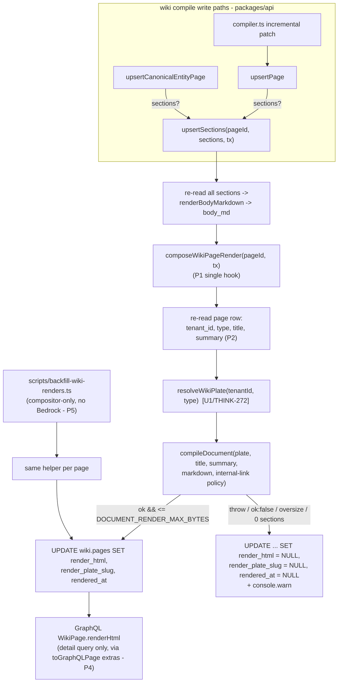

# Wiki Page Render Persistence, GraphQL renderHtml, and Backfill - Plan

## Goal Capsule

- **Objective:** Every wiki page write path persists a compositor-produced HTML plate render alongside the canonical markdown, clients can fetch it through a `WikiPage.renderHtml` GraphQL field on the detail query, and existing pages can be backfilled in batch without an LLM recompile.
- **Product authority:** `docs/plans/2026-07-12-004-feat-wiki-html-plate-style-plan.md` (THINK-270), unit U2. This artifact scopes that unit for standalone execution as THINK-273; where the two disagree, the parent plan wins.
- **Execution profile:** One PR for the whole unit (parent plan execution profile). The plan-local units U1–U4 below are dependency-ordered commit-sized steps inside that single PR, not separate PRs — the migration, repository hook, GraphQL field, and backfill are one transactional capability that is unverifiable in pieces.
- **Open blockers:** THINK-272 (parent plan U1) must be merged before this unit can compile a render — `resolveWikiPlate` and the `WIKI_PLATES` definitions do not exist on `main` yet. Implementation can be drafted against the U1-specified interfaces (`resolveWikiPlate(tenantId, pageType, store?)`, `compileDocument` with the internal-link policy option); tests and dev verification cannot pass until U1 lands.

---

## Product Contract

Product Contract preservation: **unchanged** from the requirements-only revision (merged to main in PR #3665). Planning added the Planning Contract, Implementation Units, Verification Contract, and Definition of Done below; no R/AE IDs were altered.

### Summary

When the wiki compile pipeline writes a page — full upsert, canonical-entity upsert, or an incremental section patch — it also compiles the page's sections through the Document Compositor into a self-contained HTML plate render and stores it on the page row. The render is best-effort: any compile failure or oversize output persists a NULL render and never fails the compile. A `renderHtml` field on the `WikiPage` detail query exposes the stored render to web, mobile, and CLI clients, and an operator batch script backfills renders for already-compiled pages from their stored sections without invoking any LLM.

### Key Decisions

These are inherited from the parent plan and are settled, not open for re-litigation here.

- **Render is stored as nullable columns on `wiki.pages`, not a sibling table or S3.** New columns `render_html`, `render_plate_slug`, `rendered_at` keep the render transactionally consistent with the sections it derives from and make the read path a plain GraphQL field (parent KTD1).
- **Regeneration hooks the existing `body_md` rewrite seam, no new trigger or queue.** `upsertPage`, `upsertCanonicalEntityPage`, and `upsertSections` in `packages/api/src/lib/wiki/repository.ts` already assemble full-page markdown via `renderBodyMarkdown(sections)`; the render is produced at those same points from the same assembled content (parent KTD2). Verified: all three functions exist on `main` and funnel through that seam.
- **Render generation is best-effort; failure degrades to NULL, never fails the compile.** Plate-resolution throws, compositor `ok: false` diagnostics, and outputs over the 256 KiB document render cap all persist the page with `render_html = NULL` and logged diagnostics (parent KTD3, KTD6). The NULL render is safe because the readers' markdown fallback is a permanent contract (parent R9).
- **Markdown sections stay canonical; the render is derived and rebuildable.** The render is regenerated whenever a page's sections change through the compile pipeline; rebuilding a page regenerates its render (parent R3).
- **The schema change ships as a hand-rolled migration on the `wiki` schema.** Post-journal wiki changes are hand-rolled SQL with `-- creates-column:` markers, psql-applied to dev before the PR merges so the `db:migrate-manual` drift gate passes (parent KTD9).
- **Tenant palettes bake into the stored render at compile time.** A palette change applies on the next compile/rebuild/backfill — the same semantics document artifacts already have (parent KTD8).
- **The backfill is a compositor-only batch script, not per-page manual work.** It recompiles renders from stored sections with no Bedrock calls, mirroring the existing document-render backfill precedent; the normal compile path and `thinkwork wiki rebuild` regenerate renders on their own (parent R10).

### Requirements

- R1. Every page persisted through the wiki compile write paths (`upsertPage`, `upsertCanonicalEntityPage`, `upsertSections`) carries a plate render — self-contained, sanitized, scriptless HTML compiled from its sections via the Document Compositor with the page type's wiki plate — stored with the plate slug used and a render timestamp. _(parent R1, R2)_
- R2. When a page's sections change through the compile pipeline, its stored render is regenerated in the same write; the markdown sections remain the canonical compiled form. _(parent R3)_
- R3. Render generation never fails a page write: plate-resolution errors, compositor failures, oversize output (over the document render byte cap), and zero-section pages all persist the page with a NULL render and logged diagnostics. _(parent KTD3, KTD6)_
- R4. The `wikiPage` GraphQL detail query exposes `renderHtml`; list and search surfaces (`wikiSearch`, graph, dossier) do not carry it. Codegen is regenerated in every consumer (`@thinkwork/api`, `@thinkwork/web`, `@thinkwork/mobile`, `thinkwork-cli`).
- R5. An operator batch script backfills renders for existing pages from their stored sections, compositor-only (no LLM), and is idempotent — re-running over already-rendered pages produces the same bytes. _(parent R10, AE1)_
- R6. The `wiki.pages` schema change ships as a hand-rolled migration with `-- creates-column:` markers, applied to dev via psql before the PR merges.

### Acceptance Examples

- AE1. **Covers R1, R2.** Given a page written through `upsertSections` patching one section, when the write completes, then `render_html` reflects the new section content, `rendered_at` is updated, and the render contains the plate shell for the page's wiki plate slug.
- AE2. **Covers R3.** Given a page whose plate resolution throws or whose compositor output exceeds the byte cap, when the write completes, then the page row persists with `render_html` NULL and no exception escapes the compile.
- AE3. **Covers R4.** Given a compiled page with a stored render, when a client queries `wikiPage` on deployed dev, then `renderHtml` returns the sanitized HTML document; `wikiSearch` results for the same page carry no render.
- AE4. **Covers R5.** Given dev wiki pages compiled before this feature, when the operator runs the backfill script against dev, then pages with sections gain renders without any Bedrock invocation, and a second run leaves them byte-identical. _(parent AE1)_

### Scope Boundaries

- No reader changes — web is parent unit U3 (THINK-274), mobile is U4 (THINK-275); this unit only persists and exposes the render.
- No plate definitions or compositor changes — wiki plates and the internal-link policy are U1 (THINK-272); this unit consumes `resolveWikiPlate` and `compileDocument` as delivered.
- No changes to the compile pipelines' content decisions (planner/graph) — presentation only.
- No S3 storage, no artifact rows, no document-emission path for wiki pages (parent scope: wiki pages do not become document artifacts).
- Detail-only GraphQL exposure; no render on list, search, graph, or dossier payloads.

### Dependencies / Assumptions

- Depends on THINK-272 (U1) merged: `WIKI_PLATES` in `plate-definitions.ts`, `resolveWikiPlate` in `plate-registry.ts`, and the compositor internal-link policy. As of this artifact U1 is still pre-implementation.
- One PR, per the parent plan's execution profile. The migration takes the next free hand-rolled number (0245 verified free — `0244_system_automations_and_memory_stage_overrides.sql` is the latest on main; renumber if taken at implementation time).
- Assumes the `wiki-compile` Lambda needs no `build-lambdas.sh` changes — it already inlines `packages/api` code, is in the `BUNDLED_AGENTCORE_ESBUILD_FLAGS` handler list, and the compositor dependencies (`marked`, `sanitize-html`) are pure JS (verified in `scripts/build-lambdas.sh`).
- End-to-end dev verification per the parent contract: migration psql-applied to dev with `pnpm db:migrate-manual` reporting the columns present; a compile on dev followed by `wikiPage.renderHtml` returning HTML via the dev GraphQL endpoint; the backfill script run against dev (AE4).
- The 256 KiB cap reuses the existing document render size discipline (`DOCUMENT_RENDER_MAX_BYTES = 256 * 1024`, defined in `packages/api/src/lib/artifacts/document-preflight.ts`).

### Sources

- Parent plan U2 section, requirements R1/R2/R3/R10, AE1, and KTD1–KTD3/KTD6/KTD8/KTD9: `docs/plans/2026-07-12-004-feat-wiki-html-plate-style-plan.md`.
- Write seam: `packages/api/src/lib/wiki/repository.ts` (`upsertPage`, `upsertCanonicalEntityPage`, `upsertSections`, `renderBodyMarkdown`); schema `packages/database-pg/src/schema/wiki.ts` (`wiki` pgSchema).
- GraphQL source: `packages/database-pg/graphql/types/wiki.graphql`; `renderHtml` precedent on `Artifact` in `artifacts.graphql`.
- Backfill precedent: `packages/api/scripts/backfill-document-renders.ts`.
- Migration discipline: `docs/solutions/workflow-issues/manually-applied-drizzle-migrations-drift-from-dev-2026-04-21.md`.
- Sibling unit artifacts (shape precedent): `docs/plans/2026-07-12-005-feat-mobile-wiki-plate-reader-plan.md` (THINK-275), `docs/plans/2026-07-12-006-feat-web-wiki-plate-reader-plan.md` (THINK-274).

---

## Planning Contract

Parent KTD1–KTD3, KTD6, KTD8, KTD9 are inherited verbatim (see Key Decisions above). Planning-time research against current `main` adds the following plan-local decisions.

### Key Technical Decisions

- P1. **One render hook at the tail of `upsertSections`, not three.** Repo verification shows all write paths converge: `upsertPage` (repository.ts ~1524) and `upsertCanonicalEntityPage` (~1687) both delegate section persistence to `upsertSections(page.id, sections, tx)` — and those two are the **only** callers of `upsertSections` on main; the incremental-patch paths in `packages/api/src/lib/wiki/compiler.ts` funnel through `upsertPage` with the patched section subset (compiler.ts ~849). `upsertSections` re-reads the full section list via `listPageSections` and rewrites `body_md` at its tail (~1804). Placing `composeWikiPageRender` at that single tail point — immediately after the `body_md` rewrite, inside the same transaction/client — covers every path with one seam and one test surface. `upsertPage`'s direct `body_md` computation at ~1462 stays as-is (it is overwritten by the `upsertSections` rewrite when sections are present). Caveat for future callers: the hook covers every **section-bearing** write; a metadata-only `upsertPage` update on an already-rendered page would leave the baked-in title/summary stale in the render — accepted because no current caller does metadata-only updates and R2 ties regeneration to section changes. This refines parent KTD2's "produce at those same points" into a concrete single placement; behavior is identical.
- P2. **The render helper re-reads the page row for context.** `upsertSections(pageId, sections, db)` receives no tenant/type/title/summary. Rather than widening its signature (which would touch `upsertPage`, `upsertCanonicalEntityPage`, and `compiler.ts` call sites), the helper does one `SELECT tenant_id, type, title, summary FROM wiki.pages WHERE id = …` on the same client before compiling. One cheap indexed read per page write, zero call-site churn.
- P3. **Byte-cap check reuses `DOCUMENT_RENDER_MAX_BYTES` from `document-preflight.ts` directly** — no new constant, no duplicated limit. Oversize output → NULL render + `console.warn` with page id and byte count (KTD3/KTD6 semantics).
- P4. **`renderHtml` rides the existing `extras` parameter of `toGraphQLPage`.** `toGraphQLPage(row, { sections, aliases })` in `packages/api/src/graphql/resolvers/wiki/mappers.ts` is shared by list surfaces (`fieldResolvers.ts`, `wikiConnectedPages.query.ts`) which pass `{ sections: [], aliases: [] }`. `renderHtml` becomes an optional extra populated **only** by `wikiPage.query.ts`, so list/graph/connected surfaces stay render-free by construction (R4). `WikiSearchResult` is a separate GraphQL type and needs no change. Known cost, accepted: the render-free guarantee holds at the GraphQL layer only — bare Drizzle `.select()` reads of `wiki.pages` (e.g., `wikiBacklinks.query.ts`, `wikiConnectedPages.query.ts`, various repository lookups) will fetch the new `render_html` column (≤256 KiB) from Postgres without exposing it. Accepted at current wiki corpus sizes; explicit column projection on those reads is the lever if it ever shows up in Lambda memory/latency.
- P5. **Backfill script mirrors `backfill-document-renders.ts` operational shape:** `--dry-run`, `--limit N` (canary batch), `--tenant <slug>`, `--concurrency N` flags; per-page failures are reported and skipped, never abort the run; exits 1 only on fatal errors. Selection: pages with ≥1 section; `--force` recompiles pages that already have a render (default skips them), keeping the default run cheap and the idempotency check (AE4) explicit.

### Assumptions

Recorded autonomously (headless planning run):

- THINK-272 delivers `resolveWikiPlate(tenantId, pageType, store?)` returning a resolved plate compatible with `compileDocument`, and a `CompileDocumentInput` option enabling the `/wiki/` internal-link policy, exactly as specified in the parent plan's U1 section. If the landed interface differs, adapt the helper — the parent plan wins on semantics.
- Migration number 0245 is used; if another PR takes it first, renumber (mechanical).
- The render is compiled from the same assembled markdown the `body_md` rewrite produces (`renderBodyMarkdown` output of the full section list), with page `title`/`summary` passed to the compositor as document title/summary — matching how document plates consume title + body.
- Zero-section pages: `upsertSections` is only invoked with a non-empty section list from all current callers, but the helper still guards — an empty re-read section list yields NULL render, no compile attempt (R3).
- `rendered_at`/`render_plate_slug` are set NULL whenever `render_html` is NULL (all-or-nothing triple), so consumers never see a stale slug/timestamp against a NULL render.

### High-Level Technical Design

### Sequencing

U1 → U2 → U3 → U4, all in one PR. U2's tests can be written against the U1 schema immediately; U3's codegen depends on U2's field existing in the GraphQL source only formally (it can land in the same commit series in any order after U1). Implementation of the render compile inside U2 requires THINK-272 merged; everything else (migration, column plumbing, GraphQL field returning the stored column, backfill scaffolding) is buildable before it.

---

## Implementation Units

One PR total (parent execution profile). Units below are dependency-ordered steps with their own test scenarios; treat each as roughly one commit.

### U1. Schema columns + hand-rolled migration

- **Goal:** `wiki.pages` gains `render_html text`, `render_plate_slug text`, `rendered_at timestamptz` (all nullable), in both the live dev database and the Drizzle schema.
- **Requirements:** R6; parent KTD1, KTD9.
- **Dependencies:** none.
- **Files:**
  - `packages/database-pg/drizzle/0245_wiki_page_render.sql` (renumber if taken) — hand-rolled, `BEGIN/COMMIT`, `ADD COLUMN IF NOT EXISTS` ×3, header with psql-apply instructions and markers `-- creates-column: wiki.pages.render_html` / `-- creates-column: wiki.pages.render_plate_slug` / `-- creates-column: wiki.pages.rendered_at`. Mirror the header format of `packages/database-pg/drizzle/0243_section_sources_thread_refs.sql`.
  - `packages/database-pg/src/schema/wiki.ts` — add the three columns to `wikiPages`.
- **Approach:** Additive nullable columns, safe to apply ahead of code deploy. Do **not** register in `meta/_journal.json` (hand-rolled discipline). Not in the `public` schema, so the only-touch-public guardrail doesn't apply — `wiki.*` is the established home for these tables.
- **Execution note:** psql-apply to dev before the PR merges, then confirm `pnpm db:migrate-manual` reports all three columns present — the deploy workflow runs this reporter as a gate.
- **Test scenarios:** Test expectation: none — additive schema/migration step; behavior is covered by U2's repository tests, and the drift reporter verifies the applied migration.
- **Verification:** `pnpm --filter @thinkwork/database-pg build` green; `pnpm db:migrate-manual` (against dev, post-apply) lists the three `wiki.pages` columns as present.

### U2. Render helper + single repository hook

- **Goal:** Every section-bearing page write persists a plate render (or an explicit NULL triple on failure) in the same transaction as the `body_md` rewrite.
- **Requirements:** R1, R2, R3, AE1, AE2; parent KTD2, KTD3, KTD6; P1–P3.
- **Dependencies:** U1; THINK-272 merged (for the real compile path — the helper's structure and failure paths are testable with a mocked/injected compile before then).
- **Files:**
  - `packages/api/src/lib/wiki/repository.ts` — new `composeWikiPageRender` helper (or a small sibling module `packages/api/src/lib/wiki/render.ts` if repository.ts bloat argues for it; implementer's choice) + one call at the `upsertSections` tail after the `body_md` update, same `db` client.
  - `packages/api/src/lib/wiki/repository.test.ts` — extend.
- **Approach:** Helper flow per P1/P2: re-read page row → guard zero sections → `resolveWikiPlate(tenant_id, type)` → `compileDocument` with title/summary/assembled markdown + internal-link policy → byte-cap check against `DOCUMENT_RENDER_MAX_BYTES` → single `UPDATE` setting either the full triple or the NULL triple. Entire helper wrapped so no throw escapes into the page write (R3); failures `console.warn` with page id + reason. The update runs on the same client/transaction as the `body_md` rewrite, so render and sections commit atomically (KTD1). **Transaction-abort guard:** a caught JS error is not enough for DB-level failures — a Postgres error on the shared tx client aborts the enclosing transaction, and any follow-up NULL-triple UPDATE (and the outer commit) would then fail with "current transaction is aborted", violating R3. Run the helper's tx-client statements (page-row re-read + render UPDATE) inside a nested transaction (Drizzle nests as a SAVEPOINT) so a DB-level failure rolls back to the savepoint, the helper degrades to a no-op/NULL outcome, and the outer section/body_md write still commits.
- **Test scenarios:**
  - Covers AE1. `upsertSections` patching one section on a page with an existing render: `render_html` reflects the new section content, `rendered_at` advances, `render_plate_slug` matches the page type's wiki plate.
  - `upsertPage` with sections (create path): row lands with non-null `render_html` containing the plate shell and all section headings; `upsertCanonicalEntityPage` with sections: same outcome (both prove the delegation coverage of P1).
  - Covers AE2. Plate resolution throws → page row persists, NULL triple, no exception escapes. `compileDocument` returns `ok: false` (e.g., stray `tw:` fence under `allowedDirectives: []`) → same outcome, diagnostics logged.
  - Oversize render (cap mocked small) → NULL triple, page persists.
  - Page row deleted between write and helper re-read (or zero sections on re-read) → helper no-ops without throwing.
  - DB-level failure: the render UPDATE itself rejects at the Postgres level → savepoint rolls back, no "current transaction is aborted" poisoning, and the outer page/section write still commits (R3).
  - A previously rendered page whose new compile fails → render cleared to the NULL triple (no stale render surviving a failed regeneration).
  - Determinism: two identical writes produce byte-identical `render_html`.
- **Verification:** `pnpm --filter @thinkwork/api test` green (full package suite, not just the touched file).

### U3. GraphQL `renderHtml` (detail-only) + codegen

- **Goal:** `wikiPage` detail query returns the stored render; no list/search/graph surface carries it; all four codegen consumers regenerate.
- **Requirements:** R4, AE3; P4.
- **Dependencies:** U1 (column exists for the mapper); independent of U2's compile logic.
- **Files:**
  - `packages/database-pg/graphql/types/wiki.graphql` — `renderHtml: String` on `type WikiPage` (nullable; precedent: `Artifact.renderHtml`, `artifacts.graphql`).
  - `packages/api/src/graphql/resolvers/wiki/mappers.ts` — optional `renderHtml` on `GraphQLWikiPage` + `toGraphQLPage` extras (P4).
  - `packages/api/src/graphql/resolvers/wiki/wikiPage.query.ts` — pass `renderHtml: page.render_html` in the extras.
  - Codegen outputs: `pnpm --filter @thinkwork/api codegen`, `@thinkwork/web`, `@thinkwork/mobile`, `thinkwork-cli` (per each package's `codegen` script) + `pnpm schema:build` for the AppSync subscription schema.
  - `packages/api/src/graphql/resolvers/wiki/` tests — extend whichever resolver test covers `wikiPage` mapping (or add one alongside `auth.test.ts` conventions).
- **Approach:** Schema-first: edit the canonical `.graphql`, then regenerate everywhere (GraphQL-schema/resolver drift is a known cold-start-death outage mode — field and resolver must land together). List surfaces keep passing `{ sections: [], aliases: [] }` and never see the column.
- **Test scenarios:**
  - Covers AE3. `wikiPage` resolver maps a row with `render_html` set → response `renderHtml` equals the stored HTML; row with NULL → `renderHtml` null.
  - `toGraphQLPage` without the extra (list-surface call shape) yields no `renderHtml` payload (undefined/absent), proving `wikiSearch`/graph/connected surfaces stay render-free.
- **Verification:** `pnpm -r --if-present typecheck` green across the monorepo (codegen drift in any consumer fails here); `pnpm format:check` clean (web codegen convention: prettier only `graphql.ts`).

### U4. Compositor-only backfill script

- **Goal:** Operators can batch-render all existing compiled pages on a stage from stored sections, without any LLM/Bedrock call, idempotently.
- **Requirements:** R5, AE4; parent R10; P5.
- **Dependencies:** U1, U2 (reuses `composeWikiPageRender`); THINK-272 merged to actually produce renders.
- **Files:**
  - `packages/api/scripts/backfill-wiki-renders.ts` — new; mirror `packages/api/scripts/backfill-document-renders.ts` (header usage docs, CLI flag parsing, concurrency loop, per-page error reporting, summary output).
  - Backfill core logic test only if extracted into a lib module (mirroring `document-backfill.ts`); a thin script over the U2 helper needs no dedicated unit test — the helper's suite covers the compile semantics.
- **Approach:** Select `wiki.pages` rows (optionally tenant-filtered) having ≥1 `wiki.page_sections` row; default skips pages with a non-null `render_html` (`--force` recompiles them); for each, invoke the same helper U2 added, honoring `--dry-run` (report only), `--limit`, `--concurrency`. No Bedrock client anywhere in the import graph. Reports counts: rendered, skipped-already-rendered, failed (NULL triple), dry-run-would-render. Concurrent-compile guard: capture the page's `updated_at` when reading sections and make the render UPDATE conditional on it being unchanged (compare-and-set), counting skipped-due-to-concurrent-write pages in the summary — a live compile racing the backfill must not have its fresher render overwritten by one built from an older section snapshot.
- **Test scenarios:**
  - Covers AE4. Fixture set: pages with sections gain renders; a second run with default flags reports them as skipped; a second run with `--force` produces byte-identical `render_html` (deterministic compositor).
  - A page whose compile fails is reported and does not abort the batch.
- **Verification:** Script runs against dev (`--limit 5` canary first, then full): previously compiled pages gain renders, no Bedrock invocations appear in the run output/logs, and a repeat run is idempotent per AE4.

---

## Verification Contract

Per-unit gates above, plus these end-to-end flows against **deployed dev** that prove the unit works. This unit has no browser-rendered surface of its own (readers are THINK-274/275), so the E2E proof is at the data/API layer, driven against the live dev stack:

| # | Flow | Proves |
|---|---|---|
| 1 | psql-apply `0245_wiki_page_render.sql` to dev; run `pnpm db:migrate-manual` and see all three `wiki.pages.render_*` columns reported present | R6, drift gate will pass post-merge |
| 2 | Trigger a compile on dev (`thinkwork wiki compile` via CLI, or the operator `compileWikiNow` mutation from the web app) for a tenant with memories; then query `wikiPage` for a compiled page via the dev GraphQL endpoint as an authenticated user and confirm `renderHtml` returns a self-contained sanitized HTML document whose `tw-plate` meta names the page type's wiki plate slug | R1, R2, AE3 — the full write→store→read loop live |
| 3 | Same dev session: run a `wikiSearch` query for that page's title and confirm the result payload carries no `renderHtml` | R4 detail-only exposure |
| 4 | Run `backfill-wiki-renders.ts --dry-run` then `--limit 5` then full against dev; confirm previously compiled pages gain renders, the summary shows zero Bedrock calls (compositor-only path), and an immediate re-run reports all pages skipped/byte-identical | R5, AE4 |
| 5 | Executable failure recipe on dev: via psql, append a disallowed `tw:` directive fence to one section's `body_md` on an already-rendered page (wiki plates set `allowedDirectives: []`, so this forces a compositor `ok: false`), run `backfill-wiki-renders.ts --force --limit 1` scoped to that page, confirm the row persists with the NULL triple and the run exits normally; restore the section and re-run to confirm the render returns | R3, AE2 in the deployed environment |
| Gate | `pnpm lint && pnpm typecheck && pnpm test && pnpm format:check` (pre-commit), full `pnpm --filter @thinkwork/api test` and `pnpm --filter @thinkwork/database-pg build` | all units |

Flow 2/3 can be driven from a real browser session on dev web (network tab or an authenticated GraphQL request) — the wiki reader pages themselves will not change until THINK-274.

## Definition of Done

- Single PR merged to main with U1–U4; post-merge Deploy run green, including the `db:migrate-manual` drift gate (migration already psql-applied to dev).
- Verification flows 1–5 observed against deployed dev and evidence recorded on THINK-273.
- Document-artifact rendering unregressed (`packages/api` golden/compositor suites untouched and green).
- THINK-274 (web reader) and THINK-275 (mobile reader) unblocked: dev has pages with non-null `renderHtml` they can render.

## Deferred to Implementation

- Exact helper module placement (`repository.ts` vs `lib/wiki/render.ts`) and its signature details, including whether it accepts the section list `upsertSections` just computed (avoiding a duplicate `listPageSections` read) or re-reads for seam simplicity.
- Final migration number (0245 assumed; renumber if taken).
- Whether the U1 (THINK-272) interfaces land exactly as parent-specified; adapt call sites if the merged shape differs. Note: AE4's byte-identical idempotency assumes `compileDocument` output embeds nothing time-varying — verify once THINK-272 is on main. Also confirm `resolveWikiPlate`'s store lookup (separate pool connection per the `resolvePlate` precedent) behaves under backfill `--concurrency`.
