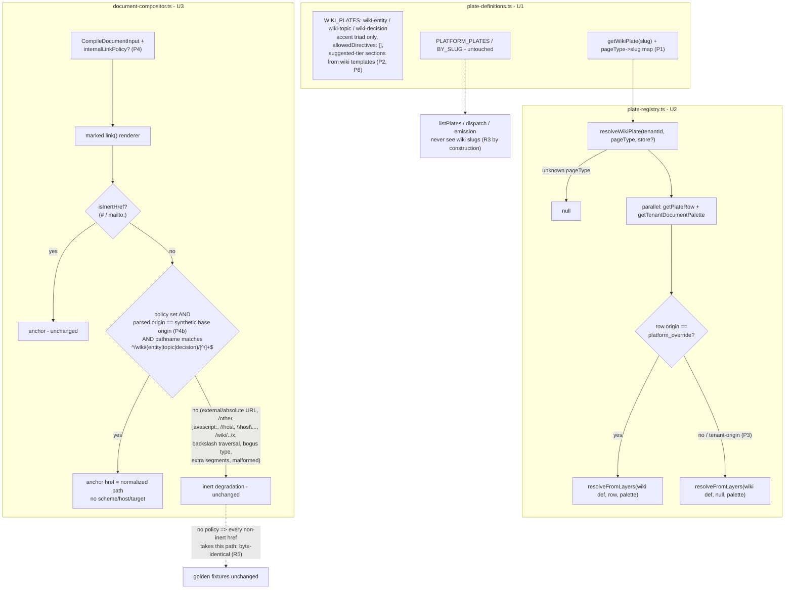

# Wiki Plates and Compositor Internal-Link Policy - Plan

## Goal Capsule

- **Objective:** The plate system can produce a wiki-page render: three code-defined wiki plates (`wiki-entity`, `wiki-topic`, `wiki-decision`) exist and resolve with tenant deltas through a dedicated `resolveWikiPlate`, and the Document Compositor gains an opt-in internal-link policy that preserves validated `/wiki/...` anchors while keeping every other link inert and default output byte-identical.
- **Product authority:** `docs/plans/2026-07-12-004-feat-wiki-html-plate-style-plan.md` (THINK-270), unit U1. This artifact scopes that unit for standalone execution as THINK-272; where the two disagree, the parent plan wins.
- **Execution profile:** One PR for the whole unit (parent plan execution profile). The plan-local units U1–U3 below are dependency-ordered commit-sized steps inside that single PR, not separate PRs — the three wiki plates, their resolver, and the link policy are one capability with a single consumer contract (THINK-273 / parent U2).
- **Open blockers:** none. This unit has no dependencies — it is the first unit of the parent plan and blocks THINK-273 (U2). Verified against `main`: no `WIKI_PLATES` or `resolveWikiPlate` exists in `packages/api/src/lib/artifacts/` yet.

---

## Product Contract

Product Contract preservation: unchanged from the requirements-only revision (merged to main in PR #3666) except two doc-review-driven tightenings, neither a scope change: AE2's rejection set gained absolute-URL and backslash vectors (already implied by R4's "external URLs … keep the existing inert degradation"), and the synthetic-base assumption was hardened from "implementation detail" to a security requirement (see P4b). No R/AE IDs were added or removed.

### Summary

Add three platform wiki plates to the code-defined plate registry — one each for entity, topic, and decision pages — kept in a separate `WIKI_PLATES` list so they never surface in emission dispatch, `listPlates`, or composer UX, and resolvable through a new `resolveWikiPlate(tenantId, pageType)` that reuses the existing layering so tenant document palettes and platform overrides apply. Separately, give the Document Compositor an opt-in internal-link policy: with the policy set, a markdown link whose href normalizes to exactly `/wiki/(entity|topic|decision)/<slug>` survives as a real anchor; every other link keeps today's inert treatment, and compiles without the policy stay byte-identical to before the change. This unit has no consumers yet — persistence (U2/THINK-273) and the readers (U3/THINK-274, U4/THINK-275) build on it.

### Key Decisions

These are inherited from the parent plan and are settled, not open for re-litigation here.

- **Wiki plates live in a separate code-defined list (`WIKI_PLATES`), not in `PLATFORM_PLATES`.** Keeping them out of `PLATFORM_PLATES` excludes them from `emit_document` dispatch, `listPlates` composer surfaces, and plate-preview UX without new hidden-flag machinery (parent KTD4). Verified: `PLATFORM_PLATES` is the single list feeding `BY_SLUG` and the registry's platform layer today.
- **A dedicated `resolveWikiPlate(tenantId, pageType)` reuses the existing layering.** It maps page type → wiki plate slug and delegates to `resolveFromLayers` (platform wiki def → tenant document palette → `document_plates` overrides), so tenant palette customization comes free with the existing delta mechanism (parent R5, KTD4).
- **Section specs are advisory (`suggested` tier), mapped from the wiki template vocabulary.** Entity: overview/notes/visits/related; topic: summary/highlights/related_entities/recent; decision: context/decision/rationale/consequences — from `packages/api/src/lib/wiki/templates.ts` (verified). The graph-materializer source emits a different vocabulary (overview/relationships, per the parent plan), so specs must be advisory, not required (parent KTD4).
- **Wiki plates set `allowedDirectives: []`.** Wiki section markdown contains no `tw:` directive fences; a stray fence produces a compile error and that page falls back to markdown rendering downstream — acceptable, the canonical markdown remains readable (parent assumption).
- **The internal-link policy is opt-in on `CompileDocumentInput` with dot-segment normalization plus route-shape validation.** A candidate href is resolved against a fixed synthetic base (dot-segment normalization, mirroring mobile's `extractWikiPath` `new URL(...).pathname` pattern) and survives only when the normalized path matches `^/wiki/(entity|topic|decision)/[^/]+$` — enum-bound type, single slug segment. A bare `startsWith("/wiki/")` check is insufficient: `/wiki/../admin` would otherwise pass and, under the relaxed reader sandbox (parent KTD7), resolve on click into an arbitrary same-origin route. This gate is the sole control on web navigation targets, so its tests are load-bearing (parent KTD5).
- **The policy is a parse-time change at the inert-href gate, not a sanitizer change.** Link handling honors the policy where `isInertHref` currently fires; surviving anchors render with no scheme, no host, no target attribute — the reader envelope owns targeting (parent U1 approach).
- **Default compositor output stays byte-identical.** No policy set → behavior unchanged; golden-parity fixtures in `packages/api/src/lib/artifacts/__fixtures__/` must not churn (parent KTD5, verification contract).

### Requirements

- R1. Three wiki plate definitions — slugs `wiki-entity`, `wiki-topic`, `wiki-decision` — exist in `plate-definitions.ts` in a separate `WIKI_PLATES` list, each with eyebrow, per-type accent palettes (light and dark), `allowedDirectives: []`, and `suggested`-tier section specs mapped from the wiki template vocabulary for its page type. _(parent R4)_
- R2. `resolveWikiPlate(tenantId, pageType)` resolves a wiki plate with the existing layering — platform definition, tenant document palette, `document_plates` platform-override rows — and returns an error/null for an unknown page type. _(parent R5, KTD4)_
- R3. Wiki plate slugs are excluded from `listPlates`, emission dispatch, and every composer-facing plate surface. _(parent KTD4)_
- R4. `CompileDocumentInput` accepts an optional internal-link policy; when set, a link whose href normalizes (dot-segment resolution against a fixed synthetic base) to a path matching `^/wiki/(entity|topic|decision)/[^/]+$` survives as an anchor with exactly that path as href; all other hrefs — external URLs, other root-relative paths, `javascript:`, protocol-relative, traversal attempts, unknown wiki types, extra path segments — keep the existing inert degradation. _(parent R8 policy half, KTD5)_
- R5. Compiles without the policy produce byte-identical output to before the change: existing golden-parity fixtures pass unmodified, and two compiles of the same wiki input produce identical bytes. _(parent R2, KTD5)_

### Acceptance Examples

- AE1. **Covers R4.** Given a compile with the wiki link policy, when the markdown contains `[Acme](/wiki/entity/acme-corp)`, `[x](https://evil.example)`, and `[y](/other/path)`, then only the first survives as an anchor (href exactly `/wiki/entity/acme-corp`); the other two degrade to inert inline text.
- AE2. **Covers R4.** Given a compile with the wiki link policy, when the markdown links to `/wiki/../admin`, `/wiki/./../x`, `//host/wiki/entity/x`, `https://evil.example/wiki/entity/x`, `/wiki/..\admin`, `\\evil.example\wiki\entity\x`, `/wiki/bogus-type/x`, or `/wiki/entity/a/b`, then every one degrades to inert text exactly like an external URL.
- AE3. **Covers R5.** Given the existing document-artifact golden fixtures, when the full compositor test suite runs after this change, then the fixtures pass without modification.
- AE4. **Covers R2.** Given a tenant with a custom document palette and a `platform_override` row for `wiki-entity`, when `resolveWikiPlate` runs for that tenant, then the resolved plate's light/dark tokens reflect the palette and the override merges; an unknown page type resolves to nothing.
- AE5. **Covers R3.** Given a tenant, when `listPlates(tenantId)` runs, then no wiki slug appears in the result.

### Scope Boundaries

- No persistence — render columns, repository write-path hooks, GraphQL exposure, and backfill are U2 (THINK-273).
- No reader changes — web is U3 (THINK-274), mobile is U4 (THINK-275); the navigation halves of parent R8 (sandbox relaxation, WebView interception) live there.
- No changes to default compositor behavior, sanitizer configuration, or the plate contract's directive system.
- No tenant-editable section contracts for wiki plates, and no specialized plates per entity subtype or ontology class (parent scope boundaries).
- No new hidden-flag or visibility machinery in the registry — separation by list membership is the mechanism.

### Dependencies / Assumptions

- Dependencies: none. This unit blocks THINK-273 (U2), which consumes `resolveWikiPlate` and the link policy.
- One PR, per the parent plan's execution profile.
- Follow the existing `BUSINESS_PLATES` definition shape (`qbr`/`proposal` precedent) for the three wiki definitions; follow `resolvePlatformPlate`/`resolvePlate` structure for `resolveWikiPlate`.
- This unit has no user-visible surface; completeness = `pnpm --filter @thinkwork/api test` green including untouched golden fixtures, plus a locally compiled sample wiki page render inspected in a browser file load for plate styling, dark/light tokens, and live wiki anchors (parent U1 verification). End-to-end user-flow proof is deferred to U3/U4.
- The synthetic base used for normalization MUST be an `https://` URL. This is security-load-bearing, not an implementation detail: only a WHATWG _special_ scheme converts backslashes to slashes and dot-resolves them the way browser navigation will on click, and only a special-scheme base yields a non-null origin for the P4 origin check (see P4b). The specific host is the free choice; the scheme is not.

### Sources

- Parent plan U1 section, requirements R2/R4/R5/R8, and KTD4/KTD5: `docs/plans/2026-07-12-004-feat-wiki-html-plate-style-plan.md`.
- Plate registry: `packages/api/src/lib/artifacts/plate-definitions.ts` (`BUSINESS_PLATES`/`PLATFORM_PLATES`, `allowedDirectives`), `plate-registry.ts` (`resolveFromLayers`, `resolvePlatformPlate`, `listPlates`) — all verified present.
- Compositor: `packages/api/src/lib/artifacts/document-compositor.ts` (`isInertHref`, `CompileDocumentInput`) — verified present; golden fixtures in `packages/api/src/lib/artifacts/__fixtures__/`.
- Wiki section vocabulary: `packages/api/src/lib/wiki/templates.ts` (verified: entity overview/notes/visits/related; topic summary/highlights/related_entities/recent; decision context/decision/rationale/consequences).
- Mobile normalization precedent: `extractWikiPath` in `apps/mobile/app/wiki/[type]/[slug].tsx` (verified).
- Sibling unit artifacts (shape precedent): `docs/plans/2026-07-12-007-feat-wiki-render-persistence-plan.md` (THINK-273), `docs/plans/2026-07-12-006-feat-web-wiki-plate-reader-plan.md` (THINK-274), `docs/plans/2026-07-12-005-feat-mobile-wiki-plate-reader-plan.md` (THINK-275).

---

## Planning Contract

Parent KTD4 and KTD5 are inherited verbatim (see Key Decisions above). Planning-time research against current `main` adds the following plan-local decisions.

### Key Technical Decisions

- P1. **`WIKI_PLATES` gets its own module-level lookup; `getPlatformPlate` and `BY_SLUG` stay untouched.** `BY_SLUG` in `plate-definitions.ts` is built exclusively from `PLATFORM_PLATES` (verified, ~line 457), and every registry resolution path (`resolvePlate`, `resolveCandidatePlate`, `listPlates`, dispatch, emission) reaches platform definitions only through `getPlatformPlate` or `PLATFORM_PLATES` iteration. Exporting `WIKI_PLATES` plus a small `getWikiPlate(slug)` (own map) and a page-type→slug mapping (`entity`→`wiki-entity`, `topic`→`wiki-topic`, `decision`→`wiki-decision`) means R3's exclusion holds **by construction** — no filter logic, no hidden flag; tests pin it (AE5) rather than enforce it.
- P2. **Section ids follow the plate contract's id-equals-heading-slug invariant, using the wiki template `heading` strings as titles.** `PlateSectionSpec.id` must equal `headingSlug(title)` — pinned by the existing registry test ("every section id equals the heading slug of its title", `plate-registry.test.ts` ~line 631). Wiki templates carry both `slug` and `heading` (e.g., slug `visits`, heading "Visits & Interactions"; slug `related_entities`, heading "Related Entities"). The plate spec uses the template **heading** as `title` and `headingSlug(heading)` as `id` (e.g., `visits-interactions`, `related-entities`) — not the underscore template slug. Because the specs are `suggested` tier (verified: `suggested` is a member of `PLATE_SECTION_TIERS` with rank 0), any vocabulary mismatch with actual compiled sections is advisory-only and never rejects a compile. Extend the id-invariant pin test to cover `WIKI_PLATES`.
- P3. **`resolveWikiPlate(tenantId, pageType, store?)` mirrors `resolvePlate`'s shape but ignores tenant-origin rows.** Same signature pattern (`store: PlateStore = drizzlePlateStore()`), same parallel fetch of plate row + tenant document palette, delegating to `resolveFromLayers` with `platform` = the wiki definition. One guard the parent plan implies but doesn't state: `resolveFromLayers` gives a **tenant-origin** row full shadowing power (KTD1 collision rule), and wiki slugs are not in `PLATFORM_PLATES`, so a tenant _could_ today create a tenant plate coincidentally named `wiki-entity`. Passing that row through would let an arbitrary tenant plate hijack every wiki render for the tenant. `resolveWikiPlate` therefore passes the row only when `row.origin === "platform_override"`; tenant-origin rows are treated as absent (the tenant's plate keeps working as a normal composer plate — it just has no effect on wiki rendering). Corollary for R3/AE5 scope: the exclusion guarantee covers the platform `WIKI_PLATES` definitions and `platform_override` rows; a tenant-**created** plate coincidentally named `wiki-*` remains an ordinary tenant plate and still appears in `listPlates` like any other tenant plate — that is existing composer behavior, not a wiki-surface leak. Note: the plate editor cannot currently create a `platform_override` row for a wiki slug (`resolveCandidatePlate` nulls on slugs unknown to `getPlatformPlate`), so AE4's override row is seeded through the store fixture in tests; operator-editable wiki overrides are a follow-up, not this unit.
- P4. **The link policy is threaded into the marked `link()` renderer as an optional predicate resolved once per compile.** `CompileDocumentInput` gains one optional field (directional shape: `internalLinkPolicy?: { kind: "wiki" }` — exact name/shape is the implementer's call; keep it closed/enum-bound, not caller-supplied regexes). The compile pipeline derives from it a pure `resolveInternalHref(href) => string | null` helper: parse via `new URL(href, <fixed https:// synthetic base>)` (malformed URLs → null via try/catch), reject unless the origin check (P4b) passes, then match the parsed `pathname` (dot-segments already resolved) against `^/wiki/(entity|topic|decision)/[^/]+$`. In the `link()` renderer (document-compositor.ts ~line 370), the order is: `isInertHref` → existing anchor; else policy present and helper returns a path → `<a href="<escaped normalized path>">` (href is the **normalized** path per R4, not the raw input); else existing inert degradation. The helper is exported for direct unit testing. No `target`, `rel`, scheme, or host is emitted — the reader envelope owns targeting (parent KTD7).
- P4b. **The helper rejects any href that carries its own authority: the resolved URL's origin must equal the synthetic base's origin.** Pathname-matching alone is insufficient — `new URL("//host/wiki/entity/x", base).pathname` and `new URL("https://evil.example/wiki/entity/x", base).pathname` are both `/wiki/entity/x` (verified empirically), so without this check the gate would _accept_ the protocol-relative and absolute-URL vectors AE2 requires to stay inert. Origin equality rejects absolute URLs, protocol-relative forms, and backslash-authority forms (`\\host\...`, which special-scheme parsing treats as an authority) in one rule, and only a root-relative or same-origin path survives to the regex. The `https://` base requirement (Product Contract assumption) is what makes this check sound: a non-special base scheme would make every parsed origin `"null"` (neutering the equality test) and would skip backslash→slash conversion, letting `\`-based traversal like `/wiki/entity/a\..\..\admin` pass the regex while browsers dot-resolve it to `/admin` on click.
- P5. **The sanitizer wall is verified compatible and stays untouched — and provides no residual protection for policy-surviving anchors.** `SANITIZE_CONFIG` (verified, document-compositor.ts ~lines 456–468) already allows `a[href]`, applies `allowedSchemes: ["data", "mailto"]` only to _schemed_ URLs, and scheme-less relative paths always pass — so `/wiki/entity/x` anchors survive sanitization unchanged and no config change is needed. But because the renderer emits the already-normalized path (never the raw href), the sanitizer's `allowProtocolRelative: false` never sees a hostile raw input: the P4/P4b helper is the **sole** gate for policy-surviving links, which is why its rejection tests are load-bearing. The policy-on compile test proves the full pipeline end to end (parse → sanitize → envelope).
- P6. **Wiki palettes override only the accent triad, following the business-plate discipline.** Each wiki plate sets `--accent`/`--accent-soft`/`--accent-text` for light and dark (three distinct hues distinguishing entity/topic/decision at a glance); brand-neutral surfaces stay on the base palette so tenant document palettes show through everywhere else (same rationale documented on `BUSINESS_PLATES`). Exact hues are the implementer's choice; `validatePlatePalette`/`isSafePlateTokenValue` constraints apply.

### Assumptions

Recorded autonomously (headless planning run):

- The internal-link policy ships wiki-only (enum-bound `kind`), even though the mechanism could generalize; generalization is speculative until a second consumer exists.
- Surviving anchors carry the normalized path as href even when the raw markdown href was already normal (`/wiki/entity/x` → identical string), so R4's "exactly that path" is a no-op for well-formed input and only visibly rewrites odd-but-valid inputs (e.g., `/wiki/entity/./x`).
- `headingSlug` (already exported from `document-compositor.ts`) is the id-derivation helper for P2; no new slugger is introduced.
- The tenant-origin-row guard (P3) is a deliberate narrowing of `resolveFromLayers`'s collision rule for the wiki path only; composer-plate behavior for such rows is unchanged everywhere else.

### High-Level Technical Design

### Sequencing

U1 → U2 (resolver needs the definitions); U3 is independent of both and can land in any order within the PR. All three in one PR. THINK-273 consumes U2's resolver and U3's policy together.

---

## Implementation Units

One PR total (parent execution profile). Units below are dependency-ordered steps with their own test scenarios; treat each as roughly one commit.

### U1. `WIKI_PLATES` definitions and wiki lookup

- **Goal:** Three wiki plate definitions exist in a separate list with their own lookup, invisible to every existing registry surface.
- **Requirements:** R1, R3 (by construction); parent KTD4; P1, P2, P6.
- **Dependencies:** none.
- **Files:**
  - `packages/api/src/lib/artifacts/plate-definitions.ts` — add `WIKI_PLATES` (three definitions), `getWikiPlate(slug)`, and the page-type→slug mapping; `PLATFORM_PLATES`/`BY_SLUG` untouched.
  - `packages/api/src/lib/artifacts/plate-registry.test.ts` — extend the section-id invariant pin test to cover `WIKI_PLATES`.
- **Approach:** Follow the `qbr`/`proposal` definition shape: eyebrow (e.g., "WIKI · ENTITY" style is implementer's choice), titleSuffix, accent-triad-only palettes per P6, `allowedDirectives: []`, and `suggested`-tier sections per P2 (template `heading` as title, `headingSlug(heading)` as id, template `prompt` as guidance basis). No `analyses`.
- **Test scenarios:**
  - Every `WIKI_PLATES` section id equals `headingSlug(title)` (extend the existing KTD6 pin test).
  - `getWikiPlate` returns each of the three definitions by slug and null for unknown slugs; `getPlatformPlate("wiki-entity")` returns null (lists are disjoint).
  - Each wiki definition has `allowedDirectives: []`, non-empty light and dark accent tokens, and all sections at `suggested` tier.
- **Verification:** `pnpm --filter @thinkwork/api test` green.

### U2. `resolveWikiPlate` with tenant deltas and surface exclusion

- **Goal:** A wiki plate resolves per tenant with the existing layering (palette + platform overrides), unknown page types resolve to null, and every composer-facing surface provably excludes wiki slugs.
- **Requirements:** R2, R3, AE4, AE5; parent R5, KTD4; P1, P3.
- **Dependencies:** U1.
- **Files:**
  - `packages/api/src/lib/artifacts/plate-registry.ts` — `resolveWikiPlate(tenantId, pageType, store?)` per P3.
  - `packages/api/src/lib/artifacts/plate-registry.test.ts` — extend.
- **Approach:** Map page type → wiki slug (U1's mapping); unknown type → null without any store call. Fetch plate row + tenant palette in parallel (mirroring `resolvePlate`), apply the P3 origin guard, delegate to `resolveFromLayers` with `platform` = the wiki definition. Resolution result is a normal `ResolvedPlate`, directly consumable by `compileDocument` (same as `resolvePlatformPlate` output).
- **Test scenarios:**
  - Covers AE4. A tenant document palette shows up in the resolved plate's `tokensLight`/`tokensDark`; a `platform_override` row for `wiki-entity` (seeded via the test `PlateStore` fixture) merges its config; unknown page type returns null.
  - No tenant deltas: `resolveWikiPlate` output for each page type matches the platform definition (displayName, eyebrow, `allowedDirectives: []`, suggested sections).
  - P3 guard: a **tenant-origin** row with slug `wiki-entity` is ignored — the resolved wiki plate is the platform wiki definition (plus palette), not the tenant plate's config.
  - Covers AE5. `listPlates(tenantId)` contains no `wiki-*` slug, with and without a seeded `platform_override` row for a wiki slug; `documentPlatesForDispatch`/`visiblePlateSummaries` output likewise contains none.
  - Store errors propagate (same behavior as `resolvePlate` — no new swallowing; best-effort handling is the caller's job in THINK-273).
- **Verification:** `pnpm --filter @thinkwork/api test` green.

### U3. Compositor opt-in internal-link policy

- **Goal:** `compileDocument` can preserve validated in-wiki links as real anchors while everything else stays inert, with default output byte-identical.
- **Requirements:** R4, R5, AE1, AE2, AE3; parent KTD5; P4, P5.
- **Dependencies:** none (independent of U1/U2).
- **Files:**
  - `packages/api/src/lib/artifacts/document-compositor.ts` — optional policy field on `CompileDocumentInput`; exported pure normalize-and-match helper; `link()` renderer honors the policy per P4.
  - `packages/api/src/lib/artifacts/document-compositor.test.ts` — extend.
- **Approach:** Per P4/P4b/P5. The helper is the load-bearing security gate: parse against the fixed `https://` synthetic base, try/catch malformed input to null, reject on origin mismatch (P4b), regex-match the enum-bound route shape, return the normalized path or null. Renderer emits `<a href="...">` with the escaped normalized path and no other attributes. Sanitizer config untouched.
- **Execution note:** This gate is the sole control on web navigation targets under the parent's relaxed reader sandbox — write the rejection tests (AE2 set) first and treat any fixture churn as a regression to fix, never a snapshot to update.
- **Test scenarios:**
  - Covers AE1. Policy-on compile of markdown with `[Acme](/wiki/entity/acme-corp)`, `[x](https://evil.example)`, `[y](/other/path)`: only the first is an anchor in the final sanitized render (proves the sanitizer passes it, P5); href is exactly `/wiki/entity/acme-corp`; the anchor carries no `target`/`rel`/scheme/host.
  - Covers AE2. Policy-on: `/wiki/../admin`, `/wiki/./../x`, `//host/wiki/entity/x`, `https://evil.example/wiki/entity/x`, `/wiki/..\admin`, `\\evil.example\wiki\entity\x`, `/wiki/bogus-type/x`, `/wiki/entity/a/b`, `javascript:alert(1)`, and a malformed href (e.g., `http://[`) each degrade to inert text exactly like today's external URLs.
  - Helper unit tests (direct): `/wiki/entity/x` → `/wiki/entity/x`; `/wiki/entity/./x` → `/wiki/entity/x` (normalization rewrites); origin rejection per P4b: `https://evil.example/wiki/entity/x`, `//host/wiki/entity/x`, and `\\evil.example\wiki\entity\x` → null even though their parsed pathname matches; backslash traversal `/wiki/entity/a\..\..\admin` → null (special-scheme base converts `\` to `/` and dot-resolves out of shape); `/wiki/topic/a%20b` handling is deterministic (whatever `URL.pathname` yields, asserted explicitly); trailing slash `/wiki/entity/x/` → null (regex has no trailing-slash allowance); empty slug `/wiki/entity/` → null; query/fragment `/wiki/entity/x?q=1#f` → the path still matches (pathname strips them) and the href is the bare path.
  - Covers AE3/R5. Policy-off: all existing golden fixtures pass unmodified; a policy-off compile containing `/wiki/entity/x` still degrades it to inert text (opt-in means opt-in).
  - Determinism: two policy-on compiles of the same wiki-shaped input produce identical bytes.
  - Anchors still work: `#fragment` and `mailto:` links behave exactly as before with the policy on (isInertHref precedence).
- **Verification:** `pnpm --filter @thinkwork/api test` green including untouched golden fixtures; a sample policy-on compile of wiki-shaped markdown written to a temp file renders correctly in a browser file load (plate styling, dark/light tokens via the envelope, live wiki anchors) — the parent U1 local browser check.

---

## Verification Contract

This unit has no deployed user-visible surface (readers land in THINK-274/275; persistence in THINK-273), so per the parent plan its end-to-end proof is the API test suite plus a local browser inspection of a compiled sample; the deployed-dev browser flows for this capability execute in the downstream units.

| #    | Flow                                                                                                                                                                                                                                                                                                      | Proves                                                                        |
| ---- | --------------------------------------------------------------------------------------------------------------------------------------------------------------------------------------------------------------------------------------------------------------------------------------------------------- | ----------------------------------------------------------------------------- |
| 1    | Full `pnpm --filter @thinkwork/api test` — compositor goldens byte-identical, new plate/registry/policy suites green                                                                                                                                                                                      | R1–R5, AE1–AE5; no document-artifact regression                               |
| 2    | Compile a sample wiki page (each of the three types) with `resolveWikiPlate` output + policy-on `compileDocument`, write to file, open in a real browser: house plate styling renders, light/dark tokens stamp via the envelope, `/wiki/...` anchors are live `<a>` elements, external links render inert | R1, R4 end to end through the real pipeline (parent U1 verification contract) |
| 3    | Grep-level review + AE5/dispatch tests: no emission, `listPlates`, or composer surface can reach a wiki slug                                                                                                                                                                                              | R3                                                                            |
| Gate | `pnpm lint && pnpm typecheck && pnpm test && pnpm format:check` (pre-commit); full API package suite, not just touched files                                                                                                                                                                              | all units                                                                     |

Golden-parity fixtures for document artifacts must remain byte-identical — any fixture churn is a regression, not an update.

## Definition of Done

- Single PR merged to main with U1–U3; post-merge Deploy run green (code-only change — no migration, no terraform).
- Verification flows 1–3 observed and evidence recorded on THINK-272.
- Document-artifact rendering unregressed (compositor goldens and existing registry suites untouched and green).
- THINK-273 (parent U2) unblocked: `resolveWikiPlate` and the compositor policy exist on main with the interfaces the sibling plan consumes (`resolveWikiPlate(tenantId, pageType, store?)`; policy option on `CompileDocumentInput`).

## Deferred to Implementation

- Exact policy field name/shape on `CompileDocumentInput` (enum-bound per P4) and the exported helper's name.
- Exact accent hues and eyebrow strings for the three plates (P6 constraints apply).
- Whether the page-type→slug map lives in `plate-definitions.ts` or `plate-registry.ts` (either is fine; keep it importable by THINK-273's repository helper without cycles).
- Encoded-character handling in slugs (`%20`, and especially the encoded separators `%2F`/`%5C`): assert the observed `URL.pathname` behavior in the helper tests and pin it; the regex's `[^/]+` is the contract, not a slug-charset opinion. (Verified during review: browsers do not decode `%2F`/`%5C` during path resolution, so these are not route escapes — pin that, don't re-derive it.)
