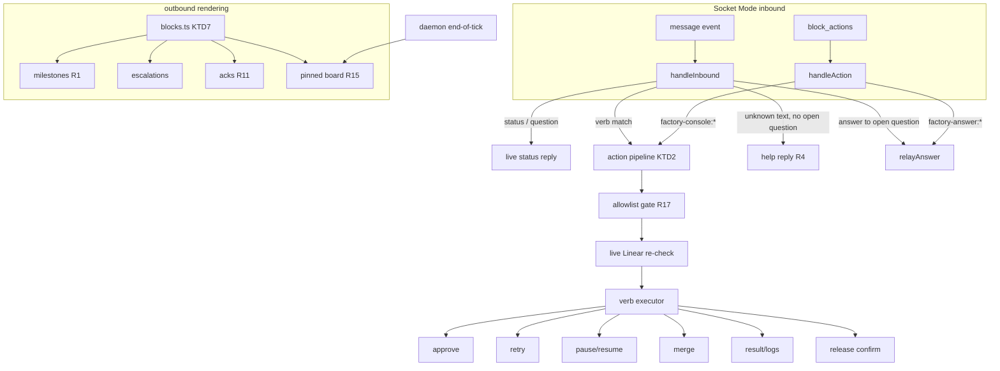

# Factory Slack Operator Console - Plan

## Goal Capsule

- **Objective:** Turn the factory's Slack surface from a one-way progress feed into a phone-operable console: contextual action buttons on every message, a pinned live board, inline result inspection with screenshots, and a legibility pass on all message copy.
- **Product authority:** Linear THINK-276 plus the 2026-07-13 brainstorm dialogue with the operator (Eric). This document is the Product Contract and the implementation plan.
- **Open blockers:** None. One-time Slack app setup (new scopes) lands with U10 and is doctor-checked.
- **Product Contract preservation:** unchanged (R1–R17 as confirmed at brainstorm).

---

## Product Contract

### Summary

Every factory Slack message carries the action buttons that make sense for the issue's current state (approve, result, logs, merge, retry, release), a pinned board message shows the whole factory at a glance and is silently edited every tick, and `result` surfaces what a phase actually produced — including verification screenshots uploaded inline. Everything renders as Block Kit, and message copy across the surface is rewritten short and mobile-first, starting with milestones becoming `THINK-279 → Verification`.

### Problem Frame

The factory exists so engineering runs without remoting into the Mac mini, but today Slack only tells the operator that phases moved — it never shows what was produced, and the only verbs are `status`, `question`, and answering an open blocker. Inspecting a result, approving a gate, merging a PR, tailing a log, or cutting a release all still require SSH or opening Linear, which defeats the factory's purpose. The feed itself compounds the problem: redundant milestone posts (a "Launched brainstorm" line for every phase) and long escalation texts bury the signal, and unknown messages in a thread get the confusing "isn't waiting on an answer" no-op instead of help.

### Key Decisions

- **Buttons-first, typed verbs as fallback.** The success bar is phone operation; tapping beats typing on mobile. Every action reachable by button is also reachable by a typed verb, but buttons are the designed path. This extends the answer-forms machinery that shipped 2026-07-13 rather than building a parallel command system.
- **Confirm round-trip on release only.** Cutting a release tag is the one outward-facing, hard-to-undo action. Merge, approve, retry, and pause fire on a single click because each is recoverable; confirming everything would train click-through.
- **Pinned live board over an App Home dashboard.** One pinned channel message, edited in place every tick (edits do not notify), gives the same glanceability as an App Home build at a fraction of the cost. App Home is explicitly rejected for v1.
- **Screenshots become durable worker artifacts.** For results to be visible in Slack, verify workers must persist screenshots to a stable per-issue artifacts location instead of leaving them in worktrees that get cleaned up. This changes the worker verification contract, not just the Slack layer.

### Requirements

**Message legibility**

- R1. A stage move renders as a single short line — `THINK-279 → Verification` — replacing both the `:rocket: Launched <phase>` and `:arrow_right: → <status>` message shapes. No separate "launched" post when a launch and a stage move describe the same event.
- R2. All operator-facing copy (enrollment root message, escalation header, acks, refusals) is rewritten short and mobile-first; every mention of an issue links to it, and any referenced question or artifact links to its source.
- R3. Every factory-posted surface (milestones, escalations, results, board, acks) renders as Slack Block Kit — sections, fields, context blocks, dividers, and inline images — not walls of plain text; plain text is kept only as Slack's required notification fallback.
- R4. A message in a factory thread that is neither a known verb nor an answer to an open question gets a reply listing the available commands for that issue's current state, replacing the "isn't waiting on an answer" no-op.

**Contextual actions (buttons-first)**

- R5. Every factory-posted message carries the action buttons valid for the issue's state at post time (e.g., a Verification milestone offers Approve → Done, Result, Logs; a merged-PR note offers Cut release, Result).
- R6. Every button action has a typed-verb equivalent usable in the same thread.
- R7. Approve advances the issue through its current human gate (Requirements Review → Planning, Plan Review → Ready to Work, Verification → Done) without opening Linear.
- R8. Merge squash-merges a named factory PR, showing checks state before acting and reporting the merge result.
- R9. Retry relaunches the issue's current phase from its newest baton; pause and resume suspend and restore the issue's enrollment in automation.
- R10. Release cuts a web canary (the `desktop-v*` tag flow) behind a confirm round-trip: the first tap shows exactly what tag will be minted, and only an explicit confirm tap executes it.
- R11. Every mutating action replies with an explicit statement of what it did (and is idempotent where possible); a failed action reports the failure rather than staying silent.

**Inspection**

- R12. Result presents the newest phase artifact for the issue: the latest handoff summary, merged PR links, report links, and the Progress document link.
- R13. When verification screenshots exist for the issue, Result uploads them inline into the thread as images, not links. Verify workers persist screenshots to a durable per-issue artifacts location as part of their contract.
- R14. Logs returns the tail of the active (or most recent) worker's log for the issue, sized for phone reading, on demand.

**Board**

- R15. A pinned channel message renders the whole-factory board (running work with phase and elapsed time, waiting-on-children, needs-operator, done-today) and is edited in place every daemon tick.
- R16. `status` in the channel root re-posts a fresh board snapshot on demand; `status` in an issue thread keeps its current per-issue live behavior.

**Guardrails**

- R17. Every console action — mutating or inspecting, button or typed — is gated on the operator allowlist; non-operators get the existing polite refusal and nothing executes or is disclosed. (Inspection verbs disclose worker log tails and screenshots, so reads are gated like writes.)

### Key Flows

- F1. Approve from the phone
  - **Trigger:** Issue reaches Verification; milestone posts with action buttons.
  - **Steps:** Operator taps Result, reads the summary and screenshots in-thread, taps Approve → Done.
  - **Outcome:** Issue moves to Done in Linear; thread gets a one-line confirmation. **Covers R5, R7, R12, R13.**
- F2. Cut a canary release
  - **Trigger:** A web PR merges; the merged-PR note offers Cut release.
  - **Steps:** Operator taps Cut release → factory replies "Confirm cut `desktop-v0.1.0-canary.355`?" with Confirm/Cancel buttons → operator taps Confirm.
  - **Outcome:** Tag minted, deploy pipeline runs, thread reports the tag and run link. Cancel or no reply executes nothing. **Covers R10, R11.**
- F3. Unstick from anywhere
  - **Trigger:** Pinned board shows an issue under needs-operator.
  - **Steps:** Operator opens the issue thread from the board link, reads the question form, taps an option (or Retry).
  - **Outcome:** Answer relays, blocker clears, phase relaunches next tick. **Covers R9, R15, R17.**

### Acceptance Examples

- AE1. **Covers R1.** Given the daemon launches implement on THINK-300 (which also moves it to In Progress), when the milestone posts, then the thread shows exactly one new line: `THINK-300 → In Progress` — no rocket, no "Launched implement".
- AE2. **Covers R10, R17.** Given a non-operator taps Cut release, then nothing executes and they receive the polite operator-only refusal; given the operator taps it but never taps Confirm, then no tag is minted and the confirm offer expires harmlessly.
- AE3. **Covers R4.** Given an operator types `merge it plz` in a thread with no open question, then the reply lists the commands available for that issue's state instead of "isn't waiting on an answer".
- AE4. **Covers R13.** Given THINK-275's verify captured simulator screenshots, when the operator taps Result, then the screenshots appear as images in the thread without leaving Slack.

### Success Criteria

- The operator runs the factory for a full working day from Slack on a phone — approving gates, inspecting results and screenshots, merging PRs, cutting a canary — without opening a terminal or Linear.

### Scope Boundaries

- App Home dashboard — rejected for v1 in favor of the pinned board.
- Multi-operator roles or per-verb permissions — the existing single allowlist is the trust boundary.
- Daemon lifecycle control (halting or restarting the daemon process itself) — the console steers issues, not the daemon; `pause`/`halt` daemon semantics remain a separate concern.
- Typed command grammar as the primary interface — kept only as fallback parity.

#### Deferred to Follow-Up Work

- Artifacts-folder retention/cleanup policy (v1 lets `~/.thinkwork-factory/artifacts/` grow; revisit when disk pressure appears).
- Board pagination beyond Slack's 50-block message limit if enrolled-issue count outgrows the compact layout.
- Screenshot capture for non-verify phases.

### Dependencies / Assumptions

- One-time Slack app setup by the operator: add `files:write`, `pins:write`, and `pins:read` bot scopes (doctor-checked in U10) — same pattern as the Interactivity toggle that answer forms required.
- The factory Slack channel is private and operator-controlled; screenshots and log tails posted by `result`/`logs` inherit its audience and persist per workspace retention. Channel membership is the read-side trust boundary (the allowlist gates actions, not reading the thread).
- Release automation assumes the existing paired-tag canary flow: `v0.1.0-canary.N` (`release.yml`) and `desktop-v0.1.0-canary.N` (`release-desktop.yml`, which also deploys `apps/web`). The console mints tags only on explicit confirm, preserving the operator's release authority.
- The verify-worker contract change (durable screenshots) applies to workers launched after it ships; older issues may have no screenshots to show, which Result must state plainly.

### Outstanding Questions

- **Deferred to implementation:** exact board block layout at 10+ enrolled issues (must stay under Slack's 50-block limit; compact counts-only fallback if needed); whether `files.uploadV2` batching needs throttling when a verify pass produced many screenshots (start unbatched, cap at 10 per result).

---

## Planning Contract

### Key Technical Decisions

- KTD1. **Console action-id namespace `factory-console:<verb>`.** Console buttons use a new prefix alongside `factory-answer*`; the gateway's `interactive` filter widens to `factory-`, and `handleAction` dispatches by prefix. Button `value` carries minimal JSON (`{ v: verb, arg? }`); the thread mapping resolves the issue, never the button payload — a click on a stale message can't act on a stale issue id.
- KTD2. **One shared action pipeline: authorize → live re-check → execute → ack.** Every verb (button or typed) runs the same pipeline modeled on `relayAnswer`: operator-allowlist gate first (R17), then a **live Linear re-read** validating the action still applies to the issue's current state — the stale-button guard (an Approve tapped after the issue already moved is a polite no-op naming the current state), then execution, then an explicit Block Kit ack (R11). Verbs whose executor is expected to exceed ~2s (merge, result-with-uploads, release derivation) post an immediate in-thread progress line (`⏳ merging #123…`) before executing and edit it into the final ack via `updateMessage` — a silent button on a phone reads as dead and invites a double-tap. Typed verbs parse in `handleInbound` before the relay fallback; unknown text in a thread routes to the help reply (R4).
- KTD3. **Release mints the tag pair from the daemon's repo checkout.** `release` derives the next N via `git fetch --tags` + `git tag --list 'v0.1.0-canary.*' --sort=-version:refname`, then tags and pushes `v0.1.0-canary.N+1` and `desktop-v0.1.0-canary.N+1` via `transport.exec` (tags are refs — no working-tree mutation, honoring the never-mutate-main-checkout rule). Confirm state is held in the store (`meta` table) with the exact tag names **and the resolved `origin/main` sha** shown to the operator; the confirm click tags that stored sha explicitly — if `origin/main` has advanced past it, the offer is refused with a fresh one (show-what-you-execute: main moves continuously while the operator decides, and R10's promise is that the first tap shows exactly what gets minted). Only a `factory-console:release-confirm` click with the matching one-shot token executes.
- KTD4. **Pinned board rides a new `meta` key-value table and the end-of-tick seam.** A singleton `meta` row stores the board message `channel/ts`; the daemon updates the board once per tick after `runUnenrollIsolated` (the existing per-candidate `syncCandidate` seam is wrong for a whole-board post). First post pins via `pins.add`; a deleted/unpinned board self-heals by re-posting. `chat.update` edits never notify.
- KTD5. **Screenshots persist to `<stateDir>/artifacts/<ISSUE>/`.** The verify prompt contract gains a mandatory step: copy every captured screenshot to the artifacts dir (path injected into the prompt by the executor). `result` uploads up to 10 newest images via `files.uploadV2` with `channel_id` + `thread_ts`, rendering inline. No retention in v1.
- KTD6. **Pause is a Linear blocker label (`Paused`).** `pause` adds it, `resume` removes it; the engine's existing blocker-label handling does the rest. Visible and undoable in Linear, zero new engine states.
- KTD7. **Blocks module is the single rendering seam.** A new `blocks.ts` owns section/context/fields/actions/divider builders with the Slack hard limits (3000-char section, 75-char button label, 50 blocks/message) enforced in one place; `questions.ts` limits migrate there. Every posting site composes blocks + plain-text fallback through it (R3).

### High-Level Technical Design

Verb-to-backend mapping: `approve`/`pause`/`resume`/`retry` → `LinearGateway` (+ store for retry's baton relaunch semantics, which reuse the existing relaunch-next-tick path); `merge`/`release` → `transport.exec` (`gh`, `git`); `result` → Linear comments + `GithubGateway` + artifacts dir + `files.uploadV2`; `logs` → store attempt row + `transport.readTail`.

---

## Implementation Units

### U1. Block Kit foundation (`blocks.ts`)

- **Goal:** One module owning Block Kit composition and Slack hard limits; existing posting sites keep working unchanged until later units adopt it.
- **Requirements:** R3 (foundation for R1, R2, R15).
- **Dependencies:** none.
- **Files:** `packages/factory/src/slack/blocks.ts` (new), `packages/factory/src/slack/questions.ts` (migrate limit constants), `packages/factory/__tests__/blocks.test.ts` (new).
- **Approach:** Builders for section (mrkdwn, auto-truncate at 2900 + "(truncated)" note), context, fields, divider, actions (label truncation at 75, value cap), image (required `alt_text` enforced here — the one place the accessibility field can't be forgotten), and a `composeMessage(blocks, fallbackText)` helper that enforces the 50-block ceiling. `questions.ts` imports its limits from here — one source of truth.
- **Patterns to follow:** limit-constant style and incident-citing comments in `packages/factory/src/slack/questions.ts`.
- **Test scenarios:** section over 3000 chars truncates with note; actions block drops/truncates a 76-char label to 75; composeMessage rejects or trims past 50 blocks; fallback text always present.
- **Verification:** package suite green; `questions.test.ts` unchanged and passing (limits behave identically post-migration).

### U2. Milestone consolidation and copy pass

- **Goal:** Stage moves render as one short Block Kit line; all copy short, linked, mobile-first.
- **Requirements:** R1, R2, R3. **Covers AE1.**
- **Dependencies:** U1.
- **Files:** `packages/factory/src/slack/sync.ts`, `packages/factory/src/slack/threads.ts`, `packages/factory/src/slack/relay.ts` (ack copy), `packages/factory/__tests__/sync.test.ts`.
- **Approach:** In `maybeMilestone`, collapse `launch:` and `advance:` shapes into one `<issue-link> → <status>` line; when a launch implies the status move (implement's Running-hook move to In Progress), emit only the move (dedupe by target status in `last_milestone_key`). Rewrite enrollment root, escalation header, relay acks through `blocks.ts`.
- **Patterns to follow:** existing `last_milestone_key` idempotency; `issueRef` linking in `sync.ts`.
- **Test scenarios:** Covers AE1. launch+move posts exactly one line, no rocket; repeated tick posts nothing new; escalation and ack messages carry blocks with plain-text fallback; every issue mention in posted text is a link.
- **Verification:** package suite green; live thread on the next factory launch shows the single-line milestone.

### U3. Console action registry, typed verbs, and help

- **Goal:** The routing spine: per-state action sets, `factory-console:*` click dispatch, typed-verb parsing, help reply for unknown text.
- **Requirements:** R4, R5, R6, R11, R17. **Covers AE3.**
- **Dependencies:** U1.
- **Files:** `packages/factory/src/slack/console.ts` (new: verb registry + pipeline), `packages/factory/src/slack/sync.ts` (route inbound/actions), `packages/factory/src/slack/client.ts` (widen action-id filter to `factory-`), `packages/factory/__tests__/console.test.ts` (new), `packages/factory/__tests__/sync.test.ts`.
- **Approach:** `console.ts` exports `actionsForState(state, labels)` → the button set for an issue's current state (R5), a verb parser (`result`, `logs [n]`, `approve`, `merge <pr#>`, `retry`, `pause`, `resume`, `release`; `report` and `advance` are pure aliases of `result` and `approve` — they inherit those verbs' executors and tests), and `runConsoleAction` implementing KTD2's pipeline with per-verb executors injected (later units fill them; unimplemented verbs reply "not yet available"). **U3 also wires `actionsForState` into the existing posting sites** — milestone and escalation messages in `sync.ts` carry their state's buttons from this unit on (the merged-PR note's buttons land with U5) — so R5 is observably true at U3's completion, not implied. `handleInbound` order becomes: status → question → verb → open-question relay → help reply (R4). Help lists state-valid verbs.
- **Patterns to follow:** `relayAnswer`'s authorize/ack shape in `relay.ts`; `isStatusKeyword` parsing style in `status.ts`.
- **Test scenarios:** Covers AE3 (unknown text → state-appropriate command list). Non-operator click and typed verb both refused verbatim — including read-only `result`/`logs` (R17); a posted Verification milestone carries the Approve/Result/Logs buttons; stale Approve (issue already Done) → polite no-op naming current state; slow-executor verbs post the interim progress line before executing (KTD2); `logs 50` parses count; `report`/`advance` alias to `result`/`approve`; verb inside a thread with an open question still answers the question only when text is not a verb; malformed console value JSON ignored with log.
- **Verification:** package suite green; typed `help`/unknown text in a live thread lists commands.

### U4. Steering verbs: approve, retry, pause, resume

- **Goal:** Gate advancement and issue-level automation control from Slack.
- **Requirements:** R7, R9, R11.
- **Dependencies:** U3.
- **Files:** `packages/factory/src/slack/console.ts`, `packages/factory/src/linear/client.ts` (label add helper if absent), `packages/factory/src/domain/statuses.ts` (add `Paused` to `BLOCKER_LABELS`), `packages/factory/__tests__/console.test.ts`.
- **Approach:** `approve` maps current state to its gate target (Requirements Review → Planning, Plan Review → Ready to Work, Verification → Done) via `LinearGateway.setState`; non-gate states get a no-op naming the state. `retry` on an issue with an **active running attempt** is a polite no-op naming the attempt (phase, elapsed, pointer to `logs`) — the store's one-active-attempt invariant and the KTD-10 wait make relaunch impossible there, and killing the worker would contradict the recoverable-single-click decision; when no attempt is active, `retry` clears `Needs User`/`Verification Failed` if present and posts the retry baton note (reusing the existing retry-button answer text) so the next tick relaunches. `pause`/`resume` add/remove the `Paused` blocker label (KTD6) — and `Paused` MUST be added to `BLOCKER_LABELS` in `domain/statuses.ts`, the single source of truth the poller filters labels through; without that one line the label never reaches `candidate.blockerLabels` and pause acks success while workers keep launching. Create the label in Linear once, document in README.
- **Patterns to follow:** label mutation via existing `removeLabel`/`addLabel` gateway methods; retry semantics from `sync.ts`'s `RETRY_ACTION_ID` path.
- **Test scenarios:** approve from each of the three gates hits the right target; approve from In Progress refuses politely; retry on a blocked issue clears the blocker and acks; retry with an active running attempt → polite no-op naming the attempt; poller-level: an issue carrying the `Paused` label yields `blockerLabels` containing "Paused" (not just an engine test with blockerLabels pre-seeded); pause then blocked-wait decision; resume removes it; every ack states what changed (R11).
- **Verification:** package suite green; live: pause then resume a quiet issue, observe label flip in Linear and daemon block/unblock decisions in the log.

### U5. Merge verb

- **Goal:** Squash-merge a factory PR from Slack with checks visibility.
- **Requirements:** R8, R11.
- **Dependencies:** U3.
- **Files:** `packages/factory/src/slack/console.ts`, `packages/factory/src/phases/evidence.ts` (extend `GithubGateway` with checks/merge ops), `packages/factory/__tests__/console.test.ts`.
- **Approach:** `merge <pr#>` first validates the PR **belongs to the thread's issue** — head branch matches the issue's factory branch, or the PR is referenced in the issue's Linear comments — refusing with the PR's title/branch named otherwise (a typo'd number must not squash-merge an arbitrary repo PR; this also mechanizes R8's "factory PR" constraint). Then it fetches checks state (`gh pr view`/`gh pr checks` via the execFile pattern in `evidence.ts`), replies with the summary, runs `gh pr merge <pr#> --squash --auto --delete-branch`, and acks the outcome (auto-merge armed vs merged vs error output). Merge is also button-reachable (buttons-first): when phase evidence or the newest handoff surfaces an **open** factory PR for the issue, the milestone/note carries a `Merge #<pr>` button whose value embeds the number (`{ v: "merge", arg: <pr#> }`). The merged-PR note (Cut release + Result buttons): post it whenever a completed phase's attempt has a branch whose `prsForBranch` shows a MERGED PR, idempotently keyed on the PR number — the `pr-merged` evidence kind alone only fires for died workers (its documented purpose), so keying on it would skip the routine merge path entirely.
- **Patterns to follow:** `createGhCliGateway`'s execFile timeout/SIGKILL discipline in `evidence.ts:51-63`.
- **Test scenarios:** merge on a green PR acks "auto-merge armed/merged"; merge of a PR not associated with the thread's issue is refused and the refusal names the mismatch; merge on a failing-checks PR shows the failing checks before acting; gh failure output surfaces in the ack (R11); non-numeric arg refused; merged-PR note posts once for the routine status-moved-plus-merged-PR case (not only died-worker pr-merged evidence), idempotently keyed on PR number.
- **Verification:** package suite green; live merge of a real docs-only PR from Slack.

### U6. Inspection verbs: result and logs, with screenshot upload

- **Goal:** "Show me what it did" without leaving Slack.
- **Requirements:** R12, R13 (upload half), R14. **Covers AE4.**
- **Dependencies:** U3; U7 for screenshots to exist (result degrades gracefully without them).
- **Files:** `packages/factory/src/slack/console.ts`, `packages/factory/src/slack/client.ts` (add `uploadFiles(channel, threadTs, paths)` via `files.uploadV2`), `packages/factory/__tests__/console.test.ts`, `packages/factory/__tests__/fake-slack.ts`. Note: `result`/`logs` are read verbs but still allowlist-gated (R17) — log tails and screenshots are disclosure.
- **Approach:** `result` assembles: newest `handoff:`/`automation-ledger:` comment summary, merged PR links from `GithubGateway`, report/Progress-doc links found in comments, then uploads up to 10 newest images from `<stateDir>/artifacts/<ISSUE>/` (KTD5); states plainly when no artifacts exist. `logs [n]` resolves the active (else latest) attempt row and posts the last n (default 40) lines via `transport.readTail`, fenced, section-truncated.
- **Patterns to follow:** comment-marker scanning in `sync.ts` (`newestQuestion`/`newestFactoryBlock`); `transport.readTail` usage.
- **Test scenarios:** Covers AE4 (artifacts present → uploadFiles called with image paths into the thread). result with no artifacts says so; result surfaces newest handoff + PR links; logs tails the active attempt, falls back to latest ended; logs output over section limit truncates; upload failure acks the failure (R11).
- **Verification:** package suite green; live `result` on THINK-275 shows the dogfood evidence inline.

### U7. Worker artifacts contract (durable screenshots)

- **Goal:** Verify workers persist screenshots somewhere the console can find them.
- **Requirements:** R13 (persistence half).
- **Dependencies:** none (lands independently; U6 consumes).
- **Files:** `packages/factory/src/phases/prompts.ts`, `packages/factory/src/phases/executor.ts` (inject artifacts path into verify prompts), `packages/factory/src/config.ts` (artifacts dir helper), `packages/factory/README.md`.
- **Approach:** Verify prompt gains a mandatory evidence step: copy every screenshot to the injected `<stateDir>/artifacts/<ISSUE>/` path (mkdir -p semantics), named `NN-scenario-slug.png`, and reference those filenames in the dogfood report. Executor creates the dir at verify launch.
- **Patterns to follow:** existing prompt-contract additions (the CI-wait chain, the answers fence) in `prompts.ts` — explicit MUST language with the reason.
- **Test scenarios:** executor creates the artifacts dir on verify launch; prompt text for verify contains the injected absolute artifacts path; non-verify phases unaffected. Test expectation for worker compliance: none — prose-contract adherence is proven live (first Codex verify after ship), like the CI-wait chain.
- **Verification:** next live verify run leaves `.png` files under `~/.thinkwork-factory/artifacts/<ISSUE>/`.

### U8. Release verb with confirm round-trip

- **Goal:** Cut the paired canary tags from a phone, safely.
- **Requirements:** R10, R11. **Covers AE2.**
- **Dependencies:** U3.
- **Files:** `packages/factory/src/slack/console.ts`, `packages/factory/src/store/db.ts` + `packages/factory/src/store/schema.sql` (`meta` kv table, shared with U9), `packages/factory/__tests__/console.test.ts`.
- **Approach:** KTD3. First invocation: `git fetch --tags`, derive next `canary.N`, reply "Confirm cut `v0.1.0-canary.N` + `desktop-v0.1.0-canary.N` at `origin/main` (<sha>)? (expires in 10 min)" with Confirm/Cancel buttons carrying a one-shot token stored in `meta` **together with the resolved sha** (expires after 10 minutes or on cancel). Confirm click with matching token tags **that stored sha** and pushes — if `origin/main` has advanced, refuse and offer fresh (KTD3's show-what-you-execute rule). On confirm/cancel/expired-tap, `chat.update` the confirm message to strip the buttons and state the outcome (`cut …` / `cancelled` / `expired`) — the answer-forms precedent: message state matches token state, no live-looking dead buttons. Ack includes both tags and the Actions run URLs (resolve run IDs with a short retry — runs appear a few seconds after the tag push). Everything through `transport.exec` against the daemon's `repoPath`; tag collisions (`git tag -l` guard, push rejection) surface in the ack.
- **Patterns to follow:** `scripts/release.sh` collision guard; `release.yml:370-372` latest-tag derivation via `--sort=-version:refname`.
- **Test scenarios:** Covers AE2 (non-operator click refused; unconfirmed offer expires, no tag). Confirm with stale/mismatched token → polite no-op; confirm after `origin/main` advanced past the stored sha → refused with a fresh offer, never tags the new head silently; cancel clears the token; a resolved offer's message no longer carries action blocks; next-N derivation from a fake tag list; tag-collision error surfaces in ack; double-confirm is idempotent (token consumed).
- **Verification:** package suite green; live release cut end-to-end once (operator-witnessed).

### U9. Pinned live board

- **Goal:** Glance at one pinned message, see the whole factory.
- **Requirements:** R15, R16.
- **Dependencies:** U1, U8 (`meta` table is created by U8; U8+U9 may pair on delivery).
- **Files:** `packages/factory/src/slack/board.ts` (new), `packages/factory/src/slack/status.ts` (extend view with per-issue rows), `packages/factory/src/daemon.ts` (end-of-tick hook), `packages/factory/src/slack/client.ts` (`pinMessage`, `getPermalink`), `packages/factory/__tests__/board.test.ts` (new).
- **Approach:** The board's data source is `updateBoard(candidates, store)` — the tick's `PollCandidates` (live labels, state, child/dependency info, already in scope at the end-of-tick call site in `runTick`) joined with store attempt rows for running/elapsed. The store alone cannot build the board: `issues` has no labels column, child state is never persisted, and issue rows refresh only when launches settle. Groups: running (identifier, phase, elapsed from `started_at`), needs-operator (blocker labels **excluding `Paused`**), **paused (its own group — a deliberate pause must not read as stuck-waiting-on-you**, F3's signal stays honest), waiting-on-children/dependency, done-today (persisted into `meta` by the unenroll pass — Done issues leave the poll set, so candidates can't supply them and the list must survive restarts); idle phases stay counts-only. Each enrolled row links to its **Slack thread** via `chat.getPermalink` on the stored thread `channel/ts` (Linear link secondary) — F3's unstick flow jumps board → thread, never board → Linear. `board.ts` renders via `blocks.ts` under the 50-block ceiling (compact fallback when large). Daemon calls `updateBoard` once per tick after `runUnenrollIsolated` (KTD4): first run posts + pins + stores `channel/ts` in `meta`; subsequent ticks `chat.update`; a `message_not_found` self-heals by re-posting. Channel-root `status` re-posts a fresh snapshot (R16); thread `status` unchanged.
- **Patterns to follow:** `buildStatusView`/`formatStatusView` in `status.ts`; best-effort Slack isolation in `daemon.ts`'s `syncSlack`.
- **Test scenarios:** board groups running/needs-you/paused/waiting/done-today correctly from seeded candidates + store; a `Paused` issue appears under paused, never needs-operator; a running row's text contains the thread permalink; done-today survives a simulated restart (read back from `meta`); elapsed renders human-short (`1h40`); update path edits the stored ts; missing message re-posts and re-pins; board over block ceiling falls back to counts; channel-root `status` posts a snapshot while thread `status` still answers per-issue; Slack outage never fails the tick.
- **Verification:** package suite green; live board pinned in the channel and visibly updating across two ticks.

### U10. Scopes, doctor checks, and operator docs

- **Goal:** The new Slack surface is self-diagnosing and documented.
- **Requirements:** supports R13, R15 (scope dependencies); R2 (docs copy).
- **Dependencies:** U6, U9.
- **Files:** `packages/factory/src/doctor.ts`, `packages/factory/README.md`.
- **Approach:** Doctor probes what is probe-able: `pins.list` on the channel verifies `pins:read`; `pins:write` and `files:write` cannot be probed side-effect-free, so doctor reports them as setup-checklist items, and the board/result paths surface Slack's `missing_scope` error with the "add scope X and reinstall app" remediation on first use. README: console verb table, button map per state, `Paused` label setup, artifacts dir, release flow description, and one line on operator-account hygiene (the allowlisted Slack account now carries merge/release authority — keep Slack 2FA on).
- **Patterns to follow:** existing doctor check style (`doctor.ts:157-170`).
- **Test scenarios:** doctor reports a `pins.list` failure as missing `pins:read` with the fix named; unprobe-able scopes render as checklist items, not false passes; passes when the fake gateway accepts the probes. Test expectation for README: none — docs.
- **Verification:** `factoryd doctor` output shows the new checks; README renders the verb table.

---

## Verification Contract

| Gate | Command / method | Applies to |
|---|---|---|
| Unit + integration suite | `npx vitest run` from `packages/factory` (whole package, currently 378 tests + new) | every unit |
| Typecheck | `pnpm --filter @thinkwork/factory typecheck` | every unit |
| Live daemon smoke | merge → `git pull` in main checkout → `launchctl kickstart -k gui/501/com.thinkwork.factory` → watch one tick complete in the daemon log | U2, U9 |
| Phone-day dogfood (Success Criteria) | operator drives a real day from Slack mobile: approve a gate, view a result with screenshots, merge a PR, cut a canary — no terminal, no Linear | final acceptance |

PR/landing strategy: one PR per unit by default; U1+U2 may pair (same files, one review), U8+U9 may pair on the `meta` table. Squash-merge to `main`; daemon restart after each merged batch, not each PR.

## Definition of Done

- R1–R17 implemented with the unit mapping above; AE1–AE4 demonstrably true against the live factory.
- Package suite and typecheck green; no regression in the answer-forms or relay tests.
- Doctor reports the new scope checks; README documents the console.
- The pinned board exists in the live channel and survives a daemon restart.
- Phone-day dogfood passes (Success Criteria) or its failures are filed as issues with the console's own `result` evidence.

---

## Sources / Research

- Linear THINK-276 (verb list, guardrails, origin feedback) — the issue description embeds the operator's 2026-07-13 feedback verbatim.
- `packages/factory/src/slack/` — current surface: `sync.ts` (routing, milestone copy), `questions.ts` (Block Kit answer forms, action-id namespace, Slack limits), `client.ts` (Socket Mode, `onAction`, `updateMessage`), `relay.ts` (shared answer core, allowlist gate).
- `packages/factory/src/slack/status.ts` — `buildStatusView` (counts + active workers with `started_at`); per-issue live status is the shipped pattern.
- `packages/factory/src/phases/evidence.ts` — `GithubGateway`/`createGhCliGateway` execFile discipline; `pr-merged` evidence kind (merged-PR note seam).
- `packages/factory/src/workers/transport.ts` — host-exec seam (`exec`, `readTail`) the daemon already uses for `git`.
- `.github/workflows/release-desktop.yml` (+ `release.yml`, `scripts/build-desktop.sh:50-76`, `scripts/release.sh:52-76`) — paired canary tags, channel resolution, latest-tag derivation, collision guard.
- `packages/factory/src/store/schema.sql` + `db.ts:330-360` — table inventory, `ensureColumn` additive migration pattern; no kv table exists today (hence `meta`).
- `packages/factory/README.md:246-261` — currently documented Slack scopes and setup; extended by U10.
- External research: skipped — strong local patterns for every touched layer; the two new Slack scopes are doctor-verified at runtime rather than assumed from documentation.
