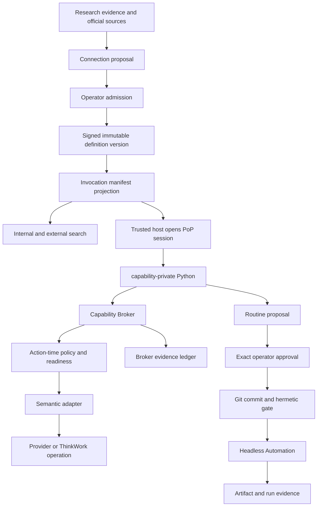
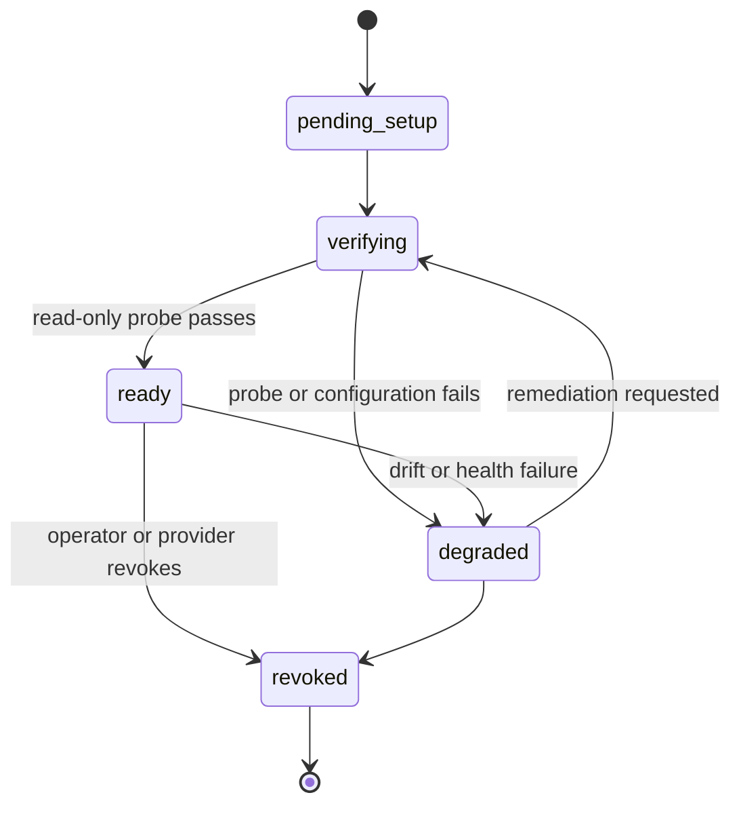
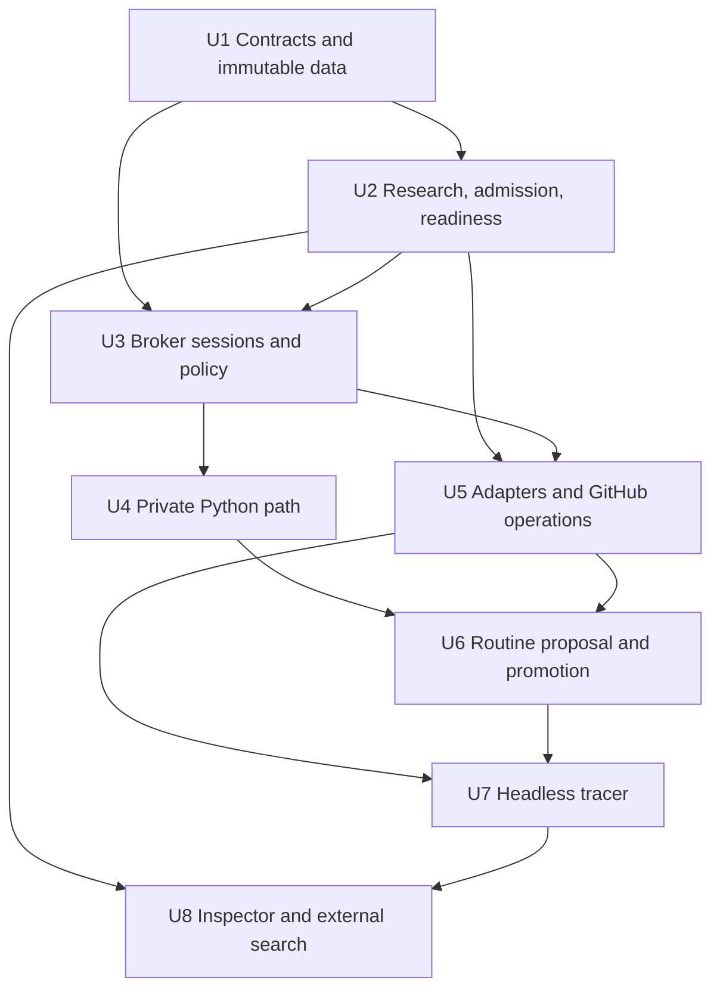
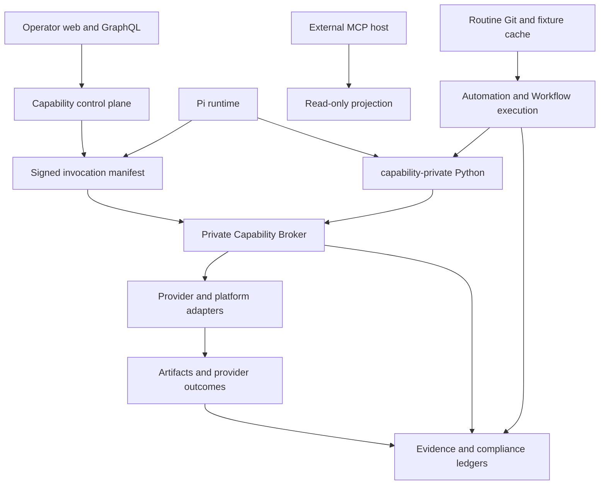

# feat: Add governed capability runtime

## Overview

Formalize the governed loop ThinkWork already approximates: research a Connection,
admit an immutable operation contract, discover only the current invocation's
executable surface, compose Python in a private AgentCore environment, dispatch every
effect through a policy broker, promote successful code through exact operator
approval and clean fixture verification, then run the resulting Git-backed Routine
headlessly with durable evidence.

The first vertical proof is a scheduled GitHub issue-health digest. It admits GitHub
REST as a tenant Connection, calls read-only operations from brokered Python, writes a
ThinkWork Artifact, and exposes the same permitted descriptor through external MCP
`search`. This extends Connection, Tool, Routine, Automation, and Artifact rather than
adding Kody's Package noun or adopting Kody, integrations.sh, Executor, or AgentCore
Gateway as an execution authority (see origin:
`docs/brainstorms/2026-07-13-think-280-capability-runtime-requirements.md`).

---

## Problem Frame

ThinkWork's signed folder manifests, credential vault, Code Interpreter, Git-backed
Routines, Automations, Artifacts, and run ledgers are real but do not share one
operation identity or action-time enforcement boundary. Today, successful exploratory
code cannot be promoted through a single governed path, and capability discovery does
not prove that an exact operation, principal binding, contract version, and approval
are valid at call time.

The runtime must therefore make the broker—not discovery, Python, an MCP server, or a
session token—the final authority. It must also preserve semantic differences between
HTTP, MCP, platform, Workflow, and future adapters while giving authored Python one
stable call/result shape. Operators need an evidence chain from research and admission
through Git promotion and each headless run.

---

## Requirements Trace

**Vocabulary and shared identity**

- R1. Preserve the existing product vocabulary; Capability Runtime is the governing
  layer across existing concepts, not a replacement noun.
- R2. Use one immutable, operation-addressable descriptor and operation reference in
  signing, manifests, discovery, Inspector, broker calls, Routine dependencies, and
  evidence.
- R3. Keep `capability_search` (active invocation surface) separate from
  `connection_research` (untrusted research and remediation).

**Connection admission and compatibility**

- R4. Treat integrations.sh as bounded, cached, provenance-bearing discovery input;
  verify material claims against official sources and use read-only readiness probes.
- R5. Admit surface-specific, tenant-scoped Connection versions; platform promotion is
  a separate event.
- R6. Separate definition admission from per-binding readiness and resolve exactly one
  principal mode: `requester`, `agent_owner`, or `service`, with no fallback.
- R7. Require signed, fail-closed operation contracts and pin definition version,
  operation ID, and contract hash in grants and Routines.

**Governed composition and execution**

- R8. Put action-time policy, credentials, dispatch, and evidence in a dedicated,
  language-neutral Capability Broker; AgentCore Gateway remains optional.
- R9. Use one invocation/result envelope while preserving adapter-specific semantics.
- R10. Re-authorize tenant, actor, context, principal, grants, contract, readiness,
  approval, budget, data policy, and destructive gates on every broker call.
- R11. Use short-lived stateful proof-of-possession sessions with replay, expiry,
  cancellation, and tenant isolation enforced before credential resolution.
- R12. Use Python only in v1 and add a `capability-private` VPC environment whose only
  non-AWS application path is the private broker.

**Routine proposal, verification, and lifecycle**

- R13. Let eligible sessions create immutable, non-executable Routine proposals with
  source, fixtures, invariants, dependencies, principals, and originating evidence.
- R14. Require operator approval of the exact proposal fingerprint before an atomic Git
  commit and clean private-session validation can activate a SHA.
- R15. Separate hermetic behavioral verification from live readiness and never repeat
  an effect merely to publish code.
- R16. Extend current Automation/Workflow and Routine ledgers with exact capability,
  principal, binding, broker, budget, effect, Artifact, and outcome evidence.

**External surface and v1 proof**

- R17. Ship external MCP `search` over the same identity-aware descriptor projection;
  do not expose session creation or execution.
- R18. Use existing configuration, Git, S3, Artifact, domain, Workflow, Automation, and
  execution stores; add no generic Values or Routine-owned storage service.
- R19. Prove the entire loop with the scheduled GitHub issue-health Artifact tracer.

**Origin actors:** A1 (operator), A2 (agent user), A3 (ThinkWork agent and trusted
runtime), A4 (headless executor), A5 (external MCP host)

**Origin flows:** F1 (Connection research and admission), F2 (interactive composition
and promotion), F3 (headless recurring execution), F4 (external discovery)

**Origin acceptance examples:** AE1 (research cannot execute), AE2 (no principal
fallback), AE3 (contract drift is explicit), AE4 (replay fails before dispatch), AE5
(private Python has no direct provider path), AE6 (exact proposal approval), AE7
(effectful validation uses fixtures), AE8 (revocation blocks headless runs), AE9
(external search is tenant-scoped and read-only)

---

## Scope Boundaries

- Do not port Kody or its Cloudflare implementation and do not add a Package noun.
- Keep integrations.sh out of execution and admission authority; keep Executor as
  later reference only.
- Do not add JavaScript/QuickJS or another authored Routine language in v1.
- Do not add external MCP `execute`; the external surface is discovery-only.
- Do not add generic Values, key-value, or arbitrary Routine-owned storage.
- Do not add a public marketplace, cross-tenant sharing, or automatic tenant-to-
  platform promotion.
- Do not flatten Connection, Tool, memory, Workflow, or platform semantics into MCP.
- Do not put provider or tenant-wide AWS credentials in authored code, prompts, files,
  environment variables, or results.
- Do not change `default-public` or `internal-only` semantics; add a distinct
  `capability-private` environment.
- Do not add GitHub-to-Slack or another external write to the first tracer.

### Deferred to Follow-Up Work

- External MCP execution and session creation: separate security review after v1
  read-only discovery proves identity and descriptor reuse.
- Tenant definition promotion to platform seeds: separate review/signature workflow.
- JavaScript or other Routine languages, generic Routine state, and Gateway-managed
  targets: reconsider only from a concrete capability need.
- Effectful multi-provider tracer (for example GitHub-to-Slack): follow-on proof after
  the read-only GitHub loop is stable.

---

## Success Metrics

- GitHub provider credentials never appear in sandbox inputs, environment, source,
  prompts, stdout/stderr, broker results, or persisted evidence.
- One operation reference and contract hash can be followed from Inspector/search to a
  broker call, Routine dependency manifest, headless execution, and Artifact lineage.
- Replays, revoked bindings, missing service principals, contract drift, direct egress,
  and invalid approvals fail before provider dispatch and produce named remediation.
- A promoted GitHub digest runs repeatedly on schedule with zero agent turns and pins
  the exact Routine SHA, capability contracts, configuration fingerprint, and service
  principal used.
- External MCP `search` returns the same permitted GitHub operation identity as the
  internal projection and exposes no execute method or cross-tenant metadata.

---

## Context & Research

### Relevant Code and Patterns

- `packages/api/src/lib/capabilities/definition-schemas.ts` and
  `packages/api/src/lib/capabilities/manifest-compile.ts`: declarative Connection/Tool
  folders, signed sidecars, active/withheld projection, and content-addressed manifest.
- `packages/api/src/graphql/resolvers/capabilities/capabilityInspector.query.ts` and
  `packages/database-pg/graphql/types/capabilities.graphql`: effective predicted versus
  observed capability projection and operator-gated Inspector.
- `packages/database-pg/src/schema/capability-catalog.ts`: existing catalog and
  append-only resolved-manifest audit. Extend and migrate; do not create an unrelated
  discovery registry.
- `packages/database-pg/src/schema/tenant-credentials.ts` and
  `packages/api/src/lib/tenant-credentials/secret-store.ts`: metadata/secret separation.
- `packages/lambda/analyst-caller-context.ts` and
  `packages/lambda/analyst-query-broker.ts`: Ed25519 domain separation, body binding,
  tenant-aware policy, budget, and broker evidence precedent.
- `packages/agentcore-pi/agent-container/src/runtime/tools/execute-code.ts`,
  `packages/agentcore-pi/agent-container/src/runtime/sandbox-factory.ts`, and
  `packages/agentcore-pi/agent-container/src/mcp-proxy.ts`: current Python and MCP seams.
- `packages/lambda/routine-repo-tools.ts`, `packages/lambda/routine-exec-git.ts`,
  `packages/database-pg/src/schema/routine-code-cache.ts`, and
  `docs/plans/2026-07-03-004-feat-deterministic-routines-v1-plan.md`: Git source of
  truth, SHA cache, fixture status, and constrained repair.
- `packages/database-pg/src/schema/agent-loops.ts`, `packages/lambda/job-trigger.ts`,
  and `packages/database-pg/src/schema/artifacts.ts`: Automation identity, headless
  dispatch, and durable output substrate.

### Institutional Learnings

- Keep first-party provider calls behind policy facades
  (`docs/solutions/architecture-patterns/first-party-provider-tools-stay-behind-policy-facades-2026-06-14.md`).
- Land inert schemas and seams before switching live dispatch
  (`docs/solutions/architecture-patterns/inert-first-seam-swap-multi-pr-pattern-2026-05-08.md`).
- Every headless failure needs a named reader and remediation surface
  (`docs/solutions/architecture-patterns/inbox-items-headless-failures-have-no-reader-2026-07-07.md`).
- Content-address per-turn truth and do not mutate historical projections
  (`docs/solutions/architecture-patterns/per-turn-snapshot-needs-content-addressed-immutable-storage.md`).
- Make smoke-test payloads and forced failures explicit
  (`docs/solutions/best-practices/live-smoke-payload-seams-and-forced-failure-paths-2026-07-07.md`).
- Parse Code Interpreter responses as MCP result envelopes with terminal
  `structuredContent`
  (`docs/solutions/best-practices/invoke-code-interpreter-stream-mcp-shape-2026-04-24.md`).
- Use a narrow service endpoint instead of widening shared user authentication
  (`docs/solutions/best-practices/service-endpoint-vs-widening-resolvecaller-auth-2026-04-21.md`).
- Project explanation from durable source evidence rather than inferred confidence
  (`docs/solutions/observability/trusted-trace-cost-accounting-substrate.md`).

### External References

- Kody's reviewed sequence at commit `e34c159`: registry search, bounded/cached
  discovery, official-source verification, credential setup, read-only smoke, then
  save dependent behavior. The sequence informs F1; Kody's runtime does not.
- [AgentCore VPC resource sample](https://github.com/awslabs/agentcore-samples/blob/main/01-features/02-host-your-agent/01-runtime/03-advanced/08-connect-to-vpc-resources/README.md):
  VPC network configuration selects subnets and security groups.
- [AgentCore Code Interpreter sample](https://github.com/awslabs/agentcore-samples/blob/main/01-features/03-connect-your-agent-to-anything/01-code-interpreter/README.md):
  custom interpreters accept an execution role and network configuration.
- [AgentCore Gateway IAM sample](https://github.com/awslabs/agentcore-samples/blob/main/06-workshops/02-AgentCore-gateway/04-integration/01-runtime-gateway/04-runtime-gateway.ipynb):
  Gateway offers IAM ingress; other samples offer custom JWT and outbound credential
  providers, but not ThinkWork's full per-call authority model.
- [integrations.sh](https://integrations.sh/) and
  [UsefulSoftwareCo/integrations](https://github.com/UsefulSoftwareCo/integrations):
  untrusted discovery input with cached provenance, never a runtime dependency.

---

## Key Technical Decisions

| Decision                          | Chosen design                                                                                                                                                                                                                                        | Why                                                                                                                                                                 |
| --------------------------------- | ---------------------------------------------------------------------------------------------------------------------------------------------------------------------------------------------------------------------------------------------------- | ------------------------------------------------------------------------------------------------------------------------------------------------------------------- |
| Shared contract home              | New `@thinkwork/capability-contracts` package with no DB, AWS, Pi, or transport dependency                                                                                                                                                           | API, broker, Pi host, Python SDK fixtures, and external MCP must share semantics without importing one another's runtime                                            |
| Operation identity                | `twcap://<namespace>/<class>/<slug>/versions/<version>/operations/<percent-encoded-id>?contract=sha256:<hex>` plus structured fields                                                                                                                 | A portable opaque reference is convenient in code/evidence while structured fields remain authoritative                                                             |
| Canonicalization                  | RFC 8785 JSON canonicalization and SHA-256; descriptor fingerprint excludes grants/readiness, contract hash covers only the signed operation contract                                                                                                | Cross-language deterministic hashing and immutable definition/runtime-projection separation                                                                         |
| Definition authority              | Tenant logical definition + append-only definition versions; signed version materializes into current folder/manifest projection                                                                                                                     | Preserves the existing folder runtime while making admission/version history queryable and immutable                                                                |
| Principal identity                | Add tenant service principals; binding rows reference one explicit mode and subject. `requester` and `agent_owner` resolve users; `service` resolves a service-principal ID                                                                          | Automations and external M2M hosts need stable, revocable non-human identity without overloading `run_as_user_id`                                                   |
| Session state                     | DynamoDB conditional writes + TTL for session/public-key/next-sequence/cancellation and nonce records; Aurora append-only rows for durable broker evidence                                                                                           | Atomic replay protection belongs in low-latency ephemeral state; operator/audit queries belong in the existing relational ledger                                    |
| Proof of possession               | Ed25519, domain-separated RFC-8785 body, strict next sequence, unique nonce, 60-second clock window, and at most 15-minute session TTL                                                                                                               | Reuses local asymmetric precedent and is implementable in TypeScript and Python without persisting a private key                                                    |
| Lost-response safety              | Every call has a client request ID unique within the session. The broker records `authorized` before dispatch and the terminal outcome after dispatch; a signed status operation retrieves that outcome and never redispatches                       | Strict sequence consumption makes replay safe but makes blind retry unsafe after an ambiguous network failure, especially for effectful operations                  |
| Call concurrency                  | The v1 Python SDK serializes broker calls per session and owns sequence allocation; parallel authored tasks queue locally                                                                                                                            | Strict next-sequence, cumulative budgets, and deterministic fixture call order are simpler and safer than speculative concurrent dispatch                           |
| Private ingress                   | Private REST API Gateway reachable only through a dedicated execute-api VPC endpoint created with private DNS disabled — never added to the app VPC's shared interface-endpoint list (THINK-144 guard in `terraform/modules/thinkwork/main.tf`: execute-api private DNS captures all `*.execute-api` traffic VPC-wide and the stack's HTTP APIs 403 it); the session bootstrap targets the endpoint-specific VPCE DNS name with the private API id. Application requests still require PoP. Broker Lambda uses separate egress-enabled subnets; `terraform/modules/app/capability-broker` owns the VPC/subnet/security-group/VPCE substrate                                                     | Code Interpreter needs broker access without SigV4/AWS credentials or general internet; network location alone is not authorization                                 |
| Python handoff                    | Trusted host generates the ephemeral keypair, registers only the public key, and injects a session bootstrap into a preinstalled SDK wrapper—not prompts, source, or persisted environment                                                           | The session key is a short-lived bounded capability, never a provider credential; every call is still re-authorized                                                 |
| Broker results                    | `completed`, `accepted`, or `failed`; typed error category and retryability; inline validated data capped at 64 KiB, larger output becomes an Artifact/S3 durable reference                                                                          | Normalizes authored code without pretending asynchronous/provider durability is synchronous                                                                         |
| Policy taxonomies                 | Data: `public`, `internal`, `confidential`, `restricted`, `credential`; cost: `free`, `low`, `medium`, `high`, `unknown`; latency: `interactive`, `long_running`, `asynchronous`, `unknown`; output: `inline`, `artifact`, `stream`, `unknown`       | Small closed sets can fail closed. `credential` output and `unknown` automated execution are rejected in v1                                                         |
| Approval integration              | Proposal tables own immutable proposal payload/fingerprint; Inbox owns the human decision link. Approval consumes one exact fingerprint                                                                                                              | Reuses the operator queue without forcing domain payloads into generic Inbox JSON or making an approval editable                                                    |
| Operator information architecture | Extend the existing Capabilities page with Catalog, Research, and Bindings views; keep proposal decisions in the existing Inbox/Approval detail and execution evidence in Routine run detail                                                         | Operators need one discovery/configuration home without creating a second admin console or hiding human decisions in catalog rows                                   |
| External auth                     | Existing MCP OAuth resource/audience validation with a dedicated `capabilities:search` scope. Humans use authorization-code + PKCE; operator-created confidential clients use `client_credentials` and map one-to-one to an active service principal | Reuses current OAuth and audience protections while keeping discovery scope narrow; dynamic public registration cannot mint service identity                        |
| Gateway                           | No v1 dependency; allow a future adapter behind the broker                                                                                                                                                                                           | Gateway can front targets and credentials, but it does not replace ThinkWork grants, contracts, principal resolution, readiness, approval, budgets, or replay state |

Operation contracts carry the origin's effect enum; target scope (`closed` with a
declared resource selector, or `open_world`); reversibility/compensation;
idempotency/retry semantics; accepted principal modes; approval policy; input/output
schemas and data classifications; and cost/latency/output classes. Missing or
`unknown` security-relevant annotations withhold the operation from automated
execution. No refreshed operation enters an existing grant automatically.

---

## Open Questions

### Resolved During Planning

- Canonical descriptor and migration: use the shared contract package, RFC 8785,
  SHA-256, the `twcap:` URI above, append-only versions, and a compatibility projection
  into current folders/manifests.
- Broker topology: private REST API Gateway/VPCE from a no-NAT Code Interpreter subnet;
  a separate VPC-attached broker Lambda owns provider egress.
- Session state and key handoff: DynamoDB conditional sequence/nonce state, Ed25519,
  60-second request window, 15-minute maximum TTL, host-generated private key written
  with AgentCore `writeFiles` to a session-local bootstrap consumed by the SDK wrapper,
  and explicit deletion/cancellation/session stop. Authored code in the same sandbox can
  inspect its bounded session key; it cannot obtain provider credentials or widen broker
  policy.
- Adapter outcomes: common completed/accepted/failed envelope, typed retryability,
  durable references for large/asynchronous output, and per-adapter poll/cancel support.
- Proposal persistence: immutable DB proposal and Inbox decision, then atomic Git commit
  of `main.py`, fixtures, dependency manifest, invariants, and provenance.
- External discovery: current MCP OAuth with a resource-bound `capabilities:search`
  scope, authorization-code + PKCE for users, operator-created confidential
  `client_credentials` records for service principals, and exact one-tenant mapping.
- Tracer: GitHub REST issue/list/read operations, deterministic health summary
  invariants, a tenant-visible report Artifact, daily schedule, and explicit teardown.

### Deferred to Implementation

- Exact AWS regional availability and `CreateCodeInterpreter` VPC network-configuration
  support in the bundled `@aws-sdk/client-bedrock-agentcore-control` version used by
  `packages/lambda/agentcore-admin.ts` (interpreters are created by that Lambda's SDK
  call — currently hard-typed to `PUBLIC | SANDBOX` — not by Terraform provider fields):
  verify with a live call in the target dev account before the U4 apply; preserve the
  topology and stop if the regional API differs rather than weakening isolation.
- Exact inline/Artifact thresholds below the 64 KiB contract ceiling and provider-
  specific timeout defaults: tune from dev evidence without changing the envelope.
- Whether the GitHub REST adapter uses direct signed HTTP or an approved generated
  OpenAPI client internally: choose the smaller implementation after validating the
  admitted operation schemas; authored Python cannot observe the choice.
- Final helper and SQL migration names if concurrent work claims `0247`; preserve the
  table/contract boundaries and take the next migration number (`0246` is already
  occupied on main by `0246_automation_workflow_ownership.sql`).

---

## Output Structure

```text
packages/capability-contracts/
├── package.json
├── tsconfig.json
└── src/
    ├── descriptor.ts
    ├── envelope.ts
    ├── session.ts
    └── index.ts

packages/lambda/lib/capability-broker/
├── policy.ts
├── sessions.ts
├── evidence.ts
└── adapters/
    ├── registry.ts
    ├── http-openapi.ts
    └── platform.ts

packages/agentcore-pi/agent-container/src/runtime/capability-sdk/
├── __init__.py
├── client.py
└── canonical.py
```

This is the expected ownership shape, not a constraint on exact helper names. Existing
GraphQL, schema, Terraform, Routine, and web files remain in their current modules.

---

## High-Level Technical Design

> _This illustrates the intended approach and is directional guidance for review, not
> implementation specification. The implementing agent should treat it as context, not
> code to reproduce._



The descriptor has two layers:

- **Immutable definition:** identity, version/fingerprint, provenance, adapter/binding
  requirements, and signed operation contracts.
- **Invocation projection:** exact operation references plus grants, availability,
  readiness/remediation, principal selection, and context fingerprint. This projection
  never changes the underlying definition.

Every broker request is evaluated in this order: parse/canonicalize; load session;
verify audience/signature/time/sequence/nonce; atomically consume sequence; resolve the
exact descriptor and context fingerprint; re-authorize grants/principal/readiness/
approval/budgets/data/effect; resolve credentials inside the broker; dispatch the
adapter; validate/classify the result; persist evidence; return the safe envelope.
Credential resolution and provider dispatch do not begin before replay and policy
checks pass.



---

## Phased Delivery and Unit Dependencies



- **Phase 1 — inert authority:** U1–U3 land contracts, control-plane records, sessions,
  and broker policy before any authored call can reach a provider.
- **Phase 1 entry gate:** before or in parallel with U1, run a dev spike that creates
  one VPC-mode Code Interpreter via `CreateCodeInterpreterCommand` and proves
  execute-api VPCE reachability from its subnet; U3's capability-broker Terraform
  design is contingent on that spike's evidence, not on documentation.
- **Phase 2 — governed vertical slice:** U4–U7 add the private path, minimum adapters,
  proposal/promotion, and scheduled GitHub Artifact tracer.
- **Phase 3 — shared discovery and rollout:** U8 proves Inspector/external parity, then
  enables tenants behind explicit flags and operational gates.

---

## Implementation Units

- U1. **Canonical contracts and immutable persistence**

**Goal:** Establish the language-neutral descriptor, operation reference, envelopes,
taxonomies, service-principal identity, append-only definition/version records, binding
readiness, proposal/session/evidence records, and compatibility projection before any
live dispatch exists.

**Requirements:** R1, R2, R5, R6, R7, R9, R16; F1; AE3

**Dependencies:** None

**Files:**

- Create: `packages/capability-contracts/package.json`
- Create: `packages/capability-contracts/tsconfig.json`
- Create: `packages/capability-contracts/src/descriptor.ts`
- Create: `packages/capability-contracts/src/envelope.ts`
- Create: `packages/capability-contracts/src/session.ts`
- Create: `packages/capability-contracts/src/index.ts`
- Test: `packages/capability-contracts/src/descriptor.test.ts`
- Test: `packages/capability-contracts/src/envelope.test.ts`
- Modify: `packages/api/package.json`
- Modify: `packages/lambda/package.json`
- Modify: `packages/agentcore-pi/package.json`
- Modify: `packages/agentcore-pi/agent-container/Dockerfile`
- Modify: `pnpm-lock.yaml`
- Create: `packages/database-pg/src/schema/capability-runtime.ts`
- Create: `packages/database-pg/drizzle/0247_capability_runtime.sql` (or next available
  migration number; `0246` is already taken by `0246_automation_workflow_ownership.sql`)
- Modify: `packages/database-pg/src/schema/capability-catalog.ts`
- Modify: `packages/database-pg/src/schema/index.ts`
- Modify: `packages/database-pg/src/schema/core.ts`
- Modify: `packages/database-pg/src/schema/routines.ts`
- Modify: `packages/database-pg/src/schema/routine-code-cache.ts`
- Modify: `packages/database-pg/src/schema/routine-executions.ts`
- Modify: `packages/database-pg/src/schema/agent-loops.ts`
- Modify: `packages/api/src/lib/capabilities/definition-schemas.ts`
- Test: `packages/api/src/lib/capabilities/definition-schemas.test.ts`
- Modify: `packages/api/src/lib/capabilities/manifest-compile.ts`
- Test: `packages/api/src/lib/capabilities/manifest-compile.test.ts`

**Approach:**

- Keep `capability_catalog` as a compatibility/catalog projection. Add stable logical
  definitions and append-only version rows scoped to tenant or platform; each admitted
  version stores the canonical descriptor, fingerprint, signature, provenance, source
  evidence references, and lifecycle state.
- Store operation contracts as the signed descriptor payload (JSONB) with searchable
  identity/effect/principal columns where needed; forbid updates to admitted versions
  and create a candidate version for refreshes.
- Add `tenant_service_principals` with active/revoked state and purpose metadata. Add
  explicit principal specs to binding, Routine dependency, and Automation execution
  records without changing legacy `run_as_user_id` semantics.
- Add operator-created external confidential-client records with a one-time secret whose
  hash—not plaintext—is stored, one active service-principal mapping, exact allowed MCP
  resource/scope, and revocation metadata. Public dynamic registration remains user-only.
- Add per-version credential-binding rows whose secret fields are references into the
  existing vault. Readiness/evidence is version-specific and redacted.
- Add immutable Connection research/admission proposals, Routine proposals, broker call
  evidence, and exact dependency/configuration snapshots. Use Inbox IDs only as links to
  human decisions.
- Extend folder parsing and manifest compilation to consume/emit the shared descriptor
  identity while accepting legacy folders during a shadow migration. Legacy
  `app|user` principals map to explicit candidate remediation; do not silently map them
  into the new three-mode execution contract.

**Execution note:** Add contract/canonicalization tests first; cross-language hashes and
immutability are load-bearing for every later unit.

**Patterns to follow:**

- Content-addressed manifest body in
  `packages/api/src/lib/capabilities/manifest-compile.ts`.
- Secret references and lifecycle metadata in
  `packages/database-pg/src/schema/tenant-credentials.ts`.
- Append-only observed manifests in
  `packages/database-pg/src/schema/capability-catalog.ts`.

**Test scenarios:**

- Happy path: canonicalize the same descriptor with different object-key order and
  assert identical fingerprint, contract hash, and `twcap:` reference.
- Edge case: percent-encoded operation IDs round-trip while malformed namespaces,
  versions, hashes, duplicate operations, and unknown enum values fail closed.
- Error path: an operation missing any required effect/scope/reversibility/idempotency/
  principal/approval/data/cost/latency/output annotation is withheld and cannot receive
  an executable reference.
- Integration: compile a signed folder version and assert the active manifest, Inspector
  projection input, and DB version row use the same descriptor fingerprint and contract
  hash.
- Covers AE3. Refresh a changed GitHub output schema and assert a candidate version is
  created while the admitted version, grant, and Routine dependency remain pinned.
- Migration: existing manifest/catalog rows remain readable and are marked legacy/
  remediation-required rather than being upgraded to executable contracts by guesswork.

**Verification:** The package has no AWS/DB/Pi dependencies; admitted version rows are
immutable; current consumers can shadow-read the new identity without changing live
dispatch; migration/drift checks include every new object.

---

- U2. **Connection research, admission, and readiness control plane**

**Goal:** Implement separate research and working-discovery control planes, bounded
integrations.sh assistance, official-source verification, exact operator admission,
service-principal management, and per-binding readiness without creating an execution
path.

**Requirements:** R3, R4, R5, R6, R7, R10; A1, A3; F1; AE1, AE2

**Dependencies:** U1

**Files:**

- Create: `packages/api/src/lib/capabilities/research.ts`
- Test: `packages/api/src/lib/capabilities/research.test.ts`
- Create: `packages/api/src/lib/capabilities/admission.ts`
- Test: `packages/api/src/lib/capabilities/admission.test.ts`
- Create: `packages/api/src/lib/capabilities/readiness.ts`
- Test: `packages/api/src/lib/capabilities/readiness.test.ts`
- Create: `packages/api/src/graphql/resolvers/capabilities/connectionResearch.query.ts`
- Create: `packages/api/src/graphql/resolvers/capabilities/connectionProposal.mutations.ts`
- Test: `packages/api/src/graphql/resolvers/capabilities/connectionProposal.mutations.test.ts`
- Create: `packages/api/src/graphql/resolvers/capabilities/capabilitySearch.query.ts`
- Test: `packages/api/src/graphql/resolvers/capabilities/capabilitySearch.query.test.ts`
- Create: `packages/api/src/handlers/capability-control-service.ts`
- Test: `packages/api/src/handlers/capability-control-service.test.ts`
- Modify: `packages/database-pg/graphql/types/capabilities.graphql`
- Modify: `packages/api/src/graphql/resolvers/capabilities/index.ts`
- Modify: `packages/api/src/lib/capabilities/folder-write.ts`
- Test: `packages/api/src/lib/capabilities/folder-write.test.ts`
- Modify: `packages/api/src/lib/capabilities/sidecar-signing.ts`
- Test: `packages/api/src/lib/capabilities/sidecar-signing.test.ts`
- Modify: `packages/api/src/lib/tenant-credentials/secret-store.ts`
- Test: `packages/api/src/lib/tenant-credentials/secret-store.test.ts`
- Modify: `apps/web/src/components/settings/SettingsCapabilities.tsx` (the live
  Capabilities surface, rendered from `settings.agents.index.tsx`; the standalone
  `settings.capabilities.tsx` route is a retired redirect stub — do not edit it)
- Test: `apps/web/src/components/settings/SettingsCapabilities.test.tsx`
- Modify: `apps/web/src/lib/connections-api.ts`
- Create: `packages/agentcore-pi/agent-container/src/runtime/tools/capability-search.ts`
- Test: `packages/agentcore-pi/agent-container/tests/capability-search.test.ts`
- Create: `packages/agentcore-pi/agent-container/src/runtime/tools/connection-research.ts`
- Test: `packages/agentcore-pi/agent-container/tests/connection-research.test.ts`
- Create: `packages/agentcore-pi/agent-container/src/runtime/capability-control-client.ts`
- Test: `packages/agentcore-pi/agent-container/tests/capability-control-client.test.ts`
- Modify: `packages/agentcore-pi/agent-container/src/server.ts`
- Modify: `terraform/modules/app/lambda-api/handlers.tf`
- Modify: `terraform/modules/app/agentcore-pi/main.tf`
- Modify: `scripts/build-lambdas.sh`

**Approach:**

- `connection_research` searches admitted/platform definitions and stored proposals
  first. Only when needed, invoke integrations.sh through a size/time-limited fetcher,
  cache raw provenance with expiry, and convert it to non-executable evidence.
- Require official provider URLs for every material authentication, endpoint, operation,
  and annotation claim. The agent can draft; only an admin/operator mutation can sign
  and materialize an admitted version.
- Make provider grouping display-only: GitHub REST and GitHub MCP remain distinct
  definitions and versions.
- Drive binding readiness through `pending_setup → verifying → ready → degraded|
revoked`. The verifier resolves the secret inside the trusted API path, performs the
  declared cheap read-only probe, redacts evidence, and never promotes a definition.
- Build `capability_search` from the signed manifest projection for an exact invocation
  tuple and principal. It returns only active granted operations whose exact contract
  and binding are available; research records and unsigned proposals cannot appear.
- Register two distinct Pi tools backed by one narrow service Lambda invoked
  synchronously (`RequestResponse`) over the existing approved AWS path. This avoids the
  repo's known unreliable public execute-api path from Pi's private VPC. The Pi role can
  invoke only this function; the handler accepts a closed action union and verifies a per-call
  Ed25519-signed caller context (domain-separated, canonicalized body — the
  `packages/lambda/analyst-caller-context.ts` pattern) carrying tenant/agent/actor/
  manifest identity minted by the trusted host, rather than trusting plaintext payload
  fields asserted over the shared Pi role. `capability_search` accepts only the invocation
  tuple supplied by the trusted host; `connection_research` can search/create proposal
  evidence but cannot sign, bind credentials, or dispatch. Do not expose an HTTP route
  or widen shared GraphQL caller resolution.
- Extend the existing Capabilities page rather than creating a new console. Catalog is
  the default working surface; Research holds sourced proposals/remediation; Bindings
  groups readiness by definition version and explicit principal. Each view specifies
  loading, first-use empty, filtered-empty, partial/stale evidence, error/retry, success,
  degraded, and revoked states. Admission opens a detail/diff review and sends the human
  decision to the existing Approval surface.
- Regenerate GraphQL consumers (`apps/cli`, `apps/web`, `apps/mobile`, `packages/api`)
  after the canonical schema changes.

**Patterns to follow:**

- Operator authorization and audit emission in
  `packages/api/src/graphql/resolvers/capabilities/capabilityAssignment.mutations.ts`.
- Signed caller-context minting/verification in
  `packages/lambda/analyst-caller-context.ts`.
- Signed folder write/definition drift checks in
  `packages/api/src/lib/capabilities/folder-write.ts` and
  `packages/api/src/lib/capabilities/sidecar-signing.ts`.
- Live smoke seams in
  `docs/solutions/best-practices/live-smoke-payload-seams-and-forced-failure-paths-2026-07-07.md`.

**Test scenarios:**

- Covers F1 / AE1. An integrations.sh GitHub result with provenance creates a proposal
  but never appears in `capability_search` and cannot create a binding or broker session.
- Happy path: an operator verifies official GitHub REST docs, admits version 1, configures
  a service binding, and a read-only `/user` or repository metadata probe moves only
  that binding to `ready`.
- Edge case: cached discovery is used while fresh; oversized, timed-out, malformed, or
  unavailable integrations.sh responses produce bounded research remediation and do
  not affect admitted execution.
- Error path: a non-admin admission attempt, unofficial-only source, unsigned payload,
  material edit after review, or failed smoke test leaves the version/binding
  non-executable and emits a safe audit reason.
- Covers AE2. A `service` operation with only a requester binding ready is omitted/
  unavailable; resolution does not fall back to the requester.
- Integration: admission materializes the signed tenant folder, manifest compiler
  consumes it, and working search returns the same operation reference stored on the
  version row.
- Integration: the Pi agent receives separate working/research tools; Lambda function
  errors surface through `RequestResponse`; forged tenant, actor, or manifest context is
  rejected, and a research result cannot be passed to the broker as an operation
  reference.
- UI: loading/empty/error states preserve the Catalog/Research/Bindings navigation;
  degraded and revoked binding rows show principal, last redacted probe, and one
  remediation action; keyboard focus returns to the originating row after review.

**Verification:** Operators can research/admit/configure/verify from the existing
Capabilities surface; agents can search the working projection; no endpoint in this
unit dispatches provider operations.

---

- U3. **Broker sessions, action-time policy, and evidence**

**Goal:** Add the dedicated broker's private control/data endpoints, replay-safe PoP
sessions, exhaustive action-time authorization, budgets, cancellation, safe result
envelopes, and durable evidence before enabling any provider adapter.

**Requirements:** R8, R9, R10, R11, R16; A3, A4; F2, F3; AE4

**Dependencies:** U1, U2

**Files:**

- Create: `packages/lambda/capability-broker.ts`
- Create: `packages/lambda/lib/capability-broker/sessions.ts`
- Create: `packages/lambda/lib/capability-broker/policy.ts`
- Create: `packages/lambda/lib/capability-broker/evidence.ts`
- Create: `packages/lambda/lib/capability-broker/adapters/registry.ts`
- Test: `packages/lambda/__tests__/capability-broker.test.ts`
- Test: `packages/lambda/__tests__/capability-broker-sessions.test.ts`
- Test: `packages/lambda/__tests__/capability-broker-policy.test.ts`
- Create: `packages/api/src/lib/capabilities/broker-session.ts`
- Test: `packages/api/src/lib/capabilities/broker-session.test.ts`
- Modify: `packages/api/src/lib/compliance/emit.ts`
- Modify: `scripts/build-lambdas.sh`
- Create: `terraform/modules/app/capability-broker/main.tf`
- Create: `terraform/modules/app/capability-broker/variables.tf`
- Create: `terraform/modules/app/capability-broker/outputs.tf`
- Modify: `terraform/modules/thinkwork/main.tf` (app-tier submodules, including the new
  capability-broker module, are instantiated from the thinkwork module — `terraform/modules/app`
  has no root module)
- Modify: `terraform/modules/thinkwork/variables.tf`
- Modify: `terraform/modules/thinkwork/outputs.tf`

**Approach:**

- Separate the trusted session-control path from the PoP invocation path. Only the API/
  Pi host or headless executor may create/cancel sessions; the sandbox cannot mint or
  widen one.
- Store session public key, audience, tenant/context identity, exact grant/contract
  snapshot, principal selection, budgets, next sequence, cancellation, and TTL in
  DynamoDB. Consume each sequence with a conditional update and write a unique
  session+nonce record before policy/credential/adapter work.
- Re-load current revocation/readiness, grant, approval, budgets, and destructive/data
  gates on every call. The session snapshot is an upper bound, not cached authorization.
- Require a session-unique client request ID. Create the durable broker-call row in
  `authorized` state before credential resolution/dispatch, then finalize it with the
  normalized result. A signed status request retrieves that row/result after a lost
  response; it never calls the adapter again. If the terminal evidence update fails
  after a provider effect, leave an explicit indeterminate/reconciliation state rather
  than inviting a retry.
- Register no live adapter initially. A permitted call to an uninstalled adapter returns
  typed `failed/unavailable_adapter` evidence without side effects.
- Append a broker-call row for rejected and accepted attempts with safe request/result
  digests, policy decisions, timing, budget deltas, effect, contract, binding decision,
  adapter outcome, and trace/run linkage. Never store secret material or unbounded
  provider bodies.
- Return only validated inline data or durable references. `accepted` must identify how
  the trusted runtime polls/cancels; authored code cannot invent completion.

**Execution note:** Start with replay and authorization failure tests. Provider dispatch
must remain impossible until those tests and the inert adapter registry are green.

**Patterns to follow:**

- Domain-separated signing/body binding in `packages/lambda/analyst-caller-context.ts`.
- Policy/budget response behavior in `packages/lambda/analyst-query-broker.ts`.
- Evidence-first projections in
  `docs/solutions/observability/trusted-trace-cost-accounting-substrate.md`.

**Test scenarios:**

- Happy path: trusted control caller creates a 15-minute session; a correctly signed
  sequence-0 request reaches policy and returns `unavailable_adapter` with evidence.
- Covers AE4. Reuse the same sequence or nonce and assert rejection occurs before
  credential lookup/adapter dispatch; evidence identifies replay without echoing the
  signature or key.
- Edge case: requests just inside/outside the clock window, expired/cancelled sessions,
  out-of-order sequences, wrong audience/body hash/tenant, and malformed canonical JSON
  all fail closed.
- Error path: grant removal, contract mismatch, degraded binding, principal mismatch,
  missing approval, budget exhaustion, `unknown` classification, or forbidden effect
  blocks dispatch even with a valid session signature.
- Integration: concurrent sequence-0 requests produce exactly one consumed request and
  one replay rejection through DynamoDB conditional writes.
- Integration: simulate a provider success followed by a dropped HTTP response; a
  next-sequence status request returns the recorded outcome and the adapter call count
  remains one. Simulate a terminal-ledger failure and assert `indeterminate` plus
  operator reconciliation, never automatic redispatch.
- Integration: accepted/rejected calls join to the exact session, manifest fingerprint,
  Routine execution/turn when present, operation contract, and compliance event.

**Verification:** No provider adapter is live; every request is replay-safe and
tenant-scoped; cancel/revoke takes effect on the next call; evidence and alerts have a
named operator reader.

---

- U4. **Private Code Interpreter and Python SDK path**

**Goal:** Add `capability-private`, prove the no-direct-egress network boundary, install
the Python capability SDK, and route interactive `execute_code` through trusted session
creation without exposing provider credentials or ambient AWS authority.

**Requirements:** R8, R11, R12; A2, A3; F2; AE5

**Dependencies:** U3

**Files:**

- Modify: `packages/database-pg/src/schema/core.ts`
- Modify: `terraform/modules/app/agentcore-code-interpreter/main.tf`
- Modify: `terraform/modules/app/agentcore-code-interpreter/README.md`
- Create: `packages/agentcore-pi/agent-container/src/runtime/capability-sdk/__init__.py`
- Create: `packages/agentcore-pi/agent-container/src/runtime/capability-sdk/client.py`
- Create: `packages/agentcore-pi/agent-container/src/runtime/capability-sdk/canonical.py`
- Create: `packages/agentcore-pi/agent-container/src/runtime/capability-sdk-source.ts`
- Test: `packages/agentcore-pi/agent-container/tests/capability-sdk-source.test.ts`
- Modify: `packages/pi-aws/src/sandbox-types.ts`
- Modify: `packages/pi-aws/connectors/agentcore-codeinterpreter.ts`
- Test: `packages/pi-aws/connectors/agentcore-codeinterpreter.test.ts`
- Modify: `packages/agentcore-pi/agent-container/src/runtime/sandbox-factory.ts`
- Test: `packages/agentcore-pi/agent-container/tests/sandbox-factory.test.ts`
- Modify: `packages/agentcore-pi/agent-container/src/runtime/tools/execute-code.ts`
- Test: `packages/agentcore-pi/agent-container/tests/execute-code.test.ts`
- Modify: `packages/lambda/agentcore-admin.ts`
- Test: `packages/lambda/__tests__/agentcore-admin.provision-sandbox.test.ts`
- Modify: `packages/api/src/lib/sandbox-preflight.ts`
- Test: `packages/api/src/lib/sandbox-preflight.test.ts`
- Modify: `packages/api/src/lib/templates/sandbox-config.ts`
- Test: `packages/api/src/lib/templates/sandbox-config.test.ts`
- Modify: `terraform/modules/app/agentcore-pi/main.tf`

**Approach:**

- Provision a third per-tenant VPC-mode interpreter in dedicated no-NAT subnets. Give it
  a separate execution role—not the current public/internal role whose policy can read
  tenant sandbox secrets. Its
  security group permits DNS, required approved AWS endpoints/internal artifact paths,
  and the execute-api interface endpoint only. The VPCE policy/resource policy permits
  only the broker API; direct GitHub/internet routes do not exist. The endpoint is
  created with private DNS disabled and is never added to the app VPC's shared
  interface-endpoint list (THINK-144: execute-api private DNS captures all
  `*.execute-api` traffic VPC-wide and the stack's HTTP APIs reject it with 403); the
  session bootstrap carries the endpoint-specific VPCE DNS name and private API id.
- Use a dedicated least-privilege interpreter role with no Secrets Manager, tenant S3,
  database, or provider access beyond explicitly required sandbox bootstrap artifacts.
- Package the Python SDK/canonicalizer as source assets in the Pi container. The SDK
  vendors a dependency-free pure-Python Ed25519 signer and RFC 8785 canonicalizer,
  importing nothing beyond the Python standard library — the AWS-managed default
  interpreter image (no NAT, no pip) is not assumed to ship a usable crypto primitive.
  The trusted host loads those assets and uses the existing AgentCore `writeFiles` operation to place
  them in each new session; current Code Interpreter provisioning does not attach the
  repo's ECR sandbox-base image. Agent-authored code calls the exact `twcap:` reference
  and typed input. The host writes a separate reserved bootstrap path, then `chmod 0600`,
  containing endpoint, session ID, sequence, and Ed25519 key; the SDK reads it without
  copying it into user-authored source, prompts, stdout, or stderr.
- The trusted Pi host generates the keypair and opens the session from the invocation's
  signed manifest. It deletes the bootstrap in a finally path and stops the session;
  AgentCore documents written files as session-duration state. The broker remains safe
  even if authored code reads its own short-lived key because policy, contracts,
  budgets, and provider credentials never live in that key.
- Select `capability-private` only when an executable capability projection is requested;
  leave existing environment behavior untouched.
- Serialize SDK calls within one session in v1. The SDK allocates the next sequence and
  queues concurrent authored calls; after a lost response it performs a signed status
  lookup with the next sequence instead of resending the original operation.

**Execution note:** Treat the Terraform/network proof as an integration gate, not a
configuration assumption. Do not enable the environment until negative egress probes
pass in dev.

**Patterns to follow:**

- Environment catalog/provisioning in
  `terraform/modules/app/agentcore-code-interpreter/main.tf`.
- MCP stream parsing and session cleanup in
  `packages/agentcore-pi/agent-container/src/runtime/tools/execute-code.ts`.
- Public-key-only runtime trust in
  `packages/agentcore-pi/agent-container/src/runtime/capabilities-json.ts`.

**Test scenarios:**

- Happy path: the host creates a session, private Python invokes the inert broker through
  the SDK, and the result envelope is parsed without session/key material in output.
- Covers AE5. Python attempts direct HTTPS/DNS access to GitHub and Secrets Manager and
  fails; the same session can reach only the private broker endpoint.
- Security: inspect the `capability-private` execution-role policy and prove it lacks the
  current tenant sandbox Secrets Manager wildcard, tenant data S3 access, and unrelated
  AWS actions.
- Edge case: missing interpreter ID, provisioning window, expired bootstrap, SDK/body
  canonicalization mismatch, or session cancellation returns an explicit sandbox/
  capability error and always stops the Code Interpreter session.
- Error path: select `capability-private` for a non-standard/disabled tenant or a request
  without a signed manifest and assert fail-closed behavior rather than fallback to
  `default-public`.
- Integration: TypeScript and Python canonicalizers produce identical bytes/signatures
  for shared fixture vectors.
- Precondition: the capability SDK imports cleanly in a bare default interpreter
  session with no third-party packages installed.
- Integration: `writeFiles` places the bootstrap in the same lazily created session used
  by `executeCode`; cleanup deletes/stops that session, and logs/error serialization
  never contain the private key or full bootstrap.
- Edge case: two authored calls launched concurrently are serialized into sequence 0 and
  1; neither produces an out-of-order broker rejection or overspends the shared budget.
- Regression: `default-public` and `internal-only` retain their current network-mode and
  selection tests.
- Regression: the app VPC's interface-endpoint service list is unchanged by the U4
  apply; in-VPC callers of the stack's public HTTP APIs still resolve and succeed.

**Verification:** Live dev evidence proves direct provider and secret access fail,
broker access succeeds, no bootstrap leaks, and existing environments are unchanged.

---

- U5. **Semantic adapters and GitHub tracer operations**

**Goal:** Implement the adapter boundary and the minimum admitted HTTP/OpenAPI and
ThinkWork platform operations needed for GitHub issue-health input and Artifact output,
with the adapter registry MCP-ready; the MCP adapter implementation itself is deferred
until the first MCP-backed Connection is admitted.

**Requirements:** R5, R7, R8, R9, R10, R15, R19; F2; AE7

**Dependencies:** U2, U3

**Files:**

- Create: `packages/lambda/lib/capability-broker/adapters/http-openapi.ts`
- Test: `packages/lambda/__tests__/capability-broker-http-adapter.test.ts`
- Create: `packages/lambda/lib/capability-broker/adapters/platform.ts`
- Test: `packages/lambda/__tests__/capability-broker-platform-adapter.test.ts`
- Modify: `packages/lambda/lib/capability-broker/adapters/registry.ts`
- Create: `packages/api/src/lib/capabilities/platform-seeds/github-rest.ts`
- Test: `packages/api/src/lib/capabilities/platform-seeds/github-rest.test.ts`
- Modify: `packages/api/src/graphql/resolvers/artifacts/createArtifact.mutation.ts`
- Test: `packages/api/src/graphql/resolvers/artifacts/canvas-lifecycle.mutation.test.ts`
- Modify: `packages/lambda/routine-output-redactor.ts`
- Test: `packages/lambda/__tests__/routine-output-redactor.test.ts`

**Approach:**

- Define adapters as broker-internal registrations that accept the canonical operation
  contract, already-resolved credential handle, safe input, budget/deadline, and evidence
  context. They return only the canonical result plus adapter-private evidence for
  redaction/normalization.
- The HTTP adapter enforces declared method/path/host, schema validation, timeout,
  response-size limits, retry/idempotency rules, and credential placement. It cannot
  accept an arbitrary URL from authored input.
- The adapter registry accepts future MCP registration; the MCP adapter implementation
  is deferred to the unit that first admits an MCP-backed Connection, per Phase 2's
  "minimum adapters" commitment. When it ships, it preserves tool-level errors,
  structured content, async/resource semantics, and server tool allowlists; it does not
  make MCP the common internal model.
- The platform adapter calls narrowly registered operations. For the tracer, expose an
  Artifact-create operation with tenant/acting-principal checks and durable result
  identity. Implement service-principal attribution inside this dedicated adapter
  transaction; do not widen existing user resolver authentication and do not grant
  generic GraphQL or database access.
- The tracer's GitHub REST definition is admitted as a tenant Connection through the U2
  research/admission flow during dogfood; `platform-seeds/github-rest.ts` holds
  reference operation contracts consumed by that admission and by tests — it is not an
  alternate admission path. Admit only repository metadata, issue listing, and issue
  detail operations needed for the digest. Contracts are `read`, closed-scope to one
  configured repository, service-principal capable, bounded pagination/output, and low
  cost.
- For effectful adapters without dry-run, hermetic fixtures are the publication gate;
  live verification never repeats the external effect.

**Patterns to follow:**

- Provider policy facade guidance in
  `docs/solutions/architecture-patterns/first-party-provider-tools-stay-behind-policy-facades-2026-06-14.md`.
- Artifact acting-user and service rejection in
  `packages/api/src/graphql/resolvers/artifacts/threadCanvasContext.query.ts`.
- Output redaction in `packages/lambda/routine-output-redactor.ts`.

**Test scenarios:**

- Happy path: an exact GitHub issue-list operation resolves the service binding, requests
  only the admitted repository/path/page size, validates the response, and returns safe
  issue fields plus broker evidence.
- Edge case: pagination reaches its declared cap, GitHub returns empty/partial fields, or
  response size crosses 64 KiB; the adapter truncates by contract or emits a durable
  reference, never an unbounded inline body.
- Error path: arbitrary host/path/method, schema-invalid input/output, rate limit,
  timeout, credential failure, and non-idempotent retry attempt map to typed retryability
  without leaking provider details.
- Covers AE7. A create/update operation with no dry-run uses the recorded broker fixture
  during validation and makes zero provider calls.
- Integration: platform Artifact creation records tenant, actor/service principal,
  operation reference, source Routine/run, and broker evidence reference.

**Verification:** Only registered exact operations can dispatch; GitHub credentials stay
inside the broker; Artifact output is durable/attributable; adapter contract tests prove
no generic URL, MCP, GraphQL, or database escape hatch.

---

- U6. **Routine proposal, exact approval, and clean promotion**

**Goal:** Turn successful private Python into immutable non-executable proposals, bind
operator approval to one fingerprint, atomically commit the complete Routine bundle,
and activate only a clean hermetic-green SHA with current readiness.

**Requirements:** R13, R14, R15, R18; A1, A2, A3; F2; AE6, AE7

**Dependencies:** U4, U5

**Files:**

- Create: `packages/api/src/graphql/resolvers/routines/createRoutineProposal.mutation.ts`
- Test: `packages/api/src/graphql/resolvers/routines/createRoutineProposal.mutation.test.ts`
- Modify: `packages/api/src/handlers/capability-control-service.ts`
- Test: `packages/api/src/handlers/capability-control-service.test.ts`
- Create: `packages/api/src/graphql/resolvers/routines/approveRoutineProposal.mutation.ts`
- Test: `packages/api/src/graphql/resolvers/routines/approveRoutineProposal.mutation.test.ts`
- Modify: `packages/database-pg/graphql/types/routines.graphql`
- Modify: `packages/api/src/graphql/resolvers/routines/index.ts`
- Modify: `packages/api/src/graphql/resolvers/inbox/approveInboxItem.mutation.ts`
- Test: `packages/api/src/graphql/resolvers/inbox/createInboxItem.mutation.test.ts`
- Modify: `packages/lambda/routine-repo-tools.ts`
- Test: `packages/lambda/__tests__/routine-repo-tools.test.ts`
- Modify: `packages/lambda/routine-exec-git.ts`
- Test: `packages/lambda/__tests__/routine-exec-git.test.ts`
- Modify: `packages/database-pg/src/schema/routine-code-cache.ts`
- Modify: `apps/web/src/routes/_authed/_shell/approvals.$approvalId.tsx`
- Test: `apps/web/src/components/approvals/ApprovalDetail.test.tsx`
- Modify: `apps/web/src/routes/_authed/settings.routines.$routineId.tsx`
- Create: `packages/agentcore-pi/agent-container/src/runtime/tools/routine-propose.ts`
- Test: `packages/agentcore-pi/agent-container/tests/routine-propose.test.ts`
- Modify: `packages/agentcore-pi/agent-container/src/server.ts`

**Approach:**

- Normalize Python and persist the proposal payload/fingerprint with typed input/output,
  minimized sanitized fixtures, invariants, exact dependency references, minimum grants,
  principal specs, effect/data/cost summary, and source broker/turn evidence. Fixture
  sanitization runs the `packages/lambda/routine-output-redactor.ts` pass (exact-value
  and known-token-shape scrubbing, fed by the broker's known secret sources) before
  proposal persistence and any Git commit. Creation and edits cannot touch Git or
  execute.
- Expose proposal creation to eligible agent sessions through a narrow trusted-service
  action on the U2 service Lambda and `routine_propose` Pi tool. The handler derives
  tenant, actor, turn, signed manifest, and broker evidence from trusted invocation
  context; authored input cannot assert another tenant/user or attach dependencies absent
  from that context. The action can create/update a proposal only; it cannot approve,
  commit, validate, or activate.
- Create an Inbox item linked to the proposal. The approval UI renders source, dependency
  contracts, fixtures, invariants, principal/effect expansion, evidence, and fingerprint.
  Any edit creates a new fingerprint and invalidates the prior decision.
- After an admin approves, write one Git commit containing
  `routines/<slug>/main.py`, `fixtures/*.json`, `dependencies.json`,
  `invariants.json`, and `provenance.json`. Reuse existing repo locks/expected-head
  checks so concurrent promotion cannot partially commit or overwrite another change.
- Fetch the exact commit into the existing S3/code cache and validate in a fresh
  `capability-private` session using a fixture adapter. Validate outputs, invariants,
  call order/arguments, contracts, budgets, idempotency, and error handling without live
  effects; then separately evaluate current live readiness.
- Only a hermetic-green SHA with ready dependencies becomes `validated_sha`. Repair may
  auto-publish only when a semantic diff proves dependencies/principals/effects/budgets
  are unchanged or narrower; every expansion creates a new proposal. Repair auto-publish
  is the sole, explicit exception to the R14/AE6 exact-approval rule: repair-published
  SHAs are recorded as machine-approved with the structured-field diff and green fixture
  run as evidence, and evidence/UI surfaces distinguish operator-approved from
  repair-approved SHAs. AE6 covers post-review edits by humans or agents; repair
  publication is auditable and attributed, never silent.

**Execution note:** Build approval invalidation and no-Git proposal tests before the
promotion path; reuse the current Git/fixture machinery rather than creating a second
Routine publisher.

**Patterns to follow:**

- Expected-head Git writes in `packages/lambda/routine-repo-tools.ts`.
- SHA/fixture authority in `packages/database-pg/src/schema/routine-code-cache.ts`.
- Existing repair constraints in `packages/lambda/routine-repair-dispatch.ts`.
- Generic human decision linkage in `packages/database-pg/src/schema/inbox-items.ts`.
- Fixture/output redaction in `packages/lambda/routine-output-redactor.ts`.

**Test scenarios:**

- Happy path: successful digest code creates a proposal/inbox item with no Git change;
  admin approval commits the full bundle; a clean fixture run promotes that SHA.
- Covers AE6. Modify code, fixtures, invariants, dependencies, principal, or contract
  after review and assert the approval is invalid and no commit/activation occurs.
- Edge case: two approvals/promotions race against the same repo head; exactly one commit
  succeeds and the other returns a reviewable stale-head state.
- Error path: non-admin approval, missing source evidence, unsanitized secret-like
  fixture, dependency not in originating manifest, failing invariant, live readiness
  failure, or partial Git write prevents activation and leaves an explicit proposal/
  candidate status.
- Covers AE7. Hermetic validation of an effectful operation consumes fixture results and
  makes zero external calls.
- Integration: the green cache row, Routine `validated_sha`, Git commit, approval
  fingerprint, and evidence chain all refer to the same content/dependency hashes.
- Integration: an eligible Pi session can create a proposal through `routine_propose`;
  forged actor/manifest/evidence references fail, and the service endpoint cannot approve,
  commit, validate, or activate it.
- UI: the approval detail's new panels (source, dependency contracts, fixtures,
  invariants, principal/effect expansion) specify loading and error states; a proposal
  whose fingerprint is invalidated mid-review disables Approve, shows a stale-approval
  notice, and prompts a refresh.
- Repair: narrowing a page-size budget may auto-publish after green validation; adding an
  operation, principal, effect, or higher budget always creates a fresh proposal.

**Verification:** Proposal creation is side-effect-free; approval is exact and
single-use; Git remains executable source of truth; clean fixtures and current
readiness are independently visible; no publication repeats an external effect.

---

- U7. **Headless execution and GitHub issue-health tracer**

**Goal:** Extend the current `git_python`/Automation path to select an explicit service
principal, open a fresh broker session, run the validated digest, write an Artifact,
record the full evidence chain, and block explicitly on revocation or incompatibility.

**Requirements:** R6, R9, R10, R12, R14, R15, R16, R18, R19; A1, A4; F3; AE2, AE8

**Dependencies:** U5, U6

**Files:**

- Modify: `packages/lambda/job-trigger.ts`
- Test: `packages/lambda/__tests__/job-trigger.routine-only-thread.test.ts`
- Modify: `packages/lambda/routine-exec-git.ts`
- Test: `packages/lambda/__tests__/routine-exec-git.test.ts`
- Modify: `packages/lambda/routine-task-python.ts`
- Test: `packages/lambda/__tests__/routine-task-python.test.ts`
- Modify: `packages/database-pg/src/schema/routine-executions.ts`
- Modify: `packages/database-pg/src/schema/routine-step-events.ts`
- Modify: `packages/database-pg/src/schema/agent-loops.ts`
- Modify: `packages/database-pg/graphql/types/routines.graphql`
- Modify: `packages/database-pg/graphql/types/agent-loops.graphql`
- Modify: `packages/api/src/graphql/resolvers/routines/routineExecutions.query.ts`
- Test: `packages/api/src/graphql/resolvers/routines/routineExecutions.query.test.ts`
- Modify: `apps/web/src/components/routines/ExecutionGraph.tsx`
- Modify: `apps/web/src/routes/_authed/settings.routines.$routineId_.executions.$executionId.tsx`
- Test: `apps/web/src/components/routines/routineExecutionManifest.test.ts`
- Create: `packages/lambda/__fixtures__/github-issue-health/main.py`
- Create: `packages/lambda/__fixtures__/github-issue-health/dependencies.json`
- Create: `packages/lambda/__fixtures__/github-issue-health/issues.json`
- Create: `docs/solutions/fixtures/think-280-github-issue-health-evidence.md`

**Approach:**

- Extend the Automation/Routine execution principal spec with an explicit active service
  principal ID. Preserve current user run-as behavior for existing Automations; do not
  infer or fall back across modes.
- Before sandbox start, resolve the exact validated SHA/dependency manifest,
  configuration fingerprint, current grants/contracts, service binding readiness, and
  budgets. A mismatch creates a blocked/degraded run and Inbox/operator remediation
  without opening a provider session.
- Open a fresh session, run the exact cached Git SHA in `capability-private`, use only the
  GitHub read operations and platform Artifact operation, then close/cancel the session
  in a finally path.
- The digest deterministically groups open issues by age/label/assignee, reports stale
  and unowned counts, includes source repository/as-of metadata, and writes a report
  Artifact. Fixtures freeze representative pagination, missing labels/assignees, and
  provider failures.
- Stamp execution rows with SHA, config/manifest fingerprint, dependency refs, principal
  and binding decisions, broker call IDs, budgets/effects, Artifact IDs, cache usage,
  readiness outcome, and remediation. The execution detail UI is the named reader.
- Provision a daily schedule only after one manual dogfood run passes. Teardown disables
  the Automation, revokes/deletes the test binding/service principal, removes generated
  Artifacts as appropriate, and verifies no future schedule/provider calls occur.

**Patterns to follow:**

- Request/response error propagation in `packages/lambda/job-trigger.ts`.
- Exact SHA/cache fallback semantics in `packages/lambda/routine-exec-git.ts`.
- Automation ownership/read scope in `packages/lambda/automations-tools.ts`.
- Artifact lineage and acting identity in existing Artifact resolvers.

**Test scenarios:**

- Happy path: a daily Automation resolves the exact green SHA and service binding,
  performs bounded GitHub reads, writes one digest Artifact, and succeeds with zero agent
  turns.
- Covers AE2. A service-mode Routine with only a requester binding ready becomes blocked
  before session/provider work and never falls back.
- Covers AE8. Revoke the ready service binding between runs; the next run performs zero
  GitHub calls, records blocked/degraded plus binding remediation, and raises an operator-
  readable item.
- Edge case: zero open issues, maximum admitted pagination, missing assignees/labels,
  duplicate issue pages, and unchanged digest input produce deterministic output without
  duplicate side effects.
- Error path: contract drift, config fingerprint mismatch, stale approval, broker
  timeout, Artifact failure, or cancelled run yields explicit terminal state and always
  closes the broker/Code Interpreter session.
- Integration: run detail joins Routine SHA, dependency contracts, principal/binding,
  broker calls, budget/effects, and Artifact; the Artifact links back to the run.
- UI: ExecutionGraph and the execution detail page distinguish blocked, degraded, and
  indeterminate outcomes from existing succeeded/failed/running states by icon and
  label (not color alone); binding-revocation remediation renders adjacent to the run
  outcome.
- Operational: enable then tear down the dogfood schedule and assert no subsequent
  invocation/provider call occurs and the binding/service principal is unusable.

**Verification:** At least two consecutive scheduled dev runs produce attributable
Artifacts without agent turns; the dogfood evidence includes the research→admission leg
(agent-driven discovery plus operator admission of GitHub REST via U2, proving origin
R19 end to end); revocation and contract-drift drills fail closed; teardown
is observed rather than assumed.

---

- U8. **Inspector parity, external MCP search, and controlled rollout**

**Goal:** Render the same canonical operation projection in the Inspector and a scoped
external MCP `search` facade, prove internal/broker/Routine/external identity parity with
the tracer, and roll out behind explicit operational gates.

**Requirements:** R2, R3, R7, R16, R17, R19; A1, A5; F4; AE3, AE9

**Dependencies:** U2, U7

**Files:**

- Modify: `packages/api/src/graphql/resolvers/capabilities/capabilityInspector.query.ts`
- Test: `packages/api/src/graphql/resolvers/capabilities/capabilityInspector.query.test.ts`
- Modify: `packages/database-pg/graphql/types/capabilities.graphql`
- Create: `packages/api/src/handlers/mcp-capability-search.ts`
- Test: `packages/api/src/handlers/mcp-capability-search.test.ts`
- Modify: `packages/api/src/handlers/mcp-oauth.ts`
- Test: `packages/api/src/handlers/mcp-oauth.test.ts`
- Create: `packages/api/src/graphql/resolvers/capabilities/externalCapabilityClient.mutations.ts`
- Test: `packages/api/src/graphql/resolvers/capabilities/externalCapabilityClient.mutations.test.ts`
- Modify: `terraform/modules/app/lambda-api/handlers.tf`
- Modify: `terraform/modules/app/lambda-api/mcp-oauth.tf`
- Modify: `scripts/build-lambdas.sh`
- Modify: `apps/web/src/components/settings/SettingsCapabilities.tsx`
- Test: `apps/web/src/components/settings/SettingsCapabilities.test.tsx`
- Create: `docs/src/content/docs/concepts/capability-runtime.mdx`
- Create: `docs/src/content/docs/guides/capability-connection-admission.mdx`
- Create: `docs/src/content/docs/runbooks/capability-broker-operations.mdx`

**Approach:**

- Extend Inspector items with definition/version/operation/contract identity, provenance,
  effect/principal/data/budget annotations, binding readiness/remediation, Routine
  dependents, and latest broker/run evidence. Continue projecting through the canonical
  composer rather than querying a second registry.
- Add `/mcp/capabilities` as a streamable HTTP MCP resource with only `search`. Extend the
  existing OAuth resource allowlist/audience validation and add a dedicated
  `capabilities:search` scope. Map each token subject to exactly one active tenant user or
  service-principal registration before reading the projection.
- Keep public dynamic registration on the existing authorization-code + PKCE user path.
  Add an operator-only mutation that creates a confidential client for one active service
  principal, reveals the generated secret once, stores only its slow hash, and permits
  only the capabilities resource/search scope. The token endpoint's `client_credentials`
  branch issues the same short-lived audience-bound token shape; rotation/revocation
  invalidates new tokens and service-principal revocation invalidates reads immediately.
- Return only permitted descriptor fields, safe schemas/annotations, exact compatibility
  identity, and redacted readiness/remediation summaries. Exclude credential references,
  private provenance payloads, grants for other principals, broker/session APIs, proposal
  mutation, and all execute-shaped tools.
- Add a parity assertion: the GitHub operation reference/contract hash in Inspector,
  internal search, broker evidence, Routine dependency, execution detail, Artifact
  lineage, and external search must match.
- Roll out with tenant flags: shadow descriptor projection; internal working search;
  private broker dogfood; promotion/headless tracer; external search last. Each gate has
  CloudWatch alarms for replay/policy/readiness/adapter/provider failures and a disable
  path that preserves evidence.

**Patterns to follow:**

- Predicted/observed Inspector parity in
  `packages/api/src/graphql/resolvers/capabilities/capabilityInspector.query.ts`.
- Resource-bound OAuth in `packages/api/src/handlers/mcp-oauth.ts`.
- Streamable HTTP MCP handlers under `packages/api/src/handlers/mcp-*.ts`.

**Test scenarios:**

- Happy path: an external host with tenant-A `capabilities:search` finds the admitted
  GitHub operation and sees the same `twcap:` reference/contract hash as internal search
  and the completed tracer run.
- Covers AE9. A tenant-A user asks for tenant-B details or invokes `execute`, session,
  admission, proposal, or credential methods; the server returns no cross-tenant data
  and exposes no such tool.
- Edge case: user token versus M2M service-principal token produces its own permitted
  readiness projection; revoked/unmapped subject, wrong resource audience, missing
  scope, expired token, or ambiguous mapping fails closed.
- Security: public dynamic registration cannot request `client_credentials`, bind a
  service principal, or receive a confidential secret; a wrong/rotated secret and a
  valid token whose service principal is now revoked both fail closed.
- Covers AE3. A GitHub candidate version appears as upgrade/remediation to operators but
  external/internal working search continues returning the pinned admitted version until
  separately granted.
- Integration: parity test follows one operation identity through all seven surfaces and
  fails on any projection drift.
- Operational: disable external-search or broker tenant flag during a live readiness
  failure and assert no new external access/dispatch while historical evidence remains
  queryable.

**Verification:** External MCP exposes one read-only search tool; identity/audience/scope
and tenant mapping fail closed; Inspector and all execution/evidence projections agree;
operator docs and rollback gates are complete.

---

## System-Wide Impact



- **Interaction graph:** Capability admission changes signed workspace projection;
  session creation snapshots but does not replace current policy; broker calls update
  evidence/budgets; proposal approval triggers Git/fixture validation; Automation invokes
  the same private path; Inspector/external search read the same projection.
- **Error propagation:** Research/admission/readiness errors remain control-plane states;
  replay/policy errors fail before credentials; adapter/provider errors map to typed
  retryability; promotion errors leave non-executable candidates; headless failures end
  the run and create operator-readable remediation.
- **State lifecycle risks:** Immutable versions/proposals prevent in-place drift;
  DynamoDB conditional state prevents replay races; repo expected-head prevents partial
  promotion; finally cleanup closes sessions; revocation remains a live check; TTL is
  cleanup, not authorization.
- **API surface parity:** GraphQL and web own operator writes; Pi/internal search and MCP
  external search are read clients of the same projection; broker control/data APIs are
  narrow service/private paths; CLI/mobile codegen must remain schema-compatible even if
  no new UI ships there.
- **Integration coverage:** Live dev must prove VPC negative egress, cross-language
  signatures, read-only GitHub call, Artifact lineage, exact proposal promotion,
  scheduled execution/revocation, external MCP tenant isolation, and teardown.
- **Unchanged invariants:** Existing Skill/Tool/Connection/Routine/Automation/Artifact
  semantics remain; Git remains executable Routine truth; Secrets Manager remains secret
  truth; `default-public` and `internal-only` remain unchanged; current user-run-as
  Automations do not silently become service-run-as; external execution remains absent.

---

## Alternative Approaches Considered

| Approach                                                           | Decision                                                                                                                                                                   |
| ------------------------------------------------------------------ | -------------------------------------------------------------------------------------------------------------------------------------------------------------------------- |
| Port Kody or model capabilities as Packages                        | Rejected: conflicts with ThinkWork vocabulary, AWS substrate, tenant/operator trust, and existing Routine/Connection systems                                               |
| Use integrations.sh or Executor as runtime execution               | Rejected for v1: useful discovery/reference material but not ThinkWork admission, credential, policy, or evidence authority                                                |
| Make AgentCore Gateway the policy broker                           | Rejected: current documented auth/target features do not express ThinkWork's exact grants, contract pins, binding readiness, approval, replay, and per-call evidence model |
| Let private Python call providers directly with scoped credentials | Rejected: still exposes provider credentials and makes Python/network location an authorization boundary                                                                   |
| Use stateless signed bearer sessions                               | Rejected: cannot enforce strict replay, cancellation, cumulative budgets, or live revocation reliably                                                                      |
| Store ephemeral sequence state in Aurora only                      | Rejected: possible, but DynamoDB conditional updates/TTL are a cleaner fit for high-frequency replay state; Aurora remains durable evidence truth                          |
| Put proposal payload only in Inbox JSON                            | Rejected: Inbox is a decision queue, not the immutable domain source or Git promotion ledger                                                                               |

---

## Risk Analysis & Mitigation

| Risk                                                                               | Likelihood | Impact   | Mitigation                                                                                                                                                                                             |
| ---------------------------------------------------------------------------------- | ---------- | -------- | ------------------------------------------------------------------------------------------------------------------------------------------------------------------------------------------------------ |
| VPC-mode interpreter or private endpoint differs in target region/provider version | Medium     | High     | U4 preflight in dev before enablement; stop rather than add public fallback; retain separate environment                                                                                               |
| Session key is inspectable by authored Python                                      | Medium     | Medium   | Treat it as a short-lived bounded capability, not a secret authority; session-local file only, exact grants/live checks/TTL/sequence/budget, no provider credentials, scrub and delete/stop in finally |
| Descriptor migration creates two truths                                            | Medium     | High     | New immutable rows are authority; folders/manifests are signed projections; shadow parity before switching search/broker consumers                                                                     |
| Provider schema drift breaks pinned Routines                                       | High       | Medium   | Candidate versions, exact hashes, no auto-grant, live readiness, explicit upgrade/incompatible states                                                                                                  |
| Fixture success masks provider/readiness failure                                   | Medium     | High     | Separate hermetic correctness from current live readiness; both visible and required for activation/run                                                                                                |
| Validation repeats external effects                                                | Low        | High     | Fixture adapter for publication, dry-run/canary only when declared, no blind retries, effect evidence review                                                                                           |
| Broker becomes a generic proxy/SSRF path                                           | Medium     | Critical | Registered exact hosts/methods/paths/operations only; typed input schemas; no caller URLs; private ingress; adapter allowlists                                                                         |
| Evidence leaks credentials or sensitive provider payloads                          | Medium     | Critical | Central redaction, hashes/safe summaries/durable refs, output classifications, adversarial leak tests, restricted operator reads                                                                       |
| Provider effect succeeds but terminal evidence or response fails                   | Medium     | High     | Unique request ID, pre-dispatch `authorized` row, no blind retry, signed status lookup, explicit indeterminate reconciliation, provider idempotency keys when declared                                 |
| Service-principal changes weaken existing user auth                                | Low        | High     | Add explicit service identity and narrow broker/MCP paths; do not widen `resolveCaller` or reinterpret `run_as_user_id`                                                                                |
| Headless failure has no operator reader                                            | Medium     | Medium   | Execution detail + Inbox remediation + alarms are part of U7/U8 completion, not follow-up polish                                                                                                       |
| Eight units become a long horizontal rewrite                                       | Medium     | High     | Inert authority first, then one vertical GitHub slice; each unit is independently deployable and feature-flagged                                                                                       |

---

## Documentation / Operational Notes

- Document the descriptor/operation identity, research versus working discovery,
  admission/readiness states, principal modes, contract annotations, broker envelope,
  proposal/promotion, and external read-only boundary.
- Add operator runbooks for replay spikes, degraded/revoked bindings, provider rate
  limits, stuck accepted calls, failed fixture gates, stale approvals, contract drift,
  private-network failure, and emergency tenant/broker disable.
- Emit metrics by tenant/operation/effect without high-cardinality secret/provider
  payloads: session create/cancel/expire, replay/policy denial, readiness state, adapter
  latency/error, budget rejection, proposal decision, fixture status, run/Artifact result.
- Apply schema/network changes before enabling producers; run `db:migrate-manual` for any
  hand-rolled objects and keep feature flags off until deployed outputs and alarms exist.
- Roll back by disabling new admission/search/broker/tracer flags. Preserve immutable
  versions, proposals, Git commits, runs, and evidence; do not delete audit history to
  simulate rollback.
- Update THINK-280 at each requirements, PR, apply, verification, teardown, and evidence
  gate per repository workflow.

---

## Sources & References

- **Origin document:**
  [docs/brainstorms/2026-07-13-think-280-capability-runtime-requirements.md](../brainstorms/2026-07-13-think-280-capability-runtime-requirements.md)
- **Linear:** [THINK-280](https://linear.app/thinkworkai/issue/THINK-280/capability-runtime-discover-compose-verify-and-promote-agent-behavior)
- **Kody:** [kentcdodds/kody at reviewed commit](https://github.com/kentcdodds/kody/tree/e34c15953122864dbcd02ced2a18b2c1c84ffece)
- **Article:** [“I was wrong about MCPs”](https://x.com/_overment/status/2076440928726708612)
- **Discovery input:** [integrations.sh](https://integrations.sh/) and
  [UsefulSoftwareCo/integrations](https://github.com/UsefulSoftwareCo/integrations)
- **Deferred reference:** [executor.sh](https://executor.sh/) and
  [UsefulSoftwareCo/executor](https://github.com/UsefulSoftwareCo/executor)
- **Adjacent plans:** `docs/plans/2026-07-05-002-feat-folder-defined-tools-connections-plan.md`,
  `docs/plans/2026-07-03-004-feat-deterministic-routines-v1-plan.md`, and
  `docs/plans/2026-07-08-002-feat-analyst-connection-hardening-plan.md`
- **AgentCore primary samples:**
  [VPC resources](https://github.com/awslabs/agentcore-samples/blob/main/01-features/02-host-your-agent/01-runtime/03-advanced/08-connect-to-vpc-resources/README.md),
  [Code Interpreter](https://github.com/awslabs/agentcore-samples/blob/main/01-features/03-connect-your-agent-to-anything/01-code-interpreter/README.md), and
  [Gateway IAM](https://github.com/awslabs/agentcore-samples/blob/main/06-workshops/02-AgentCore-gateway/04-integration/01-runtime-gateway/04-runtime-gateway.ipynb)
