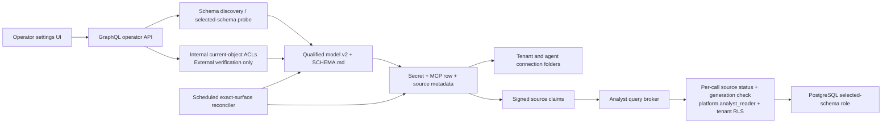
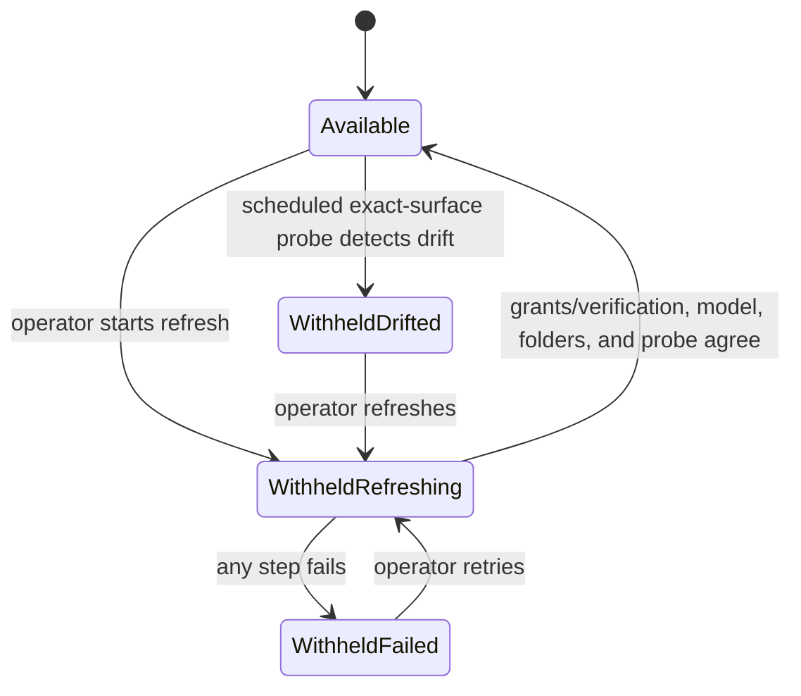
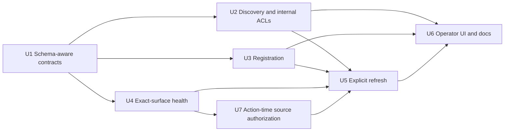

# feat: Add schema-scoped Analyst data sources

## Overview

Let a tenant operator register exactly one PostgreSQL schema as an Analyst data
source. Internal registration will discover eligible schemas and provision a
least-privilege reader over only the selected schema's current tables. External
registration will accept a schema name, default it to `public`, and verify the
credential's exact visible surface. Models, signed source claims, health checks,
operator views, and generated agent context will all preserve schema-qualified
identities such as `raw_jde.orders`.

New tables will remain unavailable until an operator explicitly refreshes the
source. Refresh will use a durable fail-closed state so the broker withholds the
source while PostgreSQL grants, S3 model artifacts, connection folders, and health
metadata are being reconciled (see origin:
`docs/brainstorms/2026-07-13-analyst-data-source-schema-selection-requirements.md`).

---

## Problem Frame

Registration currently hard-codes PostgreSQL's `public` schema at every important
layer: table discovery, role grants, `search_path`, semantic model identity, and
health checks. McPherson's `thinkwork_warehouse` instead stores business data in
`raw_jde`, operational data in `platform`, and no tables in `public`, so a valid
internal reader is provisioned and then registration fails with the misleading
instruction to grant a credential access to `public`.

The feature must solve that concrete registration failure without using proxy views,
silently exposing future tables, or broadening the product into cross-schema access.
Because PostgreSQL ACL changes and S3 artifact writes are separate systems, explicit
refresh also needs a recoverable failure state rather than pretending the whole update
is transactional.

---

## Requirements Trace

- R1. Every PostgreSQL Analyst source has one schema; omitted and legacy values resolve
  to `public`.
- R2. Internal registration discovers eligible non-system schemas for the selected
  database and makes the operator select one intentionally.
- R3. External registration accepts a schema, defaults to `public`, and validates the
  supplied credential against that schema.
- R4. Registration identifies a missing or empty selected schema and stops before
  connector, secret, or S3 artifacts are persisted.
- R5. An internal reader can use only approved current tables in the selected schema;
  it receives no implicit access to another user-defined schema.
- R6. Models, generated schema guidance, signed broker claims, runtime metadata, REST
  projections, and drift checks retain schema-qualified table identity.
- R7. PostgreSQL default privileges must not grant the reader access to tables created
  after registration.
- R8. Only an operator refresh can add newly eligible tables to a registered source's
  product-visible grant and model surface.
- R9. Refresh removes dropped or inaccessible objects from model artifacts and keeps a
  partially refreshed source withheld until retry succeeds.

**Origin actors:** A1 (tenant operator), A2 (ThinkWork Analyst)

**Origin flows:** F1 (register a schema-scoped internal source), F2 (refresh a source
after schema drift)

**Origin acceptance examples:** AE1 (register McPherson `raw_jde` without exposing
`platform`), AE2 (empty schema leaves no artifacts), AE3 (new table remains unavailable
until refresh), AE4 (refresh adds and removes model objects)

---

## Scope Boundaries

- One schema per source; do not add schema allowlists, cross-schema joins, or
  whole-database registration.
- Do not add table-by-table selection. The approved surface is all currently eligible
  objects in the selected schema at registration or explicit refresh time.
- Do not use PostgreSQL default privileges to expose future tables automatically.
- Do not change the built-in `postgres-dev` Analyst connector or its provisioning
  refresh flow.
- Do not change network topology, credential brokering, query budgets, SQL safety
  checks, audit evidence, or tenant authorization.
- Do not let ThinkWork expand privileges for external sources; the external database
  administrator remains responsible for grants.
- Do not introduce a database migration. The new source attributes live in existing
  JSON metadata and the semantic model is an S3 JSON artifact.

### Deferred to Follow-Up Work

- Cross-schema joins and multi-schema sources: reconsider only when a concrete use case
  demonstrates the need.
- Table-level inclusion/exclusion controls: separate product design if schema-wide
  approval proves too coarse.

---

## Context & Research

### Relevant Code and Patterns

- `packages/database-pg/graphql/types/core.graphql` owns the registration inputs and
  Analyst operator API. It currently has no schema discovery or sourced-refresh field.
- `packages/api/src/lib/analyst/internal-clusters.ts` discovers internal clusters and
  databases. Its current registration key is host plus database, which cannot
  distinguish two schemas in one database.
- `packages/api/src/lib/analyst/provision-reader-role.ts` contains the hardened internal
  role pattern, but currently fixes `search_path` and grants to `public` and grants
  future access with `ALTER DEFAULT PRIVILEGES`.
- `packages/api/src/lib/analyst/register-data-source.ts` performs the pre-persistence
  probe, writes the model/schema artifacts, stores the broker secret, creates the MCP
  row, and materializes connection folders. Preserve that fail-before-persistence
  ordering for registration.
- `packages/database-pg/src/analyst/semantic-model.ts` defines model v1 and renders
  `SCHEMA.md`. It needs a backward-compatible reader and a schema-aware writer.
- `packages/lambda/analyst-caller-context.ts` and
  `packages/api/src/lib/analyst/caller-context.ts` define and mint signed source claims.
  They already provide the right compatibility seam for a defaulted schema claim.
- `packages/api/src/lib/analyst/connection-probe.ts` and
  `packages/api/src/handlers/analyst-connection-reconciler.ts` are the established
  fail-closed health projection and scheduled drift-check path.
- `apps/web/src/components/settings/SettingsMcpServers.tsx` owns both internal and
  external registration forms. `SettingsMcpServerDetail.tsx` is the natural sourced
  connector refresh and diagnostics surface.
- GraphQL client artifacts are generated independently for `apps/cli`, `apps/web`, and
  `apps/mobile`; all three must stay schema-compatible even though only the web operator
  app gains registration and refresh controls in this slice.

### Institutional Learnings

- `docs/solutions/security/analyst-external-postgres-role-provisioning-runbook-2026-07.md`
  already recommends a schema-specific `search_path`, generated current-object grants,
  and no implicit access to new tables. Reuse that least-privilege posture.
- `docs/solutions/architecture-patterns/analyst-external-postgres-dual-plane-2026-07.md`
  keeps data-plane credentials and network access behind the existing broker. Schema
  selection must not create a direct application query path.
- The manual Drizzle migration drift pattern does not apply because this feature adds no
  relational schema object; avoid inventing a migration solely to store source schema.

### External References

- [PostgreSQL schema privileges and search path](https://www.postgresql.org/docs/current/ddl-schemas.html):
  object access requires schema `USAGE`, and a narrowed `search_path` supports the
  one-schema posture.
- [PostgreSQL ALTER DEFAULT PRIVILEGES](https://www.postgresql.org/docs/current/sql-alterdefaultprivileges.html):
  default ACL changes affect future objects created by the targeted role. The existing
  grant conflicts with explicit-refresh-only behavior and must be removed and repaired
  for previously attempted internal readers.

---

## Key Technical Decisions

| Decision                        | Chosen design                                                                                                                                                                                                                    | Rationale                                                                                                                                                                                    |
| ------------------------------- | -------------------------------------------------------------------------------------------------------------------------------------------------------------------------------------------------------------------------------- | -------------------------------------------------------------------------------------------------------------------------------------------------------------------------------------------- |
| Internal schema discovery       | Add a database-scoped schema query invoked after database selection; exclude PostgreSQL/system schemas, return current eligible-object counts, and mark exact schema registrations                                               | Avoids connecting to every database during cluster listing and fixes host-plus-database registration ambiguity                                                                               |
| External schema UX              | Add a schema text field defaulted to `public`                                                                                                                                                                                    | Discovering schemas would require sending credentials before submit and complicate secret handling for little value; registration remains the authoritative probe                            |
| Schema identity                 | Default an omitted value to `public`, trim input, preserve the catalog's exact case, reject system schemas, and render qualified SQL identifiers with PostgreSQL-safe quoting when needed                                        | Lowercasing or naïve `schema.table` concatenation would break valid mixed-case names or create an injection/incorrect-query boundary                                                         |
| Eligible object type            | Model and grant ordinary base tables only; treat views, materialized views, foreign tables, and other relation kinds as unsupported/unexpected access                                                                            | A selected-schema view can read another schema under its owner's privileges, which would undermine the single-schema boundary and the explicit decision not to support cross-schema joins    |
| Persisted model identity        | Write model v2 with `schema` on every table; normalize model v1 tables to `public` when reading                                                                                                                                  | Per-table qualified identity future-proofs consumers without enabling multi-schema behavior now; legacy artifacts keep working                                                               |
| Source metadata                 | Store `schema`, source `kind`, internal `clusterId`, and an opaque source generation in `runtime_metadata.analyst_source`; read missing schema as `public` and retain current host-based kind inference for legacy rows          | Refresh needs a durable route back to the correct control plane, and signed claims need a currentness token, without a relational migration                                                  |
| Internal privilege surface      | Grant `CONNECT`, schema `USAGE`, and `SELECT` only on current selected-schema objects; narrow `search_path`; revoke reader access outside the selected schema; remove/revoke legacy default ACL grants                           | Database enforcement, rather than agent instructions, remains the security boundary and future tables stay inaccessible                                                                      |
| Exact-surface health            | Evaluate effective privileges (including role membership and `PUBLIC`), probe both expected qualified base tables and unexpected accessible relations, and reject write/schema-creation or out-of-schema access                  | Direct grant catalogs alone miss inherited and `PUBLIC` privileges; effective privilege checks keep the claimed read-only, one-schema posture honest                                         |
| Refresh atomicity               | Stamp a durable attempt ID and leased `analyst_refresh` withhold state before any side effect; reconcile grants/model/folders/probe; compare-and-set a new source generation and clear the gate only after all outputs agree     | PostgreSQL and S3 cannot share a transaction, so availability must be the commit point; attempt ownership prevents concurrent or expired workers from committing                             |
| Action-time refresh enforcement | Before each sourced query, the broker reads the tenant's source row from the platform database under existing `analyst_reader` RLS and requires an active row, no refresh/probe gate, and a generation matching the signed claim | Config projection alone cannot revoke a claim minted before refresh; the per-call check closes the partial-refresh and stale-session hole and fails closed when control state is unavailable |
| Artifact storage                | Keep the existing fixed per-source S3 keys and make the refresh gate authoritative during overwrite                                                                                                                              | Avoids a new artifact-pointer schema while preventing the broker from dispatching against a half-refreshed model                                                                             |
| Cross-schema behavior           | Do not add broker-side cross-schema parsing or allowlists                                                                                                                                                                        | The chosen product contract is one schema, and PostgreSQL role privileges remain the enforceable query boundary                                                                              |

---

## Open Questions

### Resolved During Planning

- How should internal schemas be discovered? Use a separate database-scoped query after
  database selection, not eager discovery in the cluster list.
- How should external schema selection work? Accept an operator-entered schema with
  `public` prefilled and validate it only on registration.
- Where should schema identity live? Carry it through input, runtime metadata, signed
  claims, per-table model identity, rendered docs, REST/UI projections, and probes.
- How can refresh be atomic across PostgreSQL and S3? It cannot be transactional; make
  durable broker withholding plus an attempt-owned generation compare-and-set the commit
  protocol, and leave failure state retryable.
- How are already-minted source claims blocked during refresh? Include the source generation
  in new claims and require the sourced broker to re-read current tenant-scoped control state
  before every query; config-time withholding alone is insufficient.
- How are future internal tables withheld? Stop granting default privileges and grant
  only current objects during registration or explicit refresh.
- Can multiple schemas in one database be registered as separate sources? Yes, but each
  source remains independently single-schema and exact registration coverage is keyed
  by host, database, and schema.

### Deferred to Implementation

- Exact helper and GraphQL result type names may follow nearby naming conventions once
  edits begin; the contract and lifecycle in this plan are fixed.
- The exact helper name and catalog query for base-table eligibility may follow the local
  SQL utility pattern during implementation, but the result is fixed: ordinary base tables
  only, with views, materialized views, foreign tables, and other relation kinds rejected
  as unsupported accessible surface.
- Whether to factor shared PostgreSQL identifier quoting into a new analyst helper or an
  existing SQL utility is an implementation-local refactor. Dynamic schema/role names
  must never be interpolated without robust identifier quoting.

---

## Alternative Approaches Considered

- **Config-time withholding only:** Rejected because an agent session can retain a signed
  source claim minted before refresh. Without the broker's current-state check, that claim
  could continue using changed ACLs after the connector disappears from newly generated
  configuration.
- **Create a new PostgreSQL role and credential for every refresh generation:** This gives
  clean grant-version isolation but adds password/secret rotation, connection-cache
  invalidation, abandoned-role cleanup, and external-source behavior that ThinkWork cannot
  control. A generation-bound action-time check preserves the current credential model with
  lower operational cost.
- **Parse every SQL statement against a schema/table allowlist inside the broker:** Rejected
  as the primary boundary because PostgreSQL parsing and name resolution are richer than a
  lightweight application parser, and it still cannot correct an over-privileged external
  credential outside ThinkWork. Exact DB privileges plus control-state authorization remain
  authoritative.
- **Version every S3 model and atomically swap a stored artifact pointer:** Viable but would
  add a new durable pointer/migration and cleanup lifecycle. Fixed keys are sufficient once
  all new and already-minted calls are denied during refresh and generation mismatches are
  rejected afterward.

---

## High-Level Technical Design

> _This illustrates the intended approach and is directional guidance for review, not
> implementation specification. The implementing agent should treat it as context, not
> code to reproduce._

Refresh uses availability as its commit point:

Implementation dependencies:

---

## Implementation Units

- U1. **Introduce schema-aware source and model contracts**

**Goal:** Establish one backward-compatible schema identity used by stored models,
runtime metadata, signed caller context, descriptor hashes, and GraphQL inputs before
changing privilege behavior.

**Requirements:** R1, R6; F1; AE1

**Dependencies:** None

**Files:**

- Modify: `packages/database-pg/graphql/types/core.graphql`
- Modify: `packages/database-pg/src/analyst/semantic-model.ts`
- Create: `packages/database-pg/src/analyst/semantic-model.test.ts`
- Modify: `packages/lambda/analyst-caller-context.ts`
- Modify: `packages/lambda/__tests__/analyst-caller-context.test.ts`
- Modify: `packages/api/src/lib/analyst/caller-context.ts`
- Modify: `packages/api/src/lib/analyst/caller-context.test.ts`

**Approach:**

- Add an optional/defaultable schema to external and internal registration contracts and
  define schema discovery and refresh result shapes without enabling multi-schema input.
- Make new writes emit model v2 with a schema on every table. Add one normalization path
  that accepts v1 and supplies `public`; downstream renderers and hashes consume only the
  normalized representation.
- Render qualified names in `SCHEMA.md` and include schema in stable table descriptors so
  same-named tables cannot collide. Preserve raw catalog identity in JSON and render a
  SQL-safe qualified reference, quoting mixed-case or punctuation-bearing schema/table
  identifiers when guidance is meant to be copied into a query.
- Add schema and source generation to signed source claims. Callers mint `public` when
  legacy runtime metadata omits schema; legacy rows with no generation remain usable until
  their first successful refresh, while refreshed rows require exact generation equality.
  The Lambda validator accepts old in-flight claim shapes only under those legacy rules and
  normalizes them before policy use.

**Execution note:** Add characterization coverage for v1 model and claim payloads before
changing the shared parsers.

**Patterns to follow:**

- Versioned normalization in `packages/database-pg/src/analyst/semantic-model.ts`.
- Structural, fail-closed claim validation in `packages/lambda/analyst-caller-context.ts`.

**Test scenarios:**

- Happy path: a v2 model containing `raw_jde.orders` renders the qualified name and
  produces a descriptor distinct from `public.orders`.
- Edge case: raw mixed-case/punctuation catalog names remain unchanged in model JSON and
  render as correctly quoted qualified SQL identifiers rather than being lowercased or
  split.
- Compatibility: a model v1 artifact with table `orders` normalizes and renders as
  `public.orders` without changing column metadata.
- Compatibility: legacy source metadata and a legacy signed claim with no schema resolve
  to `public`; a new claim preserves `raw_jde` and its generation through signing and
  verification.
- Error path: malformed model versions, empty schema identifiers, and non-string claim
  schemas fail through the existing validation/error channel rather than being trusted.

**Verification:**

- Every table identity consumer can operate on one normalized qualified representation,
  and existing v1/public sources remain readable without rewriting stored artifacts.

---

- U2. **Discover schemas and harden internal reader provisioning**

**Goal:** Let operators see eligible schemas in a selected internal database and provision
an exact current-object reader for one safely quoted schema with no future-table grants.

**Requirements:** R2, R5, R7; F1; AE1, AE3

**Dependencies:** U1

**Files:**

- Modify: `packages/api/src/lib/analyst/internal-clusters.ts`
- Modify: `packages/api/src/lib/analyst/internal-clusters.test.ts`
- Create: `packages/api/src/graphql/resolvers/analyst/analystInternalSchemas.query.ts`
- Create: `packages/api/src/graphql/resolvers/analyst/analystInternalSchemas.query.test.ts`
- Modify: `packages/api/src/graphql/resolvers/analyst/index.ts`
- Modify: `packages/api/src/lib/analyst/register-internal-data-source.ts`
- Modify: `packages/api/src/lib/analyst/register-internal-data-source.test.ts`
- Modify: `packages/api/src/lib/analyst/provision-reader-role.ts`
- Modify: `packages/api/src/lib/analyst/provision-reader-role.test.ts`

**Approach:**

- Resolve the selected cluster/database through the existing internal inventory, then
  query only that database for non-system user schemas and current eligible-object counts.
  Include zero-count user schemas as disabled/unsuitable results so an empty `public` is
  explained rather than silently omitted.
- Exclude PostgreSQL-owned/system schemas and report exact registration coverage using
  host, database, and normalized schema. Keep the built-in workspace source behavior
  unchanged.
- Validate the selected schema against discovery before provisioning. Use bind parameters
  for catalog values and a shared PostgreSQL identifier-quoting boundary for dynamic ACL
  statements.
- Reconcile the reader role to selected-schema-only access: retain hardening and database
  `CONNECT`, revoke direct user-schema access outside the selection, grant selected-schema
  `USAGE` and current-object `SELECT`, and narrow `search_path`.
- Generate grants from the same base-table catalog used by the model instead of `ALL
TABLES`, then verify effective privileges after provisioning. If inherited or `PUBLIC`
  grants still expose another user schema or unsupported relation, fail with DBA
  remediation rather than changing database-wide `PUBLIC` policy.
- Remove the existing `ALTER DEFAULT PRIVILEGES ... GRANT SELECT` behavior. Revoke the
  legacy default grant for provisioned roles under the internal administrator so failed
  or retried pre-feature registrations do not retain automatic future access.

**Execution note:** Test the emitted privilege intent before changing live provisioning;
this module is the primary database security boundary.

**Patterns to follow:**

- Cluster and Secrets Manager resolution in
  `packages/api/src/lib/analyst/internal-clusters.ts`.
- Idempotent role hardening and generated current-object grants in
  `packages/api/src/lib/analyst/provision-reader-role.ts` and the external provisioning
  runbook.

**Test scenarios:**

- Covers AE1. Happy path: a database with empty `public`, `raw_jde.orders`, and
  `platform.mirror_batch` returns `raw_jde` and `platform` with counts; provisioning
  `raw_jde` grants no access to `platform`.
- Edge case: `pg_catalog`, `information_schema`, and temporary/system schemas are excluded;
  an empty user schema is returned with zero eligible objects and cannot be submitted; an
  already registered schema is marked independently from another schema in the same
  database.
- Security: mixed-case and punctuation-bearing catalog schema names are quoted as one
  identifier and cannot alter the generated ACL statement.
- Security: a selected-schema view that reads another schema, a materialized/foreign table,
  an inherited role grant, or a `PUBLIC` grant is not mistaken for an approved base table;
  provisioning fails if the effective role surface cannot be isolated without a global
  policy change.
- Covers AE3. Security: provisioning contains no future-object SELECT grant, repairs the
  legacy default ACL for the reader, and a new table is not covered by the recorded
  current-object grant set.
- Error path: unknown cluster, unknown database, missing schema, or a catalog connection
  failure yields an operator-safe error and performs no role mutation.

**Verification:**

- Internal discovery is database-scoped, exact schema registration coverage is visible,
  and the provisioned role's database ACL surface is restricted to current objects in the
  selected schema.

---

- U3. **Register a schema-scoped source and persist qualified artifacts**

**Goal:** Make both registration mutations validate one selected schema before persistence
and store enough source identity for broker use and later refresh.

**Requirements:** R1, R3, R4, R5, R6; F1; AE1, AE2

**Dependencies:** U1, U2 for the internal path

**Files:**

- Modify: `packages/api/src/lib/analyst/register-data-source.ts`
- Modify: `packages/api/src/lib/analyst/register-data-source.test.ts`
- Modify: `packages/api/src/lib/analyst/register-internal-data-source.ts`
- Modify: `packages/api/src/lib/analyst/register-internal-data-source.test.ts`
- Modify: `packages/api/src/graphql/resolvers/analyst/registerAnalystDataSource.mutation.ts`
- Modify: `packages/api/src/graphql/resolvers/analyst/registerAnalystDataSource.mutation.test.ts`
- Modify: `packages/api/src/graphql/resolvers/analyst/registerInternalAnalystDataSource.mutation.ts`
- Modify: `packages/api/src/graphql/resolvers/analyst/registerInternalAnalystDataSource.mutation.test.ts`

**Approach:**

- Normalize omitted schema to `public` at the input boundary and pass it explicitly
  through validation, probe, model generation, metadata persistence, and materialization.
- Preserve exact catalog case and reject empty, NUL-bearing, missing, PostgreSQL-system,
  or otherwise non-resolvable schema input before dynamic SQL is constructed.
- Probe `information_schema` for the selected schema, preserve qualified names, and issue
  schema-specific missing/empty/no-SELECT diagnostics. For external credentials, reject
  access outside the selected user schema so registration cannot advertise isolation that
  the database role does not enforce.
- Build the model from ordinary base tables only. Check effective SELECT and write
  privileges through PostgreSQL privilege functions/catalog OIDs so inherited and `PUBLIC`
  access is included; also reject schema/database creation capability relevant to escaping
  the read-only posture.
- Keep the existing preflight ordering: connection/schema/privilege/model validation must
  finish before storing a password, writing S3 artifacts, inserting the MCP server row, or
  materializing folders.
- Store schema and kind for all sourced connectors and `clusterId` for internal sources in
  `runtime_metadata.analyst_source`. Assign an initial opaque source generation for new
  rows. Keep the fixed artifact keys and emit model v2 plus schema-qualified `SCHEMA.md`.

**Patterns to follow:**

- Existing normalized input and registration ceremony in
  `packages/api/src/lib/analyst/register-data-source.ts`.
- GraphQL `BAD_USER_INPUT` mapping in the two Analyst registration resolvers.

**Test scenarios:**

- Covers AE1. Integration: internal registration of `raw_jde` provisions the selected
  role, writes only `raw_jde.orders` to model/docs, stores internal routing metadata, and
  returns a registered source.
- Happy path: external registration with explicit `sales` verifies only `sales`, stores
  kind/schema metadata, and never attempts to change external ACLs.
- Compatibility: an external registration omitting schema uses `public` and produces the
  same route/artifact locations as before.
- Validation: an empty, NUL-bearing, system, or case-mismatched schema is rejected without
  silently lowercasing it or falling back to `public`.
- Covers AE2. Error path: a missing, empty, or no-SELECT schema names that schema in the
  error and leaves secret, S3, database row, and connection folders untouched.
- Security: a credential with selected-schema SELECT plus access to another user schema
  is rejected with least-privilege remediation rather than silently accepted.
- Security: a credential whose direct grants look read-only but whose role membership or
  `PUBLIC` privileges permit writes, schema creation, views, foreign tables, or another
  user schema is rejected on its effective surface.
- Failure path: secret, S3, row, or folder persistence failures retain the existing
  compensation behavior and never return a successful registration.

**Verification:**

- Both mutations persist a complete one-schema source identity only after the exact
  qualified table surface is verified, and McPherson's `raw_jde` case no longer depends on
  `public` views.

---

- U4. **Make health reconciliation schema-aware and exact-surface**

**Goal:** Detect missing, changed, or unexpectedly exposed qualified objects and withhold
drifted sources without letting scheduled checks override an operator refresh failure.

**Requirements:** R5, R6, R7, R9; F2; AE3, AE4

**Dependencies:** U1, U3

**Files:**

- Modify: `packages/api/src/lib/analyst/connection-probe.ts`
- Modify: `packages/api/src/lib/analyst/connection-probe.test.ts`
- Modify: `packages/api/src/lib/analyst/external-source-probe.test.ts`
- Modify: `packages/api/src/handlers/analyst-connection-reconciler.ts`
- Create: `packages/api/src/handlers/analyst-connection-reconciler.test.ts`
- Modify: `packages/api/src/lib/mcp-configs.ts`
- Modify: `packages/api/src/lib/__tests__/mcp-configs-analyst-probe.test.ts`
- Create: `packages/api/src/lib/__tests__/mcp-configs-analyst-source.test.ts`
- Modify: `packages/api/src/handlers/canvas-refresh.ts`

**Approach:**

- Extend table descriptors and hashes with normalized schema identity, and parameterize
  catalog/privilege checks by the source's selected schema instead of `public`.
- Compare the expected model to the exact credential-visible selected-schema surface,
  including unexpected SELECT-capable relations. Also identify effective write/schema
  creation privileges and accessible objects outside the selected user schema as an
  isolation failure; use the same base-table predicate as registration and refresh.
- Make the reconciler parse/normalize model artifacts instead of casting raw JSON, and
  preserve legacy v1/public behavior.
- Keep scheduled probe state and explicit refresh state separate. The dispatch projection
  withholds on either failure; a successful scheduled probe may update `analyst_probe` but
  must never clear `analyst_refresh`.
- Reuse the normalized source-claim builder in standard MCP config generation and canvas
  refresh so every broker token carries the same schema.

**Patterns to follow:**

- Existing descriptor hashing and scheduled-gate timestamps in
  `packages/api/src/lib/analyst/connection-probe.ts`.
- Withheld-reason projection in `packages/api/src/lib/mcp-configs.ts`.

**Test scenarios:**

- Happy path: expected `raw_jde.orders` with matching columns and no extra access records
  an OK probe and leaves the source dispatchable.
- Covers AE3. Drift: a newly granted but unmodeled `raw_jde.new_orders` is reported as an
  unexpected object and withholds the source instead of expanding the model.
- Drift: dropped table, revoked SELECT, column-shape change, or access to
  `platform.mirror_batch` produces a qualified, actionable failure reason.
- Security: an inherited/`PUBLIC` privilege, newly selectable view, or new schema-creation
  privilege is detected even when `role_table_grants` contains no direct row for it.
- Compatibility: a v1 model and source metadata with no schema probe `public` and produce
  the legacy-equivalent descriptor.
- Failure path: invalid model JSON, Secrets Manager failure, connection timeout, and
  catalog-query failure persist a retryable probe failure without crashing the whole
  reconciliation batch.
- State isolation: a successful scheduled probe does not clear a `running` or `failed`
  refresh gate; MCP config stays withheld until refresh succeeds.

**Verification:**

- Health is based on exact qualified privilege surface, every malformed/drifted source is
  fail-closed, and the scheduled reconciler cannot accidentally commit a partial refresh.

---

- U7. **Enforce current source authorization inside the broker**

**Goal:** Prevent already-minted source claims and stale agent configurations from bypassing
refresh, drift, disablement, or generation changes at query time.

**Requirements:** R5, R7, R8, R9; F2; AE3, AE4

**Dependencies:** U1, U4

**Files:**

- Create: `packages/lambda/analyst-source-authorization.ts`
- Create: `packages/lambda/__tests__/analyst-source-authorization.test.ts`
- Modify: `packages/lambda/analyst-query-broker.ts`
- Modify: `packages/lambda/__tests__/analyst-query-broker.test.ts`

**Approach:**

- Add a per-call sourced authorization check after caller-context tenant/slug verification
  but before resolving the warehouse credential or opening the source connection.
- Use the broker's existing platform `analyst_reader` connection, a transaction-scoped
  tenant GUC, and the existing `tenant_mcp_servers` RLS policy to load the exact tenant/slug
  row. Require the row to be approved/enabled, free of probe/refresh gates, and generation-
  equal to the signed claim.
- Treat a missing row, tenant mismatch, malformed metadata, stale generation, or platform
  control-database error as denial. Never fall through to the sourced connection on an
  authorization lookup error.
- Permit legacy rows with no generation only while both the row and claim are legacy-shaped;
  the first successful refresh establishes a generation and permanently ends that fallback
  for the source.

**Execution note:** Start with broker-order tests that prove denial happens before Secrets
Manager and source database access; this is an action-time security boundary.

**Patterns to follow:**

- Caller-context verification and sourced-path fail-closed order in
  `packages/lambda/analyst-query-broker.ts`.
- Dedicated platform reader connection in `packages/lambda/analyst-reader-db.ts` and tenant
  RLS on `tenant_mcp_servers` from `packages/database-pg/drizzle/0230_analyst_rls.sql`.

**Test scenarios:**

- Happy path: current tenant/slug, approved/enabled row, no gates, and matching generation
  authorizes source credential resolution and querying.
- Action-time security: a claim minted before refresh is rejected while refresh is running
  and remains rejected after success when its generation is stale.
- Authorization: an unknown/disabled row, tenant or slug mismatch, failed/stale probe,
  running/failed refresh, malformed metadata, or control-database outage is rejected before
  Secrets Manager and the source database are touched.
- Compatibility: a legacy claim is accepted only for the matching legacy row with no
  generation; it is rejected as soon as the row has a generation.
- Session hygiene: tenant GUC scope cannot leak between sequential broker invocations on a
  reused platform connection, including after an authorization query throws.

**Verification:**

- No sourced query can rely solely on a previously minted claim; current tenant-scoped
  source state and generation are re-authorized before every source-side effect.

---

- U5. **Add an explicit fail-closed source refresh**

**Goal:** Give operators the sole product flow that reconciles current eligible objects,
grants where ThinkWork is authoritative, artifacts, folders, and health for an existing
sourced connector.

**Requirements:** R7, R8, R9; F2; AE3, AE4

**Dependencies:** U2, U3, U4, U7

**Files:**

- Create: `packages/api/src/lib/analyst/refresh-data-source.ts`
- Create: `packages/api/src/lib/analyst/refresh-data-source.test.ts`
- Create: `packages/api/src/graphql/resolvers/analyst/refreshAnalystDataSource.mutation.ts`
- Create: `packages/api/src/graphql/resolvers/analyst/refreshAnalystDataSource.mutation.test.ts`
- Modify: `packages/api/src/graphql/resolvers/analyst/index.ts`
- Modify: `packages/database-pg/graphql/types/core.graphql`
- Modify: `packages/api/src/lib/analyst/provision-reader-role.ts`
- Modify: `packages/api/src/lib/analyst/provision-reader-role.test.ts`

**Approach:**

- Authorize the mutation with the existing tenant-operator boundary and resolve only a
  sourced Analyst server owned by that tenant; reject built-in/non-Analyst rows.
- Persist `analyst_refresh.status=running` with an opaque attempt ID and lease before
  changing ACLs or artifacts. A concurrent attempt during the lease returns the current
  operation instead of interleaving; an operator retry may take over an expired attempt.
  Every later metadata write compares the attempt ID so a superseded worker cannot commit.
- Internal refresh resolves the stored cluster/database/schema and reconciles current
  selected-schema ACLs without rotating the reader password. External refresh uses the
  stored credential and models only the current DBA-granted exact surface; it never
  issues grants.
- Generate the normalized v2 model and qualified schema doc, overwrite the existing
  per-source S3 artifacts, rematerialize connection folders, run an immediate exact
  probe, then atomically compare-and-set a new source generation and clear/mark successful
  refresh state as the final commit action. New configurations mint only that generation.
- On any failure, persist a sanitized failed state with step/remediation detail and leave
  the source withheld. Retry starts from the stored source identity and converges all
  outputs; a crash after internal grants but before artifact writes therefore cannot make
  the half-refreshed source dispatchable.
- The gate applies to new broker calls. A SELECT already authorized and executing when the
  operator starts refresh is allowed to finish; refresh does not attempt unsafe query
  cancellation, and no newly granted object is reachable by that already-fixed statement.
- Return before/after object counts and added/removed qualified names sufficient for the
  operator confirmation, without returning secrets or raw PostgreSQL errors.

**Execution note:** Start with lifecycle tests that force a failure after each external
side effect; partial-state behavior is the central correctness property.

**Patterns to follow:**

- Tenant/operator authorization in existing Analyst mutations.
- Fixed S3 artifact and folder materialization flow in
  `packages/api/src/lib/analyst/register-data-source.ts`.
- Persistent failure/readiness metadata projected by `packages/api/src/lib/mcp-configs.ts`.

**Test scenarios:**

- Covers AE3 / AE4. Integration: internal refresh after one eligible table is added and
  another is removed updates current-object ACLs, model v2, schema docs, folder content,
  and probe state; only then is dispatch restored with correct added/removed results.
- Happy path: external refresh incorporates a table only after the DBA has granted it,
  removes a revoked/dropped object, and executes no ACL SQL.
- Authorization: another tenant, a non-operator, a built-in Analyst server, and a
  non-Analyst MCP server receive the established not-found/forbidden behavior.
- Concurrency: two refresh attempts for the same source cannot interleave their commit
  states; the loser observes the live lease, an expired attempt can be taken over, and a
  late completion from the superseded attempt cannot clear the winner's gate/generation.
- Failure path: forced failure during ACL reconciliation, model upload, folder
  materialization, or immediate probe leaves the source withheld with a retryable step;
  retry converges without password rotation or duplicate rows/secrets.
- State transition: scheduled reconciliation during a running/failed refresh cannot make
  the source available; successful refresh clears only its own gate after an OK probe.

**Verification:**

- Explicit refresh is idempotent, operator-authorized, and fail-closed at every partial
  state, with no automatic model or ACL expansion elsewhere in the product.

---

- U6. **Expose schema selection, refresh, and diagnostics in operator surfaces**

**Goal:** Complete API parity and give operators a predictable registration and refresh
experience, including the McPherson path, while documenting the DBA coordination model.

**Requirements:** R1-R9; A1, A2; F1, F2; AE1-AE4

**Dependencies:** U2, U3, U5

**Files:**

- Modify: `packages/api/src/handlers/skills.ts`
- Create: `packages/api/src/handlers/skills.analyst-data-source.test.ts`
- Modify: `apps/web/src/lib/mcp-api.ts`
- Modify: `apps/web/src/lib/settings-queries.ts`
- Modify: `apps/web/src/components/settings/SettingsMcpServers.tsx`
- Modify: `apps/web/src/components/settings/SettingsMcpServers.test.tsx`
- Modify: `apps/web/src/components/settings/SettingsMcpServerDetail.tsx`
- Modify: `apps/web/src/components/settings/SettingsMcpServerDetail.test.tsx`
- Regenerate: `apps/cli/src/gql/gql.ts`
- Regenerate: `apps/cli/src/gql/graphql.ts`
- Regenerate: `apps/web/src/gql/gql.ts`
- Regenerate: `apps/web/src/gql/graphql.ts`
- Regenerate: `apps/mobile/lib/gql/gql.ts`
- Regenerate: `apps/mobile/lib/gql/graphql.ts`
- Regenerate: `terraform/schema.graphql`
- Modify: `docs/src/content/docs/concepts/analyst-data-sources.mdx`

**Approach:**

- Internal form: fetch schemas only after cluster and database selection, show current
  object counts, disable exact already-registered choices, preselect `public` only when
  appropriate, and require an explicit non-public choice when `public` is empty or
  unsuitable. Reset schema when cluster/database changes.
- External form: add a schema field prefilled with `public`; submit it with the existing
  credential once, and render schema-specific validation errors inline.
- Project schema and refresh status through the existing admin REST result. Show schema in
  sourced connector list/detail views and distinguish sourced Analyst servers from the
  built-in connector, whose existing provisioning action remains unchanged.
- Add a refresh action and confirmation on sourced detail. While running, show the source
  as withheld; on completion show added/removed counts; on failure retain the durable
  remediation and a retry action.
- Preserve labeled controls, keyboard operation, focusable error/remediation content, and
  announced loading/failure states when adding the dependent schema selector and refresh
  action; counts must not be conveyed by color alone.
- Regenerate all actual GraphQL consumers and the derived AppSync schema, then inspect the
  schema diff so subscription-only output does not accidentally gain unsupported fields.
- Update operator docs for one-schema identity, internal versus external responsibility,
  no future default grants, explicit refresh, failure withholding, and qualified names.

**Patterns to follow:**

- Existing internal cluster/database queries and form resets in
  `apps/web/src/components/settings/SettingsMcpServers.tsx`.
- Existing built-in provisioning action states in the registration modal, adapted only
  for sourced detail refresh.

**Test scenarios:**

- Covers AE1. UI integration: selecting McPherson/`thinkwork_warehouse` loads `raw_jde`
  and `platform`; choosing `raw_jde` submits that schema and renders the registered source
  as `thinkwork_warehouse / raw_jde`.
- Edge case: changing cluster or database clears a stale schema; empty/loading/error
  schema results cannot submit; an exact already-registered schema is disabled while a
  different schema in the same database remains selectable.
- Compatibility: external form begins with `public`, existing operator inputs behave as
  before, and admin REST rows with legacy metadata display `public`.
- Covers AE4. UI integration: refresh confirmation calls the sourced refresh mutation,
  disables duplicate action while running, and reports qualified added/removed objects.
- Failure path: a persisted refresh failure is visible after page reload and offers retry;
  it is not replaced by a generic registration or built-in provisioning error.
- Accessibility: keyboard and labeled-control queries can select a schema and invoke
  refresh; loading, empty, and failure messages are associated with the relevant control
  and expose text independent of color.
- REST compatibility: a sourced row projects its stored schema/status, while legacy
  metadata projects `public` and built-in/non-Analyst rows keep their existing shape.
- API parity: generated CLI, web, and mobile clients typecheck against the canonical schema,
  and the subscription schema build remains valid.

**Verification:**

- Operators can select and see the exact schema, refresh only sourced Analyst connectors,
  understand why a source is withheld, and follow documented internal/external remediation.

---

## System-Wide Impact

- **Interaction graph:** Settings UI calls database-scoped discovery or registration;
  registration/provisioning determines PostgreSQL ACLs and writes S3 model artifacts,
  Secrets Manager credentials, MCP runtime metadata, and connection folders; source
  metadata becomes signed broker claims; scheduled reconciliation and explicit refresh
  both feed the dispatch-withhold projection.
- **Error propagation:** Selection errors become schema-specific `BAD_USER_INPUT` before
  persistence. Refresh errors persist a sanitized step and remediation, remain visible
  across reloads, and withhold dispatch. Scheduled per-source failures stay isolated so
  one broken warehouse does not stop the batch.
- **State lifecycle risks:** Registration preserves its existing preflight-before-write
  ceremony. Refresh uses an attempt-owned lease, durable running/failed gate, and source
  generation as the cross-system commit protocol; it supports takeover/retry and never
  rotates an existing reader password. Fixed S3 keys are safe only because both config
  projection and the broker's per-call authorization honor that state.
- **Performance/availability:** Every sourced query adds one tenant-scoped platform database
  authorization read before source credential resolution. It is deliberately uncached so
  refresh/revocation is immediate for new calls; platform control-state unavailability
  denies the query and surfaces a broker authorization outage rather than using stale state.
- **API surface parity:** Canonical GraphQL changes require regenerated CLI, web, and
  mobile types. Admin REST source metadata must also show schema/default compatibility.
  Only the web operator app gets controls; mobile and CLI receive contract compatibility,
  not new user-facing registration flows.
- **Integration coverage:** Unit mocks do not prove real PostgreSQL ACL behavior or the
  cross-system refresh gate. Post-deploy verification must inspect the internal reader,
  model/docs, broker access, and an intentionally denied table in another schema.
- **Unchanged invariants:** The broker still owns query execution and credentials, the
  database role remains the table-access boundary, tenant IDs remain required on source
  dispatch, SQL read-only/budget/audit controls remain unchanged, and no cross-schema join
  capability is introduced.

---

## Risks & Dependencies

| Risk or dependency                                                                        | Mitigation                                                                                                                                                                                                                     |
| ----------------------------------------------------------------------------------------- | ------------------------------------------------------------------------------------------------------------------------------------------------------------------------------------------------------------------------------ |
| Revoking schema/default privileges can affect an existing role or broader `PUBLIC` policy | Revoke only the provisioned reader's direct/default grants under the known internal administrator; never issue a database-wide `REVOKE ... FROM PUBLIC` as part of source refresh                                              |
| A refresh fails after ACLs change but before artifacts change                             | Persist withhold state first, enforce it again inside the broker on every sourced query, and clear it only with the owning attempt after artifacts, folders, and immediate probe agree                                         |
| An old internal role retains the pre-feature default ACL                                  | Make provisioning/refresh idempotently revoke the legacy reader default grant and verify it during McPherson rollout                                                                                                           |
| An external DBA grants a new object out of band                                           | Document that ThinkWork cannot prevent the database grant; exact-surface reconciliation detects and withholds the source within its schedule, and the supported sequence is DBA grant followed immediately by operator refresh |
| A legacy v1 model or row has no schema/kind/cluster metadata                              | Normalize schema to `public`, continue host-based kind inference for old rows, and require new metadata only for new non-public/internal refresh flows                                                                         |
| Dynamic PostgreSQL identifiers create injection or case-folding bugs                      | Parameterize catalog values, centralize robust identifier quoting for ACL SQL, and test mixed-case/punctuation names                                                                                                           |
| Two sources target different schemas in one database                                      | Key exact coverage by host/database/schema and keep each role/model/slug independent                                                                                                                                           |
| Scheduled reconciliation races explicit refresh                                           | Refresh state has separate ownership; reconciler can update probe state but cannot clear or supersede refresh state                                                                                                            |
| A Lambda crashes with refresh marked running                                              | Give each attempt a bounded lease; permit operator takeover after expiry and use attempt-ID compare-and-set so the abandoned worker cannot later commit                                                                        |
| A caller keeps a source claim minted before refresh                                       | Bind claims to source generation and check the current tenant-scoped row before every sourced query; reject running/failed gates and generation mismatch before credential resolution                                          |
| External sources cannot be made perfectly schema-isolated by application code             | Reject excessive privileges during registration, detect later excess access, and state the DBA-enforced isolation dependency explicitly                                                                                        |
| Effective privileges arrive through role membership or `PUBLIC`, not direct grants        | Base registration, health, and refresh checks on PostgreSQL effective privilege functions across non-system relation OIDs; fail with DBA remediation rather than altering global roles/policy                                  |
| A selected-schema view reads another schema with owner privileges                         | Limit the v1 eligible surface to ordinary base tables and reject accessible views/materialized/foreign relations as unsupported                                                                                                |
| The per-query control-state read adds latency and a new fail-closed dependency            | Reuse the existing platform `analyst_reader` connection and tenant RLS path, measure the added broker latency during rollout, and do not cache until a revocation bound is explicitly designed                                 |

---

## Documentation / Operational Notes

- Update the Analyst data-source concept page before rollout so operators know that
  `schema` is a security boundary, not a label, and that new tables require refresh.
- Ship GraphQL, Lambda, and web changes through the normal PR-to-`main` deployment path;
  do not patch a deployed Lambda directly.
- No relational migration or manual Drizzle SQL is expected. Treat any generated database
  migration as a design regression unless implementation uncovers a requirement absent
  from this plan.
- After deployment in McPherson, register `thinkwork_warehouse / raw_jde` through the web
  operator flow and verify: model/docs name `raw_jde.orders`; the broker can query it; the
  provisioned role cannot select `platform.mirror_batch`; no default SELECT ACL exists for
  future objects; and source health is OK.
- Prove add/remove refresh semantics in a controlled development database rather than
  creating test objects in McPherson's warehouse. Capture withheld failure and successful
  retry evidence as part of rollout verification.
- Monitor refresh failures and exact-surface drift reasons after deployment. These states
  need an operator reader and remediation; they must not be silent background failures.

---

## Success Metrics

- McPherson registers `raw_jde` without a `public` proxy view and without granting access
  to `platform.mirror_batch`.
- Every newly written source artifact and caller claim names its selected schema, while
  every legacy omission behaves as `public`.
- A table created after registration remains absent from both role access and model until
  a successful explicit refresh.
- A failed refresh leaves the source visibly withheld and a retry converges it without
  manual artifact cleanup or credential rotation.
- A source claim minted before refresh cannot execute during refresh or after the source
  generation advances.
- Internal discovery and web detail make the effective database/schema surface predictable
  to an operator before and after registration.

---

## Sources & References

- **Origin document:**
  [`docs/brainstorms/2026-07-13-analyst-data-source-schema-selection-requirements.md`](../brainstorms/2026-07-13-analyst-data-source-schema-selection-requirements.md)
- `packages/api/src/lib/analyst/register-data-source.ts`
- `packages/api/src/lib/analyst/provision-reader-role.ts`
- `packages/api/src/lib/analyst/connection-probe.ts`
- `packages/api/src/handlers/analyst-connection-reconciler.ts`
- `packages/database-pg/src/analyst/semantic-model.ts`
- `apps/web/src/components/settings/SettingsMcpServers.tsx`
- `docs/solutions/security/analyst-external-postgres-role-provisioning-runbook-2026-07.md`
- [PostgreSQL schema documentation](https://www.postgresql.org/docs/current/ddl-schemas.html)
- [PostgreSQL default privileges documentation](https://www.postgresql.org/docs/current/sql-alterdefaultprivileges.html)
