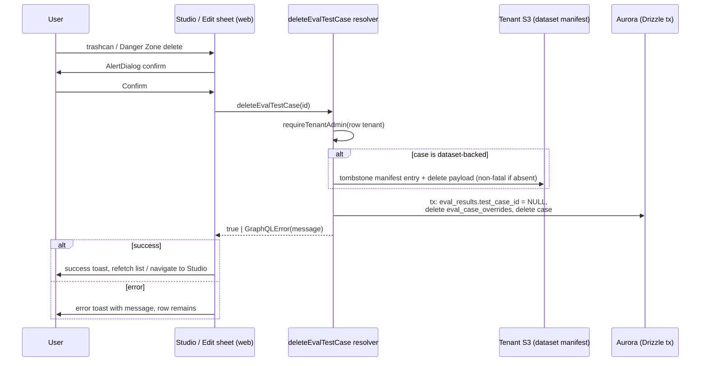

# Eval Test Case Delete - Plan

## Goal Capsule

- **Objective:** Make deleting an eval test case from the Evaluations Studio actually work, with the app-standard confirmation dialog, and add a delete option to the Edit Eval sheet.
- **Product authority:** THINK-289 (reported by Eric Odom); UI conventions from the existing eval test case detail view.
- **Stop conditions:** surface a genuine blocker (scope change or contradiction with this plan) instead of guessing; details the plan leaves open are implementer judgment.
- **Open blockers:** none.

---

## Product Contract

### Summary

Fix the Evaluations Studio trashcan so deleting an eval test case removes it and refreshes the list, replace the native browser `confirm()` with the app-standard confirmation dialog, and add a Danger Zone delete section to the Edit Eval sheet so users can delete without navigating back to the Studio.

### Problem Frame

Clicking the trashcan in the Evaluations Studio shows a native browser confirm, and after clicking OK nothing visibly happens — the row stays. The delete handler in `apps/web/src/components/settings/SettingsEvalStudio.tsx` discards the mutation result: any error (permissions, network, schema drift) is silently swallowed, so the user gets no feedback and the list never changes. The native confirm is also inconsistent with the rest of the application, which uses the shared `AlertDialog` component for destructive confirmations. Separately, deleting from inside an eval's edit view requires exiting to the Studio first, which makes cleanup tedious.

### Key Decisions

- **Reuse the existing detail-view delete pattern.** The test case detail view (`apps/web/src/components/settings/SettingsEvalTestCaseDetail.tsx`) already does this correctly: shared `AlertDialog` confirmation, `toast.error` on failure, `toast.success` on success. Both new surfaces adopt that pattern rather than inventing a new one.
- **Root-causing the silent failure is in scope.** Surfacing the swallowed error is necessary but not sufficient — planning must determine why the delete does not take effect for the reporter (the resolver requires tenant admin; error handling is absent client-side) and the fix must make delete succeed for authorized users, not just report the failure.
- **AgentCore evaluator resource cleanup stays out.** The resolver hard-deletes only the DB row and never cleans up Bedrock AgentCore evaluator resources referenced by `agentcoreEvaluatorIds`. That pre-existing gap is noted as a scope boundary, not fixed here.

### Requirements

**Studio delete fix**

- R1. Deleting an eval test case from the Evaluations Studio trashcan removes it and the list view refreshes to reflect the deletion without a manual reload.
- R2. The delete confirmation uses the app-standard `AlertDialog` confirmation dialog, not the native browser `confirm()`.
- R3. Delete outcomes are surfaced to the user: an error toast with the failure message on error, a success toast on success — no silent failure path remains.

**Edit Eval sheet delete**

- R4. The Edit Eval sheet gains a Danger Zone section at the bottom containing a delete action for the open eval test case, using the same confirmation dialog and outcome toasts.
- R5. After a successful delete from the Edit Eval sheet, the user is returned to the Evaluations Studio and the list reflects the deletion.

### Acceptance Examples

- AE1. **Covers R1, R2, R3.** Given the Evaluations Studio list, when the user clicks the trashcan on a row and confirms in the dialog, then the eval test case is deleted, a success toast appears, and the row disappears from the list.
- AE2. **Covers R3.** Given a delete that fails server-side (e.g., insufficient permissions), when the user confirms the delete, then an error toast with the failure message appears and the row remains.
- AE3. **Covers R4, R5.** Given the Edit Eval sheet for an existing eval test case, when the user uses the Danger Zone delete action and confirms, then the case is deleted, a success toast appears, and the user lands on the Evaluations Studio with the case gone.

### Scope Boundaries

- Cleaning up orphaned Bedrock AgentCore evaluator resources (`agentcoreEvaluatorIds`) on delete is out of scope; if it warrants work, it gets its own issue.
- Soft-delete, undo, or archive semantics are out of scope — delete remains a hard delete.
- The dataset-case remove flow (`removeEvalDatasetCase` mutation and Datasets UI) is untouched; U1 reuses its store helper but does not change its behavior.

### Outstanding Questions

- None. The failure mode deferred from Brainstorming was confirmed against deployed dev on 2026-07-14 — see Root Cause in the Planning Contract.

### Sources

- Grounding: `apps/web/src/components/settings/SettingsEvalStudio.tsx` (broken handler), `apps/web/src/components/settings/SettingsEvalTestCaseDetail.tsx` (correct pattern, `handleDelete` + `AlertDialog`), `apps/web/src/lib/evaluation-queries.ts` (`DeleteEvalTestCaseMutation`), `packages/database-pg/graphql/types/evaluations.graphql` (`deleteEvalTestCase`), `packages/api/src/graphql/resolvers/evaluations/index.ts` (resolver), `packages/ui/src/components/ui/alert-dialog.tsx` (shared dialog).
- Prior art: `docs/plans/2026-05-17-001-feat-eval-studio-filter-header-and-result-edit-sheet-plan.md`, `docs/brainstorms/2026-06-12-evaluations-trust-core-requirements.md`.

---

## Planning Contract

**Product Contract preservation:** changed — Outstanding Questions resolved in place (the single deferred-to-Planning item was answered empirically); one Scope Boundaries bullet clarified to name the reused store helper. R1–R5 and AE1–AE3 unchanged.

### Root Cause (confirmed against deployed dev, 2026-07-14)

The full failure chain was reproduced with Eric's own caller identity against the dev GraphQL endpoint:

1. **Server: FK violation on any test case that has ever been run.** `eval_results.test_case_id` and `eval_case_overrides.test_case_id` both reference `eval_test_cases.id` with no `ON DELETE` behavior (Postgres NO ACTION — verified in the dev DB: `confdeltype = 'a'` on both constraints). The resolver (`deleteEvalTestCase` in `packages/api/src/graphql/resolvers/evaluations/index.ts`) issues a bare `db.delete(evalTestCases)`, so the delete throws for every case with results. Yoga masks the FK violation as `INTERNAL_SERVER_ERROR` / "Unexpected error." Reproduced: deleting a dev case with 16 results returned that exact masked error; a fresh case with zero results deleted fine (create → delete → gone round trip succeeded).
2. **Client: error swallowed.** The Studio trashcan handler discards the mutation result, so the FK error produces no feedback and the refetch shows an unchanged list — the reported "click OK, nothing happens."
3. **Latent: dataset-backed rows resurrect.** `ensureBaselineDatasetSeeded` (`packages/api/src/lib/evals/baseline-dataset.ts`) re-inserts index rows for manifest-live case ids missing from the DB on the next `BASELINE_DATASET_VERSION` bump. A bare DB hard delete of a dataset-backed row leaves its manifest entry live, so the row comes back after a later deploy. The dataset store already documents the constraint this plan fixes: "Case removal = manifest tombstone + enabled=false on the index row (never a row delete — eval_results history FKs the case)" (`packages/api/src/lib/evals/dataset-store.ts`, `removeEvalDatasetCase`).

Not the cause (ruled out empirically): permission rejection (round trip succeeded for the reporter's identity), deployed schema/resolver drift (mutation is live on dev), urql refetch mechanics (`network-only` re-execute is correct in the current handler).

### Key Technical Decisions

- KTD1. **Fix the delete in the resolver with a transaction, not a schema migration.** Inside one `db.transaction` (all statements on the `tx` handle): `UPDATE eval_results SET test_case_id = NULL` for the case, `DELETE FROM eval_case_overrides` for the case, then `DELETE FROM eval_test_cases`. Rationale: ships in a single Lambda deploy with no migration/deploy ordering; `eval_results.test_case_id` is already nullable and the run-results resolver already renders unlinked rows (`resultRowsWithoutTestCase` in `evalRunResults`), so run history survives — result rows are self-contained snapshots (input, expected, actual output, assertions). Alternative considered: alter the FKs to `ON DELETE SET NULL` / `CASCADE` via a Drizzle migration — more durable for future delete paths, but requires migration + deploy sequencing for no behavior difference here; defer unless a second delete path appears.
- KTD2. **Dataset-backed cases also tombstone the S3 manifest before the DB transaction.** When the case row carries dataset linkage (`dataset_id` + `dataset_case_id`), call the existing `removeEvalDatasetCase` store helper (`packages/api/src/lib/evals/dataset-store.ts`) to delete the S3 payload and tombstone the manifest entry, then run the KTD1 transaction. Treat any tombstone-step failure rooted in manifest state — case not found, manifest missing or unreadable (`readManifestOrThrow` throws before the not-found check) — as non-fatal: log and continue to the DB delete; the helper throws plain `Error`s, so catch-log-continue on the whole tombstone step is the concrete classification, reserving loud failure for the DB transaction itself. Ordering follows the store's S3-first convention; a crash between the two steps leaves a tombstoned manifest plus a live DB row, which the next index sync reconciles (flips `enabled=false`) — acceptable. This deliberately keeps the Studio delete a hard DB delete (product contract) even though the Datasets UI remove keeps the row; the tombstone only prevents version-bump resurrection.
- KTD3. **Unmask the resolver's failure modes with curated messages.** Map anticipated failures to human-readable `GraphQLError`s (pattern: `removeEvalDatasetCase` resolver in `packages/api/src/graphql/resolvers/evaluations/datasets.ts`) and fall back to a generic "Failed to delete test case" for unrecognized transaction errors rather than echoing raw driver text (which can name internal schema objects) into the R3 toast. Permission failures already surface as unmasked `GraphQLError`s from `requireTenantAdmin`.
- KTD4. **Studio adopts the detail-view confirm pattern with a single dialog instance.** One `AlertDialog` at component scope driven by a `pendingDelete: EvalStudioTestCaseRow | null` state (the trashcan sets it), rather than one dialog per row — matches how row-count scales and keeps the column cell a plain button. On confirm: disable the confirm action while the mutation is pending (no double-fire on a destructive action), close the dialog as soon as the confirm resolves the flow (matching the uncontrolled detail-view precedent — the dialog never stays open over an error toast), `toast.error(res.error.message)` on error, `toast.success` + existing `refetch({ requestPolicy: "network-only" })` on success.
- KTD5. **Danger Zone lives in `EvalTestCaseForm`, rendered only in edit mode, with an overridable exit.** Gated on `isEdit && initial?.id`; a destructive-styled section at the bottom of the form with the same dialog + toasts. The form is embedded in two places: the full-page edit route and `EditEvalTestCaseSheet` in `SettingsEvalRunDetail.tsx` (the sheet titled "Edit Eval"). Mirror the `completeEvalTestCaseFormSubmit` exit pattern: accept an `onDeleted` override (sheet embedding closes the sheet and refetches in place, matching how Save behaves there) and fall back to navigating to `/settings/evaluations/studio` on the full-page route (satisfies R5). The create form (`studio/new`) never shows it.

### High-Level Technical Design

### Assumptions (recorded under LFG, no user confirmation)

- Deleting a case's `eval_case_overrides` rows is acceptable: the override labels reference a case that no longer exists, and `test_case_id` is NOT NULL there so SET NULL is not available without a migration. Historical run views fall back to the raw result status for those rows.
- AE2's server-failure proof in verification may use a forced network failure (DevTools offline / request blocking) if no reproducible server-side rejection is available on dev post-fix — the toast path is identical.
- Tombstoning the dataset manifest from the Studio delete is in scope: the dataset-case remove _flow_ stays untouched (its resolver/UI unchanged); U1 only reuses its store helper.
- Accepted residual race: a case deleted while an eval run is mid-flight can make the runner's `eval_results` insert hit the FK and error that run. Pre-fix the window barely existed (previously-run cases could not be deleted at all); making the runner tolerate a vanished case is follow-up work if it ever bites.
- Deleting from the run-detail "Edit Eval" sheet closes the sheet and refreshes in place rather than navigating to the Studio; R5's return-to-Studio applies to the full-page edit route.

---

## Implementation Units

### U1. Server: transactional delete + dataset tombstone

**Goal:** `deleteEvalTestCase` succeeds for authorized users on any case, including previously-run and dataset-backed cases, and fails loudly with a readable message otherwise.

**Requirements:** R1 (server half), R3 (server half — meaningful error messages).

**Dependencies:** none.

**Files:**

- `packages/api/src/graphql/resolvers/evaluations/index.ts` (rewrite `deleteEvalTestCase`)
- `packages/api/src/graphql/resolvers/evaluations/index.test.ts` (extend the existing `deleteEvalTestCase` gating test block)

**Approach:** Load the row (id, tenant, `dataset_id`, `dataset_case_id`); keep the idempotent `true` for a missing row and the `requireTenantAdmin` gate on the row's tenant. If dataset-backed, tombstone per KTD2 (catch-log-continue on any tombstone-step failure): resolve the dataset slug from `dataset_id` via an `evalDatasets` select, then build deps with the exported `datasetDeps()` and `datasetContext(...)` from `packages/api/src/graphql/resolvers/evaluations/datasets.ts` before calling `removeEvalDatasetCase`. Then the KTD1 transaction: unlink `eval_results`, delete `eval_case_overrides`, delete the case — all on the `tx` handle (a `getDb()` query inside a held tx deadlocks the max-2 pool; pre-resolve everything else outside the tx). Wrap failures in `GraphQLError` per KTD3 (curated message, generic fallback).

**Patterns to follow:** `removeEvalDatasetCase` resolver in `packages/api/src/graphql/resolvers/evaluations/datasets.ts` (GraphQLError wrapping, store-helper usage); existing mutation-gating tests in `index.test.ts`.

**Test scenarios:**

- Deleting a case with `eval_results` rows unlinks them (SET NULL) and deletes the case and its `eval_case_overrides` rows in one transaction.
- Covers AE2. Non-admin caller is rejected before any write (existing gating test still passes).
- Missing row returns `true` without touching other tables (idempotent no-op preserved).
- Dataset-backed case (dataset linkage set) triggers the manifest tombstone helper; manual case (no linkage) never touches S3.
- Any tombstone-step failure (case not in manifest, manifest missing/unreadable) does not abort the DB delete.
- A transaction failure surfaces as a `GraphQLError` with a curated human-readable message; unrecognized errors fall back to a generic "Failed to delete test case" rather than raw driver text.

**Verification:** `pnpm --filter @thinkwork/api test` green. After merge + deploy: against deployed dev, `deleteEvalTestCase` on a case that has eval results returns `true`, `evalTestCase(id)` returns null, and the old run's detail view still renders that case's historical result rows (now unlinked).

### U2. Web: Studio trashcan — AlertDialog, toasts, refresh

**Goal:** The Studio trashcan uses the app-standard confirmation and surfaces every outcome; the list reflects a successful delete without reload.

**Requirements:** R1, R2, R3. Covers AE1, AE2.

**Dependencies:** U1 (for end-to-end proof on previously-run cases; code-independent).

**Files:**

- `apps/web/src/components/settings/SettingsEvalStudio.tsx`
- `apps/web/src/components/settings/SettingsEvalStudio.test.tsx` (new)

**Approach:** Replace `confirm()` with the KTD4 single-dialog pattern: trashcan sets `pendingDelete`, `AlertDialog` confirms (confirm action disabled while pending, dialog closes on confirm), handler awaits the mutation, toasts per outcome (`toast.error` includes `res.error.message`), refetches `network-only` on success. Mirror `handleDelete` in `SettingsEvalTestCaseDetail.tsx`. While rewriting the cell, give the trashcan an accessible name (wrap in `TooltipIconButton` with `label="Delete test case"`, matching the file's toolbar actions, or add `aria-label`).

**Patterns to follow:** `SettingsEvalTestCaseDetail.tsx` (`AlertDialog` + toast pattern); sibling component tests such as `EvalResultOverrideControl.test.tsx` for mocked-urql component testing.

**Test scenarios:**

- Covers AE1. Confirming the dialog calls the delete mutation with the row id, shows a success toast, and re-executes the list query on success.
- Covers AE2. A mutation result carrying `error` shows an error toast containing the message and does not navigate; the list is not marked deleted.
- Cancelling the dialog issues no mutation.
- No `window.confirm` usage remains in the component.

**Verification:** `pnpm --filter @thinkwork/web test` green. Browser flow against deployed dev: open Settings → Evaluations → Studio, click the trashcan on a case that has prior run results, confirm in the `AlertDialog` — success toast appears and the row disappears without a manual reload (AE1). Then force a failure (DevTools network-block on the GraphQL request) and confirm — error toast with a message appears and the row remains (AE2).

### U3. Web: Edit Eval sheet Danger Zone delete

**Goal:** The Edit Eval sheet can delete the open case without exiting to the Studio.

**Requirements:** R4, R5. Covers AE3.

**Dependencies:** U1 (end-to-end proof); independent of U2 in code and landing order.

**Files:**

- `apps/web/src/components/settings/EvalTestCaseForm.tsx`
- `apps/web/src/components/settings/EvalTestCaseForm.test.ts` (extend — exit-helper coverage)
- `apps/web/src/components/settings/EvalTestCaseForm.test.tsx` (new — render-shaped scenarios; the existing `.test.ts` file cannot host JSX)
- `apps/web/src/components/settings/SettingsEvalRunDetail.tsx` (wire `onDeleted` in `EditEvalTestCaseSheet`)

**Approach:** Per KTD5, append a Danger Zone section rendered only when `isEdit && initial?.id`: destructive-styled bordered section at the bottom with a "Delete test case" button opening the same `AlertDialog` + toast flow (confirm disabled while pending). Exit mirrors `completeEvalTestCaseFormSubmit`: an exported delete-exit helper calls `onDeleted` when supplied (the run-detail `EditEvalTestCaseSheet` in `SettingsEvalRunDetail.tsx` passes it to close the sheet and refetch in place) and otherwise navigates to the Studio route (full-page edit — R5). Wire `onDeleted` in the sheet embedding.

**Patterns to follow:** `SettingsEvalTestCaseDetail.tsx` delete flow; existing section markup in `EvalTestCaseForm.tsx`; `EvalTestCaseForm.test.ts` helper-test style; sibling `.test.tsx` component tests for the render scenarios.

**Test scenarios:**

- Danger Zone renders in edit mode and never in create mode (`studio/new`).
- Covers AE3. Successful delete shows a success toast; with no `onDeleted` override it navigates to the Studio route.
- Delete-exit helper calls `onDeleted` instead of navigating when the override is supplied (sheet embedding).
- Failed delete shows an error toast with the message and stays on the edit view.
- Cancelling the dialog issues no mutation.

**Verification:** `pnpm --filter @thinkwork/web test` green. Browser flow against deployed dev: Studio → open a case → Edit → scroll to Danger Zone → delete → confirm — success toast, landing on the Studio with the case gone from the list (AE3); `/settings/evaluations/studio/new` shows no Danger Zone.

---

## Verification Contract

- **Per-package gates (pre-PR, per repo convention):** run the full suites `pnpm --filter @thinkwork/api test` (U1) and `pnpm --filter @thinkwork/web test` (U2/U3), plus `pnpm -r --if-present typecheck`, `pnpm -r --if-present lint`, `pnpm format:check`. Vitest green is not tsc green — run typecheck explicitly.
- **End-to-end proof happens against deployed dev after each unit's PR merges and deploys** (the merge pipeline deploys `graphql-http` and the web app). The user flows named in each unit's Verification block are the contract: AE1 and AE2 via U2's browser flows, AE3 via U3's browser flow, U1 via the GraphQL round trip plus historical-run rendering check.
- **The AE1 flow must use a case with prior eval results** — that is the reproduced failure mode; a fresh unrun case would pass even without U1.
- **Dev auth recipe for API-level checks:** mint a token from the CLI dev session refresh token (`~/.thinkwork/config.json`, Cognito client `3k1480d09t676v9miledd1di7m`) and call `https://ho7oyksms0.execute-api.us-east-1.amazonaws.com/graphql`.

---

## Definition of Done

- R1–R5 all hold on deployed dev, proven by the AE1/AE2/AE3 browser flows and the U1 API round trip.
- No `window.confirm` remains in the two touched delete paths (the starter-pack import confirm in `SettingsEvalStudio.tsx` is out of scope).
- All three units merged to `main` via PRs with green checks; per-package suites, typecheck, lint, and format gates pass.
- Historical eval run views still render result rows for a deleted case (unlinked, name absent) — no regression in run history.
- No dead-end or experimental code from abandoned approaches remains in the diff.
