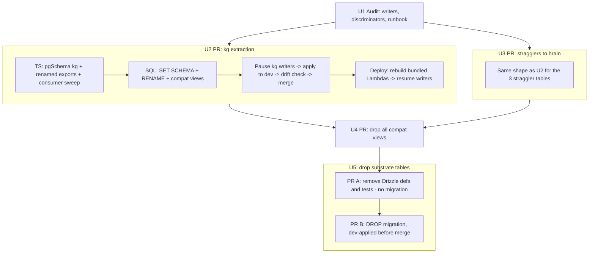

# KG Schema Extraction and Brain Namespace Cleanup - Plan

## Goal Capsule

- **Objective:** Move the five public `knowledge_graph_*` tables into a new `kg` Postgres schema with unprefixed names, move the three public brain-domain stragglers into the `brain` schema, and drop the dead `brain.substrate_*` tables — with zero behavior change for any consumer.
- **Authority hierarchy:** user decisions recorded in this plan's Product Contract > this plan > repo conventions (CLAUDE.md) > implementer judgment on details the plan leaves open.
- **Execution profile:** per-namespace PRs following the repo's proven schema-extraction pattern; each PR carries its own hand-rolled migration applied to dev before merge.
- **Stop conditions:** stop and surface (do not guess) if U1's audit finds `knowledge_graph_*` strings used as wire-stable discriminators that a rename would break; if a dev-DB apply fails partway; if row-count parity checks fail after any apply; or if any consumer of `brain.substrate_*` turns up that the audit missed.
- **Tail ownership:** the implementer owns dev-DB application and drift verification per PR; the operator (Eric) owns the prod/customer-stage apply windows and the pause/resume of scheduled writers during them.

---

## Product Contract

### Summary

Extract `public.knowledge_graph_*` into a new `kg` schema (`kg.entities`, `kg.relationships`, `kg.evidence`, `kg.ingest_runs`, `kg.observation_cursors`), move `public.brain_dream_runs` / `brain_dream_actions` / `memory_retain_attempts` into `brain` as `dream_runs` / `dream_actions` / `retain_attempts`, and drop the reader-less `brain.substrate_states` / `substrate_migrations` / `substrate_events`. The existing `wiki`, `ontology`, and `brain` tables already have the clean per-domain shape and are untouched.

### Problem Frame

The knowledge-domain tables are inconsistently namespaced. Three domains were extracted into their own schemas in the 0089/0090 arc (`wiki.pages`, `ontology.versions`, `brain.pages`) and got clean names, but the knowledge-graph tables were never extracted — they sit in `public` carrying `knowledge_graph_` prefixes — and three brain-domain tables (`brain_dream_runs`, `brain_dream_actions`, `memory_retain_attempts`) also stayed behind in `public`. Meanwhile the `brain.substrate_*` tables are residue of the retired graph substrate with zero application readers. Full consolidation into one schema was considered and rejected: `wiki.pages` and `brain.pages` collide on table and index names, so a merge would force prefixes back on — the opposite of the goal.

The cost of doing nothing is ongoing, not hypothetical: every new kg feature (THINK-290's parent work adds several) either perpetuates the `knowledge_graph_` prefix or introduces a third naming style; analyst SQL and ad-hoc queries must remember which knowledge-domain tables live in `public` vs. their schemas; and the dead `substrate_*` tables keep appearing in schema dumps, SCHEMA.md, and migration tests as live surface. "Defer until the next kg schema change" was considered and rejected: the extraction touches every kg consumer regardless of when it lands, and bundling it with feature work would couple a mechanical rename to behavior changes — the worst time to do it.

### Requirements

**Schema moves**

- R1. The five knowledge-graph tables live in a new `kg` schema with unprefixed names: `kg.ingest_runs`, `kg.entities`, `kg.relationships`, `kg.evidence`, `kg.observation_cursors`. No `public.knowledge_graph_*` relation remains after the arc completes.
- R2. The three stragglers live in `brain`: `brain.dream_runs`, `brain.dream_actions`, `brain.retain_attempts`. Index and constraint names that embed the old table names are renamed to match.
- R3. `brain.substrate_states`, `brain.substrate_migrations`, and `brain.substrate_events` are dropped, preceded by an archival dump noted in the migration header. Their Drizzle definitions and relations are removed.

**Behavior preservation**

- R4. Zero behavior change: every raw-SQL and Drizzle consumer reads/writes the renamed tables; the GraphQL API surface (resolver names, types) is unchanged; all FKs (including `brain.artifact_manifests` → ingest runs, and kg → ontology types) survive the moves intact.
- R5. TypeScript Drizzle exports are renamed to match the new names (`knowledgeGraphEntities` → `kgEntities`, `memoryRetainAttempts` → `brainRetainAttempts`, etc.) in the same PR as each move, so DB names and code names never drift.

**Deploy safety**

- R6. Each move ships with column-enumerated compat views at the old public names, bridging reads during the psql-apply → Lambda-redeploy window. Write paths that views cannot serve (`ON CONFLICT`, `FOR UPDATE`) are inventoried up front and paused during the window per a runbook included in the PR body.
- R7. Migration SQL is unattended-applyable by the customer deployment runner: no psql variables beyond `stage` (guard any others with `\if :{?var}` + safe default), `ON_ERROR_STOP`, advisory lock, `current_database()` guard, and idempotent `to_regclass()` preflights. Because the runner sweeps unrecorded `drizzle/*.sql` with no operator hook, the operator pre-applies each move migration to every customer stage (writers paused per the runbook) **before** triggering the release — the idempotent preflights then make the runner's own sweep a no-op, so no window ever opens unattended.
- R8. Repo gates are honored per PR: `-- creates:` / `-- drops:` markers for `db:migrate-manual`, dev-DB apply before merge, analyst `SCHEMA.md` regeneration, and rebuild of the bundled-Drizzle Lambdas (`graphql-http`, `wiki-compile`, `wiki-bootstrap-import`, `memory-retain`, `eval-runner`).

### Scope Boundaries

- **Untouched by design:** the `wiki`, `ontology`, and existing `brain` tables (already clean; consolidation rejected due to name collisions); the Hindsight dedicated database (`thinkwork_hindsight` — its maintenance loop requires `public` schema; do not touch); the `compliance` schema; core public tables (`tenants`, `users`, `threads`, `messages`, `documents`).
- **Deferred to Follow-Up Work:** cosmetic cleanup of FK constraint names still carrying old prefixes (0089/0090 set this precedent — "cosmetic cleanup later"); any rename of the `idx_kg_*` index shorthand (already consistent with the new schema name; keep).
- **No data transformation:** moves are `SET SCHEMA` + `RENAME` only; row contents are never rewritten.

---

## Planning Contract

### Key Technical Decisions

- **KTD1 — New `kg` schema rather than folding into `brain`.** Full consolidation collides (`wiki.pages` vs `brain.pages`, plus ~12 identically-named indexes) and would force prefixes back on. `kg` matches the existing terse per-domain style (`wiki`, `ontology`, `brain`) and the existing `idx_kg_*` index shorthand. "Brain" also already names a distinct product concept (the Context-Engine substrate), a naming collision worth not deepening.
- **KTD2 — Expand/contract with compat views, not atomic no-view PRs.** Two documented learnings force this: bundled Lambdas keep querying old names during the psql-apply → redeploy window (`docs/solutions/database-issues/feature-schema-extraction-pattern.md`), and rename-away migrations are destructive-shaped for any deployed code still declaring the old names (`docs/solutions/workflow-issues/dropping-orm-declared-columns-needs-def-removal-deploy-first.md`). Views are column-enumerated (GENERATED ALWAYS columns like `search_tsv` forced this in 0089/0090; kg tables and stragglers must be checked for the same).
- **KTD3 — Compat views cannot serve `ON CONFLICT` / `FOR UPDATE` writes** (parse-time rejection, no trigger workaround — `docs/solutions/database-issues/postgres-compat-views-reject-on-conflict-and-for-update-2026-05-16.md`). Known writers in this shape: the dream ledger (`packages/api/src/lib/brain/dream/ledger.ts`, ON CONFLICT dedupe) and likely the graph materializer and observations ingest. U1 inventories them; the runbook pauses their schedules during each apply window rather than forcing writes through views.
- **KTD4 — TS export renames land in the same PR as each SQL move.** Drizzle defs and hand-rolled SQL must change atomically (a later `db:generate` would otherwise try to CREATE the "new" tables). This diverges from 0089/0090, which kept TS identifiers stable — so each PR's consumer sweep must cover Drizzle import sites (`rg 'knowledgeGraph|brainDream|memoryRetainAttempts'`) in addition to raw SQL.
- **KTD5 — Substrate tables are dropped, not moved, via a two-PR split.** Audit verdict: zero application readers — referenced only by their own schema definitions and two migration tests. Def-removal-deploy-first ordering still applies, but the DROP SQL cannot ride in the same PR as the def removal: deploy.yml runs the drift reporter unscoped after every deploy, and a merged `-- drops:` marker whose object is STILL_PRESENT exits 1 — every dev deploy would fail until the SQL was applied. So U5 is two PRs: PR A removes the Drizzle defs/exports/tests (no migration file) and deploys; PR B adds the DROP migration, applied to dev before its own merge like every other migration.
- **KTD6 — Migrations are hand-rolled and unregistered.** `drizzle-kit generate` cannot emit `SET SCHEMA`; files take the next `drizzle/NNNN_*.sql` numbers, stay out of `meta/_journal.json`, and follow the 0089 template: `ON_ERROR_STOP`, `SET LOCAL lock_timeout/statement_timeout` before `pg_advisory_xact_lock`, `current_database()` guard, symmetric `to_regclass()` preflights, FK-leaf-first ordering, inverse runbook in the header.

### Naming Map

| Current (public) | New | TS export (old → new) |
|---|---|---|
| `knowledge_graph_ingest_runs` | `kg.ingest_runs` | `knowledgeGraphIngestRuns` → `kgIngestRuns` |
| `knowledge_graph_entities` | `kg.entities` | `knowledgeGraphEntities` → `kgEntities` |
| `knowledge_graph_relationships` | `kg.relationships` | `knowledgeGraphRelationships` → `kgRelationships` |
| `knowledge_graph_evidence` | `kg.evidence` | `knowledgeGraphEvidence` → `kgEvidence` |
| `knowledge_graph_observation_cursors` | `kg.observation_cursors` | `knowledgeGraphObservationCursors` → `kgObservationCursors` |
| `brain_dream_runs` | `brain.dream_runs` | `brainDreamRuns` (unchanged) |
| `brain_dream_actions` | `brain.dream_actions` | `brainDreamActions` (unchanged) |
| `memory_retain_attempts` | `brain.retain_attempts` | `memoryRetainAttempts` → `brainRetainAttempts` |
| `brain.substrate_states` / `_migrations` / `_events` | dropped | `brainSubstrate*` exports removed |

Index/constraint names embedding old table names (`brain_dream_runs_dedupe_key_uidx`, `memory_retain_attempts_*_idx`, CHECK constraints on retain attempts) are renamed to the new table stems. `idx_kg_*` / `uq_kg_*` names are kept.

### High-Level Technical Design

PR arc and apply windows (each vertical lane is a separately merged and deployed PR):

The apply-order rule inside every window: pause scheduled writers → `psql -f` on dev → scoped `db:migrate-manual` check → merge → deploy (Lambdas rebuilt) → resume writers. Customer stages follow the same order, with one hard rule: the operator pre-applies each migration (writers paused) **before** triggering the release, so the runner's unattended sweep never opens a window (R7). Every migration — including U5 PR B's DROP — is dev-applied before its PR merges; the destructive ordering is preserved by U5's PR split (defs removed and deployed in PR A before PR B's DROP exists), not by deferring the apply.

### Assumptions

- The graph materializer and observations-ingest writers are schedule- or mutation-triggered (pausable), not user-blocking synchronous paths. U1 verifies; if a user-blocking writer exists, the bridge design for that table needs rework — stop and surface.
- Customer stages sweep unrecorded `drizzle/*.sql` with only `-v stage=<stage>` (per `docs/solutions/integration-issues/hand-rolled-migration-psql-variable-bricks-customer-deploy.md`); the migrations here need no other variables.

---

## Implementation Units

### U1. Writer, discriminator, and view-shape audit

- **Goal:** Close the three unknowns that gate SQL authoring: which writers hit moving tables with `ON CONFLICT`/`FOR UPDATE`, whether any `knowledge_graph_*` string is a wire-stable discriminator, and which moving tables carry GENERATED ALWAYS columns that force column-enumerated views.
- **Requirements:** R6, R7 (feeds R4 safety).
- **Dependencies:** none.
- **Files:** read-only audit across `packages/api/src/**` (notably `lib/wiki/graph-materializer.ts`, `lib/brain/dream/ledger.ts`, `handlers/knowledge-graph-observations-ingest.ts`, `handlers/wakeup-processor.ts`, `lib/builtin-tool-policy-aliases.ts`), `packages/database-pg/src/schema/{knowledge-graph,brain-dream-runs,memory-retain-attempts}.ts`; output is a runbook section in the U2/U3 PR bodies.
- **Approach:** grep the eight moving tables for `.onConflictDo*`, `FOR UPDATE`, `FOR SHARE` in all consumers; for each hit, identify the trigger (EventBridge schedule, GraphQL mutation, wakeup) and record the pause/resume mechanism. Check `builtin-tool-policy-aliases.ts` (and its test) for `knowledge_graph_*` strings that cross a wire boundary — if any alias is persisted or client-visible, flag it as opaque (keep the string, alias it to the new table internally) and surface before proceeding. Inspect column definitions for GENERATED ALWAYS / tsvector columns. Also produce a short consumer-class inventory (repo code, analyst ad-hoc SQL, dashboards, anything else querying by name) so the grep gates' blind spot to non-repo consumers is a known, listed risk rather than an unknown.
- **Test scenarios:** Test expectation: none — read-only audit; its outputs are verified by U2/U3's migration tests and runbooks.
- **Verification:** the U2/U3 PR bodies contain a writer inventory table (writer → trigger → pause mechanism) and a discriminator verdict; no moving table's view shape is undecided.

### U2. Extract knowledge_graph_* into the kg schema

- **Goal:** `kg.ingest_runs/entities/relationships/evidence/observation_cursors` live and queried everywhere; compat views bridge the old public names.
- **Requirements:** R1, R4, R5, R6, R7, R8.
- **Dependencies:** U1.
- **Files:** `packages/database-pg/src/schema/knowledge-graph.ts` (pgSchema("kg"), renamed tables + exports), `packages/database-pg/src/schema/index.ts`, `packages/database-pg/drizzle/NNNN_kg_schema_extraction.sql` (new), `packages/database-pg/generated/analyst/SCHEMA.md` (regen), consumer sweep: `packages/api/src/graphql/resolvers/knowledge-graph/*.ts`, `packages/api/src/handlers/{chat-agent-invoke,mcp-context-engine,wakeup-processor}.ts`, `packages/api/src/lib/knowledge-graph/*.ts`, `packages/api/src/lib/wiki/graph-materializer.ts`, `packages/api/src/lib/builtin-tool-policy-aliases.ts`, `packages/database-pg/src/schema/brain.ts` (FK import), plus every `knowledgeGraph*` Drizzle import site; tests: `packages/database-pg/__tests__/migration-NNNN-kg-schema-extraction.test.ts` (new), existing kg resolver/scoping tests updated.
- **Approach:** mirror `drizzle/0089_wiki_schema_extraction.sql` exactly: advisory lock, guards, per-table symmetric preflight, `ALTER TABLE ... SET SCHEMA kg` then `RENAME TO <short name>`, `ALTER INDEX kg.<name> RENAME` only where names change (keep `idx_kg_*`), column-enumerated `CREATE VIEW public.knowledge_graph_* AS SELECT ... FROM kg.*` per U1's shape findings, markers `-- creates: kg.<table>` / `-- creates: public.knowledge_graph_*` (views) / `-- drops:` none yet. TS and SQL land in one PR; consumer sweep covers raw SQL (`FROM knowledge_graph_` → `FROM kg.`) and import renames.
- **Execution note:** apply to dev before merge with the U1 runbook (pause kg writers first); run `bash scripts/db-migrate-manual.sh <file>` scoped, confirm zero MISSING; capture pre/post row counts per table in the PR body.
- **Patterns to follow:** `drizzle/0089_wiki_schema_extraction.sql` (template), `packages/database-pg/__tests__/migration-0208-knowledge-graph-neutral-identifiers.test.ts` (migration test shape).
- **Test scenarios:** migration test asserts (given a schema dump) each new relation exists, each old name resolves to a view, FKs `brain.artifact_manifests→kg.ingest_runs` and `kg.entities→ontology.entity_types` survive; existing `knowledge-graph-tenant-scoping.test.ts` and search/graph resolver tests pass unmodified in behavior (only import/SQL-string updates); grep gate: zero `knowledge_graph_` strings under `packages/` outside `drizzle/`, the compat-view definitions, and any U1-flagged opaque discriminators.
- **Verification:** typecheck/lint/test green; analyst SCHEMA.md staleness test passes; dev drift check green; graph explorer and KG resolvers return identical results against dev before vs. after (spot query in PR body).

### U3. Move the three stragglers into brain

- **Goal:** `brain.dream_runs`, `brain.dream_actions`, `brain.retain_attempts` live and queried everywhere; compat views bridge the old public names.
- **Requirements:** R2, R4, R5, R6, R7, R8.
- **Dependencies:** U1 (independent of U2; may land before or after).
- **Files:** `packages/database-pg/src/schema/brain-dream-runs.ts`, `packages/database-pg/src/schema/memory-retain-attempts.ts` (move under the existing `brain` pgSchema from `brain.ts` or re-declare via `pgSchema("brain").table`), `packages/database-pg/drizzle/NNNN_brain_stragglers.sql` (new), SCHEMA.md regen, consumers: `packages/api/src/handlers/brain-dream-state.ts`, `packages/api/src/handlers/memory-retain.ts`, `packages/api/src/lib/brain/dream/ledger.ts`, `packages/api/src/lib/memory/**` import sites; tests: new migration test + `dream-run.test.ts` / `ledger.test.ts` updates.
- **Approach:** same 0089 template. Rename indexes and the three CHECK constraints on retain attempts to the new stems (`ALTER TABLE ... RENAME CONSTRAINT`, marker `-- creates-constraint: brain.retain_attempts.<name>`). Two writers cannot go through views: the dream ledger's ON CONFLICT dedupe, and `memory-retain`'s `.onConflictDoUpdate` on retain attempts (`packages/api/src/lib/memory/retain-attempts.ts:174`) — a redeploy alone does not protect the apply→redeploy window, during which every retain flow would error at parse time. The runbook pauses **both** triggers for the window: the dream-state schedule and memory-retain's trigger.
- **Execution note:** same dev-apply-before-merge choreography as U2, with the dream schedule and memory-retain trigger paused; resume both after the redeploy completes.
- **Patterns to follow:** `drizzle/0090_brain_schema_extraction.sql`; constraint-rename handling from 0090:195-253.
- **Test scenarios:** migration test asserts new relations + views + renamed constraints exist and old names are views; dream-run dedupe behavior unchanged (existing ledger tests pass with renamed imports); retain-attempt CHECK constraints still enforce (insert an out-of-range row, expect rejection); grep gate: zero `brain_dream_runs|brain_dream_actions|memory_retain_attempts` strings under `packages/` outside `drizzle/` and view definitions.
- **Verification:** typecheck/lint/test green; SCHEMA.md test passes; dev drift check green; one dream-state run and one retain flow exercised on dev post-deploy without errors.

### U4. Drop the compat views

- **Goal:** the bridge is removed once every deployed consumer reads the new names; `public` is clean of knowledge-domain relations.
- **Requirements:** R1, R2 (completion), R8.
- **Dependencies:** U2 and U3 both merged, deployed, and confirmed. Merge gate: ledger evidence that **every deployed stage** has recorded the U2 and U3 migration files as applied (scoped `db:migrate-manual` output per stage, pasted in the PR body) — this prevents a release batch from taking U2+U3+U4 in one deploy and dropping the views while old Lambda builds still query the old names.
- **Files:** `packages/database-pg/drizzle/NNNN_drop_kg_and_straggler_compat_views.sql` (new).
- **Approach:** mirror `drizzle/0091_drop_wiki_brain_compat_views.sql`: assert no consumer reads the old names — grep, plus a stage-side check that no statements reference the old names via `pg_stat_statements` (or a short window of statement logging) filtered for `knowledge_graph_|brain_dream_|memory_retain_attempts`; views do not appear in `pg_stat_user_tables`, so table-stat checks are not usable here. Then `DROP VIEW` all eight, markers `-- drops: public.knowledge_graph_*` etc. Header documents the recreate-view rollback.
- **Test scenarios:** Test expectation: none — SQL-only drop; the drift reporter's `-- drops:` probes are the check.
- **Verification:** scoped `db:migrate-manual` reports the drops as applied on dev; deploy gate green; post-drop smoke of KG resolvers and dream/retain flows on dev.

### U5. Drop the dead substrate tables (two PRs)

- **Goal:** `brain.substrate_states/_migrations/_events` and their Drizzle defs, relations, and tests are gone; an archival dump exists for every deployed stage.
- **Requirements:** R3, R7, R8.
- **Dependencies:** U2 (touches `brain.ts` FK import churn; sequencing after avoids rebase pain). Independent of U3/U4.
- **Files:** PR A: `packages/database-pg/src/schema/brain.ts` (remove three tables + relations + `brainSubstrate*` exports), `packages/database-pg/__tests__/migration-0166-brain-substrate.test.ts` (delete or reduce to absence assertions), SCHEMA.md regen. PR B: `packages/database-pg/drizzle/NNNN_drop_brain_substrate.sql` (new).
- **Approach:** destructive ordering per `dropping-orm-declared-columns-needs-def-removal-deploy-first.md`, realized as two PRs so the deploy drift gate never sees an unapplied `-- drops:` marker (an unscoped drift run with a STILL_PRESENT drop target exits 1 and fails every deploy). **PR A** removes the Drizzle defs/exports/tests only — no migration file — and merges and deploys everywhere. **PR B** then adds the DROP migration with markers `-- drops: brain.substrate_states` etc.; like every other migration it is applied to dev before its own merge. Archival: `pg_dump --table='brain.substrate_*'` to the ops bucket is a **pre-merge checklist item in PR B's body**, recorded per deployed stage before that stage applies the DROP — a migration-header note alone cannot constrain the unattended runner.
- **Execution note:** PR B must not exist (even unmerged with SQL committed elsewhere) until PR A is deployed on every stage; the operator pre-applies PR B's SQL to customer stages (post-dump) before triggering the release, per R7.
- **Test scenarios:** PR A: full `pnpm -r test` green after def removal proves nothing imported them. PR B: migration test (or updated 0166 test) asserts the three relations are absent post-apply.
- **Verification:** typecheck/test green with defs removed (the real reader proof); per-stage archival dump locations recorded in PR B's body; drift check green after apply.

---

## Verification Contract

| Gate | Command / check | Applies to |
|---|---|---|
| Monorepo gates | `pnpm -r --if-present typecheck && pnpm -r --if-present lint && pnpm -r --if-present test` | every PR |
| Migration drift (scoped) | `bash scripts/db-migrate-manual.sh drizzle/<new-file>.sql` against dev — zero MISSING/UNVERIFIED | U2, U3, U4, U5 |
| Analyst schema | `pnpm --filter @thinkwork/database-pg exec tsx ../../scripts/generate-analyst-schema.ts`, then its staleness test | U2, U3, U5 |
| Bundled Lambdas | `pnpm build:lambdas` succeeds; deploy rebuilds `graphql-http`, `wiki-compile`, `wiki-bootstrap-import`, `memory-retain`, `eval-runner` | U2, U3 |
| Name-leak grep | `rg 'knowledge_graph_' packages/ --glob '!**/drizzle/**'` → only U1-flagged opaque discriminators; same for straggler names | U2, U3, U4 |
| Row parity | pre/post apply `SELECT count(*)` per moved table recorded in PR body — identical | U2, U3 |
| Behavior smoke | KG resolvers (graph, search, ingestRuns), one dream-state run, one memory-retain flow exercised on dev post-deploy | U2, U3, U4 |

Formatting: touched files only via `npx prettier@3 --write <files>` (never `pnpm format` — resolves to a global v2 and rewrites the repo).

---

## Definition of Done

- All five arcs (U1–U5, with U5 as its two-PR split) merged and applied to dev; the operator runbook has been executed for every other deployed stage (or explicitly scheduled, recorded in the final PR).
- `public` contains no knowledge-domain relations: no `knowledge_graph_*`, no `brain_dream_*`, no `memory_retain_attempts` (tables or views).
- `brain.substrate_*` gone, archival dump recorded.
- All Verification Contract gates green on the final state; no `pnpm format`-style repo-wide rewrites or unrelated cleanup in any diff; abandoned experiments removed from every branch before merge.
- Per repo rules: every hand-rolled migration (including U5 PR B's DROP) was applied to dev before its PR merged, and SCHEMA.md was regenerated in every schema-touching PR.
