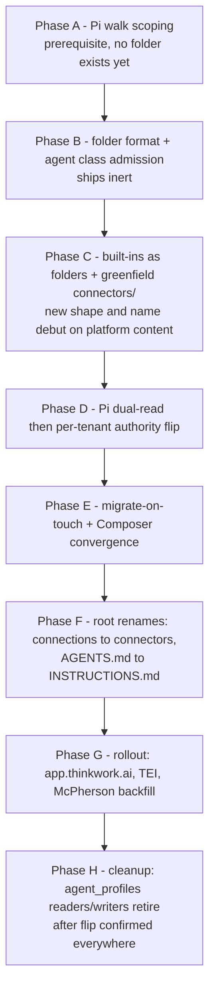

# Sub-Agent Folders & Recursive Workspace Shape (Eve Alignment) - Plan

## Goal Capsule

- **Objective:** Give the agent workspace one recursive folder shape — `INSTRUCTIONS.md` + `skills/` + `connectors/` + `agents/` at every level, root included — replacing single-file sub-agent definitions and the `connections/` name, shipped as independently-valuable increments with Pi runtime support and the profile file↔DB↔payload dual truth retired.
- **Product authority:** Eric Odom (dialogue 2026-07-15). Alignment target is Vercel Eve's workspace model (eve.dev/docs) with two recorded deviations: `connectors/` naming and UPPERCASE marker files.
- **Execution profile:** Sequential PR ladder to `main`; every rung independently shippable behind dual-read windows; destructive steps last. Worktrees per PR, never the main checkout.
- **Stop conditions:** Surface as a blocker (do not guess): any change that would alter Product Contract scope; any migration step that would delete tenant-authored content; enabling nested sub-agents (out of scope); touching the spaces-rearchitecture workstream.
- **Open blockers:** None. Deferred questions are marked in Open Questions.
- **Product Contract preservation:** unchanged from the 2026-07-15 requirements-only version.

---

## Product Contract

### Summary

Sub-agents become folders (`agents/<slug>/INSTRUCTIONS.md` + `skills/` + `connectors/`), the root workspace adopts the identical anatomy (root `INSTRUCTIONS.md`, remaining canonical files declared root-only slots), `connections/` is renamed `connectors/` everywhere, and Pi consumes the tree — via the capabilities manifest — as the single source of truth, retiring the `agent_profiles` projection through the authority flip.

### Problem Frame

Skills and connections are already workspace-native folders with signed sidecars; sub-agents are the one remaining capability defined as a single markdown file projected into a DB table and delivered to Pi as pre-composed dispatch JSON. This breaks the folder-is-the-agent architecture three ways: the filesystem lies about what the agent is (four built-in profiles have no file backing at all), the dual representation is the drift class the `agent_skills` retirement already paid to eliminate, and sub-agents sit outside the governed self-extension loop that every other capability class now flows through — an agent can write `agents/foo.md` without the signed-sidecar admission that connections get. Separately, the root workspace and sub-agent definitions use different anatomies, so there is no single answer to "what is an agent folder," and the `connections/` name collides with the legacy `connections` OAuth DB table.

### Key Decisions

- **One recursive agent-folder shape, root included.** An agent folder at any level is `INSTRUCTIONS.md` + `skills/` + `connectors/` + `agents/`. The root workspace adopts this in this program: root `AGENTS.md` prose migrates into a root `INSTRUCTIONS.md`; the remaining canonical root files (USER.md, SPACE.md, memory/, mcp.json, and peers) are declared explicit root-only slots, mirroring Eve's root-only `channels/`/`schedules/`.
- **Single-file anatomy: typed frontmatter on INSTRUCTIONS.md.** Model, enabled, description, and execution policy live as YAML frontmatter on `INSTRUCTIONS.md`; the body is pure prompt prose. No separate AGENT.md. `description` is required and is passed verbatim as the delegation tool description, absorbing today's optional `routingGuidance`.
- **Schema amnesty.** The folder format is strict from day one — no field aliases, no instructions-in-frontmatter-or-body ambiguity. The existing alias tolerance stays frozen on the legacy `agents/<slug>.md` path until that path retires.
- **Per-capability governance, not whole-tree fingerprints.** The sub-agent's own sidecar signs only `INSTRUCTIONS.md`; each grant inside the folder is its own independently-signed, independently-revocable record. Approving an agent does not bulk-approve its grants.
- **Optional agent-level sidecar (skills convention).** A missing `agents/<slug>/.assignment.json` means enabled, operator-authored, nothing pending. The platform writes one only when there is state to record: disabled, agent-authored edit awaiting approval, execution overrides.
- **Author-dependent re-sign.** Operator edits via Composer/API are platform-mediated and auto re-signed; agent-authored (self-extension) edits leave the signature stale, which surfaces as drift in the governance feed for one-click approve/revert.
- **Folders are the grants.** `agents/<slug>/connectors/<conn>/` holds only a narrowing `.assignment.json` whose operations are a subset of the root grant; definitions and credentials never copy down. `agents/<slug>/skills/<skill>/` references the root install. The frontmatter `skills:`/`mcpServers:` name-lists do not exist in the new format, and the `inheritSkills`/`inheritProjectContext` flags are deleted (their defaults are already false). This is a deliberate deviation from Eve's copy-everything subagents, chosen for single-point revocation and drift-impossibility.
- **Depth stays 0; the walk fix ships regardless.** Pi's capability discovery becomes subtree-scoped (prerequisite — see R14), which makes nesting a future materialization-policy flip, but this program does not enable nested sub-agents.
- **Dual truth retired through the authority flip.** Sub-agent folders compile into the capabilities manifest; Pi dual-reads, then authority flips to the tree/manifest and the dispatch payload shrinks to a pointer. `agent_profiles` readers/writers are removed at the end of the program; the table DROP is a deferred follow-up per the repo's migration ordering doctrine.
- **Ladder sequencing.** Renames and destructive steps land last, behind dual-read windows: built-ins materialize first (platform-controlled content debuts the shape), greenfield `connectors/` debuts inside sub-agent folders (zero legacy references), migrate-on-touch converges tenant files, root renames flip last with a `CAPABILITY_COMPILE_REVISION` bump.
- **Dot-prefixed files are hidden by default.** All `.`-prefixed workspace files (sidecars included) are platform state, hidden in the Composer tree behind the existing compiled-artifacts debug toggle.
- **Two Eve deviations recorded in CONCEPTS.md.** `connectors/` (Eve says `connections/`; ours dissolves the legacy `connections` DB-table collision) and UPPERCASE marker files (Eve uses lowercase `instructions.md`; house style is `SKILL.md`/`CONNECTION.md`). Recording them prevents a future "align with Eve" pass from churning the names back.

### Requirements

**Canonical shape & anatomy**

- R1. An agent folder at any level of the workspace has the same anatomy: `INSTRUCTIONS.md`, optional `skills/`, optional `connectors/`, optional `agents/`, optional `.assignment.json`.
- R2. `INSTRUCTIONS.md` carries typed YAML frontmatter (model, enabled, description, execution policy) above a pure-prose body, validated strictly with no field aliases.
- R3. `description` is required in sub-agent frontmatter and is used verbatim as the delegation tool description; a folder without it fails admission rather than spawning an undescribed specialist.
- R4. The root workspace adopts the same shape: root `AGENTS.md` prose migrates into root `INSTRUCTIONS.md` (dual-read window), and every remaining canonical root file is either migrated or declared a root-only slot — no undeclared root files survive.
- R5. The four built-in profiles (research, coding, analyst, reviewer) exist as materialized `agents/<slug>/` folders in every workspace, sourced from `packages/workspace-defaults` under its byte-parity test, with an explicit per-tenant backfill for existing workspaces.

**Governance & sidecars**

- R6. Each grant folder inside a sub-agent carries its own platform-signed `.assignment.json`, independently approvable and revocable through the existing governance feed.
- R7. The agent-level `.assignment.json` is optional: absent means enabled/operator-authored; the platform writes it only to record disabled state, pending agent-authored edits, or execution overrides.
- R8. Operator edits to `INSTRUCTIONS.md` through platform-mediated surfaces re-sign automatically when the caller is a tenant admin, with the audit actor recorded; non-admin and API-key writes leave the signature stale (surfacing as drift) rather than silently re-signing. Agent-authored edits surface as drift in the governance feed until approved or reverted.
- R9. Agent-authored sub-agent creation flows through the same gated folder-write admission as other capability classes. Because the agent-level sidecar is optional (R7), tree state alone cannot distinguish operator-authored from agent-authored folders — so R9 is enforced at the write path: the agent-lane file-write rejection in the chat-finalize reconcile lane extends to `agents/` paths (and capability folders generally), making the gated folder-write dispatch the sole agent-authored channel. An agent write attempt outside that channel is rejected at reconcile, never admitted as "operator-authored."

**Grants & scoping**

- R10. A sub-agent's connector grant is the presence of `connectors/<conn>/` containing a narrowing `.assignment.json`; granted operations must be a subset of the root connector's grant, enforced at compile time.
- R11. Connector definitions, credentials, and config never appear inside sub-agent folders; revoking or withholding the root connector automatically withers every child grant.
- R12. A sub-agent's skill grant is the presence of `skills/<skill>/` containing a minimal platform-signed `.assignment.json` (matching the connector-grant convention — an empty S3 prefix has no object, so the marker is the representable form) referencing the root install; removing the root skill makes the dangling grant a visible, reconciler-sweepable absence rather than a runtime spawn error.
- R13. The `SKILL_NOT_AVAILABLE`/`MCP_SERVER_NOT_AVAILABLE` runtime error class is retired for folder-format sub-agents: grant failures are expressed as absence or withheld state before dispatch, never as mid-turn spawn exceptions.

**Pi runtime**

- R14. Pi capability discovery is subtree-scoped: the root agent's surface excludes `agents/` subtrees, and a nested `agents/<slug>/skills/` folder can neither join nor shadow the root skill surface. This lands before any sub-agent folder is materialized.
- R15. A spawned sub-agent's capability surface is computed from its own folder subtree (instructions, skills, connectors), not from payload name-lists.
- R16. The two hardcoded `maxSubagentDepth: 0` sites are replaced by structural enforcement: materialization refuses nested `agents/` folders in this program, and the runtime spawns only what the tree contains.
- R17. Sub-agent folders compile into the capabilities manifest with content-addressed fingerprints; after the dual-read soak, the tree/manifest is authoritative and the dispatch payload carries a pointer, with both payload builders (chat and wakeup) updated together.

**Renames & vocabulary**

- R18. The workspace folder `connections/` is renamed `connectors/` at root and in all materialized workspaces; the legacy `connections` DB table is not renamed.
- R19. Workspace folder names and their path regexes are centralized in one constants module before any flip; the flip itself is a constant change plus a `CAPABILITY_COMPILE_REVISION` bump, with reconciler and renderer dual-reading both spellings during the window.
- R20. Model-visible artifacts are migrated with the rename: seeded prompt text referencing `connections/<slug>/…` is patched in the flip PR, and a redirect tombstone (`connections/README.md`) covers retained memories, wiki pages, and transcripts during the window.
- R21. CONCEPTS.md is updated in the same program: Connector supersedes Connection as the workspace-folder concept, and the two deliberate Eve deviations are recorded.

**Migration & surfaces**

- R22. Legacy `agents/<slug>.md` files migrate on touch: reads accept both forms across all four path gates (API parser, Composer path routing, profile mutations, workspace-files API scoping); every write emits the folder form; a background sweep converges stragglers.
- R23. During the migration window, one slug never renders as two entities: a workspace holding both `agents/<slug>.md` and `agents/<slug>/` presents as a single sub-agent.
- R24. The Composer treats sub-agent folders under the existing managed-folder grammar (approve/configure/remove; raw rename/delete suppressed), and the legacy profile-file special cases are deleted once the file path retires.
- R25. All dot-prefixed workspace files are hidden in the Composer tree by default, visible only behind the existing compiled-artifacts debug toggle.
- R26. Profile freshness semantics are explicit and documented: sub-agent changes take effect at the next compile/sync boundary, not mid-thread at the next dispatch.

### Acceptance Examples

- AE1. **Covers R8.** Given an approved sub-agent, when an operator edits its INSTRUCTIONS.md in the Composer, then the sidecar is re-signed automatically and no governance-feed entry appears; when the agent itself edits the same file via self-extension, then the folder shows drift and the governance feed offers approve/revert.
- AE2. **Covers R10, R11.** Given a root `connectors/postgres-dev/` granting `[query, list]`, when a sub-agent's narrowing sidecar requests `[query, write]`, then compile withholds the grant as not-permitted; when the root connector is revoked, then the child grant withers without any child-folder edit.
- AE3. **Covers R14.** Given a workspace containing `agents/researcher/skills/crm/SKILL.md` and a root `skills/crm/SKILL.md`, when the root agent's skills are discovered, then only the root `crm` is loaded and the nested one is invisible to the root surface.
- AE4. **Covers R22, R3.** Given a legacy `agents/reviewer.md` with `description` absent but `routingGuidance` present, when any write touches it, then the emitted folder's frontmatter carries `description` derived from routingGuidance; when both are absent, the conversion flags the folder for operator attention rather than inventing a description silently.
- AE5. **Covers R17, R26.** Given a sub-agent edited mid-thread, when the current turn's delegation fires, then the child runs the previously compiled definition; the edit takes effect after the next compile/sync, and the run records which fingerprint executed.

### Scope Boundaries

**Deferred for later**

- Nested sub-agents (depth > 0) — the walk-scoping fix makes this a materialization-policy flip with no runtime change; enabling it needs its own child-run-loop verification pass.
- `agent_profiles` table DROP — destructive step follows the code-removal deploys per migration doctrine.
- Agent-catalog distribution of sub-agent templates (fleet-wide versioned installs) — the built-ins-as-workspace-defaults work here is its natural foundation.
- A `clone_self`-style "fresh copy of the root" spawn primitive (Eve's second delegation mode).

**Outside this program**

- Space-local profile redesign (overlays or path-scoped variants) — the spaces rearchitecture is a separate workstream; space-local `agents/<slug>.md` files convert on-touch to the folder shape with today's scope semantics unchanged.
- Renaming the legacy `connections` OAuth DB table.
- Lowercase `instructions.md` / literal Eve file naming — rejected in favor of house style, recorded in CONCEPTS.md.

### Dependencies & Assumptions

- The `CAPABILITY_COMPILE_REVISION` bump recompiles every deployed workspace on its first post-deploy turn; eval-run fingerprints are discontinuous across that boundary — expected and to be announced, not a regression.
- Chat and wakeup dispatch payload builders must change together when the payload shrinks (two-builder parity is a known failure mode in this repo).
- Reconciler dual-path behavior during rename windows is load-bearing: writers that recognize only one spelling will resurrect old folders or delete new ones.
- The claims about current behavior in this contract (recursive walk leak and shadowing, the two `maxSubagentDepth: 0` sites, the four legacy path gates, DB-only built-in seeds, alias parsing, seeded `connections/<slug>/SCHEMA.md` prompt text) were verified against the repo by a fresh-context verification pass on 2026-07-15.

---

## Planning Contract

### Key Technical Decisions

- KTD-1. **Sub-agents become the third `CapabilityFolderClass`, with tree-aware admission.** Extend `CapabilityFolderClass = "connection" | "tool"` with `"agent"` (`packages/api/src/lib/capabilities/folder-write.ts:41`) — the `${klass}s/<slug>/` key builder already yields `agents/<slug>/`. The class union threads through `capabilityDefinitionKey`/`capabilitySidecarKey`, `definition-schemas.ts`, and `manifest-compile.ts` `admitFolder`. Divergence from the two existing classes: the definition file is `INSTRUCTIONS.md`, the sidecar is **optional** (missing = enabled, operator-authored — the skills convention), and the folder may contain governed subfolders (`skills/`, `connectors/`) that are **not** part of the agent's own signed unit (per-capability governance). Rationale: reuses signature/drift/withheld/approval machinery instead of rebuilding it; the tree question is answered by _not_ signing the tree. The optional sidecar is safe only because R9 closes the provenance gap at the write path (agent-lane writes to `agents/` are rejected outside the gated dispatch — see U6); without that guard, missing-sidecar-means-operator-authored would let ungoverned agent writes go live.
- KTD-2. **Root AGENTS.md content — managed sections included — moves into root `INSTRUCTIONS.md` intact.** `workspace-map-generator.ts` and `agents-md-parser.ts` retarget to `INSTRUCTIONS.md`; the managed-sections mechanism (`packages/workspace-editor/src/lib/managed-sections.ts`) already supports governance files and carries over unchanged. No separate machine-content file. Confirmed at synthesis.
- KTD-3. **The authority flip gates behind a per-tenant flag**, mirroring `agents.capability_folder_dispatch` (precedent: governed-autonomy U6). Dual-read runs ungated (divergence logging only); the flip — manifest/tree wins, payload shrinks to slugs + fingerprint — is per-tenant so dev soaks before TEI/McPherson.
- KTD-4. **Operator-mediated grant creation auto-signs; agent-proposed grants queue in the governance feed.** Same author-dependent posture as instruction edits (Product Contract). The signer is the existing platform sidecar-signing path (`signExistingCapabilityFolder`); no new signing infrastructure.
- KTD-5. **New strict parser module beside the frozen legacy parser.** A new `agent-folder-format.ts` (strict frontmatter schema, required `description`, no aliases) lives beside `agent-profile-workspace-files.ts` (frozen, legacy `agents/<slug>.md` only). Migrate-on-touch is the only bridge between them. Prevents alias tolerance from leaking into the new format.
- KTD-6. **One constants module before any rename flip — scope-aware.** `packages/api/src/lib/workspace-constants.ts` exports the folder-class→plural map and the marker/assignment path regexes; consumers (`folder-write`, `connection-assignments`, `compose-tuple`'s three regexes, analyst `connection-folder`, mcp `assignment-state`) switch with byte-identical behavior before any constant flips. The map is scope-aware because Phases C–E deliberately run two spellings of the connection class: child grant folders under `agents/<slug>/` use `connectors/` from first materialization (U5/U7), while the root plural stays `connections/` until the U15 flip — so the module exposes the plural per (class, scope), and child-grant key building and signing route through it rather than the flat `${klass}s` builder. Each compile-visible flip bumps `CAPABILITY_COMPILE_REVISION` (3→4 at agent-class admission, →5 at the connectors flip if compile output changes again) so deployed manifests self-heal.
- KTD-7. **Migrate-on-touch across all four path gates, plus a CLI sweep.** Dual-read lands in: the API parser, the Composer's own `agents/<slug>.md` regex (`ComposerWorkspaceEditor.tsx` `agentProfileSlugForFile`), the `create/update/deleteAgentProfile` mutations, and the workspace-files handler path whitelist. Every write emits folder form. A `thinkwork migrate agent-folders` CLI command (precedent: `apps/cli/src/commands/migrate-folder-canon.ts`) converges stragglers per tenant.
- KTD-8. **Built-ins ship via workspace-defaults, backfill is explicit.** Canonical `agents/<slug>/` trees land in `packages/workspace-defaults/files/` (nested-tree precedent: `skills/skill-creator/agents/*`), inline constants + byte-parity test extended, `DEFAULTS_VERSION` bumped. The seeder refreshes `_catalog/defaults/workspace/` only; existing agent prefixes are converted by the CLI migrate command — never by implicit re-seed.
- KTD-9. **Pi discovery takes an explicit scope root.** `discoverWorkspaceSkills(root)` walks only its given subtree and the root walk excludes `agents/`; the child's surface is `discover(agents/<slug>/)`. The two `maxSubagentDepth: 0` literals (`agent-profile-adapter.ts:117,:654`) are deleted; depth is enforced at materialization (admission rejects nested `agents/` folders in this program).
- KTD-10. **Freshness = compile/sync boundary, with the fingerprint actually pinned.** Sub-agent definitions are compiled state (manifest fingerprint) — edits apply on the next compile + workspace sync, never mid-thread. To make the recorded fingerprint truthful, the manifest's agent entry carries the `INSTRUCTIONS.md` etag (or a content-addressed copy of the instruction content); Pi verifies the synced file against it before spawn and fails loudly on mismatch — otherwise a mid-thread edit + recompile would execute new instructions while the run records the old fingerprint, corrupting the eval-comparability join key exactly when it matters.

### High-Level Technical Design

**End-state data flow (dual truth retired):**

```mermaid
flowchart TB
  subgraph Workspace tree (source of truth)
    A[agents/analyst/INSTRUCTIONS.md<br/>frontmatter + prose]
    B[agents/analyst/connectors/pg/.assignment.json<br/>narrowing grant]
    C[agents/analyst/skills/crm/<br/>reference to root install]
  end
  A --> D[manifest-compile Pass 1<br/>admission: schema, signature, enabled]
  B --> E[manifest-compile Pass 2<br/>subset vs root grant, withheld reasons]
  C --> E
  D --> F[capabilities/&lt;fingerprint&gt;.json<br/>entries incl. class: agent]
  E --> F
  F --> G[dispatch payload:<br/>fingerprint pointer only]
  G --> H[Pi: readCapabilitiesManifest<br/>+ synced tree]
  H --> I[delegate tool per agent entry<br/>description = tool description]
  I --> J["child surface = discover(agents/analyst/)"]
```

**Ladder sequencing (phases; each rung shippable alone):**



**Target folder anatomy (recursive; root-only slots marked):**

```text
<workspace root>/
├── INSTRUCTIONS.md          # was AGENTS.md; managed sections carry over
├── skills/<slug>/           # SKILL.md + .assignment.json (unchanged)
├── connectors/<slug>/       # was connections/; CONNECTOR.md + .assignment.json
├── agents/<slug>/           # sub-agent folders (this program)
│   ├── INSTRUCTIONS.md      # frontmatter: model, enabled, description*, execution
│   ├── .assignment.json     # OPTIONAL: disabled / pending / overrides
│   ├── skills/<skill>/      # reference grant: minimal signed .assignment.json
│   └── connectors/<conn>/   # narrowing .assignment.json only
├── memory/                  # ROOT-ONLY slot
├── mcp.json                 # ROOT-ONLY slot
├── USER.md  SPACE.md  CONTEXT.md  GUARDRAILS.md  TOOLS.md  MEMORY_GUIDE.md   # ROOT-ONLY slots
```

---

## Implementation Units

Unit index (dependency order within phases):

| U-ID | Title                                                      | Key files                                                       | Depends on                                               |
| ---- | ---------------------------------------------------------- | --------------------------------------------------------------- | -------------------------------------------------------- |
| U1   | Subtree-scoped Pi capability discovery                     | agentcore-pi workspace-skills.ts                                | —                                                        |
| U2   | Delete depth hardcodes; structural depth enforcement       | agentcore-pi agent-profile-adapter.ts                           | U1                                                       |
| U3   | Strict agent-folder format parser/serializer               | api agent-folder-format.ts (new)                                | —                                                        |
| U4   | "agent" capability folder class + manifest admission       | api folder-write.ts, definition-schemas.ts, manifest-compile.ts | U3                                                       |
| U5   | Child grant folders: narrowing sidecars + skill references | api manifest-compile.ts, capabilities                           | U4                                                       |
| U6   | Author-dependent re-sign + governed agent folder writes    | api folder-write.ts, workspace-files.ts                         | U4                                                       |
| U7   | Built-ins as workspace-defaults folders                    | workspace-defaults                                              | U1, U3, U4                                               |
| U8   | CLI backfill/convert command                               | apps/cli migrate command (new)                                  | U4, U7                                                   |
| U9   | Pi dual-read of manifest agent entries                     | agentcore-pi server.ts, adapter, delegation                     | U2, U4                                                   |
| U10  | Per-tenant authority flip; payload shrinks                 | api resolve-agent-runtime-config, dispatch builders             | U9                                                       |
| U11  | Retire agent_profiles readers/writers                      | api mutations, projection, resolvers                            | U10 + U18 flip confirmation                              |
| U12  | Migrate-on-touch dual-read across four path gates          | api + web path gates                                            | U3                                                       |
| U13  | Composer: managed-folder grammar + dotfile hiding          | web ComposerWorkspaceEditor                                     | U4                                                       |
| U14  | workspace-constants module (inert)                         | api workspace-constants.ts (new)                                | —                                                        |
| U15  | connections/→connectors/ flip                              | api, seeded prompts, tombstone, mover                           | U7, U14, U8 (mover)                                      |
| U16  | Root AGENTS.md→INSTRUCTIONS.md                             | pi-extensions, api map generator, CLI migrator                  | U14                                                      |
| U17  | CONCEPTS.md + docs updates                                 | CONCEPTS.md, docs/                                              | U15, U16                                                 |
| U18  | Rollout: app.thinkwork.ai, TEI, McPherson                  | operations                                                      | all except U11 (U11 lands after U18's flip confirmation) |

### U1. Subtree-scoped Pi capability discovery

- **Goal:** Discovery walks only its given scope root; the root agent's surface excludes `agents/` subtrees — closing the leak/shadow landmine before any folder exists.
- **Requirements:** R14. Covers AE3.
- **Dependencies:** none (prerequisite for the whole program).
- **Files:** `packages/agentcore-pi/agent-container/src/runtime/workspace-skills.ts`; tests in `packages/agentcore-pi/agent-container/tests/server.test.ts` (existing discovery coverage) plus a new `packages/agentcore-pi/agent-container/tests/workspace-skills.test.ts`.
- **Approach:** Give `discoverWorkspaceSkills` an explicit scope-root parameter and an exclusion for `agents/` directories during the root walk. Keep the `skills/<slug>/SKILL.md` admission shape unchanged within a scope.
- **Test scenarios:**
  - Covers AE3. Root workspace with `skills/crm/` and `agents/researcher/skills/crm/`: root discovery returns only root `crm`.
  - Nested-only skill (`agents/researcher/skills/web/`, no root `web`): absent from root discovery.
  - Scoped call `discover(agents/researcher/)` returns exactly the nested skills.
  - Deeply nested `agents/a/agents/b/skills/x/` is invisible to both root and first-level scopes.
  - Empty/missing `skills/` dir under a scope returns empty without error.
- **Verification:** New tests green; existing `server.test.ts` discovery and pinned-skills suites unchanged; `pnpm --filter @thinkwork/agentcore-pi test` (full package suite).

### U2. Delete depth hardcodes; structural depth enforcement

- **Goal:** Remove the two `maxSubagentDepth: 0` literals; depth is a property of what the tree/admission allows, and this program's admission rejects nested `agents/` folders.
- **Requirements:** R16.
- **Dependencies:** U1.
- **Files:** `packages/agentcore-pi/agent-container/src/agent-profile-adapter.ts` (~:117, ~:654); `packages/agentcore-pi/agent-container/tests/agent-profile-adapter.test.ts`.
- **Approach:** Delete the field from the compiled execution block and its type literal; runtime spawns whatever profiles it received/discovered. The "no nesting" invariant moves to U4's admission (reject `agents/` inside an agent folder) — enforcement by construction.
- **Test scenarios:**
  - Adapter compile output no longer carries a depth field; delegation of a first-level profile still succeeds.
  - Admission-level rejection covered in U4 (cross-reference).
- **Verification:** Adapter test suite green; grep confirms no `maxSubagentDepth` remains in production code.

### U3. Strict agent-folder format parser/serializer

- **Goal:** The new format's single strict implementation: parse/serialize `agents/<slug>/INSTRUCTIONS.md` (frontmatter: model, enabled, description required, execution) + optional `.assignment.json`.
- **Requirements:** R1, R2, R3.
- **Dependencies:** none.
- **Files:** `packages/api/src/lib/agent-folder-format.ts` (new), `packages/api/src/lib/agent-folder-format.test.ts` (new); `packages/api/src/lib/agent-profile-workspace-files.ts` untouched (frozen legacy).
- **Approach:** Zod-style strict schema (match `definition-schemas.ts` conventions): unknown keys and alias names are hard errors; `description` required and non-empty; `routingGuidance` is not a field (converter merges it — U12). Serializer is the single writer for folder form.
- **Test scenarios:**
  - Round-trip: serialize → parse is identity for a full config.
  - Missing `description` → typed validation error naming the field.
  - Alias keys (`toolPolicy`, `executionControls`, `model_id`) → hard error, not silent acceptance.
  - Instructions live in body only; frontmatter `instructions:` key is an error.
  - Optional sidecar absent → parsed state is enabled/no-overrides; present sidecar overrides enabled/execution.
- **Verification:** New suite green; `pnpm --filter @thinkwork/api test` (full package suite) green.

### U4. "agent" capability folder class + manifest admission

- **Goal:** `agents/<slug>/` folders are admitted by the capabilities compiler as first-class entries with content-addressed fingerprints; nested `agents/` are rejected.
- **Requirements:** R6, R7, R9, R17 (compile half). Covers AE5 (fingerprint recording).
- **Dependencies:** U3.
- **Files:** `packages/api/src/lib/capabilities/folder-write.ts` (class union, key builders, sidecar-optional handling), `packages/api/src/lib/capabilities/definition-schemas.ts` (agent definition = U3 schema), `packages/api/src/lib/capabilities/manifest-compile.ts` (`admitFolder` for class "agent", entry class union, `CAPABILITY_COMPILE_REVISION` 3→4), `packages/api/src/lib/workspace-renderer/compose-tuple.ts` (folder enumeration + input_signature inputs); tests: `folder-write.test.ts`, `manifest-compile.test.ts`, `definition-schemas.test.ts`, `compose-tuple.test.ts`.
- **Approach:** Definition file for class "agent" is `INSTRUCTIONS.md`; sidecar optional (missing = enabled, admitted). Signature/drift checks run only when a sidecar exists (author-dependent posture — U6 writes sidecars). Admission rejects a nested `agents/` dir inside an agent folder with a typed withheld reason. Ship inert: nothing consumes the new entries until U9.
- **Execution note:** Ship-inert pattern — land with tests, no live consumer.
- **Test scenarios:**
  - Valid folder (INSTRUCTIONS.md only) admits as active entry with class "agent" and required description.
  - Missing description → withheld `invalid_definition`.
  - Sidecar present with drift (INSTRUCTIONS.md edited after signing) → withheld/drift state surfaced.
  - Nested `agents/` folder → withheld with the nesting reason; parent otherwise admits.
  - `input_signature` changes when INSTRUCTIONS.md etag changes; revision bump forces recompile of previously rendered manifests.
- **Verification:** Capabilities suites green; a rendered dev workspace shows agent entries in `capabilities/<fingerprint>.json` with no runtime behavior change.

### U5. Child grant folders: narrowing sidecars + skill references

- **Goal:** `agents/<slug>/connectors/<conn>/.assignment.json` and `agents/<slug>/skills/<skill>/` compile into per-child grants — subset-validated, withheld-aware, no definition copies.
- **Requirements:** R10, R11, R12, R13. Covers AE2.
- **Dependencies:** U4.
- **Files:** `packages/api/src/lib/capabilities/manifest-compile.ts` (Pass 2 child-grant resolution), `packages/api/src/lib/capabilities/connection-assignments.ts`, `packages/api/src/lib/skills/workspace-skill-index.ts` (scoped variant); tests: `manifest-compile.test.ts`, `connection-assignments.test.ts`.
- **Approach:** Pass 2 resolves each child grant against the parent's ACTIVE entries: connector operations must be ⊆ the root grant (violation → withheld `operation_not_permitted`); a withheld/revoked root connector withers every child grant (withheld cascades); skill grant = a minimal platform-signed `.assignment.json` inside `skills/<skill>/` referencing an installed root skill (per R12 — presence needs an object on S3; dangling → withheld, not error). The manifest's agent entry carries its resolved child surface, replacing spawn-time `assertKnownValues` name-list checks for folder-format profiles.
- **Test scenarios:**
  - Covers AE2. Child requests `[query, write]` against root `[query, list]` → grant withheld as not-permitted; `[query]` admits.
  - Root connector revoked → child grant withheld with cascade reason, no child edit.
  - Child skill folder referencing an uninstalled root skill → withheld absence, compile succeeds.
  - No child folders → agent entry admits with empty grant surface (delegation still works with built-in tools only).
- **Verification:** Capabilities suites green; compiled manifest for a dev workspace shows per-child grant resolution with typed withheld reasons.

### U6. Author-dependent re-sign + governed agent folder writes

- **Goal:** Platform-mediated writes to agent folders auto-re-sign; agent self-extension writes flow through the gated capability-folder path and surface as drift/pending in the governance feed.
- **Requirements:** R8, R9. Covers AE1. Also R25's write-side: sidecars are platform-written dotfiles.
- **Dependencies:** U4.
- **Files:** `packages/api/workspace-files.ts` (PUT path: re-sign on operator writes to `agents/<slug>/INSTRUCTIONS.md` when a sidecar exists), `packages/api/src/lib/capabilities/folder-write.ts` (`putCapabilityFolder`/`signExistingCapabilityFolder` for class "agent"), `packages/api/src/lib/chat-finalize/reconcile.ts` (agent-lane write rejection extended to `agents/` and capability-folder paths), self-extension gate wiring (the U4-U6 governed-autonomy folder-dispatch path); tests: `workspace-files-handler.test.ts`, `folder-write.test.ts`, reconcile-lane tests.
- **Approach:** Operator PUT through workspace-files → after write, re-sign the sidecar if present — only when the caller is a tenant admin (`callerIsTenantAdmin`), with the audit actor recorded via the existing `resolveAuditActor` path; non-admin and API-key callers leave the signature stale, which surfaces as drift. Agent-authored writes arrive via the existing gated folder-write admission; they create/refresh folders with unsigned-or-stale sidecars that the manifest marks withheld until approved through the governance feed (existing approve/revoke machinery). The R9 write-path guard lands here: the chat-finalize reconcile lane's agent-authored file-write rejection list extends to cover `agents/` paths, so the gated dispatch is the only agent-authored channel into agent folders.
- **Test scenarios:**
  - Covers AE1. Tenant-admin PUT to INSTRUCTIONS.md with existing sidecar → sidecar re-signed with audit actor recorded, entry stays active, no pending state.
  - Same PUT with no sidecar → no sidecar minted (skills convention), entry stays active.
  - Non-admin and API-key PUT to a signed INSTRUCTIONS.md → signature left stale, drift surfaces in the governance feed.
  - Agent-path write (gated folder write) to a new `agents/helper/` → entry withheld pending approval; approving signs and activates.
  - Agent-lane direct file write to `agents/foo/INSTRUCTIONS.md` (outside the gated dispatch) → rejected at the reconcile lane, folder never created.
- **Verification:** Suites green; governance feed in dev shows a pending agent-authored folder and one-click approve activates it.

### U7. Built-ins as workspace-defaults folders

- **Goal:** research/coding/analyst/reviewer exist as canonical `agents/<slug>/` trees in workspace-defaults, replacing DB-only seeds as the content source; new workspaces bootstrap them.
- **Requirements:** R5 (canonical-source half).
- **Dependencies:** U1, U3, U4 — the R14 walk fix and agent-class admission must be deployed before built-in folders materialize anywhere, or the new `agents/*/skills/` trees would leak into root discovery on stale runtimes.
- **Files:** `packages/workspace-defaults/files/agents/<slug>/…` (new trees), `packages/workspace-defaults/src/index.ts` (`CANONICAL_FILE_NAMES` + inline constants + `DEFAULTS_VERSION` bump), `packages/workspace-defaults/src/__tests__/parity.test.ts`; content derives from `packages/api/src/graphql/resolvers/agent-profiles/built-in-agent-profiles.ts` seeds (analyst's connector grant becomes `agents/analyst/connectors/postgres-dev/` — greenfield `connectors/` naming debuts here).
- **Approach:** Follow the existing nested-tree precedent (`skills/skill-creator/agents/*`). Built-in seed prose becomes INSTRUCTIONS.md bodies; `tool_policy`/`execution_controls` become frontmatter + child grant folders. Keep the DB seeds in place until U11 (dual truth persists intentionally during the window).
- **Test scenarios:**
  - Parity test covers every new file byte-for-byte.
  - Bootstrap of a fresh workspace materializes the four folders with substitutions applied.
  - `DEFAULTS_VERSION` bump refreshes `_catalog/defaults/workspace/` (seeder test) without touching existing agent prefixes.
- **Verification:** `pnpm --filter @thinkwork/workspace-defaults test` green; a freshly created dev agent shows the four folders in its tree.

### U8. CLI backfill/convert command

- **Goal:** `thinkwork migrate agent-folders --stage <s>` materializes built-in folders into existing workspaces and converts legacy `agents/<slug>.md` files — the explicit per-tenant backfill.
- **Requirements:** R5 (backfill half), R22 (sweep half). Covers AE4.
- **Dependencies:** U4, U7.
- **Files:** `apps/cli/src/commands/migrate-agent-folders.ts` (new), `apps/cli/src/lib/migrations/agent-folder-migrator.ts` (new), `apps/cli/__tests__/migrate-agent-folders.test.ts` (new). Precedent: `apps/cli/src/lib/migrations/folder-canon-migrator.ts`.
- **Approach:** Idempotent per-tenant walk: (a) materialize built-in folders where absent; (b) convert each legacy profile file via U3's serializer with the **full field mapping**: `description` derived from description+routingGuidance (both absent → folder flagged for operator attention and reported); `skills:` name-list → `skills/<skill>/` reference grants; `mcpServers:` name-list → `connectors/<conn>/` narrowing sidecars carrying today's granted operations (a name that resolves to no root connector → no grant written, flagged in the report); `tools`/`toolPolicy` and `execution`/`executionControls` → frontmatter execution policy; `model`/`modelId` → frontmatter model; `name`/`builtInKey` → dropped (identity = folder path; builtInKey recorded in the report for traceability); space-scope semantics untouched; (c) leave the legacy file in place for the dual-read window (deletion happens only via U12's delete-on-write, never by this sweep); (d) dry-run mode prints the diff.
- **Execution note:** Idempotency first — a second run must be a no-op; test that before conversion logic.
- **Test scenarios:**
  - Covers AE4. Legacy file with routingGuidance only → folder frontmatter carries derived description; with neither → folder written + flagged in the report.
  - Legacy file with `skills:` and `mcpServers:` lists → converted folder carries the matching reference grants and narrowing sidecars; an unresolvable `mcpServers` name produces no grant and a report flag (no silent grant loss).
  - Second run is a no-op (already_installed-class skips reported, nothing rewritten).
  - Dry-run writes nothing and reports accurately.
  - Space-local profile files convert in place with scope semantics untouched.
- **Verification:** CLI suite green; dry-run against dev reports accurately. The real dev run waits until U12 and U13 are deployed (running it earlier opens an R23 dual-entity window on dev); it then converges the dev tenant with the report listing conversions/skips/flags.

### U9. Pi dual-read of manifest agent entries

- **Goal:** Pi resolves sub-agent definitions from the capabilities manifest + synced tree, dual-running against `payload.agent_profiles` with divergence logging; payload still wins.
- **Requirements:** R15, R17 (dual-read half). Covers AE5 (fingerprint recorded per run).
- **Dependencies:** U2, U4.
- **Files:** `packages/agentcore-pi/agent-container/src/server.ts` (manifest read ~:3280, profile normalization ~:3578), `agent-profile-adapter.ts` (accept manifest-sourced config; child surface from U1's scoped discovery), `agent-profile-delegation.ts`; tests: `tests/{server,agent-profile-adapter,agent-profile-delegation,capabilities-manifest}.test.ts`.
- **Approach:** Manifest agent entries (class "agent") map to `AgentProfileConfig`; instructions read from the synced `agents/<slug>/INSTRUCTIONS.md` and verified against the entry's recorded etag before spawn (KTD-10 — mismatch is a loud per-profile skip, not silent execution of unpinned content); grants come from the entry's resolved child surface (U5) instead of `assertKnownValues` lists. Divergence between manifest-derived and payload-derived config logs a structured warning; payload remains authoritative until U10's flag.
- **Test scenarios:**
  - Manifest entry + synced folder → child spawn assembles identical system prompt/tool surface as the payload path (parity assertion).
  - Divergence (payload edited, manifest stale) → warning logged, payload behavior used.
  - Withheld child grant in manifest → withheld notice reaches child prompt (existing THINK-229 path) without a spawn error.
  - Missing folder for a manifest entry → loud skip of that profile, not a dead turn (wakeup best-effort posture preserved).
  - Synced INSTRUCTIONS.md etag differs from the manifest entry's recorded etag → loud per-profile skip with a structured warning; no spawn against unpinned content.
- **Verification:** Pi suites green; dev logs show zero (or explained) divergence during the soak.

### U10. Per-tenant authority flip; payload shrinks

- **Goal:** Behind a per-tenant flag, the manifest/tree is the profile truth: dispatch payload carries slugs + `capabilities_manifest_fingerprint` only, both payload builders updated together.
- **Requirements:** R17 (flip half), R26, R13 (spawn-error class retired on flip). Covers AE5.
- **Dependencies:** U9.
- **Files:** `packages/api/src/lib/resolve-agent-runtime-config.ts` (`loadAgentProfileRuntimeConfigs` ~:1149), `packages/api/src/lib/agent-dispatch-payload.ts`, `packages/api/src/handlers/wakeup-processor.ts`, `packages/api/src/lib/chat-agent-invoke.ts`, flag column/flag read (mirror `capability_folder_dispatch`); tests: `resolve-agent-runtime-config.test.ts`, `wakeup-processor.dispatch-parity.test.ts`, `plugins/dispatch-parity.test.ts`.
- **Approach:** Flag on → `agent_profiles: []` equivalent replaced by slim references; Pi (U9) assembles from manifest. Flag off → today's payload. Both builders route through the shared `buildAgentDispatchControlFields` so parity is structural. Freshness semantics (compile/sync boundary) documented in the plan's Documentation unit (U17).
- **Test scenarios:**
  - Flag on: payload contains no full instruction strings; Pi still spawns each built-in successfully (integration-style test at the adapter seam).
  - Flag off: byte-identical payload to pre-change behavior.
  - Dispatch-parity test asserts chat and wakeup builders emit the same profile fields in both flag states.
  - Fingerprint recorded on the run in both states.
- **Verification:** Parity suites green; dev tenant flipped and soaked (delegations work, no fabrication-class incidents); TEI/McPherson stay off until U18.

### U11. Retire agent_profiles readers/writers

- **Goal:** Mutations write folders (via U3 serializer + U6 signing); the file→DB projection and DB-row loading are removed; the table is left in place for the deferred DROP.
- **Requirements:** Dual-truth end-state (Key Decisions). R22's write-new discipline.
- **Dependencies:** U10 flipped for all tenants (post-U18 confirmation) — code lands last in the ladder.
- **Files:** `packages/api/src/graphql/resolvers/agent-profiles/{create,update,delete}AgentProfile.mutation.ts`, `agent-profile-workspace-files.ts` projection functions, `resolve-agent-runtime-config.ts` legacy row loading, `packages/api/workspace-files.ts` projection hooks; tests updated across the same seams.
- **Approach:** Mutations become folder writes + manifest recompile triggers; the Profiles side-sheet reads from the manifest/index instead of DB rows. Follow the agent_skills retirement choreography: readers first, writers second, DROP deferred to a follow-up.
- **Test scenarios:**
  - Create/update/delete through GraphQL produce correct folder state and recompiled manifest; no DB row mutation.
  - Profiles sheet data source returns folder-derived listings (web query test).
  - No production code path selects from `agent_profiles` (grep-backed test or lint rule).
- **Verification:** Full api + web suites green; dev E2E: create a profile in the UI, folder appears, delegation works.

### U12. Migrate-on-touch dual-read across four path gates

- **Goal:** Reads accept both `agents/<slug>.md` and `agents/<slug>/` everywhere; every write emits folder form; one slug renders as one entity.
- **Requirements:** R22, R23. Covers AE4 (write-side conversion).
- **Dependencies:** U3.
- **Files:** `packages/api/src/lib/agent-profile-workspace-files.ts` (read-both shim at the boundary, legacy parser internals frozen), `packages/api/src/graphql/resolvers/agent-profiles/*.mutation.ts` (write folder form), `packages/api/workspace-files.ts` (path whitelist + routing), `apps/web/src/components/settings/ComposerWorkspaceEditor.tsx` (`agentProfileSlugForFile` accepts both; dedupe rendering); tests: `agent-profile-workspace-files.test.ts`, `agentProfiles.resolver.test.ts`, `workspace-files-handler.test.ts`, `ComposerWorkspaceEditor.test.tsx`.
- **Approach:** A read-resolution helper (folder wins when both exist) used by all four gates; writes go through U3's serializer. The legacy file is deleted **only** by delete-on-write — after the folder form is confirmed written and all four gates are deployed dual-read; the U8 sweep never deletes (aligning with U8's preserve posture). Additionally, until U11 retires the DB readers, folder-form writes also refresh the `agent_profiles` projection via a folder→DB shim beside the frozen legacy parser — otherwise flag-off tenants (all customers until Phase G) would dispatch stale pre-edit config indefinitely, since the existing projection triggers only on `agents/<slug>.md` keys.
- **Test scenarios:**
  - Covers R23: workspace with both forms for one slug → Composer tree and Profiles sheet show exactly one entity (folder-backed).
  - Update through each gate (parser path, Composer, mutation, files API) emits folder form and removes the legacy file.
  - Read of a never-touched legacy file still parses via frozen legacy parser.
  - Flag-off tenant: editing a folder-form profile refreshes the `agent_profiles` projection, and the next dispatch payload carries the edited config (payload-visibility test).
- **Verification:** All four gate suites green; manual dev check of a mixed-state workspace.

### U13. Composer: managed-folder grammar + dotfile hiding

- **Goal:** `agents/<slug>/` folders get managed-node treatment (configure/disable/remove; raw rename/delete suppressed); all dot-prefixed files hide behind the existing debug toggle; operators get a first-class grant-creation flow so raw folder authoring is never the only way to grant a sub-agent a skill or connector.
- **Requirements:** R24, R25; the operator half of KTD-4 (grant creation auto-signs).
- **Dependencies:** U4 (folders exist to render).
- **Files:** `apps/web/src/components/settings/ComposerWorkspaceEditor.tsx` (managed-folder rules ~:1004-1041, hidden-artifacts rules ~:434-441, profile special cases ~:456-976), `apps/web/src/components/settings/AgentProfilesSheet.tsx` (edit entry points target folder files); tests: `ComposerWorkspaceEditor.test.tsx`, `composer-u8-sweep.test.tsx`, `AgentProfilesSheet.test.tsx`.
- **Approach:** Add `agents/<slug>` to the managed-folder class list; INSTRUCTIONS.md inside gets the dedicated edit affordance (replacing the file-based U2/R5 special cases, which are deleted when the legacy path retires in U11-era cleanup). Extend the hidden-artifacts predicate from specific compiled paths to any dot-prefixed basename. Add the operator grant-creation flow on the agent folder's Configure surface: an add-skill-grant picker (installed root skills) and an add-connector-grant picker with a narrowing operations selector (choices limited to the root grant's operations), both writing through `putCapabilityFolder` with auto-sign (U6's operator path) — the frontmatter grant lists no longer exist, so this is the only operator-facing grant surface.
- **Test scenarios:**
  - Agent folder node offers Configure/Disable/Remove; raw Rename/Delete absent.
  - `.assignment.json` files invisible by default; visible with debug toggle on.
  - Legacy `agents/<slug>.md` (during window) still gets the existing dedicated menu — no dual affordances for one slug (with U12's dedupe).
  - Add-connector-grant flow: operations picker offers only the root grant's operations; completing it writes a signed narrowing sidecar and the grant renders active without a governance-feed pending entry.
- **Verification:** Web suites green; visual check in Eric's checkout before merge (repo convention for UI changes).

### U14. workspace-constants module (inert)

- **Goal:** One module owns workspace folder names and path regexes; all consumers switch with byte-identical behavior.
- **Requirements:** R19 (centralization half).
- **Dependencies:** none (can land any time before U15).
- **Files:** `packages/api/src/lib/workspace-constants.ts` (new), consumers: `capabilities/folder-write.ts`, `capabilities/connection-assignments.ts`, `workspace-renderer/compose-tuple.ts` (three regexes incl. `CONNECTION_MARKER_RE` :262), `analyst/connection-folder.ts`, `mcp/assignment-state.ts`; tests: existing suites must pass unchanged, plus `workspace-constants.test.ts` (new).
- **Approach:** Export the class→plural map and marker/assignment regex builders parameterized by folder name **and scope** (root vs child-of-agent-folder, per KTD-6 — child connection grants spell `connectors/` while root stays `connections/` until U15); consumers import instead of re-deriving. Zero behavior change at root — the flip is U15.
- **Test scenarios:**
  - Regex builders reproduce the exact current patterns (snapshot equality).
  - All existing capabilities/renderer suites pass without edits (the inert proof).
- **Verification:** `pnpm --filter @thinkwork/api test` green with no test-file changes beyond the new module's own.

### U15. connections/ → connectors/ flip

- **Goal:** The root rename: constant flips, dual-read window in reconciler/renderer, seeded prompts patched, tombstone written, per-tenant mover severs records before deleting old folders.
- **Requirements:** R18, R19 (flip half), R20.
- **Dependencies:** U14; U8 (mover rides the same CLI machinery); sub-agent `connectors/` already live (U7).
- **Files:** `packages/api/src/lib/workspace-constants.ts` (the flip), `capabilities/reconcile-connection-folders.ts` + `compose-tuple.ts` (dual-read alternation `connect(?:ion|or)s`), `manifest-compile.ts` (`CAPABILITY_COMPILE_REVISION` bump), `built-in-agent-profiles.ts` seeded prompt text (`connections/<slug>/SCHEMA.md` → `connectors/…`; also the U7 workspace-defaults copies), `analyst/connection-folder.ts`, CLI mover in `apps/cli/src/lib/migrations/` (copy → sever/re-point records → delete old + write `connections/README.md` tombstone); web `connections-api.ts`/`SettingsCapabilities.tsx` path strings (UI route names untouched); tests across the same seams.
- **Approach:** Flip writers to `connectors/` in one PR with readers accepting both; run the mover per tenant; revision bump self-heals manifests on first post-deploy turn. Tombstone stays through the window and is swept by a follow-up mover run.
- **Execution note:** Sever-before-delete is load-bearing — the reconciler resurrects file-only deletions; the mover must re-point registry records first.
- **Test scenarios:**
  - Covers R20: analyst seeded prompt no longer references `connections/`; tombstone README present after mover.
  - Reconciler with dual-read: a stale `connections/<slug>/` is not resurrected after records re-point; a hand-authored folder is untouched.
  - Renderer resolves capability folders under either spelling during the window; after mover, only `connectors/`.
  - Revision bump: previously rendered manifest recompiles despite unchanged capability files.
- **Verification:** Capabilities/renderer/CLI suites green; dev tenant moved and soaked (analyst reads SCHEMA.md from the new path in a live thread) before customer environments.

### U16. Root AGENTS.md → INSTRUCTIONS.md

- **Goal:** The root workspace adopts the recursive anatomy: root instructions live in `INSTRUCTIONS.md` (managed sections included); remaining canonical files are declared root-only slots.
- **Requirements:** R4.
- **Dependencies:** U14 (constants), U8 (migrator machinery); independent of U15 ordering but lands in the same phase.
- **Files:** `packages/pi-extensions/src/system-prompt-compose.ts` (`PROMPT_FILES` :48-53 — dual-read: prefer INSTRUCTIONS.md, fall back to AGENTS.md), `packages/api/src/lib/workspace-map-generator.ts` (retarget read/write), `packages/api/src/lib/agents-md-parser.ts` (rename-neutral parse entry), `packages/api/src/lib/chat-finalize/reconcile.ts`, `packages/api/workspace-files.ts` (`refreshAgentAgentsMdSections` retarget), `packages/pi-extensions/src/fetch-workspace-source.ts` (Workspace Routing section reads), `packages/workspace-editor/src/lib/managed-sections.ts` (governance-file list), `packages/workspace-defaults` (canonical file rename + parity + `DEFAULTS_VERSION` bump), `packages/api/src/handlers/backfill-router-skills-to-agents-md.ts` (rename-aware or retired), CLI migrator step (rename per tenant, content intact), mobile `apps/mobile/lib/personalization-markdown.ts`; tests: `pi-extensions/test/system-prompt.test.ts`, api map-generator/parser suites, workspace-defaults parity.
- **Approach:** Dual-read everywhere (INSTRUCTIONS.md preferred, AGENTS.md fallback) in one PR; writers flip to INSTRUCTIONS.md in the same PR; the CLI migrator renames the file per tenant preserving managed sections byte-for-byte; AGENTS.md fallback retires in a later cleanup after all environments converge. Root INSTRUCTIONS.md carries no required frontmatter (root config still arrives via runtime config; frontmatter tolerated-empty at root).
- **Test scenarios:**
  - Prompt compose loads INSTRUCTIONS.md when present, AGENTS.md when not, never both.
  - Managed-section regeneration writes to INSTRUCTIONS.md and preserves operator prose (existing map-generator tests retargeted).
  - Migrator renames with managed sections intact; second run no-op.
  - Workspace Routing reads (fetch-workspace-source) resolve from the new file.
- **Verification:** pi-extensions/api/workspace-defaults suites green; dev agent's system prompt verified live post-rename (dogfood thread reads correctly).

### U17. CONCEPTS.md + docs updates

- **Goal:** Vocabulary and docs reflect the shipped state: Connector concept, agent-folder anatomy, root-only slots, freshness semantics, the two Eve deviations.
- **Requirements:** R21, R26 (documentation half).
- **Dependencies:** U15, U16.
- **Files:** `CONCEPTS.md`, `docs/src/content/docs/` (folder-is-the-agent concept page + capabilities pages), `CLAUDE.md` workspace bullets.
- **Approach:** Update the Connection→Connector entry (folder concept renamed; DB table explicitly not renamed), add Agent Folder anatomy + root-only slot list, record both Eve deviations with rationale, document compile/sync freshness.
- **Test scenarios:** Test expectation: none — documentation-only unit; reviewed for accuracy against shipped behavior.
- **Verification:** Docs build (`docs/` Astro build) green; CONCEPTS.md entries match shipped paths.

### U18. Rollout: app.thinkwork.ai, TEI, McPherson

- **Goal:** Every live environment converges: deploys land, per-tenant backfills run, authority flip enabled per tenant after soak, and each workspace verifies clean.
- **Requirements:** R5/R18/R22 rollout halves; the user's explicit post-deploy directive.
- **Dependencies:** all prior units except U11 (per-environment sequencing may interleave with late rungs; U11 lands only after this unit confirms the flip everywhere).
- **Files:** operational — `apps/cli` migrate commands per stage; no new code beyond U8/U15/U16 machinery.
- **Approach:** Per environment, in order dev (app.thinkwork.ai) → TEI → McPherson: (1) confirm deploy landed (customer stacks: verify the runner/Pi image actually updated — customer deploys have a known stale-runner gotcha); (2) run `thinkwork migrate agent-folders`, then the U15 mover, then the U16 rename, each with dry-run first; (3) flip the per-tenant authority flag only after a **two-sided** soak gate: a minimum dual-read comparison count per profile (drive synthetic delegations where organic traffic is absent — zero traffic also produces quiet logs) AND zero divergences outside an enumerated benign class list; (4) verify: built-in folders present, delegation live-tested, analyst reads `connectors/postgres-dev/SCHEMA.md`, Composer tree renders folders, governance feed clean.
- **Execution note:** Dev soaks each rung before any customer environment; McPherson is production-sensitive — schedule around demo windows and re-check the stall-monitor/demo constraints before flipping.
- **Test scenarios:** Test expectation: none — operational unit; the verification checklist above is the acceptance gate, recorded per environment in the PR/issue thread.
- **Verification:** All three environments pass the checklist; on dev, ≥3 days with the two-sided gate satisfied (minimum comparison counts met, zero non-benign divergences) before customer flips.

---

## Verification Contract

| Gate                      | Command                                                                                                                           | Applies to                  |
| ------------------------- | --------------------------------------------------------------------------------------------------------------------------------- | --------------------------- |
| Monorepo hygiene          | `pnpm -r --if-present typecheck && pnpm -r --if-present lint && pnpm format:check`                                                | every PR                    |
| API package suite         | `pnpm --filter @thinkwork/api test` (full suite, not single files)                                                                | U3-U6, U8, U10-U12, U14-U16 |
| Pi package suite          | `pnpm --filter @thinkwork/agentcore-pi test`                                                                                      | U1, U2, U9                  |
| pi-extensions suite       | `pnpm --filter @thinkwork/pi-extensions test`                                                                                     | U16                         |
| workspace-defaults parity | `pnpm --filter @thinkwork/workspace-defaults test`                                                                                | U7, U16                     |
| Web suite                 | `pnpm --filter @thinkwork/web test`                                                                                               | U12, U13                    |
| CLI suite                 | `pnpm --filter thinkwork-cli test`                                                                                                | U8, U15, U16                |
| Dispatch parity           | `wakeup-processor.dispatch-parity.test.ts` + `plugins/dispatch-parity.test.ts` green                                              | U10                         |
| Live behavioral           | dev-stage E2E per rung: sub-agent delegation succeeds from a folder-defined profile; AE1-AE5 exercised manually or via eval cases | U6, U9, U10, U15, U16, U18  |

Quality gates: no `maxSubagentDepth` in production code after U2; no production reader of `agent_profiles` after U11 (grep gate); no `connections/` writer after U15 (grep gate, tombstone excepted); eval-fingerprint discontinuity announced at each `CAPABILITY_COMPILE_REVISION` bump.

---

## Definition of Done

- Every R1-R26 is implemented, explicitly deferred (Scope Boundaries), or converted to a tracked follow-up.
- All Verification Contract gates green; full package suites (not single test files) pass for every touched package.
- AE1-AE5 demonstrably hold on dev.
- All three environments (app.thinkwork.ai, TEI, McPherson) completed the U18 checklist; per-tenant authority flag on everywhere; divergence logs quiet.
- Legacy surfaces retired: profile-file special cases deleted from the Composer, `agent_profiles` readers/writers removed (DROP tracked as a follow-up issue), AGENTS.md fallback removal tracked.
- CONCEPTS.md and docs updated (U17); both Eve deviations recorded.
- No abandoned experimental code from the ladder remains in the diff; each rung merged via squash PRs to `main` with worktrees cleaned up.

---

## Open Questions

**Deferred to implementation**

- Exact withheld-reason taxonomy additions for agent-class admission (nesting, missing description) — name them during U4 against the existing `WithheldReason` union.
- Whether the U15 mover and U16 rename share one CLI command with steps or ship as separate commands — decide in U8's structure.
- Root INSTRUCTIONS.md frontmatter: tolerated-empty at root in this program; whether root-level typed config ever moves there is a future-arc question.

**Deferred from doc review (2026-07-15)**

- **Space-local profiles have no post-flip resolution mechanism.** Space-scoped profiles are filtered per active Space at payload-build time from DB rows; U10 shrinks the payload and U11 deletes the row loading, and the fingerprint pointer as designed is not space-conditional — as specced, space-scoped sub-agents either vanish or ship everywhere post-flip. Needs a design choice before U11: per-(agent,space) manifest compilation vs dispatch-time filtering by space provenance. U11 is gated on resolving this. (adversarial reviewer, P1)
- **Does the existing self-extension opt-in cover sub-agent creation?** Tenants who enabled `capability_folder_dispatch` consented to agent-proposed connections/tools; agent-proposed sub-agents are a materially larger capability riding the same gate. Decide during U6 whether class "agent" needs its own gate value or explicitly rides the existing opt-in, with the proposal class rendered in the governance feed either way. (security-lens reviewer, P2)

---

## Sources / Research

- `docs/ideation/2026-07-15-folder-is-the-agent-subagent-folders-ideation.html` — ranked ideation with adversarial verification record (ideas 1, 2, 3, 6 seeded this plan).
- Key verified seams: `packages/agentcore-pi/agent-container/src/runtime/workspace-skills.ts` (recursive walk + shadowing), `agent-profile-adapter.ts:117,:654` (depth hardcodes), `packages/api/src/lib/agent-profile-workspace-files.ts` (PROFILE_PATH_RE, aliases, projection), `packages/api/src/lib/capabilities/{folder-write.ts:41,manifest-compile.ts:66,222,281}` (class union, revision, passes), `packages/pi-extensions/src/system-prompt-compose.ts:48-53` (PROMPT_FILES), `packages/api/src/lib/workspace-map-generator.ts` (AGENTS.md managed sections), `packages/api/src/lib/agent-dispatch-payload.ts` + `wakeup-processor.ts:1985-2035` (shared builder, parity), `packages/workspace-defaults/src/index.ts:1488` (CANONICAL_FILE_NAMES, DEFAULTS_VERSION), `apps/cli/src/lib/migrations/folder-canon-migrator.ts` (migrator precedent).
- Migration doctrine: `docs/runbooks/folder-canon-default-files-retirement-2026-05-24.md` (survey → dual-read → write-new → retire), one-filesystem-truth and sever-before-delete learnings in `docs/solutions/`.
- Eve workspace model: eve.dev/docs (project layout, subagents, skills, connections, instructions).
