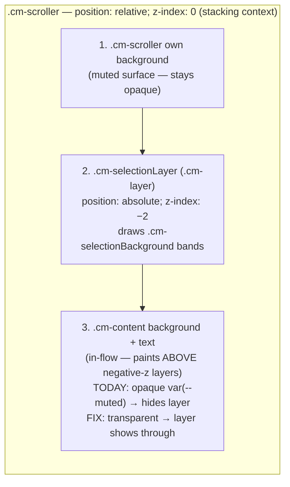

# Visible Text Selection in All CodeMirror Editors - Plan

## Goal Capsule

- **Objective:** Selecting text in any CodeMirror editor in the ThinkWork web app shows a clearly visible selection highlight, focused or unfocused.
- **Product authority:** THINK-296 (High priority, reported by Eric Odom with before/after screenshots — the "after" reference is a standard blue-tinted selection band over the dark editor surface).
- **Open blockers:** none. Root cause verified empirically during planning (see Planning Contract → Root Cause).
- **Product Contract preservation:** Product Contract unchanged from the brainstorm; planning resolved its deferred questions without altering scope.

---

## Product Contract

### Summary

Fix invisible text selection across every CodeMirror editor in the ThinkWork web app by making selection styling a single shared concern applied to all editor embeds, instead of the current split between a partially working house theme and bare `vscodeDark` embeds.

### Problem Frame

Users who select text in ThinkWork's code editors (e.g. the Agent Workspace file editor) get no visual feedback — the selection exists (copy works) but nothing highlights. This makes editing prompts, routines, and workspace files feel broken and error-prone: users can't see what they're about to cut, replace, or copy.

A selection-visibility override was added to the shared editor pane in June 2026 (`packages/workspace-editor/src/components/FileEditorPane.tsx`), yet the bug is still observed. The likely mechanism: CodeMirror's `drawSelection` (on by default via `basicSetup`) suppresses the native selection and paints a `.cm-selectionLayer` at negative z-index; the house theme paints `.cm-content` with an opaque `var(--muted) !important` background, which by CSS paint order sits above that layer and hides it. The three editors that don't use the shared pane rely on bare `vscodeDark` and are reported broken as well.

### Key Decisions

- **One shared selection treatment, not per-editor patches.** The fix ships as a single shared CodeMirror theme/extension (or equivalent shared styling) consumed by every editor embed, so future editors get visible selection for free. Copy-pasting the override into each of the four+ embed sites is explicitly rejected — that is how the current partial/broken state arose.
- **Match the reference look, not pixel-perfect VS Code.** The acceptance bar is the issue's second screenshot: a translucent primary/blue-tinted band over the dark surface, clearly distinguishable from the background and from the active-line/search-match tints. Exact color values are a planning/implementation choice.
- **Root-cause fix over stacking more `!important`.** Planning must verify the paint-order hypothesis and fix the layering (e.g. transparent `.cm-content`, background carried by the scroller/editor, or explicit selection-layer ordering) rather than adding stronger overrides on top of the existing ones.

### Requirements

**Selection visibility**

- R1. Dragging or keyboard-extending a selection in any CodeMirror editor in the web app renders a visible highlight over the selected text.
- R2. The highlight is visible both while the editor is focused and after focus leaves it (CodeMirror's unfocused-selection state), in the app's dark editor surfaces.
- R3. Selection visibility does not regress adjacent editor affordances: cursor, active-line styling (where enabled), search/selection-match tints, and the managed-section decorations in the workspace editor remain readable and visually distinct from the selection band.

**Coverage**

- R4. The fix applies to every CodeMirror embed in the web app. Known surfaces at brainstorm time: the shared workspace editor pane (`packages/workspace-editor/src/components/FileEditorPane.tsx`, used by Agent Workspace / Composer / scoped space+user editors) and the three direct embeds — artifacts editor (`apps/web/src/routes/_authed/_shell/artifacts.$id.tsx`), routine code editor (`apps/web/src/components/routines/RoutineCodeEditor.tsx`), and system prompt viewer (`apps/web/src/components/workbench/SystemPromptViewer.tsx`). Planning re-inventories to catch any embed this list misses.
- R5. Read-only editors (e.g. the system prompt viewer) show the same visible selection as editable ones — selecting to copy is a primary use there.

**Mechanism**

- R6. Selection styling is defined once in shared code and consumed by all embeds; no per-editor duplicated selection CSS remains after the fix.

### Acceptance Examples

- AE1. **Covers R1, R4.** Given the Agent Workspace file editor open on any file, when the user drags across a line of text, then the selected range shows a highlight band clearly distinguishable from the editor background (per the THINK-296 reference screenshot).
- AE2. **Covers R2.** Given text selected in the routines code editor, when the user clicks into another pane (editor loses focus), then the selection remains visibly highlighted (in the dimmer unfocused treatment is acceptable, but not invisible).
- AE3. **Covers R5.** Given the read-only system prompt viewer, when the user selects a paragraph to copy it, then the selection is visibly highlighted before and during the copy.
- AE4. **Covers R3.** Given a workspace file with managed-section decorations, when the user selects text inside a managed section, then both the selection band and the managed-section affordance remain distinguishable.

### Scope Boundaries

- Web app only. The mobile app has no CodeMirror editors; nothing to do there.
- No broader editor-theme redesign — syntax token colors, gutter styling, and the vscodeDark-vs-house-theme follow-up noted in `FileEditorPane.tsx` stay out of scope.
- Light-mode support is bounded by what the editors do today: the editor surfaces are dark-themed regardless of app theme, so the fix targets visibility on those dark surfaces; a themed light editor variant is not in scope.

---

## Planning Contract

### Root Cause (verified 2026-07-15 against installed sources)

All findings below were read directly from the installed dependencies (`@uiw/react-codemirror@4.25.9`, `@uiw/codemirror-extensions-basic-setup@4.25.9`, `@uiw/codemirror-theme-vscode@4.25.9`, `@codemirror/view@6.41.0`) and the four embed sites. There are **two distinct failure mechanisms with one shared cure**:

1. **`drawSelection` is on in every embed and kills the native path.** `@uiw/codemirror-extensions-basic-setup` pushes `drawSelection()` unless the option is explicitly `false` (`if (options.drawSelection !== false) extensions.push(drawSelection())`). No embed disables it. `drawSelection` installs a `Prec.highest` theme forcing `.cm-line ::selection` to `transparent !important` — so the `.cm-content ::selection` arm of the June 2026 override is dead code. Visible selection can only come from the drawn `.cm-selectionLayer`.
2. **Shared pane (`FileEditorPane`) — occlusion.** The selection layer is an absolutely-positioned child of `.cm-scroller` with negative z-index (`(above ? 150 : -1) - pos` → −2). `.cm-scroller` is `position: relative; z-index: 0` (a stacking context), so negative-z children paint above the scroller's own background but **below backgrounds painted by in-flow content**. The house theme's opaque `backgroundColor: var(--muted) !important` on `.cm-content` therefore paints over the correctly-colored selection layer. The June override colors the layer; the content background hides it.
3. **Bare `vscodeDark` embeds — contrast.** `createTheme` puts `settings.background` on `&` (editor root), not `.cm-content`, so no occlusion there. But the palette is imperceptible on these embeds' forced pure-black surfaces (`bg-black`, `[&_.cm-editor]:!bg-black`): vscodeDark's focused selection is `#6199ff2f` (~18% alpha blue ≈ `rgb(18,28,47)` composited on black) and CodeMirror's unfocused default is `&dark .cm-selectionBackground { background: #222 }`.
4. **Embed inventory is complete (R4).** A repo-wide sweep for `@uiw/react-codemirror` / `@uiw/codemirror-theme-*` imports found exactly four production embeds: `packages/workspace-editor/src/components/FileEditorPane.tsx` (shared pane: Agent Workspace, Composer, scoped space/user editors) plus the three direct embeds listed in R4. All other matches are test files/mocks. No global CSS touches `.cm-*` classes.

### Key Technical Decisions

- **KTD1 — Shared theme home: `packages/workspace-editor`.** New module `packages/workspace-editor/src/lib/selection-highlight.ts` exporting an `editorSelectionHighlight` extension, re-exported from `packages/workspace-editor/src/index.ts`. Rationale: the package already owns the editor domain and the `@codemirror/*` + `@uiw/*` dependencies, and `apps/web` already depends on it (`@thinkwork/workspace-editor: workspace:*`). Rejected: `@thinkwork/ui` (would add CodeMirror dependencies to the UI kit) and app-level CSS (not consumable by the package — it would recreate the split that caused this bug).
- **KTD2 — Layering fix, not stronger overrides.** In `FileEditorPane`'s `houseEditorSurface`, remove the opaque background from `.cm-content` (keep its `color`); the muted surface continues to be carried by `&` and `.cm-scroller`, whose own backgrounds paint _below_ negative-z layers. No new `!important` on `::selection` (that path is dead under `drawSelection`).
- **KTD3 — Colors from theme tokens, focused + unfocused arms.** Selection band: `color-mix(in oklab, var(--primary) ~32%, transparent)` when focused, a dimmer ~20% mix when unfocused (satisfies R2/AE2 — dimmer but never invisible; CodeMirror draws the layer regardless of focus, verified in `selectionLayer.markers()`). Keep `.cm-selectionMatch` at a visibly weaker tint (~14%) so search/selection-match stays distinct from the band (R3). Exact percentages are implementation-tunable against the AE1 reference screenshot; `color-mix(in oklab, ...)` is already used in production by this same theme, so no new browser-support risk.
- **KTD4 — Out-cascade `vscodeDark` deliberately.** vscodeDark sets its selection color with `!important` on `&.cm-focused .cm-selectionBackground, ... .cm-selectionLayer .cm-selectionBackground ...`. The shared extension must win: wrap the theme in `Prec.high` and use matching selector shapes (`&.cm-focused .cm-selectionBackground` and `.cm-selectionBackground`) with `!important`, mirroring how the existing house override already wins the cascade today (its failure was occlusion, not specificity).
- **KTD5 — No child issues; one checkpoint PR grouping U1+U2.** Justification: U2 is a mechanical ~2-line adoption per file of U1's export; separate PRs would ship an intermediate state that violates R4 (shared pane fixed, direct embeds still broken) and double merge/deploy overhead for a small, single-concern fix. Building runs on the parent issue THINK-296.

### High-Level Technical Design

Paint order inside a CodeMirror editor (why the occlusion happens and why KTD2 fixes it):

The shared `editorSelectionHighlight` extension carries: (a) `Prec.high` themed selection colors for focused/unfocused `.cm-selectionBackground` and `.cm-selectionMatch`, and (b) nothing else — surface backgrounds remain each embed's concern, with the one rule that **no embed may paint `.cm-content` opaquely** (documented in the module's doc comment).

### Assumptions (headless-run decisions)

- Exact highlight alpha percentages are tuned at implementation/verification time against the reference screenshot; the product bar is "clearly distinguishable", not a specific hex.
- No Linear child issues are created; the parent issue is the single shippable unit (KTD5).

---

## Implementation Units

### U1. Shared selection-highlight extension + shared-pane layering fix

**Goal:** Visible selection in the shared workspace editor pane, driven by a reusable extension any embed can consume.

**Requirements:** R1, R2, R3, R6; AE1, AE4 (shared-pane surfaces).

**Dependencies:** none.

**Files:**

- `packages/workspace-editor/src/lib/selection-highlight.ts` (new — extension + exported theme-spec constant for tests)
- `packages/workspace-editor/src/index.ts` (re-export)
- `packages/workspace-editor/src/components/FileEditorPane.tsx` (layering fix + consume shared extension)
- `packages/workspace-editor/src/__tests__/selection-highlight.test.ts` (new)

**Approach:**

- New module exports `editorSelectionHighlight`: a `Prec.high(EditorView.theme({...}, { dark: true }))` covering `&.cm-focused .cm-selectionBackground` / `.cm-selectionBackground` (focused vs. dimmer unfocused arms, KTD3/KTD4) and `.cm-selectionMatch`. Also export the raw spec object (named export) so unit tests can assert on it without rendering a real editor.
- `FileEditorPane`: delete the opaque `backgroundColor` from `.cm-content` in `houseEditorSurface` (keep `color`); delete the now-superseded inline selection override block (`&.cm-focused .cm-selectionBackground, ...` and `.cm-selectionMatch`); append `editorSelectionHighlight` to the `extensions` array. `&`/`.cm-scroller`/gutter backgrounds stay as-is.

**Patterns to follow:** existing `packages/workspace-editor/src/lib/*` module shape and `src/index.ts` export style; the existing `EditorView.theme` usage in `FileEditorPane.tsx`.

**Test scenarios:**

- Happy path: `editorSelectionHighlight` is a non-empty CodeMirror `Extension`; its spec defines both a focused and an unfocused `.cm-selectionBackground` color and a distinct (weaker) `.cm-selectionMatch` color.
- Regression guard: `FileEditorPane`'s surface theme spec no longer assigns any `backgroundColor` to `.cm-content` (export the `houseEditorSurface` spec or assert via the shared spec constant).
- Covers AE1 (structurally): `FileEditorPane` passes `editorSelectionHighlight` in the `extensions` prop — assert via the existing `@uiw/react-codemirror` mock pattern used in `packages/workspace-editor` tests.

**Verification:** flows V1, V2 of the Verification Contract pass in a real browser against deployed dev.

### U2. Adopt the shared extension in the three direct embeds

**Goal:** Visible selection in the artifacts source editor, routine code editor, and system prompt viewer.

**Requirements:** R1, R2, R4, R5, R6; AE2, AE3.

**Dependencies:** U1.

**Files:**

- `apps/web/src/routes/_authed/_shell/artifacts.$id.tsx`
- `apps/web/src/components/routines/RoutineCodeEditor.tsx`
- `apps/web/src/components/workbench/SystemPromptViewer.tsx`
- Tests: `apps/web/src/routes/_authed/_shell/-artifacts.$id.test.tsx`, `apps/web/src/components/workbench/SystemPromptViewer.test.tsx` (extend existing mocks; add a co-located test for `RoutineCodeEditor` only if one doesn't exist — otherwise cover it in its nearest existing suite)

**Approach:** import `editorSelectionHighlight` from `@thinkwork/workspace-editor` and append it to each embed's `extensions` array. No surface/background changes — these embeds keep their black surfaces (no occlusion there; the failure was palette contrast, which the shared colors fix).

**Patterns to follow:** each embed's existing `extensions={[...]}` composition; existing `vi.mock("@uiw/react-codemirror", ...)` prop-capture pattern in the co-located tests.

**Test scenarios:**

- Covers AE3 (structurally): `SystemPromptViewer` renders read-only and its `extensions` include `editorSelectionHighlight`.
- Each of the other two embeds passes `editorSelectionHighlight` in `extensions` (prop-capture via existing mocks).
- Test expectation for visual contrast itself: none in vitest — jsdom does not paint; visual proof is owned by the Verification Contract browser flows.

**Verification:** flows V3, V4, V5 of the Verification Contract pass in a real browser against deployed dev.

---

## Verification Contract

All flows run in a real browser against the **deployed dev stage** after the merge pipeline deploys, signed in as an operator (Google OAuth). Each flow is a complete user journey, not a component probe.

- **V1 (AE1 — R1, R4):** Open the web app → Agent Workspace → open any workspace file in the editor → drag-select across a line. Expected: a primary-tinted band clearly distinguishable from the muted editor background, matching the THINK-296 reference screenshot's character.
- **V2 (AE4 — R3):** In the Agent Workspace editor, open a file containing managed sections (composer-managed headings) → select text inside a managed section. Expected: selection band and managed-section decoration both visible and visually distinct; cursor and search/selection-match tints unchanged elsewhere.
- **V3 (AE2 — R2):** Routines → open a routine's code editor → select several lines → click into another pane so the editor loses focus. Expected: selection remains visibly highlighted (dimmer treatment acceptable, not invisible).
- **V4 (R1, R4):** Artifacts → open an artifact → Source tab → drag-select code. Expected: visible selection band on the black surface.
- **V5 (AE3 — R5):** Threads → open a thread's execution trace → open an Agent step modal → in the read-only system prompt viewer, select a paragraph → press Copy. Expected: selection visibly highlighted before and during the copy; copy succeeds.
- **V6 (R6):** Static check: no per-editor selection CSS remains — the only selection color definitions live in `packages/workspace-editor/src/lib/selection-highlight.ts`.

---

## Risks & Rollout

- **Cascade risk vs. vscodeDark's `!important`:** mitigated by KTD4 (`Prec.high` + matching selectors); the June override already proved this cascade wins — its failure was occlusion. Caught by V1–V5 if wrong.
- **Removing `.cm-content` background reveals seams:** low — `&` and `.cm-scroller` carry the identical `var(--muted)`, so the composited surface is unchanged. Caught visually in V1.
- **Read-only/unfocused rendering:** `selectionLayer.markers()` draws for any non-empty range with no focus gate (verified in `@codemirror/view` source), so V3/V5 should hold; if a host component remounts the editor on blur it would surface in V3.
- **Rollout:** pure frontend change, no flags, no data, no Terraform. Ships through the normal PR → main merge pipeline; verification runs against deployed dev afterward. Single checkpoint PR for U1+U2 (KTD5). Revert = revert the one PR.

## Definition of Done

- The U1+U2 checkpoint PR is merged to `main` with all checks green.
- V1–V6 pass against deployed dev (screenshots recorded as evidence in the Linear Progress document).
- No per-editor selection styling remains outside the shared module (R6).
- Linear: evidence recorded, handoff comment posted, issue advanced per the factory phase contract.

---

## Sources

- THINK-296 issue description with before/after screenshots.
- `packages/workspace-editor/src/components/FileEditorPane.tsx:19-52` — house editor theme: opaque `var(--muted) !important` backgrounds on `.cm-content`/`.cm-scroller` plus the June 2026 selection override (`&.cm-focused .cm-selectionBackground, .cm-selectionBackground, .cm-content ::selection`) that the issue shows is not effective.
- Direct `vscodeDark` embeds with no selection override: `apps/web/src/routes/_authed/_shell/artifacts.$id.tsx:749`, `apps/web/src/components/routines/RoutineCodeEditor.tsx:60`, `apps/web/src/components/workbench/SystemPromptViewer.tsx:64`.
- Verified in installed dependencies (2026-07-15): `@uiw/codemirror-extensions-basic-setup@4.25.9` enables `drawSelection()` unless explicitly disabled; `@codemirror/view@6.41.0` — `hideNativeSelection` at `Prec.highest`, `.cm-scroller { position: relative; z-index: 0 }`, layer z-index `(above ? 150 : -1) - pos`, `selectionLayer.markers()` has no focus gate; `@uiw/codemirror-themes` `createTheme` places `settings.background` on `&`, not `.cm-content`; vscodeDark `selection: '#6199ff2f'`, `selectionMatch: '#72a1ff59'`.
