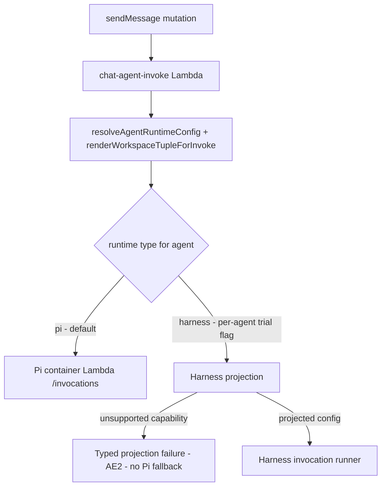
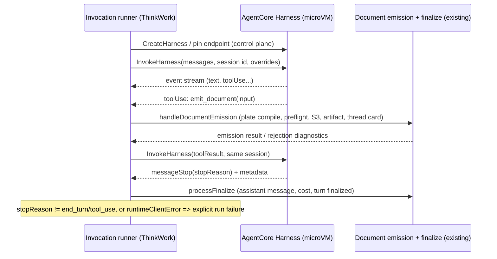

# AgentCore Harness Execution Trial - Plan

## Goal Capsule

- **Objective:** Prove one thin end-to-end slice: the existing Agent Folder behind the reference TEI QBR thread runs on AWS AgentCore Harness (not Pi), and ThinkWork publishes the resulting self-contained HTML plate through the existing artifact finalization, thread attachment, and signed-share path.
- **Authority hierarchy:** This plan > origin requirements doc > repo conventions (CLAUDE.md/CONCEPTS.md). ThinkWork remains authoritative for the Agent Folder, tenant/user context, thread state, artifact persistence, and sharing; Harness configuration is generated execution input.
- **Stop conditions:** A Harness capability gap that blocks the representative folder is a _valid trial outcome_, not a blocker to push through — record the precise limitation in the verdict (U6) and stop; do not widen the trial to work around it. Any change that would alter the Product Contract (new artifact format, Harness-specific viewer, Pi fallback) stops for user decision.
- **Execution profile:** Inert→live sequencing. U2–U5 merge and deploy with the trial flag off; the live trial (U6) runs only after the full path is deployed. No production cutover; dev/TEI stage only.
- **Tail ownership:** U6's verdict doc and the THINK-311 Linear update close the trial; productionization is a separate future plan.

---

## Product Contract

_Product Contract preservation: unchanged — R1–R10, A1–A4, F1–F2, AE1–AE3 carried from the origin doc._

### Summary

Add a Harness execution path at the existing runtime-selector seam: a per-agent trial flag routes the chat dispatch of one representative agent to AWS AgentCore Harness, projecting the folder's compiled signed manifest into Harness configuration, fulfilling `emit_document` as a caller-fulfilled Harness tool against the existing server-side document emission, and finalizing through the existing thread/share pipeline. The trial ends in a recorded go/no-go verdict.

### Problem Frame

ThinkWork needs a fast, decisive test of whether AWS AgentCore Harness can replace Pi as the execution engine without changing ThinkWork's product model. The trial is not an enterprise workflow demonstration or a production cutover. The reference behavior is TEI thread `a97275ae-4152-41a0-bf1b-9afe4f8abfed` and its published `QBR: 777 Automotive` HTML plate. Success means the equivalent run is performed by Harness rather than Pi while the Agent Folder and ThinkWork artifact system remain authoritative. If the slice passes, productionization is planned separately; if it fails, the exact Harness limitation is recorded, Pi stays, and the Eve-on-AWS fallback is evaluated against that gap.

### Actors

- A1. ThinkWork operator: selects the existing agent and invokes the trial through the deployed ThinkWork product path.
- A2. ThinkWork control plane: resolves the Agent Folder, tenant/user context, tools, and artifact destination.
- A3. AWS AgentCore Harness: executes the compiled agent configuration and returns the run output.
- A4. Artifact pipeline: stores, renders, and publishes the final HTML plate using the existing ThinkWork share path.

### Key Flows

- F1. Run an existing Agent Folder on Harness
  - **Trigger:** A1 starts the representative QBR-style agent from ThinkWork (chat message in a thread on the flagged agent).
  - **Actors:** A1, A2, A3
  - **Steps:** ThinkWork resolves the selected Agent Folder; projects the folder content needed by the run into Harness; invokes Harness with the same user, tenant, prompt, skills, and tools needed by the reference agent; consumes the run's event stream to determine success or failure.
  - **Outcome:** Harness completes the agent run without Pi executing the model/tool loop.
  - **Covered by:** R1, R2, R3, R4, R7

- F2. Publish the HTML plate
  - **Trigger:** The Harness run calls the projected `emit_document` tool with its final plate content.
  - **Actors:** A2, A3, A4
  - **Steps:** ThinkWork fulfills the tool call through the existing document emission (plate resolution, server-side compile, DocSpector preflight, S3 persistence, born-as-artifact upsert, thread card); the run finalizes through the existing finalize pipeline; a signed share URL is minted through the existing share path.
  - **Outcome:** The user can open a self-contained, responsive HTML plate comparable to the reference QBR artifact.
  - **Covered by:** R5, R6, R7, R8

### Requirements

**Agent Folder execution**

- R1. The trial must run one existing representative ThinkWork Agent Folder; it must not introduce a second authoring format for the agent.
- R2. The folder's effective instructions, model choice, required skills, and required connector/tool access must be projected into Harness closely enough to complete the reference run.
- R3. ThinkWork must remain authoritative for the agent identity, tenant/user context, folder contents, and allowed tool surface; Harness configuration is generated execution input.
- R4. The accepted trial run must use Harness for the model/tool loop and must not silently fall back to Pi. Unsupported folder behavior must fail explicitly.

**Plate artifact output**

- R5. The run must produce a complete HTML document recognized as a ThinkWork plate, including the plate type metadata, title, embedded styling, content, and any charts or tables required by the representative artifact.
- R6. The HTML must be self-contained and usable in the existing artifact renderer and signed-share route without a Harness-specific viewing experience.
- R7. The artifact must be attached to the originating ThinkWork thread and remain available after the run has completed and the page has been reloaded.
- R8. The published result must be materially comparable to the reference `QBR: 777 Automotive` plate in completeness, readability, responsive layout, and print behavior. Pixel identity and identical prose are not required.

**Trial evidence and decision**

- R9. The trial must retain minimal proof that the accepted run used the selected Agent Folder and Harness version and produced the published artifact; full observability, cost accounting, and fleet analytics are deferred.
- R10. The trial outcome must result in a clear go/no-go decision: proceed to productionization planning if the end-to-end slice passes, or document the precise Harness limitation and keep Pi while evaluating the fallback.

### Acceptance Examples

- AE1. **Covers R1-R8.** Given the existing representative Agent Folder and the QBR-style prompt/data used by the reference TEI thread, when the operator invokes the agent through the Harness trial path, Harness completes the run and ThinkWork publishes a durable, shareable HTML plate comparable to `QBR: 777 Automotive` without Pi executing the loop.
- AE2. **Covers R4, R9, R10.** Given a required folder capability cannot be mapped to Harness, when the trial is invoked, the run fails explicitly with the unsupported capability identified; it does not fall back to Pi and report a false pass.
- AE3. **Covers R5-R8.** Given the trial reports success, when the thread and signed share URL are opened after completion, the same self-contained plate renders on desktop and mobile and remains printable.

### Success Criteria

- One existing ThinkWork Agent Folder executes end to end on AWS AgentCore Harness and produces the expected customer-facing HTML plate through the deployed ThinkWork path.
- The run proves that ThinkWork can preserve Folder-is-the-Agent and its artifact experience while substituting Harness for Pi at the execution seam.
- The verdict (pass, or precisely-named limitation) is recorded and actionable without inventing a trial vertical, writeback workflow, observability program, or production migration strategy.

### Scope Boundaries

**Deferred for later (post-trial productionization, only if the slice passes)**

- Production cutover, tenant canaries, Pi deletion, fleet-scale certification.
- Full Agent Folder capability parity (nested sub-agents, memory behavior, every connector type).
- Observability redesign, cost dashboards, bill reconciliation, optimization.
- Thread-UI rendering of Harness intermediate tool activity (`usage.tool_invocations` record parity from the Strands→Pi swap contract) — the trial proves the final plate, thread attachment, and share link only.
- Scheduled/wakeup dispatch through Harness — the trial covers the chat dispatch path only.

**Outside this trial's identity**

- No ERP, fleet, tank-monitor, approval, or external-system writeback scenario beyond what the selected existing agent actually requires.
- No new artifact format or Harness-specific artifact viewer.
- Eve-on-AWS remains a fallback evaluated only if this trial exposes a blocking limitation.

### Dependencies / Assumptions

- The representative Agent Folder and the data/tool access used by the referenced TEI thread remain available in a deployed non-production ThinkWork stage.
- The existing artifact finalization and signed-share pipeline accepts HTML-plate emission input generated by a Harness-backed run without format changes (server-side plate compile means Harness produces emission input, not final HTML).
- AWS AgentCore Harness (GA 2026-06-17) can be invoked with the prompt, model, skills, and tool surface required by the representative folder; the exact projection is U3's work.

### Outstanding Questions

All origin blockers were empty; the origin's three deferred-to-planning questions are resolved by U1 (reference folder identification), U3 (smallest projection), and KTD-3 (finalization seam reuse). Remaining deferred-to-implementation items:

- [Deferred, affects U3] Whether installed workspace skill folders can be handed to Harness as-is via an S3 AgentSkills source, or need a small packaging transform into the AgentSkills.io bundle layout. Both are in-scope for U3; the choice is made against the real reference folder.
- [Deferred, affects U5] Whether the reference run's wall-clock duration fits a single Lambda invocation (15-minute ceiling) while streaming `InvokeHarness`. If not, U5 falls back to a Step Functions or re-invoke continuation — decided empirically during U5, not pre-built.
- [Deferred, affects U3] Whether Harness `remote_mcp` tool entries accept the per-connector bearer/auth headers ThinkWork's `mcp_configs` carry today. Verified empirically against the deployed MCP endpoints before the trial run (verify wire format empirically).

---

## Planning Contract

### Key Technical Decisions

- KTD-1. **Extend the existing runtime selector; no parallel trial pipeline.** `packages/api/src/lib/resolve-runtime-function-name.ts` already models runtime choice (`AgentRuntimeType`, currently hardcoded to `"pi"`, with `RuntimeNotProvisionedError` as the loud-fail pattern). Add `"harness"` and branch inside the chat dispatch handler after workspace render — that point already holds the signed compiled manifest + fingerprint, composed system prompt inputs, skills, and MCP configs. Rationale: satisfies R1/R3 by construction (same folder, same resolution) and keeps the trial on the deployed product path (A1).
- KTD-2. **Projection source is the rendered workspace tuple, never the raw folder.** The Harness config is generated from `renderWorkspaceTupleForInvoke` output (capabilities manifest, effective policy, rendered prefix) plus the same system-prompt composition inputs Pi uses, stamped with `capabilities_manifest_fingerprint`. Harness must not re-read folders. Rationale: matches the decided adapter pattern from the agent-profiles/Flue spikes (ThinkWork compiles its own config into a constrained external adapter) and gives R9 its evidence anchor.
- KTD-3. **`emit_document` projects as a caller-fulfilled Harness `inline_function` tool; Harness gets no egress into ThinkWork.** The invocation runner fulfills the tool call by driving the existing document emission (`handleDocumentEmission` path: plate resolution → server-side compile → DocSpector preflight → S3 → born-as-artifact → thread card), then returns the tool result to Harness on the same session. Rationale: R5–R7 reuse the pipeline byte-for-byte; the Pi container's `createLambdaCallbackFetch` egress seam doesn't exist for a managed microVM, and inline functions are the documented Harness mechanism for caller-owned tools.
- KTD-4. **No-fallback is structural, not caught-exception.** The selector returns exactly one engine; when the flag routes to Harness, the Pi invoke is unreachable code. Pre-invoke projection gaps raise a typed error naming the unsupported capability (AE2); in-run failures map from Harness's explicit signals (`stopReason` other than `end_turn`/`tool_use`, `runtimeClientError`, thrown SDK exceptions) to a failed run surfaced in the thread. Rationale: the eval-judge incident showed silent fallback arrives via config/flag paths, so the structure — not error handling — must forbid it.
- KTD-5. **Harness resources are provisioned by SDK at trial time; Terraform owns only IAM.** AWS ships no CloudFormation/Terraform Harness resource — harness create/version/endpoint run through `@aws-sdk/client-bedrock-agentcore-control`, pinned to a named endpoint for reproducibility. Terraform adds the execution role (scoped `bedrock:InvokeModel*`, S3 skill read; **no** `bedrock-agentcore:InvokeAgentRuntimeCommand`, which bypasses `allowedTools`) and the invoker's `InvokeHarness` + `InvokeAgentRuntime` grants.
- KTD-6. **Trial gate is a per-agent flag, not an env var.** Follow the `capability_folder_dispatch` per-agent pattern in `resolve-agent-runtime-config.ts`; the graphql-http env block is at its 4KB ceiling and a stage-wide env flag couldn't scope to one agent anyway. The flag must be wired end-to-end in the same unit that reads it (env-gated-feature trap) — but as agent config it travels through the DB/workspace, avoiding the Terraform env path entirely.
- KTD-7. **Chat dispatch only.** The wakeup processor's second payload builder and the dispatch-parity contract stay untouched; the trial's operator invocation is a chat message (F1). Any new dispatch-critical field the Harness path needs still goes through `buildAgentDispatchControlFields` so the parity test stays honest.
- KTD-8. **SigV4 IAM invocation; per-user JWT propagation not needed for the trial.** Harness only propagates per-user identity to its token vault for JWT-authenticated callers; ThinkWork's MCP tools already carry their own handle-scoped auth in `mcp_configs`, projected into `remote_mcp` entries, so SigV4 suffices for this slice.
- KTD-9. **Harness turns opt out of the stall-monitor kill/retry loop and own their abandonment path.** The 1-minute stall monitor (`packages/api/src/handlers/crons/stall-monitor.ts`) flips `running` turns with no `last_activity_at` bump for 5 minutes to `timed_out` and enqueues a `retry_queue` row that the retry dispatcher re-executes through the wakeup path — which resolves to Pi. Unhandled, the reconciler itself becomes a silent Pi fallback (violating R4). The runner therefore bumps `thread_turns.last_activity_at` periodically while consuming the Harness stream, and Harness turns are excluded from retry-queue re-dispatch; on abandonment (crash, max wall clock), the runner's failure path still finalizes-through-failure so `threads.checkout_run_id` is released and deferred wakeups promote. Rationale: R4's no-fallback rule must hold against the background reconcilers, not just the dispatch branch; thread checkout must never wedge (a dead trial turn must not block the thread).

### High-Level Technical Design

Trial dispatch selection (chat path):

Harness run and artifact finalization (sequence):

_Directional guidance, not implementation specification: the runner may live inside `chat-agent-invoke` or as a sibling Lambda — U5 decides against the streaming/timeout reality._

### Sequencing

Inert→live (house pattern): U2 (selector seam, inert) and U3 (projection, pure functions) merge behind the off flag with unit tests; U4 lands infrastructure; U5 makes the path live; U6 is the trial itself. U1 runs first and in parallel with U2–U3 — its dossier feeds U3's projection fixtures.

---

## Implementation Units

### U1. Reference-run dossier

- **Goal:** Identify the exact deployed Agent Folder, tenant, plate, skills, tools, and invocation inputs behind TEI thread `a97275ae-4152-41a0-bf1b-9afe4f8abfed`, and capture them as the trial's fixture set.
- **Requirements:** R1, R2, R9 (origin deferred question 1)
- **Dependencies:** none
- **Files:** `docs/solutions/architecture-patterns/agentcore-harness-trial-verdict-2026-07.md` (dossier section; verdict body added by U6)
- **Approach:** Read-only investigation against the TEI stage: resolve the thread's agent, its workspace folder contents (INSTRUCTIONS.md, installed skills, connectors), the plate slug used by the reference artifact, the compiled manifest fingerprint, and the original prompt/attachments. Record the minimal capability inventory the run actually exercised — this bounds U3's projection scope (scoped parity, not full parity).
- **Test scenarios:** Test expectation: none — read-only investigation producing a dossier document.
- **Verification:** Dossier names the agent, tenant, folder path, plate slug, skill slugs, connector/tool list, model, and reference prompt; U3 can be written against it without further archaeology.

### U2. Runtime selector seam and per-agent trial flag (inert)

- **Goal:** The chat dispatch can route a flagged agent to a `"harness"` runtime type that fails loudly, with Pi structurally unreachable when the flag is on.
- **Requirements:** R1, R3, R4
- **Dependencies:** none
- **Files:** `packages/api/src/lib/resolve-runtime-function-name.ts`, `packages/api/src/lib/resolve-agent-runtime-config.ts`, `packages/api/src/handlers/chat-agent-invoke.ts`, `packages/api/src/handlers/chat-agent-invoke.runtime-routing.test.ts`
- **Approach:** Extend `AgentRuntimeType` with `"harness"`; resolve it from a per-agent trial flag (mirroring the `capability_folder_dispatch` resolution pattern). While inert, the harness branch raises a typed not-yet-provisioned error (mirroring `RuntimeNotProvisionedError`) surfaced as an explicit run failure in the thread. The Pi invoke must live on the other side of the branch — no shared fall-through. The type union ripples to every importer of `resolve-runtime-function-name.ts` (chat, wakeup-processor, evals, `graphql/utils.ts`): the trial scopes Harness to chat-originated turns, so non-chat dispatch of the flagged agent must be a _declared_ decision — fail loud for wakeup/retry dispatch of a flagged agent rather than type-accepting `"harness"` and silently running Pi.
- **Patterns to follow:** `RuntimeNotProvisionedError` loud-fail; inert-to-live seam-swap pattern (`docs/solutions/architecture-patterns/inert-to-live-seam-swap-pattern-2026-04-25.md`).
- **Test scenarios:**
  - Happy path: agent without the flag resolves to `"pi"` and invokes the Pi Lambda exactly as today (existing routing test stays green).
  - Covers AE2 (structural half): agent with the flag resolves to `"harness"`; while inert, dispatch produces an explicit typed failure and the Pi Lambda invoke is never called (assert zero Pi invocations, not just an error).
  - Edge: flag present but malformed/unknown value → explicit error, not silent Pi.
  - Non-chat paths: wakeup/retry dispatch of a flagged agent produces the declared explicit failure (not a silent Pi run); flag-off agents on all paths (chat, wakeup, evals) still resolve the Pi function name.
- **Verification:** Routing tests prove one-engine-only behavior both ways; deployed with flag off, chat behavior is byte-identical to today.

### U3. Manifest→Harness projection

- **Goal:** A pure module that compiles the rendered workspace tuple into Harness create/invoke configuration, or rejects with the precise unsupported capability.
- **Requirements:** R2, R3, R4, R9 (origin deferred question 2)
- **Dependencies:** U1 (fixture dossier)
- **Files:** `packages/api/src/lib/harness/projection.ts` (new), `packages/api/src/lib/harness/projection.test.ts` (new)
- **Approach:** Inputs: capabilities manifest + fingerprint, composed system prompt, agent model choice, skill folder sources, `mcp_configs`, effective tool policy, plate registry context for the `emit_document` tool schema. Outputs: `CreateHarness`/`InvokeHarness` field sets — `systemPrompt` snapshot, `bedrockModelConfig`, `skills` (S3 sources; decide as-is vs. AgentSkills.io packaging transform against the real folder), `tools` (`remote_mcp` entries from `mcp_configs`; one `inline_function` for `emit_document` whose input schema matches the document emission input), `allowedTools` narrowing from the effective policy, iteration/token/time limits. Anything in the manifest's active set with no Harness mapping → typed rejection naming the capability. Stamp the manifest fingerprint and projection config fingerprint into the output for evidence.
- **Test scenarios:**
  - Happy path: reference-folder fixture (from U1) projects to a complete config; snapshot test on the projected shape.
  - Covers AE2: fixture with an unmappable capability (e.g., a capability class Harness has no analog for) → rejection names that capability; no partial config emitted.
  - Edge: empty skills; connector with narrowed operations → `allowedTools` reflects the narrowing; model absent → agent's configured model required, no silent default.
  - Error path: manifest signature/fingerprint absent → projection refuses (evidence contract, R9).
- **Verification:** `npx vitest run src/lib/harness/projection.test.ts` green inside `packages/api`; projected config for the reference fixture reviewed against the dossier's capability inventory.

### U4. Harness IAM and SDK plumbing

- **Goal:** The deployed stage has the IAM surface and SDK clients needed to create and invoke a Harness.
- **Requirements:** R3, R4 (enforcement side), R9
- **Dependencies:** none (parallel with U2/U3)
- **Files:** `terraform/modules/app/agentcore-harness/` (new module: execution role + policies), `terraform/modules/thinkwork/main.tf`, `terraform/examples/greenfield/main.tf` (root passthrough), `terraform/modules/app/lambda-api/handlers.tf` (invoker grants), `packages/api/package.json` (bump the existing `@aws-sdk/client-bedrock-agentcore-control` devDependency `^3.917.0` to a Harness-capable version and move it to `dependencies`; verify `@aws-sdk/client-bedrock-agentcore` `^3.1024.0` exposes `InvokeHarness`)
- **Approach:** Execution role trusted by `bedrock-agentcore.amazonaws.com` with `bedrock:InvokeModel*` scoped to the models the reference agent uses, S3 read on the skill source prefix, logs/traces. Invoker (api Lambda role) gets `bedrock-agentcore:InvokeHarness` + `bedrock-agentcore:InvokeAgentRuntime` and control-plane create/get on harness resources. Deliberately omit `bedrock-agentcore:InvokeAgentRuntimeCommand` everywhere. Verify the pinned `@aws-sdk/client-bedrock-agentcore` version exposes `InvokeHarness`; bump as needed and add the control client.
- **Execution note:** This is packaging/infra; prefer deploy-time smoke verification (`terraform plan` on the stage, a scripted `CreateHarness`/`GetHarness` round-trip) over unit coverage.
- **Test scenarios:** Test expectation: none — infrastructure and dependency plumbing; verified by the smoke round-trip.
- **Verification:** `thinkwork plan -s dev` clean; a throwaway harness reaches `READY` and is deleted; new root variables declared so deploy.yml doesn't fail (deploy-var trap); targeted-apply Lambda target list updated if the module carries one.

### U5. Harness invocation runner and finalization reuse (live swap)

- **Goal:** The `"harness"` branch performs the real run: create/pin harness, invoke with the projected config, fulfill `emit_document`, finalize the turn, and map every failure explicitly.
- **Requirements:** R4, R5, R6, R7, R9 (origin deferred question 3)
- **Dependencies:** U2, U3, U4
- **Files:** `packages/api/src/lib/harness/runner.ts` (new), `packages/api/src/lib/harness/runner.test.ts` (new), `packages/api/src/handlers/chat-agent-invoke.ts`, `packages/api/src/handlers/crons/stall-monitor.ts` + `packages/api/src/handlers/crons/retry-dispatcher.ts` (Harness-turn exclusion), `scripts/build-lambdas.sh` (only if a new handler entry is added)
- **Approach:** Snapshot callback config (API URLs/secrets, tenant/thread/turn ids) at dispatch entry — never re-read after the run (env-shadowing trap). Create-or-update the harness from U3's config and pin a named endpoint recording `harnessId` + version; `InvokeHarness` with a session id derived from the thread (≥33 chars), consuming the event stream. Turn lifecycle (KTD-9): bump `thread_turns.last_activity_at` periodically while streaming; exclude Harness turns from retry-queue re-dispatch; on crash or max wall clock, finalize-through-failure (mirroring the existing dispatch-failure branch: turn `failed`, turn-update notify, generic error assistant message) idempotently against the `finalized_at` CAS so retries can't double-post, releasing `threads.checkout_run_id` and letting deferred wakeups promote. On the `emit_document` tool call, call `handleDocumentEmission` via the lib entrypoint with `triggering_message_id` populated on the turn row (it resolves the acting user from it; the emission also owns the `document.card` event and its AppSync notify) — plate compile stays server-side; rejection diagnostics return to Harness as an error tool result on the same session. On terminal `messageStop`: `end_turn` → `processFinalize` with a **complete** `FinalizePayload` — assistant message, `usage`, `tool_invocations`, explicit `changed_files`, `runtime_type`, `cost_owner_user_id` — a minimal payload silently skips cost recording and budget enforcement; any other `stopReason`, `runtimeClientError`, or SDK exception → explicit failed run in the thread naming the cause. Record the evidence triple (manifest fingerprint, harness version, artifact id) on the run. Decide in-unit whether the runner stays inside `chat-agent-invoke` (15-min Lambda ceiling measured against the reference run) or becomes a sibling handler; if the runner is itself invoked async, it needs `maximum_retry_attempts = 0` + DLQ (async-retry-idempotency pattern) so Lambda retries can't re-run a turn.
- **Patterns to follow:** `packages/api/src/lib/artifacts/document-emission.ts` input contract; `processFinalize` payload in `packages/api/src/lib/chat-finalize/`; callback-snapshot rule from `docs/solutions/workflow-issues/agentcore-completion-callback-env-shadowing-2026-04-25.md`.
- **Test scenarios:**
  - Happy path (mocked Harness stream): text + `emit_document` toolUse + `end_turn` → emission called once with the projected schema's input, tool result returned on the same session, finalize called with the assistant message; evidence triple recorded.
  - Covers AE2: stream ends `max_iterations_exceeded` → run fails explicitly with that reason; finalize records the failure; no Pi invocation.
  - Error paths: `runtimeClientError` event; SDK `ValidationException` on invoke; emission rejection (bad plate input) returned to Harness as error tool result and, if the run then ends without a successful emission, the run fails — never a false pass.
  - Edge: duplicate `emit_document` calls in one run → deterministic artifact id upsert holds (no duplicate artifacts); tool call with malformed input → error tool result, run continues.
  - Turn lifecycle: a long-streaming run keeps `last_activity_at` fresh (stall monitor would not select it); a stall-killed or crashed Harness turn produces no Pi re-dispatch from the retry queue; after a failed Harness turn, the thread checkout is released and a second user message dispatches normally.
  - Integration: emission input from the runner passes `parseDocumentEmitInput` and plate resolution against a real registry fixture; emission precedes finalize (the card event requires the turn row to exist).
- **Verification:** Full `pnpm --filter @thinkwork/api test` green (whole package suite, not just new files); deployed to dev with the flag on a scratch agent, a trivial prompt completes a Harness run end to end with a visible thread result.

### U6. Live trial, evidence, and go/no-go verdict

- **Goal:** Execute the acceptance slice on the deployed stage and record the decision.
- **Requirements:** R8, R9, R10; AE1, AE3
- **Dependencies:** U1–U5 deployed
- **Files:** `docs/solutions/architecture-patterns/agentcore-harness-trial-verdict-2026-07.md`
- **Approach:** Enable the trial flag on the reference agent (or a clone of its folder on the trial stage per U1's dossier), run the QBR-style prompt through the product chat path, and evaluate: plate completeness/readability/responsive/print against the reference artifact (material comparability, not pixel identity); thread attachment surviving reload; signed share URL rendering desktop + mobile + print. Capture the evidence triple. Write the verdict: PASS → recommend a separate productionization plan; FAIL → name the exact Harness limitation and the Pi/Eve implication (Flue-spike verdict-doc shape). Update THINK-311 with the outcome.
- **Execution note:** Live smoke verification is the proof here; no unit coverage. Disable the trial flag after the run.
- **Test scenarios:**
  - Covers AE1: the end-to-end pass case above.
  - Covers AE3: reload + share URL on desktop and mobile viewports; print preview intact.
  - Covers AE2 (live): if any capability fails to project, the recorded failure names it — that path _is_ a completed trial outcome, not a retry loop.
- **Verification:** Verdict doc committed with the evidence triple and decision; THINK-311 updated; flag off afterwards.

---

## Verification Contract

| Gate                  | Command / check                                                                                                                                       | Applies to     |
| --------------------- | ----------------------------------------------------------------------------------------------------------------------------------------------------- | -------------- |
| API package suite     | `pnpm --filter @thinkwork/api test` (full suite, not only new files)                                                                                  | U2, U3, U5     |
| Types / lint / format | `pnpm -r --if-present typecheck && pnpm lint && pnpm format:check`                                                                                    | all code units |
| Targeted tests        | `npx vitest run src/lib/harness/*.test.ts src/handlers/chat-agent-invoke.runtime-routing.test.ts` in `packages/api`                                   | U2, U3, U5     |
| Infra smoke           | `thinkwork plan -s dev` clean; scripted `CreateHarness` → `READY` → delete round-trip                                                                 | U4             |
| Regression guard      | Flag-off deployed behavior identical to current Pi path (existing routing test + a live Pi chat turn on dev)                                          | U2, U5         |
| Cost parity           | A completed Harness turn produces `cost_events` rows (Cost Explorer is truth; a turn with zero cost records means the FinalizePayload was incomplete) | U5, U6         |
| Acceptance            | AE1–AE3 exercised live on the deployed stage                                                                                                          | U6             |

No DB migrations are expected; if the per-agent flag needs a column rather than existing agent config JSON, follow the migration-precheck gate and hand-rolled-migration rules.

---

## Definition of Done

- All six units merged to `main` via PRs (worktree-isolated), each green on the pre-commit gates, with post-merge Deploy runs watched to completion.
- Flag-off production behavior unchanged; flag routes exactly one agent to Harness on the trial stage.
- AE1–AE3 verified live, or AE2's explicit-failure path verified with the limitation named.
- Verdict doc committed with the evidence triple (manifest fingerprint, harness version, artifact id) and the go/no-go decision; THINK-311 updated and the trial flag disabled.
- No abandoned experimental code in the diff: dead Harness scaffolding from dead-end attempts removed before the final unit closes.

---

## Risks & Dependencies

- **SDK availability:** the pinned `@aws-sdk/client-bedrock-agentcore@^3.10xx` may predate the Harness operations — verified first in U4; a bump is low-risk but esbuild bundling flags (`BUNDLED_AGENTCORE_ESBUILD_FLAGS`) may need the new control client added.
- **Lambda 15-minute ceiling vs. run duration:** the reference QBR run's wall clock is unknown until U1/U5; the runner design keeps a continuation escape hatch (deferred question above) rather than pre-building one.
- **MCP auth projection:** `remote_mcp` acceptance of ThinkWork's bearer-token MCP configs is assumed from docs but verified empirically before the trial (deferred question above). A gap here is itself a legitimate AE2 outcome, not a plan failure.
- **Skill packaging:** workspace `skills/<slug>/` folders are SKILL.md-based like AgentSkills.io, but layout details may differ; U3 owns the as-is vs. transform decision against the real folder.
- **pi-ai silent-validation analog:** watch for empty-content/zero-token responses in the Harness stream; treat them as explicit failures, mirroring the known Bedrock ValidationException swallowing behavior in the Pi stack.
- **Stall monitor / THINK-301 interplay:** the chat-turn stall monitor is the 5-minute `last_activity_at` reconciler (the 15-minute reconciler cited in the callback-shadowing learning governs `skill_runs`, a separate system). THINK-301 is reworking activity bumping; U5's keepalive must not assume THINK-301's fix has landed, and the retry-queue exclusion must be re-checked against whatever THINK-301 ships. McPherson's monitor is currently manually disabled — dev's is enabled, so dev is where the interaction will actually manifest.
- **`runtime_type` grows a new bucket:** `thread_turns.runtime_type` is free text (no migration needed), but trace-ledger and cost surfaces that group by it will see `harness` appear — verify those queries and dashboards tolerate the new value rather than dropping the rows.

---

## Sources & Research

- Origin requirements: `docs/brainstorms/2026-07-16-think-311-agentcore-harness-trial-requirements.md`; ideation: `docs/ideation/2026-07-16-think-311-eve-aws-harness-ideation.html`; tracking: THINK-311.
- Repo seams: `packages/api/src/lib/resolve-runtime-function-name.ts` (selector), `packages/api/src/handlers/chat-agent-invoke.ts` (dispatch + payload), `packages/api/src/lib/capabilities/manifest-compile.ts` (signed manifest), `packages/api/src/lib/artifacts/document-emission.ts` + `packages/api/src/handlers/artifact-share.ts` (plate + share), `packages/api/src/lib/chat-finalize/process-finalize.ts` (finalize chain + `finalized_at` CAS), `packages/api/src/handlers/crons/stall-monitor.ts` + `packages/api/src/handlers/crons/retry-dispatcher.ts` (turn-lifecycle reconcilers), `packages/agentcore-pi/agent-container/src/runtime/callback-lambda-fetch.ts` (why Harness needs caller-fulfilled tools). `packages/api/agentcore-invoke.ts` is a legacy Strands-era red herring — do not hook there. The Pi DLQ has no consumer — the stall monitor is the real failure-surfacing mechanism today.
- Institutional learnings: runtime-swap tool-parity contract (2026-05-29), inert-to-live seam swap (2026-04-25/2026-05-08), env-gated-feature-dead-without-terraform (2026-06-13), completion-callback env shadowing (2026-04-25), agent-profiles adapter spike (2026-06-07), wakeup payload parity (2026-06-12) — all under `docs/solutions/`.
- AWS: AgentCore Harness devguide (harness, tools, skills, models, security, versioning, operations, harness-vs-runtime), `InvokeHarness`/`CreateHarness` API references, GA announcement 2026-06-17. Load-bearing findings: `inline_function` caller-fulfilled tools; `stopReason`/`runtimeClientError` failure semantics; no CFN Harness resource; `allowedTools` does not constrain `InvokeAgentRuntimeCommand`; SigV4 callers get no per-user token-vault propagation; session ids ≥33 chars. `vercel-labs/steve` (linked on THINK-311) is unrelated to AWS Harness.
