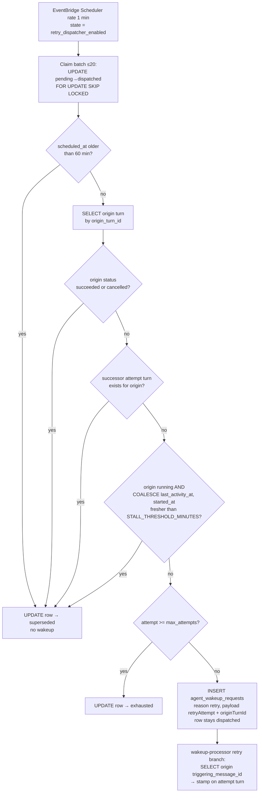

# Origin-Aware Retry Dispatcher, Wired and Backlog-Safe - Plan

## Goal Capsule

- **Objective:** Genuine agent stalls recover automatically — the retry dispatcher is actually scheduled for the first time — and a retry never dispatches when the origin turn already succeeded, is demonstrably progressing, or the queued row is stale backlog.
- **Product authority:** THINK-307, unit U3 (PR-C) of the parent plan `docs/plans/2026-07-16-001-fix-agent-timeout-stall-false-positives-plan.md` (THINK-301, Eric Odom: "It needs to automatically retry the prompt.").
- **Open blockers:** None for implementation of the code+Terraform PR. The dispatcher schedule must not first go ENABLED on a stage until U1 (THINK-305), U4+U5 (THINK-308), and U6 (THINK-309) are live there — see Dependencies and Rollout.
- **Product Contract preservation:** unchanged in substance. Two planning clarifications recorded in KTD3: R2's "`succeeded`/`completed`" maps to the actual `thread_turns.status` enum (`succeeded` — no `completed` value exists), and `cancelled` origins are added to the supersede set (a human already resolved the turn; the 2026-07-15 McPherson incident where 8 duplicate turns were cancelled by hand is exactly this shape). Two additive extensions beyond the parent files list, both serving stated flow preconditions: a successor-turn guard enforcing F1's "no successor" trigger (KTD4), and the `idx_thread_turns_origin_turn` index it needs.

---

## Product Contract

### Summary

Wire the existing-but-never-scheduled `cron-retry-dispatcher` Lambda into Terraform (handler registration + 1-minute schedule + `retry_dispatcher_enabled` variable) and, in the same PR, make it born-safe: skip and supersede a queued retry when the origin turn already succeeded or shows fresh activity, supersede stale backlog rows instead of dispatching them, and pair the recovered answer to the user's original message by copying `triggering_message_id` onto the retry-attempt turn.

### Problem Frame

Parent-plan discovery D1: `cron-retry-dispatcher` is built by `scripts/build-lambdas.sh` but registered nowhere in `terraform/` — no handler entry, no `aws_scheduler_schedule`. Automatic retry has never functioned; `retry_queue` rows enqueued by the stall monitor are never drained, so every affected stage carries a backlog of stale `pending` rows. Naively enabling the dispatcher would (a) mass-dispatch months of stale rows on first enable, (b) re-run prompts whose origin turn eventually succeeded (duplicate turns — 8 were cancelled by hand on McPherson 2026-07-15), and (c) produce recovered answers orphaned from the user's message, because the wakeup-processor retry branch does not carry the origin turn's `triggering_message_id`.

### Key Decisions

- **Dispatcher and safety guards land in one PR (parent KTD2).** The schedule is never live in a state where a stale backlog or a recovered origin can double-dispatch.
- **Skipped retries are recorded, not deleted.** A retry cancelled because the origin recovered or the row is stale backlog is marked with a new `superseded` status (parent D3); the column is plain text, so no migration is needed. The schema comment enumerates the new status.
- **Backlog safety is in-code, not a manual cleanup.** Rows whose `scheduled_at` is older than a 60-minute cutoff are superseded without dispatch. This is safe because the retry backoff cap is 300 seconds — no legitimate retry is ever scheduled that far out. Accepted shadow path: a genuine retry delayed >60 minutes by dispatcher downtime (schedule disabled mid-rollout, extended Lambda failure) is also superseded — the recovery path for that rare window is THINK-308's widened manual Retry, and the handler's `superseded` log tally is the operator signal that a drop window occurred.
- **Existing dispatcher semantics are preserved.** `FOR UPDATE SKIP LOCKED` claiming and `max_attempts → exhausted` behavior stay as-is; this unit adds guards in front of dispatch, it does not redesign the queue.

### Requirements

- R1. The retry dispatcher runs on a 1-minute schedule registered in Terraform (`terraform/modules/app/lambda-api/handlers.tf`), with its enabled state controlled by a `retry_dispatcher_enabled` variable declared through module and root passthrough. _(Parent R4 — wiring half.)_
- R2. Before dispatching a claimed retry row, the dispatcher loads the origin turn and supersedes the row without dispatch when the origin's status is `succeeded` or `cancelled`. _(Parent R5, AE2. Parent text said `succeeded`/`completed`; clarified to the actual enum per KTD3.)_
- R3. A claimed row whose origin turn is `running` with `COALESCE(last_activity_at, started_at)` fresher than the stall threshold is superseded without dispatch — the turn recovered or was reconciled. _(Parent R5.)_
- R4. A claimed row whose `scheduled_at` is older than 60 minutes is superseded without dispatch, so first enable on a stage with stale backlog cannot mass-dispatch. _(Parent R2/R5, discovery D1.)_
- R5. A row that passes all guards dispatches via the existing `agent_wakeup_requests` insert (reason `retry`) and is marked `dispatched`, preserving current claiming and exhaustion behavior. _(Parent R2, R4.)_
- R6. The wakeup-processor retry branch copies `triggering_message_id` from the origin turn onto the attempt turn (looked up via `originTurnId`, no wakeup payload change), so the recovered answer pairs to the user's message and the per-message dispatch indicator follows the live attempt. _(Parent R6.)_
- R7. The `retry_queue` schema comment enumerates the `superseded` status alongside `pending | dispatched | succeeded | exhausted`.
- R8. During this unit, McPherson's live scheduler state for both crons (stall-monitor, retry-dispatcher) is inspected and recorded in the issue — customer stacks deploy through a pinned runner and can drift from repo Terraform. _(Parent D2 confirmation.)_

### Key Flows

- F1. Genuine stall dispatches a retry
  - **Trigger:** The 1-minute schedule fires with a due `pending` row whose origin turn is `timed_out` with no successor.
  - **Steps:** Dispatcher claims the row, guards pass, inserts an `agent_wakeup_requests` row (reason `retry`, `retryAttempt`/`originTurnId` payload), marks the row `dispatched`; the wakeup-processor runs the attempt turn carrying the origin's `triggering_message_id`.
  - **Outcome:** A recovery attempt runs, and its answer arrives paired to the user's original message. **Covers R1, R5, R6.**
- F2. Origin recovered before dispatch
  - **Trigger:** A due row whose origin turn finalized `succeeded`, or is `running` with fresh activity.
  - **Steps:** Dispatcher claims the row, the origin-state guard fires, row marked `superseded`, no wakeup insert.
  - **Outcome:** No duplicate turn appears in the thread. **Covers R2, R3.**
- F3. First enable on a backlogged stage
  - **Trigger:** `retry_dispatcher_enabled` first goes true on a stage carrying months of stale `pending` rows.
  - **Steps:** Each cron pass claims due rows; every row older than the 60-minute cutoff is marked `superseded` without dispatch.
  - **Outcome:** The backlog drains as superseded records; zero prompts re-run. **Covers R4.**

### Acceptance Examples

- AE1. **Covers R2.** Given a pending retry row whose origin turn reached `succeeded` before dispatch, when the dispatcher claims it, then the row ends `superseded` and no new turn appears in the thread. _(Parent AE2.)_
- AE2. **Covers R4.** Given a pending row with `scheduled_at` 2 hours old, when the dispatcher claims it, then it is superseded without any wakeup insert.
- AE3. **Covers R1, R5.** Given a due pending row whose origin is `timed_out` with no successor, when the dispatcher runs, then a wakeup with `retryAttempt`/`originTurnId` is inserted and the row is `dispatched`.
- AE4. **Covers R6.** Given a retry wakeup processed for an origin turn with `triggering_message_id` M, when the attempt turn is created, then it carries `triggering_message_id` M.
- AE5. **Covers R1, R8.** Given the unit deployed to dev, `aws scheduler` shows the retry-dispatcher schedule present with var-driven state, and McPherson's live scheduler state for both crons is recorded in THINK-307.

### Scope Boundaries

- **Out of scope:** The `succeeded` writer for retry rows and the `timed_out → succeeded` finalize reconciliation — both are U4 (THINK-308); this unit shares only the `superseded` status semantics.
- **Out of scope:** Recovery-state GraphQL fields and the web "recovering" surface — U6 (THINK-309).
- **Out of scope:** Stall-threshold knob and stall-monitor schedule flag — U2 (THINK-306); this unit follows the Terraform var patterns U2 establishes and reuses its `stall_threshold_minutes` variable.
- **Out of scope:** Changes to retry-queue claiming (`FOR UPDATE SKIP LOCKED`), backoff, or `max_attempts → exhausted` semantics.
- **Deferred:** Any cleanup/archival of accumulated `superseded` rows; they are inert records.

### Dependencies / Assumptions

- **Enable ordering (parent Deploy ordering):** `retry_dispatcher_enabled` first goes true on a stage only after U1 (THINK-305), U4+U5 (THINK-308), and U6 (THINK-309) are live there — otherwise a genuine stall shows today's raw red banner while a silent retry produces a second answer. Merge order of the PRs is free; the constraint is on when the schedule first enables. The default-`false` variable (KTD1) makes this an explicit per-stage operator flip, never a merge-timing accident.
- **THINK-306 (U2) merges first.** Linear already records THINK-307 as blocked by THINK-306; its plan (`docs/plans/2026-07-16-002-fix-stall-threshold-env-knob-schedule-enable-flag-plan.md`, KTD2/KTD3) introduces `var.stall_threshold_minutes` and the `handler_extra_env` injection this unit reuses for the R3 guard. If U2 were ever descoped, this unit would declare the same variable itself under the same name — the handler behavior (env read, validated default 5) is identical either way.
- The wakeup-processor already threads `retryAttempt`/`originTurnId` into the attempt turn (`packages/api/src/handlers/wakeup-processor.ts`, retry-metadata block); R6 extends that branch without changing the wakeup payload shape, avoiding the dual payload-builder parity trap.
- `scripts/build-lambdas.sh` already builds the handler as `cron-retry-dispatcher` (crons loop); only Terraform registration is missing.

---

## Planning Contract

### Key Technical Decisions

- **KTD1 — `retry_dispatcher_enabled` defaults `false` (Q1 resolved).** Mirrors the `brain_dream_state_enabled` precedent exactly (`terraform/modules/app/lambda-api/variables.tf` — bool, default `false`, driving `state = var.x ? "ENABLED" : "DISABLED"`). The parent plan's files list said default `true`, but its own Deploy ordering gates first-enable on three other units being live; a default-true var would make rollout safety depend on PR merge timing. Enabling is an explicit per-stage tfvars flip recorded in THINK-310/parent rollout. Invariant preserved: the schedule is never ENABLED on a stage before U1, U4+U5, U6 are live there.
- **KTD2 — R3 freshness threshold reads the same `STALL_THRESHOLD_MINUTES` env knob as the stall monitor (Q2 resolved).** U2 (THINK-306) introduces `var.stall_threshold_minutes` injected via `local.handler_extra_env`; this unit adds a `"cron-retry-dispatcher"` entry sourcing the **same variable** — one operational knob, two consumers, no drift between "when do we call it stalled" and "when do we call it recovered". The handler reads `process.env.STALL_THRESHOLD_MINUTES` per invocation (not at module load — vitest env-capture trap), validating to a finite integer > 0 with fallback 5, the same resolver semantics as U2's stall-monitor change.
- **KTD3 — Supersede on `succeeded` OR `cancelled` origins.** The real `thread_turns.status` enum is `queued | running | succeeded | failed | cancelled | timed_out | skipped` — there is no `completed`. R2's intent is "the origin no longer needs recovery": that is true for `succeeded` (it finished) and for `cancelled` (a human explicitly killed it — resurrecting it via retry would repeat the McPherson 2026-07-15 duplicate-turn incident in reverse). `failed` and `timed_out` origins remain dispatchable; `running` origins are governed by the R3 freshness guard.
- **KTD4 — Guard order: backlog cutoff → origin-state → successor → freshness → exhaustion → dispatch.** The backlog guard (R4) runs first because it needs no origin lookup and is the mass-dispatch firewall; origin-state (R2/KTD3), successor, and freshness (R3) next, one origin-turn SELECT plus one successor EXISTS (`thread_turns.origin_turn_id = origin`) per claimed row — batch is capped at 20, so per-row lookups are fine at this scale. `thread_turns.origin_turn_id` has no index today; U1 adds `idx_thread_turns_origin_turn` (additive Drizzle migration) — THINK-308's successor lookup and THINK-309's recovery resolver walk the same access path, so the index pays for all three units. The **successor guard** supersedes when any attempt turn already exists for the origin: F1/AE3 state "timed_out with no successor" as the dispatch precondition, and without an enforced check a manual Retry (THINK-308 widens it to `timed_out` turns at exactly the moment this dispatcher enables) racing the queue would produce the McPherson duplicate-answer shape. The existing `attempt >= max_attempts → exhausted` check runs only for rows that still want dispatch — a stale or recovered row ends `superseded`, not `exhausted`, which keeps the status truthful for U6's surface. Rows with a null/missing origin turn skip the origin guards (nothing to consult) and rely on the backlog guard + exhaustion check.
- **KTD5 — Claiming stays a single CAS UPDATE; guards run post-claim.** The existing `UPDATE … WHERE id IN (SELECT … FOR UPDATE SKIP LOCKED) RETURNING` flips claimed rows to `dispatched` atomically. Guards then re-mark guard-hit rows `superseded` (or `exhausted`). A crash between claim and guard leaves a row `dispatched` with no wakeup and no attempt turn — never re-dispatched (terminal status), but **not harmless**: THINK-308's reconciliation treats a `dispatched` row as recovery-in-flight (it blocks the `timed_out → succeeded` flip) and THINK-309's surface reads it as "recovering", and nothing ever closes a row whose wakeup was never inserted. The guard chain also widens today's claim-to-insert window with per-row lookups. Accepted for this unit (the pre-existing gap is rare — a Lambda crash mid-batch), with the consequence stated honestly in Risks and the stale-`dispatched` age-out check routed to THINK-308 coordination rather than redesigning claiming here.
- **KTD6 — R6 pairing is a wakeup-processor-side lookup, not a payload change.** When the retry-metadata block sees `originTurnId` and the wakeup carries no `messageId` of its own, the processor SELECTs the origin turn's `triggering_message_id` and stamps it on the attempt turn insert. No change to the dispatcher's payload JSON or to either wakeup payload builder (wakeup dispatch payload parity trap avoided by construction).
- **KTD7 — Scheduler resources mirror the stall-monitor + brain-dream precedents.** New `aws_scheduler_schedule` named `thinkwork-${var.stage}-retry-dispatcher`, `rate(1 minutes)`, `state = var.retry_dispatcher_enabled ? "ENABLED" : "DISABLED"`, target `aws_lambda_function.handler["cron-retry-dispatcher"]`, `retry_policy { maximum_retry_attempts = 0 }` (the next 1-minute tick IS the retry; mirrors memory-retraction-drainer). Handler registered in the lambda-api handler set next to `"cron-stall-monitor"`; default Lambda timeout (30s) is sufficient for a 20-row batch of single-row lookups.

### Existing Patterns to Follow

- Schedule-state flag chain end to end: `brain_dream_state_enabled` — `terraform/modules/app/lambda-api/variables.tf`, schedule `state` ternary in `handlers.tf`, `terraform/modules/thinkwork/{variables.tf,main.tf}`, `terraform/examples/greenfield/main.tf` (root declaration + module wiring; a missing root declaration fails **all** deploys).
- Per-handler env injection: `local.handler_extra_env` in `handlers.tf` (analyst-query-broker / brain-dream-state entries), merged per handler.
- Cron handler unit tests: `packages/api/src/handlers/crons/stall-monitor.test.ts` — `vi.hoisted` mock of `@thinkwork/database-pg`'s `getDb().execute`, `vi.resetModules()` per test, dynamic import of the handler inside the test (env-capture safe).
- Guarded status updates: CAS-style `UPDATE … WHERE status = expected` from the async-retry idempotency work.

---

## High-Level Technical Design

Per-claimed-row guard chain (directional guidance, authoritative order per KTD4):

R6 sits in the wakeup-processor (right edge), not the dispatcher — the payload shape is unchanged.

---

## Implementation Units

One checkpoint PR carries U1–U3 (see Checkpoint PR boundary). U4 is post-merge live verification, no code.

### U1. Born-safe guard chain in the retry dispatcher

- **Goal:** A claimed retry row dispatches only when its origin genuinely needs recovery; stale backlog and recovered/cancelled origins end `superseded`.
- **Requirements:** R2, R3, R4, R5, R7 (F2, F3; AE1, AE2, AE3)
- **Dependencies:** none in-repo (U2/THINK-306's env knob is reused by name; absent env falls back to 5).
- **Files:** `packages/api/src/handlers/crons/retry-dispatcher.ts`, `packages/api/src/handlers/crons/retry-dispatcher.test.ts` (new), `packages/database-pg/src/schema/retry-queue.ts` (status comment only), `packages/database-pg/src/schema/scheduled-jobs.ts` (`idx_thread_turns_origin_turn` index on `threadTurns.origin_turn_id`) + the generated `drizzle/NNNN_*.sql` migration.
- **Approach:** Keep the claim UPDATE as-is (KTD5). Add the per-row guard chain in KTD4 order: 60-minute `scheduled_at` cutoff (no lookup), then one origin-turn SELECT feeding the succeeded/cancelled guard (KTD3), the successor EXISTS guard (KTD4 — any `thread_turns` row with `origin_turn_id = origin`), and the freshness guard (KTD2 — `process.env.STALL_THRESHOLD_MINUTES` read per invocation via a validated resolver, default 5), then the existing exhaustion check, then the existing wakeup insert. Guard hits re-mark the claimed row `superseded`; extend the handler's return/log counts with a `superseded` tally. Update the `retry_queue.status` comment to `pending | dispatched | succeeded | exhausted | superseded`.
- **Patterns to follow:** `stall-monitor.test.ts` mocking shape; U2's threshold-resolver semantics (finite integer > 0, else 5).
- **Test scenarios:**
  - Covers AE1/F2. Due row, origin `succeeded` → row `superseded`, no wakeup insert.
  - Origin `cancelled` → `superseded`, no wakeup (KTD3).
  - Covers AE2/F3. Row with `scheduled_at` 2 hours old → `superseded` without any origin lookup or wakeup.
  - Covers AE3/F1. Due row, origin `timed_out`, no successor, attempt < max → wakeup inserted with `retryAttempt`/`originTurnId` payload; row stays `dispatched`.
  - Origin `timed_out` but a successor attempt turn exists (`origin_turn_id` linked — e.g. a manual Retry raced the queue) → `superseded`, no wakeup (KTD4 successor guard).
  - Origin `running`, `last_activity_at` 1 minute ago → `superseded` (fresh); origin `running`, activity 10 minutes ago → dispatch (stale beyond default 5).
  - `STALL_THRESHOLD_MINUTES=15` set in-test: activity 10 minutes ago now counts as fresh → `superseded`; env deleted in a later test reverts to 5 (proves per-invocation read).
  - Invalid env (`"abc"`, `"0"`) → behaves as 5.
  - Origin turn missing / `origin_turn_id` null, row 5 minutes old → origin guards skipped, dispatches (backlog guard still owns stale rows).
  - `attempt >= max_attempts` on a row that passes guards → `exhausted` (existing behavior preserved); a stale row at max attempts → `superseded`, not `exhausted` (KTD4 ordering).
  - Batch: two due rows in one run, one guarded + one dispatched → counts `{dispatched: 1, superseded: 1}`.
- **Verification:** Package suite green (`pnpm --filter @thinkwork/api test`); the unit tests above are the behavioral proof pre-deploy. Live proof is U4.

### U2. Retry-attempt turns pair to the user's message

- **Goal:** The recovered answer arrives attached to the user's original message — the attempt turn carries the origin's `triggering_message_id`.
- **Requirements:** R6 (F1; AE4)
- **Dependencies:** none (independent of U1; same PR).
- **Files:** `packages/api/src/handlers/wakeup-processor.ts` (retry-metadata block ahead of the `threadTurns` insert), plus the existing wakeup-processor test file if one covers turn creation (extend; create a focused test alongside if not).
- **Approach:** Per KTD6: in the retry branch (payload `originTurnId` present) where the wakeup payload carries no `messageId`, SELECT the origin turn's `triggering_message_id` and pass it as the insert's `triggering_message_id`. Chat wakeups with their own `messageId` are untouched; origin rows with null `triggering_message_id` stamp null (today's behavior). No payload-builder changes (parity trap avoided).
- **Test scenarios:**
  - Covers AE4. Retry wakeup, origin turn has `triggering_message_id` M → attempt turn insert carries M.
  - Retry wakeup, origin's `triggering_message_id` null → attempt turn null (no throw).
  - Non-retry chat wakeup with payload `messageId` → unchanged stamping (regression guard).
- **Verification:** Package suite green; AE4 also re-proven live in U4's stall drill (answer renders under the user's message in the dev browser).

### U3. Terraform wiring: handler + schedule + flags through the module chain

- **Goal:** `cron-retry-dispatcher` exists as a deployed Lambda with a 1-minute EventBridge Scheduler schedule whose state is `retry_dispatcher_enabled`-driven (default `false`), and the freshness knob env var reaches the handler.
- **Requirements:** R1 (F1, F3; AE5)
- **Dependencies:** U1 in the same PR (KTD2 of the Product Contract: never ship the schedule without the guards). Coordinate with THINK-306's merged `stall_threshold_minutes` var; if it is not yet on main at implementation time, rebase after it lands (Linear blocks THINK-307 on THINK-306).
- **Files:** `terraform/modules/app/lambda-api/handlers.tf` (handler list entry next to `"cron-stall-monitor"`; `handler_extra_env` entry `"cron-retry-dispatcher" = { STALL_THRESHOLD_MINUTES = tostring(var.stall_threshold_minutes) }`; new `aws_scheduler_schedule` per KTD7), `terraform/modules/app/lambda-api/variables.tf` (`retry_dispatcher_enabled`, bool, default `false`), `terraform/modules/thinkwork/variables.tf` + `terraform/modules/thinkwork/main.tf` (passthrough), `terraform/examples/greenfield/main.tf` (root declaration + module wiring — non-optional; a missing root declaration fails all deploys).
- **Approach:** Mirror `brain_dream_state_enabled` end to end (KTD1/KTD7). No `schedule_expression` variable — the 1-minute rate is fixed by design (the queue's own `scheduled_at` does the pacing). Build side needs nothing: `scripts/build-lambdas.sh` already emits `cron-retry-dispatcher`.
- **Test scenarios:** Test expectation: none — Terraform-only unit; proof is `terraform plan` shape and deployed state (U4/AE5).
- **Verification:** Dev `terraform plan` shows exactly: one new Lambda + schedule (DISABLED), the env var on the new function, and no changes to existing resources. Post-merge deploy green. `aws scheduler get-schedule --name thinkwork-dev-retry-dispatcher` shows `State: DISABLED` (var default) — present but safe.

### U4. Live verification + McPherson scheduler inspection (ops, no code)

- **Goal:** The deployed unit is proven born-safe on dev without enabling the schedule, and McPherson's live scheduler reality for both crons is recorded (parent D2).
- **Requirements:** R8, plus live proof of R2/R4/R5/R6 (AE1, AE2, AE3, AE4, AE5)
- **Dependencies:** U1–U3 merged and deployed to dev.
- **Files:** none (evidence recorded in THINK-307 + Progress document).
- **Approach:** Manual `aws lambda invoke` exercises the deployed dispatcher without any schedule enable, so this runs immediately post-deploy regardless of the cross-unit enable gate. Seed synthetic `retry_queue` rows against dev DB (operator credentials per the dev DB secret pattern) for each guard class; then run the full browser flow once prerequisites allow (see Verification Contract).
- **Test scenarios:** Test expectation: none — operations unit; the Verification Contract below is its content.
- **Verification:** V-A and V-B below executed and evidenced in THINK-307.

---

## Checkpoint PR boundary

**One PR carrying U1 + U2 + U3.** Grouping justification (parent KTD2, restated): the Terraform schedule and the guard logic must be inseparable — a schedule-only PR could be enabled against the unguarded dispatcher, and a guards-only PR leaves automatic retry nonfunctional with no forcing function to finish the wiring. U2 (message pairing) rides along because it is the other half of "a recovered answer that actually lands correctly" (R6) and touches only the consumer of the dispatcher's payload; a separate PR would create a window where retries dispatch orphaned answers. U4 is not a PR — it is post-merge evidence recorded in Linear.

---

## Verification Contract

Two tiers, split by the cross-unit enable gate. All browser flows run against deployed dev with dogfood operator auth.

- **V-A — Born-safe proof, schedule stays DISABLED (immediately post-deploy; proves R1, R2, R4, R5, R7 / AE1, AE2, AE3, AE5-dev-half).**
  1. `aws scheduler get-schedule --name thinkwork-dev-retry-dispatcher` → exists, `State: DISABLED`; `aws lambda get-function-configuration` on `cron-retry-dispatcher` shows `STALL_THRESHOLD_MINUTES` in env.
  2. Seed three synthetic `retry_queue` rows on dev: (a) origin turn `succeeded`, due now; (b) `scheduled_at` 2 hours old; (c) origin `timed_out` with no successor, due now, `attempt < max_attempts`.
  3. `aws lambda invoke` the dispatcher manually. Expected: rows (a) and (b) end `superseded` with no `agent_wakeup_requests` insert and no new turn in either thread; row (c) ends `dispatched` with a wakeup row carrying `retryAttempt`/`originTurnId`, and the wakeup-processor runs a new attempt turn.
  4. In the dev web browser, open row (c)'s thread: the recovery attempt's answer renders paired to the original user message (AE4/R6), and thread (a) shows exactly one answer with no duplicate.
- **V-B — Scheduled end-to-end genuine-stall flow (parent V3; gated on THINK-305, THINK-308, THINK-309 live on dev; proves F1 under the real schedule).**
  1. Flip `retry_dispatcher_enabled = true` for dev only (explicit tfvars change per KTD1), deploy, confirm `State: ENABLED`.
  2. In the dev web app as an end user: send a prompt, kill the runtime mid-turn (or age `last_activity_at` past the threshold); the stall monitor flags the turn `timed_out` and enqueues a retry; within ~1–2 minutes the dispatcher fires automatically; the attempt turn completes.
  3. Browser expectation for the complete user flow: the thread never demands a manual retry, shows a benign working state throughout (U6's surface), and ends with exactly one final answer attached to the user's message. DB evidence: origin `timed_out` with successor linked via `origin_turn_id`; retry row terminal.
  - If THINK-310 (parent rollout unit) picks up V-B as part of the staged enable, recording that handoff in THINK-307 satisfies this tier — the enable decision is deliberately not this PR's to force.
- **V-C — McPherson inspection (R8/AE5-McPherson-half; runs with V-A, no enable).** `aws scheduler get-schedule` (or `list-schedules`) against McPherson's account for `*stall-monitor*` and `*retry-dispatcher*`: record state (expected: stall-monitor DISABLED from the 2026-07-15 console stopgap; retry-dispatcher absent until the pinned customer runner picks up a release containing this unit). Record verbatim output in THINK-307 and flag any drift from repo expectations to THINK-310.

---

## Rollout Notes

- Merge → dev deploy is safe unconditionally: the schedule ships DISABLED, and even when later enabled, the backlog guard makes first-drain inert (F3).
- The `idx_thread_turns_origin_turn` migration is additive and journal-registered (`db:generate`); apply via `pnpm db:push -- --stage dev` post-deploy per the standard flow. The guard works correctly without the index (just slower), so index-apply timing is not a correctness gate.
- Per-stage enable is an explicit tfvars flip owned by the parent rollout (THINK-310 territory): dev first (V-B), then prod, then McPherson via the pinned customer runner (runner must carry this unit's code before any enable — customer-runner ledger).
- The `superseded` drain on first enable will bulk-update old rows in 20-row batches, one batch per minute. Months of backlog at that pace can take hours-to-days to fully drain; harmless (rows are inert either way), noted so nobody reads the slow drain as a malfunction. If faster drain is ever wanted, a one-off manual invoke loop does it without code changes.

---

## Risks & Mitigations

- **Crash between claim and guard/wakeup leaves a row `dispatched` without a wakeup.** Pre-existing gap, slightly widened by the per-row guard lookups (KTD5). Consequence when it hits: the orphaned `dispatched` row blocks THINK-308's `timed_out → succeeded` reconciliation and pins THINK-309's "recovering" surface for that turn, because closure only fires when a retry attempt finalizes. Rare (Lambda crash mid-batch; worst case orphans one ≤20-row batch). Mitigation: flagged to THINK-308 to treat a `dispatched` row older than an age cutoff with no linked attempt turn as closed; not worth a transactional claiming redesign in this unit (scope boundary).
- **Env knob absent on the deployed function (U2 slippage or partial apply).** Handler falls back to 5 minutes — exactly today's stall-monitor constant — so behavior degrades to correct-but-untunable, never unsafe.
- **Targeted-apply drift:** deploy pipeline targeted applies have previously omitted resources. The new schedule + function ride the lambda-api handler set (covered by existing targets), but U4's step-1 existence check is the explicit catch.
- **McPherson reality differs from repo Terraform (D2).** V-C inspects before anything is enabled anywhere near it; drift routes to THINK-310, not this PR.
- **Schema-comment merge conflict with THINK-308.** Both units update the `retry_queue.status` comment to add `superseded`; whichever merges second resolves a one-line conflict. Trivial, noted so the second implementer expects it.

---

## Outstanding Questions

- Q1 — **Resolved (KTD1):** `retry_dispatcher_enabled` defaults `false`; enable is an explicit per-stage flip gated on U1/U4+U5/U6 being live.
- Q2 — **Resolved (KTD2):** the R3 freshness guard reads the same `STALL_THRESHOLD_MINUTES` env knob U2 introduces, sourced from the same `stall_threshold_minutes` Terraform variable, injected via `handler_extra_env`.

---

## Definition of Done

- The single checkpoint PR (U1+U2+U3) is merged to main with all tests green, and the post-merge deploy succeeds.
- V-A executed on deployed dev with evidence (scheduler state, seeded-row outcomes, browser pairing screenshot/notes) recorded in THINK-307.
- V-C McPherson scheduler evidence for both crons recorded in THINK-307 (R8), with any drift flagged to THINK-310.
- V-B executed (or explicitly handed to THINK-310 with the gate recorded) — the schedule is never enabled on any stage before THINK-305, THINK-308, THINK-309 are live there.
- `retry_queue` schema comment enumerates `superseded` (R7); Progress document updated with all evidence.

---

## Sources / Research

- Parent plan (authoritative unit spec, discoveries D1–D3, KTD2, Deploy ordering, Verification Contract V3): `docs/plans/2026-07-16-001-fix-agent-timeout-stall-false-positives-plan.md` — U3 section (merged to main in PR [#3826](https://github.com/thinkwork-ai/thinkwork/pull/3826)).
- Sibling U2 plan (threshold knob + var-pattern precedent this unit reuses): `docs/plans/2026-07-16-002-fix-stall-threshold-env-knob-schedule-enable-flag-plan.md` (THINK-306, In Progress at plan time).
- Dispatcher (claim CAS, exhaustion, wakeup insert; no origin check today): `packages/api/src/handlers/crons/retry-dispatcher.ts`; no test file exists yet.
- Wakeup retry branch (threads `retryAttempt`/`originTurnId`; stamps `triggering_message_id` from chat payload only): `packages/api/src/handlers/wakeup-processor.ts`.
- Queue schema + status comment: `packages/database-pg/src/schema/retry-queue.ts`; turn status enum: `packages/database-pg/src/schema/scheduled-jobs.ts` (`threadTurns`).
- Terraform precedents: `brain_dream_state_enabled` chain (`terraform/modules/app/lambda-api/{handlers.tf,variables.tf}`, `terraform/modules/thinkwork/{variables.tf,main.tf}`, `terraform/examples/greenfield/main.tf`); `aws_scheduler_schedule.stall_monitor` (hardcoded ENABLED until U2); `handler_extra_env` injection map; `scripts/build-lambdas.sh` crons loop (already builds `retry-dispatcher`).
- Test pattern: `packages/api/src/handlers/crons/stall-monitor.test.ts` (hoisted `getDb` mock, per-invocation dynamic import).
- Live-account verification (D1): dev/prod have `*-stall-monitor` schedules ENABLED but no retry-dispatcher schedule or function.
