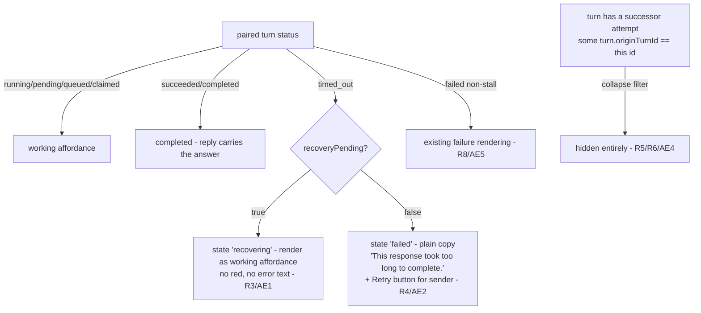

# Silent-First Recovery Surface, GraphQL Recovery State + Web UI - Plan

## Goal Capsule

- **Objective:** While automatic recovery is in progress the thread shows a benign working state; only exhausted recovery shows a plain-language failure with Retry; superseded attempts collapse so the thread shows exactly one final answer; raw internal strings such as "Stall detected: no activity for 5 minutes" never render.
- **Product authority:** THINK-309, unit U6 (PR-E, grouped api+web) of the parent plan `docs/plans/2026-07-16-001-fix-agent-timeout-stall-false-positives-plan.md` (THINK-301; parent R6, R9, R10, Q1, KTD3, KTD4, AE3).
- **Open blockers:** None for planning/implementation. Runtime behavior depends on U3 (THINK-307) retry-state semantics and U4 (THINK-308) retry-row closure being live for a full end-to-end demonstration, but the unit's code is independently mergeable and deployable — see Dependencies.

---

## Product Contract

### Summary

Expose server-derived recovery state on the GraphQL turn type — `recoveryPending: Boolean`, resolved from `retry_queue` — and rework the web thread surface so `timed_out` turns with recovery in flight render as a normal working state, exhausted recovery renders a plain-language failure with a Retry affordance, and origin turns superseded by a successful retry attempt collapse behind the successor. Schema, resolver, and consumer codegen (apps/web, apps/cli, apps/mobile, packages/api) land atomically in one PR.

### Problem Frame

Today the web treats `timed_out` as terminally failed (`FAILED_TURN_STATUSES = {failed, timed_out}` in `apps/web/src/components/workbench/dispatch-indicator.ts:59`) and renders the raw `turn.error` string as the visible banner — so a user watching a stalled-then-recovering turn sees "Agent dispatch failed: Stall detected: no activity for 5 minutes" in red while the system is (once U3 ships) silently retrying, and after a successful retry the thread shows two turns for one prompt. The client has no way to distinguish "recovery in progress" from "recovery exhausted": that distinction lives in `retry_queue` rows, which are server-side only. Parent KTD3 mandates deriving recovery visibility server-side over GraphQL, never inferring it client-side; parent KTD4 mandates plain-language copy keyed off status, never `turn.error`.

Grounding correction to the issue description: `originTurnId` and `retryAttempt` are **already present** on the GraphQL `ThreadTurn` type (`packages/database-pg/graphql/types/heartbeats.graphql:86`) and flow from `thread_turns.origin_turn_id` via the `snakeToCamel` row mapping — the only new schema field this unit adds is `recoveryPending`.

### Key Decisions

- **Recovery visibility is server-derived (parent KTD3).** `recoveryPending` is resolved from `retry_queue` by `origin_turn_id` (indexed: `idx_retry_queue_origin_turn`), true iff a `pending` or `dispatched` row exists for the turn. Parent U4's (THINK-308) retry-row closure guarantees rows go terminal (`succeeded`/`superseded`/`exhausted`) after recovery resolves, so `recoveryPending` cannot stick true forever.
- **Schema + resolver + consumer codegen land in one PR (parent KTD3 checkpoint note).** Schema/resolver drift is a known cold-start outage vector; the web change is unusable without the field, and shipping the field without its consumer invites drift. Codegen regenerates once, atomically, in all four consumers.
- **Plain-language copy is keyed off status, never `turn.error` (parent KTD4).** The raw error string stays in the DB for operators; the UI derives its copy from `status` + `recoveryPending`.
- **Successful recovery shows no trace (parent Q1, resolved).** A recovered turn is indistinguishable from a normal turn — no "recovered" badge, no residual origin-turn stub.
- **Non-stall `failed` turns keep existing behavior.** This unit changes rendering for `timed_out` and for origin-with-successor collapse; the existing `failed` surface is unchanged — the KTD4 copy change applies only to `timed_out`.
- **AppSync subscription schema is untouched.** The notify payload type does not change; only the HTTP-API turn type gains a field.

### Requirements

- R1. The GraphQL `ThreadTurn` type gains `recoveryPending: Boolean`, resolved server-side as: a `retry_queue` row with `origin_turn_id = turn.id` exists in status `pending` or `dispatched`. Rows in `succeeded`/`superseded`/`exhausted` do not count. _(Parent KTD3.)_
- R2. Attempt linkage (`originTurnId`) is available to clients on every turn — already exposed on the type; this unit verifies it is populated for retry-attempt turns and consumes it in the web thread. _(Parent R6 linkage half.)_
- R3. Web: a `timed_out` turn with `recoveryPending = true` renders as the normal benign working affordance (indicator state `recovering`) — no red styling, no failure banner, no raw error text anywhere. _(Parent R9, AE3.)_
- R4. Web: a `timed_out` turn with `recoveryPending = false` renders a failure state whose copy is plain language keyed off status — final wording resolved in Q1 below — with the Retry button visible to the sender. The raw `turn.error` string (e.g. "Stall detected…") never appears in the rendered output. _(Parent R10, KTD4.)_
- R5. Web: an origin turn that has a successor attempt (some turn whose `originTurnId` equals the origin's id) renders collapsed/hidden in favor of the successor, so the thread shows exactly one visible final answer per prompt. _(Parent R6.)_
- R6. A turn that recovered successfully shows no trace of the recovery — the thread is visually indistinguishable from one where the turn succeeded first try. _(Parent Q1.)_
- R7. Codegen is regenerated in `apps/web`, `apps/cli`, `apps/mobile`, and `packages/api`; schema, resolver, and web consumer merge in a single PR. The AppSync subscription schema (`terraform/schema.graphql`) is unchanged.
- R8. Non-stall `failed` turns keep their existing rendering behavior, including their existing copy source; only `timed_out` turns stop feeding `turn.error` into the rendered copy (KTD4). `cancelled` remains excluded from failure/retry treatment.

### Key Flows

- F1. Stall verdict with recovery in flight
  - **Trigger:** A user's turn is marked `timed_out` by the stall monitor while a retry row is `pending` or `dispatched`.
  - **Steps:** The turn query/subscription delivers `status = timed_out`, `recoveryPending = true`; the dispatch indicator derives state `recovering`; the thread keeps showing the normal working affordance.
  - **Outcome:** The user sees an uninterrupted working state — no red, no internals. **Covers R1, R3.**
- F2. Recovery exhausted, manual retry
  - **Trigger:** The retry ceiling is hit; the retry row goes `exhausted`, so `recoveryPending` flips false while status stays `timed_out`.
  - **Steps:** The indicator derives the failure state; the surface shows the plain-language failure copy with the Retry button; clicking Retry dispatches a fresh turn (mutation guard accepting `timed_out` is U5/THINK-308).
  - **Outcome:** The user understands the turn failed, in plain words, and can retry by hand. **Covers R1, R4.**
- F3. Silent recovery completes
  - **Trigger:** A retry attempt turn (carrying `originTurnId`) finalizes `succeeded`; U4 closes the origin's retry row as `succeeded`.
  - **Steps:** The thread renders the successor turn's answer; the origin `timed_out` turn collapses behind it; no recovery indicator or badge remains.
  - **Outcome:** Exactly one final answer, paired to the user's message, with no trace of the recovery. **Covers R2, R5, R6.**

### Acceptance Examples

- AE1. **Covers R1, R3.** Given a turn with `status = timed_out` and a `pending` retry row, when the web derives the dispatch indicator state, then the state is `recovering` (not `failed`) and no destructive/red styling or `turn.error` text renders. _(Parent AE3, first half.)_
- AE2. **Covers R1, R4.** Given a turn with `status = timed_out` whose retry rows are all `exhausted`, when the thread renders, then the visible copy is plain language (the string "Stall detected" appears nowhere in the DOM) and the Retry button is present for the sender. _(Parent AE3, second half.)_
- AE3. **Covers R1.** Given the resolver receives a turn with only `superseded`/`exhausted` retry rows, when `recoveryPending` resolves, then it is `false`; with a `pending` or `dispatched` row it is `true`.
- AE4. **Covers R5, R6.** Given a thread containing an origin turn (`timed_out`) and its successor attempt (`succeeded`, `originTurnId` = origin id), when the thread renders, then exactly one answer is visible (the successor's) and the origin is collapsed with no recovery badge.
- AE5. **Covers R8.** Given a `failed` (non-stall) turn, when the thread renders, then its existing failure behavior is unchanged.
- AE6. **Covers R7.** Given the merged PR, the generated GraphQL artifacts in all four consumers include `recoveryPending`, and `terraform/schema.graphql` shows no diff.
- AE7. **Covers R2.** Given a turn row with `origin_turn_id` and `retry_attempt` set, when it is fetched through `threadTurns`, then `originTurnId` and `retryAttempt` are non-null in the GraphQL result.

### Scope Boundaries

- **Out of scope:** The retry dispatcher itself, its Terraform wiring, and `superseded` writes — U3 (THINK-307).
- **Out of scope:** Finalize reconciliation, retry-row closure (`succeeded` writer), and the `retryAgentDispatch` mutation guard accepting `timed_out` — U4+U5 (THINK-308). This unit renders the Retry affordance for `timed_out`; the server-side guard that makes it work is U5.
- **Out of scope:** Mobile UI changes — `apps/mobile` receives codegen only; rendering parity is a follow-up if wanted.
- **Out of scope:** A general turn-progress UI (elapsed time, live step display) beyond the benign working/recovering state (parent deferral).
- **Out of scope:** AppSync subscription schema or notify payload changes.
- **Deferred:** Distinct visual treatment for `recovering` vs plain `working` (subtle "still working…" nuance). v1 renders the same benign working affordance for both.

### Dependencies / Assumptions

- **Deploy ordering (parent):** PR-E (this unit) must be live on a stage **before** `retry_dispatcher_enabled` (U3/THINK-307) first goes true there — otherwise a genuine stall shows today's raw red banner while a silent retry produces a second answer. Merge order of the PRs is free; the constraint is on the dispatcher's first enable.
- **`recoveryPending` cannot stick without parent U4 (THINK-308).** Until THINK-308's retry-row closure is live, a `dispatched` row could dangle and hold `recoveryPending` true indefinitely. Acceptable in the interim only because the dispatcher (U3) is not yet enabled anywhere, so no `dispatched` rows are being created; stale historical `pending` rows are superseded by U3's backlog guard.
- `thread_turns.origin_turn_id` and `retry_attempt` exist (`packages/database-pg/src/schema/scheduled-jobs.ts:157-158`) and are populated by the wakeup-processor retry branch (`packages/api/src/handlers/wakeup-processor.ts:1394-1429`). No DB migration is needed for this unit.
- `retry_queue.origin_turn_id` is indexed (`idx_retry_queue_origin_turn`), so the `recoveryPending` join is cheap.
- Turn rows reach GraphQL via `snakeToCamel` mapping in `packages/api/src/graphql/resolvers/threads/types.ts`; `recoveryPending` is the only field needing an explicit derived resolver.

### Outstanding Questions

All three deferred questions are resolved by planning (LFG, decisions recorded):

- Q1 — **Resolved: failure copy is "This response took too long to complete."** This deviates from the parent's recommended wording deliberately, twice over. First, "It was automatically retried without success" would render for _every_ `timed_out` turn without pending recovery — including stalls on stages where the retry dispatcher (THINK-307) is disabled and zero automatic retries ever ran — claiming a retry that never happened. Second, "you can retry now" would render to every thread participant while the Retry button is sender-only, promising non-senders an action they don't have; the sender-only Retry button carries the affordance instead. The chosen string is plain language, keyed off status only (KTD4), and honest for all viewers in both the exhausted-recovery and never-retried cases. R4's wording latitude ("for example") covers this.
- Q2 — **Resolved: DataLoader + `ThreadTurn` type resolver.** A `threadTurnRecoveryPending` DataLoader batches one `retry_queue` query per request (`origin_turn_id IN (…) AND status IN ('pending','dispatched')`, using `idx_retry_queue_origin_turn`), registered as a `ThreadTurn: { recoveryPending }` type resolver in `typeResolvers`. Chosen over a join in `threadTurns_` because three surfaces return `ThreadTurn` (`threadTurns`, `threadTurn`, `cancelThreadTurn`) and a type resolver covers all of them uniformly with no N+1; the loader pattern mirrors `threadPendingUserQuestion` (`packages/api/src/graphql/resolvers/threads/loaders.ts`).
- Q3 — **Resolved: fully hidden, keyed on `originTurnId`.** A pure helper filters out any turn whose id appears as another turn's `originTurnId` (i.e., a successor attempt exists) before turn→message pairing and turn-surface rendering in the workbench thread. Keyed on explicit linkage rather than `triggeringMessageId` pairing (the successor's `triggering_message_id` stamp depends on THINK-307's dispatch payload carrying `messageId` — pairing luck this unit must not rely on). Operator surfaces (settings activity/execution trace) intentionally keep the unfiltered turn list for debugging.

### Sources / Research

- Parent plan (authoritative unit spec, R6/R9/R10/Q1, KTD3/KTD4, deploy ordering, Verification Contract V3/V4): `docs/plans/2026-07-16-001-fix-agent-timeout-stall-false-positives-plan.md` — U6 section.
- GraphQL turn type (already has `originTurnId`, `retryAttempt`; gains `recoveryPending`): `packages/database-pg/graphql/types/heartbeats.graphql:53-88`.
- Web failure surface today: `apps/web/src/components/workbench/dispatch-indicator.ts:59` (`FAILED_TURN_STATUSES` includes `timed_out`), `apps/web/src/components/workbench/TaskThreadView.tsx:2180-2201` (renders raw failure reason in red), `apps/web/src/components/workbench/turnHeader.ts:64-65` ("Timed out after …" label).
- Turn linkage columns: `packages/database-pg/src/schema/scheduled-jobs.ts:157-158` (`retry_attempt`, `origin_turn_id` on `thread_turns`); populated at `packages/api/src/handlers/wakeup-processor.ts:1429`.
- Retry queue schema + origin index: `packages/database-pg/src/schema/retry-queue.ts:36,50`.
- Resolver mapping layer: `packages/api/src/graphql/resolvers/threads/types.ts` (`snakeToCamel` turn mapping).
- Sibling unit requirements (format + cross-unit boundaries): `docs/plans/2026-07-16-002-fix-origin-aware-retry-dispatcher-plan.md` (THINK-307), `docs/plans/2026-07-16-002-fix-stall-clock-midturn-activity-bump-plan.md` (THINK-305), `docs/plans/2026-07-16-002-fix-stall-threshold-env-knob-schedule-enable-flag-plan.md` (THINK-306).

---

## Planning Contract

**Product Contract preservation:** substantively unchanged. R1–R8, F1–F3, AE1–AE6 carry the meaning merged in PR #3833; doc review applied clarifying rewrites to R4 (stale example string replaced with a pointer to the Q1 resolution) and R8 (the `failed` copy-source caveat was contradictory — `failed` rendering is fully unchanged; KTD4's copy change applies only to `timed_out`), plus AE7 (new, closes R2's missing acceptance coverage). The Q1 failure-copy string was planning's to set per R4's wording latitude; rationale under Outstanding Questions.

### Key Technical Decisions

- **KTD-A. `recoveryPending` resolves via a DataLoader-backed type resolver, not per-query joins.** New `ThreadTurn` entry in `typeResolvers` (`packages/api/src/graphql/resolvers/index.ts`) with a loader that batches `SELECT DISTINCT origin_turn_id FROM retry_queue WHERE origin_turn_id IN (…) AND status IN ('pending','dispatched')`. One query per request regardless of turn count (R1, resolves Q2); every `ThreadTurn`-returning surface (`threadTurns`, `threadTurn`, `cancelThreadTurn`) gets the field for free.
- **KTD-B. Fix the `threadTurns_` select-list gap as part of R2.** The list query (`packages/api/src/graphql/resolvers/triggers/threadTurns.query.ts`) uses an explicit column list that omits `retry_attempt`, `origin_turn_id`, and `last_activity_at` — so `originTurnId` resolves null on the exact path the web uses, despite existing on the schema and in the DB. This unit adds `retry_attempt` and `origin_turn_id` to the select (and `last_activity_at`, which the type also declares). Without this, R5's collapse can never fire client-side.
- **KTD-C. Web derivation stays in pure, unit-testable modules.** The `recovering` state is added to `deriveDispatchIndicatorState` (`dispatch-indicator.ts`), the KTD4 plain-copy mapping and the successor-collapse filter are pure functions with their own tests — following the existing pattern of keeping logic out of the 5,000-line `TaskThreadView.tsx` render tree.
- **KTD-D. Failure copy is a status-keyed constant; `turn.error` never reaches the DOM for `timed_out`.** The `failed` (non-stall) path keeps its existing copy source per R8, except that `timed_out` turns stop feeding `turn.error` into `failureReason` (KTD4). The raw string stays queryable for operators in settings surfaces.
- **KTD-E. Exhaustion visibility is eventually consistent, by design.** `recoveryPending` flips false (exhausted) without a turn-status change, so no subscription event fires for it; the web sees the flip on the next turn refetch (triggered by any thread activity or reload). Acceptable for v1: exhaustion follows the final failed attempt's turn activity, which itself triggers refetches. A dedicated notify on retry-row closure belongs to THINK-307/308 if drills show a visible gap (recorded as a risk, not scope).

### High-Level Technical Design

State derivation for a user message's paired turn (web, after this unit):

Data flow: `retry_queue` rows → `threadTurnRecoveryPending` loader → `ThreadTurn.recoveryPending` type resolver → `SettingsActivityThreadTurnsQuery` (workbench turn fetch, urql, refetched on subscription events) → `toThreadTurnRows` → `TaskThreadView` turns prop → collapse filter → pairing (`mapTurnsToUserMessages`) → `deriveDispatchIndicatorState` / `formatTurnHeader`.

---

## Implementation Units

All four units land in **one atomic PR** (parent KTD3: schema/resolver drift is a cold-start outage vector; the web change is unusable without the field; codegen regenerates once). Unit boundaries below are review/commit structure inside that PR, not separate PRs. This issue (THINK-309) is itself a child unit (U6/PR-E) of THINK-301 — **no further Linear child issues are created**; the split below is plan-internal.

### U1. GraphQL schema field + resolver + loader (packages/database-pg, packages/api)

- **Goal:** `ThreadTurn.recoveryPending` exists in schema and resolves correctly on every ThreadTurn surface; `originTurnId`/`retryAttempt` actually populate on the list query.
- **Requirements:** R1, R2, R7 (schema half). AE3, AE6.
- **Dependencies:** none (first unit).
- **Files:** `packages/database-pg/graphql/types/heartbeats.graphql` (add `recoveryPending: Boolean` to `ThreadTurn`); `packages/api/src/graphql/resolvers/triggers/threadTurns.query.ts` (add `retry_attempt`, `origin_turn_id`, `last_activity_at` to the select list); new loader in `packages/api/src/graphql/resolvers/triggers/loaders.ts` (or extend `threads/loaders.ts`) wired into `packages/api/src/graphql/dataloaders.ts`; `packages/api/src/graphql/resolvers/index.ts` (register `ThreadTurn` type resolver); resolver test alongside the loader; `pnpm --filter @thinkwork/api codegen`.
- **Approach:** Per KTD-A. Loader keyed by turn id; batch query filters `status IN ('pending','dispatched')`; missing keys resolve `false` (never null — schema field is `Boolean`, resolver always returns a boolean). Tenant scoping: filter `retry_queue.tenant_id` against the parent turn's `tenant_id` following the belt-and-suspenders pattern in `threads/types.ts`.
- **Patterns to follow:** `threadPendingUserQuestion` loader (`packages/api/src/graphql/resolvers/threads/loaders.ts`); batched cost lookup in `threadTurns.query.ts`.
- **Test scenarios:**
  - Covers AE3. Turn with a `pending` retry row → `recoveryPending: true`; with a `dispatched` row → `true`.
  - Covers AE3. Turn with only `succeeded`/`superseded`/`exhausted` rows → `false`; turn with no rows at all → `false`.
  - Mixed: one `exhausted` + one `pending` row for the same origin → `true`.
  - Batching: resolving N turns issues one retry_queue query (loader batch assertion or query-count spy).
  - List query: a turn row with `origin_turn_id`/`retry_attempt` set returns non-null `originTurnId`/`retryAttempt` through `threadTurns` (regression for KTD-B).
- **Verification:** `pnpm --filter @thinkwork/api test` green; `pnpm schema:build` produces **zero diff** in `terraform/schema.graphql` (AE6).

### U2. Web pure derivation: `recovering` state, plain copy, collapse filter

- **Goal:** All new client logic exists as pure, tested functions before any render wiring.
- **Requirements:** R3, R4, R5, R8 (derivation halves). AE1, AE2, AE4, AE5.
- **Dependencies:** U1 (codegen types for `recoveryPending`).
- **Files:** `apps/web/src/components/workbench/dispatch-indicator.ts` + `dispatch-indicator.test.ts`; `apps/web/src/components/workbench/turnHeader.ts` + `turnHeader.test.ts`; new `apps/web/src/components/workbench/turn-collapse.ts` + test (name at implementer's discretion).
- **Approach:** Extend `DispatchIndicatorTurnLike` with `recoveryPending?: boolean | null`. In `deriveDispatchIndicatorState`: `timed_out` + `recoveryPending` → new state `"recovering"` (rendered like running); `timed_out` without → `"failed"` with `failureReason` set to the Q1 constant, **not** `turn.error` (KTD-D); `failed` keeps the existing reason chain (R8). In `turnHeader.ts`: header derivation accepts the recovering signal so a recovering turn shows "Working…" instead of "Timed out after …" (exhausted keeps the plain "Timed out after …" label). The recovering header behaves exactly like the running affordance, including the live elapsed timer continuing from the origin turn's `startedAt` (no freeze — a frozen timer reads as a hung UI). Collapse helper per Q3: `collapseSupersededTurns(turns)` removes turns whose id is another turn's `originTurnId`.
- **Test scenarios:**
  - Covers AE1. `timed_out` + `recoveryPending: true` → state `recovering`, `failureReason` null.
  - Covers AE2. `timed_out` + `recoveryPending: false`/undefined → state `failed`, `failureReason` equals the plain-copy constant; the string "Stall detected" from `turn.error` appears nowhere in the derivation output.
  - Covers AE5. `failed` (non-stall) + any `recoveryPending` → existing behavior unchanged (state `failed`, reason from `turn.error`/dispatch stamp).
  - `cancelled` remains excluded from failure treatment (R8).
  - turnHeader: recovering → "Working…" label; `timed_out` not recovering → "Timed out after …" (no raw internals).
  - Covers AE4. Collapse: `[origin(timed_out), successor(succeeded, originTurnId=origin.id)]` → only successor survives; chains (successor itself superseded) collapse transitively to the last attempt; a turn with `originTurnId` pointing at a turn _not in the list_ is kept; empty list and no-successor lists pass through unchanged.
- **Verification:** `pnpm --filter @thinkwork/web test` green for the three modules.

### U3. Web wiring: query fields, row mapping, render states

- **Goal:** The deployed workbench thread actually renders recovering/exhausted/collapsed states from live data.
- **Requirements:** R3, R4, R5, R6 (render halves). F1, F2, F3.
- **Dependencies:** U1, U2.
- **Files:** `apps/web/src/lib/graphql-queries.ts` (`SettingsActivityThreadTurnsQuery` gains `recoveryPending`); `apps/web/src/components/workbench/SpacesThreadDetailRoute.tsx` (**both mapping hops**: `ThreadTurnRow` type + `toThreadTurnRows`, AND `toTaskThreadTurnsFromRows` into `TaskThreadTurn` — the fields are optional, so a missed second hop passes typecheck and only surfaces at browser time as "recovering never renders"); `apps/web/src/components/workbench/TaskThreadView.tsx` (`TaskThreadTurn` type gains the fields; apply collapse filter before pairing/rendering; `DispatchIndicator` renders `recovering` as the working affordance and the exhausted state with plain copy + Retry; `ThreadTurnActivity`/header path honors recovering) + existing component tests extended.
- **Approach:** Apply `collapseSupersededTurns` at the point where the turns array feeds the workbench thread (TaskThreadView consumption), leaving settings/operator surfaces unfiltered (Q3). The `recovering` indicator state renders the same working affordance as `running` (deferred: distinct visual treatment). The exhausted state reuses the existing failure row + Retry button (`retry-dispatch-<messageId>` testid) with the Q1 copy — for `timed_out` the row renders `failureReason` **verbatim**: the existing "Agent dispatch failed:" prefix is suppressed for status-keyed copy (otherwise the DOM reads "Agent dispatch failed: This response took too long…", failing VC2), and no `text-destructive` raw-error line renders. Whether the exhausted row keeps the existing red failure styling is the implementer's call (a genuine failure may stay red; only _recovering_ forbids red per R3).
- **Test scenarios:**
  - Covers AE1/F1. Component render: `timed_out` turn + `recoveryPending` → working affordance present, no `text-destructive` failure row, DOM contains no `turn.error` text.
  - Covers AE2/F2. `timed_out` + not pending → plain copy visible **verbatim** (exact-string assertion, no "Agent dispatch failed:" prefix), "Stall detected" absent from DOM, Retry button rendered for the sender and absent for a non-sender.
  - Covers AE4/F3. Thread fixture with origin + successor → exactly one turn surface / one answer visible; no recovery badge.
  - `recoveryPending` and `originTurnId` survive both mapping hops: GraphQL row → `toThreadTurnRows` → `toTaskThreadTurnsFromRows` (null-safe for legacy rows).
- **Verification:** `pnpm --filter @thinkwork/web test` + `typecheck` green; manual dev-browser pass per Verification Contract below.

### U4. Codegen sweep + drift guard (apps/cli, apps/mobile)

- **Goal:** All four consumers' generated artifacts include `recoveryPending`; AppSync schema untouched (R7, AE6).
- **Requirements:** R7. AE6.
- **Dependencies:** U1.
- **Files:** generated codegen outputs in `apps/web`, `apps/cli`, `apps/mobile`, `packages/api` (via each package's `codegen` script); no hand edits.
- **Approach:** Run `pnpm --filter @thinkwork/<name> codegen` in all four; confirm `pnpm schema:build` leaves `terraform/schema.graphql` diff-free. Mobile receives codegen only — no rendering changes (scope boundary).
- **Test expectation:** none — generated artifacts; AE6 is checked by inspecting the diff (codegen outputs include the field; `terraform/schema.graphql` unchanged).
- **Verification:** `pnpm -r typecheck` green across the four consumers; PR diff shows no `terraform/schema.graphql` change.

---

## Verification Contract

Browser verification runs against **deployed dev** after the PR merges and the merge pipeline deploys (parent Verification Contract V3/V4 own the full end-to-end drills once THINK-307/308 are live; the checks below are what THIS unit must prove, executable even while the retry dispatcher is disabled).

- **VC1 — Recovering state (F1/AE1, pre-dispatcher variant).** In dev: start a turn, then seed recovery state by hand (`UPDATE thread_turns SET status='timed_out' WHERE id=…;` + `INSERT INTO retry_queue (tenant_id, agent_id, thread_id, origin_turn_id, status, scheduled_at) VALUES (…, 'pending', NOW());`). Browser: the thread shows the normal working affordance — no red, no "Stall detected", no "Timed out" banner. Evidence: screenshot + DOM check.
- **VC2 — Exhausted failure + Retry (F2/AE2).** Flip the seeded row to `exhausted`. Browser (after refetch/reload): plain-language copy exactly "This response took too long to complete." (no "Agent dispatch failed:" prefix); "Stall detected" appears nowhere in the DOM; Retry button visible to the sender. Clicking Retry may be rejected server-side until THINK-308's mutation guard ships — the button's presence and dispatch attempt are this unit's proof; the accepted-retry flow is V4 (parent).
- **VC3 — Collapse (F3/AE4).** Seed a successor turn (`origin_turn_id` = origin id, `status='succeeded'`, same `triggering_message_id`). Browser: exactly one visible answer/turn surface; the origin `timed_out` turn is gone; no recovery badge. Evidence: screenshot.
- **VC4 — No-regression (AE5) + schema drift (AE6).** A `failed` (non-stall) turn renders exactly as today; `terraform/schema.graphql` has no diff in the merged PR; generated artifacts in all four consumers contain `recoveryPending`.
- **Full drills:** parent V3 (genuine stall, silent recovery) and V4 (exhaustion + manual retry end-to-end) run under THINK-301 U7 rollout once THINK-307/308 are deployed — not gates for this PR.

---

## Risks

- **Dangling `dispatched` rows before THINK-308 is live** → `recoveryPending` could stick true. Mitigated: dispatcher (THINK-307) is not enabled anywhere yet, so no `dispatched` rows exist; deploy-ordering constraint stands (this unit live before `retry_dispatcher_enabled` flips anywhere).
- **Exhaustion flip is not push-notified (KTD-E).** A user staring at a recovering thread with zero other activity may see the exhausted copy only after the next refetch trigger. If drills show a real gap, THINK-307/308 add a notify on retry-row closure — follow-up, not this PR.
- **THINK-307's dispatch payload must carry `messageId`** for successor turns to pair to the user message (wakeup dispatch payload parity — two payload builders). Collapse is `originTurnId`-keyed so R5/R6 hold regardless, but the successor's answer pairing depends on it. Recorded as a cross-unit interface note for THINK-307.
- **Settings surfaces intentionally unfiltered** — operators keep seeing origin + successor turns and raw `turn.error`. If a future request wants parity there, it is new scope.
- **Collapse is turn-level only.** Any assistant messages the origin attempt streamed _before_ stalling stay visible (the client message model carries no turn linkage), so a stall after partial output could show partial text alongside the successor's answer. Unverified how often stalled turns emit mid-turn messages; if parent V3 drills show duplicate partials, message-level collapse needs new plumbing (message→turn linkage) as follow-up scope.
- **Mobile still renders its existing `timed_out` treatment** (codegen only, per scope boundary) — "raw internals never render" holds on web only until a mobile parity follow-up.

---

## Definition of Done

- `recoveryPending` in the GraphQL schema, resolved per R1, loader-batched (no N+1), tested (AE3).
- `originTurnId`/`retryAttempt` actually populate through `threadTurns` (KTD-B regression test).
- Web renders: recovering → benign working state (AE1); exhausted → plain copy + Retry (AE2); superseded origins collapsed (AE4); non-stall `failed` unchanged (AE5). "Stall detected" never in the DOM.
- Codegen regenerated in all four consumers; `terraform/schema.graphql` untouched (AE6).
- One atomic PR merged to main with lint/typecheck/test/format green; VC1–VC4 verified in a real browser against deployed dev and evidenced in the Linear issue.
