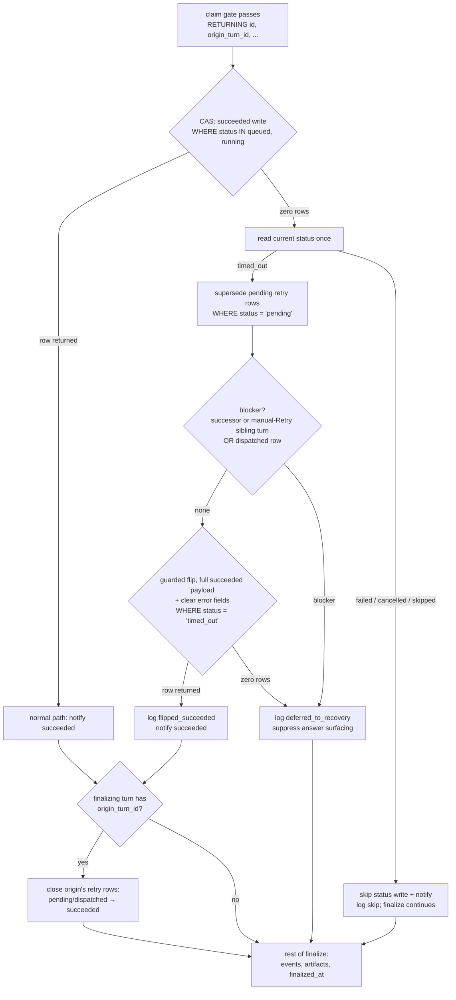

# Guarded Finalize Reconciliation + timed_out Manual Retry - Plan

## Goal Capsule

- **Objective:** A late finalize never silently flips a `timed_out` turn to `succeeded` — the transition is an explicit, logged reconciliation that also closes that turn's queued retries and defers to an existing recovery attempt — and the manual Retry affordance accepts `timed_out` turns, matching what the UI already renders as failed.
- **Product authority:** THINK-308, units U4+U5 (PR-D) of the parent plan `docs/plans/2026-07-16-001-fix-agent-timeout-stall-false-positives-plan.md` (THINK-301, Eric Odom).
- **Open blockers:** None. Both units are self-contained in `packages/api`; no deploy-ordering constraint applies to this PR itself (the ordering constraint binds when the retry-dispatcher schedule first enables — THINK-307).

---

## Product Contract

### Summary

Give the chat-finalize `succeeded` write a status predicate so terminal verdicts are never blind-overwritten; reconcile `timed_out` explicitly — flip to `succeeded` and supersede queued retries when no recovery attempt exists, or leave the verdict standing when one does; close the origin's retry row as `succeeded` when a retry attempt itself finalizes successfully; and widen the manual-Retry server guard to accept `timed_out` linked turns alongside `failed`.

### Problem Frame

The stall monitor can mark a turn `timed_out` while its finalize callback is still in flight. Today the finalize path's succeeded write (`packages/api/src/lib/chat-finalize/process-finalize.ts:630-644`) matches on turn id alone, so it silently overwrites the verdict — the database self-heals beneath an error the user already saw and may have acted on, and the pending retry row enqueued with the verdict lives on to dispatch a duplicate turn. In the other direction, nothing ever writes `retry_queue.status = 'succeeded'` (parent discovery D3), so once automatic retry exists, a recovered turn's `dispatched` row would dangle forever and the recovery surface (THINK-309) would show "recovering" indefinitely. Separately, the manual-Retry mutation's async guard (`retryAgentDispatch.mutation.ts:203-215`) matches only `status = 'failed'`, while the web already treats `timed_out` as failed — so the one affordance offered on a timeout error is rejected server-side with `BAD_USER_INPUT`.

### Key Decisions

- **Late finalize wins unless a recovery attempt exists (parent Q3, adopted).** Under the silent-first recovery surface the user sees a benign working state during a stall verdict, so flipping `timed_out → succeeded` on late finalize is consistent with what was shown. The flip is explicit — logged, retry rows superseded in the same operation, UI notified — never a bare status write.
- **A `dispatched` retry row blocks the flip, same as an existing successor turn; a `pending` row does not — it is superseded by the flip.** A `dispatched` row means a retry wakeup is enqueued but its attempt turn may not exist yet; flipping the origin to `succeeded` in that window invites two answers once the attempt materializes. `pending` rows are safe because the reconciliation supersedes them **before** checking for blockers: the dispatcher's claim (`pending → dispatched`) and the supersede (`pending → superseded`) are status-guarded updates on the same row, so exactly one wins — if the dispatcher wins, the blocker check sees the `dispatched` row and defers; if the supersede wins, the dispatcher never dispatches (KTD2).
- **Guarding is CAS-style, not lock-based.** The succeeded write carries a status predicate (update … where status = expected), following the async-retry idempotency pattern; every interleaving of the 1-minute cron and finalize resolves explicitly.
- **U4 and U5 ship as one PR.** Both are status-integrity guards in `packages/api`; U5 is a one-line production change. Separate PRs add review overhead without isolation value (parent PR-D grouping).

### Requirements

**Finalize status guard + reconciliation (U4)**

- R1. The finalize `succeeded` status write applies only when the turn's current status is non-terminal (`running`/`queued`); a turn already in a terminal state is never silently overwritten. _(Parent R7.)_
- R2. When the turn is `timed_out` and no recovery attempt is in flight — no successor turn (per R3's definition) and no `dispatched` retry row for it — finalize performs an explicit reconciliation: the turn's `pending` retry rows are marked `superseded` first, then status is set to `succeeded`, a structured reconciliation log line is emitted, and the turn-update notification fires. _(Parent R5, R7, AE4.)_
- R3. When the turn is `timed_out` and a recovery attempt is in flight — a successor turn (`origin_turn_id` = this turn, or a newer turn sharing its `triggering_message_id` that is not `failed`/`cancelled` — the manual-Retry case) or a `dispatched` retry row — the origin's status stays `timed_out`, the status write is skipped, and the origin's answer surfacing is suppressed (no assistant-message insert, Slack reply, push, or new-message notify), while events, trace evidence, and `finalized_at` still complete. The successor carries the thread's one answer. _(Parent R6.)_
- R4. The `finalized_at` idempotency claim gate is untouched; a duplicate finalize for an already-finalized turn still no-ops before any status logic runs.

**Retry-row closure (U4)**

- R5. When the finalizing turn is itself a retry attempt (its `origin_turn_id` is set) and finalize succeeds, the origin turn's `pending`/`dispatched` retry rows are marked `succeeded` — this is the write that ends the "recovering" state after a genuine recovery. _(Parent D3 lifecycle; first-ever writer of `succeeded`.)_
- R6. A retry attempt whose finalize does not succeed leaves the origin's retry rows untouched, so recovery continues or exhausts on its own schedule.

**Manual Retry guard (U5)**

- R7. The manual-Retry mutation's linked-turn guard matches `status IN ('failed', 'timed_out')`; a `timed_out` linked turn no longer earns `BAD_USER_INPUT`. Sender guard and sync-stamp path are unchanged. _(Parent R8.)_

### Key Flows

- F1. Late finalize, no recovery in flight
  - **Trigger:** A turn flagged `timed_out` by the stall monitor subsequently finalizes; no successor turn or in-flight retry row exists.
  - **Steps:** Claim gate passes; the status guard sees `timed_out`; reconciliation flips the turn to `succeeded`, supersedes its pending retry rows, logs, and notifies.
  - **Outcome:** One answer in the thread, DB ends `succeeded`, no retry ever dispatches. **Covers R1, R2.**
- F2. Late finalize racing an in-flight recovery
  - **Trigger:** The origin's finalize arrives after its retry row went `dispatched` (or a successor attempt turn already exists).
  - **Steps:** The status guard sees `timed_out` with a recovery attempt in flight; the origin keeps its verdict; finalize suppresses the origin's answer surfacing (message insert and its notification fan-out) and completes events, trace evidence, and `finalized_at` without a status write.
  - **Outcome:** The successor attempt carries the thread's single answer; no double answer. **Covers R3, R4.**
- F3. Retry attempt recovers the turn
  - **Trigger:** A retry attempt turn (carrying `origin_turn_id`) finalizes successfully.
  - **Steps:** Finalize marks the origin's `dispatched` retry row `succeeded` in addition to its normal completion work.
  - **Outcome:** The retry-row lifecycle closes; the recovery surface can stop showing "recovering". **Covers R5.**
- F4. Manual Retry on a timeout
  - **Trigger:** A user clicks Retry on a message whose linked turn is `timed_out`.
  - **Steps:** `hasFailedLinkedTurn` matches the `timed_out` turn; the mutation proceeds and dispatches a new turn.
  - **Outcome:** Retry works wherever the UI offers it. **Covers R7.**

### Acceptance Examples

- AE1. **Covers R1, R2.** Given a turn marked `timed_out` with one `pending` retry row and no successor, when its finalize arrives, then the turn ends `succeeded`, the retry row ends `superseded`, a reconciliation line is logged, and the turn-update notify fires. _(Parent AE4.)_
- AE2. **Covers R3.** Given a `timed_out` turn with a successor attempt turn (or a `dispatched` retry row), when its finalize arrives, then its status stays `timed_out`, `finalized_at` is stamped, and the successor's retry rows are not superseded.
- AE3. **Covers R1.** Given a turn still `running`, when finalize arrives, then the plain `succeeded` write proceeds exactly as today.
- AE4. **Covers R4.** Given a turn already finalized (double-finalize race), when a second finalize arrives, then the claim gate no-ops it with no second status write.
- AE5. **Covers R5, R6.** Given a retry attempt turn with `origin_turn_id` O, when it finalizes successfully, then O's `dispatched` retry row is marked `succeeded`; when it instead fails, O's retry rows are untouched.
- AE6. **Covers R7.** Given a message whose only linked turn is `timed_out`, when `retryAgentDispatch` is called, then it proceeds without `BAD_USER_INPUT`; with no failed or timed-out linked turn at all it is still rejected.

### Scope Boundaries

- **Out of scope:** Wiring or guarding the retry dispatcher and the wakeup-processor retry branch — U3 (THINK-307). This unit shares only the `superseded` status semantics; the status column is plain text, so neither unit needs the other to land first and no migration is required.
- **Out of scope:** Recovery-state GraphQL fields and the web recovering/failure surface — U6 (THINK-309). This unit's R5 closure is what makes that surface's `recoveryPending` flag terminate.
- **Out of scope:** Stall-monitor detection, threshold knob, schedule flags — U1/U2 (THINK-305/306).
- **Out of scope:** Any change to the `finalized_at` claim-gate semantics or to the failure-path finalize writes.

### Dependencies / Assumptions

- No deploy-ordering constraint on this PR: parent Deploy ordering requires PR-D live before the retry-dispatcher schedule first enables (THINK-307's gate), not the other way around.
- `thread_turns.origin_turn_id` and `retry_queue.origin_turn_id` both exist with an index on the latter (`idx_retry_queue_origin_turn`); successor lookups need no schema change.
- The retry-attempt turn is created with `origin_turn_id` by the wakeup-processor retry branch (`packages/api/src/handlers/wakeup-processor.ts:1428-1429`), so R5's "is this a retry attempt" test reads the finalizing turn's own row.
- The `superseded` and `succeeded` retry statuses follow the parent D3 lifecycle: `pending → dispatched → succeeded` (attempt recovered), `pending → superseded` (origin recovered), `pending|dispatched → exhausted` (ceiling).

### Outstanding Questions

None blocking. Q1–Q3 (successor-status nuance, status-read plumbing, reconciliation log-line shape) were resolved during planning — see Planning Contract → Resolved Questions.

### Sources / Research

- Parent plan (authoritative unit spec U4/U5, Q3 resolution, D3 lifecycle, KTD ordering): `docs/plans/2026-07-16-001-fix-agent-timeout-stall-false-positives-plan.md`, enriched on PR [#3826](https://github.com/thinkwork-ai/thinkwork/pull/3826).
- Unguarded succeeded write (id-only `where`): `packages/api/src/lib/chat-finalize/process-finalize.ts:630-644`; claim gate at `:156-176`.
- Manual-Retry guard matching only `failed`: `packages/api/src/graphql/resolvers/messages/retryAgentDispatch.mutation.ts:203-215`; `BAD_USER_INPUT` rejection at `:139-146`.
- Retry-queue schema, status comment lacking `superseded`, origin index: `packages/database-pg/src/schema/retry-queue.ts`.
- Turn schema with `origin_turn_id`/`retry_attempt`/`finalized_at`: `packages/database-pg/src/schema/scheduled-jobs.ts:102-165`.
- Wakeup retry branch stamping `origin_turn_id` on attempt turns: `packages/api/src/handlers/wakeup-processor.ts:1394-1429`.
- Sibling requirements artifact (shared `superseded` semantics, enable-ordering gate): `docs/plans/2026-07-16-002-fix-origin-aware-retry-dispatcher-plan.md` (THINK-307).
- CAS-guard precedent: async-retry idempotency work (MaximumRetryAttempts=0 + DLQ + CAS pattern).

---

## Planning Contract

**Product Contract preservation:** changed: R2, R3, and the `dispatched`-blocks Key Decision — `pending` retry rows no longer block the `timed_out → succeeded` flip; they are superseded before the blocker check, which closes the two-answer race the blocking rule existed for. This relaxation was explicitly invited by the requirements ("planning may relax only with an argument that closes the race" — argument in KTD2). All other IDs carried verbatim.

### Planning Discoveries (verified 2026-07-16, planning phase)

- The `finalized_at` claim gate is itself an `UPDATE … RETURNING` (`packages/api/src/lib/chat-finalize/process-finalize.ts:156-190`, returning `id`/`runtimeType`/`contextSnapshot`). Extending its `RETURNING` with `origin_turn_id` is a free, race-safe read — the column is immutable after turn creation (stamped at insert by the wakeup retry branch, `packages/api/src/handlers/wakeup-processor.ts:1428-1429`).
- Turn status enum (`packages/database-pg/src/schema/scheduled-jobs.ts:126`): `queued | running | succeeded | failed | cancelled | timed_out | skipped`. R1's non-terminal set is exactly `queued`, `running`.
- The succeeded write and its `notifyThreadTurnUpdate` live in one try/catch (`process-finalize.ts:630-657`) whose catch only logs — the reconciliation branch slots into the same guarded region.
- `retry_queue.status` is plain text with no CHECK constraint; writing `superseded` and `succeeded` needs no migration. `idx_retry_queue_origin_turn` covers every lookup this plan adds.
- `retryAgentDispatch.mutation.ts` already has an injectable `RetryAgentDispatchDeps` seam with `hasFailedLinkedTurn`; the production query lives in `drizzleRetryDeps()`. U3 is a one-predicate change plus tests against the existing seam.
- Existing suites: `process-finalize.test.ts` (hoisted db mock already models `update().set().where().returning()` and a shared `selectRows` queue) and `retryAgentDispatch.mutation.test.ts` (deps-injection style, no db mock).

### Resolved Questions

- **Q1 — any successor blocks the flip, regardless of the successor's status.** A failed successor has already surfaced (or will surface) the manual-Retry failure state (parent F3), and THINK-309 collapses the origin in favor of its successor; flipping the origin afterward would resurrect a second answer path and require status-sensitive logic that reopens race windows. Manual Retry (R7) remains the recovery affordance for that corner.
- **Q2 — hybrid plumbing.** The immutable `origin_turn_id` is read once by extending the claim gate's `RETURNING`. The mutable status is never pre-read: the succeeded write becomes a guarded CAS (`WHERE id = … AND status IN ('queued','running') … RETURNING id`); zero rows returned triggers one fresh single-row status read to pick the branch, and the reconciliation flip is itself another guarded update (`WHERE … status = 'timed_out'`). Every status transition is a CAS; no interleaving can double-write.
- **Q3 — single-line JSON log with a fixed event name.** `console.log(JSON.stringify({ event: "timeout_reconciliation", turn_id, tenant_id, thread_id, outcome, superseded_retry_rows, blocking_successor_turn_id, blocking_retry_row_id }))` where `outcome` is `flipped_succeeded` or `deferred_to_recovery` and the two `blocking_*` fields are null unless `deferred_to_recovery`. A flip that loses the race (guarded flip returns zero rows) logs `deferred_to_recovery` with both `blocking_*` fields null — that null/null signature distinguishes race losses from blocker deferrals in queries. THINK-310's rollout monitoring filters CloudWatch Logs Insights on `event = "timeout_reconciliation"`.

### Key Technical Decisions

- **KTD1 — CAS-guarded succeeded write with a fall-through branch, not a pre-read.** The existing id-only `where` gains the non-terminal status predicate and `RETURNING`. A hit is today's behavior byte-for-byte. A miss re-reads the row once: `timed_out` → reconciliation branch; any other terminal status (`failed`/`cancelled`/`skipped`) → skip the status write and its notify, log a skip, and let the rest of finalize complete. Pre-reading status instead would leave a window between read and write for the 1-minute stall cron to flip the verdict.
- **KTD2 — supersede-before-check ordering closes the two-answer race.** Inside the `timed_out` branch, order is fixed: (1) supersede — `UPDATE retry_queue SET status = 'superseded' WHERE origin_turn_id = <turn> AND status = 'pending'`; (2) blocker check — any successor turn (`thread_turns.origin_turn_id = <turn>`, **or** a turn sharing the origin's `triggering_message_id`, created after it, not `failed`/`cancelled` — manual Retry redispatches through the normal chat path and never stamps `origin_turn_id`, so without the sibling check the flow U3 enables would flip the origin under a live retry and produce two answers) or any `dispatched` retry row; (3) no blocker → guarded flip + notify, blocker → deferred path (R3: no status write, answer surfacing suppressed). The flip reuses the full succeeded `set` payload — `status`, `finished_at`, `runtime_type`, `system_prompt`, `result_json`, `usage_json` — plus `error: null, error_code: null` to clear the stall verdict, guarded by `WHERE id = <turn> AND status = 'timed_out' RETURNING id`; a status-only flip would leave the stall error text on a succeeded turn and lose the response/usage snapshot. Step 1 and the dispatcher's claim (`pending → dispatched`, THINK-307) contend on the same row with disjoint status predicates, so exactly one wins; whichever loses sees the other's write at step 2 or in its own origin-status check. No new `pending` row can appear between steps — the stall monitor only creates rows for `running` turns.
- **KTD3 — retry-row closure keys off the claim's `origin_turn_id`.** When the finalizing turn carries a non-null `origin_turn_id` and its succeeded status write landed (normal CAS hit or reconciliation flip), mark the origin's `pending`/`dispatched` retry rows `succeeded`. First-ever writer of `succeeded` (parent D3); this is what lets THINK-309's `recoveryPending` terminate. No write on any non-success outcome (R6).
- **KTD4 — U5 is a predicate widening only.** `drizzleRetryDeps().hasFailedLinkedTurn` changes `eq(status, 'failed')` to `inArray(status, ['failed', 'timed_out'])`. Deps interface, sender guard, sync-stamp path, and mutation flow untouched.
- **KTD5 — reconciliation logging is stdout JSON, no new infra.** Matches the handler's existing `console.*` style; CloudWatch ingestion is already in place. No metrics library, no new table.

### Assumptions

- THINK-307's dispatcher claims rows with a status-guarded `pending → dispatched` update (its spec: `FOR UPDATE SKIP LOCKED` claiming) before enqueueing the wakeup. KTD2's race closure relies on that claim discipline; if THINK-307 lands a different claim shape, revisit KTD2 before enabling the schedule (the enable-ordering gate lives on THINK-307).
- The dev stall monitor schedule is ENABLED and the retry-dispatcher schedule is DISABLED (parent D2), so verification flows can force `timed_out` verdicts without successor interference.
- The reconciliation flip reuses the existing `notifyThreadTurnUpdate` with `status: "succeeded"`; no new notification type.
- The mobile-Pi finalize caller pins `claim: { status: 'running' }` (`packages/api/src/lib/mobile-turns/lifecycle.ts`), so a timed-out mobile turn's late finalize no-ops at the claim gate and never reaches the reconciliation branch; its retry rows close via the dispatcher lifecycle instead. Accepted scope — this plan changes the shared finalize, not mobile claim semantics.

---

## High-Level Technical Design

Finalize status path after this plan (per-turn, inside the existing claim-gated region):

---

## Implementation Units

All three units land in **one PR** (parent plan PR-D carve): U1 and U2 touch the same function and share test scaffolding; U3 is a one-line production change whose only review context is the same status-integrity story. Separate PRs would add review overhead without isolation value. Dependency order within the PR: U1 → U2 (U2 extends U1's write paths); U3 is independent.

### U1. CAS-guarded succeeded write + timed_out reconciliation

- **Goal:** A late finalize never blind-overwrites a terminal verdict; `timed_out` reconciles explicitly per KTD1/KTD2 with logging and notification.
- **Requirements:** R1, R2, R3, R4 (F1, F2; AE1–AE4)
- **Dependencies:** none
- **Files:** `packages/api/src/lib/chat-finalize/process-finalize.ts`, `packages/api/src/lib/chat-finalize/process-finalize.test.ts`
- **Approach:** Per KTD1/KTD2/KTD5. Add the status predicate + `RETURNING` to the succeeded write; on zero rows, one fresh row read (status + `triggering_message_id`, feeding the sibling blocker check) picks the branch; `timed_out` runs supersede → blocker check → guarded flip carrying the full succeeded `set` payload plus cleared `error`/`error_code`; other terminal statuses skip write and notify. `notifyThreadTurnUpdate` fires only when a status write landed. The deferred path (R3) additionally suppresses the origin's answer surfacing — assistant-message insert, Slack reply, push, new-message notify — while events, trace evidence, and `finalized_at` still run. The claim gate and failure-path writes are untouched.
- **Patterns to follow:** The suite's hoisted db mock (`updateReturning` queue already models `update().set().where().returning()`; extend the `select` mock for the status read and blocker checks). CAS style per the async-retry idempotency precedent.
- **Test scenarios:**
  - Covers AE3. Turn `running` → CAS hit; `set` payload byte-identical to today's; notify fired with `succeeded`.
  - Covers AE1. Turn `timed_out`, one `pending` retry row, no successor → row `superseded`, guarded flip runs, `timeout_reconciliation` logged with `outcome: flipped_succeeded` and `superseded_retry_rows: 1`, notify fired.
  - Covers AE2. Turn `timed_out` with a successor turn → no status write, no notify, no assistant-message insert (and no Slack/push fan-out), log `deferred_to_recovery` with `blocking_successor_turn_id` set; same again with a `dispatched` retry row instead (successor absent).
  - Turn `timed_out` with a manual-Retry sibling (same `triggering_message_id`, created later, `running`) and no `origin_turn_id` successor → deferred, no flip.
  - Reconciliation flip lands → row carries `result_json`/`usage_json`/`finished_at` and `error`/`error_code` are cleared.
  - Covers AE4. Already-finalized turn → claim gate no-ops before any status logic (existing test still passes unmodified).
  - Turn `failed` (or `cancelled`) at write time → no status write, no notify, rest of finalize completes.
  - Flip race: guarded flip returns zero rows (status changed between read and flip) → treated as deferred, no notify.
  - Log line is single-line JSON with `event: "timeout_reconciliation"` and snake_case fields per Q3.
- **Verification:** `pnpm --filter @thinkwork/api test` green (full package suite) plus typecheck/lint; Verification Contract V1 proves the flow live.

### U2. Retry-row closure when a retry attempt finalizes successfully

- **Goal:** A successful retry attempt closes its origin's retry rows as `succeeded`, ending the "recovering" state (first writer of `succeeded`, parent D3).
- **Requirements:** R5, R6 (F3; AE5)
- **Dependencies:** U1 (same write paths)
- **Files:** `packages/api/src/lib/chat-finalize/process-finalize.ts`, `packages/api/src/lib/chat-finalize/process-finalize.test.ts`
- **Approach:** Per KTD3. Extend the claim gate's `RETURNING` with `origin_turn_id`; after a landed succeeded write (either path), update the origin's `pending`/`dispatched` retry rows to `succeeded`. No write when `origin_turn_id` is null or when the succeeded write did not land.
- **Test scenarios:**
  - Covers AE5. Finalizing turn with `origin_turn_id` O, succeeded write lands → O's rows updated where status in (`pending`,`dispatched`).
  - Covers AE5. Same turn, finalize takes the deferred path (no succeeded write) → no retry-row closure.
  - `origin_turn_id` null (the common case) → `retry_queue` never touched by this path.
  - Closure predicate excludes `exhausted`/`superseded` rows.
- **Verification:** Package suite green; Verification Contract V2 proves closure live.

### U3. Manual Retry accepts timed_out linked turns

- **Goal:** `retryAgentDispatch` accepts a `timed_out` linked turn wherever it accepts `failed`, matching the UI's failure treatment.
- **Requirements:** R7 (F4; AE6)
- **Dependencies:** none
- **Files:** `packages/api/src/graphql/resolvers/messages/retryAgentDispatch.mutation.ts`, `packages/api/src/graphql/resolvers/messages/retryAgentDispatch.mutation.test.ts`
- **Approach:** Per KTD4 — widen the status predicate in `drizzleRetryDeps().hasFailedLinkedTurn` to `IN ('failed', 'timed_out')`. Nothing else changes.
- **Test scenarios:**
  - Covers AE6. Message with only a `timed_out` linked turn → mutation proceeds and redispatches (via the deps seam).
  - Covers AE6. No failed or timed-out linked turn and no sync-failure stamp → still `BAD_USER_INPUT`.
  - Non-sender caller → still `FORBIDDEN` (guard order unchanged).
- **Verification:** Package suite green; Verification Contract V3 proves the flow live.

---

## Verification Contract

Quality gates (all before merge): `pnpm --filter @thinkwork/api test` (full package suite), `pnpm -r --if-present typecheck`, `pnpm -r --if-present lint`, `pnpm format:check`, CI green on the PR. Post-merge: watch the Deploy run to completion (a superseded deploy skips gates and leaves dev stale).

All live flows run in a real browser against deployed dev (stall monitor ENABLED, retry dispatcher DISABLED there).

- **V1 — Stall verdict then late finalize (F1/AE1; proves U1, parent V2).** In the dev web app, send a chat message that starts a long-running turn; while it runs, age the stall clock (`UPDATE thread_turns SET last_activity_at = NOW() - INTERVAL '10 minutes' WHERE id = <turn>`) and let the 1-minute cron flag it `timed_out` (which also enqueues a `pending` retry row); let the turn finalize naturally. Browser: exactly one final answer in the thread, no duplicate. Evidence: turn status history `running → timed_out → succeeded`; its retry row `superseded`; a `timeout_reconciliation` CloudWatch line with `outcome: flipped_succeeded`.
- **V2 — Retry-attempt closure (F3/AE5; proves U2).** Seed the origin: reuse a `timed_out` turn (from V1's recipe, before finalize) and set its retry row to `dispatched` via SQL. Send a fresh chat message; while its turn is running, stamp `origin_turn_id = <origin>` on it via SQL; let it finalize. Browser: the new turn's answer renders normally. Evidence: the origin's retry row ends `succeeded`.
- **V3 — Manual Retry on a timeout (F4/AE6; proves U3, parent V4).** Create a permanently-timed-out turn: age the clock as in V1, let the cron flag it, then stamp `finalized_at = NOW()` via SQL so a late finalize cannot flip it. Browser: the message shows the failure surface with the Retry affordance (today's copy — the plain-language rewrite is THINK-309); clicking Retry succeeds (no `BAD_USER_INPUT` toast/error) and dispatches a fresh turn that completes with an answer. Evidence: new succeeded turn linked to the same message.

---

## Definition of Done

- U1–U3 merged to `main` in one PR with all quality gates green; post-merge Deploy watched to completion.
- V1–V3 evidence recorded on THINK-308 / the progress document.
- Claim-gate semantics and failure-path finalize writes verifiably unchanged (existing suites pass unmodified except where scenarios were added).
- No abandoned experimental code in the diff.
- Downstream semantics in place: THINK-309's `recoveryPending` can terminate (R5 writer exists); THINK-307's enable-ordering gate can cite this PR as live.
