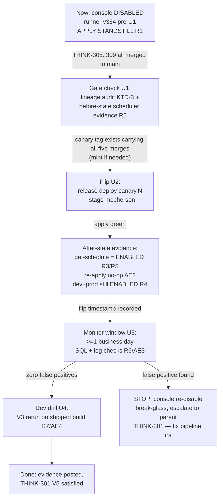

# McPherson Stall Monitor Re-enable + Rollout Verification - Plan

## Goal Capsule

- **Objective:** The McPherson stall monitor — disabled out-of-band in the AWS console on 2026-07-15 as a demo stopgap — is re-enabled as declared Terraform state on a build that carries the corrected stall pipeline, and the rollout is verified with recorded evidence on every affected stage.
- **Product authority:** THINK-310 (unit U7 / PR-F of THINK-301); parent Product Contract in `docs/plans/2026-07-16-001-fix-agent-timeout-stall-false-positives-plan.md` (covers parent R11, Verification Contract V5).
- **Open blockers:** Gated on sibling units THINK-305 (U1), THINK-306 (U2), THINK-307 (U3), THINK-308 (U4+U5) being merged **and deployed to McPherson's pinned runner**; THINK-309 (U6) precedes it under the parent's deploy ordering (PR-F strictly last). This gate is the unit's subject matter, not an impediment to planning it.

---

## Product Contract

### Summary

Flip the McPherson stall-monitor schedule from its out-of-band console `DISABLED` back to Terraform-declared `ENABLED` — but only via a deploy that already carries the corrected pipeline (U1–U4), so re-enabling cannot resurrect the false-positive `timed_out` verdicts the disable was papering over. The unit is operational: its deliverables are the gated flip, before/after scheduler evidence, a zero-false-positive monitoring window, and a genuine-stall drill proving detection still works.

### Problem Frame

The repo Terraform hardcodes the stall-monitor schedule `state = "ENABLED"` (`terraform/modules/app/lambda-api/handlers.tf:2463`), so the 2026-07-15 console disable on McPherson is silent drift: **any** Terraform apply on that stack re-enables the monitor with whatever code the applied release carries. Before U1 lands in McPherson's release, that means re-enabling the broken monitor (every >5-minute chat turn falsely `timed_out` — parent D4). Meanwhile the disable itself has a cost: genuine stalls on McPherson currently go undetected, with no automatic or prompted recovery. This unit closes both exposures in the right order.

McPherson deploys through the pinned customer deploy runner (control-plane stacks do not auto-update the S3 runner; TEI and McPherson sit at runner v364), so "deployed to McPherson" is an explicit runner/release update operation, not a side effect of merging to main.

### Key Decisions

- **No per-customer `stall_monitor_enabled` runner wiring in this unit.** U2's var defaults to `true`, and customer-settable vars require three wiring points in the control-plane runner (`vars_json` allowlist + generated root module variable + `module "thinkwork"` argument in `write_runner_files`, `terraform/modules/app/deployment-control-plane/runner.py` — see `docs/solutions/integration-issues/controller-vars-allowlist-blocks-cognito-ses-invite-emails.md`). The re-enable needs none of that: an apply on a release carrying U2 reasserts `ENABLED` from the default. The console disable remains the break-glass path for emergencies; wiring a per-customer knob through the runner is a named follow-up only if a real need appears. (LFG decision — adopted recommended option.)
- **The runner update is the flip vehicle.** Re-enabling is not a config edit on McPherson: it is updating the pinned S3 runner/release to a version carrying U1–U4 (per the customer-runner ledger process) and applying. The same apply that re-enables also ships the fix, which is what makes the flip safe.
- **Freeze applies until the gate holds.** Between now and the U7 flip, no Terraform apply may run on the McPherson stack from a release lacking U1 — such an apply would silently re-enable the broken monitor (D4). This standstill is an explicit operational requirement, not an assumption.

### Requirements

**Gated flip**

- R1. No Terraform apply runs on the McPherson stack before the U7 flip unless its release carries at least U1 (the activity bump); the pre-flip console `DISABLED` state is otherwise preserved.
- R2. McPherson's pinned customer runner/release is updated to a version verified to carry U1–U4 (and, per the parent deploy ordering, U6) before or as part of the enabling apply; the verified release/runner version is recorded.
- R3. After the flip, the McPherson stall-monitor schedule is `ENABLED` as Terraform-declared state — `aws scheduler get-schedule` matches what the applied configuration declares, with no out-of-band drift remaining.

**All affected stages**

- R4. dev and prod stall monitors remain `ENABLED` via var-driven state (explicit `true` or the default) after U2 ships — the U2 refactor plus this rollout must not silently disable any stage.

**Verification evidence (parent V5)**

- R5. Before/after `aws scheduler get-schedule` output for McPherson is recorded in the issue/Progress document.
- R6. McPherson runs ≥1 business day post-flip with zero false-positive `timed_out` verdicts, measured as: no `timed_out` turn whose activity/finalize evidence shows it was actively progressing when flagged (parent query: `timed_out` turns whose `finished_at` predates a later successful finalize).
- R7. A genuine-stall drill on dev (parent V3 rerun) is green on the shipped build: stall detected, silent recovery, exactly one final answer — proving the re-enabled monitor still catches real stalls.

### Acceptance Examples

- AE1. **Covers R1, R2.** Given McPherson's runner is still at a pre-U1 version, when any deploy/apply is proposed for that stack, then it is blocked (not run) until the runner/release is updated to a U1-carrying version — and the first apply from that version is the flip itself.
- AE2. **Covers R3, R5.** Given the flip apply completes, when `aws scheduler get-schedule --name thinkwork-mcpherson-stall-monitor` is compared before/after, then the state transitions `DISABLED → ENABLED` and the after-state is what Terraform declares (re-applying is a no-op on the schedule).
- AE3. **Covers R6.** Given one business day of post-flip McPherson traffic including chat turns longer than the stall threshold, when `timed_out` verdicts are queried, then none corresponds to a turn that was actively progressing when flagged.
- AE4. **Covers R7.** Given a synthetic genuine stall on dev on the shipped build, when the monitor flags it, then automatic recovery completes silently and the thread shows exactly one final answer.

### Scope Boundaries

- **Out of scope (sibling units):** the activity bump (U1/THINK-305), the `stall_monitor_enabled` var and threshold knob themselves (U2/THINK-306), retry dispatcher wiring (U3/THINK-307), finalize reconciliation + manual Retry guard (U4+U5/THINK-308), the recovery UI surface (U6/THINK-309).
- **Out of scope:** wiring `stall_monitor_enabled` through the customer runner's `vars_json` allowlist / generated root module (per Key Decisions — follow-up only on demonstrated need).
- **Out of scope:** application code changes. Expected repo delta is zero-to-small (ops evidence + possibly docs); the unit may legitimately ship as pure operations recorded in Linear.
- **Out of scope:** re-enabling or changing any other schedule (retry dispatcher enablement is U3's, governed by the parent's deploy-ordering constraint).

### Dependencies / Assumptions

- U2's `stall_monitor_enabled` Terraform var lands with default `true` and composes with the existing `local.deploy_lambda_handlers` guard (THINK-306 contract).
- Operator access to McPherson's AWS account (scheduler describe) and to the customer-runner update process (S3 runner overwrite per the customer-deploy ledger) is available at ship time.
- McPherson's live stack may drift from repo Terraform (customer stacks deploy through the pinned runner); U3's verification includes inspecting McPherson's live scheduler state for both crons, and this unit consumes that finding rather than re-deriving it.
- The stall-monitor schedule name on McPherson follows the `thinkwork-<stage>-stall-monitor` pattern (`handlers.tf:2460`); confirm the actual stage slug during execution.

### Outstanding Questions

**Resolved during planning** (see Planning Contract → Key Technical Decisions)

- Q1. **Resolved (KTD-2):** the R6 window is verified by recorded SQL run manually against McPherson's DB — the query text lives in this plan (U3) so the check is reproducible; no evidence script is built.
- Q2. **Resolved (KTD-1):** the runner-update vehicle is `release deploy v0.1.0-canary.<N> --stage mcpherson` per `docs/solutions/workflow-issues/customer-updates-use-release-deploy-not-deploy-controller-2026-07-12.md`; exact steps are enumerated in U2. THINK-307's live-scheduler inspection of McPherson is consumed as U1's before-state input when available, re-derived otherwise.

### Sources / Research

- Parent contract + plan: `docs/plans/2026-07-16-001-fix-agent-timeout-stall-false-positives-plan.md` (R11, D4, U7, V5, deploy ordering).
- Hardcoded schedule state: `terraform/modules/app/lambda-api/handlers.tf:2457-2463` (verified this session).
- Customer-runner var allowlist: `terraform/modules/app/deployment-control-plane/runner.py` (`write_runner_files`, `vars_json` — verified this session); three-wiring-points rule in `docs/solutions/integration-issues/controller-vars-allowlist-blocks-cognito-ses-invite-emails.md`.
- Sibling unit contracts: `docs/plans/2026-07-16-002-fix-stall-clock-midturn-activity-bump-plan.md` (U1), `docs/plans/2026-07-16-002-fix-stall-threshold-env-knob-schedule-enable-flag-plan.md` (U2).

---

## Planning Contract

> **Product Contract preservation:** Product Contract unchanged. Everything below enriches R1–R7 / AE1–AE4; it does not rewrite them. Plan-local unit IDs (U1–U4 below) are scoped to this document and are **not** the parent plan's U1–U7 — this whole document is the parent's U7.

### Key Technical Decisions

- **KTD-1 (resolves Q2). The flip runs through `release deploy`, never `deploy --controller` and never a hand-built payload.** Customer stage updates must carry forward prior deployment evidence (`agentcorePiSourceImageUri` points at McPherson's own ECR mirror; a from-scratch payload dies on an anonymous GHCR pull) — see `docs/solutions/workflow-issues/customer-updates-use-release-deploy-not-deploy-controller-2026-07-12.md`. The command shape is `AWS_PROFILE=mcpherson AWS_REGION=us-east-1 pnpm --dir apps/cli dev release deploy v0.1.0-canary.<N> --stage mcpherson --yes`. Nothing auto-mints canary tags: the target release must exist (both `release.yml` and `release-desktop.yml` green — the desktop workflow re-uploads the manifest, so any hand-taken digest must be captured after both finish; `release deploy` resolves digest itself).
- **KTD-2 (resolves Q1). R6 is measured by recorded SQL + a CloudWatch log check, run manually — no evidence script.** The unit is a one-off rollout; a script is speculative carrying cost. The exact queries live in U3 of this plan (reproducibility requirement satisfied by the plan being merged to main). Two signal sources because the parent plan's U4 reconciliation (THINK-308) *erases* surviving false positives: (a) `thread_turns` rows still `timed_out` in the window, inspected for post-flag activity; (b) occurrences of THINK-308's finalize-reconciliation log marker, each of which is a false positive that got repaired.
- **KTD-3. Gate verification is release-lineage-based, not status-label-based.** "McPherson's release carries U1–U4 (+U6)" is proven by checking that the deployed canary tag's commit lineage contains the squash-merge commits of THINK-305/306/307/308/309's PRs (`git merge-base --is-ancestor <merge-sha> <tag>`), recorded per-sibling in the evidence. Linear statuses are advisory; commit ancestry is authoritative.
- **KTD-4. Zero-to-small repo delta; evidence lives in Linear.** No application code changes. The only possible repo change during execution is a docs follow-up (e.g., a `docs/solutions/` entry if the rollout surfaces a new trap). All rollout evidence (scheduler before/after JSON, query results, drill artifacts) is recorded in the THINK-310 Progress document and issue comments.
- **KTD-5. No grandchild Linear issues.** THINK-310 is itself a leaf unit (parent plan's U7). The plan-local units below are execution phases of one issue, worked sequentially in the work phase — splitting them into child issues would add dispatch overhead with no parallelism (each unit hard-depends on the previous). Checkpoint boundary: this planning PR is the only expected repo PR; execution units produce Linear evidence, not PRs (KTD-4), which is the explicit justification for grouped units under the one-PR-per-unit default.

---

## High-Level Technical Design

Rollout state machine — every arrow is gated; the standstill (R1) holds in all pre-flip states:



---

## Implementation Units

> Execution note (all units): this is operational work against live stacks. Prefer evidence capture over automation; every AWS/DB command's output that proves a requirement gets pasted into the THINK-310 Progress document at the moment it runs, not reconstructed later.

### U1. Gate audit + before-state evidence (pre-flip)

- **Goal:** Prove the flip is safe to run: all five sibling deliverables are on main, a deployable release carries them, the standstill has held, and McPherson's before-state is recorded.
- **Requirements:** R1, R2 (verification half), R5 (before half); AE1.
- **Dependencies:** THINK-305, THINK-306, THINK-307, THINK-308, THINK-309 merged to main (cross-issue gate — if any is unmerged at execution time, the run records `waiting-on THINK-30x` and stops; that is the AE1 "blocked, not run" behavior).
- **Files:** none (ops). Evidence → Progress document.
- **Approach:**
  - Lineage audit (KTD-3): resolve each sibling's squash-merge SHA from its merged PR; pick the newest `v0.1.0-canary.<N>` tag (or mint one — procedure: `docs/solutions/workflow-issues/canary-release-tagging-web-desktop-2026-06-11.md`, paired `v0.1.0-canary.N` / `desktop-v` tags driving both release workflows) and confirm ancestry of all five SHAs.
  - Confirm dev has run ≥1 clean deploy carrying THINK-306's `stall_monitor_enabled` refactor and that dev's schedule is still `ENABLED` (R4 first half): `aws scheduler get-schedule --name thinkwork-dev-stall-monitor`.
  - Record McPherson before-state: consume THINK-307's live-scheduler inspection if its evidence exists; otherwise run `aws scheduler get-schedule --name thinkwork-mcpherson-stall-monitor` (confirm the actual stage-slug schedule name first — Dependencies/Assumptions) for **both** the stall monitor (expect `DISABLED`) and the retry dispatcher, in the McPherson account.
  - Confirm the standstill held: McPherson's deployment evidence bucket shows no successful apply since 2026-07-15 from a pre-U1 release.
- **Test scenarios:** Test expectation: none — ops audit unit; its "tests" are the recorded evidence checks above (each check names its expected value inline).
- **Verification:** Progress document contains: five sibling merge SHAs + ancestry confirmation against the chosen canary tag; dev scheduler `ENABLED` JSON; McPherson before-state JSON showing `State: DISABLED`; standstill confirmation. No browser flow — this unit is evidence-only.

### U2. The flip: runner/release update + enabling apply

- **Goal:** McPherson's pinned runner/release is updated to the U1-carrying canary and the same apply re-enables the stall monitor as Terraform-declared state.
- **Requirements:** R2, R3, R4, R5 (after half); AE2.
- **Dependencies:** U1 complete (gate green).
- **Files:** none expected (ops). Evidence → Progress document.
- **Approach:**
  - Vehicle per KTD-1: `release deploy v0.1.0-canary.<N> --stage mcpherson --yes` under the McPherson AWS profile. If the CLI's runner-compatibility check reports pinned runner v364 below the release's floor, remediate via the release-upgrade-safety runner refresh (backup + selected-release upload) — never a raw S3 overwrite.
  - `stall_monitor_enabled` is deliberately **not** in the customer `vars_json` allowlist (Key Decisions), so the generated root module omits it and the default `true` reasserts `ENABLED`. No runner.py change is part of this unit.
  - Capture after-state: `aws scheduler get-schedule` for the stall monitor (expect `ENABLED`), plus the deployed release/runner version recorded (R2). Also capture the retry-dispatcher schedule's after-state alongside it — the same apply is McPherson's first carrying THINK-307's new schedule resource; its expected value is whatever THINK-307's landed `retry_dispatcher_enabled` decision declares for McPherson (look up at execution time). Evidence-only: enablement decisions remain THINK-307's scope.
  - Idempotency check (AE2): rerun `release deploy` with the identical canary tag and record that the apply reports no change to the schedule resource. (A local `thinkwork plan` is not a valid substitute — it exercises the checkout's Terraform, not the pinned release's.)
  - R4 second half: after the flip, confirm prod's schedule also remains `ENABLED` via the same describe (dev was checked in U1).
- **Test scenarios:** Test expectation: none — config/ops unit; smoke verification is the before/after scheduler evidence and no-op re-apply, per the parent plan's execution guidance for PR-F.
- **Verification:** Progress document contains: deploy command + green completion (deployment evidence entry), before/after `get-schedule` JSON pair showing `DISABLED → ENABLED`, recorded runner/release version, no-op re-apply proof, prod `ENABLED` describe. Flip timestamp recorded — it anchors U3's window. No browser flow; the deployed-surface sanity check is U3's first datapoint.

### U3. Zero-false-positive monitoring window (≥1 business day)

- **Goal:** Prove the re-enabled monitor produces no false-positive `timed_out` verdicts on real McPherson traffic.
- **Requirements:** R6; AE3.
- **Dependencies:** U2 (window starts at the flip timestamp).
- **Files:** none (queries recorded here per KTD-2). Evidence → Progress document.
- **Approach:** After ≥1 full business day of post-flip traffic that includes at least one chat turn longer than the stall threshold (drive one deliberately via the McPherson web app if organic traffic doesn't provide it — a long agent turn from a real browser session is the user flow that makes AE3 meaningful), run against McPherson's DB (credentials: `thinkwork-mcpherson-db-credentials` in Secrets Manager, McPherson account):

  ```sql
  -- (a) every stall verdict in the window: expect only genuine stalls, ideally zero
  SELECT id, thread_id, status, started_at, last_activity_at, finished_at, error
  FROM thread_turns
  WHERE status = 'timed_out' AND finished_at >= :flip_timestamp
  ORDER BY finished_at;

  -- (b) false-positive signature — flagged while demonstrably progressing: expect zero rows
  SELECT id, thread_id, started_at, last_activity_at, finished_at
  FROM thread_turns
  WHERE status = 'timed_out' AND finished_at >= :flip_timestamp
    AND last_activity_at > finished_at;
  ```

  Signal (c): CloudWatch Logs on McPherson's finalize path filtered for THINK-308's reconciliation log marker in the window (look up the exact marker string in THINK-308's merged PR at execution time) — each hit is a false positive that THINK-308's guard repaired; expect zero. Caveat on (b): at execution time, confirm from THINK-305's merged PR whether the activity bump writes to non-`running` turns; if it does not, (b) is structurally always zero — treat it as advisory and rely on (a) row-by-row inspection plus (c) as the authoritative detectors. Any nonzero (b) or (c) result, or any (a) row whose thread shows the agent was actively working, fails the window → break-glass console re-disable and escalate to THINK-301 (HTD failure arm).
- **Test scenarios:** Covers AE3. Given ≥1 business day of post-flip traffic including a >threshold chat turn, when queries (a)/(b) and check (c) run, then (b) and (c) are zero and every (a) row is a genuine stall. Edge: if the window contained *no* turn longer than the threshold, the window is inconclusive — extend it or drive the long-turn flow; do not pass on an empty denominator.
- **Verification:** Complete user flow: operator signs into the McPherson web app in a real browser, runs a long (> stall threshold) agent turn, and observes it complete normally with no `timed_out` verdict and exactly one answer. Query outputs + log-filter result pasted into the Progress document with the window's start/end timestamps.

### U4. Genuine-stall drill on dev (parent V3 rerun)

- **Goal:** Prove the re-enabled monitor still catches real stalls on the shipped build — detection wasn't broken by the fixes that removed the false positives.
- **Requirements:** R7; AE4.
- **Dependencies:** U3 passed (drill is the last evidence item; dev must be on a build carrying U1–U6 — it deploys from main continuously, so this holds once the siblings merged).
- **Files:** none. Evidence → Progress document.
- **Approach:** Rerun the parent plan's V3 drill on deployed dev: start a chat turn, induce a genuine stall (kill the runtime mid-flight, or age `last_activity_at`/`started_at` on a turn whose finalize is blocked), let the stall monitor flag it, and let the recovery pipeline (retry dispatcher → wakeup-processor attempt) complete.
- **Test scenarios:** Covers AE4. Given a synthetic genuine stall on dev, when the monitor flags it, then: origin turn `timed_out` with a successor attempt linked by `origin_turn_id`; retry row closed `succeeded`; browser shows a continuous benign working state and then exactly one final answer, no red error, no visible trace of recovery. Failure path: if recovery exhausts, the U6 surface shows plain-language failure + working Retry (observational only — a failure here escalates to the owning sibling, not this unit).
- **Verification:** Complete user flow, driven in a real browser against deployed dev: send the message, watch the working state persist through the induced stall, confirm exactly one final answer appears. DB evidence (origin/successor turn rows, retry row) pasted into the Progress document.

---

## Verification Contract

This unit **is** the parent's V5; its gates, in order:

1. **V5-a (U1):** before-state + gate evidence recorded — five-sibling lineage proof, McPherson `DISABLED` describe, standstill confirmation.
2. **V5-b (U2):** `aws scheduler get-schedule` before/after pair shows `DISABLED → ENABLED` as declared state; retry-dispatcher schedule after-state recorded alongside (expected value per THINK-307's landed decision); re-apply is a no-op; dev + prod remain `ENABLED`; deployed runner/release version recorded.
3. **V5-c (U3):** ≥1 business day, zero false positives by queries (a)/(b) + log check (c), window non-empty (contained a >threshold turn); browser-driven long-turn flow on McPherson completes with one answer.
4. **V5-d (U4):** dev genuine-stall drill green end-to-end in a real browser: stall detected, silent recovery, exactly one final answer.

The browser-driven flows that prove the unit end to end: the McPherson long-turn flow (V5-c) and the dev stall-drill flow (V5-d). V5-a/b are AWS-evidence gates with no user-visible surface.

---

## Risks & Mitigations

- **Standstill violated before the flip** (someone applies a pre-U1 release on McPherson): the broken monitor re-enables silently. Mitigation: R1 is recorded in the Progress document and this plan; U1 re-verifies the deployment-evidence bucket immediately before the flip; break-glass = console re-disable (same as 2026-07-15).
- **Runner v364 below the target release's compatibility floor:** `release deploy` fails closed. Mitigation: use the release-upgrade-safety runner remediation path (backup + selected-release upload); never bypass with a hand-edited payload (KTD-1 traps).
- **Canary manifest digest staleness:** only bites hand-built payloads; `release deploy` resolves the digest itself. Mint-and-wait for both release workflows before deploying.
- **Schedule name assumption:** `thinkwork-<stage>-stall-monitor` with stage slug `mcpherson` is unverified against the live account. U1 confirms the real name before any evidence is recorded against it.
- **Window with no long turns** (R6 vacuously true): explicitly disallowed — U3 requires a >threshold turn in the window, driving one if needed.
- **A false positive appears in the window:** fail the unit, console re-disable (break-glass), escalate to THINK-301 — do not iterate on the pipeline inside this ops unit (HTD failure arm).

---

## Definition of Done

- All four units' evidence recorded in the THINK-310 Progress document (V5-a through V5-d), satisfying R1–R7 and AE1–AE4.
- McPherson stall monitor `ENABLED` as Terraform-declared state on a release whose lineage carries THINK-305–309, with no out-of-band drift remaining.
- Parent THINK-301 V5 can cite this issue's evidence without re-derivation.
- Repo delta: none beyond this plan (any surfaced trap becomes a `docs/solutions/` follow-up, not a blocker).
