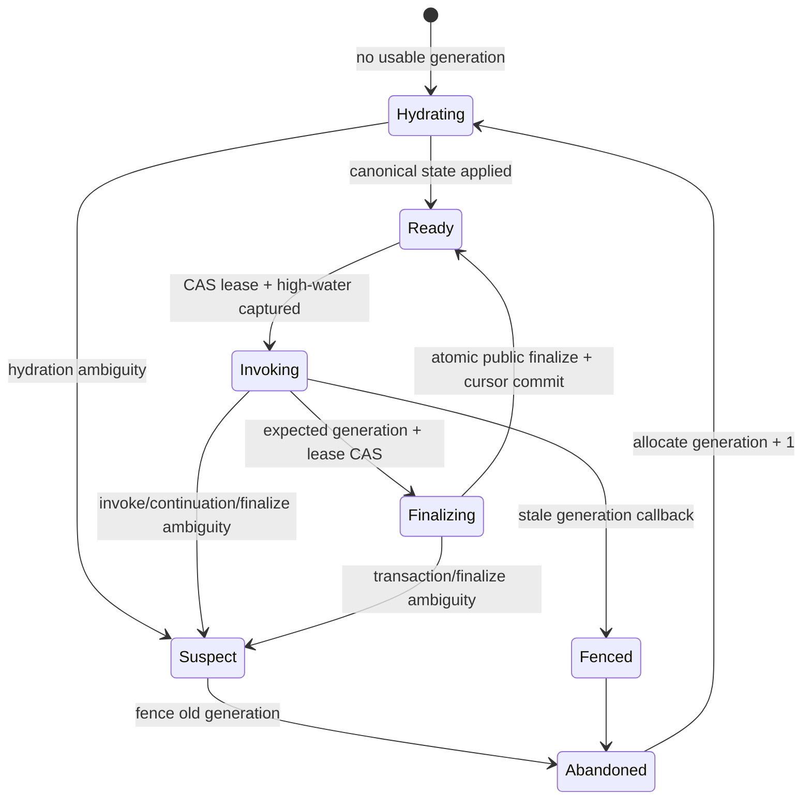
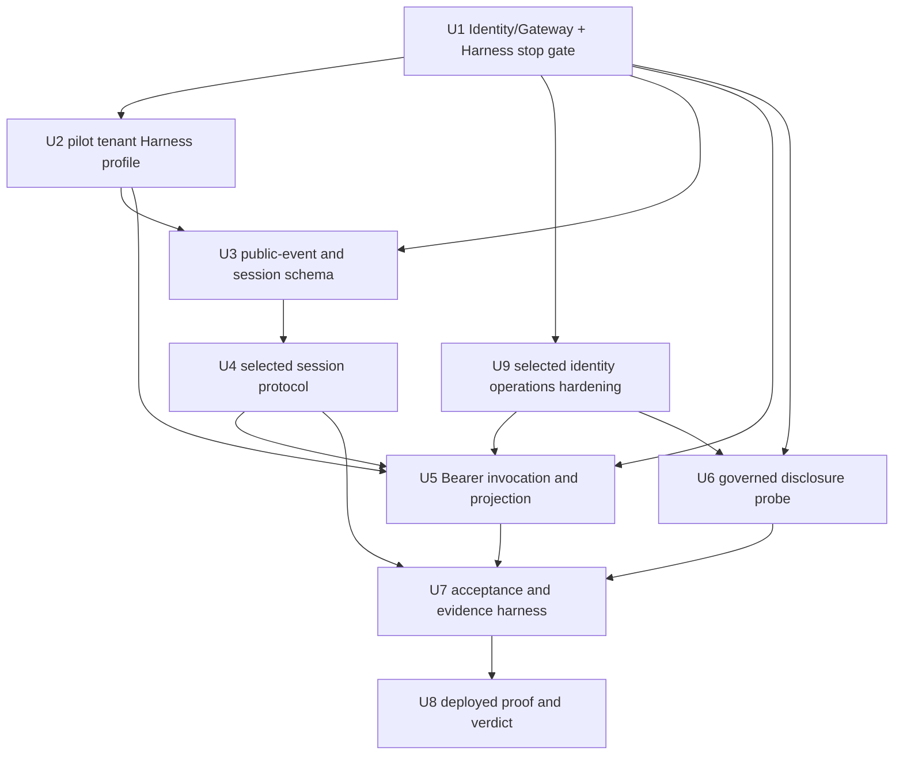
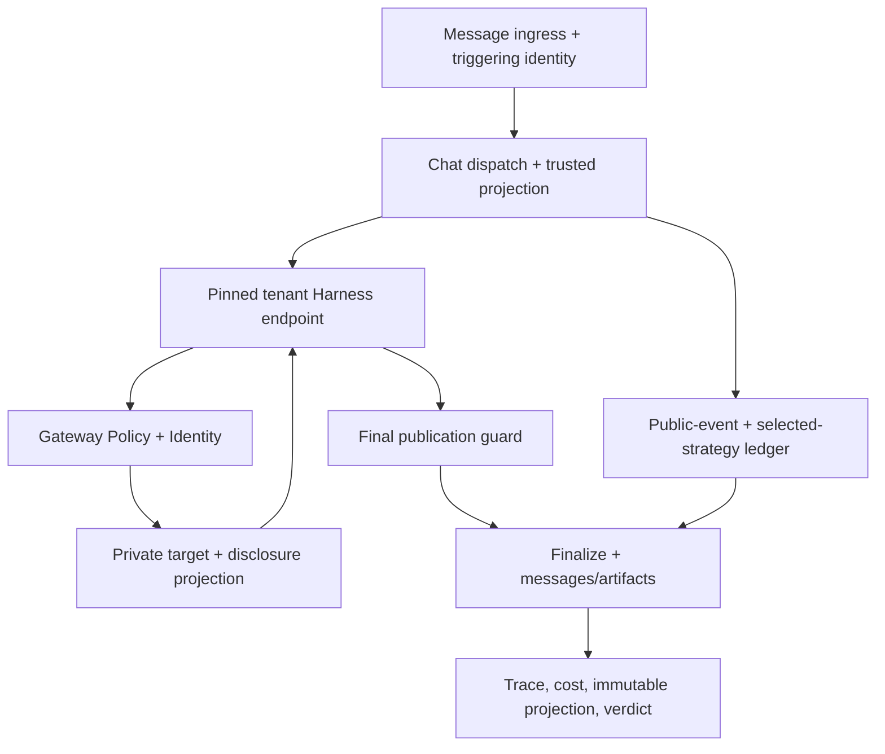

# feat: Prove the managed multiplayer AgentCore Harness architecture

## Overview

Build a focused, non-production proof that one tenant-scoped Amazon Bedrock AgentCore Harness can preserve ThinkWork's defining multiplayer behavior: one visible logical agent, participant-isolated sessions, current public-thread context, and different per-user capabilities and credentials. ThinkWork keeps the canonical thread, logical-agent definition, scoped memory, capability registry, disclosure policy, and durable evidence; Harness owns the managed model/tool loop; AgentCore Gateway Policy and Identity own the gateway-fronted authorization and downstream credential boundaries.

**U1 live result (2026-07-17): pass.** One shared Harness preserved Alice/Bob
identity through `CUSTOM_JWT` inbound auth, Identity `TOKEN_EXCHANGE`, Gateway
`CUSTOM_JWT`/Cedar authorization, and exact-user downstream `TOKEN_EXCHANGE`
credentials. AWS's supported OBO path preserves the authenticated user and
workload identities without an invalid nested consent ceremony. Alice-to-Alice
and Bob-to-Bob passed; Bob-to-Alice and direct
target invocation were denied. The native route is selected and U2-U9 are ready
to implement. This does not authorize production cutover or Pi retirement.

The proof is intentionally narrower than a runtime migration. THINK-311 already proved basic Harness execution and artifact emission. To remove an artificial cross-agent sequencing dependency, this plan now owns the proof-critical remainder of THINK-315: materialize the already-proven assertion/Gateway substrate, prove real vault credential ownership, target-specific handoff, direct-target rejection, rotation/outage behavior, and bounded cross-audience/duplicate read-only replay, then extend that chain through Harness. It does not absorb THINK-315's full production policy-plane rollout, connector migration, legacy-store retirement, side-effect certification, or claim that a Bearer assertion binds the Harness invocation payload. A pass authorizes a separate Pi-retirement certification plan; it does not cut traffic over or delete Pi (see origin: `docs/brainstorms/2026-07-17-think-316-managed-multiplayer-harness-requirements.md`).

---

## Problem Frame

The current Harness adapter is a useful execution prototype but is not a safe multiplayer architecture. It derives one Harness per logical agent, creates or updates that Harness in the hot path, invokes it with SigV4, uses one thread-wide runtime session across all participants, resends full history on every call, and copies some MCP credentials into Harness configuration. That shape cannot demonstrate exact-user Identity propagation, cross-user session isolation, ordered refresh, or deterministic disclosure.

AWS's current contract sharpens the risk: `runtimeUserId` is only passed through to the runtime, `actorId` only scopes AgentCore Memory, and SigV4 Harness invocation does not propagate a user identity for user-scoped downstream credentials. Per-user Identity requires Harness inbound `CUSTOM_JWT` and Bearer invocation. AWS does not document whether a native Harness Gateway tool preserves the original OAuth principal and ThinkWork custom claims at Gateway Policy. The proof must establish that behavior live or select a small caller-fulfilled Gateway bridge; it must not infer authorization from session fields or tool visibility.

THINK-315 has already cleared several upstream risks live in `us-east-1`: AgentCore Gateway accepted a self-hosted KMS-RS256 OIDC issuer; tampered, expired, unsigned, and wrong-audience assertions failed; Cedar read a custom `tenant_id` claim and inverted allow/deny when only policy changed; and `GetWorkloadAccessTokenForJWT` returned distinct opaque workload tokens for two user subjects. Those results are authoritative inputs to U1, not an external delivery dependency. U1 recreates the smallest proven substrate from a repo-local redacted evidence record, closes real vault retrieval, target-specific identity handoff, direct-target rejection, and cross-audience/duplicate read-only operation replay, and then proves Harness inbound OAuth plus the Harness-to-Gateway route. Modified-payload Bearer replay is measured and remains a retirement blocker unless AgentCore denies it. U9 materializes the surviving path and closes rotation/outage/provider-revocation before the deployed proof. The spike also established that the dev account blocks public unauthenticated Lambda Function URLs, so discovery/JWKS must use API Gateway or CloudFront rather than Function URL.

---

## Requirements Trace

- R1. Preserve one stable logical-agent identity and voice while participant-specific execution details remain invisible.
- R2. Keep the ThinkWork thread and existing artifact/continuation records authoritative; no required public state may exist only in Harness.
- R3. Map every participant-thread pair to a distinct, application-enforced Harness session generation.
- R4. Apply the complete, ordered, gap-tolerant prefix of authorized public events through a captured high-water cursor exactly once before a participant turn runs.
- R5. Run every accepted multiplayer proof leg after the U1 carrier spike on one general tenant Harness and one named endpoint whose attested mapping targets one immutable Harness version. U1 records its separate ephemeral ARN and is excluded from the topology verdict.
- R6. Resolve model, base instructions, participant context, skills, tools, `allowedTools`, memory actor, limits, and identity assertions exclusively from trusted server state.
- R7. Make Gateway Policy the final authorization decision for the proof's governed tool operation; Harness configuration is only a behavioral ceiling.
- R8. Preserve exact participant identity through Harness, Gateway, and Identity so Alice's credential cannot resolve for Bob, an ownerless subject, or a mixed tuple.
- R9. Express ordinary logical-agent/user/Space/tool variation per invocation; reserve additional Harness resources for explicit execution/trust profiles.
- R10. Keep public thread state, Space-shared context, user-private context, and disposable Harness working state structurally distinct.
- R11. Publish only purpose-relevant private results; sensitive, surprising, unrelated, or ambiguous data remains withheld behind a confirmation-required result.
- R12. Keep raw private inputs, withheld outputs, credentials, assertions, and private memory records out of the public thread and proof telemetry.
- R13. Abandon and reconstruct a terminated, stale, or suspect participant session from current canonical state and current authorization.
- R14. Produce Harness execution or an explicit failed turn for every leg; never silently invoke Pi.
- R15. Run Alice/Bob/Alice interleaving with distinct grants and credentials, including an Alice allow and equivalent Bob deny.
- R16. Persist a redacted, reproducible evidence bundle with Harness/version, logical/config fingerprints, session/revision hashes, Gateway and Identity outcomes, recovery, latency, usage, and cost.
- R17. End with a binary written verdict whose only positive consequence is authorization to plan retirement certification.
  **Plan-local execution requirements:**

- R18. Make the proof self-contained: U1 closes the remaining THINK-315 vault, target-handoff, direct-boundary, cross-audience replay, and duplicate read-only operation gates before Harness route selection; U9 closes rotation/outage/provider-revocation before U5-U8. Because AgentCore does not document invocation-payload binding for a Bearer assertion, modified-payload replay is measured and remains a retirement blocker unless the provider denies it; side-effecting operations remain disabled.
- R19. Expose `AgentCore Harness (proof)` in the existing operator-only Default Agent runtime dropdown as a guarded non-production workflow: show readiness/status reasons, require confirmation of tenant-wide impact, create or open an enrolled proof thread, route only eligible direct-chat turns through Harness with no Pi fallback, and restore the captured prior runtime during teardown.

**Origin actors:** A1 (thread participant), A2 (ThinkWork control plane), A3 (tenant Harness), A4 (AgentCore Gateway + Identity), A5 (canonical thread and memory plane)

**Origin flows:** F1 (interleaved multiplayer turns), F2 (author-specific private capability), F3 (cross-user denial), F4 (participant-session reconstruction)

**Origin acceptance examples:** AE1 (shared agent and interleaved context), AE2 (Alice allow/Bob deny), AE3 (mixed-sensitivity disclosure), AE4 (session reconstruction), AE5 (forged input rejection), AE6 (explicit failure and verdict evidence)

---

## Scope Boundaries

- Do not repeat THINK-311 beyond a minimal Harness/artifact smoke that detects regression.
- Do not migrate every connector family, Agent Folder, skill, existing thread, or historical message. The proof creates a fresh non-production thread after the public-event ledger exists.
- Do not certify sub-agents, Browser, Code Interpreter, shell, full workspace reconciliation, every Pi extension, or long-thread summarization/truncation.
- Do not certify scheduled automation, ownerless workloads, or non-self run-as. Their identity and consent contracts remain retirement-certification work.
- Do not cut over production traffic, delete Pi, expose runtime selection to ordinary end users/customers, or establish permanent dual-runtime operation. An operator-only, non-production `AgentCore Harness (proof)` option in the existing Default Agent runtime dropdown is explicitly in scope for end-to-end validation.
- Do not create a Harness per user, thread, Space, or logical agent.
- Do not make Harness Memory, session files, or a Harness transcript authoritative for the public thread, user memory, or Space memory.
- Do not accept browser tokens, caller-supplied identity claims, tool lists, model configuration, skill sources, or credential-owner arguments as trusted input.
- Do not treat `allowedTools`, `runtimeUserId`, `actorId`, prompt text, or tool listing as authorization.
- Do not build a general DLP/classification product. The proof uses a deterministic mixed-sensitivity fixture and a fail-closed publication contract.
- Do not absorb THINK-315's full production rollout: tenant-wide registry-to-Cedar projection, connector-family migration/re-connect, policy UI, legacy credential-store retirement, and customer-stage ENFORCE remain separate work. This plan owns only the identity and Gateway contracts required to make its Harness verdict trustworthy.

### Deferred to Follow-Up Work

- Pi-retirement certification: full tool/skill/artifact/runtime parity, long-thread context policy, scheduled/ownerless/run-as behavior, production SLOs, and cutover/rollback.
- General tenant lifecycle: dynamic per-tenant Harness creation, deletion, quota admission, and fleet reconciliation after the single pilot-tenant topology is proven.
- Full disclosure-confirmation UX: resuming a withheld private result after explicit consent. This proof must durably withhold and request confirmation, but it need not disclose after confirmation.
- Existing-thread event seeding/backfill and generalized public-card/continuation event capture. The proof ledger is enrolled only for fresh proof threads and covers direct-chat messages, message-artifact references, and invalidations of consumed proof inputs.
- Additional Harness profiles for privileged shell/browser/code-interpreter, separate VPC/container/filesystem, regional/regulatory isolation, or independently operated workloads.

---

## Context & Research

### Relevant Code and Patterns

- `packages/api/src/graphql/resolvers/messages/sendMessage.mutation.ts` is canonical human-message ingress and dispatches only after persistence.
- `packages/api/src/handlers/chat-agent-invoke.ts` already resolves the triggering sender, composes user/Space/agent workspace state, creates `thread_turns`, and carries the stable cost owner. Its current last-30 `created_at` history query is not a multiplayer revision protocol.
- `packages/api/src/lib/harness/projection.ts` compiles resolved runtime configuration but currently derives a per-agent Harness, copies MCP auth headers, and treats create-time config as the execution shape.
- `packages/api/src/lib/harness/runner.ts` already handles multi-message streams, caller-fulfilled tool continuation, complete finalize payloads, usage, explicit failure, and no silent Pi fallback. Its thread-wide session ID and full-history replay must be replaced.
- `packages/api/src/handlers/harness-runner.ts` currently mixes control-plane create/update with data-plane invoke and uses SigV4 `InvokeHarnessCommand`; it is the main seam for pinned-endpoint Bearer invocation.
- `packages/api/src/lib/chat-finalize/process-finalize.ts` has the durable `finalized_at` CAS, returns the inserted assistant message ID, records costs/traces, and is the correct boundary for session-cursor commit and stale-generation fencing.
- `packages/api/src/lib/workspace-projection-snapshot.ts` demonstrates write-once content-addressed evidence tied to `thread_turns.context_snapshot`.
- `packages/api/src/lib/capabilities/manifest-compile.ts`, `packages/api/src/lib/capabilities/current-manifest.ts`, and `packages/api/src/lib/resolve-agent-runtime-config.ts` remain the server-side capability/configuration sources.
- `packages/api/src/lib/resolve-runtime-function-name.ts` and its tests already preserve an explicit Harness-vs-Pi selector with loud failure semantics.
- `terraform/modules/app/agentcore-harness/` is the existing inert Harness IAM/config seam; it needs an AgentCore-specific script-shell lifecycle, tenant/profile resource model, and named endpoint rather than per-turn reconciliation. The repository-level `scripts/deploy-harness.sh` is an unrelated fresh-stack test harness and is not reused.

### Institutional Learnings

- `docs/solutions/architecture-patterns/agentcore-harness-trial-verdict-2026-07.md` records the live Harness protocol, three-minute first provision, multi-message stream behavior, caller-tool continuation contract, session poisoning, and conditional no-go that this focused proof may revisit.
- `docs/solutions/logic-errors/oauth-authorize-wrong-user-id-binding-2026-04-21.md` proves tenant-only credential lookup is unsafe; exact user identity must fail closed.
- `docs/solutions/architecture-patterns/wakeup-processor-payload-parity-with-chat-agent-invoke-2026-06-12.md` requires trusted identity/config fields to reach every dispatch builder consistently.
- `docs/solutions/architecture-patterns/per-turn-snapshot-needs-content-addressed-immutable-storage.md` requires evidence fingerprints to point to immutable bytes rather than mutable keys or empty hashes.
- `docs/solutions/design-patterns/replay-recorded-agent-conversations-write-safe.md` supports read-only/idempotent recovery probes and forbids blind side-effect replay.
- `docs/solutions/integration-issues/merged-terraform-iam-grant-silently-unapplied-targeted-apply-gap.md` and `docs/solutions/workflow-issues/env-gated-feature-dead-without-terraform-wiring.md` require deployment wiring and targeted-apply recovery coverage in the same infrastructure unit.
- Hindsight remains the canonical user/Space memory provider; Harness Memory is participant-session working context only.

### Absorbed THINK-315 Evidence and Closure Scope (2026-07-17)

- Proven in dev and torn down: self-hosted KMS-RS256 discovery/JWKS behind API Gateway; Gateway `CUSTOM_JWT` issuer/signature/audience/expiry enforcement; Cedar decisions and `tools/list` filtering from the custom `tenant_id` claim; policy-only allow/deny inversion; distinct per-user opaque workload-token exchange.
- U1 owns the architecture gates: real OAuth vault credential retrieval, Gateway-to-target signed identity handoff without bearer replay, direct-target rejection, cross-audience/duplicate read-only operation replay, and Harness route selection. U9 owns signing-key/JWKS outage and rotation, provider revocation, and reusable-substrate hardening before U5-U8. Modified-payload Bearer replay is not called contained unless the provider denies it; side-effecting operations remain disabled and uncertified.
- Scope of that proof: raw `curl` sent hand-minted Bearer assertions directly to the Gateway MCP endpoint. Pi, Runtime, and Harness were not in the path. The two user subjects were exercised sequentially; the spike did not prove concurrent owner isolation through one managed Harness.
- Infrastructure constraint: public unauthenticated Lambda Function URLs are denied by account guardrails even with a public resource policy. Reuse the successful API Gateway issuer path or CloudFront; do not plan a Function URL fallback.
- Cleanup evidence: the throwaway Gateway, target, Policy engine/policy, workload identity, Lambdas, API Gateway issuer, and IAM roles were removed; only the KMS key remains scheduled for AWS's minimum-delay deletion on 2026-07-24.

### THINK-311 No-Go Regression Contract

THINK-311 proved live chat, usage/cost, and `emit_document` through Harness with zero Pi fallback, but kept Pi because the integration still reproduced too much loop behavior and exposed four operational hazards. This plan may not claim a new verdict by merely repeating that green path.

| Prior THINK-311 finding                                                                                     | Required treatment in this plan                                                                                                                                                                                                                                                                                                                                                                        |
| ----------------------------------------------------------------------------------------------------------- | ------------------------------------------------------------------------------------------------------------------------------------------------------------------------------------------------------------------------------------------------------------------------------------------------------------------------------------------------------------------------------------------------------ |
| Caller-fulfilled tool adapter tax and undocumented relay                                                    | U1 pins the now-known assistant-`toolUse` resend plus user-`toolResult` continuation as a tested contract; U5 characterizes it before modification; U7 requires exactly one generic continuation engine and, if selected, one generic disclosure/Gateway bridge. Any proof tool that needs bespoke orchestration or model-loop semantics beyond deterministic validation/projection fails the verdict. |
| Malformed relay permanently poisoned a thread-scoped Harness session                                        | Sessions are participant-generation caches, never thread-wide authority. Preflight validation rejects malformed continuations before invoke; an explicit read-only poison regression abandons only that generation, reconstructs from canonical state, and proves the next turn succeeds while the poisoned session is never reused.                                                                   |
| Harness Memory conflicted with workspace + Hindsight                                                        | ThinkWork's thread, workspace projection, and Hindsight remain canonical. Harness session memory stores disposable loop context only; raw private memory enters only through governed retrieval/disclosure, and reconstruction proves no required public/private state existed only in Harness.                                                                                                        |
| Wrapped control-plane responses, multi-message stream framing, IAM surprises, and ~3-minute first provision | U1/U2 reuse the hardened parser/IAM precedent, test wrapped/unwrapped response shapes and per-message `contentBlockIndex` resets, separate caller-role from execution-role permissions including tag-on-create and Memory data-plane access, and provision/attest asynchronously outside the chat path with a timeout above the measured cold-provision envelope.                                      |

The prior UI was retired because the architecture verdict was no-go. R19 deliberately restores only an operator/non-production proof switch after readiness; it is not evidence by itself and cannot bypass any regression leg above.

### External References

- [InvokeHarness API](https://docs.aws.amazon.com/bedrock-agentcore/latest/APIReference/API_InvokeHarness.html): session constraints and per-invocation model, system prompt, skills, tools, `allowedTools`, actor, and limit overrides.
- [Harness security](https://docs.aws.amazon.com/bedrock-agentcore/latest/devguide/harness-security.html): application-owned session mapping/input validation, inbound OAuth requirement for per-user credentials, trusted-input boundary, skill-source risk, and separate command-execution IAM.
- [Harness tools](https://docs.aws.amazon.com/bedrock-agentcore/latest/devguide/harness-tools.html): Gateway as the policy-backed tool surface, `allowedTools` limits, and the supported caller-fulfilled inline-function continuation protocol.
- [Harness versioning and endpoints](https://docs.aws.amazon.com/bedrock-agentcore/latest/devguide/harness-versioning.html): immutable versions, moving `DEFAULT`, and named version-pinned endpoints.
- [Runtime sessions](https://docs.aws.amazon.com/bedrock-agentcore/latest/devguide/runtime-sessions.html): application-enforced session/user mapping, isolated microVMs, ephemeral state, and lifecycle limits.
- [AgentCore Memory organization](https://docs.aws.amazon.com/bedrock-agentcore/latest/devguide/memory-organization.html): actor/session scoping and IAM-scoped memory organization.
- [Workload access tokens](https://docs.aws.amazon.com/bedrock-agentcore/latest/devguide/get-workload-access-token.html), [Gateway outbound authorization](https://docs.aws.amazon.com/bedrock-agentcore/latest/devguide/gateway-outbound-auth.html), and [Gateway Policy](https://docs.aws.amazon.com/bedrock-agentcore/latest/devguide/policy.html): exact-user workload identity, target credentials, and per-call policy decisions.
- [Harness observability](https://docs.aws.amazon.com/bedrock-agentcore/latest/devguide/harness-operations.html): automatic payload-level telemetry, limits, and Runtime quota inheritance.

---

## Key Technical Decisions

- **KTD-1 — One combined identity-to-Harness program with two stop gates.** THINK-315 selected and live-proven the self-hosted RS256 issuer, Gateway custom-claim enforcement, and distinct per-user workload-token exchange, but left no landed substrate and did not close real-vault retrieval, target handoff, direct-target rejection, or operational replay/rotation. U1 closes the architecture questions and immediately extends the chain through Harness `CUSTOM_JWT` Bearer invocation; U9 hardens only the surviving route while U2/U3 proceed in parallel. Existing positive and negative evidence is reused rather than repeated blindly. `runtimeUserId`, `actorId`, and SigV4 are never accepted as substitutes for exact-user authorization.
- **KTD-2 — Use purpose-bound sibling assertions, but do not overclaim payload binding.** Trusted dispatch mints short-lived assertions from the same immutable turn and subject: a Harness-invocation assertion whose audience is the tenant Harness authorizer and, only when a caller-fulfilled bridge is selected, a Gateway-operation assertion whose audience is the exact tenant Gateway. A Harness JWT authenticates its subject but does not cryptographically bind `runtimeSessionId`, prompt/messages, tools, skills, model, or actor fields. Those values therefore come only from trusted server projection under a least-privilege Harness ceiling. Assertions are server-only confidential credentials, minted just in time for each request/continuation, never returned to clients, forwarded to third-party targets, stored in Harness config, or logged.
- **KTD-3 — Native Gateway propagation wins only if identity and disclosure are both proved.** The native candidate is specifically an `agentcore_gateway` tool using `outboundAuth.oauth` with a documented credential-provider/grant flow that produces a Gateway-audience JWT retaining the required claims; default `awsIam` is an IAM principal and cannot satisfy the per-user proof. Native wins only if live evidence shows the correct OAuth principal and claims at Gateway Policy, exact credential-owner isolation, and target-side sanitization before any private result reaches Harness. If no compatible OAuth passthrough/exchange exists, or raw target output would reach Harness, select one generic caller-fulfilled Gateway bridge immediately. The bridge calls Gateway with the purpose-bound assertion, returns only disclosure-safe output, and resumes Harness using AWS's documented `toolUse` + `toolResult` protocol. It remains stateless and is not a second model loop, policy store, credential store, or authorization engine.
- **KTD-3a — Record the minimum selected identity graph.** Harness inbound Identity may use its service-managed workload identity; Gateway outbound credential resolution uses the Gateway-managed path; a distinct manual credential-broker workload identity exists only if U1's selected handoff requires it. AWS does not allow callers to manually retrieve tokens for Runtime-linked identities. Exactly one selected component resolves the target credential, and an inline bridge normally calls Gateway rather than retrieving the credential itself. U1 must name every identity hop without pointing two mechanisms at one identity or inferring that a custom claim changes the AWS workload identity.
- **KTD-4 — One tenant Harness is a stable execution ceiling with an attested endpoint mapping.** Provision one pilot-tenant/default-profile Harness with a minimal safe baseline and `CUSTOM_JWT`; invoke a named endpoint whose qualifier maps to an immutable version. Because `UpdateHarnessEndpoint` can move that mapping, resolve and attest `qualifier → targetVersion` before and after the proof and rotate participant generations on any change. Pin the authorizer audience/client/scope/purpose contract as configuration. Logical agents and participants use server-derived invocation overrides. A separate control-plane role owns create/update/endpoint operations; the chat request path cannot mutate Harness resources.
- **KTD-5 — Trust-profile differences, not catalog differences, create Harnesses.** Different ordinary tools, skills, prompts, models, and limits stay per invocation. Only IAM, authorizer, network, container, persistent filesystem/Memory, regulatory/region, or operational ownership differences justify another Harness.
- **KTD-6 — A proof-enrolled, content-free public-event cursor orders canonical rows.** Only explicitly enrolled fresh proof threads receive `thread_public_events`. Database triggers append globally monotonic references for direct-chat message and `message_artifacts` inserts plus invalidations of consumed proof inputs; generalized cards and continuation events remain deferred. A thread consumes a complete ordered prefix, while cursor numbers may contain gaps from other threads. Event admission uses a fail-closed visibility allowlist, and hydration re-authorizes the referenced canonical row for the participant rather than treating ledger presence as access. Unique source-kind/source-id/version semantics deduplicate inserts; canonical content remains in existing tables.
- **KTD-7 — U2 selects the simpler safe session strategy before U3/U4.** Fresh-per-turn is the default control. Reuse is selected only when a live two-turn comparison preserves correctness and improves p95 latency or input-token/cost by at least 20% within the capacity envelope. Under `reuse`, a durable participant row owns a fenced generation, cursor, lease, and `absent → hydrating → ready → invoking → finalizing → ready` lifecycle. Under `fresh`, each turn owns one terminal opaque session and no reusable-ready state exists. Both strategies require a finalizing CAS before public insert, and no failed/stale session can finalize publicly.
- **KTD-8 — Refresh is bounded by the triggering message.** Dispatch captures the triggering message's public-event cursor. A new/reconstructed session receives canonical public history through the event before the trigger, then the current message exactly once. A healthy session receives the complete unseen ordered prefix plus the current message; gaps caused by other threads are valid. Participant messages carry server-generated speaker attribution; prior agent responses retain the assistant role. Events arriving after the captured high-water belong to a later turn.
- **KTD-9 — Provider ambiguity abandons the affected session; ordinary overlap does not corrupt canonical state.** Under `reuse`, an ambiguous invocation/continuation marks the generation suspect and rotates; under `fresh`, the turn session simply becomes terminal-abandoned and can never be reused. Do not auto-replay a possibly side-effecting operation. Later ordinary events are caught up by the reusable cursor or included in the next full fresh hydration. Only stale sessions, failed fencing, membership/authorization revocation, or edit/delete invalidation of consumed input blocks publication.
- **KTD-10 — Stable voice and participant projection have separate evidence.** A base logical-agent fingerprint proves the shared identity/voice is unchanged. A participant projection fingerprint records current safe-to-publish author preferences, skills, governed tools, model, limits, and memory-scope references. Raw user-private memory and private prompt material never enter a shared-thread Harness prompt. Private memory is accessed only through a governed retrieval/disclosure path; capability or scope changes rotate a reused session, while fresh sessions naturally hydrate only current authority.
- **KTD-11 — Every private-derived value crosses disclosure before public finalize.** The controlled target, governed private-memory retrieval, or caller-fulfilled bridge converts private output into a strict public projection plus a non-resumable random `confirmation_required` decision ID before any result reaches Harness. The decision ID encodes and hashes no withheld value and cannot resume disclosure; any future consent flow must refetch under current authorization. Before `processFinalize`, a publication guard verifies every private-derived fact maps to an allowed disclosure decision and scans the final response/artifacts for forbidden sentinels and secret patterns. Failure withholds the entire output. Structural allowlisting and provenance are primary; model/Policy guardrails are defense-in-depth.
- **KTD-12 — Evidence is a pass condition with its own security boundary.** Persist redacted turn diagnostics plus write-once, content-addressed structural snapshots under the SSE-KMS stage evidence prefix with least-privilege writer/reviewer roles, HMAC-keyed aliases, and a 90-day lifecycle. Missing Gateway decision, two-owner distinction, session/revision chain, usage/cost, or zero-fallback evidence fails the proof. Raw JWTs, WATs, provider credentials, prompts/private memory, private source bodies, and withheld values are prohibited from evidence and CloudWatch assertions.
- **KTD-13 — The THINK-311 no-go is an executable regression suite.** The known relay protocol, participant-generation poison recovery, canonical-memory boundary, control-plane response wrapping, multi-message stream framing, caller/execution IAM split, and cold-provision behavior are tested as named legs. The adapter inventory must contain exactly one generic continuation engine and at most one generic disclosure/Gateway bridge, with no tool-specific orchestration or model-loop semantics. A new green chat or `emit_document` result without those legs is not new architectural evidence.

---

## Open Questions

### Resolved During Planning

- **Participant-session key and recovery:** Use the exact tenant/profile/logical-agent/thread/participant key, opaque generation-specific runtime IDs, CAS leases, and abandon/reconstruct rather than repair.
- **Public revision and deduplication:** Use a proof-enrolled trigger-maintained monotonic public-event ledger referencing only eligible canonical messages/artifact links; re-authorize on hydration, bound refresh at the triggering event, and catch up across later ordinary events without treating numeric gaps as missing rows.
- **Cognito-per-turn versus trusted turn identity:** Cognito remains upstream login. The dev U13 spike proved the KMS-RS256 ThinkWork assertion with Gateway and per-user workload-token exchange. Per-turn Harness/Gateway calls use purpose-bound assertions from that issuer, not raw Cognito tokens or dynamic Cognito claims.
- **Harness topology and rollout:** Use one pilot tenant/default-profile Harness, minimal tenant-scoped role, separate control plane, and a named endpoint with an explicitly attested immutable target-version mapping.
- **Gateway versus Capability Broker authority:** For this proof's gateway-fronted operation, Gateway Policy is the final authorization decision. A selected inline bridge only transports the assertion, invokes Gateway, applies disclosure, and relays a result; it does not authorize independently. Existing broker policy remains precedent, not proof.
- **Disclosure boundary:** Mixed raw output is projected before Harness sees it; ambiguous or sensitive fields produce a random, non-resumable confirmation decision ID and are never persisted publicly.
- **Safe corruption/recovery:** Force logical abandonment/rotation of a read-only proof session and simulate a late stale callback. Do not deliberately corrupt a session using a side-effectful relay.
- **Evidence location:** Reuse `thread_turns`, trace/cost records, existing workspace projection evidence, CloudWatch/CloudTrail inspection, and a content-addressed Harness projection snapshot.

### Deferred to Implementation

- **Bearer streaming transport:** U1 records the supported raw HTTPS/SDK/codec path for `CUSTOM_JWT` `InvokeHarness`; the current SigV4 SDK call is not retained by assumption.
- **Native versus inline Gateway route:** U1 selects exactly one path for the proof's read-only governed operation from live evidence. Native is selected only if claims, credential owner, cross-audience/duplicate-operation replay bounds, and pre-Harness disclosure are proven; otherwise the generic inline bridge is selected and documented as residual platform code. Modified-payload Bearer replay remains a disclosed retirement blocker unless provider-denied. Side-effect use remains disabled until separately certified.
- **Managed versus manual Identity hop:** U1 records whether Harness's service-managed identity participates in the selected native route and how the Gateway/manual credential-broker identities remain distinct. No code may request a token manually for a Runtime-linked identity.
- **Exact Terraform/control-plane command shapes:** Use the recorded THINK-315 script-shell precedent and current AgentCore APIs while U1 fixes the authorizer, endpoint, boundary, and tool route; do not invent resources absent from the provider.
- **Service limits in the proof region:** Re-read current AgentCore quotas during U2 and set alarms/admission notes from the deployed region/account values.

---

## High-Level Technical Design

> _This illustrates the intended approach and is directional guidance for review, not implementation specification. The implementing agent should treat it as context, not code to reproduce. Prose and unit contracts govern if the diagram differs._

```mermaid
sequenceDiagram
    participant P as Participant
    participant T as ThinkWork control plane
    participant D as Canonical thread + session ledger
    participant H as Tenant Harness (pinned endpoint)
    participant B as Trusted Gateway bridge (conditional)
    participant G as Gateway Policy
    participant I as AgentCore Identity
    participant X as Controlled private target

    P->>T: Send public message
    T->>D: Persist message and public-event cursor
    T->>D: Resolve exact author; allocate fresh or CAS-claim reused session
    T->>T: Resolve current config and mint purpose-bound JWT
    T->>H: Bearer InvokeHarness with full prefix or ordered delta + current message
    alt Native OAuth propagation proved
        H->>G: Governed tool call as participant OAuth principal
    else Generic caller-fulfilled bridge selected
        H-->>T: Inline toolUse
        T->>B: Validated tool call + Gateway-audience JWT
        B->>G: Governed tool call as participant OAuth principal
    end
    G->>G: Cedar allow/deny
    G->>I: Resolve exact participant credential only after allow
    I->>X: Invoke controlled target
    X-->>B: Mixed private result (bridge route)
    B-->>T: Public projection + random decision ID only
    T->>H: Assistant toolUse + sanitized toolResult
    H-->>T: Final shared-agent response
    T->>T: Publication guard validates disclosure provenance
    T->>D: Fence generation; finalize public response; commit/suspect cursor
```

Session state is application-owned. The reusable branch uses the full lifecycle below; the fresh branch runs `Hydrating → Invoking → Finalizing → Terminal` once per turn and sends any ambiguity directly to `Abandoned`—it has no reusable `Ready` state.



---

## Implementation Units

The dependency graph is authoritative only as a navigation aid; each unit's dependency list and stop conditions govern.



- U1. **Complete the Identity/Gateway boundary and select the Harness route**

**Goal:** Turn the recorded THINK-315 spike result into a self-contained architecture gate: prove real Alice/Bob vault retrieval, target-specific handoff, direct-target rejection, cross-audience and duplicate read-only operation replay bounds, Harness `CUSTOM_JWT` Bearer invocation, and select either native OAuth claim propagation to Gateway or the documented caller-fulfilled bridge.

**Requirements:** R6-R8, R12, R14-R16, R18; F2, F3; AE2, AE5, AE6

**Dependencies:** Recorded THINK-315 issuer/custom-claim/per-user-workload-token evidence; two non-production credential owners; THINK-311 live Harness protocol evidence. No separate THINK-315 delivery or agent is required.

**Execution ownership:** This unit is the sole proof owner for the needed issuer/mint, Identity/Gateway modules, target-context handoff, and gateway-only boundary. Reuse the recorded live contract, but land the surviving implementation here instead of waiting for another branch. If implementation discovers independently landed compatible artifacts, diff and adopt them rather than creating a competing plane.

**Files:**

- Modify: `packages/api/src/handlers/mcp-oauth.ts`
- Modify: `packages/api/src/handlers/mcp-oauth.test.ts`
- Create: `packages/api/src/handlers/turn-assertion-mint.ts`
- Create: `packages/api/src/handlers/turn-assertion-mint.test.ts`
- Create: `packages/api/src/lib/mcp-oauth/turn-assertion.ts`
- Create: `packages/api/src/lib/mcp-oauth/turn-assertion.test.ts`
- Modify: `terraform/modules/app/lambda-api/mcp-oauth.tf`
- Modify: `terraform/modules/app/lambda-api/handlers.tf`
- Modify: `terraform/modules/app/lambda-api/iam-grouped.tf`
- Create: `terraform/modules/app/agentcore-identity/main.tf`
- Create: `terraform/modules/app/agentcore-identity/variables.tf`
- Create: `terraform/modules/app/agentcore-identity/outputs.tf`
- Create: `terraform/modules/app/agentcore-identity/scripts/reconcile_identity.sh`
- Create: `terraform/modules/app/agentcore-identity/scripts/delete_identity.sh`
- Create: `terraform/modules/app/agentcore-gateway/main.tf`
- Create: `terraform/modules/app/agentcore-gateway/variables.tf`
- Create: `terraform/modules/app/agentcore-gateway/outputs.tf`
- Create: `terraform/modules/app/agentcore-gateway/scripts/reconcile_gateway.sh`
- Create: `terraform/modules/app/agentcore-gateway/scripts/delete_gateway.sh`
- Create: `packages/lambda/agentcore-proof-oauth-provider.ts`
- Create: `packages/lambda/agentcore-identity-boundary-target.ts`
- Create: `packages/lambda/lib/agentcore-identity-boundary/disclosure.ts`
- Create: `packages/lambda/__tests__/agentcore-proof-oauth-provider.test.ts`
- Create: `packages/lambda/__tests__/agentcore-identity-boundary-target.test.ts`
- Create: `packages/lambda/__tests__/agentcore-identity-boundary-disclosure.test.ts`
- Modify: `scripts/build-lambdas.sh`
- Modify: `terraform/modules/thinkwork/main.tf`
- Modify: `terraform/modules/thinkwork/variables.tf`
- Modify: `terraform/modules/thinkwork/outputs.tf`
- Create: `scripts/smoke/agentcore-identity-boundary.mjs`
- Create: `scripts/smoke/harness-multiplayer-identity.mjs`
- Create: `scripts/smoke/lib/ephemeral-agentcore-harness.mjs`
- Create: `scripts/smoke/fixtures/harness-multiplayer-identity.json`
- Create: `scripts/smoke/fixtures/harness-multiplayer-mixed-result.json`
- Create: `scripts/__tests__/agentcore-identity-boundary.test.mjs`
- Create: `scripts/__tests__/harness-multiplayer-identity.test.mjs`
- Create: `scripts/__tests__/ephemeral-agentcore-harness.test.mjs`
- Modify: `docs/solutions/architecture-patterns/agentcore-identity-gateway-spike-evidence-2026-07.md`
- Create: `docs/solutions/architecture-patterns/agentcore-harness-identity-route-selection-2026-07.md`

**Approach:**

- First transcribe the durable, redacted THINK-315 facts needed for execution into the repo-local spike-evidence document: selected API shapes, claim/audience contract, resource graph, positive/negative outcomes, cleanup state, and the exact unproven gates. Linear/session memory may corroborate the record but is not an implementation dependency.
- Recreate and land the minimum live-proven KMS-RS256 assertion issuer, API Gateway/CloudFront discovery/JWKS path, manual credential-broker workload identity if the selected vault path requires it, tenant Gateway, Cedar policy, and controlled target. Preserve the proven issuer/audience/custom-claim contract; use focused regression checks instead of re-running the entire earlier bakeoff. Do not use the failed Lambda Function URL path.
- Isolate mint authority from the public OAuth/discovery surface. A dedicated internal-only mint Lambda/role receives only `kms:Sign` for the proof key and selected RSASSA algorithm; the public handler publishes discovery/JWKS but cannot sign. Add IAM negative tests and CloudTrail metrics/alarms for unexpected signing principals or issuance volume.
- Make the vault-owner fixture self-contained: deploy a narrow synthetic OAuth 2.0 provider behind the owned proof API Gateway, issue distinct harmless Alice/Bob values with minimal scopes, and register it through AgentCore Identity. Bootstrap both users through the real provider/Identity authorization path, then prove stable owner continuity across assertion refresh. Bob, ownerless, and mixed tuples must not retrieve Alice's credential.
- Complete target-specific handoff without `JWT_PASSTHROUGH`: the target must receive a separately authenticated, target-audience caller context or equivalent selected Identity handoff; the Gateway bearer must be absent, and client-supplied identity headers must not override the verified principal.
- Use the U1 controlled target and minimal deterministic disclosure projector as the authoritative route-selection seam. It returns only an allowlisted owner alias/value shape; U6 extends this exact contract with the mixed-sensitivity fixture instead of introducing a new boundary after route selection.
- Complete the direct-boundary proof on that target shape: a direct invocation carrying otherwise valid user material is rejected while the same operation through Gateway succeeds. If no supported private/network or gateway-only cryptographic boundary can prove this, stop the combined plan before Harness work.
- Exercise duplicate read-only requests and the already-proven token negative controls needed to validate the recreated path. Record baseline KMS signing latency. Evidence and logs retain only redacted hashes, aliases, claim names, issuer/audience, expiry, and outcomes. U9 owns rotation/outage, provider revocation, and operational hardening; no side-effecting operation is enabled in U1.
- Configure a throwaway/pilot Harness with the completed issuer as `CUSTOM_JWT`; invoke it over the actual Bearer path with short-lived, server-minted Alice and Bob assertions. Do not use a raw Cognito token or the current SigV4 SDK client.
- Provision the smallest throwaway Harness/role/version/named endpoint needed by this pre-proof carrier spike, record its separate ARN, and exclude it from R5 and the final one-Harness topology metric. The helper owns `finally` cleanup on pass, failure, and interruption. On U1 failure, tear down every proof resource; on success, tear down the ephemeral Harness but retain only the module-managed issuer/Identity/Gateway/provider/target substrate that later units reuse. U2 and U9 own abort cleanup if their stop gate fails before U8; otherwise U8 owns final teardown. Every terminal path records delayed KMS deletion explicitly.
- First test the native `agentcore_gateway` + `outboundAuth.oauth` route with a concrete credential-provider/grant configuration. Pass only if Gateway Policy observes the correct OAuth principal and required tenant/Space/agent/turn claims, Identity resolves distinct Alice and Bob test credentials on a harmless owner-probe operation, Bob is separately denied an Alice-only operation before credential/target access, and the controlled target returns only the sanitized fixture projection so raw mixed data never enters Harness or its automatic telemetry. Default `awsIam` is a negative control, not a per-user success path.
- If native claim propagation is absent or cannot be evidenced, select one generic inline function bridge. Prove a Harness-audience assertion invokes Harness while a sibling Gateway-audience assertion invokes Gateway for the same immutable turn/subject; the bridge returns only a sanitized fixture result and follows the exact assistant-`toolUse`/user-`toolResult` continuation.
- Record the service-managed Harness identity and Gateway-managed identity used by the selected route. Record a separate manual credential-broker identity only when the THINK-315-selected handoff uses it; otherwise record it as absent. Reject any attempt to manually retrieve a workload token for the Harness-linked identity or to treat the turn assertion's logical-agent claim as a new AWS workload identity.
- Pin and record the Harness audience/client/scope/purpose and Gateway audience/operation contracts. For the read-only Gateway leg, bind `jti`, trusted turn, participant, session generation, audience, operation, tool-use ID, and canonical input hash; duplicates must preserve owner and return the same sanitized projection. U3/U5 later add the durable claim/complete record required before any side-effecting operation can be enabled.
- Replay the same Harness JWT with modified session, prompt, tools, model, and actor. U1 may pass only when the captured assertion cannot widen authority beyond the immutable Harness baseline and the selected read-only Gateway/disclosure ceiling. If provider-supported proof-of-possession or payload binding is unavailable, record direct model/session/budget replay as a retirement-blocking residual, cap assertion TTL at five minutes, enforce issuance/invocation budgets, and keep all side-effecting governed tools disabled. Do not describe this residual as payload-replay containment.
- Persist the content-addressed selection decision at the declared `docs/solutions/` path with source SHA, redacted evidence digests, claim names/audiences/expiry, qualifier/version mapping, policy outcome IDs, both credential-owner aliases, Bob-denial evidence, disclosure-sentinel scan, replay result, and cleanup record. Any path that depends on `runtimeUserId`, `actorId`, token replay across audiences, raw private output entering Harness, or a second authorization engine fails the gate.

**Execution note:** Treat this as a falsification spike. Stop the plan if neither route preserves exact-user Gateway/Identity enforcement without exposing private raw output to Harness.

**Patterns to follow:**

- `docs/solutions/architecture-patterns/agentcore-identity-gateway-spike-evidence-2026-07.md`, the repo-local redacted THINK-315 contract and gap record
- `terraform/modules/app/agentcore-memory/` script-shell lifecycle
- `packages/api/src/lib/harness/emit-document-tool.ts`

**Test scenarios:**

- Identity foundation: Alice and Bob each retrieve only their own harmless vault fixture; ownerless and mixed tenant/Space/agent/owner tuples retrieve no user credential.
- Target boundary: Gateway-fronted calls arrive with target-specific verified identity and no Gateway bearer; direct calls and caller-overridden identity headers are rejected.
- Operations: duplicate read-only calls preserve the same owner and sanitized result or fail explicitly; rotation/outage and provider revocation are explicitly left to U9 rather than blocking U2/U3.
- Happy path: Alice and Bob Bearer assertions invoke separate sessions on one pilot Harness; the harmless owner probe produces two Gateway allows plus distinct credential-owner aliases.
- Covers AE2. Alice's private operation allows with Alice's owner alias; Bob's equivalent forced operation produces a Gateway deny, no credential resolution for that operation, and no target invocation.
- Covers AE5. Wrong issuer/audience/scope/purpose, expired token, cross-audience replay, SigV4 invocation, and browser/client-supplied actor/tool/tenant/Space/config fields fail or are overwritten before mint/invoke. The test does not claim the Harness JWT cryptographically binds invocation payload fields.
- Edge case: a continuation after the initial assertion expires obtains a new purpose-bound assertion for the same trusted turn/subject or fails explicitly; it never changes owner.
- Isolation edge: overlapping Alice and Bob invocations on different participant sessions of the same Harness preserve separate OAuth principals and owner aliases; U13's earlier sequential token exchange is not sufficient evidence.
- Replay edge: duplicate read-only continuation and same-token/cross-generation/modified-payload replay never changes owner, Gateway authorization, or disclosure and returns the same sanitized projection or an explicit denial. Modified payload fields cannot widen the immutable Harness/Gateway ceiling; any direct model/session/budget replay that the provider still accepts is recorded as a retirement-blocking residual, not a closed gate. Side effects remain disabled.
- Error path: native propagation that yields an IAM principal, drops required claims, or cannot prove owner isolation selects the inline bridge rather than being called a pass.
- Covers AE6. Every failed leg records a redacted failure and zero Pi invocation.

**Verification:**

- The selected issuer/mint and Identity/Gateway path plus the controlled target are represented in reviewed code, and the durable selection record names native or inline bridge; includes real Alice/Bob vault-owner isolation, target-specific identity, direct-target rejection, Alice allow/Bob deny, cross-audience/duplicate-operation replay results, any retirement-blocking modified-payload replay residual, pre-Harness disclosure, the separate ephemeral Harness ARN/mapping, and verified teardown evidence; and contains no token or synthetic private sentinel.
- Failure stops U2-U9; success fixes the invocation and Gateway route used by every later unit.

---

- U9. **Harden and materialize the selected Identity/Gateway substrate**

**Goal:** Productize only U1's surviving identity route and close signing-key/JWKS operations plus provider refresh/revocation without delaying the U2/U3 topology and ledger work.

**Requirements:** R8, R12, R16, R18; AE2, AE5, AE6

**Dependencies:** U1. Runs in parallel with U2/U3; blocks U5-U8.

**Files:**

- Modify: `packages/api/src/handlers/mcp-oauth.ts`
- Modify: `packages/api/src/handlers/turn-assertion-mint.ts`
- Modify: `packages/api/src/lib/mcp-oauth/turn-assertion.ts`
- Modify: `terraform/modules/app/lambda-api/mcp-oauth.tf`
- Modify: `terraform/modules/app/lambda-api/handlers.tf`
- Modify: `terraform/modules/app/lambda-api/iam-grouped.tf`
- Modify: `terraform/modules/app/agentcore-identity/main.tf`
- Modify: `terraform/modules/app/agentcore-gateway/main.tf`
- Modify: `scripts/smoke/agentcore-identity-boundary.mjs`
- Create: `scripts/__tests__/agentcore-identity-operations.test.mjs`
- Modify: `docs/solutions/architecture-patterns/agentcore-harness-identity-route-selection-2026-07.md`

**Approach:**

- Remove every discarded U1 candidate and make the selected claim, audience, Identity, Gateway, target-handoff, and direct-boundary path the only configured route.
- Freeze the operational thresholds in the route-selection record before the live run: assertion TTL no greater than five minutes; old-key overlap no greater than 30 minutes and never shorter than assertion TTL plus measured JWKS cache overlap; provider revocation denies new resolution within five minutes and no issued target credential remains usable beyond its own expiry or 15 minutes, whichever is shorter; issuer/JWKS outage fails new validation no later than the measured cache bound with a 30-minute hard ceiling; recovery/rollback RTO is 15 minutes; KMS signing p95 is at most 100 ms and p99 at most 250 ms with zero throttles at twice observed p99 turn-mint rate and at least 50% quota headroom. A stricter existing platform SLO wins; changing a threshold after observation invalidates the run.
- Exercise dual-key publication and signer flip with cached JWKS; remove the old key only after maximum assertion TTL plus measured cache overlap and before the 30-minute overlap ceiling. Prove stale/unknown `kid`, issuer/JWKS outage and recovery, rollback, and KMS signing latency/quota behavior against the frozen bounds.
- Exercise synthetic provider refresh and revocation: rotate Alice's provider credential, prove owner continuity, revoke the provider grant, remove its Identity binding, and verify subsequent resolution/target access fails. U8 cleanup revokes both grants before deleting mappings.
- Preserve the dedicated internal mint role, public discovery-only role, exact KMS algorithm/key constraints, CloudTrail alarms, origin/audience scoping, and token/PII redaction.
- Keep side-effecting operations disabled. U3/U5's durable governed-execution ledger is necessary infrastructure, not certification of arbitrary side effects; full side-effect parity remains retirement work.

**Test scenarios:**

- Rotation: current and previous keys work only during the overlap, a signer flip survives cached JWKS, and stale/unknown keys fail after retirement.
- Outage: cached validation follows the measured bounded behavior; after the safe cache window, issuer/JWKS failure fails closed and recovery/rollback restores only valid keys.
- Credential lifecycle: Alice's refreshed provider credential stays Alice-bound; revocation plus Identity unbinding makes later resolution and target access fail while Bob remains unaffected.
- Security: the public OAuth/discovery role cannot sign, other roles cannot use the proof key/provider, and logs/CloudTrail evidence contain no raw JWT/WAT/provider credential or PII claim value.
- Abort ownership: a forced U9 threshold failure revokes both synthetic provider grants, removes their Identity bindings, tears down the retained U1 substrate, records delayed KMS deletion, and verifies zero proof resources remain even though U8 never starts.

**Verification:**

- The reusable selected substrate is deployable from this branch, every frozen rotation/outage/revocation/latency/quota threshold passes, and U5-U8 cannot start if any operational gate fails. A terminal failure executes the U9 abort cleanup rather than delegating unreachable cleanup to U8.

---

- U2. **Provision one pinned pilot-tenant Harness execution profile**

**Goal:** Replace the per-agent/per-turn control plane with one pilot tenant/default-trust-profile Harness, tenant-scoped execution role, `CUSTOM_JWT`, and a named endpoint whose mapping to an immutable version is explicitly attested.

**Requirements:** R5, R6, R9, R12, R14, R16, R19; AE1, AE5, AE6

**Dependencies:** U1, which now delivers the proof-critical Gateway/Identity substrate for the pilot tenant

**Files:**

- Modify: `terraform/modules/app/agentcore-harness/main.tf`
- Modify: `terraform/modules/app/agentcore-harness/variables.tf`
- Modify: `terraform/modules/app/agentcore-harness/outputs.tf`
- Modify: `terraform/modules/thinkwork/main.tf`
- Modify: `terraform/modules/thinkwork/variables.tf`
- Modify: `terraform/modules/thinkwork/outputs.tf`
- Modify: `terraform/modules/app/lambda-api/iam-grouped.tf`
- Modify: `terraform/modules/app/lambda-api/handlers.tf`
- Modify: `.github/workflows/deploy.yml`
- Create: `terraform/modules/app/agentcore-harness/scripts/reconcile_harness.sh`
- Create: `terraform/modules/app/agentcore-harness/scripts/delete_harness.sh`
- Create: `scripts/__tests__/agentcore-harness-topology.test.mjs`
- Create: `scripts/smoke/harness-capacity-probe.mjs`
- Create: `scripts/smoke/harness-session-strategy-probe.mjs`

**Approach:**

- Parameterize the proof for one explicit non-production tenant and trust profile; derive the Harness from tenant + stage + profile, never agent/user/thread.
- Give the Harness a minimal safe baseline. Scope skill reads to the pilot tenant prefix, allow only the selected tenant Gateway and necessary model/log/memory data-plane operations, and omit `InvokeAgentRuntimeCommand`. Do not make shell/file built-ins available in the proof unless a scoped skill requires the exact file tool.
- Preserve the THINK-311 IAM split explicitly: the control-plane caller role owns create/tag/version/endpoint operations across the Harness-created Runtime, WorkloadIdentity, and Memory resources; the Harness execution role owns only the required model, Gateway, skill, log, and `memory/harness_*` data-plane calls. Tests cover the five previously discovered grant classes and prove neither role can assume the other's authority.
- Configure the U1-selected authorizer/tool route and create a named proof endpoint targeting a specific immutable Harness version. Expose ARN, qualifier, resolved target version, authorizer contract fingerprint, and safe projection fingerprints to the runner. Re-resolve the mutable qualifier mapping before and after every live proof window.
- Split provisioning/update permissions from request execution. Remove create/update/delete/list Harness permissions from the hot chat runner; deploy/reconcile under a dedicated control-plane path.
- Treat cold creation as asynchronous control-plane work. Parse both wrapped `{harness:{...},$metadata}` create/get responses and unwrapped list summaries, wait outside the chat path with a bound above THINK-311's observed three-minute first provision, and expose a server-derived readiness state rather than a boolean-only UI contract. The state is `disabled | provisioning | ready | drifted | misconfigured`, carries a safe operator reason code and last-checked time, and is selectable only when `ready`; no chat request waits for or initiates provisioning.
- Add every new Terraform/IAM target to targeted-apply recovery and inject required environment/output values in the same unit. Disabled or missing configuration must be an explicit non-live state.
- Emit the owned proof tenant/stage, named qualifier, expected target version, authorizer contract, and runner configuration needed for server-side `agentcoreHarnessProofStatus`; retain `agentcoreHarnessProofReady` only as the derived `status === ready` compatibility field. Production is always `disabled`; a non-production profile becomes `ready` only after the endpoint is READY and its resolved version matches the attested target.
- Before session-ledger construction, establish the tenant capacity envelope from current production turn-concurrency telemetry and current regional Harness/Runtime quotas. Ramp the pilot Harness to twice the observed p99 tenant concurrency with at least 50% regional/account headroom; when representative telemetry is unavailable, use a conservative floor of 100 simultaneous participant sessions and 10 new sessions/second. If quota increase/admission control cannot support the envelope without chronic reconstruction, falsify the one-Harness-per-tenant decision before U3.
- Before U3/U4 commit to reusable participant-session machinery, use U1's read-only Bearer/owner-probe seam to compare two canonical two-turn runs: a reused participant session receiving only the delta, and a fresh opaque session receiving full canonical hydration. Select reuse only if correctness is identical and it improves p95 latency or input-token/cost by at least 20% without exceeding the capacity/new-session envelope; otherwise select fresh-per-turn. Freeze the selected strategy and evidence in the U2 profile. U3/U4 implement only the selected branch, while U7 repeats the comparison over the full acceptance scenario as a falsification check.

**Patterns to follow:**

- `terraform/modules/app/agentcore-harness/`
- `terraform/modules/app/agentcore-memory/scripts/create_or_find_memory.sh` script-shell lifecycle
- `docs/solutions/integration-issues/merged-terraform-iam-grant-silently-unapplied-targeted-apply-gap.md`

**Test scenarios:**

- Happy path: one pilot tenant with several logical-agent/user/thread fixtures resolves to one Harness ARN and one named endpoint with the expected resolved version.
- Covers AE1. Alice and Bob configuration cannot cause additional Harness resources or endpoint movement.
- Covers AE5. The request-path role cannot create/update/delete/list Harnesses, read another tenant skill prefix, or invoke runtime commands.
- Error path: missing authorizer, Gateway ARN, tenant prefix, named qualifier, or version fails configuration instead of falling back to `DEFAULT` or Pi.
- Drift path: a changed qualifier-to-version mapping rotates affected participant generations and blocks an in-progress proof dossier.
- Capacity gate: bounded ramp records concurrent sessions, invocation rate, new-session rate, throttles, latency, and headroom; failing the declared envelope stops U3 rather than relying on alarms alone.
- Integration: targeted-apply recovery includes the new IAM/module outputs and the deployed runner receives exactly the pinned identity.
- THINK-311 regression: wrapped and unwrapped control-plane response shapes reconcile to the same identity; a cold provision longer than 120 seconds remains a control-plane pending state rather than a failed chat turn, and no request path can create a Harness.
- Strategy gate: reused and fresh two-turn runs observe identical canonical/public inputs and owner outcomes; reuse is selected only when it clears the frozen 20% benefit and quota bounds, otherwise the profile selects fresh-per-turn and no reusable-session state machine is authorized.
- Readiness edge: each missing/mismatched qualifier, version, authorizer, runner, tenant, or non-production gate yields the expected non-ready status/reason, keeps the operator option disabled but visible to operators, and causes forged server-side selection to fail closed.
- Abort edge: terminal capacity or session-strategy failure tears down the U2 Harness/endpoint and invokes the retained U1-substrate cleanup owner, including provider revocation and delayed KMS deletion evidence, even though U8 never runs.

**Verification:**

- Plan/apply shows one pilot Harness profile; the named endpoint is READY, resolves to the expected version before/after proof, remains unchanged when `DEFAULT` changes, and records one selected session strategy with its comparison evidence.
- IAM evidence shows tenant-scoped data-plane rights and a separate control-plane principal.

---

- U3. **Add the canonical public-event cursor and selected session-strategy ledger**

**Goal:** Create durable ordering and only the session state required by U2's selected fresh-per-turn or reusable-participant strategy, without rewriting every message producer or making Harness state authoritative.

**Requirements:** R2-R4, R10, R13, R16; F1, F4; AE1, AE4

**Dependencies:** U1 stop gate plus U2 capacity and session-strategy gates; schema work starts only after the one-Harness tenant envelope and simpler fresh-session control have been judged

**Files:**

- Create: `packages/database-pg/src/schema/harness-multiplayer.ts`
- Modify: `packages/database-pg/src/schema/index.ts`
- Create: `packages/database-pg/drizzle/<next>_managed_harness_multiplayer.sql`
- Create: `packages/database-pg/__tests__/managed-harness-multiplayer-schema.test.ts`
- Create: `packages/api/src/graphql/resolvers/harness-proof/createHarnessProofThread.mutation.ts`
- Create: `packages/api/src/graphql/resolvers/harness-proof/createHarnessProofThread.mutation.test.ts`

**Approach:**

- Add `harness_managed_thread_enrollments`; only a newly created, explicitly enrolled proof thread is eligible for event capture. Add `thread_public_events` as a typed, content-free ordered reference ledger for visible message inserts, `message_artifacts` links, and update/delete invalidations of consumed proof inputs. Use global monotonic IDs for total order plus unique `(tenant_id, thread_id, source_kind, source_id, source_version)` keys; other threads may create numeric gaps. General artifact cards and continuation records remain deferred.
- Gate trigger admission with an explicit allowlist for public message role/kind/visibility, artifact access state, and disclosure status. Hydration must re-authorize each referenced canonical row against current membership and visibility; ledger presence never grants access. For sources without a revision column, derive an immutable version from operation kind plus canonical public-row fingerprint.
- Add a session-strategy record pinned to the pilot profile and `harness_participant_sessions`, uniquely scoped by tenant, trust profile, logical agent, thread, and participant/turn as selected. For `reuse`, store the reusable opaque runtime session ID, generation, last-applied public-event cursor, Harness qualifier/resolved version, fingerprints, active turn/lease, lifecycle state, recovery reason, and timestamps. For `fresh`, allocate one opaque session per turn, fully hydrate through the captured high-water, transition it directly to terminal/abandoned, and never retain a reusable `ready` session or cross-turn cursor.
- Add append-only `harness_participant_session_events` for generation allocation, state transitions, cursor commits, stale callback fencing, and abandonment. Use dossier-scoped keyed aliases for user/session references; do not copy prompt, memory, assertion, or private-result bytes into this evidence ledger.
- Add `harness_governed_tool_executions` with a unique idempotency key over tenant, trusted turn, participant, session generation, audience, operation, tool-use ID, and canonical input hash. Store `claimed/completed/failed/ambiguous`, lease/attempt timestamps, policy/owner aliases, and only the sanitized result. Atomic claim/complete and retention rules prevent duplicate Identity/target calls and make crash recovery explicit.
- Add `harness_disclosure_decisions` keyed by a non-derivable decision ID and bound to tenant, participant, thread, turn, generation, operation, allowed-projection digest, status/reason, and short expiry. Store no withheld value or retrieval pointer. U6 writes the decision with the sanitized execution result; U5 validates its binding during finalizing before any public write.
- Constrain strategy-specific lifecycle/status values, generation monotonicity, one active mapping per exact tuple, and tenant/thread/user foreign keys. Database checks reject reusable-ready state under `fresh` and per-turn session replacement under `reuse`. Diagnostics expose only dossier-keyed aliases, not raw mappings or token subjects.
- Add an idempotent operator-only proof bootstrap mutation that creates the canonical thread and enrollment atomically before any message can be accepted. Reject enrollment of a thread that already has public rows and require the runner to verify enrollment before Alice's first message. Do not backfill historical threads; explicitly surface an unseeded existing thread as reconstruction-required/non-live.

**Execution note:** Write the schema/trigger contract test-first because ordering, dedupe, and fencing are load-bearing and the repository has many independent message writers.

**Patterns to follow:**

- `packages/database-pg/src/schema/messages.ts`
- `packages/database-pg/src/schema/scheduled-jobs.ts` (`thread_turns`)
- `packages/database-pg/__tests__/messages-source-event-id.test.ts`
- Manual migration drift-marker rules in `AGENTS.md`

**Test scenarios:**

- Happy path: Alice message, agent response, public artifact reference, Bob message, and agent response produce a complete, strictly ordered tenant/thread event prefix referencing canonical rows even when unrelated threads create cursor gaps.
- Concurrency: simultaneous Alice/Bob inserts serialize deterministically, lose no event, and are consumed once by cursor order rather than timestamp.
- Security: private/system/tool-intermediate messages, confirmation-held values, and artifacts unavailable to the participant are absent from both admission and hydration; revocation after admission fails re-authorization.
- Idempotency: concurrent claims for the same governed tool key yield one owner, one Identity/target call, and one reusable sanitized result; crash/expiry moves through an explicit safe recovery state.
- Disclosure binding: a decision for another tenant/participant/turn/generation/operation, an expired decision, or a mismatched projection digest cannot authorize finalize; no withheld bytes are recoverable from the row.
- Enrollment: the operator bootstrap creates an empty enrolled thread atomically; retry is idempotent, while enrollment after any public row is rejected before trigger history can become incomplete.
- Edge case: trigger retry or duplicate source/version creates one event; equal database timestamps and update/delete sources without native revision columns do not affect ordering or dedupe.
- Edge case: a content update/delete produces an invalidating event rather than pretending prior Harness memory was edited.
- Error path: mixed-tenant tuple, reused session ID, generation regression, invalid state, or two active leases violates constraints/CAS expectations.
- Covers AE4. Abandoning generation 1 and creating generation 2 retains canonical cursor history while changing the opaque session reference.
- Strategy shape: the `fresh` branch cannot persist/reuse a ready session after a turn, while the `reuse` branch cannot silently allocate a new generation without a recorded abandonment/rotation reason.

**Verification:**

- Migration tests prove triggers, uniqueness, constraints, indexes, drift markers, and schema exports.
- A newly enrolled proof thread has a complete ordered, gap-tolerant event prefix; an ordinary non-enrolled thread receives no new ledger rows.

---

- U4. **Implement exact hydration, fencing, and selected-strategy recovery**

**Goal:** Turn the ledger into an application-owned protocol that safely interleaves users and reconstructs from canonical state, using reusable leases/deltas only if U2 proved that complexity worthwhile.

**Requirements:** R1-R4, R6, R10, R13-R16; F1, F4; AE1, AE4, AE5, AE6

**Dependencies:** U3

**Files:**

- Create: `packages/api/src/lib/harness/thread-public-state.ts`
- Create: `packages/api/src/lib/harness/thread-public-state.test.ts`
- Create: `packages/api/src/lib/harness/participant-session-store.ts`
- Create: `packages/api/src/lib/harness/participant-session-store.test.ts`
- Modify: `packages/api/src/handlers/chat-agent-invoke.ts`
- Modify: `packages/api/src/handlers/chat-agent-invoke.identity.test.ts`
- Modify: `packages/api/src/handlers/chat-agent-invoke.workspace-projection.test.ts`
- Modify: `packages/api/src/lib/chat-finalize/process-finalize.ts`
- Modify: `packages/api/src/lib/chat-finalize/process-finalize.test.ts`
- Modify: `packages/api/src/handlers/crons/stall-monitor.ts`
- Modify: `packages/api/src/handlers/crons/stall-monitor.test.ts`

**Approach:**

- Resolve the participant only from the immutable triggering message and active membership. Missing, non-user, or tuple-mismatched identities fail closed for this interactive proof.
- Chat dispatch resolves and records the trusted tuple/trigger but does not hold a provider lease across the asynchronous handoff. Under `reuse`, the Harness runner CAS-claims the exact participant generation immediately before network invocation and rejects same-participant overlap. Under `fresh`, it atomically allocates one turn-bound session and duplicate delivery reuses that turn record without a second provider call; no cross-turn lease exists.
- For hydration, load canonical public messages through the event immediately before the trigger, render prior participant messages with server-owned speaker attribution and prior agent output as assistant messages, then append the current triggering message once. `Fresh` always loads that complete canonical prefix; a healthy `reuse` session loads only its complete unseen ordered event prefix using the same shape.
- Persist separate base logical-agent and participant-projection fingerprints. Under `reuse`, rotate the generation when trust profile, Harness version, participant authority, or security-relevant projection changes. Under `fresh`, fingerprints are evidence inputs for each turn but never authorize session reuse.
- Before public finalize, enter `finalizing` with an expected-generation/lease/turn CAS. In one database transaction, lock and compare generation, lease token, turn, active membership, configuration/authorization fingerprints, and intervening event kinds; then apply the existing `finalized_at` CAS and insert the assistant message/event. A stale generation, membership/authorization revocation, or edit/delete invalidation of consumed input prevents public insertion. An ordinary later message permits the snapshot-based response to publish without poisoning the session: commit only the captured applied high-water, record `catchup_required`, and apply every later event plus the new assistant event in order on the participant's next turn.
- If the process crashes after the canonical finalized turn commits, idempotent reconciliation reads the committed assistant event and completes only the matching session transition; it never inserts a second response. A late old-generation result records redacted usage/trace/cost against the old turn and a fenced transition but cannot mutate the current session, cursor, or public messages.
- Any ambiguous network/continuation/finalize outcome marks a reusable session suspect or a fresh turn session abandoned; stall recovery fails the Harness turn and never enqueues Pi or blind side-effect replay. The selected strategy is configuration, not a runtime fallback between strategies.

**Patterns to follow:**

- `resolveChatInvokeIdentity` in `packages/api/src/handlers/chat-agent-invoke.ts`
- `finalized_at` CAS and `ProcessFinalizeResult` in `packages/api/src/lib/chat-finalize/process-finalize.ts`
- Mobile ownership/CAS patterns under `packages/api/src/lib/mobile-turns/`

**Test scenarios:**

- Covers AE1. Alice/Bob/Alice creates six ordered public revisions; Alice's final refresh includes Bob's intervening message and agent response once and in order while the trigger appears once.
- Edge case: duplicate dispatch for Alice's trigger creates no second Harness claim; a same-participant concurrent claim fails/defer explicitly.
- Edge case: a normal public message arriving during Alice's invoke publishes both turns; `reuse` leaves Alice at her captured high-water and catches up on the next turn without rotation, while `fresh` naturally hydrates the later complete prefix.
- Burst case: sustained overlapping Alice/Bob turns preserve progress; `reuse` has bounded catch-up latency and near-zero generation rotation, while `fresh` has no cached generation to poison or rotate and remains inside U2's new-session envelope.
- Covers AE4. Forced abandonment after Bob advances creates generation 2, hydrates through Bob's contribution, uses current Alice grants/context, and preserves the logical-agent fingerprint.
- THINK-311 poison regression: inject a malformed read-only caller-tool continuation into an isolated Alice session, observe explicit provider failure, permanently fence/abandon that runtime session ID, reconstruct the next turn from canonical state, and succeed. Under `reuse` this rotates only Alice's generation; under `fresh` it simply proves the failed turn session is never reused. Bob is unaffected in either strategy.
- Error path: a late generation-1 completion is fenced before message insert; a capability revoked before reconstruction is absent.
- Crash path: failure immediately before and after assistant insertion yields zero or one canonical response, never a duplicate, and leaves an append-only transition explaining recovery.
- Covers AE5. Caller actor/session/cursor/config overrides are rejected or ignored in favor of trusted state.
- Covers AE6. Hydration/CAS/finalize/stall failures produce explicit Harness failure and no Pi dispatch/retry.

**Verification:**

- Unit and database-backed integration coverage demonstrates exact cursor movement, no trigger duplication, CAS fencing, and deterministic recovery.
- No runner path can construct a thread-only runtime session ID.

---

- U5. **Convert Harness projection and invocation to trusted per-turn Bearer execution**

**Goal:** Invoke the pinned tenant Harness with U1-selected OAuth transport, complete server-derived overrides, U2-selected session strategy, and the selected Gateway route—without per-turn Harness mutation or credential-bearing config.

**Requirements:** R1, R3, R5-R10, R12-R16, R19; F1-F3; AE1, AE2, AE5, AE6

**Dependencies:** U1, U2, U4, U9; THINK-302 compiled manifest; U1/U9 private turn-assertion mint

**Files:**

- Modify: `packages/api/src/lib/harness/projection.ts`
- Modify: `packages/api/src/lib/harness/projection.test.ts`
- Modify: `packages/api/src/lib/harness/runner.ts`
- Modify: `packages/api/src/lib/harness/runner.test.ts`
- Create: `packages/api/src/lib/harness/publication-guard.ts`
- Create: `packages/api/src/lib/harness/publication-guard.test.ts`
- Modify: `packages/api/src/handlers/harness-runner.ts`
- Modify: `packages/api/src/handlers/harness-runner.readidentity.test.ts`
- Create: `packages/api/src/handlers/harness-runner.invoke-overrides.test.ts`
- Modify: `packages/api/src/handlers/chat-agent-invoke.runtime-routing.test.ts`
- Modify: `packages/api/src/lib/turn-runtime-selection.test.ts`
- Modify: `packages/api/src/lib/__tests__/resolve-runtime-function-name.test.ts`
- Modify: `packages/database-pg/graphql/types/core.graphql`
- Modify: `packages/api/src/graphql/resolvers/core/deploymentStatus.query.ts`
- Modify: `packages/api/src/graphql/resolvers/core/general-reads-authz.test.ts`
- Modify: `packages/api/src/graphql/resolvers/tenant-agent/updateTenantAgent.mutation.ts`
- Modify: `packages/api/src/graphql/resolvers/tenant-agent/updateTenantAgent.mutation.test.ts`
- Modify: `apps/web/src/components/settings/AgentConfigSheet.tsx`
- Modify: `apps/web/src/components/settings/AgentConfigSheet.test.tsx`
- Modify: `apps/web/src/components/workbench/TaskThreadView.tsx`
- Modify: `apps/web/src/components/workbench/TaskThreadView.test.tsx`
- Modify: `apps/web/src/routes/_authed/_shell/threads.$id.tsx`
- Modify: `apps/web/src/lib/settings-queries.ts`

**Approach:**

- Separate the stable Harness profile from the per-turn projection. Remove `deriveHarnessName` from logical-agent configuration and remove hot-path `ensureHarness`; load the pinned profile from trusted deployment configuration.
- Project model, base context, safe-to-publish participant preferences, approved skill sources, U1-selected governed tools/inline bridge, `allowedTools`, stable memory-scope references, and limits on every `InvokeHarness`. Validate model parameters and skill prefixes against server allowlists. Never inject raw user-private memory or private instruction bodies into a shared-thread Harness; retrieve them only through the governed disclosure path.
- Remove static/bearer third-party MCP headers from Harness projection. Credentials resolve only behind the Gateway/Identity path selected in U1.
- Replace SigV4 `InvokeHarnessCommand` with the U1-proven Bearer streaming transport. Mint assertions from the immutable turn just in time, refresh them for continuation calls without changing subject/tuple, and never persist/log the bearer. Gateway-operation assertions and continuation records include the U1 idempotency binding; duplicate delivery reuses only the stored sanitized result and causes no second Identity/target call.
- Claim/complete `harness_governed_tool_executions` around every bridge/target operation. A duplicate completed claim returns the stored sanitized result; ambiguous or expired claims never blind-replay a side effect.
- Use U4's turn-bound or reusable opaque session ID, as frozen by U2, and a stable participant memory actor. Omit `runtimeUserId` unless AWS requires it for transport; it is never used as identity, authorization, or evidence.
- Before `processFinalize`, run the publication guard over final text and artifacts. Require every private-derived fact to cite an allowed disclosure decision; scan forbidden sentinels/secrets and withhold the whole response on mismatch. The guard runs before public message insert, Hindsight retention, artifact publication, or payload-level telemetry owned by ThinkWork.
- Preserve existing stream assembly, usage aggregation, inline continuation, complete finalize payload, keepalive, explicit terminal-stop failures, and artifact smoke. Reject unsupported private tools rather than silently dropping or routing them to Pi.
- Preserve the hard-won THINK-311 wire contract explicitly: one event stream may contain several assistant/user messages and `contentBlockIndex` restarts for each message; the terminal assistant message carrying caller-fulfilled `toolUse` is resent before the user `toolResult` continuation because Harness does not persist that terminal message. Validate message/block/tool cardinality before sending any continuation so malformed relay data cannot enter a healthy session.
- Extend the existing operator Agent configuration seam rather than adding another runtime UI. `deploymentStatus.agentcoreHarnessProofStatus` returns U2's state, safe reason code, and last-checked time; `agentcoreHarnessProofReady` is derived only for the explicitly owned non-production stage/tenant when the U2 pilot profile, authorizer, runner configuration, named qualifier, and expected target version are present. The server rejects `AGENTCORE` persistence unless status is `ready` and the tenant gate holds; frontend visibility is not the security boundary.
- Keep `AgentCore Harness (proof)` visible to operators beside `Pi` in every readiness state, but disabled with an accessible status/recovery explanation until `ready`; ordinary users never see it. If Harness was selected and later becomes unready, keep the persisted selection representable, disable new proof turns, and show a critical `drifted`/`misconfigured` warning plus `Restore prior runtime` action instead of hiding the option.
- Treat selection as a guarded tenant-wide operation. Confirmation copy names the proof tenant, explains that only enrolled direct-chat threads are supported and automation/non-enrolled threads will fail closed, and records the last server-confirmed value. Disable changes while the mutation is pending; on success refetch server truth and announce it accessibly; on mutation error restore the last confirmed value with an actionable error. Model `confirming | saving | selected | restoring | restored | restore_failed` explicitly and never optimistically leave a rejected runtime displayed.
- After successful Harness selection, offer `Create proof thread`/`Open proof thread`. The idempotent U3 bootstrap mutation returns the enrolled thread ID and the UI navigates to `/threads/$id`; an already-created result opens the same thread. Show loading, permission-denied, retryable failure, and already-created states. Label the enrolled thread `Harness proof` in the thread view.
- When the tenant default is `harness`, admit only explicitly enrolled proof threads in the owned proof tenant/stage. A non-enrolled thread fails visibly with `harness_proof_thread_required` and zero Harness/Pi invocation; existing in-flight turns retain their recorded runtime while subsequent enrolled turns use Harness.
- Render `harness_proof_thread_required` as an operator-actionable explanation with create/open-proof-thread and restore-prior-runtime controls, not a raw backend code. A readiness drop after selection blocks send before provider invocation and preserves the draft.

**Execution note:** Characterize the existing stream/continuation/finalize behavior first, then change only the topology, transport, and projection seams.

**Patterns to follow:**

- `packages/api/src/lib/harness/runner.test.ts` multi-message and continuation cases
- `packages/api/src/lib/resolve-agent-runtime-config.ts`
- `packages/api/src/lib/capabilities/manifest-compile.ts`

**Test scenarios:**

- Happy path: one pinned Harness receives distinct Alice and Bob participant projections, session IDs, tools, and prompts while the base logical-agent fingerprint remains equal.
- Scope proof: an Alice-only harmless skill affects Alice but is absent for Bob; a Space-shared fact is available to both; an Alice-private Hindsight fact is accessible only through the governed retrieval/disclosure path and never appears raw in Bob's prompt/session.
- Covers AE2. Alice projection exposes the controlled governed operation and succeeds; Bob's ordinary projection omits it, while a forced Bob attempt still reaches Gateway denial with no Alice credential.
- Covers AE5. Client-supplied model, prompt, skills, tools, `allowedTools`, actor, limits, token, Harness ARN, or qualifier cannot widen/replace trusted values.
- Edge case: two consecutive participants do not merge tools, skills, headers, or prompt fragments; Alice's bearer never appears in Bob's request/session/config.
- Edge case: a caller-fulfilled continuation resends the assistant tool use before the sanitized result and renews expired assertions without changing the turn identity.
- THINK-311 stream regression: a wrapped multi-message stream with restarting block indices assembles every message once; missing assistant resend, excess/mismatched tool results, or malformed block order fails preflight and abandons the isolated generation without invoking Pi.
- Replay edge: same assertion/tool-use replay, duplicate Lambda delivery, and cross-generation continuation cannot repeat a governed effect or attach a result to the wrong generation.
- Publication edge: a final response containing a private-memory sentinel, withheld target field, or private instruction fragment is blocked before messages, memory retention, artifacts, trace payloads, or cost diagnostics are written.
- Error path: missing pinned endpoint, invalid skill prefix, unsupported capability, Bearer stream failure, terminal non-success stop reason, or continuation ambiguity explicitly fails and marks the session suspect.
- Covers AE6. Selector mocks prove no failure path invokes Pi.
- Operator E2E: when proof readiness is `ready`, the dropdown enables `AgentCore Harness (proof)`, confirms and persists `AGENTCORE`/internal `harness`, creates/opens an enrolled thread, navigates to it, labels it, and a direct-chat turn reaches the pinned Harness runner with zero Pi invocation.
- Availability edge: ordinary users never see the proof option; operators see `disabled`, `provisioning`, `drifted`, and `misconfigured` reasons but cannot select them; production/other tenants and forged GraphQL `AGENTCORE` mutations fail server-side.
- Interaction edge: double-save is prevented; a failed mutation restores the prior server value; selected-then-drifted remains visible with send blocked; restore failure remains explicit and retryable; successful restore/refetch returns the exact server-confirmed prior runtime.
- Enrollment edge: create, already-created/open, permission-denied, retry, and `harness_proof_thread_required` recovery paths are covered without sending a message to an unenrolled thread.
- Blast-radius edge: while the proof runtime is selected, a non-enrolled thread fails explicitly before Harness/Pi invocation, while the enrolled proof thread runs normally.

**Verification:**

- The request path has no Harness create/update/list call and no third-party credential header projection.
- Captured invocations show complete per-turn overrides, one pinned Harness/version, participant-scoped sessions, and redacted Bearer handling.

---

- U6. **Add the governed mixed-sensitivity disclosure probe**

**Goal:** Prove Alice's private capability can return a useful public projection while unrelated sensitive content remains structurally unavailable to Harness, the thread, memory retention, and telemetry.

**Requirements:** R7, R8, R10-R12, R15, R16; F2, F3; AE2, AE3

**Dependencies:** U1 route selection, U9 operations hardening, and pilot Gateway/Policy/Identity target support. Integrates with U5 through the selected native target wrapper or inline bridge.

**Files:**

- Create: `packages/lambda/harness-multiplayer-probe.ts`
- Create: `packages/lambda/lib/harness-multiplayer/disclosure.ts`
- Create: `packages/lambda/__tests__/harness-multiplayer-probe.test.ts`
- Create: `packages/lambda/__tests__/harness-multiplayer-disclosure.test.ts`
- Modify: `scripts/build-lambdas.sh`
- Modify: `terraform/modules/app/agentcore-gateway/main.tf`
- Modify: `terraform/modules/app/agentcore-gateway/variables.tf`
- Modify: `terraform/modules/app/agentcore-gateway/outputs.tf`
- Modify: `terraform/modules/app/lambda-api/handlers.tf`
- Modify: `terraform/modules/app/lambda-api/iam-grouped.tf`

**Approach:**

- Build a read-only, synthetic target with two credential owners and two operations: a harmless owner probe allowed for both users, and an Alice-only mixed-result operation containing explicitly publishable task fields plus high-entropy unrelated/sensitive sentinels. The target reports only a dossier-keyed credential-owner alias, never a credential.
- Gateway Policy lets both users run the owner probe, authorizes the mixed operation only for Alice, and denies Bob before credential resolution/target invocation for that operation. Tool inputs cannot select tenant, participant, owner, bearer, or policy scope.
- At the last trusted boundary before Harness—inside the target wrapper for native, or inside the inline bridge—apply a strict public-output schema/field allowlist, deterministic sensitive/secret scan, and fail-closed classification. Return publishable values plus a cryptographically random, non-resumable disclosure decision ID and reason code; omit raw withheld values entirely. The ID is bound in the restricted decision row to tenant, participant, thread, turn, operation, generation, and a short expiry, but stores no withheld value or retrieval pointer. If native cannot make this boundary authoritative, it is ineligible regardless of identity evidence.
- Store only keyed aliases, data-class decisions, reason codes, policy outcome, and owner alias. U6 must implement the exact U1 controlled-target/disclosure contract; any divergence fails U6 and blocks the verdict rather than silently reopening route selection after U5 has begun.
- Complete the turn after a confirmation-required result; do not leave a Harness session suspended. A later consent workflow starts a new authorized fetch and cannot resume from this proof decision ID.

**Execution note:** Start with forbidden-sentinel tests that scan every output/evidence surface before implementing the allow path.

**Patterns to follow:**

- `packages/lambda/capability-broker.ts` and `packages/lambda/lib/capability-broker/` for target-context, credential, evidence, and fail-closed precedents only
- `packages/api/src/handlers/memory-retain.ts` for scope-aware retention exclusions

**Test scenarios:**

- Covers AE3. Alice's result exposes the relevant allowlisted field to Harness/public response and withholds unrelated sensitive fields behind a random, non-resumable confirmation-required decision.
- Covers AE2. The harmless owner probe yields two Gateway allows and distinct Alice/Bob owner aliases. The Alice-only operation yields Alice allow plus one target call, while Bob yields deny, no credential resolution for that operation, and zero target calls.
- Edge case: extra field, malformed schema, ambiguous classification, secret-pattern match, or surprising data class defaults to withhold.
- Error path: disclosure projection failure returns no raw fallback and makes the proof leg fail/withhold explicitly.
- Privacy integration: forbidden sentinels are absent from Harness input/tool result capture, `messages`, Hindsight retain input, `thread_turns`, trace/cost diagnostics, CloudWatch/CloudTrail samples, and the dossier.

**Verification:**

- Automated scans prove the private sentinel never crosses the disclosure boundary.
- Durable evidence proves the relevant field, non-resumable withholding decision, distinct allowed owner aliases, and Bob's separate pre-credential denial.

---

- U7. **Build the acceptance runner and immutable evidence bundle**

**Goal:** Turn AE1-AE6 into one reproducible integration scenario and refuse a pass when any required, redacted evidence is missing.

**Requirements:** R1-R17; F1-F4; AE1-AE6

**Dependencies:** U4, U5, U6

**Files:**

- Create: `packages/api/src/lib/harness/projection-snapshot.ts`
- Create: `packages/api/src/lib/harness/projection-snapshot.test.ts`
- Create: `packages/api/src/lib/harness/proof-evidence.ts`
- Create: `packages/api/src/lib/harness/proof-evidence.test.ts`
- Create: `packages/api/test/integration/harness-multiplayer-proof.test.ts`
- Create: `scripts/smoke/harness-multiplayer-proof.mjs`
- Modify: `packages/api/src/lib/harness/runner.ts`
- Modify: `packages/api/src/lib/cost-recording.test.ts`
- Modify: `terraform/modules/app/lambda-api/variables.tf`
- Modify: `terraform/modules/app/lambda-api/handlers.tf`
- Modify: `terraform/modules/app/lambda-api/iam-grouped.tf`

**Approach:**

- Persist a content-addressed JSON snapshot of the exact safe structural per-turn Harness projection under the stage artifacts bucket prefix `evidence/harness-multiplayer/<proof-run-id>/`, and reference its non-null digest/key/version in `thread_turns.context_snapshot`/diagnostics. Enforce first-write-only conditional puts, bucket versioning, explicit deny-overwrite/delete/retention-reduction controls for the writer, public-access block, TLS, and SSE-KMS with the stage artifact CMK. A separate reviewer/sealing role reads the objects, verifies checksums, and signs a manifest of exact object versions; the verdict references that sealed manifest. Store field presence, source fingerprints, policy/config versions, and keyed aliases—not prompt/private-memory bytes, assertions, private tool output, credential material, or stable unsalted user/session hashes.
- Derive participant/session/owner aliases with a stage HMAC key in Secrets Manager; record its key version, retain old versions for the evidence window, and never place the key in the dossier. Apply a 90-day lifecycle to dossiers/snapshots and append-only transition/tool-execution evidence; the durable redacted verdict retains only aggregate citations and digests after expiry.
- Assemble redacted evidence from authoritative rows and provider decisions: one tenant Harness/qualifier/resolved-version attestation, base logical-agent fingerprint, participant projection fingerprints, dossier-scoped keyed participant/session aliases and generations, ordered public-event chain, append-only session/tool transitions, Gateway allow/deny IDs, distinct Alice/Bob owner aliases plus Bob's denied-operation owner absence, disclosure/publication decisions, replay/idempotency result, recovery transition, latency, tokens, and cost.
- Model the complete Alice/Bob/Alice flow, forced operation denial, deterministic mixed-sensitivity result, forced generation rotation, stale callback, Bearer expiry/continuation, and no-fallback failures. Verify claimed effects directly against the database and provider evidence rather than the agent's prose.
- Add one bounded overlap leg in which Alice and Bob invoke separate participant sessions on the same Harness concurrently; the evidence must retain distinct subjects, session generations, Gateway outcomes, and credential-owner aliases with no cross-request residue.
- Add a sustained bounded-overlap ramp and fail if ordinary append-only overlap causes reconstruction churn, starvation, or loss of progress; only injected ambiguity/invalidation should rotate generations.
- Repeat U2's selected-strategy comparison over the full read-only acceptance flow. Compare correctness, latency, input tokens/cost, active-session pressure, and new-session rate. If full evidence contradicts U2's selection or reuse no longer clears the frozen 20% benefit, the verdict fails and the follow-up removes reusable-session complexity; do not hot-switch strategies during the proof.
- Add a verdict evaluator with a closed evidence schema. Any missing/non-null fingerprint, missing cost/usage row, unmapped policy decision, forbidden sentinel, Harness mismatch, or Pi runtime event forces fail.
- Add the THINK-311 regression matrix to the closed schema: caller-tool relay contract, poisoned-generation recovery, canonical memory reconstruction, wrapped control-plane parsing, multi-message framing, caller/execution IAM separation, asynchronous cold provision, and zero fallback must each cite authoritative evidence or the verdict fails.
- Add a machine-readable adapter inventory and fail unless it contains exactly one generic continuation engine and at most one generic disclosure/Gateway bridge. Each proof tool may contribute only a declarative schema plus deterministic input validation/output projection; any tool-specific continuation choreography, retry loop, model-loop semantics, session repair, credential resolution, or authorization decision fails the architectural verdict even when the tool works.

**Patterns to follow:**

- `packages/api/src/lib/workspace-projection-snapshot.ts`
- `packages/api/src/lib/evals/thread-snapshot.ts`
- `docs/solutions/observability/trusted-trace-cost-accounting-substrate.md`

**Test scenarios:**

- Covers AE1. Alice/Bob/Alice uses one logical agent and Harness/version, distinct participant sessions, and a complete ordered six-event public revision chain whose global cursor values may contain unrelated-thread gaps.
- Covers AE2. Evidence contains Alice/Bob allowed owner probes with distinct aliases, plus Alice allow/owner and Bob deny/no-owner for the Alice-only operation.
- Concurrency: overlapping Alice/Bob sessions on the same Harness remain owner-isolated; a same-participant overlap is fenced by U4's lease.
- Covers AE3. Evidence contains publishable projection + random non-resumable confirmation decision alias while forbidden sentinel scan is zero across all stores.
- Scope isolation: Alice-only skill behavior is absent for Bob; an Alice-private Hindsight canary is retrievable only through Alice's governed disclosure path; one Space-shared canary is available to both; no raw private canary reaches either Harness prompt or public final output.
- Covers AE4. Generation 1 abandonment, generation 2 reconstruction, current grants/context, and stale-generation fencing are present.
- Replay/recovery evidence: duplicate continuation and cross-generation replay show one sanitized result/target effect; stale completion retains redacted usage/cost against the old turn without changing current state.
- Stateless control: the dossier revalidates U2's frozen fresh-versus-reuse decision over the full scenario and fails if the selected strategy no longer wins its declared correctness/cost/latency/quota gate.
- Covers AE5. Forged actor/tool/config/tuple cases appear as trusted-binding rejections or Gateway denials.
- Covers AE6. Harness/provisioning/Gateway/Identity/disclosure/continuation/recovery failures each produce explicit failed legs and zero Pi runtime records.
- Error path: otherwise successful output with missing usage, cost, immutable snapshot bytes, decision ID, or credential-owner evidence evaluates to fail.
- Prior-no-go guard: a green chat and artifact with any missing THINK-311 regression row still evaluates to fail; success cannot be inferred from repeating the 2026-07-17 demo.
- Adapter-tax guard: adding a second continuation implementation, a second bridge, or bespoke relay behavior for `emit_document` or the governed probe fails the dossier.
- Immutability edge: the writer cannot overwrite/delete an evidence version, shorten retention, replace its KMS key, or alter the reviewer-sealed manifest; any attempted mutation fails the dossier.

**Verification:**

- The integration test exercises every origin AE and the evidence schema rejects incomplete or privacy-unsafe dossiers.
- The smoke runner can execute against an explicitly selected non-production stage and never infers a default tenant/user.

---

- U8. **Run the deployed focused proof and publish the verdict**

**Goal:** Execute the approved scenario in an owned non-production stage, inspect provider and database truth, clean up proof-only resources/data, and publish a binary decision.

**Requirements:** R13-R17, R19; AE1-AE6

**Dependencies:** U7 green; two distinct non-production users/credentials; deployed U1 Identity/Gateway substrate; pilot Harness/Gateway endpoint READY; proof thread created after U3

**Files:**

- Create: `docs/solutions/architecture-patterns/agentcore-harness-multiplayer-proof-verdict-2026-07.md`
- Modify: `docs/solutions/architecture-patterns/agentcore-harness-trial-verdict-2026-07.md` (link the new delta verdict; do not rewrite the original evidence)
- Modify: `scripts/smoke/harness-multiplayer-proof.mjs`

**Approach:**

- Capture the current tenant runtime, then use the guarded operator Agent configuration workflow to confirm/select `AgentCore Harness (proof)`, create/open the enrolled proof thread, and navigate into it for the owned proof tenant. Run Alice/Bob/Alice through the real Threads dispatch path on the separately owned stage or durable post-merge dev window. Capture the deployed Harness version/qualifier and source SHA before invoking.
- Run the two-owner allow probe, Alice-only allow/Bob-deny, disclosure/publication, skill and user/Space memory-scope, explicit-failure, forced-abandonment, reconstruction, stale-callback, and minimal artifact-smoke legs. Use only synthetic read-only targets, canaries, and test credentials.
- Run a sustained bounded Alice/Bob overlap on distinct participant sessions to prove one managed Harness multiplexes owners without credential/context bleed or normal-overlap reconstruction churn.
- Run the non-selected session strategy as a control with the same canonical inputs and read-only operations; confirm or falsify U2's frozen selection rather than changing strategy mid-run.
- Query canonical database rows, append-only transition evidence, Gateway/Identity evidence, CloudWatch/CloudTrail, trace/cost records, and immutable snapshot bytes. Perform a forbidden-sentinel/token scan and record gaps rather than inferring success. Attest the named qualifier's resolved target version before the first leg and after the last leg; any drift fails the dossier.
- Seal and verify the redacted evidence dossier before cleanup. In a `finally` path covering pass, failure, and interruption, enter the explicit `restoring` state, restore the captured prior tenant runtime (normally Pi), refetch server truth, and require the UI to show `restored` before tearing down proof credentials, policy fixtures, target data, sessions where supported, synthetic memory canaries, and thread content. A `restore_failed` result is a blocking, retryable cleanup failure and cannot be hidden by teardown. Revoke synthetic provider grants before deleting their Identity bindings. Verify the restored runtime with a fresh non-proof Pi smoke, SSE-KMS/access policy, and the 90-day evidence lifecycle; cleanup must not erase a still-referenced verdict source.
- Publish exactly `PASS — proceed to Pi-retirement certification planning` or `FAIL — keep Pi and list blocking evidence`. Either verdict leaves the selector restored to its captured prior runtime and does not authorize production deployment.

**Test scenarios:**

- Covers AE1-AE5. The live provider-backed flow matches the automated contract for interleaving, identity, authorization, disclosure, and reconstruction.
- Covers AE6. Deliberately unavailable Harness leg fails explicitly and produces no Pi record.
- Operational edge: named endpoint remains pinned, active sessions remain within regional quota, and one Harness serves every proof leg.
- Strategy edge: participant-session reuse is compared with fresh-per-turn hydration; the verdict confirms U2's winner or fails and requires a simplifying follow-up.
- Privacy edge: CloudWatch/CloudTrail/database/S3 dossier scans find no raw assertion, credential, private sentinel, or private memory record.
- Regression smoke: one existing `emit_document` flow still produces a canonical artifact, without re-certifying general artifact parity.
- Operator path: the dossier records readiness reason, confirmation, dropdown selection, create/open-proof-thread navigation, enrolled Threads execution through Harness, zero Pi fallback, and server-refetched restoration to Pi/prior runtime even when a proof leg is forced to fail.

**Verification:**

- The verdict cites authoritative evidence for every R16 field and every AE, identifies the U1 selected route, records latency/token/cost, and documents dropdown-based E2E selection plus verified prior-runtime restoration and cleanup.
- THINK-316 remains in review/verification on failure; on pass it may close only with a separate retirement-certification issue/plan linked as the next gate.

---

## System-Wide Impact



- **Interaction graph:** Human message ingress creates the canonical event before chat dispatch; dispatch resolves identity/config and enqueues the trusted turn; the Harness runner leases a participant generation immediately before invoke; Harness calls the selected Gateway route; private target/memory results are projected before Harness; the final publication guard runs before atomic finalize writes public/evidence records.
- **Error propagation:** Pre-invoke validation fails the turn without mutating a session. Any ambiguous post-invoke/continuation state marks the generation suspect. Gateway/Identity/disclosure errors propagate as explicit Harness turn failures. No layer calls Pi as recovery.
- **State lifecycle risks:** Trigger/event duplication, same-participant concurrent calls, foreign events during invocation, stale callbacks, token replay/expiry, and finalize failure are handled through typed unique source keys, high-water bounds, just-in-time CAS leases, idempotent tool results, atomic finalizing CAS, append-only transitions, generation fencing, and abandon/reconstruct.
- **API surface parity:** Direct chat is the only live proof entry point. Wakeup/schedule/ownerless/run-as payloads remain unchanged and explicitly uncertified; retirement planning must extend parity before cutover.
- **Integration coverage:** Unit mocks cannot prove Bearer Harness auth, OAuth claim propagation, Cedar decisions, Identity owner isolation, endpoint pinning, CloudWatch redaction, or provider quotas; U1 and U8 are mandatory live gates.
- **Unchanged invariants:** ThinkWork remains AWS-only; Cognito remains upstream human login; THINK-302 remains the capability source; Hindsight remains canonical user/Space memory; `processFinalize` remains the public response/cost/trace path; the runtime selector remains explicit and Pi remains active outside the proof.
- **Stakeholders:** Participants gain invisible per-author authority behind one agent; platform engineers own a smaller loop adapter plus the session/disclosure ledgers; security reviews the carrier, Gateway/Identity, IAM, and telemetry boundaries; operations owns pinned version rollout, quotas, alarms, and proof cleanup.

---

## Alternative Approaches Considered

| Approach                                    | Decision         | Reason                                                                                                                                                                                                                                                                           |
| ------------------------------------------- | ---------------- | -------------------------------------------------------------------------------------------------------------------------------------------------------------------------------------------------------------------------------------------------------------------------------- |
| Harness per user or logical agent           | Rejected         | Multiplies resources/configuration, weakens the one-agent abstraction, and uses the wrong boundary for ordinary capability variance.                                                                                                                                             |
| One shared thread-wide Harness session      | Rejected         | AWS leaves session/user mapping to the application; shared state creates direct cross-user context and credential bleed.                                                                                                                                                         |
| SigV4 invoke plus `runtimeUserId`/`actorId` | Rejected         | AWS does not treat either field as user authorization; SigV4 does not propagate user-scoped Identity for downstream tools.                                                                                                                                                       |
| Native Harness Gateway tool only            | Selected         | U1 proved the exact user across Harness `CUSTOM_JWT`, Identity `TOKEN_EXCHANGE`, Gateway/Cedar, and the user-owned target credential. It remains subject to the plan's disclosure, replay, rotation, outage, and side-effect gates.                                              |
| Generic caller-fulfilled Gateway bridge     | Contingency only | Structured `toolUse`/`toolResult` passed when `allowedTools` was omitted, but precise inline-tool allowlisting remains uncertain and the bridge would retain more ThinkWork orchestration than the native route.                                                                 |
| Harness Memory as canonical shared memory   | Rejected         | Session state is ephemeral/poisonable and conflicts with the authoritative thread and Hindsight scope model.                                                                                                                                                                     |
| Fresh Harness session for every turn        | Default control  | U2 compares canonical full hydration against participant-session reuse before session machinery is built; select reuse only after it clears the frozen correctness, 20% benefit, and quota gates. U7/U8 repeat the comparison over the full proof to catch a bad early decision. |
| Permanent Pi/Harness dual runtime           | Rejected         | The proof is a decision gate toward one default runtime, not a second product mode.                                                                                                                                                                                              |

---

## Success Metrics

- All accepted multiplayer legs in U7/U8 use one pilot Harness ARN and one named endpoint with an attested mapping to one immutable Harness version; the separately recorded U1 carrier-spike Harness is excluded and torn down before U2. No per-turn create/update call occurs.
- Alice and Bob have different session hashes and distinct allowed credential-owner aliases while the base logical-agent fingerprint is identical; Bob is separately denied Alice's private operation.
- Alice/Bob/Alice public revisions form a complete ordered prefix and Alice's final turn observes Bob's contribution exactly once; unrelated-thread cursor gaps are harmless.
- Alice's governed operation is allowed and uses Alice's synthetic credential; Bob's equivalent forced operation is denied before credential/target resolution.
- Sustained overlapping Alice/Bob invocations retain separate sessions, OAuth principals, and owner outcomes without ordinary-overlap reconstruction churn; same-participant overlap is rejected by the lease.
- The relevant private result is publishable; unrelated target/private-memory sentinels and private instruction fragments are absent from Harness prompts, final output, public/thread/memory records, telemetry, and the dossier.
- Alice-only skill/private-memory scope is absent for Bob, while one Space-shared canary is available to both through governed projection.
- U2 selects fresh-per-turn unless reuse preserves correctness and clears the frozen 20% latency or token/cost advantage within quota; U7/U8 reconfirm that decision or fail the verdict and require the simpler follow-up.
- Generation rotation reconstructs current public state and current participant authority; stale output is fenced.
- Every failure is explicit and the evidence query finds zero Pi runtime executions for proof turns.
- Every completed proof turn has latency, non-null usage, cost attribution, immutable projection bytes/digest, and redacted policy/session evidence.

---

## Dependencies / Prerequisites

- THINK-315's recorded asymmetric-issuer, Gateway-custom-claim, Cedar-decision, and distinct per-user workload-token evidence is the starting contract. U1/U9 own recreating the minimum substrate, landing the surviving artifacts, and completing every proof required by this plan; no separate branch, issue completion, or agent handoff blocks implementation.
- THINK-302 compiled capability manifests and current runtime configuration remain authoritative and available on the dispatch path.
- THINK-311's basic Harness and artifact evidence remains accepted; its current adapter is the codebase starting point, not the target security contract.
- Two real non-production users with deliberately different grants and distinct synthetic credentials are available.
- The proof runs only after the public-event trigger is deployed and uses a new thread.

---

## Risk Analysis & Mitigation

| Risk                                                                        | Likelihood | Impact   | Mitigation                                                                                                                                                                                                                       |
| --------------------------------------------------------------------------- | ---------- | -------- | -------------------------------------------------------------------------------------------------------------------------------------------------------------------------------------------------------------------------------- |
| Native Harness Gateway tool loses OAuth/custom claims                       | High       | Critical | U1 live stop gate; select the generic purpose-bound inline bridge, never SigV4 downgrade. The upstream Gateway custom-claim decision itself is already live-proven.                                                              |
| Raw private output enters automatic Harness observability                   | High       | Critical | Synthetic fixture; project before Harness; forbidden-sentinel scans across CloudWatch/CloudTrail/DB/S3; telemetry decision remains retirement gate.                                                                              |
| Private prompt/memory leaks through the final response                      | High       | Critical | Raw private memory never enters the prompt; governed retrieval projects before Harness; final publication guard requires disclosure provenance and blocks sentinel/secret leakage before finalize/retain/artifacts.              |
| Harness assertion or continuation is replayed                               | Medium     | Critical | Server-only short-lived Harness JWT; purpose/audience constraints; operation-bound Gateway assertion; tool-use/input-hash idempotency; duplicate returns stored sanitized result; native fails if it can repeat a target effect. |
| Stale or concurrent session skips public state                              | Medium     | High     | Trigger cursor, captured high-water, exact delta, CAS lease, catch-up-required state for ordinary overlap, invalidation-only rotation, stale-generation fence.                                                                   |
| Finalize races revocation, invalidation, or stale generation                | Medium     | Critical | Transactional `finalizing` CAS validates membership/config/generation/lease and event kinds before insert; existing finalized-turn CAS plus reconciliation prevents duplicate assistant output.                                  |
| Ambiguous retry repeats a side effect                                       | Medium     | Critical | Read-only proof target, tool-call idempotency, no automated Harness retry after ambiguous invoke, abandon generation.                                                                                                            |
| Per-invocation config leaks prior participant data                          | Medium     | Critical | Complete replace-not-merge projection; no credential headers; per-participant sessions; captured-request tests and Bob-after-Alice negative control.                                                                             |
| Harness managed identity is conflated with the manual vault-broker identity | Medium     | Critical | U1 names every identity hop; no manual token retrieval for Runtime-linked identity; bridge/native route owns one explicit credential path.                                                                                       |
| Named endpoint or `DEFAULT` changes behavior unexpectedly                   | Medium     | High     | Resolve and attest qualifier→targetVersion before/after proof; rotate sessions on drift; evidence records both; endpoint rollout is explicit.                                                                                    |
| Tenant Harness role is too broad                                            | Medium     | High     | Pilot tenant S3/Gateway/model scope, no command API, separate control plane, IAM negative tests.                                                                                                                                 |
| Event trigger changes broad message behavior                                | Low        | High     | Explicit proof-thread enrollment, narrow message/artifact-link kinds, fail-closed visibility admission, unique source/version, schema tests, and no rows for ordinary threads.                                                   |
| Missing evidence creates a false pass                                       | Medium     | High     | Closed evidence schema; non-null immutable snapshot, policy, owner, usage/cost, recovery, and no-fallback fields required.                                                                                                       |
| Evidence becomes a durable correlation/reconnaissance store                 | Medium     | High     | Stage evidence prefix with public-access block, TLS, SSE-KMS, split writer/reviewer roles, HMAC aliases/key version, 90-day lifecycle, and no raw prompts/private-memory bytes.                                                  |
| Shared dev overwrites branch deployment                                     | Medium     | Medium   | Run U8 post-merge or on a separately owned stage; record source SHA and deployed version before proof.                                                                                                                           |
| Quota/session growth undermines tenant topology                             | Medium     | High     | U2 must pass a 2×-p99/50%-headroom capacity ramp (or conservative floor) before U3; alarms and production admission remain retirement work.                                                                                      |

---

## Phased Delivery

### Phase 0 — Close Identity/Gateway and falsify the combined carrier

- U1 is complete and selected the native Identity/Gateway route. U9 now hardens rotation/outage/provider revocation in parallel with U2/U3; U9 blocks U5-U8 but does not delay topology capacity or ledger construction. Side-effecting tools remain disabled and are not part of the proof verdict.

### Phase 1 — Prove topology capacity, then land durable state

- U2 provisions the pinned pilot profile and must pass the tenant capacity plus early fresh-versus-reuse strategy gates. Only then does U3 land the proof-enrolled public-event, selected-strategy transition, and governed-tool ledgers. Neither activates normal traffic.

### Phase 2 — Build the focused execution path

- U4 implements session correctness; U5 replaces the hot-path Harness topology/transport; U6 supplies the controlled governed disclosure target.

### Phase 3 — Judge, do not cut over

- U7 makes evidence completeness executable; U8 runs the deployed proof, cleans up, and publishes the binary verdict.

---

## Documentation / Operational Notes

- Update the Harness trial verdict only with a link and delta status; preserve THINK-311's historical evidence and conditional no-go.
- The new verdict must name the selected native/inline route, residual ThinkWork responsibilities, exact unproven retirement items, and telemetry caveats.
- Add CloudWatch alarms/queries for Harness invocation failures, active sessions, new-session rate, Gateway denials, catch-up backlog, suspect-generation rotations, replay/budget anomalies, missing cost/usage, and forbidden evidence fields before U8.
- Tag the pilot Harness/Gateway/profile with tenant, stage, trust profile, proof issue, and owner. Do not place participant identifiers in AWS resource names/tags.
- Keep the Linear THINK-316 issue updated at U1 selection, infrastructure applied, proof start, proof failure/pass, cleanup, and final verdict.
- Cleanup must remove synthetic credentials/policies/target data and verify teardown; redacted verdict evidence remains durable.

---

## Sources & References

- **Origin document:** `docs/brainstorms/2026-07-17-think-316-managed-multiplayer-harness-requirements.md`
- **Identity/Gateway source evidence:** `docs/solutions/architecture-patterns/agentcore-identity-gateway-spike-evidence-2026-07.md` (proof-critical THINK-315 remainder absorbed into U1; full production rollout remains separate)
- **Prior Harness plan:** `docs/plans/2026-07-16-002-feat-agentcore-harness-trial-plan.md`
- **Prior Harness verdict:** `docs/solutions/architecture-patterns/agentcore-harness-trial-verdict-2026-07.md`
- **Multiplayer reliability:** `docs/plans/2026-07-03-003-feat-multiplayer-thread-reliability-plan.md`
- **Linear issue:** [THINK-316](https://linear.app/thinkworkai/issue/THINK-316/brainstorm-agentcore-harness-as-thinkworks-managed-multiplayer)
- **AWS Harness:** [overview](https://docs.aws.amazon.com/bedrock-agentcore/latest/devguide/harness.html), [security](https://docs.aws.amazon.com/bedrock-agentcore/latest/devguide/harness-security.html), [tools](https://docs.aws.amazon.com/bedrock-agentcore/latest/devguide/harness-tools.html), [versioning](https://docs.aws.amazon.com/bedrock-agentcore/latest/devguide/harness-versioning.html), [operations](https://docs.aws.amazon.com/bedrock-agentcore/latest/devguide/harness-operations.html)
- **AWS identity and policy:** [Identity](https://docs.aws.amazon.com/bedrock-agentcore/latest/devguide/identity.html), [workload tokens](https://docs.aws.amazon.com/bedrock-agentcore/latest/devguide/get-workload-access-token.html), [Gateway outbound auth](https://docs.aws.amazon.com/bedrock-agentcore/latest/devguide/gateway-outbound-auth.html), [Policy](https://docs.aws.amazon.com/bedrock-agentcore/latest/devguide/policy.html)

---

## Execution Result — 2026-07-17

U1 passed after correcting two false negatives. The AWS official OAuth sample's
event-stream exception had been discarded by the parser; it exposed missing
Memory IAM rather than an OAuth failure, and the OAuth path passed with Memory
disabled. The inline carrier emitted structured `toolUse` and accepted
`toolResult` when `allowedTools` was omitted.

Most importantly, the native path passed end to end: a shared Harness accepted
each user's ThinkWork JWT, Identity exchanged it for a distinct user-scoped
Gateway JWT, Cedar enforced the owner boundary, and Identity resolved the
correct target credential. Alice-to-Alice and Bob-to-Bob were allowed;
Bob-to-Alice and direct target invocation were denied. No raw tokens or private
sentinels appeared in proof output.

U2-U9 subsequently completed. Fresh-per-turn won the frozen strategy gate
(reuse benefit 11.07%, below 20%); the durable public-event/session/tool/
disclosure ledgers landed; the application path hydrated the canonical thread
and exact participant projection; and the deployed ThinkWork GraphQL
`sendMessage` proof passed Alice-own, Bob-own, Bob-to-Alice deny, and Alice
mixed-disclosure legs through one pinned Harness with four fresh sessions and
zero Pi fallback. The final evidence has one base logical-agent fingerprint,
distinct participant projections, complete usage/cost rows, and zero forbidden
public values.

The tenant runtime was restored to Pi and a fresh application smoke returned
`PI_RESTORED_SMOKE_OK`. Teardown then removed the proof Harness/endpoint,
Gateway/target, Cedar policy/engine, workload identity, OAuth provider, HTTP
routes, Lambdas, SSM profile, alarms, and proof roles. Exact-name AWS inventory
returned zero matches; the signing key is disabled and pending mandatory KMS
deletion on 2026-07-24. The open high-rate quota request is a production
capacity certification follow-up and did not block the safe-rate proof or this
implementation.

Durable redacted evidence:
`docs/solutions/architecture-patterns/agentcore-harness-identity-route-selection-2026-07.md`
and
`docs/solutions/architecture-patterns/agentcore-harness-multiplayer-proof-verdict-2026-07.md`.
