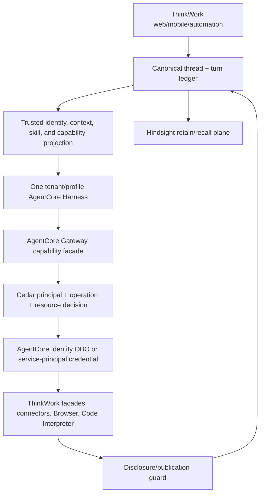
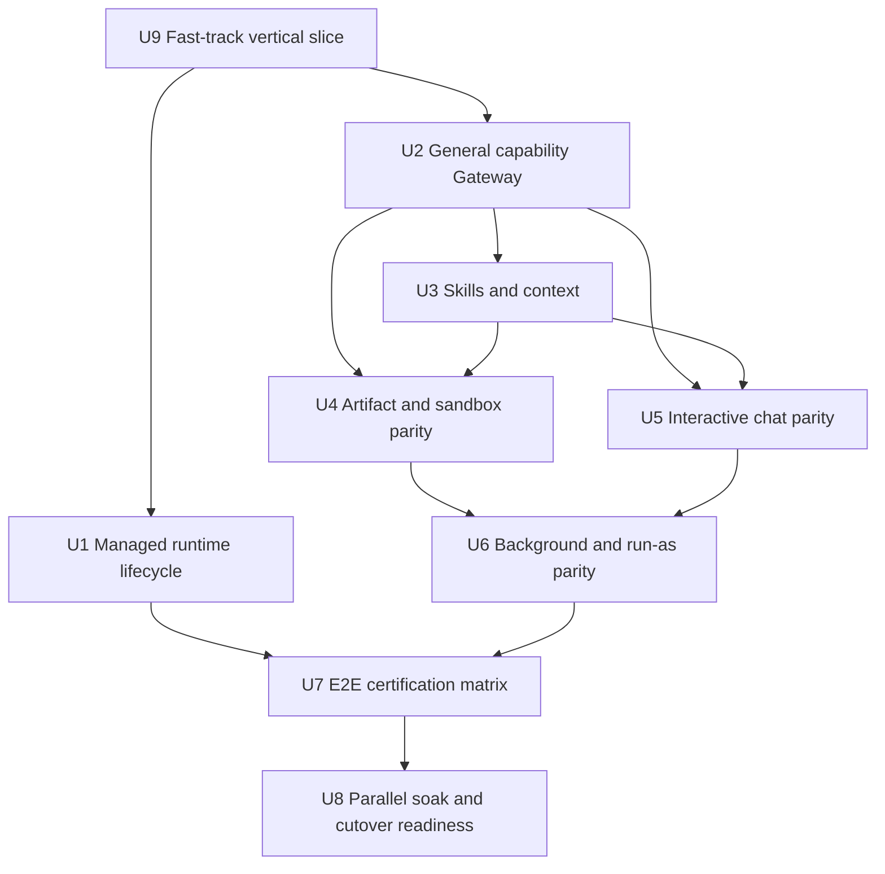
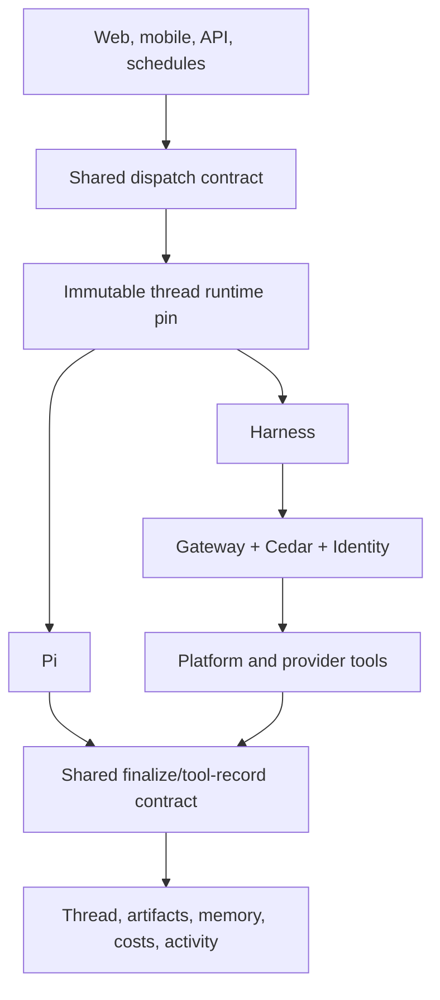

# feat: Bring AgentCore Harness to Pi-retirement parity

## Overview

Promote the proven managed multiplayer AgentCore Harness path from a guarded proof adapter into ThinkWork's complete managed execution runtime. Pi and Harness remain independently selectable for newly created threads during a short validation window, but each thread is pinned to exactly one runtime for its lifetime. The implementation is complete only when the Harness supports ThinkWork's required direct-chat, tool, skill, memory, artifact, interactive-continuation, goal, and background-dispatch contracts without silent Pi fallback.

The architecture keeps one stable Harness per tenant and explicit trust/execution profile. Ordinary differences between users, agents, Spaces, skills, tools, and credentials do not create more Harnesses. ThinkWork projects the current participant and capability state for every turn; one AgentCore Gateway capability facade performs dynamic discovery and Cedar authorization; AgentCore Identity performs exact-user or service-principal credential resolution; Hindsight and the ThinkWork thread remain authoritative durable state.

The multiplayer proof is already green. A user-originated SurSum turn ran through the Harness with the persisted SurSum identity, no static per-user registration, no Pi fallback, and a total recorded cost of $0.012539. This plan starts from that evidence rather than repeating the proof.

---

## Problem Frame

The current branch proves the hard security and topology questions but still labels and implements the path as a trial:

| Surface           | Current state                                                           | Retirement requirement                                                                                   |
| ----------------- | ----------------------------------------------------------------------- | -------------------------------------------------------------------------------------------------------- |
| Runtime selection | Pi and proof Harness are pinned per new thread                          | Keep the same thread pin, remove proof-only UX and tenant/thread enrollment semantics                    |
| Human identity    | Exact participant is KMS-signed and preserved through two OBO exchanges | Generalize to every active tenant participant without a fixture allowlist                                |
| Dynamic tools     | One proof Gateway exposes two synthetic targets                         | Expose the complete authorized ThinkWork tool inventory through a policy facade                          |
| Skills            | Some static S3 skill materialization exists in the old projection       | Project the current user's authorized skill index and load skill bodies on demand                        |
| Memory            | Canonical public history is hydrated; Harness Memory is disabled        | Add governed Hindsight recall while retaining the existing post-turn memory pipeline                     |
| Interactive chat  | Basic text and `emit_document` work                                     | Add attachments, pinned skills, user questions/resume, Goal mode, and skill-creator turns                |
| Platform tools    | Most are explicitly excluded                                            | Port required web, context, knowledge, canvas, email, status, Browser, and Code Interpreter capabilities |
| Dispatch channels | Direct chat only                                                        | Add wakeups, schedules, resumptions, evaluations, and explicit run-as/service-principal semantics        |
| Operations        | Proof profile and proof alarms                                          | Add tenant lifecycle, rollout, SLOs, admission control, rollback, and cutover evidence                   |

The key smell to avoid is rebuilding Pi's internal loop around Harness. ThinkWork should retain product orchestration, policy, persistence, and caller-fulfilled UI actions, while Harness owns the model/tool loop. The other smell is relying on Harness tool visibility as authorization. Gateway Policy and the downstream target must independently authorize every governed operation.

---

## Requirements Trace

- R1. A tenant operator can select Pi or AgentCore Harness as the default for new threads; existing threads keep their pinned runtime and history.
- R2. Every Harness turn derives its human, service-principal, tenant, Space, agent, and thread identity from persisted server state and fails closed when that state is ambiguous.
- R3. Ordinary tenant users require no Terraform, Harness, or credential-provider registration. OAuth providers are registered once per downstream integration; user grants are stored per user in AgentCore Identity Token Vault.
- R4. One Harness serves a tenant/default trust profile. Additional Harnesses are allowed only for hard boundaries such as privileged execution, VPC/filesystem isolation, regulatory region, or independent operator ownership.
- R5. The current user's authorized tool inventory is discovered dynamically through AgentCore Gateway; Cedar and the target enforce the same principal, tenant, operation, and resource boundary.
- R6. The current user's skill index and skill bodies come from the trusted capability/workspace projection and cannot expose another user's private or unassigned skills.
- R7. The ThinkWork thread, artifacts, continuations, and Hindsight remain canonical. Harness sessions are disposable per-turn execution caches.
- R8. Required direct-chat behavior has parity: text, model selection, shared-thread context, attachments, pinned skills, artifacts, user questions/resume, Goal mode, and skill-creator commands.
- R9. Required tool behavior has parity: MCP connectors, document emission, web search/extract, Context Engine and knowledge graph, canvases, email, work-item status, Browser, and Code Interpreter, subject to existing capability policy.
- R10. Background behavior has parity: question resumes, wakeups, schedules, automations, evaluation replays, and supported run-as/service-principal executions never silently fall back to Pi.
- R11. Every runtime emits the durable shared tool-invocation record contract, usage, cache tokens, cost, traces, and explicit failure diagnostics.
- R12. A one-day parallel soak proves identity isolation, tool/skill variance, canonical memory, latency/cost, error rate, and rollback before the default changes to Harness.
- R13. Pi is not deleted during this plan. Retirement occurs only after the soak passes, production capacity is admitted, and rollback is rehearsed.
- R14. Capability discovery is advisory only. Every invocation and target independently re-read canonical membership, assignment, policy/grant revision, revocation, and resource ownership before resolving credentials or causing side effects.
- R15. Tool inputs, outputs, errors, traces, and artifacts cross one allowlist-based redaction boundary before persistence or telemetry; secret canaries must have zero matches across every durable and user-visible surface.

---

## Scope Boundaries

- Do not create a Harness per user, thread, Space, logical agent, ordinary skill set, or ordinary tool set.
- Do not copy raw OAuth tokens or connector secrets into Harness configuration, prompts, session state, telemetry, or persisted tool records.
- Do not make Harness Memory authoritative or maintain a second public-thread transcript.
- Do not route Harness failures to Pi. A failed Harness turn remains an explicit failed Harness turn.
- Do not mutate a thread's runtime after its first agent turn. Runtime changes apply only to new threads.
- Do not expose the runtime selector to ordinary tenant members; it remains an operator rollout control.
- Do not delete Pi, its data, or its infrastructure until a separate retirement action is explicitly authorized after the soak.

### Deferred to Follow-Up Work

- Pi infrastructure deletion and code removal: separate irreversible retirement change after the soak and rollback window.
- Additional hard-boundary Harness profiles: add only when a concrete VPC, filesystem, regional, regulatory, or privileged-execution requirement exists.

---

## Context & Research

### Relevant Code and Patterns

- `packages/api/src/lib/harness/runner.ts` already owns Bearer invocation, event-stream assembly, caller-fulfilled document continuation, explicit failures, usage, and fresh-session lifecycle.
- `packages/api/src/handlers/harness-runner.ts` is a data-plane-only adapter and already mints a short-lived assertion from the persisted running turn.
- `packages/api/src/lib/harness/thread-runtime-policy.ts` and `packages/api/src/graphql/resolvers/threads/createThread.mutation.ts` already pin new threads to Pi or Harness while allowing both runtimes to coexist.
- `packages/api/src/lib/harness/projection.ts` is a useful parity inventory, but its trial exclusions and static MCP headers are not the production transport.
- `packages/api/src/lib/capabilities/manifest-compile.ts`, `packages/api/src/lib/capabilities/current-manifest.ts`, and `packages/api/src/lib/resolve-agent-runtime-config.ts` remain the authoritative capability sources.
- `packages/api/src/handlers/chat-agent-invoke.ts` and `packages/api/src/handlers/wakeup-processor.ts` are the two payload builders that must converge on one runtime-neutral dispatch contract.
- `packages/api/src/lib/chat-finalize/process-finalize.ts` remains the publication, cost, trace, retention, and stale-generation authorization fence.
- `terraform/modules/app/agentcore-harness/` owns stable Harness/version/endpoint lifecycle and must be promoted from pilot/proof naming and inputs.
- `packages/lambda/agentcore-proof-oauth-provider.ts` and `packages/lambda/agentcore-identity-boundary-target.ts` prove the two-exchange exact-user contract; production targets must use real provider registrations and policy facades rather than proof fixtures.

### Institutional Learnings

- `docs/solutions/architecture-patterns/runtime-swap-tool-parity-and-record-contract.md` requires an explicit inventory diff and one durable tool-record shape across runtimes.
- `docs/solutions/architecture-patterns/first-party-provider-tools-stay-behind-policy-facades-2026-06-14.md` requires provider-specific affordances to stay behind established policy facades.
- `docs/solutions/architecture-patterns/wakeup-processor-payload-parity-with-chat-agent-invoke-2026-06-12.md` requires direct-chat and wakeup builders to share every runtime-gated field.
- `docs/solutions/architecture-patterns/workspace-skills-load-from-copied-agent-workspace-2026-04-28.md` makes the resolved workspace projection—not a stale catalog copy—the execution source.
- `docs/solutions/architecture-patterns/agentcore-harness-multiplayer-proof-verdict-2026-07.md` proves one shared Harness, fresh sessions, canonical public state, exact-user OBO, and zero Pi fallback.

### External References

- AWS's official AgentCore Harness OAuth/Gateway sample uses custom-JWT inbound authentication, Bearer Harness invocation, native Gateway tools, and outbound OAuth.
- AWS's official Identity samples register an OAuth credential provider once for an integration while storing authorization-code grants in Token Vault under the workload and individual user. Ordinary application users are not separate provider resources.
- AWS's official samples expose Browser and Code Interpreter as managed services. ThinkWork should call them through its governed capability facade when per-user policy must remain authoritative.
- AWS Harness configuration and named endpoints are control-plane/version concerns; per-turn identity and canonical context travel on the data plane.

---

## Key Technical Decisions

| Decision                 | Selected approach                                                                                                                      | Why                                                                                                                                    |
| ------------------------ | -------------------------------------------------------------------------------------------------------------------------------------- | -------------------------------------------------------------------------------------------------------------------------------------- |
| Dynamic user tools       | One AgentCore Gateway capability facade with Cedar-filtered discovery and invocation                                                   | Tool variance stays per user without Harness multiplication; visibility and authorization share one policy source                      |
| Dynamic skills           | Project an authorized skill index into the turn and load bodies/references through a governed `workspace_skill`/read facade            | Harness-native skills are version-time configuration and cannot safely represent per-user assignment changes                           |
| Credentials              | Identity OBO for user tools; explicit service-principal tokens for ownerless work                                                      | No raw secrets in Harness and no fake human identity                                                                                   |
| Connector migration      | Keep LastMile on a tenant service credential; register Twenty once in Identity and acquire a distinct Token Vault grant per user       | Service and human OAuth ownership are different security contracts; existing Secrets Manager tokens are not silently copied            |
| Browser/Code Interpreter | Wrap managed AgentCore services behind the same policy facade                                                                          | Native static Harness tool inclusion is not a per-user authorization boundary                                                          |
| Discovery semantics      | Treat `tools/list` as advisory and reauthorize from canonical state at `tools/call` and again inside the target                        | Revocation, role changes, and resource ownership changes must take effect after discovery                                              |
| Tool evidence            | Targets append start and terminal events to a turn-correlated execution ledger; finalization joins that ledger into the shared record  | Native Gateway calls are not returned in the Harness response stream and cannot be inferred from model prose                           |
| Telemetry redaction      | One allowlist-based scrubber runs before logs, traces, ledger records, artifacts, and UI payloads                                      | Provider errors and payload previews can otherwise persist OAuth tokens, cookies, vault handles, or cross-user data                    |
| Memory                   | Canonical thread hydration plus governed Hindsight tools; existing post-turn retention remains                                         | Avoids a second memory authority and preserves current user/Space scoping                                                              |
| Sessions                 | Fresh per turn                                                                                                                         | The proof found only an 11.07% reuse benefit, below the accepted complexity threshold                                                  |
| Runtime coexistence      | Immutable runtime pin per thread; selector controls only new threads                                                                   | Enables clean A/B validation without cross-runtime session/history ambiguity                                                           |
| Guardrails               | Apply the selected ingress/publication guardrail at ThinkWork's authorization fences and keep all tool output behind disclosure policy | Harness does not expose the existing per-invocation Bedrock guardrail field; equivalence must be proven before guarded agents cut over |

Provider registration and user registration are separate concepts. A GitHub, Google, or other OAuth application is registered once as an AgentCore Identity credential provider. Each user authorizes that provider as needed, and Token Vault stores the resulting grant under that user/workload tuple. A normal ThinkWork user becomes eligible for Harness turns through persisted tenant membership and the signed turn assertion—not through Terraform.

---

## High-Level Technical Design

> This illustrates the intended approach and is directional guidance for review, not implementation specification. The implementing agent should treat it as context, not code to reproduce.

The trusted projection contains a concise skill/tool index, not raw credentials. The model loads an authorized skill body or calls a tool through Gateway. Gateway independently filters discovery and authorizes invocation from the exact signed principal. Target handlers repeat tenant/resource ownership checks and return a disclosure-safe result. Finalization persists the assistant message, artifact references, tool records, usage, cost, and memory-retention event through the existing transactional fence.

---

## Implementation Units

### Fast-track acceptance slice

Before broad parity work, the current dev Harness must pass four user-visible
vertical slices through normal Composer threads. These are the immediate order
of execution and the go/no-go gate for the rest of the plan:

1. **Real MCP access:** run read-only queries against both the LastMile
   Datasource MCP and Twenty CRM through Harness, with exact-user policy and
   credential evidence. A Pi result does not count.
2. **Plate-backed HTML artifact:** use MCP data to produce a real HTML document
   artifact through `emit_document`, including plate selection,
   validation/retry, compiled `render.html`, artifact card, and reload.
3. **Managed code sandbox:** execute a deterministic calculation/file task
   through the policy-governed AgentCore Code Interpreter boundary and return
   the result to the same Harness turn.
4. **Turn evidence:** display and persist runtime=`harness`, model, duration,
   every tool call and status, bounded redacted input/output summaries, token/cache usage, LLM and
   AgentCore compute costs, identity/policy diagnostics, and explicit failures.

All four tests start from Settings → Runtime = AgentCore Harness → Save → New
thread. The test harness must reject a thread pinned to Pi rather than accepting
its output as Harness evidence.

- U9. **Deliver the four fast-track Harness vertical slices**

**Goal:** Prove, through normal new Composer threads on the currently
provisioned dev Harness, real LastMile and Twenty MCP access, one plate-backed
HTML artifact, one managed Code Interpreter task, and complete durable turn
evidence before broadening the runtime.

**Requirements:** R2, R3, R5, R8, R9, R11, R14, R15

**Dependencies:** None

**Files:**

- Create: `packages/api/src/handlers/harness-capability-mcp.ts`
- Create: `packages/api/src/handlers/harness-code-interpreter-target.ts`
- Create: `packages/api/src/lib/harness/fast-track-evidence.ts`
- Create: `packages/api/src/lib/harness/tool-execution-ledger.ts`
- Create: `packages/api/src/lib/harness/tool-record-redaction.ts`
- Create: `packages/api/scripts/proofs/agentcore-harness-fast-track.ts`
- Modify: `packages/api/src/lib/harness/runner.ts`
- Modify: `packages/api/src/handlers/harness-runner.ts`
- Modify: `packages/api/src/lib/mcp-configs.ts`
- Modify: `packages/api/src/handlers/mcp-oauth.ts`
- Modify: `packages/api/src/lib/artifacts/document-emission.ts`
- Modify: `packages/api/src/lib/chat-finalize/process-finalize.ts`
- Modify: `packages/database-pg/src/schema/harness-multiplayer.ts`
- Create: `packages/database-pg/drizzle/0263_harness_tool_execution_ledger.sql`
- Modify: `terraform/modules/app/agentcore-harness/main.tf`
- Modify: `terraform/modules/app/agentcore-gateway/main.tf`
- Modify: `terraform/modules/app/agentcore-identity/main.tf`
- Modify: `terraform/modules/app/lambda-api/handlers.tf`
- Modify: `terraform/modules/app/lambda-api/iam-grouped.tf`
- Modify: `terraform/modules/app/lambda-api/mcp-oauth.tf`
- Modify: `terraform/modules/thinkwork/main.tf`
- Modify: `apps/web/src/components/workbench/TaskThreadView.tsx`
- Test: `packages/api/src/handlers/harness-capability-mcp.test.ts`
- Test: `packages/api/src/handlers/harness-code-interpreter-target.test.ts`
- Test: `packages/api/src/lib/harness/runner.test.ts`
- Test: `packages/api/src/lib/harness/fast-track-evidence.test.ts`
- Test: `packages/api/src/lib/harness/tool-execution-ledger.test.ts`
- Test: `packages/api/src/lib/harness/tool-record-redaction.test.ts`
- Test: `apps/web/src/components/workbench/TaskThreadView.convergence.test.tsx`

**Approach:** Add the smallest production-shaped capability path to the current
Harness: a Gateway-visible MCP facade for the two real connectors, a governed
Code Interpreter execution target, plus the existing caller-fulfilled
`emit_document` pipeline. LastMile is a tenant-owned service-credential slice;
Twenty is a separate exact-user slice that registers the provider once with
AgentCore Identity and acquires each user's authorization-code grant in Token
Vault. Extend the existing `user_mcp_tokens`/Secrets Manager OAuth UI and
callbacks with an explicit Identity grant state and reauthorization flow;
never silently copy a stored refresh/access token into Token Vault.
Use the Twenty Pi turn `CHAT-1514` only as the behavior baseline; use the
Harness turn `CHAT-1515` as the captured failing characterization (Harness v2,
`tools_called=[]`). Do not generalize every tool, skill, memory, lifecycle, or
background surface inside this unit.

Every Gateway target writes an append-only execution ledger entry before
credential resolution and a terminal `completed`, `failed`, or `uncertain`
entry afterward, keyed by tenant, thread, turn, principal, tool-use id, policy
revision, and idempotency key. Finalization joins these target-side records with
the Harness result instead of relying on the runner's caller-fulfilled
`toolInvocations` array. Provider request ids and separately sourced LLM,
Harness-compute, and provider costs are retained; turn wall time is never
reported as provider cost.

Give the slice a closed evidence schema. Every accepted test turn must correlate
the immutable thread runtime pin, active Harness enrollment, Harness turn row,
Harness ARN/version/qualifier, runtime session id, Gateway policy decision,
tool invocation and target/provider result, token/cache counts, LLM cost,
AgentCore compute cost, duration, and final status. The evidence query must also
prove zero Pi runtime turns, Pi cost rows, and wakeup/Pi invocations for the
same turn. UI labels alone never satisfy the gate.

**Execution note:** Characterize the current failures first: `CHAT-1514` is Pi
and therefore inadmissible as Harness proof; `CHAT-1515` is genuine Harness but
has no callable Twenty tool. Implement each vertical slice test-first from
those facts.

**Test scenarios:**

- Fast-track MCP: a new Harness thread queries LastMile and persists a real,
  read-only dataset result with the exact acting principal, tenant service
  credential owner, and Gateway decision.
- Fast-track MCP: a new Harness thread returns the five latest open Twenty CRM
  opportunities using that participant's Identity Token Vault grant through
  recorded MCP calls; `tools_called=[]` is a failure even if the model writes a
  plausible answer. A second participant must authorize independently.
- Fast-track artifact: a Harness thread uses real MCP data to emit a selected
  plate, handles at least one conformance rejection/retry, persists
  `content.md` and compiled `render.html`, renders the artifact card, and still
  renders after reload.
- Fast-track sandbox: a Harness thread invokes managed Code Interpreter for a
  deterministic calculation and file result; policy, sandbox session, tool
  record, tokens, duration, and cost all bind to the same user/turn.
- Security: another participant cannot reuse the first user's MCP credential,
  Code Interpreter session, target result, or artifact ownership.
- Revocation: list a tool, revoke its assignment or user grant, then call it;
  invocation-time and target-time canonical checks deny before credential
  resolution, including alias and resource-id substitution attempts.
- Redaction: inject distinct secret canaries into service and user OAuth paths,
  provider failures, and sandbox output; scan database records, traces, logs,
  artifacts, prompts, and reloaded UI payloads for zero matches and prove one
  participant's provider values never enter another participant's evidence.
- Provenance: a Pi-pinned thread, missing Gateway decision, missing provider
  result, missing cost component, or any correlated Pi execution fails the
  evidence runner.

**Verification:** All four slices pass in the integrated browser and in the
authoritative evidence runner. This is the go/no-go gate for U1-U8.

- U1. **Promote proof lifecycle to the managed dual-runtime lifecycle**

**Goal:** Remove proof-only resource, readiness, and thread semantics while preserving one stable versioned Harness, exact thread runtime pins, and reversible Pi/Harness selection for new threads.

**Requirements:** R1, R2, R3, R4, R13

**Dependencies:** U9

**Files:**

- Modify: `terraform/modules/app/agentcore-harness/main.tf`
- Modify: `terraform/modules/app/agentcore-harness/variables.tf`
- Modify: `packages/api/src/lib/harness/proof-profile.ts`
- Modify: `packages/api/src/graphql/resolvers/tenant-agent/updateTenantAgent.mutation.ts`
- Modify: `packages/api/src/graphql/resolvers/threads/createThread.mutation.ts`
- Modify: `apps/web/src/components/settings/AgentConfigSheet.tsx`
- Test: `packages/api/src/lib/harness/proof-profile.test.ts`
- Test: `packages/api/src/graphql/resolvers/tenant-agent/updateTenantAgent.mutation.test.ts`
- Test: `apps/web/src/components/settings/AgentConfigSheet.test.tsx`

**Approach:** Rename the proof profile to a managed Harness profile, remove synthetic-owner and special proof-thread UX, enroll every new Harness-pinned thread transactionally, and keep existing Pi and Harness threads untouched when the default changes. Generalize profile lookup from one pilot slug to the current tenant/profile without adding hot-path create/update calls.

**Execution note:** Preserve the proven thread-pin and no-fallback tests before changing names or lifecycle behavior.

**Test scenarios:**

- Happy path: select Harness, save, create a normal Composer thread, and verify its immutable runtime pin and active managed enrollment.
- Happy path: switch the default back to Pi and verify new threads use Pi while the existing Harness thread continues on Harness.
- Edge case: change the default before a thread's first message and verify the thread keeps the runtime selected at creation.
- Error path: missing/unready tenant Harness profile prevents new Harness thread creation without affecting Pi threads.
- Integration: two tenants resolve only their own Harness/profile and execution role boundaries.

**Verification:** No UI or API asks users to create/open a “proof thread”; normal new threads work through the selected runtime and existing production threads remain readable.

- U2. **Build the identity-aware dynamic capability Gateway**

**Goal:** Replace proof targets and static MCP secret/header projection with one complete Gateway discovery and invocation facade driven by the current compiled capability manifest.

**Requirements:** R2, R3, R5, R9, R11, R14, R15

**Dependencies:** U9; generalize the fast-track facade after its live contract
is proven.

**Files:**

- Create: `packages/api/src/handlers/harness-capability-mcp.ts`
- Create: `packages/api/src/lib/harness/capability-gateway.ts`
- Create: `packages/api/src/lib/harness/tool-execution-ledger.ts`
- Create: `packages/api/src/lib/harness/tool-record-redaction.ts`
- Modify: `packages/api/src/lib/harness/projection.ts`
- Modify: `packages/api/src/handlers/turn-assertion-mint.ts`
- Modify: `packages/api/src/lib/mcp-configs.ts`
- Modify: `packages/api/src/handlers/mcp-oauth.ts`
- Modify: `terraform/modules/app/agentcore-harness/main.tf`
- Modify: `terraform/modules/app/agentcore-gateway/main.tf`
- Modify: `terraform/modules/app/agentcore-identity/main.tf`
- Modify: `terraform/modules/app/lambda-api/handlers.tf`
- Modify: `terraform/modules/app/lambda-api/iam-grouped.tf`
- Modify: `terraform/modules/app/lambda-api/mcp-oauth.tf`
- Modify: `terraform/modules/thinkwork/main.tf`
- Test: `packages/api/src/handlers/harness-capability-mcp.test.ts`
- Test: `packages/api/src/lib/harness/capability-gateway.test.ts`
- Test: `packages/api/src/lib/harness/tool-execution-ledger.test.ts`
- Test: `packages/api/src/lib/harness/tool-record-redaction.test.ts`
- Test: `packages/api/src/handlers/turn-assertion-mint.test.ts`

**Approach:** Expose a stable MCP facade as the Harness's single ordinary tool entry point. Resolve `tools/list` from the persisted turn, participant, manifest, Space, and current policy revision, but treat that response as advisory only. On every `tools/call`, re-read canonical tenant membership, participant state, manifest assignment, policy/grant revision, revocation, and resource ownership, then repeat ownership and policy checks inside the target before credential resolution or side effects. Use Identity OBO for user-owned providers and explicit service-principal tokens for supported ownerless operations. Keep LastMile's tenant service credential distinct from Twenty's provider-once/user-grant lifecycle. Remove all credential-bearing headers from Harness config. Every target appends sanitized start and terminal ledger events for finalization to join.

**Execution note:** Start with cross-user negative tests and a failing secret-leak scan before adding positive tool routes.

**Test scenarios:**

- Fast-track integration: a new Harness-pinned thread queries the LastMile
  Datasource MCP and persists real provider data with runtime `harness`.
- Fast-track integration: a separate new Harness-pinned thread lists the five
  latest open Twenty CRM opportunities and records the exact MCP calls and
  acting user.
- Happy path: Alice and Bob list different tools from the same Harness/Gateway based on their manifests.
- Happy path: an OAuth-backed tool resolves the calling user's Token Vault grant without per-user infrastructure registration.
- Error path: Bob calls a tool omitted from Bob's discovery but granted to Alice; Cedar denies before target/credential resolution.
- Error path: Alice lists a tool, an operator revokes its assignment or Identity grant, and Alice's subsequent call is denied from fresh canonical state before credential resolution.
- Error path: tool alias, provider resource id, tenant id, or owner id substitution cannot turn a discovered descriptor into a different authorization target.
- Error path: a mismatched participant, tenant, turn, tool input hash, audience, or expired assertion is denied.
- Edge case: provider requires consent; return the existing authorization-required continuation without exposing a token or trusting a caller-supplied user id.
- Integration: tool discovery, policy decision, Identity credential, target owner, durable tool record, and trace all carry the same redacted principal hash.

**Verification:** No runtime configuration contains connector tokens, and the dynamic per-user tool problem is solved without more Harnesses.

- U3. **Project dynamic skills, workspace reads, and canonical memory**

**Goal:** Give the Harness the same authorized per-turn skill and knowledge context as Pi without static user-specific Harness configuration or Harness-owned durable memory.

**Requirements:** R6, R7, R8, R9

**Dependencies:** U2

**Files:**

- Create: `packages/api/src/lib/harness/turn-context-projection.ts`
- Create: `packages/api/src/lib/harness/workspace-tools.ts`
- Modify: `packages/api/src/lib/harness/runner.ts`
- Modify: `packages/api/src/lib/harness/thread-public-state.ts`
- Modify: `packages/api/src/handlers/chat-agent-invoke.ts`
- Test: `packages/api/src/lib/harness/turn-context-projection.test.ts`
- Test: `packages/api/src/lib/harness/workspace-tools.test.ts`
- Test: `packages/api/src/lib/harness/runner.test.ts`

**Approach:** Put a concise authorized skill/tool index and current requester/Space context in the signed turn projection. Expose `workspace_skill` and read-only workspace references through U2 so Harness can fetch only currently authorized skill bodies and references. Route Hindsight recall through the existing Context Engine facade with user/Space scope; retain assistant output through the existing post-finalize memory pipeline. Never use Harness Memory as a second source of truth.

**Test scenarios:**

- Happy path: Alice loads an Alice-assigned skill and receives its body/reference; Bob cannot list or load it.
- Happy path: both users load a Space-shared skill and shared memory while private recall remains user-scoped.
- Edge case: a skill assignment changes between turns; the next fresh turn sees the new manifest without a Harness version change.
- Error path: stale skill id, path traversal, secret-bearing file, or cross-tenant S3 key is rejected and omitted from telemetry.
- Integration: an Alice/Bob/Alice thread hydrates the full public prefix once while each turn receives only its current private projection.

**Verification:** Dynamic skills and canonical memory work on one Harness with no user-private material in the shared transcript or another participant's prompt.

- U4. **Prove plate-backed artifacts, managed sandbox, and the required platform tool surface**

**Goal:** Close the explicit trial exclusions for tools required by normal ThinkWork agents while preserving existing policy facades and durable tool records.

**Requirements:** R5, R7, R9, R11, R14, R15

**Dependencies:** U2, U3

**Files:**

- Modify: `packages/api/src/lib/harness/runner.ts`
- Modify: `packages/api/src/lib/harness/projection.ts`
- Create: `packages/api/src/handlers/harness-code-interpreter-target.ts`
- Create: `packages/api/src/lib/harness/sandbox-session-policy.ts`
- Modify: `packages/api/src/lib/harness/tool-execution-ledger.ts`
- Modify: `packages/api/src/lib/artifacts/document-emission.ts`
- Modify: `terraform/modules/app/lambda-api/handlers.tf`
- Modify: `terraform/modules/app/lambda-api/iam-grouped.tf`
- Reference: `packages/pi-aws/connectors/agentcore-codeinterpreter.ts`
- Test: `packages/api/src/lib/harness/runner.test.ts`
- Test: `packages/api/src/__tests__/pi-runtime-capability-smoke.test.ts`
- Test: `packages/api/src/handlers/harness-code-interpreter-target.test.ts`
- Test: `packages/api/src/lib/harness/sandbox-session-policy.test.ts`

**Approach:** Inventory Pi's effective tool surface and route each required capability through U2. Keep `emit_document` and other UI/stateful actions as generic caller-fulfilled continuations; keep Context Engine/knowledge providers behind their current facade; wrap web, email, canvas, and status operations in exact-user policy handlers. Implement Code Interpreter as a dedicated governed execution target using the existing Pi connector only as a wire-contract reference; the admin Lambda remains control-plane provisioning only. The target owns Start/Invoke/Stop, bounded execution, cleanup, logging, file-result-to-artifact bridging, and target-side ledger events.

Disable direct/native Harness Code Interpreter access so Gateway is the only entry point. Bind each sandbox session and every file handle to the exact tenant, participant/service principal, thread, turn, and tool-use id. Default-deny network egress; allow only explicitly approved imports/exports; enforce time, CPU/memory, invocation, file-count, file-size, and content-type budgets; scan and sanitize outputs before artifact publication; stop sessions in success and failure paths and expire orphaned handles by TTL.

**Test scenarios:**

- Fast-track integration: use LastMile or Twenty MCP data to emit a plate-backed
  HTML document; verify conformance rejection/retry, `content.md`, compiled
  `render.html`, artifact ownership, card rendering, and reload.
- Fast-track integration: run a deterministic calculation and file-generation
  task in AgentCore Code Interpreter; verify the exact user/policy decision,
  sandbox result, tool record, tokens, duration, and cost on the Harness turn.
- Happy path: document emission preserves validation/retry, artifacts, render, ownership, and reload-safe tool detail.
- Happy path: web/context/knowledge calls return real provider evidence only when enabled for the participant.
- Happy path: Browser and Code Interpreter sessions are created through policy-authorized targets and never become globally available merely because the Harness knows the tool name.
- Error path: a disabled, over-budget, or cross-owner tool fails before provider side effects.
- Error path: cross-user/cross-turn session or file-handle replay, forbidden network egress, stale session, and oversized or malicious output are denied and leave no reusable session.
- Error path: ambiguous side-effect response does not retry automatically and records an explicit uncertain outcome.
- Integration: parity inventory compares Pi and Harness tool names, schemas, policy aliases, and persisted record fields with no silent exclusions.
- Integration: the thread detail view labels the turn as Harness and renders
  every MCP, artifact, and sandbox tool call from durable records after reload.

**Verification:** Every enabled required tool either succeeds through Harness or has an explicit certified incompatibility that blocks cutover; none merely disappears from the model surface.

- U5. **Close interactive Composer parity**

**Goal:** Support the complete user-driven thread contract on Harness: attachments, pinned skills, question cards/resume, Goal mode, skill creator, model choice, and guardrail/publication behavior.

**Requirements:** R1, R7, R8, R11

**Dependencies:** U2, U3

**Files:**

- Modify: `packages/api/src/lib/harness/runner.ts`
- Modify: `packages/api/src/handlers/chat-agent-invoke.ts`
- Modify: `packages/api/src/lib/goal-mode.ts`
- Modify: `packages/api/src/lib/user-questions/intake.ts`
- Modify: `packages/api/src/lib/chat-finalize/process-finalize.ts`
- Modify: `apps/web/src/components/workbench/TaskThreadView.tsx`
- Test: `packages/api/src/lib/harness/runner.test.ts`
- Test: `packages/api/src/handlers/chat-agent-invoke.runtime-routing.test.ts`
- Test: `apps/web/src/components/workbench/goal-mode.test.ts`

**Approach:** Replace `UNSUPPORTED_PAYLOAD_FIELDS` with runtime-neutral contracts. Attachments become authorized artifact/file references plus governed reads; pinned skills enter U3's projection; user questions use a generic continuation result and resume event; Goal mode persists orchestration state between fresh Harness turns instead of recreating an inner model loop; skill-creator commands use their existing trusted pipeline. Apply selected input/output guardrails and the publication fence around every final response.

**Test scenarios:**

- Happy path: attach a file, pin a skill, and receive an answer grounded only in those authorized inputs.
- Happy path: Harness emits a question card, a user answers, and the same logical goal resumes on Harness with no Pi turn.
- Happy path: Goal mode persists budget/progress and completes across multiple fresh Harness invocations.
- Error path: unsupported attachment type, stale question answer, expired goal budget, or guardrail rejection finalizes explicitly.
- Integration: web and mobile clients render identical messages, artifacts, question cards, activity, and costs for Pi and Harness turns.

**Verification:** A normal user cannot distinguish Harness from Pi by missing Composer features or malformed thread records.

- U6. **Unify background dispatch and run-as identity**

**Goal:** Make wakeups, schedules, automations, resumptions, and evaluations use the same runtime-neutral projection and explicit identity model as direct chat.

**Requirements:** R2, R5, R10, R11

**Dependencies:** U4, U5

**Files:**

- Create: `packages/api/src/lib/runtime-dispatch-payload.ts`
- Modify: `packages/api/src/handlers/chat-agent-invoke.ts`
- Modify: `packages/api/src/handlers/wakeup-processor.ts`
- Modify: `packages/api/src/lib/resolve-runtime-function-name.ts`
- Modify: `packages/api/src/lib/evals/agentcore-direct.ts`
- Test: `packages/api/src/handlers/chat-invoke-identity-parity.test.ts`
- Test: `packages/api/src/handlers/wakeup-processor.system-prompt.test.ts`
- Test: `packages/api/src/__tests__/workspace-wakeup-payload.test.ts`

**Approach:** Extract one canonical dispatch builder shared by chat and wakeup paths. Human resumptions use the persisted answering participant; scheduled personal work uses its configured run-as user; tenant-wide ownerless work uses an explicit service principal with narrower Cedar policy and no access to user grants. Remove the `HarnessChatDispatchOnlyError` only after every supported channel has tests and a target identity contract.

**Test scenarios:**

- Happy path: a question answer, scheduled user job, and automation all remain on the thread's pinned Harness runtime.
- Happy path: an ownerless tenant job uses a service principal and only service-approved tools.
- Error path: missing run-as identity, disabled service principal, or user-only credential request fails without substituting the paired human or Pi.
- Edge case: duplicate wakeup delivery reuses idempotency state and cannot publish twice.
- Integration: direct-chat and wakeup payload parity tests compare all identity, skill, tool, memory, attachment, guardrail, and cost fields.

**Verification:** No supported application dispatch path is Harness-chat-only, and all unsupported run-as cases are explicitly visible before Pi retirement.

- U7. **Run the complete application certification matrix**

**Goal:** Prove the managed runtime through real ThinkWork web/mobile/API flows, real Gateway/Identity targets, and persisted provider/database evidence.

**Requirements:** R1-R12, R14, R15

**Dependencies:** U1, U6

**Files:**

- Create: `packages/api/scripts/proofs/agentcore-harness-retirement-certification.ts`
- Create: `docs/solutions/architecture-patterns/agentcore-harness-retirement-certification-2026-07.md`
- Modify: `packages/api/src/__tests__/pi-runtime-capability-smoke.test.ts`
- Test: `packages/api/src/__tests__/agentcore-harness-retirement-certification.test.ts`

**Approach:** Use two real non-production users and at least two different capability/credential sets. Exercise direct chat, shared-thread interleaving, skills, private/shared memory, attachments, artifacts, interactive continuation, Goal mode, required tools, a background dispatch, session reconstruction, denial controls, and Pi/Harness parallel thread pins. Query authoritative database, logs, policy decisions, Identity ownership, usage, costs, and wakeups; do not accept screenshots alone.

**Test scenarios:**

- Integration: Eric/SurSum/Eric shared thread preserves one logical agent, all public contributions, and exact current-user private context.
- Integration: each user sees only their skills, tools, credentials, and memories; forced cross-user operations fail before target access.
- Integration: discover a tool, revoke its assignment or Identity grant, and prove the subsequent call and all alias/resource substitutions fail before credential lookup or provider access.
- Security: seed unique secret canaries in request headers, OAuth failures, provider payloads, and sandbox output, then scan database rows, traces, logs, artifacts, prompts, and reloaded UI responses for zero matches.
- Integration: create one Pi thread and one Harness thread from the selector and run both concurrently without changing the other.
- Failure path: rotate/revoke credentials, break Gateway authorization, and invalidate a session; each failure is explicit and recovery uses canonical state.
- Regression: every Harness turn has runtime `harness`, complete usage/cost/tool records, and zero Pi wakeups or fallback invocations.

**Verification:** The certification document gives a binary parity verdict and names any residual blocker; a green verdict is required before the soak starts.

- U8. **Operate the parallel soak and prepare cutover**

**Goal:** Run Pi and Harness in parallel long enough to measure production-shaped behavior, rehearse rollback, and make Pi retirement a low-risk operational action.

**Requirements:** R1, R11, R12, R13

**Dependencies:** U7

**Files:**

- Create: `docs/runbooks/agentcore-harness-cutover.md`
- Modify: `terraform/modules/app/agentcore-harness/observability.tf`
- Modify: `apps/web/src/components/settings/AgentConfigSheet.tsx`
- Test: `apps/web/src/components/settings/AgentConfigSheet.test.tsx`

**Approach:** Keep both runtime options for the soak, monitor by immutable thread pin, and define objective gates for success/error rate, p50/p95 latency, tokens, cost, policy denials, Identity errors, session reconstruction, forbidden data, and missing records. Rehearse switching the new-thread default Pi → Harness → Pi without mutating existing threads. Confirm account quota/admission controls before production-wide defaulting.

**Test scenarios:**

- Happy path: default changes affect only new threads and are visible in activity/cost diagnostics.
- Error path: Harness health or quota gate fails; new-thread default returns to Pi while existing Harness threads fail explicitly and remain inspectable.
- Operational: rollback preserves all canonical messages, artifacts, memories, enrollments, and cost records.
- Soak: the full validation window has no cross-user disclosure, silent fallback, unowned cost, or missing usage rows.

**Verification:** An operator can make Harness the default or restore Pi in one reversible action, and the evidence supports a separate explicit Pi-retirement decision.

---

## System-Wide Impact

- **Interaction graph:** Clients create a runtime-pinned thread; both dispatch builders produce one trusted runtime-neutral payload; Harness uses Gateway/Identity for capabilities; both runtimes converge at the existing finalize and retention boundaries.
- **Error propagation:** Projection, policy, Identity, target, continuation, guardrail, quota, and stream failures finalize as explicit Harness errors. No layer invokes Pi as recovery.
- **State lifecycle risks:** Runtime-pin drift, duplicate wakeups, stale capability snapshots, ambiguous side effects, provider revocation, and delayed finalization require generation/idempotency fences and canonical recovery.
- **API surface parity:** Web, mobile, GraphQL, direct Lambda dispatch, wakeups, schedules, automations, and evals must honor the same runtime pin and identity contract.
- **Integration coverage:** Unit mocks cannot prove Harness auth, Cedar filtering, Identity ownership, OAuth consent, managed Browser/Code Interpreter, quotas, or provider costs; U7 and U8 require live provider evidence.
- **Unchanged invariants:** Cognito authenticates people; ThinkWork owns tenant membership and the canonical thread; Hindsight owns durable scoped memory; Gateway Policy is the tool authorization boundary; Pi remains available until explicitly retired.

---

## Success Metrics

- Two real users complete the shared-thread matrix with one logical agent and zero private cross-user disclosures.
- Every required tool/skill appears only for its authorized principal and succeeds through the intended policy facade.
- Every OAuth-backed call resolves the correct user grant without per-user infrastructure registration.
- Direct chat, question resume, Goal mode, at least one scheduled/background flow, artifacts, attachments, memory recall/retain, Browser, and Code Interpreter have live Harness evidence.
- Harness and Pi threads execute concurrently with immutable independent runtime pins.
- Every Harness turn has usage, cache-token fields, cost, tool records, trace, participant/session hashes, and explicit status.
- The soak records zero silent Pi fallback, zero unowned credentials/cost, zero missing finalization, and zero forbidden-value leakage.
- Every native Gateway target has a correlated start and terminal ledger event; LLM, Harness-compute, and provider costs retain distinct authoritative sources.
- Revocation after discovery takes effect before credential resolution, and certification secret canaries have zero matches in persistence, telemetry, artifacts, prompts, and UI payloads.
- Latency and cost thresholds are established from actual workload classes rather than one trivial identity prompt; regressions beyond the agreed gate block default cutover.

---

## Risk Analysis & Mitigation

| Risk                                                      | Likelihood | Impact   | Mitigation                                                                                                      |
| --------------------------------------------------------- | ---------- | -------- | --------------------------------------------------------------------------------------------------------------- |
| Gateway facade becomes a second custom agent loop         | Medium     | High     | It only resolves/discovers/executes tools and continuations; Harness retains model reasoning and tool selection |
| Dynamic skill instructions are too large                  | Medium     | Medium   | Project a concise index and fetch selected bodies/references on demand with bounded reads                       |
| Static Harness built-ins bypass per-user policy           | High       | Critical | Keep governed capabilities behind Gateway targets; use separate hard-boundary profile only when unavoidable     |
| Discovery snapshot outlives a role or grant               | Medium     | Critical | Treat discovery as advisory; re-read canonical authorization at invocation and inside every target              |
| Provider errors or previews persist secrets               | High       | Critical | Apply one allowlist redaction boundary before every durable/telemetry surface and run secret-canary scans       |
| Sandbox session or file handle crosses principals         | Medium     | Critical | Gateway-only access, exact principal/turn binding, default-deny egress, output scanning, strict budgets and TTL |
| Existing guardrail semantics cannot be reproduced exactly | Medium     | Critical | Prove ingress/publication equivalence and block guarded-agent cutover until the gap is resolved                 |
| Side-effect retry duplicates work                         | Medium     | Critical | Operation idempotency keys, stored sanitized results, no blind retry after ambiguous completion                 |
| Background run lacks a real human                         | High       | Critical | Explicit service-principal or configured run-as identity; never substitute an agent's paired human              |
| One-day soak misses long-tail capability failures         | Medium     | High     | Certification matrix precedes soak; soak validates operations/SLOs rather than discovering the basic inventory  |
| Quota increase remains pending                            | Medium     | High     | Implement admission control and safe-rate operation; do not default production beyond proven capacity           |
| PR grows too large to review safely                       | High       | High     | Land units as dependency-ordered commits/PRs with live gates; do not combine irreversible Pi deletion           |

---

## Phased Delivery

### Phase 1 — Production-shaped core

- U9 alone completes the fast-track acceptance slice on the existing dev
  Harness: LastMile, Twenty, HTML plate artifact, Code Interpreter, and complete
  correlated turn evidence.
- Only after U9 passes do U1-U3 remove proof-only lifecycle and generalize the
  capability, skill, and memory architecture without changing the proven
  transport contract.

### Phase 2 — Feature parity

- U4-U6 close tool, interactive Composer, and background dispatch exclusions. The retirement clock does not start while any required surface still routes only through Pi.

### Phase 3 — Certification and soak

- U7 runs the application/provider certification matrix.
- U8 runs the parallel soak, exercises rollback, and produces the cutover recommendation.

---

## Documentation / Operational Notes

- Replace “proof” terminology only as the corresponding lifecycle or fixture is removed; historical proof docs remain unchanged.
- Keep THINK-316 updated at each unit gate, deployed verification, soak start, rollback rehearsal, and final verdict.
- Record OAuth provider lifecycle separately from user grant lifecycle so operators do not interpret Token Vault authorization as user provisioning.
- Add dashboards and alarms before the soak, not after the default changes.
- Treat the pending KMS deletion and quota request as operational evidence; neither is a reason to stop safe implementation work.

---

## Sources & References

- `docs/plans/2026-07-17-002-feat-managed-multiplayer-harness-proof-plan.md`
- `docs/brainstorms/2026-07-17-think-316-managed-multiplayer-harness-requirements.md`
- `docs/solutions/architecture-patterns/agentcore-harness-multiplayer-proof-verdict-2026-07.md`
- `docs/solutions/architecture-patterns/agentcore-harness-identity-route-selection-2026-07.md`
- `docs/solutions/architecture-patterns/runtime-swap-tool-parity-and-record-contract.md`
- `docs/solutions/architecture-patterns/first-party-provider-tools-stay-behind-policy-facades-2026-06-14.md`
- `docs/solutions/architecture-patterns/wakeup-processor-payload-parity-with-chat-agent-invoke-2026-06-12.md`
- [AWS AgentCore Harness OAuth/Gateway sample](https://github.com/awslabs/agentcore-samples/blob/main/06-workshops/11-AgentCore-harness/01-advanced-examples/07-oauth/harness_oauth_gateway.ipynb)
- [AWS AgentCore Identity outbound authorization samples](https://github.com/awslabs/agentcore-samples/tree/main/06-workshops/03-AgentCore-identity)
- [AWS AgentCore Identity developer guide](https://docs.aws.amazon.com/bedrock-agentcore/latest/devguide/identity.html)
- [AWS AgentCore Gateway developer guide](https://docs.aws.amazon.com/bedrock-agentcore/latest/devguide/registry.html)
- [THINK-316](https://linear.app/thinkworkai/issue/THINK-316/brainstorm-agentcore-harness-as-thinkworks-managed-multiplayer)
- [PR #3888](https://github.com/thinkwork-ai/thinkwork/pull/3888)
