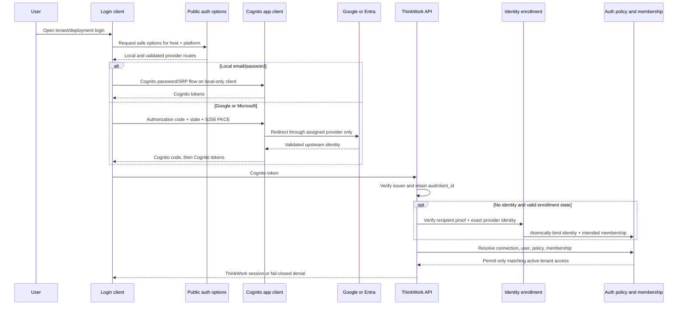
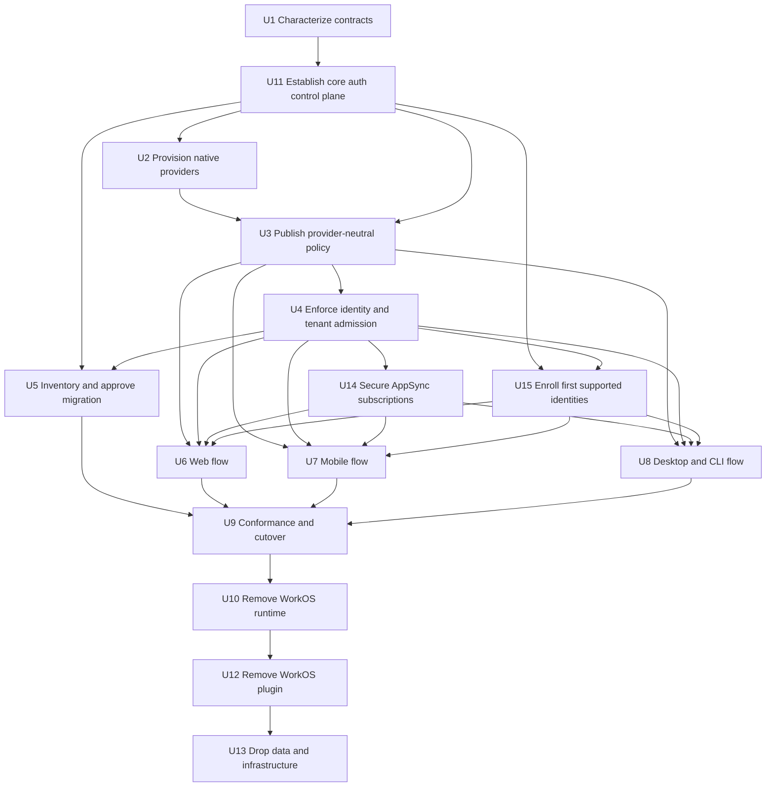
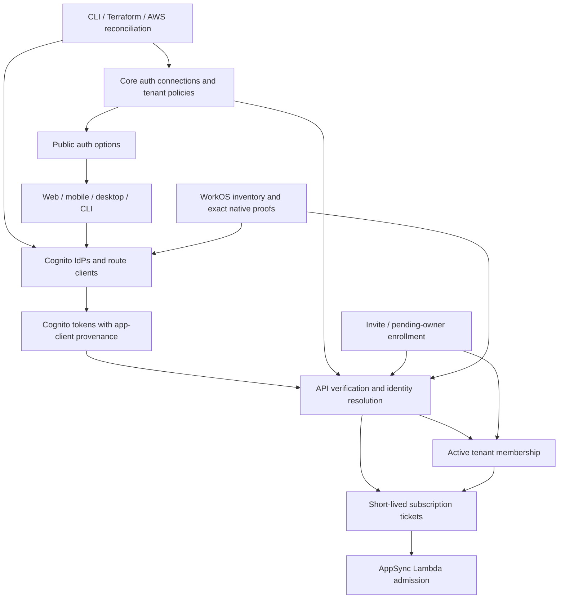

# feat: Replace WorkOS with Cognito-native federation

## Overview

Replace the WorkOS authentication broker and Cognito custom-auth bridge with
direct Amazon Cognito federation. ThinkWork will support four independently
controlled login paths: local Cognito email/password, Google, general Microsoft
work/school accounts, and tenant-specific Microsoft Entra OIDC. Every path ends
in the existing Cognito token contract.

The security boundary is stronger than a login-page toggle. Each authentication
path uses a Cognito app client that permits only its assigned provider and auth
flows. The validated app-client identifier in the Cognito token identifies the
path that created the session, and API authorization checks that path against
the independently requested tenant, that tenant's auth policy, and active
membership. Provider-specific Cognito subjects map many-to-one onto the stable
ThinkWork user; new providers are not consolidated into one Cognito profile.
WorkOS remains available only during a bounded, reversible migration window.

| Login path | Upstream trust | Cognito app-client boundary | Tenant admission |
| --- | --- | --- | --- |
| Local password | Cognito user pool | `COGNITO` only | Policy permits local + active membership |
| Google | Native Cognito Google IdP | `Google` only | Policy permits Google + active membership |
| General Microsoft | Entra `organizations` OIDC | General Microsoft IdP only | Policy permits general Microsoft + active membership |
| Tenant Entra | Tenant-GUID Entra OIDC | That tenant IdP only | Connection belongs to tenant + active membership |

---

## Problem Frame

WorkOS currently owns a second authentication control plane: plugin install
state, public option publication, WorkOS callbacks and sessions, a Cognito
custom-auth bridge, bridge/session persistence, provider-specific client
branches, and special logout behavior. The origin requirements replace that
shape with direct Cognito federation while preserving identity continuity,
tenant isolation, cross-client behavior, and Cognito as the only trusted token
issuer.

Direct provider configuration is already partly present, but it is not yet a
safe replacement. Generic OIDC exists in Terraform without a complete operator
mutation path; public auth options and clients are WorkOS-specific; current
pre-sign-up linking trusts email too broadly; and the API verifier accepts a set
of Cognito app clients without retaining which client issued the token. Hiding
general Microsoft on a tenant host would therefore be presentation only unless
the provider route and downstream tenant admission are also enforced.

---

## Requirements Trace

- R1. Preserve local Cognito email/password as an independently configurable option. → U2, U3, U6-U9, U15
- R2. Route Google directly through Cognito without WorkOS. → U1-U3, U6-U9, U15
- R3. Support general Microsoft work/school accounts through Entra `organizations`; exclude personal accounts. → U1-U3, U6-U9, U15
- R4. Support independently named tenant-specific Entra OIDC connections. → U1-U4, U6-U9, U15
- R5. Resolve host policy to multiple options; tenant Entra replaces general Microsoft by default while local and Google remain independent. → U3, U4, U6-U9, U15
- R6. Accept only Cognito-issued application tokens. → U1, U2, U4, U6-U10, U14-U15
- R7. Preserve the existing ThinkWork user and memberships for approved WorkOS migrations. → U1, U4, U5, U9, U15
- R8. Require a resolved ThinkWork user and active tenant membership after authentication. → U1, U4, U6-U9, U14-U15
- R9. Authorize tenant Entra by the configured connection/directory boundary, never email/domain. → U1-U4, U9, U14-U15
- R10. Fail closed on missing, unverified, ambiguous, or conflicting identity evidence. → U1, U4, U5, U14-U15
- R11. Onboard tenant Entra through the supported CLI/AWS deployment workflow. → U2, U3, U11
- R12. Keep a provider hidden until provider, callback, token, client, and policy validation passes. → U1-U3, U9
- R13. Keep provider secrets in server-side AWS systems and out of clients, output, and public config. → U2, U3, U10
- R14. Fail closed on drift while exposing safe operator diagnostics. → U2, U3, U9, U14
- R15. Reuse Cognito exchange, storage, refresh, and authorization across clients. → U6-U9, U14-U15
- R16. End the ThinkWork/Cognito session and require fresh provider/account selection without promising global upstream logout. → U6-U9
- R17. Use a reversible, evidence-gated cutover. → U1, U5, U9
- R18. Remove every supported WorkOS runtime, persistence, plugin, secret, route, and client dependency. → U9, U10, U12, U13

**Origin actors:** A1 end user, A2 tenant administrator, A3 ThinkWork operator, A4 ThinkWork platform, A5 Google or Microsoft Entra.

**Origin flows:** F1 local sign-in, F2 direct Google/general Microsoft, F3 tenant Entra, F4 existing-user migration, F5 logout/account switching.

**Origin acceptance examples:** AE1 standard local/Google/Microsoft options; AE2 enterprise host policy; AE3 Cognito tokens and refresh; AE4 same-user migration; AE5 wrong-directory denial; AE6 invalid provider hidden; AE7 fresh selection after logout; AE8 WorkOS-free end state; AE9 operator onboarding and secret safety.

---

## Scope Boundaries

- No Microsoft personal accounts; use `organizations`, not `common`.
- No SAML in this release.
- No tenant-admin self-service connection portal.
- No replacement broker, identity-provider marketplace, or user-pool-per-tenant topology.
- No direct acceptance of Google, Entra, or WorkOS tokens by ThinkWork APIs.
- No email-domain-based tenant authorization.
- No promise of global Google or Microsoft logout.
- Do not rewrite or delete historical WorkOS requirements, plans, solutions, or applied migrations.
- Do not auto-migrate local password users away from Cognito.

### Deferred to Follow-Up Work

- Tenant-admin self-service SSO onboarding and consent workflows.
- SAML connections for customers that cannot use Entra OIDC.
- General-purpose identity lifecycle management beyond the four supported paths.

---

## Context & Research

### Relevant Code and Patterns

- `terraform/modules/foundation/cognito/main.tf` already defines local clients,
  native Google, generic OIDC/SAML resources, and provider attachment.
- `terraform/modules/foundation/cognito/variables.tf` and
  `terraform/modules/thinkwork/variables.tf` already carry generic OIDC input,
  but greenfield deployment and the deployment runner do not complete the
  operator path. Reserved `microsoft_oauth_*` inputs remain unused.
- `apps/cli/src/commands/enterprise/identity-provider.ts` validates OIDC/SAML
  input but its mutation path does not yet reconcile Cognito and secret state.
- `packages/api/src/handlers/public-auth-options.ts` is the reusable public,
  no-store, fail-closed projection pattern, but it is hardcoded to WorkOS and a
  single option.
- `packages/api/src/lib/cognito-auth.ts` verifies Cognito ID tokens against an
  app-client allowlist but discards the matched `aud` needed for provenance.
- `packages/api/src/handlers/cognito-pre-signup.ts` links by email, accepts an
  arbitrary provider-prefix fallback, creates a native user with a random
  permanent password, and lacks direct tests.
- `packages/api/src/graphql/resolvers/core/resolve-auth-user.ts` preserves a
  stable `users.cognito_sub`, but its final email path still returns a row whose
  stored sub can conflict with the current principal.
- `packages/api/src/handlers/auth-me.ts` independently resolves by email instead
  of the stable resolver.
- `apps/desktop/src/main/oauth.ts` is the reference public-client flow: S256
  PKCE, state-bound verifier, strict callback validation, secure storage, and
  refresh-token revocation. Web, mobile, and CLI do not yet meet that posture.

### Institutional Learnings

- `docs/plans/2026-05-29-006-fix-google-federated-identity-resolution-plan.md`
  established stable-sub-first resolution, verified-email gating for permanent
  links, no silent overwrite, and tenant resolution through persisted users and
  active membership.
- `docs/solutions/architecture-patterns/workos-primary-auth-cognito-token-bridge-2026-06-19.md`
  says the custom bridge is justified only when upstream session ownership is
  required; direct Cognito federation is the simpler documented exception.
- `docs/solutions/spikes/2026-05-21-electron-oauth-cold-start-validation.md`
  documents the desktop PKCE/state/callback pattern to make cross-client.
- `docs/solutions/runbooks/update-cognito-callback-urls-2026-05-22.md`
  requires exact callback/logout allowlists through deployment automation, not
  AWS-console mutation.
- `docs/solutions/workflow-issues/manually-applied-drizzle-migrations-drift-from-dev-2026-04-21.md`
  requires migration markers and deployed drift verification; WorkOS migrations
  themselves exposed this failure mode.
- PRs #2671-#2674, #2682, #3109, #3112, and #3697 identify the WorkOS callback,
  bridge, membership, logout, and release-artifact surfaces that retirement must
  reverse explicitly.

### External References

- AWS documents direct OIDC federation, Cognito-issued tokens, and per-app-client
  supported IdPs:
  <https://docs.aws.amazon.com/cognito/latest/developerguide/cognito-user-pools-oidc-idp.html>,
  <https://docs.aws.amazon.com/cognito/latest/developerguide/user-pool-settings-client-apps.html>.
- Cognito ID tokens carry app-client `aud`; access tokens carry `client_id`:
  <https://docs.aws.amazon.com/cognito/latest/developerguide/amazon-cognito-user-pools-using-tokens-verifying-a-jwt.html>.
- Microsoft defines `organizations` as work/school only and a tenant GUID as a
  tenant-specific authority:
  <https://learn.microsoft.com/en-us/entra/identity-platform/v2-protocols-oidc>.
- Microsoft documents `(tid, oid)` as durable directory/user identity and warns
  that email and preferred username are mutable:
  <https://learn.microsoft.com/en-us/entra/identity-platform/id-token-claims-reference>.
- Cognito warns that `AdminLinkProviderForUser` grants the external identity the
  destination profile's access and must use trusted evidence:
  <https://docs.aws.amazon.com/cognito-user-identity-pools/latest/APIReference/API_AdminLinkProviderForUser.html>.
- Cognito `/logout` clears Cognito managed-login state but not OIDC/social IdP
  sessions; `prompt=select_account` is forwarded upstream:
  <https://docs.aws.amazon.com/cognito/latest/developerguide/logout-endpoint.html>,
  <https://docs.aws.amazon.com/cognito/latest/developerguide/authorization-endpoint.html>.
- Cognito's 2026 inbound-federation trigger exposes validated upstream claims,
  but current Terraform AWS Provider documentation does not yet expose its
  Lambda configuration:
  <https://docs.aws.amazon.com/cognito/latest/developerguide/user-pool-lambda-inbound-federation.html>.
- Cognito's pre-token trigger exposes `callerContext.clientId` and runs for
  hosted authentication, direct authentication, and refresh-token generation:
  <https://docs.aws.amazon.com/cognito/latest/developerguide/user-pool-lambda-pre-token-generation.html>.
- `aws-jwt-verify` supports generic Cognito issuer/signature verification with
  client validation deferred to application-owned checks:
  <https://github.com/awslabs/aws-jwt-verify#using-the-generic-jwt-verifier-for-cognito-jwts>.
- Cognito limits linked identities to five and callback URLs to 100 per app
  client, making database identity mapping and callback-capacity planning
  explicit:
  <https://docs.aws.amazon.com/cognito/latest/developerguide/quotas.html>.
- AppSync Lambda authorization exposes operation/query/variables, supports
  `ttlOverride: 0`, and can coexist with field-level IAM authorization; AWS also
  documents connection-time subscription authorization:
  <https://docs.aws.amazon.com/appsync/latest/devguide/security-authz.html>,
  <https://docs.aws.amazon.com/appsync/latest/devguide/aws-appsync-real-time-data.html>.

---

## Key Technical Decisions

| Decision | Rationale | Rejected alternative |
| --- | --- | --- |
| One Cognito user pool remains the issuer boundary. | Preserves every existing verifier and token consumer while staying below Cognito IdP/app-client quotas. | User pool per enterprise and multiple trusted issuers. |
| Use a separate public app client for each provider path and client family, with only that path's IdP/auth flows enabled. | Cognito enforces both assigned IdPs and explicit auth flows; token `aud`/`client_id` proves the current path. A federated client cannot mint password, SRP, or custom-auth tokens. | Infer current provider from `identities`, or leave password/custom auth enabled on every client. |
| General Microsoft uses `organizations`; enterprise Entra uses a tenant-GUID issuer and unique provider/app-client names. | Cleanly separates any-work/school login from customer-specific trust and excludes personal Microsoft accounts. | `common`, email-domain routing, or one shared Microsoft connection. |
| API authorization retains app-client provenance and maps it to a provider-neutral connection/policy for the independently requested resource tenant. | A hidden button is not authorization; a token from a disallowed client must not enter the tenant, including for a user who belongs to several tenants. | UI-only host policy, default membership, or raw `custom:tenant_id`. |
| Give every app client an explicit `coexistence`, `native`, or `denied` lifecycle. | Migration needs a bounded period in which old WorkOS sessions remain usable without treating their clients as native provenance. Cutover can then deny legacy clients atomically and measurably. | Reject all legacy clients before migration proof, or accept them indefinitely as native clients. |
| Keep the public auth-options API, but make requested host/platform routing input non-authoritative. | The browser host is useful for selecting public options but may not equal API Gateway's domain. Security comes from app-client and membership enforcement, not trusting `Host`/`Origin`. | Put tenant auth state in static Vite config or treat request headers as authorization evidence. |
| Move the retained generic auth records into a core auth schema and add `user_auth_identities`. | Preserves useful validation/publication state without plugin ownership and maps several Cognito/provider subjects to one ThinkWork user without Cognito's five-link ceiling. | Keep `plugin_install_id` mandatory or force every provider into one Cognito destination profile. |
| Existing-user migration proves both sessions and stores an exact immutable identity mapping instead of calling `AdminLinkProviderForUser`. | An active WorkOS session plus a newly verified provider session proves possession of both identities. Mapping provider/issuer/subject and Cognito sub to the existing ThinkWork user avoids email linking, random-password users, cross-system consume races, and the five-linked-identities limit. | First-match email, an email-bound approval ledger, or Cognito account consolidation. |
| Static Google/general Microsoft remain Terraform-managed; the existing deployment-control-plane runner reconciles tenant Entra. | Terraform `sensitive` does not keep an IdP secret out of state. The CLI writes the secret directly to a deterministic Secrets Manager path, then the runner receives only the ARN/safe metadata, validates its stage/account prefix, reads it inside CodeBuild, and emits redacted evidence. | Plain tfvars/state secrets, a second reconciliation Lambda, or AWS-console-only setup. |
| Verify pool signature/issuer/expiry/token use first, then require dynamic app-client admission from the database. | Route-specific clients should not expand a comma-separated Lambda environment allowlist. `aws-jwt-verify` supports Cognito field validation with client checking deferred; an unknown same-pool client remains unauthenticated until it maps to one active connection/policy. | Trust every same-pool client or copy a growing client list into runtime config. |
| Replace public AppSync API-key subscription access with short-lived, operation-bound subscription tickets and a Lambda authorizer; publish backend notifications with IAM. | AppSync's pool/client regex cannot enforce current membership and requested-resource ownership, while the current browser API key bypasses user authentication entirely. A ticket minted only after API admission can bind the user, tenant, operation, and canonical variables. | Pool-only AppSync auth, a public API key, or client regex as the complete tenant boundary. |
| Bind first-time supported identities through a high-entropy, single-use invite or pending-owner enrollment ceremony. | WorkOS migration covers existing users but not a new invitee's first Google/Entra login. The enrollment proof binds the intended user/membership to the exact verified Cognito/provider identity without using email as authorization. | Email auto-linking, automatic workspace bootstrap, or indefinite operator-only mapping. |
| Treat token `custom:tenant_id` as an untrusted claim hint for Cognito users. | The codebase has many direct consumers; admitted tenant authority exists only after stable identity, exact target tenant, connection policy, and active membership resolve together. Nulling the raw value makes missed migrations fail closed. | Continue mixing token claims and database-resolved tenant authority. |
| Tenant-specific issuer + provider-only app client is the v1 trust boundary; inbound-federation validation is defense in depth. | AWS supports the trigger, but the Terraform provider does not yet document wiring it. Initial correctness must not depend on an unsupported provider field. | Block all work on a custom Terraform workaround or omit claim validation research. |
| Disable legacy WorkOS-capable clients in every consumer, revoke sessions, drain one maximum JWT lifetime, and invalidate/drain AppSync connections before destructive removal. | Global sign-out blocks refresh but offline JWT consumers and already registered realtime subscriptions can outlive it. Client denial, a controlled refresh-rejection proof, elapsed token lifetime, and zero legacy AppSync delivery through invalidation or the full connection lifetime form the retirement boundary. | Assume button removal, WorkOS expiry, global sign-out, or JWT drain alone drains every consumer. |

---

## Open Questions

### Resolved During Planning

- **Public provider catalog:** retain the database-backed public endpoint and
  refactor auth records into a core provider-neutral model. Static runtime
  config cannot express host policy safely and the API SSM runtime blob has a
  tight size ceiling.
- **Current-provider proof:** use route-specific app-client `aud`/`client_id`,
  not Cognito `identities` or a shared mutable `last_provider` attribute.
- **Tenant Entra proof:** bind a unique tenant-GUID issuer, Cognito IdP, public
  app client, and tenant auth connection; reject tokens whose app-client
  connection is not allowed for the resolved membership tenant.
- **Migration continuity:** inventory WorkOS sessions/users/memberships first,
  then capture an exact native provider proof while the user still controls the
  WorkOS session. Store the new provider/Cognito subject as another identity of
  the same ThinkWork user; do not consolidate the Cognito profiles. Conflicts
  and email-only candidates remain quarantined.
- **Retirement:** disable new WorkOS starts, globally sign out the recorded
  WorkOS Cognito principals, deny legacy app clients in API/AppSync, wait the
  maximum JWT lifetime with zero legacy-audience acceptance, then delete
  runtime and persistence in dependency order.
- **Tenant Entra guests:** a tenant-GUID authority proves directory membership,
  not employee status. Invited guests are admitted only when they also hold an
  active ThinkWork membership; workforce-only policy is future scope.
- **Reconciler placement:** use the existing deployment-control-plane
  Step Functions/CodeBuild runner. The CLI writes the secret first and dispatches
  only its deterministic Secrets Manager ARN plus safe metadata.
- **Subscription authorization:** remove the public AppSync API key from clients.
  The HTTP API mints a short-lived ticket for a canonical subscription operation
  and variables only after normal admission; an AppSync Lambda authorizer
  revalidates that ticket with caching disabled. Backend fan-out uses IAM.
- **First-time enrollment:** invites and the existing pending-owner path issue a
  high-entropy, server-stored single-use enrollment state. Its callback binds the first exact native
  Cognito/provider identity to the intended ThinkWork user and membership; email
  remains delivery/display metadata, not proof.
- **Verifier scaling:** use `aws-jwt-verify`'s generic issuer/signature/expiry and
  Cognito token-use validation with client checking deferred, then perform an
  exact database app-client admission. This avoids an SSM/environment client
  allowlist while still rejecting unknown same-pool clients.

### Deferred to Implementation

- Whether the live Cognito spike justifies wiring the 2026 inbound-federation
  trigger in a later release. U1 documents observed behavior only; custom-resource
  wiring is out of this release unless the spike disproves the issuer-plus-route
  client boundary or a named first-release requirement cannot otherwise be met.
- Exact Cognito error shapes and upstream account-selection behavior on each
  platform; these require deployed browser/device evidence.
- The next Drizzle migration numbers at implementation time.
- Exact centralized-callback versus callback-sharding threshold after U1 counts
  current hosts, canaries, rollback overlap, and reserved headroom against the
  100-callback URL limit per app client.

---

## High-Level Technical Design

> *This illustrates the intended approach and is directional guidance for review, not implementation specification. The implementing agent should treat it as context, not code to reproduce.*

For linked Cognito profiles, the token can list several identities. The API does
not choose among them. It treats the route-specific app client as the current
session provenance, maps that client to one auth connection, and requires the
connection to be allowed by the resolved tenant policy.

---

## Implementation Units

- U1. **Characterize Cognito provider, identity, and session contracts**

**Goal:** Prove the load-bearing AWS behavior and freeze current identity
failure cases before changing production paths.

**Requirements:** R2-R4, R6-R10, R12, R16-R17; F2-F5.

**Dependencies:** None.

**Files:**
- Create: `packages/api/scripts/cognito-native-federation-spike.ts`
- Create: `packages/api/src/handlers/cognito-pre-signup.test.ts`
- Modify: `packages/api/src/graphql/resolvers/core/resolve-auth-user.test.ts`
- Modify: `packages/api/src/handlers/auth-me.test.ts`
- Create: `docs/solutions/spikes/2026-07-18-cognito-native-federation-contracts.md`
- Modify: `apps/cli/__tests__/terraform-cognito-identity-provider-fixture.test.ts`

**Approach:**
- Deploy hidden Google, Entra `organizations`, and tenant-GUID OIDC fixtures
  with provider-only app clients and exact callbacks.
- Capture redacted Cognito ID/access claims for local, Google, general
  Microsoft, and tenant Entra; prove ID-token `aud` and access-token `client_id`
  remain stable through refresh.
- Prove Cognito rejects a requested IdP that is not assigned to the app client.
- Prove a pre-token generation trigger sees `callerContext.clientId` and can
  block hosted/authentication and `TokenGeneration_RefreshTokens` issuance for
  a denied legacy client without affecting native clients.
- Capture `tid`, `oid`, `iss`, `sub`, provider name, and error behavior in mapped
  attributes and the inbound-federation event. Decide whether the optional
  trigger merits an SDK/custom-resource path without making later units depend
  on it.
- Characterize current conflicting-sub, duplicate-email, unverified-email,
  absent-membership, and enterprise auto-bootstrap behavior.
- Calculate both IdP/app-client and callback/logout URL capacity: client
  families × connections, shared-client tenant hosts, canary/rollback overlap,
  existing resources, and reserved headroom. Select a central callback or
  documented sharding threshold before onboarding can approach quota.

**Execution note:** Add characterization coverage before modifying legacy
linking/resolution code. Keep provider resources unpublished during the spike.

**Patterns to follow:**
- `docs/solutions/spikes/2026-05-21-electron-oauth-cold-start-validation.md`
- `packages/api/src/lib/workos-primary-auth-spike.ts`

**Test scenarios:**
- Integration: each of the four paths returns Cognito tokens with the expected
  route-specific app-client identifier and no WorkOS token/session.
- Integration: requesting general Microsoft through the tenant-Entra-only app
  client fails before ThinkWork receives a session.
- Security: password, SRP, and custom-auth attempts against every federated
  client fail; custom auth against the new local-only client also fails.
- Integration: refresh preserves the original app-client provenance.
- Cutoff: the pre-token deny fixture rejects new and refresh token issuance for
  one legacy client and leaves the native route clients unaffected.
- Error path: tenant Entra with unexpected/missing directory evidence is
  rejected and remains unpublished.
- Edge case: a linked Cognito profile listing multiple identities does not
  change the route identified by the token app client.
- Characterization: current resolver receives a different stored
  `cognito_sub` on an email match; record the unsafe return before U4 changes it.
- Characterization: authenticated enterprise user without membership cannot be
  silently sent through free-workspace bootstrap.
- Edge case: tenant-GUID Entra guest with active membership is admitted, while a
  guest without membership and a user from another `tid` are denied.

**Verification:**
- The spike document contains redacted deployed evidence for every assertion,
  callback family, claim source, quota assumption, and remaining AWS limitation.
- U2-U4 and U14-U15 have no unresolved question about provider routing, token
  provenance, first-identity binding, realtime admission, or the tenant-Entra
  trust boundary.

- U11. **Establish the core auth control plane and reconciliation seam**

**Goal:** Give AWS reconciliation, public policy, identity mapping, and cutover
evidence one plugin-independent source of truth before native resources exist.

**Requirements:** R5, R7-R14, R17; F3-F4, AE4-AE6, AE9.

**Dependencies:** U1.

**Files:**
- Create: `packages/database-pg/src/schema/auth.ts`
- Modify: `packages/database-pg/src/schema/index.ts`
- Modify: `packages/database-pg/src/schema/plugins.ts`
- Create: `packages/database-pg/drizzle/NNNN_native_auth_control_plane.sql`
- Create: `packages/database-pg/__tests__/migration-NNNN-native-auth-control-plane.test.ts`
- Create: `packages/api/src/lib/auth-provider-validation.ts`
- Create: `packages/api/src/lib/auth-provider-validation.test.ts`
- Create: `packages/api/src/handlers/auth-provider-reconcile.ts`
- Create: `packages/api/src/handlers/auth-provider-reconcile.test.ts`
- Create: `packages/api/scripts/backfill-cognito-auth-identities.ts`
- Create: `packages/api/src/lib/backfill-cognito-auth-identities.test.ts`
- Modify: `packages/api/src/lib/compliance/event-schemas.ts`
- Modify: `packages/api/src/lib/compliance/emit.ts`
- Modify: `terraform/modules/app/lambda-api/handlers.tf`
- Modify: `scripts/build-lambdas.sh`

**Approach:**
- Move the retained physical `auth_provider_resources` and
  `tenant_auth_provider_references` declarations out of `plugins.ts`, remove
  mandatory plugin ownership, and add core tenant auth-policy/host records.
  Preserve WorkOS rows and foreign-key compatibility through the rollback
  window; plugin uninstall cannot cascade native state or migration evidence.
- Add `user_auth_identities` as the many-to-one identity boundary. Each active
  row maps one Cognito sub and exact provider connection/issuer/subject evidence
  to one ThinkWork user. Enforce unique Cognito sub and unique immutable
  provider identity; statuses distinguish pending proof, active, quarantined,
  and revoked. Backfill current `users.cognito_sub` values into explicit
  local/legacy identity rows, record conflicts for quarantine, and keep the
  column as a dual-read compatibility source only until U9 proves zero fallback
  reads through a full JWT-lifetime soak.
- Before U9, paginate every existing Cognito user—not only WorkOS users—and
  enrich compatibility rows from Cognito's provider identities. Classify native
  local users explicitly; bind healed/linked Google users to the exact Google
  provider subject and connection; quarantine unknown, missing, ambiguous, or
  conflicting provider evidence. A generic legacy row cannot satisfy the final
  native invariant or count as fallback-retirement evidence.
- Give connection/client records explicit `coexistence`, `native`, and `denied`
  lifecycle states. Coexistence identifies legacy WorkOS-capable clients for the
  bounded migration window but never lets them masquerade as a native provider
  connection; U9 owns the one-way transition to denied.
- Make the core safe connection set the authoritative, revisioned desired state
  for dynamic provider reconciliation. Every deploy reads the complete set,
  uses optimistic serialization/idempotency keys for concurrent changes, and
  cannot omit an unrelated existing tenant connection from a later normal
  deployment.
- Add high-entropy, single-use identity-enrollment records bound to the intended user,
  membership/pending-owner grant, connection, app client, redirect URI, expiry,
  and nonce. Store hashes, terminal status, and immutable proof only; a matching
  email string/domain cannot authorize consumption, while possession of the
  separately delivered recipient challenge is one required factor.
- Add durable `auth_cutover_runs` and minimal identity-proof evidence so
  inventory fingerprints, terminal dispositions, client shutdown, revocation,
  JWT/subscription drain, and pre-drop minimization gates cannot disappear with
  WorkOS/plugin rows.
- Expose one operator-only safe metadata handler. It independently describes
  Cognito/Secrets Manager resources, upserts only safe IDs/ARNs/status, and
  refuses publication on mismatch or partial state. AWS reconciliation must not
  write directly to public policy tables.

**Patterns to follow:**
- Current generic auth tables in `packages/database-pg/src/schema/plugins.ts`
- Same-transaction compliance outbox in `packages/api/src/lib/compliance/emit.ts`
- Durable claim/evidence lifecycle in `packages/database-pg/src/workflow-interpreter-db.ts`

**Test scenarios:**
- Migration: WorkOS rows remain readable while native connections/policies no
  longer depend on `plugin_install_id`; plugin uninstall cannot delete them.
- Identity: one ThinkWork user can hold six provider identities without a
  Cognito link-limit dependency; duplicate Cognito sub or duplicate immutable
  provider subject is rejected.
- Backfill: every non-null `users.cognito_sub` becomes one exact compatibility
  identity or a quarantined conflict, and dual-read fallback usage is observable.
- Enrichment: existing local and healed Google profiles become exact native
  identity rows from paginated Cognito evidence; missing/conflicting identities
  remain terminally classified and cannot disappear by reducing fallback reads.
- Reconciliation: two concurrent tenant-connection updates serialize, and a
  later unrelated normal deployment replays the complete multi-connection set
  without deleting or disabling either connection.
- Enrollment: expired, replayed, wrong-client, wrong-connection, and already
  consumed grants cannot create an identity or membership.
- Error path: reconciled Cognito resources that differ from submitted safe
  metadata remain invalid/unpublished and emit redacted diagnostics.
- Security: secret values in payloads, diagnostics, or evidence are rejected;
  only a stage/account/prefix-valid secret ARN is retained.
- Integrity: deleting a tenant/plugin/connection cannot erase cutover evidence
  or active identity mappings without an explicit retirement transition.

**Verification:**
- U2 has an authenticated, provider-neutral place to record reconciled AWS
  state, and U3/U4 can consume stable policy/identity records without WorkOS.
- Migration/drift tooling recognizes every object and constraint.

- U2. **Provision route-specific Cognito providers and app clients**

**Goal:** Make local, Google, general Microsoft, and tenant Entra deployable
without WorkOS or manual AWS-console mutation.

**Requirements:** R1-R4, R6, R11-R14; AE1-AE3, AE9.

**Dependencies:** U1, U11.

**Files:**
- Modify: `terraform/modules/foundation/cognito/main.tf`
- Modify: `terraform/modules/foundation/cognito/variables.tf`
- Modify: `terraform/modules/foundation/cognito/outputs.tf`
- Modify: `terraform/modules/thinkwork/main.tf`
- Modify: `terraform/modules/thinkwork/variables.tf`
- Modify: `terraform/modules/thinkwork/outputs.tf`
- Modify: `terraform/examples/greenfield/main.tf`
- Modify: `terraform/examples/greenfield/terraform.tfvars.example`
- Modify: `apps/cli/src/commands/enterprise/identity-provider.ts`
- Modify: `apps/cli/src/commands/enterprise/index.ts`
- Modify: `apps/cli/src/commands/enterprise/bootstrap.ts`
- Modify: `apps/cli/src/commands/enterprise/aws-deployments.ts`
- Modify: `terraform/modules/app/deployment-control-plane/main.tf`
- Modify: `terraform/modules/app/deployment-control-plane/runner.py`
- Modify: `terraform/modules/app/appsync-subscriptions/main.tf`
- Modify: `terraform/modules/app/appsync-subscriptions/variables.tf`
- Modify: `.github/workflows/deploy.yml`
- Test: `apps/cli/__tests__/enterprise-identity-provider.test.ts`
- Test: `apps/cli/__tests__/terraform-cognito-identity-provider-fixture.test.ts`
- Test: `terraform/modules/app/deployment-control-plane/test_runner_bundle.py`

**Approach:**
- Replace the current all-provider app-client assignment with route-specific
  public clients per client family: local only, Google only, general Microsoft
  only, and one tenant-Entra-only client per enterprise connection.
- Federated clients allow only authorization-code/refresh behavior and exclude
  password, SRP, and custom auth. The new local clients allow the intended local
  password/SRP/refresh paths but exclude custom auth. Existing admin/mobile
  clients become explicitly legacy during coexistence.
- Keep Google native. Wire general Microsoft to the `organizations` issuer and
  tenant Entra to normalized GUID issuers with deterministic, collision-safe
  provider names.
- Map only U1-proven immutable identity evidence needed by U4/U5 (for Entra,
  tenant/object identifiers plus provider subject) into mutable, client-readable
  Cognito attributes. Because new providers keep separate Cognito profiles,
  another provider cannot overwrite those attributes on the same profile;
  session provenance still comes from the app client, not mapped attributes.
- Terraform-manage static Google/general Microsoft resources. The CLI writes a
  tenant-Entra secret directly to a deterministic stage/account connection path
  in Secrets Manager. Extend the existing `enterprise identity-provider`
  command as the single create/validate/rotate/disable surface; do not create a
  parallel auth-provider abstraction. It commits a new revision of U11's safe
  desired set, then dispatches an `identity_provider` operation carrying only
  that revision, secret ARN, and safe metadata to the existing
  deployment-control-plane runner. The runner validates the ARN boundary and
  revision, reads the complete desired set and secret inside
  CodeBuild, reconciles the secret-bearing Cognito IdP idempotently, then renders
  the safe connection name into the normal Terraform deployment. Terraform
  creates route-specific app clients and callback/logout allowlists,
  after which the runner calls U11's safe metadata handler from independently
  described resources. This keeps upstream secrets out of Terraform while
  retaining app-client ownership and no-op plans. U14 separately owns AppSync's
  operation-bound admission.
- Never place secret values in Step Functions input, CodeBuild overrides,
  Terraform plan/state, evidence JSON, API payloads, or operator output.
- Validate provider discovery, callbacks/logout URLs, supported IdP assignment,
  token result, quotas, and drift before status can become valid.
- Revalidate discovery/JWKS/issuer, secret presence/version, Cognito IdP/client
  attachment, callbacks, and quotas on a schedule and after configuration
  changes. Feed categorized hosted-UI callback failures into a bounded
  failure-rate detector: transient upstream outages mark the option degraded
  with operator diagnostics, while repeated configuration/credential failures
  unpublish it. Restoration requires a successful full validation plus an
  operator-visible state transition; one user cancellation never disables SSO.
- Export a safe app-client-to-connection manifest for U3/U4; never export an
  upstream secret.

**Patterns to follow:**
- Existing generic OIDC and `supported_identity_providers` resources in
  `terraform/modules/foundation/cognito/main.tf`
- Existing plan/redaction behavior in
  `apps/cli/src/commands/enterprise/identity-provider.ts`

**Test scenarios:**
- Covers AE1/AE2. Terraform fixture produces distinct local, Google, general
  Microsoft, and tenant Entra clients with exact allowed providers.
- Covers AE9. Tenant Entra plan/apply stores a secret in Secrets Manager,
  reconciles the IdP/client idempotently, and prints no secret value.
- Error path: `common`, a non-GUID tenant authority, non-HTTPS discovery, or a
  callback outside the allowlist blocks reconciliation.
- Error path: missing/denied secret access or partial Cognito mutation leaves
  the connection invalid and safe to retry.
- Drift: rotated/revoked secret, missing attachment, issuer/JWKS change, and
  sustained configuration-class callback failures unpublish the affected route;
  isolated cancellation/transient outage does not.
- Edge case: duplicate provider names, client IDs, or tenant GUIDs are rejected
  without mutating an existing connection.
- Integration: a second plan after successful apply is a no-op except for
  intentionally rotated credentials.
- Replay/concurrency: two connection changes serialize; retrying either revision
  is idempotent; a later standard deployment reads the full authoritative set and
  preserves every unrelated tenant connection.
- Security: execution input, CodeBuild overrides, plan/state, safe metadata,
  evidence, and logs contain no tenant-Entra secret value.
- Capacity: onboarding refuses a provider/client/callback allocation that would
  cross the U1 headroom threshold.

**Verification:**
- Normal deploy and enterprise CLI workflows can create, validate, rotate, and
  disable every in-scope provider without AWS-console edits.
- Scheduled and failure-driven validation prevents a stale `valid` record from
  publishing a persistently broken provider and exposes redacted recovery state.
- Public clients contain no secrets and each allows exactly one login path.

- U3. **Create a provider-neutral tenant auth policy and public catalog**

**Goal:** Replace WorkOS/plugin-owned publication with a core auth policy that
returns every validated option allowed for a host and platform.

**Requirements:** R1, R5, R11-R14; AE1, AE2, AE6, AE9.

**Dependencies:** U2, U11.

**Files:**
- Modify: `packages/database-pg/src/schema/auth.ts`
- Modify: `packages/api/src/handlers/public-auth-options.ts`
- Modify: `packages/api/src/handlers/public-auth-options.test.ts`
- Create: `packages/api/src/lib/auth-provider-policy.ts`
- Create: `packages/api/src/lib/auth-provider-policy.test.ts`
- Modify: `packages/api/src/lib/plugins/handlers/auth-provider.ts`
- Modify: `terraform/modules/app/lambda-api/handlers.tf`

**Approach:**
- Activate U11's core tenant auth-policy record for host mapping and local-password
  policy, plus provider references for Google, general Microsoft, and tenant
  Entra. Enforce one unambiguous active policy per normalized host.
- Move provider-policy validation/publication out of the plugin handler into the
  core library. During coexistence, the WorkOS plugin handler may delegate to it
  only for legacy compatibility; native policy never depends on plugin state.
- Return a provider-neutral, public-safe DTO with multiple options and a
  `cognitoHostedUi` route containing only public provider/app-client metadata,
  prompt, and platform-appropriate callback selection.
- Accept requested host/platform only as public routing input. A forged host can
  select a different public option but cannot pass U4 tenant authorization.
- Publish only connections that are valid, attached to the selected client,
  and explicitly enabled. When tenant Entra is enabled, omit general Microsoft
  by default; local and Google remain independent.

**Execution note:** Characterize the existing WorkOS response and fail-closed
fallback first, then generalize it without exposing diagnostics or secrets.

**Patterns to follow:**
- `packages/api/src/handlers/public-auth-options.ts`
- The migration-marker conventions in recent hand-authored Drizzle migrations

**Test scenarios:**
- Covers AE1. Standard host returns local password, Google, and general
  Microsoft in deterministic order and no enterprise option.
- Covers AE2. Enterprise host returns configured local/Google/tenant Entra and
  omits general Microsoft by default.
- Covers AE6. Invalid, drifting, unpublished, or partially attached connection
  is absent while password follows its independent flag.
- Error path: zero or multiple active host matches returns the safe deployment
  default and no tenant provider.
- Security: response never includes client secret/ARN, upstream diagnostics,
  tenant internals, or WorkOS route data and remains `no-store`.
- Edge case: forged host/platform input can retrieve only public data and does
  not create an authorization decision.
- Migration: plugin uninstall no longer cascades a native auth policy.

**Verification:**
- All clients can obtain every allowed route from one provider-neutral
  contract, and no native policy depends on plugin install/component state.
- Migration drift tooling recognizes every new/changed database object.

- U4. **Enforce route provenance, identity mapping, and tenant admission**

**Goal:** Convert a valid Cognito token into tenant access only when its exact
login path, principal binding, and active membership are all approved.

**Requirements:** R6-R10, R14-R15; AE3-AE6.

**Dependencies:** U2, U3, U11.

**Files:**
- Modify: `packages/api/src/lib/cognito-auth.ts`
- Modify: `packages/api/src/handlers/workos-auth.ts`
- Modify: `packages/api/src/lib/workos-auth-session.ts`
- Create: `packages/api/src/handlers/cognito-pre-token-client-deny.ts`
- Create: `packages/api/src/handlers/cognito-pre-token-client-deny.test.ts`
- Create: `packages/api/src/lib/auth-admission.ts`
- Create: `packages/api/src/lib/auth-admission.test.ts`
- Modify: `packages/api/src/graphql/context.ts`
- Modify: `packages/api/src/graphql/resolvers/core/resolve-auth-user.ts`
- Modify: `packages/api/src/lib/tenant-membership.ts`
- Modify: `packages/api/src/handlers/auth-me.ts`
- Create: `packages/api/src/handlers/auth-revoke.ts`
- Create: `packages/api/src/handlers/auth-revoke.test.ts`
- Delete: `packages/api/src/handlers/cognito-pre-signup.ts` after existing
  Google users are characterized and `user_auth_identities` is active
- Modify: `packages/api/src/graphql/resolvers/core/bootstrapUser.mutation.ts`
- Modify: `packages/api/src/handlers/stripe-portal.ts`
- Modify: `packages/api/src/handlers/stripe-subscription.ts`
- Modify: `packages/api/src/handlers/task-status-tool.ts`
- Modify: `packages/api/src/handlers/mcp-context-engine.ts`
- Modify: `packages/api/src/handlers/mcp-open-engine.ts`
- Modify: Cognito-authenticated GraphQL resolvers that directly consume
  `ctx.auth.tenantId`
- Modify: `terraform/modules/app/lambda-api/handlers.tf`
- Test: `packages/api/src/lib/cognito-auth.test.ts`
- Test: `packages/api/src/graphql/resolvers/core/resolve-auth-user.test.ts`
- Test: `packages/api/src/handlers/auth-me.test.ts`
- Test: `packages/api/src/graphql/resolvers/core/bootstrapUser.mutation.test.ts`

**Approach:**
- Verify issuer, signature, expiry, and ID-token `token_use` for the one pool,
  retain `aud`, then map it to exactly one admitted app-client record. Unknown,
  disabled, denied, or ambiguous same-pool clients fail before business logic.
  `native` clients must map to exactly one active provider connection.
  `coexistence` clients are accepted only through the existing validated WorkOS
  session/membership path during U5's bounded proof window and never acquire
  native provider provenance; U9 changes them atomically to `denied`.
  Access-token consumers must analogously use `client_id`, never access-token
  `aud`; ID/access-token substitution fails.
- Resolve Cognito callers through `user_auth_identities.cognito_sub`, with
  `users.cognito_sub` as an instrumented temporary local/legacy fallback. Email can identify a
  pending candidate for review but cannot return a user, create a permanent
  mapping, or grant a tenant when an exact active identity is absent.
- Stop using Cognito account consolidation for new providers. Remove the
  pre-sign-up auto-link/random-password behavior and let each direct provider
  retain its own Cognito sub. U5 maps exact immutable provider evidence and the
  new Cognito sub many-to-one onto the existing ThinkWork user.
- Rename the raw Cognito tenant claim in auth context to a claim hint and set
  admitted `tenantId` to null until `auth-admission` proves exact requested
  tenant → app-client connection → enabled tenant policy → active identity →
  active membership. A user with memberships in several tenants cannot fall
  back to a first/default membership. The target comes from an existing
  resource/argument/selected-host boundary; endpoints with no target may infer
  only when exactly one compatible active membership exists, otherwise they
  require an explicit tenant selection.
- For tenant Entra, require the route connection to belong to the requested
  tenant and its configured tenant-GUID issuer. General Microsoft, Google, and
  local access must also be enabled by that same tenant policy.
- Route `/api/auth/me` through the stable resolver and active
  `tenant_members`. Audit and migrate every direct `auth.tenantId`/
  `ctx.auth.tenantId` consumer; nulling the raw claim makes missed consumers fail
  closed instead of silently trusting it.
- Restrict bootstrap so a federated token cannot create a free workspace merely
  because it lacks `custom:tenant_id`; preserve only explicit pending-owner or
  separately approved onboarding paths.
- Keep AppSync out of this HTTP admission function's trust shortcut: U14 mints
  an operation-bound subscription ticket only after these same gates pass and
  removes direct public Cognito/API-key subscription admission.
- Add one authenticated, rate-limited revocation endpoint that validates the
  refresh token's app-client/environment binding, calls Cognito revocation
  synchronously, and never stores or logs the credential. Return a terminal or
  retryable result; clients still delete local session credentials on failure
  and retain at most a noncredential diagnostic hash/status.

**Patterns to follow:**
- Stable-sub and verified-email invariants in
  `docs/plans/2026-05-29-006-fix-google-federated-identity-resolution-plan.md`
- Existing active-membership lookup in `packages/api/src/handlers/auth-me.ts`
- `aws-jwt-verify` generic verifier plus `validateCognitoJwtFields` with
  application-owned dynamic client admission

**Test scenarios:**
- Covers AE3. Each route's Cognito token resolves the expected connection and
  stable ThinkWork user after refresh.
- Covers AE4. An active exact `user_auth_identities` row maps a new provider's
  distinct Cognito sub to the same ThinkWork user/memberships.
- Covers AE5. A general-Microsoft token, another enterprise connection's token,
  and an unknown app-client token cannot enter the tenant-Entra workspace even
  with a plausible email or existing membership.
- Security: a user active in tenants A and B with a connection permitted only in
  A cannot use that token against B; missing/ambiguous target tenant also fails.
- Error path: email-only candidate, recycled email, same email/different Google
  subject, same email/different Entra `tid` or `oid`, conflicting Cognito sub,
  unknown client, or connection/issuer mismatch yields no mapping/access.
- Security: a manually constructed tenant A provider URL cannot authorize into
  tenant B; tenant A's approved route still works.
- Security: password, SRP, and custom auth cannot mint a token whose federated
  client ID would falsely identify Google/Entra; coexistence clients work only
  through the bounded legacy path and denied clients are rejected.
- Token type: an ID token uses `aud`; an access token uses `client_id`; swapping
  token types or treating access-token `aud` as provenance is rejected.
- Regression: local user and existing healed Google user still resolve by sub.
- Regression: API-key/service callers retain their existing non-Cognito path.
- Bootstrap: enterprise federated user without active membership receives no
  workspace and no automatically created tenant.
- Compatibility: backfilled users resolve by identity row; every compatibility
  fallback is counted and a conflict never auto-heals by email.
- Logout service: valid revocation succeeds idempotently; wrong environment,
  wrong app client, malformed token, and rate-limit paths leak no credential and
  persist no reusable token.

**Verification:**
- Authentication, identity resolution, and authorization are distinct gates;
  no successful Cognito sign-in alone grants a workspace.
- Logs/audit events contain connection/principal/result identifiers but no raw
  upstream tokens, secret values, or unnecessary claims.

- U14. **Secure AppSync subscription registration with admitted tickets**

**Goal:** Ensure realtime subscriptions enforce the same exact user, client,
tenant, membership, and resource boundary as HTTP requests.

**Requirements:** R6, R8-R10, R14-R15; AE3, AE5.

**Dependencies:** U4, U11.

**Files:**
- Create: `packages/api/src/handlers/auth-subscription-ticket.ts`
- Create: `packages/api/src/handlers/auth-subscription-ticket.test.ts`
- Create: `packages/api/src/handlers/appsync-subscription-authorizer.ts`
- Create: `packages/api/src/handlers/appsync-subscription-authorizer.test.ts`
- Create: `packages/api/src/lib/subscription-admission.ts`
- Create: `packages/api/src/lib/subscription-admission.test.ts`
- Create: `packages/api/src/lib/subscription-ticket-signing.ts`
- Create: `packages/api/src/lib/subscription-ticket-signing.test.ts`
- Create: `packages/api/src/lib/appsync-iam-publisher.ts`
- Create: `packages/api/src/lib/appsync-iam-publisher.test.ts`
- Create: `packages/api/src/lib/subscription-invalidation.ts`
- Create: `packages/api/src/lib/subscription-invalidation.test.ts`
- Modify: `packages/database-pg/src/schema/auth.ts`
- Create: `packages/database-pg/drizzle/NNNN_auth_subscription_tickets.sql`
- Create: `packages/database-pg/__tests__/migration-NNNN-auth-subscription-tickets.test.ts`
- Modify: `packages/api/src/graphql/notify.ts`
- Modify: `packages/api/src/handlers/wakeup-processor.ts`
- Modify: `packages/api/src/lib/chat-finalize/notify.ts`
- Modify: `packages/api/src/lib/cost-recording.ts`
- Modify: `packages/api/src/lib/eval-notify.ts`
- Modify: `packages/api/src/lib/oauth-token.ts`
- Modify: `packages/database-pg/graphql/types/subscriptions.graphql`
- Modify: `terraform/modules/app/appsync-subscriptions/main.tf`
- Modify: `terraform/modules/app/appsync-subscriptions/variables.tf`
- Modify: `terraform/modules/app/lambda-api/handlers.tf`
- Modify: `terraform/modules/app/lambda-api/runtime-config.tf`
- Modify: `terraform/modules/foundation/cognito/main.tf`
- Modify: `terraform/modules/thinkwork/main.tf`
- Modify: `terraform/modules/thinkwork/outputs.tf`
- Modify: `terraform/examples/greenfield/main.tf`
- Modify: `packages/runtime-config/src/loader.ts`
- Modify: `packages/deployment-profile/src/index.ts`
- Modify: `apps/cli/src/commands/deploy.ts`
- Modify: `apps/cli/src/commands/init.ts`
- Modify: `apps/web/src/lib/deployment-profile.ts`
- Modify: `apps/mobile/lib/platform-config.ts`
- Modify: `packages/react-native-sdk/src/types.ts`
- Modify: `scripts/build-web.sh`
- Modify: `scripts/build-desktop.sh`
- Modify: `scripts/build-lambdas.sh`
- Modify: `apps/web/src/lib/graphql-client.ts`
- Modify: `apps/web/src/lib/graphql-client.test.ts`
- Modify: `apps/mobile/lib/graphql/client.ts`
- Modify: `packages/react-native-sdk/src/graphql/appsync-ws.ts`

**Approach:**
- Inventory every AppSync-key producer, output, secret/runtime-config reader,
  deployment-profile field, build-time injection, client fallback, smoke test,
  and direct publisher before removal. Replace direct mutation callers with one
  shared SigV4 publisher, remove the API-key resource/outputs/propagation, and
  gate on repository plus deployed-config searches finding no key consumer.
- Publish backend notification mutations with IAM/SigV4 and mark only those
  mutation fields/types for IAM; mark subscription fields/types for Lambda
  authorization. Remove the identity-pool authenticated role's current wildcard
  `appsync:GraphQL` grant. Grant exact notification mutation field ARNs only to
  the backend execution roles that publish them; end-user Cognito credentials
  receive no AppSync publish permission.
- Add an authenticated HTTP endpoint with two explicit ticket kinds. A one-time
  `connect` ticket is bound to `DeepDish:Connect`, stage, AppSync API, stable
  user, requested tenant, and admitted app client. A separate one-time
  `registration` ticket accepts a named allowlisted subscription plus canonical
  variables, runs U4 admission and operation-specific ownership checks, and is
  additionally bound to operation name and canonical query/variables hash.
  Both contain a nonce, issue time, and short expiry; persist only the nonce hash
  and minimum kind/scope/expiry needed for atomic consumption. Never accept
  arbitrary GraphQL text as an authorization rule.
- Configure a Lambda authorizer with a ThinkWork-specific token prefix/regex so
  Cognito JWTs cannot be misclassified as Lambda credentials. On connect and
  subscription registration, validate signature/audience/expiry and exact
  request context; return `ttlOverride: 0` so membership or policy revocation is
  not hidden by token-only authorizer caching. Atomically consume the correct
  ticket kind at connection or registration; a reconnect or subscription retry
  obtains new tickets. Re-read the
  referenced identity, policy, membership, and resource authorization at
  registration so revocation between issuance and use fails closed.
- Follow the existing versioned Ed25519 capability-envelope pattern but use a
  distinct subscription-ticket key and domain tag. The issuing HTTP Lambda reads
  the private key through Secrets Manager; the authorizer receives only the
  public key. Support overlapping verification keys during rotation and fail
  closed when signing/verification configuration is absent—never reuse the
  capability-signing key or place a private key in AppSync/client config. Pin a
  fixed algorithm, key ID, issuer, stage, and AppSync audience; isolate keys and
  least-privilege IAM per stage. Rotation publishes the new verifier before
  signing, retains the old public key only through maximum ticket TTL, then
  revokes it. Emergency revocation denies its key ID immediately and emits a
  redacted security audit event.
- Rotate/remove the prior public API-key auth mode and track the last legacy
  subscription registration and event delivery. Use AppSync invalidation where
  the subscription model supports it; otherwise wait AWS's maximum realtime
  connection lifetime from the last legacy registration/delivery before calling
  the public subscription path retired.
- Have web, mobile, and the React Native SDK obtain a connect ticket before
  opening the socket and a registration ticket before every `start`, sending
  each in the corresponding AppSync authorization envelope. One socket can
  multiplex subscriptions, but each start has its own consumed ticket. Reconnect
  reissues the connect ticket and one registration ticket per active
  subscription; expiry never falls back to API key or pool-only authorization.
- In U1's deployed fixture, prove AppSync's WebSocket connect/start event shapes
  and auth-mode behavior, enhanced filters, and invalidation behavior before
  committing the client wire format.
- Bind every sensitive subscription to stable user/tenant/resource invalidation
  keys. Membership, tenant policy, identity, and resource-access revocation
  transactions emit a durable invalidation-outbox event; the invalidation worker
  invokes AppSync's subscription invalidation and publishers suppress affected
  deliveries from the committed revocation state until completion. U14 cannot
  ship unless the deployed fixture proves active delivery stops for every
  sensitive subscription class; if AppSync cannot express one class, replace
  that class with an authenticated WebSocket path before native cutover.

**Test scenarios:**
- Security: a copied public API key, Cognito JWT presented directly to Lambda
  auth, unknown/legacy client, expired/replayed ticket, modified operation, or
  modified variables cannot register a subscription.
- Lifecycle: one connect ticket cannot authorize a start, one registration
  ticket cannot open a socket, concurrent reuse has one winner, multiplexed
  starts consume distinct tickets, and reconnect reissues every required ticket.
- Key lifecycle: wrong stage/audience/domain/algorithm, unknown/revoked key ID,
  expired overlap key, and missing signer/verifier fail closed; rotation overlap
  accepts only still-valid tickets and exposes no private material.
- Tenant: a valid tenant-A ticket cannot subscribe to tenant B, another user's
  feed, or a thread/resource the user cannot access; multi-tenant ambiguity fails.
- Revocation: disabling membership/policy/identity/resource access prevents the
  next registration and reconnect and invalidates an already active subscription;
  no post-revocation event is delivered even while its Cognito token is valid.
- Integration: IAM notification mutations still fan out to correctly authorized
  web/mobile subscribers; unauthenticated public clients cannot publish or listen.
- IAM: Cognito identity-pool credentials and every non-publisher role are denied
  notification mutations; only the enumerated backend role/field pairs succeed.
- Error path: ticket issuance/network failure leaves realtime disconnected with
  a recoverable UI state and never downgrades authorization.

**Verification:**
- AppSync has no public API-key consumer path and no subscription can register
  without a current U4-admitted, operation-bound ticket.
- Repository/deployed-state inventory finds no AppSync API-key resource, output,
  runtime secret/config field, build injection, client fallback, or direct
  key-based publisher.
- No pre-change API-key/legacy WebSocket remains capable of receiving events;
  the invalidation or full connection-lifetime drain is recorded.
- HTTP and realtime wrong-tenant/client matrices produce the same result.

- U15. **Enroll invited and pending-owner users into a first supported identity**

**Goal:** Make local Cognito, Google, general Microsoft, and tenant Entra usable
for new users after WorkOS is gone without authorizing by email.

**Requirements:** R1-R10, R15; F1-F3, AE1-AE5.

**Dependencies:** U4, U11.

**Files:**
- Modify: `packages/api/src/graphql/resolvers/core/inviteMember.mutation.ts`
- Modify: `packages/api/src/graphql/resolvers/core/addManualUser.mutation.ts`
- Modify: `packages/api/src/graphql/resolvers/core/bootstrapUser.mutation.ts`
- Create: `packages/api/src/handlers/auth-enrollment.ts`
- Create: `packages/api/src/handlers/auth-enrollment.test.ts`
- Modify: `packages/api/src/handlers/auth-me.ts`
- Modify: `apps/web/src/routes/auth/callback.tsx`
- Modify: `apps/mobile/app/oauth/callback.tsx`
- Modify: client invitation/pending-owner acceptance routes and tests
- Modify: `terraform/modules/app/lambda-api/handlers.tf`

**Approach:**
- Consume the enrollment records and constraints created by U11; U15 owns no
  second enrollment migration. Extend invitation and the existing explicit
  pending-owner workflow to issue a cryptographically random enrollment grant
  whose hash is stored by U11. Bind it to the intended
  ThinkWork user, pending membership/owner grant, allowed connection(s), app
  client, redirect URI, expiry, and nonce. Local users are provisioned/bound by
  exact Cognito username/sub; federated users complete state/PKCE and present the
  verified Cognito route/provider subject.
- Treat the enrollment URL as a bearer start token, not sufficient recipient
  proof. After Cognito proof, require an independent short-lived code delivered
  to the original invitation channel before consumption. For tenant-Entra
  policies marked high assurance, additionally require a pre-bound `(tid, oid)`
  or tenant-admin confirmation of the newly captured immutable subject before
  activation. Thus verified/matching email may correlate the challenge but
  cannot bind an identity by itself.
- Atomically consume the grant, create the exact `user_auth_identities` row, and
  activate only the intended membership/owner grant. Possession of an email
  address, matching token email, or matching domain is never sufficient.
- Define recoverable outcomes for expired, cancelled, already-consumed,
  wrong-provider, conflict, and quarantined enrollment. A normal unbound login
  captures no active identity and grants no workspace; operators can reissue an
  invite without editing AWS or database state manually.
- Keep this narrowly as first-identity enrollment for the four supported login
  paths. Adding/replacing identities after enrollment and general lifecycle
  management remain deferred.

**Test scenarios:**
- New local, Google, general Microsoft, and tenant-Entra invitees bind the exact
  identity and enter only the intended active membership.
- A forwarded/stolen start link without the independent recipient challenge,
  matching email without the grant, wrong tenant directory/immutable subject,
  wrong app client, modified redirect, replay, expiry, or concurrent double
  callback cannot bind an identity or activate membership.
- A pending owner cannot bootstrap a different tenant or use general Microsoft
  where the tenant requires its Entra connection.
- Reissuing an expired/cancelled grant preserves the intended user and does not
  create a duplicate usable ThinkWork account.

**Verification:**
- A brand-new invitee can complete each enabled login path end to end without
  WorkOS, email auto-linking, or operator database intervention.
- Identity creation and membership activation commit together or not at all.

- U5. **Inventory WorkOS users and prove exact replacement identities**

**Goal:** Build a complete WorkOS/Cognito/ThinkWork inventory, then map an exact
new provider identity to the existing ThinkWork user without email linking.

**Requirements:** R7-R10, R17; F4, AE4.

**Dependencies:** U1, U4, U11.

**Files:**
- Create: `apps/cli/src/commands/enterprise/auth-migration.ts`
- Modify: `apps/cli/src/commands/enterprise/index.ts`
- Create: `apps/cli/__tests__/enterprise-auth-migration.test.ts`
- Create: `packages/api/src/handlers/auth-migration.ts`
- Create: `packages/api/src/handlers/auth-migration.test.ts`
- Modify: `apps/web/src/lib/auth.ts`
- Create: `apps/web/src/components/auth/NativeIdentityMigrationPrompt.tsx`
- Create: `apps/web/src/components/auth/NativeIdentityMigrationPrompt.test.tsx`
- Create: `apps/web/src/routes/auth/link-callback.tsx`
- Create: `apps/web/src/routes/auth/link-callback.test.tsx`
- Modify: `terraform/modules/app/lambda-api/handlers.tf`

**Approach:**
- Paginate the WorkOS user/directory source while its secret exists and Cognito
  users/identities, then reconcile them with all bridge/session rows,
  `users.cognito_sub`, and active `tenant_members`. Persist source cutoffs,
  completion counts, deterministic snapshot fingerprint, and incremental
  deltas in U11's cutover evidence; local session rows alone are not a complete
  WorkOS directory.
- Classify exact matches, approved unique candidates, absent/inactive
  memberships, ambiguous duplicates, conflicting subs/provider identities, and
  unmapped users. Collapse repeated sessions so one WorkOS principal has exactly
  one class. Terminal retirement dispositions are `proven`, `quarantined` with
  U15 recovery/reinvite, `administratively_deactivated`, or a documented
  inactivity-policy waiver; only identities with active contractual access or
  recent usage block retirement while still unresolved. Report mode is read-only
  by default; candidate is not executable.
- Require platform-operator/service authorization scoped to stage, deployment,
  and tenant for inventory or operator proof. Mutating commands must consume a
  short-lived hash of the reviewed dry-run plan, reject replay/stale inventory,
  and emit an immutable redacted audit event; report access is also audited.
- Preferred proof: while the user still has an authenticated WorkOS session,
  show an in-product migration prompt explaining the change and why another
  sign-in is required. The user may defer until the recorded
  `migration_recovery_deadline`, choose
  an allowed provider, cancel back to the still-valid WorkOS session, and retry.
  Start a state/PKCE-bound native provider proof flow. On callback, verify the
  new Cognito token/route, exact Google subject or Entra `(iss, tid, oid/sub)`,
  then create one active `user_auth_identities` row for the already-authenticated
  ThinkWork user. Do not replace the user's session until the mapping commits.
  Bind proof state to the current ThinkWork user, connection, app client,
  redirect URI, and expiry; a normal login callback cannot be replayed as proof.
  After the mapping commits, explicitly exchange the UI to the native session and
  show success. Expiry/cancellation returns to the prompt; conflicts/quarantine
  show a safe support/reinvite destination without disclosing another identity.
- Offline/operator proof may use only an exact Cognito/provider identity already
  observed and validated by ThinkWork. New customer-directory ingestion or
  verification is deferred. Email-only inventory remains quarantined; a first
  unbound native login may capture pending immutable evidence but grants no
  workspace until U15 recovery or explicit resolution.
- Retain only minimal immutable identity/cutover digests, dispositions, counts,
  and audit evidence. Purge raw WorkOS session IDs and unnecessary profile PII
  after the rollback window; do not create a new raw WorkOS archive absent a
  separately approved compliance requirement.

**Test scenarios:**
- Covers AE4. WorkOS-session plus exact native proof creates one identity mapping
  to the existing ThinkWork user and preserves all active memberships.
- Inventory: a WorkOS user absent from local session tables is found through the
  paginated directory source; snapshot/delta reruns converge to one fingerprint.
- Error path: duplicate/recycled email, same email with different Google subject,
  different Entra tenant/object, missing membership, or mismatched tenant stays
  quarantined and cannot be batch-approved.
- Edge case: repeated sessions and reruns create no duplicate classes/mappings;
  concurrent proof callbacks have one winner.
- Integrity: deleting/uninstalling WorkOS/plugin state cannot erase the copied
  cutover or identity evidence.
- Authorization: wrong operator, tenant/stage mismatch, stale plan hash, and
  replayed mutation are denied without writes and leave redacted audit evidence.
- Interaction: defer, cancel, expiry, provider conflict, quarantine, retry, and
  successful native-session transition each have a deterministic destination.
- Security: report and logs redact WorkOS session IDs, secrets, raw tokens, and
  unnecessary profile fields.

**Verification:**
- Every WorkOS directory user has one recorded class; active/recent identities
  are proven or explicitly deactivated, while dormant conflicts are terminally
  quarantined/waived with the U15 recovery path rather than blocking retirement.
- A dry run proves zero writes; a proof creates only the exact immutable mapping
  displayed in redacted evidence and never creates another ThinkWork user.

- U6. **Make web login provider-neutral with PKCE and bounded logout**

**Goal:** Support all published options in the web app through one secure
Cognito authorization-code implementation while keeping the bounded WorkOS
rollback branch isolated until U10 removes it.

**Requirements:** R1-R6, R8, R12, R15-R16; F1-F3, F5.

**Dependencies:** U3, U4, U14, U15.

**Files:**
- Modify: `apps/web/src/lib/auth-options.ts`
- Modify: `apps/web/src/lib/auth-options.test.ts`
- Modify: `apps/web/src/lib/auth.ts`
- Test: `apps/web/src/lib/auth.test.ts`
- Modify: `apps/web/src/routes/sign-in.tsx`
- Test: `apps/web/src/routes/-sign-in.test.tsx`
- Modify: `apps/web/src/routes/auth/callback.tsx`
- Test: `apps/web/src/routes/auth/callback.test.tsx`
- Modify: `apps/web/src/context/AuthContext.tsx`
- Test: `apps/web/src/context/AuthContext.test.tsx`
- Modify: `apps/web/src/routes/onboarding/welcome.tsx`

**Approach:**
- Parse/render all catalog options with deterministic labels/icons and their
  route-specific app clients; keep password independently visible only after the
  loaded policy enables it. Use one presentation contract across clients:
  provider kind, visible label, optional customer-approved organization label,
  icon token, accessible label, and stable order. Use “Microsoft work or school”
  for general Microsoft and “Sign in to {approved organization name}” for tenant
  Entra so routes are distinguishable without exposing tenant internals.
- Use one catalog state model: initial loading has no actionable route; success
  may be full or partial; fetch failure offers retry; zero valid methods explains
  unavailability; provider cancellation/expired callback returns safely to the
  loaded sign-in screen. Never flash a default password or provider option.
- Generalize authorize/token exchange for local, Google, general Microsoft, and
  tenant Entra. Add state, nonce where applicable, and S256 PKCE with one-time,
  short-lived verifier storage. Bind state to deployment/environment, selected
  app client, exact redirect URI, and initiating host to prevent cross-host
  callback mix-up.
- Use a shared logout state machine: prevent duplicate actions, attempt refresh
  revocation through U4's non-persisting server endpoint, always delete local
  credentials, visit Cognito `/logout` when reachable, and land on a signed-out
  screen with a plain-language warning when remote cleanup could not be
  confirmed. Never retain a live refresh credential in a retry queue; an
  optional diagnostic contains only environment/app-client/hash/status and
  expiry. A new authorize flow uses fresh state/PKCE and
  `prompt=select_account`; do not claim upstream global logout.
- Stop selecting WorkOS once U9 disables publication, but retain the isolated,
  tested rollback branch and callback until U10's post-cutover removal.

**Test scenarios:**
- Covers AE1/AE2. Standard and enterprise catalogs render every expected option
  and no disallowed one.
- Covers AE3. Each provider callback exchanges with the selected app client and
  stores only verified Cognito tokens.
- Error path: missing/mismatched/replayed state, missing verifier, expired flow,
  provider error, or callback app-client mismatch stores no session.
- Catalog: loading, partial success, retryable failure, empty catalog,
  cancellation, and recoverable callback return never expose a stale method.
- Security: a flow initiated on tenant A and returned through tenant B's also
  allowlisted callback is rejected.
- Covers AE7. Logout clears local state, reaches Cognito logout, and a subsequent
  sign-in uses new state/PKCE plus fresh account selection; the pre-logout
  refresh token can no longer mint tokens.
- Regression: local password challenges and Cognito refresh continue to work.
- Logout: online revocation is terminal and idempotent; offline/timeout/repeated
  action stores no live credential, ends the local session, reaches the
  signed-out destination, and explains that remote cleanup was not confirmed.

**Verification:**
- Web's selected native path is provider-neutral; the only remaining WorkOS code
  is the disabled, isolated rollback branch owned by U10.

- U7. **Make mobile login provider-neutral and membership-safe**

**Goal:** Bring Expo/mobile to the same provider catalog, PKCE, callback,
refresh, membership, and logout contract.

**Requirements:** R1-R6, R8, R12, R15-R16; F1-F3, F5.

**Dependencies:** U3, U4, U14, U15.

**Files:**
- Modify: `apps/mobile/lib/auth-options.ts`
- Modify: `apps/mobile/lib/auth-options.test.ts`
- Modify: `apps/mobile/components/auth/AuthOptions.tsx`
- Modify: `apps/mobile/app/sign-in.tsx`
- Modify: `apps/mobile/lib/auth.ts`
- Modify: `apps/mobile/lib/auth-context.tsx`
- Modify: `apps/mobile/app/oauth/callback.tsx`
- Test: `apps/mobile/lib/auth.test.ts`
- Test: `apps/mobile/lib/auth-context.test.tsx`
- Modify: `packages/react-native-sdk/src/auth/cognito.ts`
- Modify: `packages/react-native-sdk/src/auth/provider.tsx`
- Modify: `packages/react-native-sdk/src/types.ts`
- Modify: `packages/react-native-sdk/package.json`
- Create: `packages/react-native-sdk/vitest.config.ts`
- Create: `packages/react-native-sdk/src/auth/cognito.test.ts`

**Approach:**
- Render every option rather than index zero and remove Google-only route
  construction from mobile and the React Native SDK. Consume the same ordered
  presentation and loading/partial/failure/empty/retry contract as web; do not
  infer password availability before policy loads.
- Use the system browser with state, S256 PKCE, one-time verifier storage, strict
  redirect/host/app-client matching, and environment-scoped secure token storage.
- Resolve the user and active membership through `/api/auth/me`. Do not call
  `bootstrapUser` for an enterprise identity merely because tenant claims are
  absent.
- Apply the shared non-persisting logout state machine: call server revocation,
  delete local credentials even on failure, show the signed-out
  destination/delayed-cleanup warning, and use fresh state/PKCE/account selection
  on the next login. Store no refresh credential for retry.
- Stop selecting WorkOS at U9 but retain the isolated rollback implementation
  until U10.

**Test scenarios:**
- Covers AE2/AE3. Multiple enterprise options render and selected provider/app
  client survive browser callback into Cognito token storage.
- Error path: app restart, callback replay, wrong environment, missing PKCE
  verifier, cancellation, or deep-link mismatch stores no tokens.
- Catalog/logout: loading, partial/empty/retry states and offline/repeated logout
  match web without exposing stale methods or retaining a local session.
- Covers AE5. Tenant-Entra authentication without an approved membership does
  not trigger free-workspace bootstrap.
- Covers AE7. Logout clears secure storage/hosted session and next sign-in uses
  fresh state, PKCE, and account selection; the old refresh token is rejected.
- Regression: refresh tokens remain isolated by deployed environment.

**Verification:**
- Mobile and the SDK contain no hardcoded Google-only path; the only WorkOS path
  is the disabled rollback branch owned by U10.

- U8. **Complete desktop and CLI provider, PKCE, and logout parity**

**Goal:** Reuse desktop's strong OAuth core and bring CLI to the same route,
callback, refresh, and revocation contract.

**Requirements:** R1-R6, R8, R12, R15-R16; F1-F3, F5.

**Dependencies:** U3, U4, U14, U15.

**Files:**
- Modify: `apps/desktop/src/main/oauth.ts`
- Modify: `apps/desktop/src/main/deep-link.ts`
- Modify: `apps/desktop/src/main/auth-bridge.ts`
- Modify: `packages/desktop-ipc/src/schemas.ts`
- Test: `apps/desktop/test/main/oauth.test.ts`
- Test: `packages/desktop-ipc/test/schemas.test.ts`
- Modify: `apps/cli/src/cognito-oauth.ts`
- Modify: `apps/cli/src/commands/login.ts`
- Modify: `apps/cli/src/commands/logout.ts`
- Test: `apps/cli/__tests__/cognito-oauth.test.ts`

**Approach:**
- Extend desktop's existing `cognitoHostedUi` request to carry the selected
  public route and consume every catalog option using the shared ordered labels,
  accessibility metadata, and loading/error rules. Retain its state/PKCE expiry,
  callback validation, and secure token storage; replace its refresh-revocation
  queue with U4's non-persisting server revocation contract.
- Stop selecting WorkOS after U9, but retain callback IPC variants as an isolated
  rollback branch until U10 deletes them.
- Add S256 PKCE to CLI loopback login, offer policy/provider selection when
  bypassing managed login, and verify the selected app client on callback.
- Make CLI logout revoke/forget Cognito refresh credentials before deleting
  local config. Report delayed remote cleanup without retaining the refresh
  credential or leaving the CLI locally authenticated.

**Test scenarios:**
- Covers AE3. Desktop deep-link and CLI loopback complete all published provider
  routes with the expected Cognito app client.
- Error path: wrong deep link/port/state/verifier, callback replay, timeout, or
  app-client mismatch produces no stored session.
- Covers AE7. Desktop/CLI online logout revokes and clears credentials; offline
  logout stores no live retry credential, clears locally, and forces a fresh
  browser flow/account choice.
- Edge case: multiple options remain selectable and are not collapsed to the
  first WorkOS entry.
- Regression: desktop cold-start callback handling and safeStorage behavior stay
  intact.

**Verification:**
- Desktop and CLI pass the same route-provenance and session-lifecycle matrix as
  web/mobile; disabled WorkOS rollback types remain only until U10.

- U9. **Run the cross-client conformance matrix and reversible cutover**

**Goal:** Prove identity continuity, tenant isolation, refresh, logout, callback,
and rollback behavior in a deployed stack before destructive WorkOS removal.

**Requirements:** R7-R9, R12, R14-R18; AE3-AE9.

**Dependencies:** U5-U8.

**Files:**
- Create: `docs/solutions/runbooks/cognito-native-auth-cutover.md`
- Create: `scripts/verify-native-auth-cutover.sh`
- Modify: `packages/api/src/handlers/public-auth-options.ts`
- Modify: `packages/api/src/lib/cognito-auth.ts`
- Modify: `packages/api/src/lib/compliance/emit.ts`
- Modify: `packages/api/src/lib/compliance/event-schemas.ts`
- Modify: `terraform/modules/app/lambda-api/handlers.tf`
- Modify: `terraform/modules/app/appsync-subscriptions/main.tf`
- Test: `packages/api/src/handlers/public-auth-options.test.ts`
- Test: `packages/api/src/lib/cognito-auth.test.ts`
- Test: `packages/api/src/handlers/auth-migration.test.ts`

**Approach:**
- Deploy native providers hidden, validate callbacks/tokens for every exposing
  client, complete a full U5 snapshot plus final delta, and publish to a canary
  host while WorkOS remains rollback-capable.
- Verify the same ThinkWork `user_id`, roles, active memberships, and tenant
  scope before/after each approved user's native proof. The native provider may
  have a distinct Cognito sub; it must map through one exact active identity row
  and must not create another ThinkWork user.
- Run the two-tenant manual-authorize bypass test plus local/Google/general
  Microsoft policy combinations.
- Set and announce one `migration_recovery_deadline` before disabling any
  WorkOS start. Notify affected users/support owners about the four replacement
  choices, expected sign-out behavior, U15 recovery/reinvite path, status
  channel, and rollback boundary. Gate on support readiness, allow U5 proof and
  deferral through the deadline, and verify recovery without operator DB edits.
- Disable new WorkOS authorize starts, wait the maximum state/callback/bridge
  lifetime, and require zero pending bridges while callback/logout/secrets stay
  available. Enforce the cutoff server-side: only one-time callback state issued
  before the cutoff and still within its original TTL may finish; replay or a
  newly issued state is rejected.
- Atomically transition legacy admin/mobile WorkOS-capable clients from
  `coexistence` to `denied`, making them unable to authorize or refresh in API,
  subscription-ticket issuance, and AppSync before session drain. Wire a Cognito
  pre-token trigger to the same stage-scoped denied-client snapshot so password,
  custom-auth, authorization-code, and refresh attempts fail before any new
  token is minted; the WorkOS handler independently rejects new starts. Deploy
  and verify both reversible guards before starting the drain clock, resetting
  that clock if rollback re-enables either path. Persist one
  retryable global-signout result per distinct
  `workos_auth_sessions.cognito_username`; acknowledge that this forces all
  native/device sessions for those Cognito users to reauthenticate.
- Keep a controlled WorkOS-origin refresh token and prove it is rejected after
  shutdown/signout. Because offline JWT verification ignores revocation, wait
  the maximum deployed ID/access-token lifetime measured from the latest legacy
  client shutdown, successful signout, accepted legacy-audience request, or
  WorkOS callback/bridge completion. Require zero accepted legacy audiences for
  the full window. Separately invalidate legacy AppSync subscriptions or wait
  the maximum AppSync connection lifetime from the last legacy registration or
  delivered event, and require zero legacy event delivery for that full window.
- Record run ID, stage, Git SHA, inventory fingerprint/class counts, identity
  states, signout totals/failures, legacy last-seen timestamps, deployed maximum
  TTL, and every gate timestamp in `auth_cutover_runs`.
- Backfill/conflict evidence must be terminal and compatibility-fallback reads
  must remain zero through the full drain/soak window. After that evidence,
  disable the `users.cognito_sub` fallback; U13 removes its residual schema/code.
- Roll back publication immediately on identity drift, wrong-tenant admission,
  callback failure, refresh failure, or unresolved migration class.
- Close the rollback window only after the migration recovery deadline, client
  denial, signout, HTTP JWT drain, AppSync invalidation/connection drain,
  recovery verification, and every rollback-triggering check has passed.

**Test scenarios:**
- Covers AE3. Every exposed client/provider completes login, refresh, app
  restart/restore, and active-membership access with Cognito tokens.
- Covers AE4. Approved migrated users retain exact user ID, roles, and
  memberships through a distinct exact native identity mapping; no duplicate
  usable ThinkWork account appears.
- Covers AE5. Cross-tenant app-client/provider URLs and general Microsoft cannot
  enter a tenant-Entra-only policy.
- Covers AE6. Drift or failed validation unpublishes only the affected option
  and leaves safe alternatives available.
- Covers AE7. Same-browser/device logout requires fresh account/provider
  selection without claiming global IdP logout.
- Error path: canary failure restores WorkOS publication while native evidence
  and identity-proof records remain auditable.
- Cutoff: pre-cutoff unexpired callback state completes once; new, expired, or
  replayed WorkOS callback state is rejected by the server.
- Issuer cutoff: direct password/custom/code/refresh attempts against every
  legacy app client are rejected by Cognito's pre-token deny trigger, including
  manually constructed requests; disabling either deny guard resets the drain.
- Recovery: an affected user follows the announcement through fresh login or
  U15 reinvite without manual data repair; support can identify quarantine using
  redacted disposition IDs.
- Revocation: legacy clients cannot mint/refresh, every targeted principal has a
  terminal signout result, controlled refresh fails, and forced all-device
  reauthentication is observed.
- Covers AE8. API and AppSync accept zero legacy audiences for the full JWT
  drain window, and AppSync delivers zero events to legacy registrations for its
  full connection drain, while all native paths continue working.

**Verification:**
- A signed/redacted cutover record shows every acceptance example passing on
  web, mobile, desktop, and CLI where that client exposes the option.
- U10 is blocked until the rollback window closes; inventory pagination/deltas
  are complete; every identity has an allowed terminal disposition and no
  active/recent identity remains unresolved; signout failures and compatibility
  fallback reads are zero; and legacy clients/traffic/audience acceptance are
  zero for the full drain window.

- U10. **Remove WorkOS runtime readers, writers, and client branches**

**Goal:** Deploy a reversible release in which no supported client or backend
can start WorkOS auth or read/write WorkOS bridge/session state.

**Requirements:** R18; AE8.

**Dependencies:** U9 rollback window completed.

**Files:**
- Delete: `packages/api/src/handlers/workos-auth.ts`
- Delete: `packages/api/src/handlers/cognito-custom-auth.ts`
- Delete: `packages/api/src/lib/workos-auth.ts`
- Delete: `packages/api/src/lib/workos-auth-session.ts`
- Delete: `packages/api/src/lib/workos-cognito-bridge.ts`
- Delete: `packages/api/src/lib/workos-primary-auth-spike.ts`
- Delete: corresponding WorkOS API tests and spike script
- Delete: `apps/mobile/lib/workos-auth.ts`
- Delete: `apps/mobile/lib/workos-auth.test.ts`
- Delete: `apps/cli/src/commands/enterprise/auth-migration.ts`
- Delete: `packages/api/src/handlers/auth-migration.ts`
- Delete: `apps/web/src/routes/auth/link-callback.tsx`
- Delete: `apps/web/src/components/auth/NativeIdentityMigrationPrompt.tsx`
- Delete: corresponding migration command/handler/prompt/callback tests
- Modify: `terraform/modules/app/lambda-api/handlers.tf`
- Modify: `.github/workflows/deploy.yml`
- Modify: `scripts/build-lambdas.sh`
- Modify: WorkOS branches in web, mobile, desktop, and `packages/desktop-ipc`

**Approach:**
- Remove WorkOS public routes/callbacks, bridge/session libraries, new custom
  challenge creation, client callback unions, auth-source/logout branches, and
  build/release wiring. Retire the WorkOS-specific migration command, handler,
  prompt, and proof callback after U9 records and completes the
  `migration_recovery_deadline`; ongoing
  first-identity recovery uses U15 rather than permanent migration machinery.
  Leave tables, plugin/settings read surfaces, custom-auth
  infrastructure, and secrets temporarily so the deployed release can prove
  zero readers/writers without destructive cleanup.
- Deploy and soak. Instrument table access and require zero WorkOS route traffic
  and zero bridge/session reads/writes while the full native matrix remains
  green.

**Execution note:** Treat this as a dependency-ordered retirement, not a broad
search-and-delete. Characterize the final supported auth surface before each
destructive step.

**Patterns to follow:**
- U9 zero-traffic and rollback evidence

**Test scenarios:**
- Covers AE8. Local, Google, general Microsoft, and tenant Entra pass after
  WorkOS routes/runtime/client branches are absent.
- Infrastructure: WorkOS API routes/build artifacts are removed without state
  import conflicts or unrelated Cognito replacement.
- Soak: no deployed code reads/writes WorkOS tables and no WorkOS route traffic
  appears for the documented window.

**Verification:**
- No supported login, session restore, logout, deployment, or API path can use
  WorkOS; no WorkOS-specific migration surface remains; native conformance is
  green while retained data remains untouched.

- U12. **Remove the WorkOS plugin and settings contract**

**Goal:** Remove the administrative packaging/control-plane surface after U10
proves no runtime dependency remains.

**Requirements:** R18; AE8.

**Dependencies:** U10.

**Files:**
- Delete: `plugins/workos-auth/`
- Delete: `apps/web/src/components/settings/plugins/workos.ts`
- Delete: `packages/api/src/graphql/resolvers/plugins/workos-settings.ts`
- Modify: `packages/database-pg/graphql/types/plugins.graphql`
- Modify: plugin GraphQL resolver wiring and web settings components/tests
- Regenerate: `plugins/catalog/src/registry/generated-first-party.ts`
- Regenerate: API, web, mobile, and CLI GraphQL artifacts

**Approach:**
- Remove WorkOS catalog/manifest, settings mutations/resolvers/UI, and plugin
  lifecycle branches. Generate the first-party registry through its normal
  generator rather than hand-editing generated output.
- Keep historical migrations/docs and the still-guarded persistence/infrastructure
  until U13's purge/drop barrier.

**Test scenarios:**
- GraphQL/client: schema and generated consumers contain no WorkOS settings
  types or mutations and native auth policy remains available.
- Plugin: catalog generation and install/settings tests contain no active WorkOS
  entry or handler.
- Regression: native provider create/validate/disable operations remain
  operator-accessible without plugin install state.

**Verification:**
- No active plugin, GraphQL, or settings surface can create or configure WorkOS;
  a deployed native-auth smoke remains green.

- U13. **Purge and drop WorkOS persistence, infrastructure, and secrets**

**Goal:** Perform the final irreversible cleanup only after durable cutover and
soak evidence proves every dependency is gone.

**Requirements:** R18; AE8.

**Dependencies:** U12 and a clean U10 soak.

**Files:**
- Modify: `packages/database-pg/src/schema/plugins.ts`
- Modify: `packages/database-pg/src/schema/core.ts`
- Create: `packages/database-pg/drizzle/NNNN_drop_workos_auth_runtime.sql`
- Create: `packages/database-pg/__tests__/migration-NNNN-drop-workos-auth-runtime.test.ts`
- Modify: `packages/api/src/graphql/resolvers/core/resolve-auth-user.ts`
- Modify: `packages/api/src/graphql/resolvers/core/resolve-auth-user.test.ts`
- Modify: `packages/api/src/handlers/auth-me.ts`
- Modify: `packages/api/src/handlers/auth-me.test.ts`
- Modify: `terraform/modules/foundation/cognito/main.tf`
- Modify: `terraform/modules/foundation/cognito/variables.tf`
- Modify: `.github/workflows/deploy.yml`
- Modify: `terraform/modules/app/lambda-api/handlers.tf`

**Approach:**
- Purge raw WorkOS session/profile PII according to U5's minimization rule while
  retaining only the durable digests, counts, terminal dispositions, and audit
  evidence in core tables. Do not create a new raw archive unless a separate
  approved compliance requirement supplies its owner and retention schedule.
- The hand-authored migration takes an advisory lock and raises before mutation
  unless inventory/deltas are complete, all identity dispositions are terminal,
  signout failures are zero, legacy-audience/subscription drain is complete, U10
  has zero readers/writers, and compatibility-fallback reads are zero. Drop
  dependencies explicitly; do not use `CASCADE`. Preserve migrations 0174/0175
  as history and remove the residual `users.cognito_sub` fallback code/column
  only after its U9 backfill/soak evidence passes.
- Remove custom-auth Lambda triggers/artifacts, legacy app clients, residual
  WorkOS-only provider rows/modes, route-import wiring, environment variables,
  and Secrets Manager/SSM values only after the database drop succeeds.

**Patterns to follow:**
- Guarded archive/drop pattern in
  `packages/database-pg/drizzle/0253_drop_brain_substrate.sql`
- U9/U10 machine-readable cutover and soak evidence

**Test scenarios:**
- Database: every missing cutover/minimization/terminal-state predicate raises
  before a drop; any separately mandated export check is conditional on its
  approved compliance record. The migration uses a transaction/advisory lock,
  explicit order/markers, and no `CASCADE`.
- Minimization: terminal counts/digests remain verifiable after raw WorkOS PII is
  purged, and no unapproved raw archive is produced.
- Infrastructure: final plan removes only WorkOS/custom-auth resources and a
  second deploy is a no-op with no route import or Cognito replacement.
- Audit: repository/deployed search finds only intentionally retained historical
  docs/applied migrations/release history and no WorkOS secrets, routes,
  Lambdas, clients, triggers, tables, or environment variables.
- Covers AE8. Full native login/refresh/membership/logout/wrong-tenant matrix
  passes after the drop and infrastructure cleanup.

**Verification:**
- No supported or deployed surface depends on WorkOS, and the final monorepo,
  schema/codegen, Lambda, Terraform, migration-drift, and native conformance
  gates are green.

---

## System-Wide Impact

- **Interaction graph:** deployment creates provider/app-client state and safe
  policy records; public clients choose a route; Cognito issues tokens; the API
  joins app-client provenance, stable user identity, policy, and membership.
- **Error propagation:** provider/config/claim drift blocks publication;
  callback/PKCE errors create no session; unknown/disallowed app clients,
  identity conflicts, and inactive memberships fail with safe auth errors;
  operator diagnostics remain authenticated and redacted.
- **State lifecycle risks:** partial Cognito/secret reconciliation, concurrent
  identity proof/mapping, stale public policy, raw tenant-claim bypasses, WorkOS
  refresh tokens, offline-valid JWTs, destructive migration/export ordering,
  and Terraform state/import drift require explicit idempotency and gates.
- **API surface parity:** Cognito remains the application-session issuer for
  web, mobile, desktop, CLI, API Gateway, GraphQL, and runtime integrations.
  AppSync accepts only short-lived ThinkWork tickets derived from current
  Cognito-backed HTTP admission; backend publication uses scoped IAM.
- **Integration coverage:** mocks cannot prove upstream account selection,
  Cognito IdP enforcement, mobile/deep-link callbacks, refresh provenance,
  global sign-out/JWT drain, or deployed route removal; U1/U9 require live
  evidence.
- **Unchanged invariants:** Cognito remains the application issuer; local
  passwords remain supported; APIs never accept upstream tokens; tenant access
  still requires active membership in the independently requested tenant;
  service/API-key authentication semantics are unchanged.

---

## Alternative Approaches Considered

| Approach | Why not selected |
| --- | --- |
| One app client with every IdP | Cannot prove the provider used for the current linked session; UI hiding is bypassable. |
| Provider-neutral Cognito client plus `identities` parsing | `identities` lists all linked providers, not the current one. |
| Store `last_provider` on the Cognito profile | Shared mutable profile state can race and drift across concurrent sessions/refresh. |
| Consolidate every provider with `AdminLinkProviderForUser` | Linking is security-sensitive, email proof is insufficient, and Cognito's five-linked-identities limit is below Google + general Microsoft + four enterprise directories. |
| Static runtime-config provider catalog | Cannot safely represent tenant-host policy and adds pressure to the API's small SSM runtime config. |
| Keep native auth under plugin installs | Retains the coupling and cascade lifecycle the WorkOS removal is meant to eliminate. |
| Pure Terraform for tenant Entra secrets | Sensitive values remain in Terraform plan/state; the existing deployment runner can reconcile from a validated secret ARN. |
| User pool per enterprise | Multiplies issuer/verifier/client complexity and is unnecessary at expected scale. |
| Flag-day WorkOS deletion | Risks duplicate identities, active refresh sessions, callback outages, and an unrecoverable rollback. |

---

## Phased Delivery

### Phase 1 — Prove and provision

- U1 proves provider, token, claim, callback, and refresh contracts.
- U11 establishes core provider, policy, identity, and cutover records.
- U2 creates native providers/app clients hidden from users.

### Phase 2 — Enforce the native control plane

- U3 publishes safe provider-neutral policy.
- U4 enforces route provenance, exact identity mapping, and target-tenant membership.
- U14 gives subscriptions the same tenant/resource admission boundary.
- U15 binds invited/pending-owner users to their first exact native identity.
- U5 inventories and proves existing WorkOS replacement identities.

### Phase 3 — Reach client parity

- U6-U8 deliver secure provider-neutral flows for web, mobile, desktop, and CLI.

### Phase 4 — Cut over and simplify

- U9 canaries, verifies, disables new WorkOS starts, revokes/drains sessions,
  and closes the rollback window.
- U10 removes runtime readers/writers and soaks.
- U12 removes plugin/settings contracts.
- U13 purges/drops persistence, infrastructure, and secrets.

---

## Success Metrics

- 100% of in-scope provider/client conformance cases produce Cognito tokens with
  the expected route app-client identifier.
- 100% of active WorkOS users are exact/approved or explicitly quarantined
  from a complete directory snapshot/delta before canary; zero email-only
  mappings and zero duplicate usable ThinkWork users after migration.
- Zero wrong-tenant grants in manual-authorize and cross-connection tests.
- Zero WorkOS authorize/callback/bridge traffic and zero accepted legacy
  audiences/event delivery during the retirement gate; the one controlled
  legacy refresh probe is rejected and recorded rather than counted as traffic.
- Zero public API-key subscription registrations or deliveries after U14's
  invalidation/connection-drain gate.
- Final repository and deployed-state audits find no supported WorkOS runtime,
  secret, route, plugin, trigger, or persistence dependency.

---

## Risks & Dependencies

| Risk | Likelihood | Impact | Mitigation |
| --- | --- | --- | --- |
| Existing replacement identity is not present in WorkOS data | High | High | Complete inventory creates candidates only; active WorkOS + native proof or authoritative exact provider subject creates the mapping. |
| General Microsoft token reaches tenant-Entra workspace | Medium | Critical | Provider-only app clients + API client-to-policy admission + two-tenant bypass tests. |
| Terraform/provider lag for inbound federation | High | Medium | Do not make v1 trust depend on it; spike custom resource as defense in depth. |
| Secret leaks into state/output | Medium | High | Secrets Manager-first tenant reconciler, redacted plan/output, state audit. |
| Cross-client callback/PKCE regressions | Medium | High | Copy desktop posture, per-platform tests, deployed U9 matrix. |
| Raw `custom:tenant_id` bypasses admission in a legacy consumer | Medium | Critical | Null it for Cognito callers, migrate every direct consumer, and add API/AppSync wrong-tenant tests. |
| WorkOS refresh sessions/offline JWTs survive UI cutover | High | High | Shut down legacy clients, deny audiences everywhere, global signout, controlled refresh proof, and full maximum-JWT drain. |
| Cognito quotas grow with app clients/callbacks | Low at expected scale | Medium | U1 counts both client and callback formulas with canary/rollback headroom; onboarding refuses unsafe capacity. |
| Destructive DB/Terraform removal drifts or erases evidence | Medium | High | U13 retains minimal durable digests/counts/dispositions, requires explicit non-CASCADE predicates, and verifies a no-op redeploy without creating a new raw archive. |

---

## Documentation / Operational Notes

- Update web/mobile/desktop/CLI authentication docs with the shared Cognito flow,
  callback registration, supported options, and bounded logout semantics.
- Add an operator guide for Google/general Microsoft static configuration and
  tenant Entra create/validate/rotate/disable commands.
- Add dashboards/alarms for provider validation state, unknown app-client
  tokens, tenant-policy denial, identity-proof/mapping conflicts, enrollment
  consumption, callback errors, refresh failures, subscription-ticket denial,
  and residual WorkOS traffic/event delivery.
- Publish a customer Entra setup checklist containing the Cognito
  `/oauth2/idpresponse` callback, tenant GUID, client ID/secret handling,
  required scopes, consent, and validation steps—never internal AWS secrets.
- Retain historical WorkOS docs and migrations with a superseded/retired note;
  do not present them as active setup guidance.

---

## Sources & References

- **Origin document:** `docs/brainstorms/2026-07-18-aws-native-cognito-federation-workos-removal-requirements.md`
- **Superseded implementation plans:**
  `docs/plans/2026-06-18-001-feat-workos-auth-plugin-plan.md`,
  `docs/plans/2026-06-19-001-feat-workos-primary-auth-bridge-plan.md`
- **Identity-resolution plan:**
  `docs/plans/2026-05-29-006-fix-google-federated-identity-resolution-plan.md`
- **Architecture learning:**
  `docs/solutions/architecture-patterns/workos-primary-auth-cognito-token-bridge-2026-06-19.md`
- **AWS OIDC federation:**
  <https://docs.aws.amazon.com/cognito/latest/developerguide/cognito-user-pools-oidc-idp.html>
- **AWS app clients and JWT verification:**
  <https://docs.aws.amazon.com/cognito/latest/developerguide/user-pool-settings-client-apps.html>,
  <https://docs.aws.amazon.com/cognito/latest/developerguide/amazon-cognito-user-pools-using-tokens-verifying-a-jwt.html>
- **AWS linking and logout:**
  <https://docs.aws.amazon.com/cognito/latest/developerguide/cognito-user-pools-identity-federation-consolidate-users.html>,
  <https://docs.aws.amazon.com/cognito/latest/developerguide/logout-endpoint.html>
- **AWS pre-token generation:**
  <https://docs.aws.amazon.com/cognito/latest/developerguide/user-pool-lambda-pre-token-generation.html>
- **Microsoft Entra OIDC and claims:**
  <https://learn.microsoft.com/en-us/entra/identity-platform/v2-protocols-oidc>,
  <https://learn.microsoft.com/en-us/entra/identity-platform/id-token-claims-reference>
- **AWS AppSync authorization:**
  <https://docs.aws.amazon.com/appsync/latest/devguide/security-authz.html>,
  <https://docs.aws.amazon.com/appsync/latest/devguide/aws-appsync-real-time-data.html>
