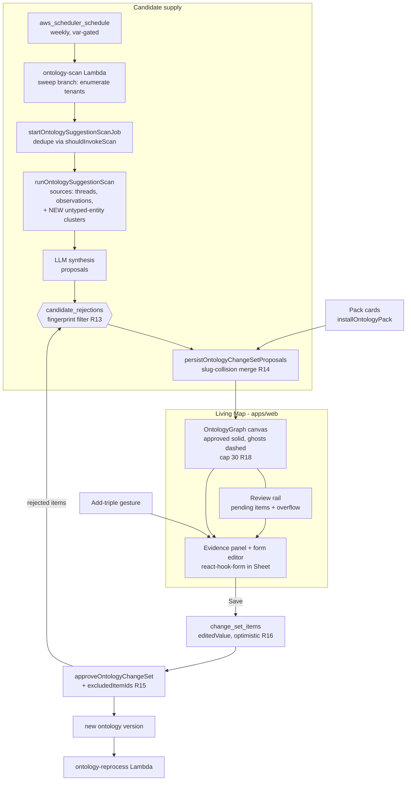
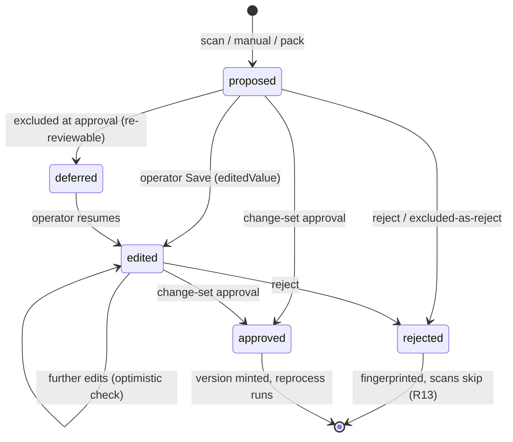

# Ontology Living Map - Plan

## Goal Capsule

- **Objective:** Relaunch the Ontology tab as a Living Map — a schema-graph canvas where operators review surfaced candidates and manually author triples, with every edit exiting through the existing change-set approval loop — so tenant admins build a weekly curation habit.
- **Product authority:** This document's Product Contract (confirmed brainstorm synthesis + plan-time hardening, 2026-07-18, Eric Odom). Upstream context: THINK-320, `docs/ideation/2026-07-18-think-320-ontology-playground-ideation.html`.
- **Product Contract preservation:** R1-R12, F1-F3, AE1-AE4 unchanged from the requirements-only version. Added at plan time (confirmed): R13-R18 (candidate lifecycle and collision hardening), AE5-AE7. R10's mechanism is pinned by KTD-2 without changing its text.
- **Stop conditions:** Surface a blocker instead of guessing when a change would alter Product Contract meaning, weaken change-set governance (any direct definition write), or modify `KnowledgeGraph`'s simulation/camera behavior.
- **Open blockers:** None. Outstanding Questions are all deferred-to-implementation.

---

## Product Contract

### Summary

The Ontology tab becomes a Living Map: operators land on the schema graph, where candidate types and relationships appear as ghost nodes with evidence counts. Focusing a candidate — or manually adding a new triple (source type → relationship → target type) on the canvas — opens a form editor whose Save emits a change set into the existing approval loop. Candidate supply is wired (scheduled suggestion scans, untyped kg entities) and the 10 dormant seed ontology templates become installable packs, so the map has content on day one and something to review every week.

### Problem Frame

Customers who open the Ontology tab bounce, confused. No customer tenant has adopted the ontology, and the observed failure is comprehension, not resistance: the tab presents read-only definition tables that neither show what the ontology is nor offer anything to do. The substrate underneath is strong — tenant-scoped versioned definitions, evidence-backed change-set governance, OWL export — but it is invisible. Meanwhile 10 of 14 written seed templates sit dormant in code, suggestion scans exist but only run when manually triggered, and stored evidence quotes are never displayed. The cost is a flagship enterprise differentiator ("governed agent memory") that produces zero adoption and no demo moment. Microsoft's Ontology-Playground (THINK-320) crystallized what the surface should feel like; the gap is ours to close on our own stack.

### Key Decisions

- **Review-first, not authoring-first.** The canvas leads with candidates to react to, because the observed failure is operators bouncing off a surface that asks them to understand before it offers value. Manual triple authoring is first-class but is the second verb, not the landing experience. (Rejected alternative: a Playground-style split-pane authoring studio as the primary surface.)
- **One gesture, one exit path.** Reviewing a candidate and authoring a new triple open the same form editor, and Save always emits a change-set item — never a direct write. This preserves the settled governance pattern (`docs/solutions/best-practices/business-ontology-change-set-loop-2026-05-17.md`) while delivering designer-grade UX on top of it.
- **Existing canvas, web-only by explicit decision.** Built on the existing `@thinkwork/graph` force-graph stack — no Cytoscape, no second graph engine (a prior parallel graph substrate was built and retired once). Mobile keeps its current wiki/graph surfaces unchanged.
- **Candidate supply is in scope.** A review surface with an empty queue kills the habit in week two. Scheduling suggestion scans and surfacing untyped kg entities as candidates ship with the canvas, not after it.
- **Playground as spec, not dependency.** Interaction grammar (focus-to-inspect, live preview, catalog install) is ported; no code, engine, or RDF data model is imported.

### Actors

- A1. Tenant operator/admin — primary. Curates the ontology: reviews candidates, authors triples, installs packs, approves change sets. The person who must "get it."
- A2. Suggestion engine — background producer. Scheduled scans and untyped-entity detection generate candidate items with evidence.
- A3. Pi agent — indirect consumer. Reads the approved ontology through existing typed retrieval; unchanged in this scope, but the reason curation matters.

### Requirements

**Living Map canvas**

- R1. The Ontology tab's landing view is the schema graph: approved entity types as nodes (sized by live instance count), approved relationship types as labeled edges.
- R2. Candidate entity types and candidate relationships render on the same canvas as visually distinct ghost nodes/edges carrying an evidence count.
- R3. The canvas honors the settled force-graph invariants: filtering dims in place, and no interaction restarts the simulation or resets the camera.
- R4. A review rail lists pending candidates and pending change sets so the queue is scannable without hunting the canvas.

**Focus and form editor**

- R5. Focusing a candidate opens a panel showing its evidence (verbatim quotes, source counts) and offers approve, edit, and reject.
- R6. Focusing an approved type or relationship opens a detail panel showing its definition and its founding evidence (the stored quotes that justified it).
- R7. The operator can manually add a new triple — source type, relationship, target type (new or existing on either end) — directly on the canvas via the same form editor.
- R8. Saving from the form editor (candidate edit or manual authoring) creates or updates a change-set item; it never writes definitions directly. Approval remains a distinct action.

**Candidate supply**

- R9. Suggestion scans run on a schedule per tenant (they are manual-trigger only today), producing candidate items without operator initiation.
- R10. Untyped kg entities (entities with no approved ontology type) are surfaced as candidate material on the map or in the review rail.

**Ontology packs**

- R11. The dormant seed templates (10 of the 14 total) are browsable in the Ontology tab as installable packs; Install creates a pre-staged change set for one-click admin approval.
- R12. New-tenant onboarding surfaces pack installation so a fresh tenant's map opens with reviewable structure, not 4 lonely nodes.

**Candidate lifecycle and collision hardening**

- R13. Rejecting a candidate is durable: a rejection fingerprint (slug + kind) is recorded, and future scans and untyped-entity surfacing exclude fingerprinted candidates instead of re-proposing them.
- R14. Creating a change-set item (from scan, manual authoring, or pack install) checks for an existing pending item or approved definition with the same slug; collisions merge into the existing item or surface as a conflict for review — never a silent duplicate.
- R15. Change-set approval supports per-item inclusion: an admin can approve a change set while excluding individual items (excluded items revert to pending or rejected per the admin's choice), so a pack install does not force all-or-nothing.
- R16. Change-set item edits use optimistic concurrency: a save against an item that changed since load surfaces a conflict instead of overwriting, and items in an approved change set reject further edits.
- R17. Live candidate arrival (a scan landing while the map is open) must not restart the simulation or reset the camera — same invariant as R3, extended to data-driven node changes.
- R18. The canvas renders at most 30 ghost candidates at once; overflow lives in the review rail with a visible count, so scan volume can never make the map unreadable.

### Key Flows

- F1. Weekly curation
  - **Trigger:** Scheduled scan (A2) produces new candidates; operator opens the Ontology tab.
  - **Steps:** Map renders with ghost nodes → operator focuses a candidate → evidence panel shows quotes and counts → operator edits fields in the form editor → Save updates the change-set item → operator approves the change set → new ontology version mints and reprocessing runs.
  - **Outcome:** Candidate becomes an approved type visible as a solid node. **Covers R1, R2, R4, R5, R8.**
- F2. Manual authoring
  - **Trigger:** Operator knows a domain concept the system hasn't surfaced.
  - **Steps:** Operator invokes add-triple on the canvas → form editor opens with source/relationship/target fields → Save emits a proposed change-set item → the new triple renders as a ghost pending approval.
  - **Outcome:** Operator-authored structure enters the same review queue as scanned candidates. **Covers R7, R8, R14.**
- F3. Day-one setup
  - **Trigger:** New tenant bootstrap or first visit to an empty-ish map.
  - **Steps:** Operator browses packs → installs one → pre-staged change set opens for review → approve (excluding any unwanted items per R15).
  - **Outcome:** The map shows a populated domain schema within the first session. **Covers R11, R12, R15.**

### Acceptance Examples

- AE1. **Covers R8.** Given an admin manually authors a triple and saves, when they view the map, then the triple appears as a ghost (proposed) and the ontology's active version is unchanged until they approve the change set.
- AE2. **Covers R2, R5.** Given a scheduled scan proposed "work order" with 12 evidence sightings, when the operator focuses it, then the panel shows the verbatim quotes and offers approve/edit/reject without leaving the canvas.
- AE3. **Covers R9.** Given a tenant with scans enabled and no operator action for a week, when the operator returns, then new candidates (if any were found) are waiting on the map.
- AE4. **Covers R11.** Given a tenant with only the 4 baseline types, when the admin installs the Support pack and approves it, then the pack's types render as approved nodes and reprocessing has been enqueued.
- AE5. **Covers R13.** Given an operator rejects the "invoice" candidate, when the next scheduled scan runs and encounters the same signal, then no new "invoice" candidate is created and the map stays clear of it.
- AE6. **Covers R14.** Given a tenant hand-authored an "order" type (pending or approved), when the admin installs a pack containing "order", then the install surfaces the collision as a review item rather than creating a second "order" definition.
- AE7. **Covers R14, R15.** Given a pending relationship item whose target type is itself a pending candidate, when the admin approves the change set including the relationship but excluding the type, then approval blocks with a dependency message naming the excluded type.

### Success Criteria

- Tenant admins at both active customer tenants (TEI, McPherson) perform curation actions (approve/edit/reject/author/install) in at least 3 distinct weeks within 90 days of ship.
- A new tenant reaches a populated, approved domain map within its first operator session.
- Qualitative: an operator can answer "what is this tab for?" after one visit — the bounce-confused pattern stops appearing in demos.

### Scope Boundaries

**Deferred for later**

- Ask-as-agent console and value-loop instrumentation (measuring curated vs uncurated agent quality).
- Agent schema discovery (`knowledge_graph_schema` tool) and typed traversal verbs.
- RDF/OWL import (alignment workbench); OWL export already exists and is untouched.
- Semantic zoom / territories view; collapse of the data/definitions mode toggle.
- Shareable deep links, saved views, embeddable snapshots.
- Cross-tenant pack registry, semver upgrades, pack submission.
- Mobile parity for the Living Map.

**Outside this product's identity**

- Importing Ontology-Playground code or Cytoscape.js.
- Bulk ontology import bypassing change-set review (rejected 2026-05).
- Agent-initiated direct ontology writes (agent projections stay read-only).

**Deferred to Follow-Up Work**

- Merging the `entity_resolution_cases` resolution queue into the review rail (today they remain separate views inside the Knowledge Model tab; unifying them is a follow-up UX pass).
- Scan cost controls beyond cadence + dedupe (per-tenant candidate budgets, zero-yield backoff).

### Dependencies / Assumptions

- **Assumption (load-bearing, unmeasured):** visibility and friction — not missing value — are the adoption blocker. The ontology's effect on agent answer quality is unmeasured; this ships on the bet that a legible, active surface creates the habit. Revisit via the deferred instrumentation if 90-day curation doesn't materialize.
- **Assumption:** approval-as-a-distinct-step friction is acceptable to admins even for their own authored triples (confirmed by Eric in dialogue).
- Verified dependencies: change-set item-level edit and approve mutations exist; candidate/untyped entities are already distinguishable in the graph data (`groundingStatus`, `ontologyTypeSlug`); 14 seed templates exist with 4 installed at bootstrap; suggestion scans have no scheduler wiring today; no kg-entity → change-set promotion path exists yet (new build).

### Outstanding Questions

**Deferred to implementation**

- Pack bundling: flat list vs curated domain bundles (Sales/Support/etc.). Default: 3-4 named bundles derived from the template slugs; adjust during U3 if the grouping feels forced.
- Exact scan cadence default (weekly assumed; the Terraform schedule expression is a one-line change).
- Ghost-node visual treatment (dashed ring vs opacity tier) — settle in U5 against the existing trust-color palette.

### Sources / Research

- `docs/ideation/2026-07-18-think-320-ontology-playground-ideation.html` — ranked idea set and rejection record this scope draws from (ideas 1, 3, and slices of 2).
- THINK-320 (Linear) — founding ticket; attachment microsoft/Ontology-Playground (MIT; React 19 + Vite + Cytoscape; interaction-grammar reference only).
- `docs/solutions/best-practices/business-ontology-change-set-loop-2026-05-17.md` — settled governance loop all writes flow through.
- `docs/solutions/best-practices/graph-filter-states-no-restart-2026-04-20.md` — canvas invariants R3/R17 inherit.
- `docs/plans/2026-05-17-003-fix-ontology-studio-table-sheets-plan.md` — prior unbuilt detail-sheets plan; R6 subsumes its intent.
- Key code anchors: `packages/api/src/lib/ontology/{templates.ts,baseline.ts,repository.ts,suggestions.ts,reprocess.ts}`, `packages/api/src/handlers/{ontology-scan.ts,ontology-reprocess.ts}`, `packages/database-pg/graphql/types/ontology.graphql:294-335`, `packages/graph/src/KnowledgeGraph.tsx`, `packages/graph-core/src/index.ts`, `apps/web/src/components/settings/{knowledge-graph,knowledge-model}/`, `terraform/modules/app/lambda-api/handlers.tf` (scan/reprocess Lambdas :359,:730; scheduler precedents :2480-2540).

---

## Planning Contract

### Key Technical Decisions

- KTD-1. **New `OntologyGraph` sibling component in `packages/graph`, not a `KnowledgeGraph` modification.** `KnowledgeGraph` is self-fetching with no data-injection or node-render override seam, and its sim/camera invariants are documented as load-bearing. The package convention is one self-fetching component per host surface (`KnowledgeGraph`, `MemoryGraph`, `WikiGraph`); `OntologyGraph` follows it, sharing `graph-core` helpers (`classifyNode`, label gating, community colors) and the dim-in-place discipline.
- KTD-2. **Untyped kg entities enter as a scan *source*, clustered into typed candidates — not per-entity ghosts.** The existing scan pipeline (`runOntologySuggestionScan` → `synthesizeOntologyChangeSetProposals` via `invokeClaudeJson`) already synthesizes proposals from collected sources; adding untyped-entity clusters as a source yields one candidate per proposed type with member entities as evidence. This satisfies R10, bounds canvas volume (with R18 as the hard cap), and reuses the LLM synthesis instead of building a parallel promotion path.
- KTD-3. **Scheduling = one Terraform `aws_scheduler_schedule` + a sweep branch in the existing `ontology-scan` handler, shipped inert.** Mirror the `knowledge_graph_observations_ingest` precedent (`handlers.tf:2502-2530`): rate schedule, `{sweep: true, trigger: "scheduled"}` payload, `maximum_retry_attempts 0`, state gated by a Terraform var that ships **disabled** and is enabled per stage. The handler's sweep branch enumerates tenants and calls `startOntologySuggestionScanJob`, which already dedupes via `shouldInvokeScan`.
- KTD-4. **Pack install reuses `persistOntologyChangeSetProposals`, not `ensureBaselineOntology`.** Export the currently-private function from `suggestions.ts` with a `proposedBy` variant (`pack_install`) and evidence-optional handling (it currently drops zero-evidence items). Direct Drizzle inserts (the baseline path) would bypass governance and violate R8/AE4.
- KTD-5. **Manual authoring lands via a new `createOntologyChangeSet` mutation** that creates a change set (or appends to the caller's open draft) with typed items, running the R14 slug-collision check server-side at creation time. Client-side pre-validation duplicates the check for immediate feedback, but the server check is authoritative.
- KTD-6. **Rejection fingerprints are a new `ontology.candidate_rejections` table** (tenant_id, kind, slug, fingerprint, rejected_by, rejected_at) written on candidate rejection and consulted by `persistOntologyChangeSetProposals` before insert. New Drizzle migration; follow the migration-ordering discipline (additive migration lands with the code PR; `db:push` after deploy).
- KTD-7. **Per-item approval (R15) extends the existing mutations rather than adding a parallel path:** `approveOntologyChangeSet` gains an optional `excludedItemIds` argument; excluded items get `status: deferred` (re-reviewable) or `rejected` (fingerprinted per R13) per an `excludedDisposition` argument. One approval still mints one version and one reprocess job — no batching machinery.
- KTD-8. **The map is the default view inside the existing Knowledge Model tab; definitions tables remain as a secondary view.** `KnowledgeModelTab`'s view selector gains "map" as the default; "definitions"/"identity"/"resolution-queue" stay. No route changes.
- KTD-9. **Form editor uses the vendored `packages/ui` `form.tsx` (react-hook-form) inside a `Sheet`,** mirroring `KnowledgeGraphEntitySheet`'s sheet-with-back-stack pattern; the review rail mirrors `ResolutionQueue`'s list pattern. First react-hook-form consumer in this area — keep the form component self-contained so the pattern is copyable.

### High-Level Technical Design

Candidate supply, curation loop, and governance exit path:

Candidate state machine (directional; states live on `change_set_items.status` plus the rejection table):

---

## Implementation Units

### U1. Ontology schema-graph query

- **Goal:** One query feeding the Living Map: approved entity types with live instance counts, approved relationship types with source/target links, and pending candidate items (change-set items with status, evidence counts, origin).
- **Requirements:** R1, R2, R4.
- **Dependencies:** None.
- **Files:** `packages/database-pg/graphql/types/ontology.graphql`; `packages/api/src/graphql/resolvers/ontology/ontologySchemaGraph.query.ts` (new); `packages/api/src/lib/ontology/repository.ts`; `packages/api/src/graphql/resolvers/ontology/ontology.test.ts`.
- **Approach:** Extend the existing `ontologyDefinitions` data shape rather than duplicating it: new `ontologySchemaGraph(tenantId)` returns `{types: [{slug, name, instanceCount, lifecycleStatus}], relationships: [{slug, name, sourceTypeSlugs, targetTypeSlugs}], candidates: [{itemId, changeSetId, itemType, slug, proposedValue, editedValue, evidenceCount, origin, status}]}`. Instance counts from a grouped count over kg entities by `ontologyTypeSlug`. After schema edit: `pnpm --filter @thinkwork/web codegen` (note: `packages/api` has no codegen script — resolvers are hand-typed).
- **Test scenarios:** returns 4 baseline types with zero candidates on a fresh tenant; instance counts reflect typed kg entities; pending change-set items appear as candidates with evidence counts; rejected/approved items excluded; tenant isolation (caller cannot read another tenant's graph).
- **Verification:** Resolver tests green in `pnpm --filter @thinkwork/api test`; query returns expected shape against a seeded test DB.

### U2. Change-set creation + hardening mutations

- **Goal:** `createOntologyChangeSet` (manual authoring entry point) with the R14 slug-collision check; R15 per-item approval exclusions; R16 optimistic concurrency on item edits.
- **Requirements:** R7, R8, R14, R15, R16; AE1, AE6, AE7.
- **Dependencies:** None (parallel with U1).
- **Files:** `packages/database-pg/graphql/types/ontology.graphql`; `packages/api/src/graphql/resolvers/ontology/createOntologyChangeSet.mutation.ts` (new); `packages/api/src/lib/ontology/repository.ts`; `packages/database-pg/src/schema/ontology.ts` (item `updated_at` if absent; `deferred` status value); new Drizzle migration; `packages/api/src/lib/ontology/repository.test.ts`.
- **Approach:** `createOntologyChangeSet(tenantId, items[])` creates or appends to the caller's open manual draft (one open `proposed_by: user` set per admin). Server-side collision check per item against pending items + approved definitions: same slug → merge (attach evidence, update proposedValue) or return a conflict payload. `approveOntologyChangeSet` gains `excludedItemIds` + `excludedDisposition` (KTD-7). `updateOntologyChangeSet` item writes compare a client-supplied `expectedUpdatedAt`; mismatch returns a conflict; items in approved sets reject edits.
- **Execution note:** Test-first on the collision and concurrency paths — these are the governance-bearing branches.
- **Test scenarios:** Covers AE1 — create manual triple → active version unchanged; Covers AE6 — create item colliding with approved slug → conflict payload, no duplicate row; collision with pending item → merged item, evidence unioned; Covers AE7 — approval including a relationship whose referenced type is excluded → blocked with dependency error; approval with exclusions → excluded items `deferred`, included items approved, one version minted; stale `expectedUpdatedAt` → conflict, no write; edit against approved set → rejected.
- **Verification:** Full `pnpm --filter @thinkwork/api test` green; migration applies via `db:push` on a scratch stage.

### U3. Pack listing + install

- **Goal:** Surface the 14 seed templates as installable packs; install materializes a pre-staged change set through the governed path.
- **Requirements:** R11, R12 (API half); AE4, AE6.
- **Dependencies:** U2 (collision check reused).
- **Files:** `packages/api/src/lib/ontology/templates.ts`; `packages/api/src/lib/ontology/suggestions.ts` (export + generalize `persistOntologyChangeSetProposals`); `packages/database-pg/graphql/types/ontology.graphql`; `packages/api/src/graphql/resolvers/ontology/{ontologyPacks.query.ts,installOntologyPack.mutation.ts}` (new); tests alongside.
- **Approach:** `ontologyPacks(tenantId)` groups `SEED_ONTOLOGY_TEMPLATES` into 3-4 named bundles, marking per-type state (approved / pending / available) by diffing tenant definitions. `installOntologyPack(tenantId, packSlug)` builds items from templates (entity types + their facet templates) and persists via the exported `persistOntologyChangeSetProposals` with `proposedBy: pack_install`, evidence-optional; R14 collision handling marks already-existing slugs as conflicts inside the staged set rather than duplicating.
- **Test scenarios:** Covers AE4 — install + approve → types approved, reprocess enqueued; install with an existing hand-authored slug → conflict item, no duplicate; re-install after partial rejection → rejected slugs skipped (R13 fingerprint), deferred slugs re-surfaced; pack listing reflects per-type state.
- **Verification:** `pnpm --filter @thinkwork/api test` green.

### U4. Scheduled scan sweep + untyped-entity source + rejection fingerprints

- **Goal:** Weekly per-tenant candidate supply with durable rejection dedupe.
- **Requirements:** R9, R10, R13; AE3, AE5.
- **Dependencies:** U2 (schema additions land in one migration train where possible).
- **Files:** `packages/api/src/handlers/ontology-scan.ts` (sweep branch); `packages/api/src/lib/ontology/suggestions.ts` (untyped-entity source; rejection filter); `packages/database-pg/src/schema/ontology.ts` (`candidate_rejections` table, KTD-6); new Drizzle migration; `terraform/modules/app/lambda-api/handlers.tf` (one `aws_scheduler_schedule`, var-gated, ships disabled); `terraform/modules/app/variables.tf` + root passthrough (deploy-var learning: declare in `terraform/examples/greenfield/main.tf` and module passthrough or all deploys fail); tests alongside.
- **Approach:** Sweep branch mirrors `knowledge-graph-observations-ingest` (enumerate tenants → `startOntologySuggestionScanJob`; existing `dedupeKey`/`shouldInvokeScan` prevents pileup). Untyped-entity source: group untyped kg entities into clusters and feed them to `synthesizeOntologyChangeSetProposals` as a source (KTD-2). Rejection writes: `rejectOntologyChangeSet` and R15 excluded-as-reject write fingerprints; `persistOntologyChangeSetProposals` filters against them.
- **Execution note:** Ship inert — the schedule's Terraform var defaults off; enabling on dev is a deliberate post-merge step. Verify the var reaches the greenfield root or the deploy pipeline fails (`feedback_deploy_var_needs_root_declaration`).
- **Test scenarios:** Covers AE5 — fingerprinted slug proposed by synthesis → dropped before persist; sweep event with `{sweep: true}` enumerates tenants and enqueues jobs, single-tenant event unchanged; untyped-entity clusters produce ≤1 candidate per proposed type with member entities as evidence; tenant with in-flight scan skipped by dedupe.
- **Verification:** `pnpm --filter @thinkwork/api test` green; `terraform plan` on greenfield example shows the schedule resource disabled by default.

### U5. `OntologyGraph` canvas component

- **Goal:** Schema-graph rendering in `packages/graph`: approved types solid (sized by instance count), candidates ghosted, focus/dim behavior, live-arrival stability.
- **Requirements:** R1, R2, R3, R17, R18.
- **Dependencies:** U1 (query it self-fetches).
- **Files:** `packages/graph/src/OntologyGraph.tsx` (new); `packages/graph/src/queries.ts`; `packages/graph/src/index.ts` (export); `packages/graph-core/src/index.ts` (only if a shared helper is genuinely reusable); `packages/graph/src/OntologyGraph.test.tsx`.
- **Approach:** Self-fetching sibling per KTD-1: urql query from U1, `react-force-graph-2d` with `nodeCanvasObject` drawing solid discs for approved types and dashed-ring ghosts with evidence badges for candidates (visual treatment settled here against the trust palette). Reuse `graph-core` label gating and camera constants. Live arrival (poll or refetch on rail mutation) merges nodes by stable id with in-place mutation — never a graphData identity swap — preserving R17. Enforce the R18 cap at data-merge time; overflow count exposed via callback for the rail.
- **Execution note:** Smoke/visual verification matters as much as unit coverage here — run the web dev server and confirm no sim restart on candidate refresh before calling it done.
- **Test scenarios:** ghost nodes classified distinctly from approved (classification unit tests); cap: 45 candidates → 30 rendered + overflow callback fires with 15; refetch with one added candidate preserves node object identity for existing nodes (no restart); empty tenant renders 4 baseline nodes without crash.
- **Verification:** `pnpm --filter @thinkwork/graph test` green; manual smoke on dev server (`pnpm --filter @thinkwork/web dev -- --host 127.0.0.1 --port 5180`).

### U6. Living Map UI: map view, review rail, evidence panel, form editor

- **Goal:** The operator-facing loop: map as default Knowledge Model view, review rail, candidate evidence panel, and the form editor for review + manual authoring.
- **Requirements:** R4, R5, R6, R7, R8, R16 (client half); AE1, AE2.
- **Dependencies:** U1, U2, U5.
- **Files:** `apps/web/src/components/settings/knowledge-model/KnowledgeModelTab.tsx` (map as default view, KTD-8); `apps/web/src/components/settings/knowledge-model/{OntologyMapView.tsx,OntologyReviewRail.tsx,OntologyCandidateSheet.tsx,OntologyTripleForm.tsx}` (new); `apps/web/src/lib/settings-queries.ts`; colocated `.test.tsx` files; `pnpm --filter @thinkwork/web codegen` after schema changes.
- **Approach:** `OntologyCandidateSheet` mirrors `KnowledgeGraphEntitySheet` (self-fetching, rendered in the Explorer-owned `Sheet`, back-stack) showing evidence quotes + approve/edit/reject; `OntologyTripleForm` is the shared react-hook-form editor (KTD-9) used for candidate edit and add-triple, submitting `createOntologyChangeSet`/`updateOntologyChangeSet` with `expectedUpdatedAt`; conflict responses render as an inline refresh prompt. Rail mirrors `ResolutionQueue`, one row per candidate/change-set-item pairing, overflow from U5's cap surfaced at top. Founding-evidence display on approved-type focus covers R6.
- **Test scenarios:** Covers AE2 — focusing a candidate renders quotes and the three actions; Covers AE1 — add-triple save renders ghost, no version change (mocked mutation asserts args); conflict response shows refresh prompt, no silent overwrite; approve action with rail refresh; approved-type focus shows founding evidence; map is the default view and definitions tables remain reachable.
- **Verification:** `pnpm --filter @thinkwork/web test` green (note: `@thinkwork/ui` mocks lack `cn` — use string join in new mocks); visual smoke on dev against a seeded tenant.

### U7. Pack UI + day-one onboarding + empty states

- **Goal:** Pack browsing/install cards, the new-tenant nudge, and the empty/steady states that keep the map legible.
- **Requirements:** R11, R12 (UI half), R18 (rail overflow display); AE4 (UI path).
- **Dependencies:** U3, U6.
- **Files:** `apps/web/src/components/settings/knowledge-model/OntologyPacksView.tsx` (new); `KnowledgeModelTab.tsx`; colocated tests.
- **Approach:** Pack card grid (name, type list, per-type state badges) with Install → opens the staged change set in the review flow. Day-one: when approved types ≤ baseline 4 and no pending sets, the map shows a dismissible "install a starter pack" callout (dismissal persisted per admin; not blocking). Steady state: empty rail renders "all caught up — next scan <date>" rather than blank.
- **Test scenarios:** fresh tenant shows the pack callout; dismissal persists; install opens staged set; empty rail renders steady-state copy with next-scan date; pack card states reflect approved/pending/available.
- **Verification:** `pnpm --filter @thinkwork/web test` green; end-to-end dev smoke: install pack → approve → solid nodes appear.

---

## Verification Contract

| Gate | Command | Applies to |
|---|---|---|
| API tests (full package) | `pnpm --filter @thinkwork/api test` | U1-U4 |
| Graph package tests | `pnpm --filter @thinkwork/graph test` | U5 |
| Web tests (full package) | `pnpm --filter @thinkwork/web test` | U6, U7 |
| Types + lint + format | `pnpm -r --if-present typecheck && pnpm -r --if-present lint && pnpm format:check` | all |
| Web codegen current | `pnpm --filter @thinkwork/web codegen` produces no diff after schema edits | U1-U3, U6 |
| Migration gate | new `drizzle/*.sql` applies via `pnpm db:push -- --stage dev`; drift reporter clean | U2, U4 |
| Terraform | `terraform plan` on `terraform/examples/greenfield` succeeds; schedule resource present + disabled | U4 |
| Live smoke (dev) | Living Map renders on dev tenant; manual triple → change set → approve → reprocess job created; pack install end-to-end; no sim restart on candidate refresh | U5-U7 |

Run the full package suite (not just new test files) before each PR (`feedback_run_full_package_suite_before_pr`). PRs target `main` individually; use worktrees under `.claude/worktrees/`.

---

## Definition of Done

- All seven units merged to `main` via green PRs; post-merge Deploy runs watched to completion.
- Product Contract AE1-AE7 each enforced by at least one merged test or verified live on dev (AE3 requires the schedule var enabled on dev — a deliberate post-merge Terraform step, done and verified).
- Dev E2E pass: scan-produced or seeded candidates visible as ghosts; focus → evidence → edit → approve → version mint → reprocess observed; pack install produces approved types; rejection is durable across a forced re-scan.
- Scheduled scans enabled on dev; TEI/McPherson enablement is a separate operator decision recorded in the customer-deploy runner ledger, not flipped silently by this work.
- No direct definition-write path exists from any new surface (grep-level audit of new mutations against `ontologyEntityTypes`/`ontologyRelationshipTypes` inserts outside the approval path).
- Abandoned experiments and dead-end code removed from the final diffs; `CONCEPTS.md` entries (Living Map, Ontology Pack) still match shipped behavior.
