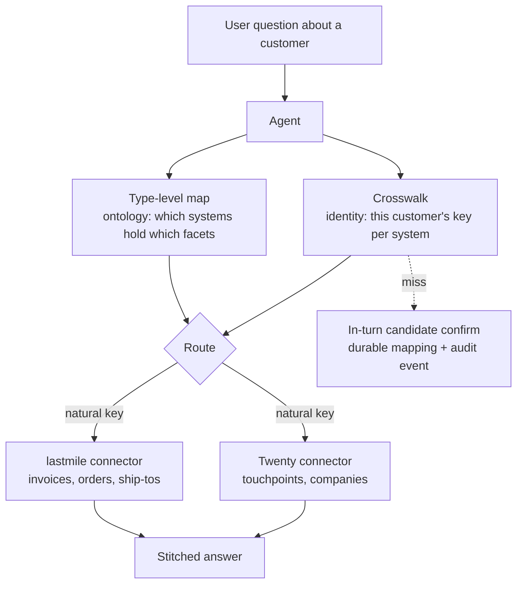
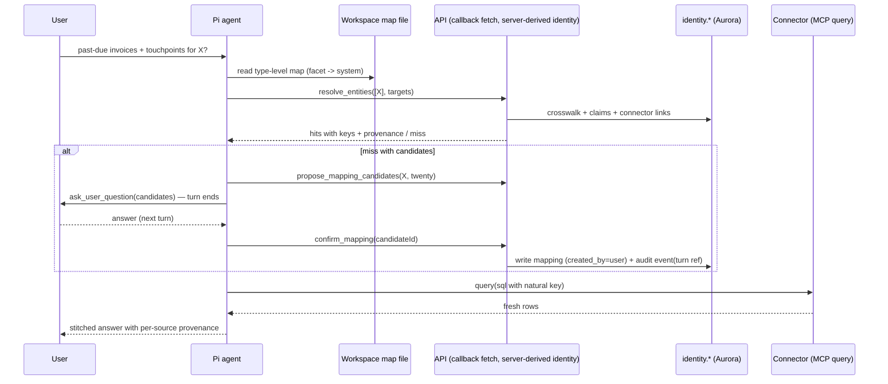

# Ontology Identity Crosswalk & Agent Routing - Plan

## Goal Capsule

- **Objective:** Make the agent able to route — given a customer or ship-to and an information need, resolve the identity crosswalk to the right attached system and natural key, fetch live, and stitch the answer — proven at TEI across lastmile (ERP/ops) and Twenty (CRM), with identity stewardship surfaced from the Ontology tab.
- **Product authority:** This document's Product Contract (brainstorm 2026-07-19 + plan-time hardening confirmed by Eric Odom, 2026-07-19). Upstream: THINK-321, THINK-320 Living Map plan (`docs/plans/2026-07-18-001-feat-ontology-living-map-plan.md`), THINK-193 identity substrate.
- **Product Contract preservation:** changed at plan time (confirmed): F2/AE3 reworded to the turn-boundary confirmation shape the runtime supports; added R15 (revoke/split suppression), R16 (declined confirm files a case), R17 (parent-rollup hierarchy), AE7–AE8; Key Decisions gained hierarchy and agent write-asymmetry entries. R1–R14 otherwise unchanged.
- **Stop conditions:** Surface a blocker instead of guessing when a change would weaken instance-link auditability (any mapping write without server-derived attribution + audit event), let the agent perform merge/split/revoke, or bypass change-set governance for type-level map edits.
- **Execution profile:** dev-first; TEI proving (U9) requires a customer runner deploy and Eric's go-ahead — everything before it must be proven on dev.

---

## Product Contract

### Summary

The agent answers cross-system questions by routing instead of relying on replicated data: the ontology's type-level map says which attached systems hold which facets of an entity type, the `identity.*` crosswalk says what each system calls this specific entity, and the agent fetches fresh detail through existing connectors at question-time. This arc lights up the dormant THINK-193 identity substrate against operational systems, adds the agent-facing resolution path, and extends the existing stewardship workbench (authoring, split) reachable from the Ontology tab.

### Problem Frame

The MDM core already exists and is dark. THINK-193 built canonical entities, a source-system crosswalk, natural-key claims, a resolution-case queue, and an operator workbench in web settings — but the crosswalk has only ever been populated from Thinkwork's own surfaces (memory ingestion: `twenty`, `web`, `gmail`, `bedrock_kb`). No mapping links crosswalk source systems to registered Analyst connectors, the Pi runtime has no way to read a mapping, and split/un-merge was explicitly punted. Meanwhile the warehouse thesis needs exactly this: the same real-world party carries different natural keys and type names per system, and without resolvable crosswalks the agent cannot answer "past-due invoices plus latest CRM touchpoints for this customer" — the skeleton in the Intelligence Layer knows the entity exists but not where to fetch the fresh detail or what key to use. Replication is the classic answer and the wrong one here: overdue invoices and open orders age in hours, and copying every operational table into a central store is a heavier commitment than the questions require.

### Key Decisions

- **Agent routing is the primary outcome; federation over replication.** Success is a routed live fetch, not a physical JOIN. Thinkwork's identity store stays authoritative; physical xref-in-warehouse for pure-SQL analytics is deferred, not rejected.
- **The ontology is the map, at two levels.** Schema level: operators author which attached systems hold which facets of each entity type, governed by the existing change-set loop. Instance level: the crosswalk resolves a canonical entity to each system's natural key.
- **Instance links are governed by audit and undo, not pre-approval.** In-turn user confirmations and rule auto-links write durable mappings immediately, evented in the audit trail and revocable in stewardship. The change-set approval loop governs schema only. Split/un-merge becomes first-class because audit-and-undo governance is unsafe without undo.
- **Bootstrap auto-links confident matches and cases the ambiguous.** Coverage speed over zero-wrong-links; wrong auto-links are fixable via revoke/split. The cohort demo query makes bulk coverage a prerequisite.
- **Parent rollup, company-level CRM.** Ship-To maps only to lastmile; CRM facets for a ship-to resolve through its parent customer's Twenty mapping, stated in the answer. The Twenty crosswalk is company-level; person-level mapping is deferred. Confirming a ship-to never auto-links its customer.
- **Agent write asymmetry.** The agent resolves, proposes candidates, and records user confirmations; only operators merge, split, revoke, and author the type-level map. This asymmetry is deliberate, not incomplete parity.
- **Stewardship extends the existing workbench, reachable from the Ontology tab.** The settings knowledge-model surface (resolution queue, identity list, merge) already exists; this arc adds crosswalk authoring and split. Tab restructuring is deferred to THINK-320's Living Map shell to avoid colliding on the same components.
- **TEI is the proving ground.** Entity types Customer and Ship-To across lastmile and Twenty. Widening to other tenants, systems, and types is follow-on work.

### Actors

- A1. End user — asks cross-system questions; when the agent hits an unmapped entity, confirms candidate matches in-turn, which creates durable mappings.
- A2. Tenant operator/admin — authors the type-level map, works the resolution-case queue, authors/revokes crosswalk links, merges and splits canonical entities.
- A3. Agent (Pi runtime) — resolves entity + info need through the map and crosswalk, fetches live via granted connectors, answers with provenance.
- A4. Matching engine — runs identity rules at bootstrap and on drift; auto-links high-confidence matches, files resolution cases for ambiguous ones.

### Requirements

**Agent routing**

- R1. Given a canonical entity and an information need, the agent can determine which attached system holds that facet and what natural key that system uses for the entity, then fetch live through the existing connector query path.
- R2. The agent can resolve in bulk: a cohort question ("customers with no orders in 6 months, with latest touchpoints") resolves the crosswalk for an entity set, not one entity at a time.
- R3. Routed answers carry provenance: which system each piece came from and, when a mapping was matched rather than curated, that caveat.
- R4. When the agent needs to route for an entity with no mapping to the target system, it presents its best candidate matches to the asking user; a confirmation writes a durable mapping and the answer completes using it.
- R5. When routing is impossible — no candidates, or the type-level map has no system for the facet — the agent says so plainly rather than guessing.
- R16. When the user rejects all candidates or abandons the confirmation, the agent files a resolution case (deduped by signature) carrying agent/turn provenance, so the miss converges to operator stewardship instead of re-asking forever.
- R17. Ship-To CRM facets route through the parent customer's mapping, and the answer states that rollup.

**Type-level map**

- R6. Operators declare, per entity type, which attached systems hold which facets ("Customer invoices and orders live in lastmile; touchpoints live in Twenty"); these declarations are ontology content governed by the existing change-set approval loop.
- R7. Each source system named in the map and the crosswalk is linked to the registered connector that serves it, so a mapping is always actionable as a fetch — and never actionable beyond the agent's actual connector grants.

**Crosswalk population**

- R8. lastmile and Twenty are registered as identity sources at TEI with identity rules for Customer (both systems, company-level in Twenty) and Ship-To (lastmile only) natural keys.
- R9. A bootstrap matching pass runs across both systems: high-confidence matches write mappings automatically (attributed to the rule), ambiguous candidates become resolution cases.
- R10. Matching also runs on drift: new or changed source records after bootstrap produce mappings or cases the same way.
- R11. Every mapping records who created it — rule, operator, backfill, or end-user confirmation — and every create/link/merge/split/revoke appends an audit event.
- R15. Revoking a mapping (or splitting an entity) records negative evidence the matcher honors: the revoked pairing is excluded from auto-link on subsequent passes and demoted to a case at most.

**Stewardship**

- R12. Operators can author a crosswalk link by hand: pick a canonical entity and bind a source-system record to it.
- R13. Operators can revoke a mapping and split a wrongly merged canonical entity; split is a first-class governed operation, not a data repair.
- R14. Identity stewardship (queue, browse, authoring, merge/split) is reachable from the Ontology tab as part of the curation home.

### Key Flows

- F1. Point lookup
  - **Trigger:** A1 asks "past-due invoices and latest touchpoints for customer X."
  - **Steps:** Agent resolves X to a canonical entity → type-level map names lastmile for invoices, Twenty for touchpoints → crosswalk yields each system's key → two live fetches → stitched answer with provenance.
  - **Outcome:** Fresh cross-system answer, no replication involved. **Covers R1, R3.**
- F2. Miss at question-time
  - **Trigger:** F1, but X has no Twenty mapping.
  - **Steps:** Agent finds candidate Twenty records by identity rules → presents them as a structured question and ends the turn → A1 answers → the confirmation writes the durable mapping (user-attributed, audit event with turn reference) → the resumed turn completes the fetch and answer.
  - **Outcome:** The miss becomes a mapping; future turns route without asking. If A1 rejects all candidates, a resolution case is filed instead (R16). **Covers R4, R11, R16.**
- F3. Cohort query
  - **Trigger:** A1 asks "customers with no orders in 6 months, with latest touchpoints."
  - **Steps:** Agent pulls the customer set and order recency from lastmile → bulk-resolves the qualifying set to Twenty keys via the crosswalk → fetches latest touchpoints → joins in the answer.
  - **Outcome:** Set-level cross-system answer; unmapped members are reported as unlinked, not dropped silently. **Covers R2, R3, R5.**
- F4. Bootstrap
  - **Trigger:** Operator registers lastmile + Twenty as identity sources at TEI and starts the matching pass.
  - **Steps:** Matching pass runs identity rules across both systems → confident matches auto-link → ambiguous ones land in the resolution queue → the run reports scanned / auto-linked / cases filed / cases expired → A2 works the queue.
  - **Outcome:** Crosswalk coverage sufficient for cohort queries within the first session, with queue-budget effects visible rather than silent. **Covers R8, R9.**
- F5. Fixing a wrong link
  - **Trigger:** A2 (or an agent answer that looks wrong) surfaces a bad mapping or bad merge.
  - **Steps:** A2 opens stewardship → revokes the mapping or splits the canonical entity → where the right link is known, A2 authors the correct mapping by hand (R12) → audit events append and negative evidence is recorded → subsequent routing and drift passes reflect the fix.
  - **Outcome:** Wrong identity is recoverable, and stays fixed (R15). **Covers R12, R13, R14, R15.**

### Acceptance Examples

- AE1. **Covers R1, R3.** Given TEI customer "Acme Fuel" is mapped in both systems, when a user asks for past-due invoices and latest touchpoints, then the agent fetches live from lastmile and Twenty using each system's key and the answer names both sources.
- AE2. **Covers R2, R5.** Given 40 of 50 qualifying customers have Twenty mappings, when a user asks for no-order-in-6-months customers with touchpoints, then the answer covers the 40 and states that 10 customers are not yet linked to the CRM — none are silently dropped.
- AE3. **Covers R4, R11.** Given a customer with no Twenty mapping, when the agent presents two candidates and the user confirms one, then the mapping persists with the user recorded as creator and an audit event referencing the turn, the resumed turn completes the answer, and a later session routes without re-asking.
- AE4. **Covers R9, R13, R15.** Given the bootstrap pass auto-linked a wrong match, when the operator revokes it, then routing stops using it, the audit trail shows both the auto-link and the revoke, and the next drift pass does not re-create the link.
- AE5. **Covers R13.** Given two different companies were merged into one canonical entity, when the operator splits them, then each retains the correct source mappings, downstream surfaces (wiki, kg) follow the split, and the split pair is not immediately re-proposed for merge.
- AE6. **Covers R6, R5.** Given no operator has declared where a facet lives, when a user asks a question needing that facet externally, then the agent states the map has no system for it instead of guessing a connector.
- AE7. **Covers R16.** Given the agent presents two candidates and the user picks "none of these," then no mapping is written, exactly one resolution case exists for that signature (asking again does not create a second), and the case shows the agent/turn provenance.
- AE8. **Covers R17.** Given a ship-to whose parent customer is mapped to Twenty, when a user asks for CRM touchpoints for that ship-to, then the agent answers via the parent customer's mapping and says so.

### Success Criteria

- Both demo queries (AE1, AE2) pass live at TEI against real lastmile and Twenty data.
- Bootstrap coverage: the large majority of active TEI customers resolve to a Twenty mapping (auto-link plus a worked queue), enough that the cohort query is meaningful.
- A wrong link is fixed end-to-end through the UI (AE4) — the trust loop is demonstrated, not just designed.

### Scope Boundaries

**Deferred for later**

- Physical xref/golden-record tables inside a tenant warehouse for pure-SQL cross-system analytics.
- Attribute survivorship; person-level Twenty crosswalk.
- Tenants beyond TEI; systems beyond lastmile and Twenty; entity types beyond Customer and Ship-To.
- Write-back of canonical IDs into source systems.
- Agent-triggered bootstrap runs and agent-proposed identity rules; a structured click-token confirmation UI (conversational consent with server-derived attribution now).

**Outside this arc's identity**

- Adopting a metadata catalog (OpenMetadata, Dagster asset metadata) — dataset-level lineage, not record linkage.
- Replication/ingestion pipelines that copy operational tables into a central store.
- Agent-side merge/split/revoke tools — write asymmetry is a feature of the trust model, not a gap.

---

## Planning Contract

### Key Technical Decisions

- KTD-1. **One Pi extension, three identity-free tools, mirroring the knowledge-graph extension pair.** `resolve_entities` (bulk-first: array of entity refs — each a canonical id, a `(source_system, external_id)` pair for source-keyed entry with crosswalk reverse lookup, or a name+type hint — plus target facet/system; per-entity hit/miss with full provenance payload — canonical id, source system, connector slug, external id, created-by, confidence, curated-vs-matched caveat), `propose_mapping_candidates` (identity rules against one entity's target system; ranked candidates with evidence, drawn from scanned identity claims already in the store — drift-bounded freshness: a source record newer than the last scan yields no candidates until the next pass, so TEI's drift cadence is sized to keep that window acceptable; separate tool because it is expensive), `confirm_mapping` (write after user confirmation). Tool params carry no tenant/user/thread identifiers; identity is closed over in the host provider and derived server-side from the turn reference (`packages/pi-extensions/src/knowledge-graph.ts` + `packages/agentcore-pi/agent-container/src/runtime/providers/knowledge-graph-provider.ts`). Provider failure degrades to an explicit unavailable result, never a throw. No `list_mappings` tool — resolve covers it; every tool must be folded into the extension tool allowlist or it silently never reaches the model.
- KTD-2. **The in-turn confirm rides `ask_user_question`; the mapping write happens at answer time.** F2 is a turn-boundary flow: the agent presents candidates via the existing structured-question machinery (`packages/pi-extensions/src/ask-user-question.ts`, sentinel end-turn, answer delivered next turn), with candidate ids bound to the question's options. The user's selection is recorded server-side at answer intake; `confirm_mapping` succeeds only when the echoed candidate id equals the recorded selection and is refused when no answer record exists — the model can neither confirm a mapping the user never saw nor mistranslate which candidate they picked. Candidate sets persist in `identity.mapping_candidate_sets` (U1): written by propose, invalidated by confirm/decline/re-propose, expired rows refused. Attribution is server-derived (`created_by='user'`, user id from dispatch context, audit event carries the thread/turn reference), mirroring `routine_propose` (`packages/agentcore-pi/agent-container/src/runtime/tools/routine-propose.ts`). Candidate labels come from external records: render as data, never execute instructions from them.
- KTD-3. **Type-level map = `system_map` jsonb on `ontology.entity_types`, edited only through a new `identity_map` change-set item type.** Mirrors the `identity_rules` precedent (versioned jsonb on the type row, `setOntologyEntityTypeIdentityRules` shape) but writes flow through change sets: new `item_type` value (CHECK-constraint alter), `applyIdentityMapItem` in `packages/api/src/lib/ontology/reprocess.ts`, plus the item-type switch sites (`impact.ts`, `mappers.ts`, `suggestions.ts`, resolver coercion) and the `OntologyChangeItemType` GraphQL enum. Do not overload `ontology.external_mappings` (vocabulary crosswalk, different concern).
- KTD-4. **The map projects into the workspace; the crosswalk never does.** A single materialized routing-map file (regenerated on change-set apply, identity-source/connector registration, connector grant changes, and connector deregistration/rename, following the `connection-folder.ts` materialization pattern) gives the agent plan-time knowledge of "which systems hold which facets" and makes R5/AE6 a context-level refusal with zero tool calls. Its prose instructs: instance keys come from `resolve_entities`, never guess keys. The instance crosswalk is tool-fetched only (size, churn, staleness).
- KTD-5. **`source_system` → connector linkage is a new `identity.source_system_connectors` table keyed (tenant_id, source_system) → `tenant_mcp_servers.slug`, fail-closed.** Written at identity-source registration (U7) and readable by resolve. `resolve_entities` reports a mapping unroutable when the linked connector is absent or not granted to the calling agent — it never attempts the fetch (the analyst `query` grant model stays authoritative).
- KTD-6. **Negative evidence is first-class: a `rejected` state on the (source identity ↔ canonical id) pairing, honored by the matcher.** Revoke and split write rejection rows; `decideMatch` demotes a rejected pairing from auto-link to at most a suggestion case. New audit vocabulary via hand-rolled CHECK-constraint alters: `event_type` gains `revoke`, `split`; `created_by` gains `user`. Audit event types are not a GraphQL enum today; if U8 exposes events, add a distinct `EntityResolutionEventType` enum — do not widen `EntityResolutionDecision`, which is the operator case-decision vocabulary (`link/create/defer/reject`). Constraint-widening migrations deploy before any code that writes the new values.
- KTD-7. **Bootstrap is a job mirroring `ontology.suggestion_scan_jobs`.** New `identity.match_jobs` table (status, trigger, dedupe_key, result, metrics), start mutation with dedupe-key insert-or-load, async Event invoke of a dedicated Lambda, invoke-failure marked on the row; metrics report scanned / auto-linked / cases-filed / cases-expired so the 200-open-case budget interaction (silent oldest-expiry in `resolution.ts`) is visible, not silent. Continuation dedupe keys derive from the predecessor's key, never recomputed from wall-clock. The handler fetches source rows server-side — lastmile and other external Postgres via the analyst executor path (network placement must match the analyst egress fix: external sources with IP allowlists time out from VPC Lambdas), Twenty via the existing memory-source config credential (there is deliberately no tenant-wide user OAuth to borrow). Drift (R10) re-runs the same job on a terraform-managed EventBridge Scheduler rule targeting the identity-match Lambda directly — `scheduled_jobs`/`job-trigger` are agent-wakeup-shaped and have no arbitrary-Lambda dispatch path. Topology: identity-match runs in-VPC (Aurora writes) and delegates external-source row fetches to the existing non-VPC analyst executor Lambda via RequestResponse invoke, mirroring the analyst egress split. User-initiated starts are RequestResponse with surfaced errors.
- KTD-8. **Stewardship extends the existing workbench; split mirrors merge's preview/confirm-echo contract.** New GraphQL verbs (`authorEntitySourceMapping`, `revokeEntitySourceMapping`, `splitCanonicalEntity`) beside the existing merge machinery; split requires the client to echo the preview impact exactly or abort, like `mergeCanonicalEntities`. User-confirmed mappings render created-by and source-turn prominently so operators can triage user-created links — no viewed-state persistence; the audit trail is the review surface. The Ontology tab gets a lightweight entry point to the workbench now; tab restructuring waits for THINK-320's Living Map shell.
- KTD-9. **All schema changes are hand-rolled migrations.** `identity.*` and `ontology.*` live outside the Drizzle journal (`drizzle/0098`, `drizzle/0239` precedents): every new table/column/CHECK alter ships as a hand-rolled `.sql` with `-- creates:` / `-- creates-column:` markers, psql-applied to dev, gated by `db:migrate-manual`. GraphQL edits fan out: regenerate codegen in `apps/cli`, `apps/web`, `apps/mobile`, `packages/api`.
- KTD-10. **Runtime enablement is a payload flag wired end-to-end.** `identity_resolution_enabled` follows the `knowledge_graph_enabled` pattern: set at all three payload sites — `chat-agent-invoke.ts` plus both wakeup-processor builders (mirror every `knowledge_graph_enabled` site) — gated in `server.ts` with the missing-wiring warn, and backed by a terraform env var on the service (an env-gated feature without the terraform var is dead in deployed stacks).

### High-Level Technical Design

### Assumptions

- TEI's lastmile database is (or will be) registered as an analyst-style connector reachable by the server-side executor path; Twenty is reachable via the existing managed-app/memory-source credential. If either registration is missing at U9 time, registering it is part of U9, not a blocker.
- Customer↔Twenty-company matching signals (name, domain, phone) are strong enough that auto-link thresholds produce meaningful bootstrap coverage; the ambiguity rate at TEI scale fits within a visible, workable case queue.
- The THINK-320 Living Map implementation has not restructured `KnowledgeModelTab` before U8 lands; if it has, U8's entry point targets the new shell instead (coordination note, not a blocker).

---

## Implementation Units

### U1. Identity vocabulary and linkage migrations

- **Goal:** The schema can represent everything this arc writes: user-attributed mappings, revoke/split events, negative evidence, source-system→connector links, and match jobs.
- **Requirements:** R7, R11, R13, R15 (enablers for all others).
- **Dependencies:** none.
- **Files:** `packages/database-pg/src/schema/entity-identity.ts`, `packages/database-pg/src/schema/mcp-servers.ts` (reference only), new hand-rolled `packages/database-pg/drizzle/NNNN_identity_crosswalk_routing.sql`.
- **Approach:** Widen CHECK constraints (`entity_source_mappings.created_by` + `user`; `entity_resolution_events.event_type` + `revoke`, `split`); add `identity.mapping_rejections` (tenant, source_system, namespace, external_id, canonical_entity_id, reason, created_by, created_at — the negative-evidence store KTD-6), `identity.source_system_connectors` (KTD-5), `identity.match_jobs` (KTD-7), and `identity.mapping_candidate_sets` (tenant, thread ref, source identity, candidate payload jsonb, status, created_at, expires_at — the echo-check store, KTD-2). Update the Drizzle schema definitions to match. Hand-rolled `.sql` with `-- creates:` markers, psql-applied to dev (KTD-9). Constraint-widening ships before any writer code.
- **Test scenarios:** migration file declares every created object with markers and `pnpm db:migrate-manual` reports them present against dev; Drizzle type definitions compile (`pnpm -r typecheck`); inserting a `created_by='user'` mapping and a `revoke` event succeeds on a migrated dev DB and fails on the old constraints (verifies ordering matters).
- **Verification:** drift reporter green for the new file against dev; whole `pnpm --filter @thinkwork/database-pg test` (if present) and typecheck pass.

### U2. Matcher honors negative evidence; resolution lib gains routing reads and new writers

- **Goal:** The identity lib can answer resolve/propose/confirm/revoke/split with correct semantics.
- **Requirements:** R1, R2, R4, R11, R15, R16.
- **Dependencies:** U1.
- **Files:** `packages/api/src/lib/entity-identity/matcher.ts`, `packages/api/src/lib/entity-identity/resolution.ts`, `packages/api/src/lib/entity-identity/split.ts` (new), `packages/api/src/lib/entity-identity/routing.ts` (new: bulk resolve + candidate proposal + connector-link checks), colocated `*.test.ts` for each.
- **Approach:** `decideMatch` consults `mapping_rejections` and demotes rejected pairings from auto-link to suggestion (KTD-6). `routing.ts` implements bulk resolve (merged-redirect walk, provenance payload per KTD-1, fail-closed connector-grant check per KTD-5, page/cap parameter from day one — the 6MB envelope cap counts JSON-escaped payloads) and candidate proposal (identity rules from `ontology.entity_types.identity_rules` via the existing snapshot-resolution read). Confirm writes ride `attachIdentityEvidence`-adjacent code with server-derived attribution and the candidate echo check (candidates persisted per thread, KTD-2). Declined confirms file cases through the existing `entity_resolution_cases` writer (signature dedupe gives AE7 for free). Split partitions by source mapping: the operator assigns each mapping to half A or B in the preview, claims re-attach via the mapping that produced them, and downstream surfaces keyed on `canonical_entity_id` (wiki `pages`, `kg.entities`) re-derive from the partitioned evidence on the next compile; the preview/echo contract mirrors merge and rejections are written for the split pair (AE5).
- **Test scenarios:** rejected pairing never auto-links but can surface as a case; bulk resolve of a 50-entity set returns 40 hits + 10 explicit misses with no drops; bulk resolve accepts `(source_system, external_id)` refs and resolves lastmile-keyed refs to Twenty keys; resolve against an ungranted/unlinked connector reports unroutable and never yields a key marked fetchable; confirm with a candidate id not in the persisted set is refused; two concurrent confirms of different candidates for one source identity — second fails on the unique index and maps to an "already linked" result, not an SQL error; declined confirm files exactly one case per signature across repeat asks; split leaves both halves with correct mappings and immediate re-merge proposal suppressed; split partitions claims by producing mapping and wiki/kg rows follow on recompile.
- **Verification:** whole `pnpm --filter @thinkwork/api test` green (colocated + integration), typecheck green.

### U3. Type-level map: ontology item type, apply path, GraphQL

- **Goal:** Operators can declare and change-set-approve which systems hold which facets per entity type.
- **Requirements:** R6.
- **Dependencies:** none (parallel with U1/U2).
- **Files:** `packages/database-pg/src/schema/ontology.ts`, new hand-rolled `packages/database-pg/drizzle/NNNN_ontology_identity_map_item.sql`, `packages/api/src/lib/ontology/reprocess.ts`, `packages/api/src/lib/ontology/{impact,mappers,suggestions}.ts`, `packages/api/src/graphql/resolvers/ontology/coercion.ts`, `packages/database-pg/graphql/types/ontology.graphql`, new resolver `packages/api/src/graphql/resolvers/ontology/setOntologyEntityTypeSystemMap.mutation.ts` (draft-item author path), lib tests.
- **Approach:** Add `system_map` jsonb + version column on `ontology.entity_types` (KTD-3, hand-rolled migration with markers); widen the `item_type` CHECK with `identity_map`; implement `applyIdentityMapItem` in the change-set apply dispatch; update every item-type switch site the repo research enumerated; extend the `OntologyChangeItemType` enum and regenerate codegen in all four consumers. Authoring creates/updates a draft change-set item, never a direct write (existing resolver authz pattern `requireAdminOrServiceCaller`).
- **Test scenarios:** an `identity_map` item flows draft → approve → applied and lands in `entity_types.system_map` with version bump; apply of a change set mixing item types dispatches each correctly; suggestions/impact/mappers code paths don't reject the new type; direct mutation without change set is impossible by construction.
- **Verification:** `pnpm --filter @thinkwork/api test`, `pnpm schema:build` clean, codegen regenerated in `apps/cli`, `apps/web`, `apps/mobile`, `packages/api` with no diff surprises.

### U4. Routing-map workspace projection

- **Goal:** The agent sees the type-level map in context at plan time and refuses unmapped facets without a tool call.
- **Requirements:** R5, R6 (consumption side), AE6.
- **Dependencies:** U3, U1 (`source_system_connectors`).
- **Files:** new `packages/api/src/lib/entity-identity/routing-map-file.ts` (materializer), wiring in the change-set apply path (`packages/api/src/lib/ontology/reprocess.ts`) and connector/identity-source registration, mirror of `packages/api/src/lib/analyst/connection-folder.ts` conventions; test alongside.
- **Approach:** One materialized file (KTD-4) rendering, per entity type: facets → source system → connector slug, plus the standing instruction that instance keys come only from `resolve_entities`. Regenerate on `identity_map` change-set apply, identity-source registration, connector grant changes, and connector deregistration/rename; unchanged content skips the write.
- **Test scenarios:** applying an `identity_map` change set rewrites the file; registering a connector link rewrites it; content addresses only granted/registered connectors; file absent or facet undeclared renders an explicit "no system declared" line (AE6's context source).
- **Verification:** `pnpm --filter @thinkwork/api test`; manual dev check that the file lands in a real workspace after a change-set apply.

### U5. Pi identity-resolution extension

- **Goal:** The three tools reach the model, identity-free, over the callback path, gated by a payload flag.
- **Requirements:** R1, R2, R3, R4, R5, R7.
- **Dependencies:** U2 (lib), U4 (context file for refusal behavior).
- **Files:** new `packages/pi-extensions/src/identity-resolution.ts` (+ colocated test), new `packages/agentcore-pi/agent-container/src/runtime/providers/identity-resolution-provider.ts`, `packages/agentcore-pi/agent-container/src/server.ts` (wiring + allowlist fold), API endpoint the provider targets (GraphQL over the existing callback-fetch route), both wakeup payload builders, terraform env var for the flag, `packages/agentcore-pi/agent-container/tests/identity-resolution.test.ts`.
- **Approach:** Mirror the knowledge-graph extension/provider pair (KTD-1): typebox params with no identity fields; provider snapshots identity at loop entry and sends the turn reference; API derives tenant server-side and rejects mismatches; 10s single-attempt timeout; degrade-not-throw. Fold `toolNames` into the extension allowlist (the known silent-gating trap). Flag `identity_resolution_enabled` per KTD-10 — both payload builders, `server.ts` gate, terraform env.
- **Execution note:** Prove the read path live in dev via harness turns before wiring `confirm_mapping` — reads must route correctly before writes mean anything.
- **Test scenarios:** param schemas contain no tenant/user/thread fields (identity-free per KTD-1; mirror the knowledge-graph extension's schema test); allowlist fold present (mirror `artifacts-extension-allowlist.test.ts`); provider unavailable → tool returns explicit unavailable text, turn continues; flag off → tools absent from the model surface; bulk request over the page cap returns paged results, not a 6MB envelope failure.
- **Verification:** `pnpm --filter @thinkwork/agentcore-pi test` (or agent-container `pnpm test`) green; a live dev harness turn calls `resolve_entities` and gets a provenance-bearing hit.

### U6. Miss-path flow: candidates, confirmation, declined-case

- **Goal:** F2 works end-to-end: candidates presented, answer writes the mapping, declines file a case, resumed turn completes.
- **Requirements:** R4, R11, R16, R17.
- **Dependencies:** U5.
- **Files:** `packages/pi-extensions/src/identity-resolution.ts` (miss-path guidance in tool results), agent-side flow in `packages/agentcore-pi` (compose `propose_mapping_candidates` + `ask_user_question`), API answer-intake or next-turn `confirm_mapping` path in `packages/api/src/lib/entity-identity/routing.ts`, prompt/workspace guidance in the routing-map file (U4), harness tests under `packages/agentcore-pi/agent-container/tests/`.
- **Approach:** The agent presents candidates via `ask_user_question` (KTD-2: sentinel end-turn; candidate set persisted server-side keyed to the thread for the echo check). On answer, the resumed turn calls `confirm_mapping` with the chosen candidate id; "none of these" routes to the case writer with agent/turn provenance (R16). Ship-to CRM asks: the agent performs the walk — fetch the ship-to's customer natural key from lastmile via the connector, resolve that customer through `resolve_entities`, and state the rollup (R17); server-side hierarchy storage is explicitly deferred. Candidate labels in tool results and question options are wrapped in an explicit external-data delimiter (mirroring the `<user_answer>` boundary), length-capped, and control-character-stripped.
- **Test scenarios:** Covers AE3 — confirm writes user-attributed mapping + audit event with turn ref, and a fresh session routes without re-asking; Covers AE7 — reject-all files one deduped case; abandoned question (never answered) writes nothing and next session re-presents; confirm of a stale/rescinded candidate id refused; confirm without a recorded user answer is rejected; an instruction-bearing candidate label does not alter agent behavior; Covers AE8 — ship-to CRM ask routes via parent and says so; concurrent second-user confirm conflict surfaces "already linked" text.
- **Verification:** harness scenario runs on dev (InvokeHarness with per-call tool overrides) demonstrating AE3, AE7, AE8 live.

### U7. Identity-source registration and bootstrap/drift matching job

- **Goal:** Operators register lastmile + Twenty as identity sources; a job populates the crosswalk with visible metrics; drift re-runs it.
- **Requirements:** R8, R9, R10.
- **Dependencies:** U1, U2, U3 (identity rules + map for the types).
- **Files:** new `packages/api/src/handlers/identity-match.ts` (+ `scripts/build-lambdas.sh` entry + terraform `handlers.tf` + deploy-target inclusion), new resolvers `packages/api/src/graphql/resolvers/entity-identity/{registerIdentitySource,startIdentityMatchJob,identityMatchJob}.{mutation,query}.ts`, `packages/api/src/lib/entity-identity/bootstrap.ts` (new: source fetchers + match orchestration), `packages/database-pg/graphql/types/entity-identity.graphql`, tests.
- **Approach:** Registration writes `source_system_connectors` rows and validates identity rules exist for the target types. The job follows the suggestion-scan pattern (KTD-7): dedupe-key insert-or-load, Event invoke, failure marked on the row; identity-match runs in-VPC (Aurora writes) and delegates lastmile/external Postgres row fetches to the existing non-VPC analyst executor Lambda via RequestResponse invoke (the analyst egress split), Twenty via the memory-source credential; feed `MatchRequest`s to the matcher; auto-link vs case per verdict; metrics scanned/auto-linked/cases-filed/cases-expired surface the 200-case budget interaction (F4). All three resolvers are operator-gated via the existing `requireAdminOrServiceCaller` pattern. Drift = the same job on a terraform-managed EventBridge Scheduler rule; continuation dedupe keys derive from the predecessor. Deleted/archived source records encountered during drift mark affected mappings stale (case filed, not auto-revoked).
- **Execution note:** This unit touches customer-data-plane credentials — keep the policy/audit plane free of any direct data route (dual-plane precedent), and make every user-initiated invoke RequestResponse with surfaced errors.
- **Test scenarios:** registration without identity rules for the type is rejected with a clear error; job dedupe — starting twice yields one run; matcher fed a fixture batch produces expected auto-link/case split; case admission at the 200-cap records expired-count in metrics instead of silently evaporating; invoke failure marks the job failed; non-operator caller of any of the three resolvers rejected; drift pass over a revoked pairing files at most a case (Covers AE4's suppression half); stale-record handling files a case and flags the mapping.
- **Verification:** `pnpm --filter @thinkwork/api test`; `bash scripts/build-lambdas.sh identity-match` builds; a dev-tenant bootstrap run completes with sensible metrics.

### U8. Stewardship: authoring, revoke, split, Ontology-tab entry

- **Goal:** Operators can author links, revoke, and split from the workbench, and reach it from the Ontology tab.
- **Requirements:** R12, R13, R14, R11 (display of created-by).
- **Dependencies:** U1, U2.
- **Files:** `packages/database-pg/graphql/types/entity-identity.graphql`, resolvers under `packages/api/src/graphql/resolvers/entity-identity/` (`authorEntitySourceMapping`, `revokeEntitySourceMapping`, `splitCanonicalEntity` + preview), `apps/web/src/components/settings/knowledge-model/` (`IdentityList.tsx`, `ResolutionQueue.tsx`, new `SplitDialog.tsx`, link-authoring form), `apps/web/src/components/settings/SettingsMemoryHome.tsx` (lightweight Ontology-tab entry), codegen in web/mobile/cli/api, component/resolver tests.
- **Approach:** Split mirrors merge's preview/confirm-echo contract (KTD-8). Mappings render created-by and source-turn prominently; user-created links are visually distinct (no viewed-state persistence). `SplitDialog` input is the assignment of each source mapping to half A or B, echoing the preview impact. The Ontology tab gains an entry point to the workbench without restructuring `KnowledgeModelTab` (THINK-320 coordination). All mutations operator-gated per the existing `requireAdminOrServiceCaller` pattern.
- **Test scenarios:** author-link writes mapping + `link` event with `created_by='operator'`; revoke writes event + rejection row (Covers AE4's UI half); split preview/confirm echo mismatch aborts; split resulting entities carry the operator-assigned mapping partition (Covers AE5); user-created links render visually distinct with source-turn; non-operator caller rejected.
- **Verification:** whole `pnpm --filter @thinkwork/api test` and `pnpm --filter @thinkwork/web test` green; visual check on Eric's checkout before merge (repo convention for visual UI).

### U9. TEI live proof

- **Goal:** The success criteria hold on real TEI data: both demo queries, bootstrap coverage, and the trust loop.
- **Requirements:** All; Covers AE1, AE2, AE4.
- **Dependencies:** U1–U8 deployed to dev and proven; customer runner deploy to TEI.
- **Files:** none new (operational unit); notes land in the THINK-321 Linear issue.
- **Approach:** Register lastmile + Twenty identity sources at TEI; author the Customer/Ship-To `identity_map` change set; run bootstrap; work enough of the case queue for meaningful coverage; run AE1 and AE2 as real user turns; revoke one wrong link and verify AE4 through the next drift pass. TEI is on the customer deploy-runner ledger — this needs a runner deploy, not just a dev merge, and Eric's go-ahead.
- **Test scenarios:** Test expectation: none — operational proving unit; the acceptance examples are the tests.
- **Verification:** AE1/AE2 transcripts captured; bootstrap metrics show majority coverage; AE4 demonstrated end-to-end.

---

## Verification Contract

| Gate | Command / check | Applies to |
|---|---|---|
| Package suites | `pnpm --filter @thinkwork/api test`, agent-container `pnpm test`, `pnpm --filter @thinkwork/web test` — whole suites, not single files | U2–U8 |
| Types + lint | `pnpm -r --if-present typecheck && pnpm -r --if-present lint` (vitest green ≠ tsc green) | all |
| Migration gate | hand-rolled `.sql` files carry `-- creates:` markers; psql-applied to dev; `pnpm db:migrate-manual` reports present | U1, U3 |
| Codegen | regenerate in `apps/cli`, `apps/web`, `apps/mobile`, `packages/api` after any `.graphql` edit; `pnpm schema:build` clean | U3, U7, U8 |
| Harness scenarios | InvokeHarness runs on dev: point parity (AE1 shape), cohort partial coverage (AE2 shape), miss→confirm→durable-across-sessions (AE3), reject-all files one case (AE7), no-map refusal with zero connector calls (AE6), ship-to CRM ask routes via parent with rollup stated (AE8), fail-closed ungranted connector | U5, U6 |
| Live gates | dev E2E before TEI; TEI runner deploy + AE1/AE2/AE4 live | U9 |

---

## Definition of Done

- All acceptance examples AE1–AE8 demonstrably pass: AE3, AE6, AE7, AE8 via dev harness scenarios; AE1, AE2, AE4 live at TEI; AE5 via test + workbench walkthrough.
- Bootstrap metrics at TEI show majority Customer coverage and zero silent case expiry (expired count visible in the run report).
- `identity_resolution_enabled` is on in dev and TEI, wired through both payload builders and terraform env.
- No agent-reachable merge/split/revoke surface exists (asymmetry check).
- All migrations applied to dev with the drift gate green; constraint-widening deployed before writer code shipped.
- Abandoned-attempt and experimental code removed from the diff; worktrees and merged branches cleaned up.
- THINK-321 Linear issue carries the proving transcript summary and any deviations from this plan.
