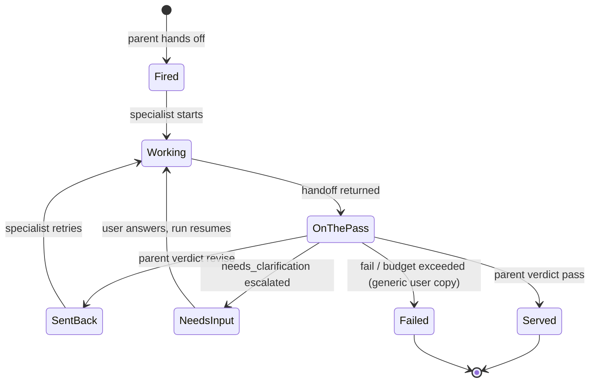
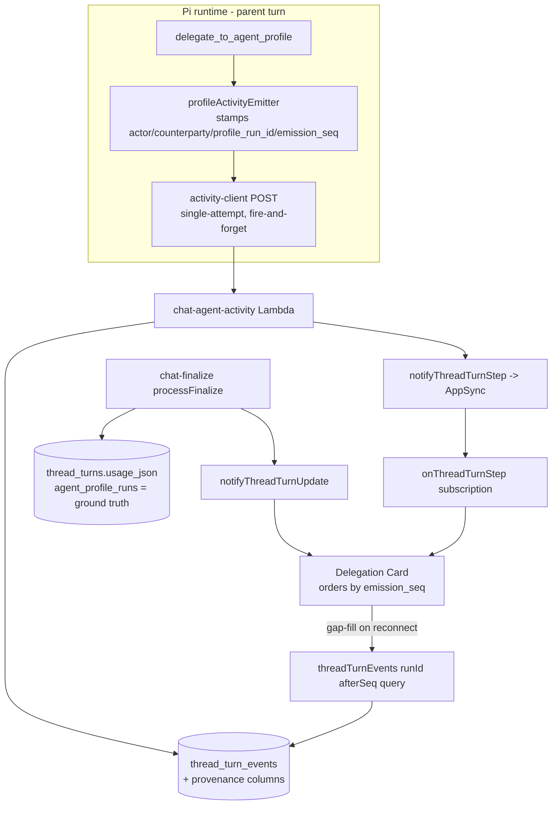

# Visible Delegation - Plan

## Goal Capsule

- **Objective:** End users in the web thread can see that a specialist worked on their request and that review happened — a live Delegation Card at the handoff point that opens into the parent↔specialist exchange, backed by first-class provenance columns on `thread_turn_events`.
- **Product authority:** THINK-322 (Linear) as scoped by this contract — the visibility slice only; no protocol or transport change. Ideation record: `docs/ideation/2026-07-21-think-322-a2a-protocol-ideation.html`.
- **Open blockers:** None. All prior open questions are resolved in Key Technical Decisions.
- **Stop conditions:** Do not touch mobile, the delegation execution model, sigils/addressing, or the `agents/` folder anatomy. Any change that alters what a specialist _does_ (rather than what users _see_) is out of scope — surface it instead of building it.
- **Product Contract preservation:** changed (user-confirmed 2026-07-21; doc-review fixes folded 2026-07-22): R2 widened to `delegation_exchange_id` as the grouping key across revise retries (`profile_run_id` is re-minted per retry) plus the resumption link; R1 scoped to runtime-emitted events; R6/R7 split clarification ("needs input") from send-backs; R10-R11 added (failed-state copy, wakeup-turn cards); AE5 names the exchange id; AE6-AE8 added. All other R/A/F/AE text unchanged.

---

## Product Contract

### Summary

Render each sub-agent delegation as a first-class, openable card in the web thread: it appears when the parent hands off, updates live through run states, and opens into the two-party parent↔specialist exchange — including revise send-backs, clarification escalations, and the final verdict. Underneath, add explicit actor/run provenance to thread turn events and harden live activity delivery so finalize always reconciles a correct record.

### Problem Frame

Delegation is invisible today. Specialist runs execute inside the parent's turn and surface only as collapsed activity rows, hidden by default; child activity is flattened into `analyst:`-prefixed log lines; the review loop (revise cycles, clarification escalations) leaves no user-visible trace. Users have asked directly what the agent actually did, and cannot distinguish an answer that survived two review loops from one that was never reviewed — the quality control that justifies delegation's cost earns no trust because nobody can see it.

The persistence layer compounds this: `thread_turn_events` has no actor or run-identity column, so who-did-what is reconstructed by matching payload content — lossy, and unusable as an audit or rendering spine.

### Key Decisions

- **Openable sub-thread over badge-only or always-streaming.** A Delegation Card sits inline where the handoff happened; header shows state and verdict at a glance; opening reveals the full exchange. Calm thread by default, full story one click away.
- **Live states over complete-on-finalize.** The card appears at handoff and advances while the specialist works. Finalize remains the source of truth that corrects the record.
- **Provenance as schema, not payload convention.** Actor and run identity move into explicit columns (mirroring the `activity_log` actor pattern). Actor means runtime identity (platform agent, sub-agent/profile slug from the capabilities manifest) — independent of the entity-identity work in THINK-320/321.
- **Clarification is not a send-back.** `needs_clarification` renders as a distinct "needs input" state; review-cycle counts include only `revise` verdicts.
- **New runs only.** Historical delegations are not backfilled; pre-migration events carry only lossy payload provenance.

### Actors

- A1. **End user** — reads the thread, opens delegation cards, judges the answer's provenance.
- A2. **Platform agent (parent)** — initiates handoffs, issues send-backs, owns the final answer.
- A3. **Specialist (sub-agent / Agent Profile run)** — executes the delegated task, returns verdict-bearing handoffs.

### Key Flows

- F1. Delegated request with one send-back
  - **Trigger:** A1 sends a request the parent routes to a specialist.
  - **Steps:** Card appears at handoff (fired) → advances while the specialist works (working) → specialist returns a handoff the parent rejects (sent back, with the parent's revise reason) → second handoff passes (served, verdict shown) → parent posts the final answer.
  - **Outcome:** A1 sees, without opening anything, that a specialist ran and review happened; opening the card shows the full exchange.
  - **Covers:** R4, R5, R6, R7.
- F2. Degraded live delivery
  - **Trigger:** One or more live activity events fail to deliver mid-run.
  - **Steps:** Card may skip states or lag → finalize delivers the complete record → card reconciles to the true sequence.
  - **Outcome:** The opened card never shows a permanently wrong or incomplete exchange.
  - **Covers:** R8, R9.
- F3. Clarification escalated to the user
  - **Trigger:** Specialist returns `needs_clarification`; the parent escalates to A1 via a question.
  - **Steps:** Card enters "needs input" → user answers (possibly in a later turn) → parent re-delegates with the answer → resumed run carries a durable link to the original → the card chain renders as one continued exchange.
  - **Outcome:** A1 sees the specialist asked for input and that their answer resumed the same piece of work; the cycle is not counted as a send-back.
  - **Covers:** R2, R6.

### Requirements

**Provenance spine**

- R1. Every runtime-emitted thread turn event records its actor as first-class data — actor kind (platform agent, sub-agent/profile; the `user` kind is reserved for future use) and actor slug — with a counterparty reference on delegation events, following the existing `activity_log` actor pattern.
- R2. Delegation exchanges are traceable without parsing event payloads: every run of one exchange (revise retries, reviewer runs, clarification resumes) carries a shared `delegation_exchange_id` — the card grouping key — alongside its own `profile_run_id`; a resumed run additionally carries a durable reference to the run it continues.
- R3. New events carry provenance from the moment the schema lands; historical events are not backfilled.

**Delegation card and sub-thread**

- R4. A delegation card renders inline in the web thread at the point of handoff, showing specialist identity, current state, and (when finished) the final verdict without requiring interaction.
- R5. Opening the card reveals the two-party exchange: the delegated task opens it, each specialist handoff and each parent send-back (with the revise reason) appears as a distinct entry, and the closing verdict ends it. The specialist's own tool activity renders as secondary collapsed entries (reusing the existing nesting), subordinate to the handoff exchange.
- R6. Revise cycles are visible as send-backs; clarification escalations render as a distinct "needs input" state and are excluded from the send-back count. The card distinguishes an answer that was reviewed (with how many send-backs) from one that passed first try.
- R7. The card's user-facing state vocabulary follows the kitchen-pass model (fired / working / on the pass / sent back / needs input / served), mapped as display copy over the existing verdict machinery; internal enum values never leak verbatim.

**Live delivery**

- R8. The card updates live during the run; state changes appear without a page refresh.
- R9. Live delivery is reconcile-first: transient event loss or reordering may degrade liveness but never the final record — finalize reconciles the card to the complete, correct exchange.

**Coverage**

- R10. Failed runs (crash, query cap, cost budget) render one generic user-facing failed state; internal failure reasons stay in operator surfaces.
- R11. Delegations in wakeup/scheduled turns render cards too, anchored via the existing timestamp-pairing fallback for turns with no triggering user message.

### Acceptance Examples

- AE1. **Covers R4, R6.** Given a delegation with two revise cycles, when the run completes, then the thread shows a card reading (in effect) "specialist X · served · pass, 2 send-backs" without the user opening anything.
- AE2. **Covers R5.** Given a completed delegation with one send-back, when the user opens the card, then they see: the delegated task, handoff v1, the parent's revise reason, handoff v2, and the pass verdict — as distinct entries in order.
- AE3. **Covers R8, R9.** Given a live run where two mid-run activity events drop or arrive out of order, when finalize completes, then the opened card shows the full correct exchange with no missing entries and no state the run never reached.
- AE4. **Covers R3.** Given a thread with delegations that ran before this ships, when the user views that thread, then those runs render as they do today (no card, no error).
- AE5. **Covers R1, R2.** Given any new delegation event, when an operator or downstream system reads it, then actor kind, actor slug, profile run id, and delegation exchange id are available as columns, not derived from payload text.
- AE6. **Covers R6, F3.** Given a specialist that escalates a clarification to the user and is re-invoked with the answer, when the exchange completes with a pass and zero revise verdicts, then the card shows "needs input → served · pass, 0 send-backs" as one linked chain — not two disconnected cards and not "1 send-back."
- AE7. **Covers R11.** Given a delegation inside a scheduled/wakeup turn with no user watching, when the user later opens the thread, then the card renders fully from persisted events at the correct position.
- AE8. **Covers R10.** Given a delegation that exceeds its cost budget, when the run terminates, then the card shows a generic "couldn't complete" state with no budget figures or internal verdict strings.

### Scope Boundaries

- **Deferred for later:** Mobile parity (mobile has no `agent_profile_run_*` handling at all — follow-up ticket); operator-facing surfaces beyond what the schema enables (Settings→Activity enrichment, delegation feed); backfill of historical runs; retry/ack delivery protocol (reconcile-first is the chosen mechanism — revisit only if reconciliation proves insufficient in practice).
- **Outside this contract:** Any transport, topology, or protocol change — delegation still runs same-process inside the parent's turn. Agent cards, A2A Task envelopes, and boundary A2A are separate THINK-322 follow-ups per the ideation doc.

### Dependencies / Assumptions

- All grounding claims verified against the repo 2026-07-21: no actor columns on `thread_turn_events` (`packages/database-pg/src/schema/scheduled-jobs.ts:187-221`); default-closed delegate rows (`apps/web/src/components/workbench/TaskThreadView.tsx:2275-2287`); `${profileName}:` flattening (`packages/agentcore-pi/agent-container/src/agent-profile-delegation.ts:683-698`); verdict enum + goal-status mapping (`packages/agentcore-pi/agent-container/src/agent-profile-adapter.ts:252-256`, `1100-1118`); best-effort delivery (`packages/pi-runtime-core/src/activity-client.ts:6-12`); `activity_log` actor pattern (`packages/database-pg/src/schema/activity-log.ts:16-32`); zero mobile handling of profile-run events.
- Card visibility = thread visibility. Opening a card exposes the delegated task and handoff text to anyone who can already view the thread; no new permission surface.
- Evidence basis: users have asked directly what the agent did — observed demand.

---

## Planning Contract

### Key Technical Decisions

- KTD-1. **Six nullable text columns on `thread_turn_events`, hand-rolled migration.** Add `actor_kind`, `actor_slug`, `counterparty_slug`, `profile_run_id`, `delegation_exchange_id`, `resumed_profile_run_id` — all nullable `text`, no backfill, plus a partial index on `(run_id, delegation_exchange_id) WHERE delegation_exchange_id IS NOT NULL`. The index uses `CREATE INDEX CONCURRENTLY IF NOT EXISTS` and must run outside a transaction block (no `BEGIN` wrapper in the file) — a plain build blocks the seq-locked writer on this high-volume table; in-repo precedent: `drizzle/0148_user_cost_attribution.sql`. Migrations in this schema area are hand-rolled (journal stops at 0021; files run to 0256+) — follow `drizzle/0256_agent_profile_manifest_authority.sql`'s additive-column pattern: header with `-- creates-column: public.thread_turn_events.<col>` markers, `ADD COLUMN IF NOT EXISTS`, applied to dev via `psql` **before** merge, verified with `pnpm db:migrate-manual`. Do not use `db:generate`.
- KTD-1b. **`delegation_exchange_id` is the card grouping key; `profile_run_id` alone cannot be.** Each revise retry compiles a fresh run request that mints a new `profileRunId` (`agent-profile-adapter.ts:643` `randomUUID()`), so a one-send-back delegation spans 2+ run ids. The delegation wrapper mints one exchange id per `delegate_to_agent_profile` tool call and stamps it on every run of that exchange — specialist retries, reviewer runs in the chain path, and clarification resumes.
- KTD-2. **No new delegation-edge table.** The parent→specialist edge is derivable from `(actor_slug, counterparty_slug, profile_run_id)` on events plus the authoritative `usage_json.agent_profile_runs` finalize record. A dedicated table adds a second source of truth with no consumer yet; revisit if an operator surface needs indexed cross-thread queries.
- KTD-3. **Reconcile-first liveness — no retry/ack protocol.** The `emission_seq` counter lives in the delegation wrapper and stamps every event of an exchange — child emissions AND parent-lane verdict/send-back emissions for that `delegation_exchange_id` — producing one monotonic sequence per exchange (the single-attempt fire-and-forget POST is otherwise unchanged). Server-`seq` fallback applies only to whole runs with no `emission_seq` (old-runtime events), never to mixed-key interleaving within one card. The web card orders by `emission_seq`, gap-fills via the existing `threadTurnEvents(runId, afterSeq)` replay query on reconnect, and treats finalize's `usage_json.agent_profile_runs` as ground truth. Pair the `onThreadTurnStep` subscription with an explicit `reexecute({ requestPolicy: "network-only" })` and a window-visibility refetch backstop — the urql document cache does not auto-invalidate sibling queries, and the AppSync client has no replay (see `docs/solutions/integration-issues/spaces-urql-doc-cache-no-live-invalidation.md`).
- KTD-4. **Display-state mapping layer, not a new state machine.** Kitchen-pass copy (fired / working / on the pass / sent back / needs input / served / couldn't complete) maps from the existing `AgentProfileLoopCompletionVerdict` + `loopGoalStatus()` outputs (`active | passed | revision_requested | clarification_requested | failed | budget_limited`). The mapping lives web-side next to the card component; the runtime state machine is untouched. In-flight states derive from the exchange's event stream, not from `loopGoalStatus` (which collapses all pre-terminal states into `active`): run-started event → _fired_; first subsequent child activity event → _working_; handoff evidence returned → _on the pass_; revise verdict before the next retry run starts → _sent back_ (increments the count); clarification escalation → _needs input_. Send-back entries have no parent-authored event — the entry renders the revise-bearing handoff's `feedback` (specialist self-review or Reviewer run) as the revise reason, attributed to the reviewing actor via the counterparty/actor columns.
- KTD-5. **Upgrade the existing rendering path; no parallel component.** The Delegation Card is an evolution of `agentProfileActionRow` + `profileChildrenForAgentProfileRun` + `ActionRow`/`ThinkingRow` in `TaskThreadView.tsx` — the same `actionRowsForTurn` convergence property (live events and finalized `usage.tool_invocations` collapse to one row set) governs it. Source card identity from the new provenance columns / structured payload, never from the display-only `[#@]` regex fallback (THINK-180 lesson).
- KTD-6. **Reuse `notifyThreadTurnStep`; no new AppSync mutation.** New provenance fields are added to `ThreadTurnStepEvent` in `packages/database-pg/graphql/types/subscriptions.graphql`; `pnpm schema:build` regenerates the AppSync schema. No Terraform change — the mutation already exists in the `notification_mutations` resolver list. (A new mutation would require that Terraform edit; avoided by design.)
- KTD-7. **Provenance is stamped at emission and must survive both dispatch paths.** `profileActivityEmitter` populates actor/counterparty/profile_run_id for child events; parent-lane emissions carry `actor_kind: "agent"` + the platform agent slug. Any new payload/control field must land in both `chat-agent-invoke` and `wakeup-processor` payload builders, with the parity test extended — this seam has regressed three times (`docs/solutions/architecture-patterns/wakeup-processor-payload-parity-with-chat-agent-invoke-2026-06-12.md`). Test the resume turn, not just the first turn.

### High-Level Technical Design

Sequencing: schema first (U1), then emission tagging (U2), then the API/GraphQL surface (U3), then finalize/parity (U4), then the web card (U5-U6), then the clarification chain (U7). U5 can start against U3's fields before U4 lands.

### Assumptions

- `emission_seq` in the event payload is sufficient ordering signal; no server-side changes to `seq` assignment (the `FOR UPDATE` + `MAX(seq)+1` writer is untouched).
- Clarification escalation's `delegationContext` (profileSlug/originalTask/escalationCount) can be extended with the original `profile_run_id` and `delegation_exchange_id` without breaking the `ask_user_question` flow. The link is stamped **runtime-side**: the runtime holds the machine-parsed resume context (`resumeDelegationContextDetails` in user-question-context.ts) and injects `resumed_profile_run_id`/`delegation_exchange_id` into the next `delegate_to_agent_profile` invocation matching that profileSlug within the clarification cycle — never relying on the model to relay the ids. If the model drops or mangles the context, the chain degrades to disconnected cards; it never mis-links.
- Web ships on `desktop-v*` canary tags — the web card can lag the backend by a canary cycle; backend changes are backward-compatible for the old renderer (columns nullable, payload fields additive).

---

## Implementation Units

### U1. Provenance columns on thread_turn_events

- **Goal:** The event spine records actor and run identity as first-class columns.
- **Requirements:** R1, R2, R3.
- **Dependencies:** None.
- **Files:** `packages/database-pg/drizzle/0257_thread_turn_event_provenance.sql` (new), `packages/database-pg/src/schema/scheduled-jobs.ts`.
- **Approach:** Per KTD-1: six nullable text columns + partial index, `ADD COLUMN IF NOT EXISTS`, `-- creates-column:` markers for each column and `-- creates:` for the index. The index statement is `CREATE INDEX CONCURRENTLY IF NOT EXISTS` and must not run inside a transaction block (precedent: `drizzle/0148_user_cost_attribution.sql`). Update the Drizzle `threadTurnEvents` table def in the same PR (additive — safe to apply before merge per the additive-migration learning).
- **Execution note:** Apply to dev via `psql "$DATABASE_URL" -f` before merging (psql autocommit; no `BEGIN` wrapper so `CONCURRENTLY` is valid); run `pnpm db:migrate-manual` and paste `\d+ thread_turn_events` output into the PR.
- **Test scenarios:** Covers AE5 (columns exist and are readable). Migration drift check reports no MISSING markers; existing `thread-turn-events.test.ts` suite stays green with null provenance (backward compat).
- **Verification:** `pnpm db:migrate-manual` clean; `pnpm --filter @thinkwork/database-pg build` and typecheck green.

### U2. Emission-side provenance and ordering stamps

- **Goal:** Every delegation-lane event leaves the runtime carrying actor, counterparty, profile run id, resume link, and an emission sequence.
- **Requirements:** R1, R2, R9 (ordering signal).
- **Dependencies:** None (payload-additive; lands independently of U1).
- **Files:** `packages/agentcore-pi/agent-container/src/agent-profile-delegation.ts`, `packages/pi-runtime-core/src/activity-client.ts`, `packages/pi-runtime-core/src/agent-loop.ts` (ActivityEmitEvent type), `packages/agentcore-pi/agent-container/tests/agent-profile-delegation.test.ts`.
- **Approach:** Extend `agentProfileActivityPayload()` to carry `actor_kind: "profile"`, `actor_slug`, `counterparty_slug` (the parent agent slug), `profile_run_id`, and the exchange's `delegation_exchange_id` (minted once per `delegate_to_agent_profile` call, stamped on every run of the exchange — retries, reviewer runs, resumes; KTD-1b). The `emission_seq` counter lives in the delegation wrapper and stamps BOTH lanes of the exchange — child emissions and parent-lane verdict/send-back emissions (KTD-3). Resume linking is runtime-side per Assumptions: the runtime injects `resumed_profile_run_id`/`delegation_exchange_id` from the machine-parsed resume context; the model never relays ids. Parent-lane events carry `actor_kind: "agent"` + platform agent slug. Files also touch `packages/agentcore-pi/agent-container/src/user-question-context.ts` (resume context details).
- **Test scenarios:** Child event payload carries all provenance fields; parent event carries agent actor + the same `delegation_exchange_id` and an `emission_seq` from the shared counter; a revise cycle produces two runs sharing one exchange id with strictly increasing `emission_seq` across both lanes; clarification re-invoke carries `resumed_profile_run_id` pointing at the first run's id and the original exchange id; model drops/mangles `delegationContext` → resumed run gets a fresh exchange id (disconnected cards, never mis-linked); events emitted with no delegation context carry actor fields but null counterparty/profile_run_id/exchange id.
- **Verification:** `npx vitest run tests/agent-profile-delegation.test.ts` (from `packages/agentcore-pi/agent-container`) green.

### U3. API write path and GraphQL surface

- **Goal:** Provenance flows from POST body to columns and out through the live subscription.
- **Requirements:** R1, R2, R8.
- **Dependencies:** U1 (columns), U2 (fields arriving).
- **Files:** `packages/api/src/handlers/chat-agent-activity.ts`, `packages/api/src/lib/thread-turn-events.ts`, `packages/api/src/graphql/notify.ts`, `packages/api/src/graphql/resolvers/triggers/threadTurnEvents.query.ts`, `packages/database-pg/graphql/types/subscriptions.graphql`, tests: `packages/api/src/lib/thread-turn-events.test.ts`, `packages/api/src/handlers/chat-agent-activity.test.ts`, `packages/api/src/graphql/resolvers/triggers/threadTurnEvents.query.test.ts`.
- **Approach:** Extend `ActivityEventInput`/`ThreadTurnEventInput` with the provenance fields (promote from payload when present so older runtimes keep working); write them to the new columns in `appendThreadTurnEvent`; add the fields to `ThreadTurnStepEvent` + the replay query selection. Run `pnpm schema:build` (KTD-6 — no Terraform change) and `pnpm --filter @thinkwork/web codegen` (cli/mobile only if their selections touch changed types — expected no-op).
- **Test scenarios:** POST with provenance fields lands them in columns; POST without them (old runtime) writes nulls and succeeds; replay query returns the new fields; notify payload includes them; batch of 100 events preserves per-event provenance; access-gate tests unchanged.
- **Verification:** `npx vitest run src/lib/thread-turn-events.test.ts src/handlers/chat-agent-activity.test.ts` (from `packages/api`) green; `git diff terraform/schema.graphql` shows only the intended field additions.

### U4. Finalize reconciliation and dispatch parity

- **Goal:** Finalize remains ground truth for the card, and provenance survives the wakeup dispatch path.
- **Requirements:** R9, R11 (wakeup-turn correctness).
- **Dependencies:** U2, U3.
- **Files:** `packages/pi-runtime-core/src/types.ts` (extend `AgentProfileRunRecord` with `delegationExchangeId`, `resumedProfileRunId`, and verdict-history counts — the type has none of these today), the record-construction sites in `packages/agentcore-pi/agent-container/src/agent-profile-delegation.ts` / `server.ts` that populate `runResult.agentProfileRuns`, `packages/api/src/lib/chat-finalize/process-finalize.ts`, `packages/api/src/lib/chat-finalize/process-finalize.test.ts`, wakeup parity test (extend the existing parity suite alongside `wakeup-processor.system-prompt.test.ts`).
- **Approach:** The entries are enriched **runtime-side** (process-finalize's `collectAgentProfileRuns` passes runtime-built entries through untouched — the fields must exist on `AgentProfileRunRecord` at construction); finalize verifies passthrough so `usage_json.agent_profile_runs` carries `profile_run_id`, `delegation_exchange_id`, verdict history (revise count, clarification count), and `resumed_profile_run_id` — letting the web reconcile a complete chain even when live events dropped. Confirm `notifyThreadTurnUpdate` fires after the usage write (existing behavior). Extend the dispatch parity test to assert any new payload/control field appears in both `chat-agent-invoke` and `wakeup-processor` builders (KTD-7).
- **Execution note:** Test the resume turn explicitly — dispatch a delegation via the wakeup queue in the integration test, not only a direct chat turn; this seam has regressed three times.
- **Test scenarios:** Covers AE3 (dropped live events, finalize record complete); finalize with clarification chain links runs; wakeup-dispatched delegation produces identical provenance to chat-dispatched; finalize with zero delegations leaves usage shape unchanged.
- **Verification:** `npx vitest run src/lib/chat-finalize/process-finalize.test.ts` (from `packages/api`) green; parity suite green.

### U5. Delegation Card component and state mapping

- **Goal:** The card renders identity, kitchen-pass state, verdict, and send-back count at a glance, and opens into the ordered exchange.
- **Requirements:** R4, R5, R6, R7, R10.
- **Dependencies:** U3 (fields available to the web).
- **Files:** `apps/web/src/components/workbench/TaskThreadView.tsx` (evolve `agentProfileActionRow`/`profileChildrenForAgentProfileRun`; extract a `DelegationCard` module if the diff warrants), `apps/web/src/components/workbench/TaskThreadView.test.tsx`.
- **Approach:** Per KTD-4/KTD-5: a display-copy mapping from `loopGoalStatus` outputs to kitchen-pass states (budget_limited/failed → one generic "couldn't complete"); header = specialist name + state chip + verdict/send-back summary; opened body = task entry, handoff entries, send-back entries with revise reasons, needs-input entries, closing verdict; specialist tool activity as collapsed secondary children (existing nesting). Group by `delegation_exchange_id` from structured data (all runs of one exchange = one card; KTD-1b) — never by bare `profile_run_id` and never the `[#@]` regex fallback. In-flight chip states follow KTD-4's event-derived spec. `ThinkingRow` hosts the live shimmer + elapsed label; reuse its `aria-live="polite"`/`role="status"` pattern for chip state transitions.
- **Test scenarios:** Covers AE1 (header summary with 2 send-backs), AE2 (opened entry order), AE6 (clarification chain renders needs-input, excluded from send-back count), AE8 (budget-exceeded → generic copy, no internal strings); pass-first-try shows "0 send-backs" distinct from unreviewed legacy rows; pre-migration runs (null provenance) render via today's fallback path (AE4); two delegations to the same profile in one turn render as two cards.
- **Verification:** `npx vitest run src/components/workbench/TaskThreadView.test.tsx` (from `apps/web`) green; visual check on Eric's checkout before PR (repo convention for visual UI).

### U6. Live wiring and web reconciliation

- **Goal:** The card updates live and always converges to the finalized record.
- **Requirements:** R8, R9, R11.
- **Dependencies:** U5.
- **Files:** `apps/web/src/components/workbench/TaskThreadView.tsx`, `apps/web/src/lib/graphql-queries.ts`, `apps/web/src/components/workbench/TaskThreadView.test.tsx`.
- **Approach:** Per KTD-3: order live rows by `emission_seq` with server `seq` fallback; on `onThreadTurnStep` events for a delegation run, update card state; on subscription reconnect or window-visibility regain, gap-fill via `threadTurnEvents(runId, afterSeq)` and `reexecute({ requestPolicy: "network-only" })`; on `notifyThreadTurnUpdate`/finalize, replace live state with the `usage_json.agent_profile_runs` record (the existing `actionRowsForTurn` convergence property). While the gap-fill query is in flight (reconnect / visibility regain), the card shows a subdued "syncing" treatment on the chip so pre-reconciliation state is never presented as settled. Wakeup-turn cards anchor via the existing timestamp-pairing fallback (R11).
- **Test scenarios:** Covers AE3 (out-of-order live events render correctly by emission_seq; dropped events corrected at finalize), AE7 (scheduled-turn card renders from persisted events on thread open); mid-run page refresh reconstructs current state from replay; card shows the syncing treatment while gap-fill is in flight and clears it on completion; live row set and finalized row set collapse to one card (no duplicates); state never regresses backward after finalize.
- **Verification:** `npx vitest run src/components/workbench/TaskThreadView.test.tsx` (from `apps/web`) green.

### U7. Cross-turn clarification chain rendering

- **Goal:** A clarification that spans turns renders as one continued exchange, not two disconnected cards.
- **Requirements:** R2, R6 (F3, AE6).
- **Dependencies:** U2 (resume link stamped), U4 (finalize carries it), U5, U6 (same file; the chain rendering builds on U6's convergence behavior).
- **Files:** `apps/web/src/components/workbench/TaskThreadView.tsx`, `apps/web/src/components/workbench/TaskThreadView.test.tsx`.
- **Approach:** When a run carries `resumed_profile_run_id` (or shares a `delegation_exchange_id` across turns), render it as a continuation of the original card (single chain: original entries → needs-input → user's answer marker → resumed entries → verdict). If the original run is outside the loaded turn window, degrade to a "continues earlier work" affordance — v1 is inert text with the original run's timestamp; navigation/fetch-on-demand deferred.
- **Test scenarios:** Covers AE6 end-to-end; resumed run whose original is outside the pagination window shows the degraded affordance; same-turn auto-converted clarification (best-judgment re-invoke, no user question) renders within one card without a needs-input user prompt entry.
- **Verification:** `npx vitest run src/components/workbench/TaskThreadView.test.tsx` (from `apps/web`) green.

---

## Verification Contract

| Gate                                 | Command                                                                                                                                                                     | Applies to |
| ------------------------------------ | --------------------------------------------------------------------------------------------------------------------------------------------------------------------------- | ---------- |
| Typecheck + lint + tests (workspace) | `pnpm -r --if-present typecheck && pnpm -r --if-present lint && pnpm -r --if-present test`                                                                                  | All units  |
| Migration drift                      | `pnpm db:migrate-manual` (after psql apply to dev)                                                                                                                          | U1         |
| Targeted suites                      | vitest commands named per unit                                                                                                                                              | U2-U7      |
| AppSync schema regen                 | `pnpm schema:build`; diff `terraform/schema.graphql` shows only intended additions                                                                                          | U3         |
| Web codegen                          | `pnpm --filter @thinkwork/web codegen`; commit generated output                                                                                                             | U3, U5     |
| Dispatch parity                      | extended parity suite incl. wakeup-dispatched delegation                                                                                                                    | U4         |
| Live E2E on dev                      | trigger a real delegation on the dev stage (chat turn AND a wakeup/scheduled turn); watch the card live; verify AE1-AE3, AE6-AE8 behaviors; a bare Lambda invoke is not E2E | U5-U7      |
| Format                               | `pnpm format:check`                                                                                                                                                         | All        |

Pre-commit runs `pnpm lint && pnpm typecheck && pnpm test && pnpm format:check` — fix real failures, never bypass hooks. Visual UI changes get checked in Eric's checkout before the PR.

## Definition of Done

- All of R1-R11 are implemented and traced to green tests; AE1-AE8 each have at least one covering test or a verified live-E2E check.
- Migration applied to dev before merge with `\d+ thread_turn_events` evidence in the PR; `pnpm db:migrate-manual` reports no missing markers.
- Old-runtime compatibility proven: events without provenance fields still write and render (AE4).
- Wakeup-path parity test green; live E2E on dev covers both dispatch paths.
- `terraform/schema.graphql` and web codegen output regenerated and committed; no `packages/api` codegen step added (it has none).
- Mobile untouched; no new AppSync mutation; no Terraform changes.
- Abandoned experiments and dead-end code removed from the diff; post-merge Deploy run watched to green.

---

## Sources / Research

- Ideation record: `docs/ideation/2026-07-21-think-322-a2a-protocol-ideation.html` (idea 1; rejected alternatives).
- Institutional learnings applied: `docs/solutions/workflow-issues/manually-applied-drizzle-migrations-drift-from-dev-2026-04-21.md` (KTD-1); `docs/solutions/architecture-patterns/wakeup-processor-payload-parity-with-chat-agent-invoke-2026-06-12.md` (KTD-7, U4); `docs/solutions/integration-issues/spaces-urql-doc-cache-no-live-invalidation.md` (KTD-3, U6); `docs/solutions/diagnostics/think-180-at-mention-agent-profile-delegation-2026-07-06.md` (KTD-5).
- Key code anchors: `packages/api/src/lib/thread-turn-events.ts` (seq-locked writer), `packages/api/src/handlers/chat-agent-activity.ts` (sole HTTP writer), `packages/api/src/lib/chat-finalize/process-finalize.ts:595-646` (usage write + turn notify), `packages/database-pg/graphql/types/subscriptions.graphql:84,212-224,291` (step event/mutation/subscription), `apps/web/src/components/workbench/TaskThreadView.tsx:4608,5182-5265` (actionRowsForTurn, profile row builders), `packages/agentcore-pi/agent-container/src/agent-profile-delegation.ts:683-698,922-938` (emitter, clarification context).
