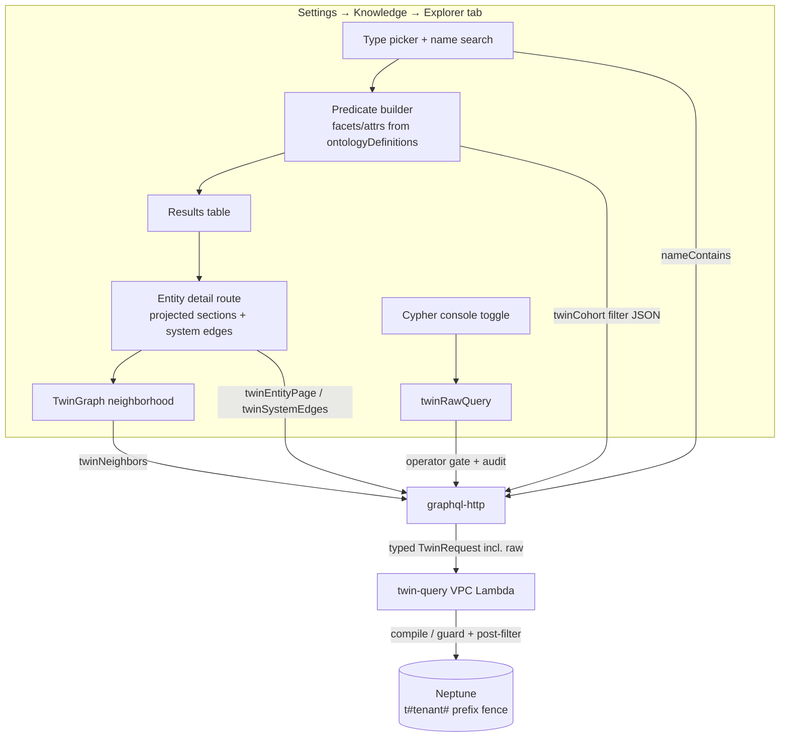
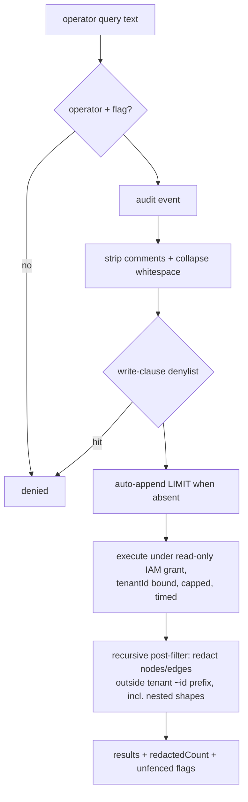

# Knowledge Twin Explorer & Wiki UI Removal - Plan

## Goal Capsule

- **Objective:** Give operators a first-class way to browse and query the Neptune digital twin from Settings → Knowledge — a Twin Explorer tab (typed predicate builder, results table, entity detail with projected sections, neighborhood graph, name search, and a raw openCypher console) — and remove the wiki from the web and mobile UI, landing everything as one release. Linear: THINK-327.
- **Product authority:** Eric Odom's scoping directive 2026-07-22 (this plan's Product Contract). Upstream context: Company Brain plan `docs/plans/2026-07-21-001-feat-company-brain-digital-twin-plan.md` (THINK-325), Living Map plan `docs/plans/2026-07-18-001-feat-ontology-living-map-plan.md` (THINK-320).
- **Stop conditions:** Surface a blocker instead of guessing when a change would (a) weaken the tenant fence on any Neptune read path (raw console included), (b) remove backend wiki tables/lambdas/resolvers (explicitly a later arc), or (c) modify `KnowledgeGraph`'s simulation/camera behavior or fetch seams (Living Map KTD-1 territory).
- **Execution profile:** dev-first; the user-visible flip (tab swap + wiki deletion) ships as one canary release (`desktop-v*` tag — app.thinkwork.ai deploys on the tag, not main). Additive units may merge to main ahead of the flip.

---

## Product Contract

### Summary

Settings → Knowledge gains a Twin Explorer tab replacing the wiki "Pages" tab: pick an entity type, build predicates from the governed facet declarations, see matching entities in a table, click through to a wiki-free entity detail page (projected sections with provenance chips, system edges, neighborhood graph), search entities by name, and — behind a toggle — run raw openCypher against the tenant's subgraph for query testing. All wiki UI (web reader/routes/Pages tab/graph, mobile wiki segment/route/components) is removed; backend wiki tables, lambdas, and resolvers stay for a later removal arc.

### Problem Frame

The full twin read API exists (`twinCohort`, `twinNeighbors`, `twinSystemEdges`, `twinEntityPage`) but the only UI consumer is the projected section renderer embedded inside the wiki page reader — reachable only for entities that already have a wiki page. The 3,751 real TEI customers loaded into the twin (THINK-325) are invisible in the UI despite being fully queryable. Operators also have no way to test queries: the typed predicates have real footguns (camelCase attributes, silent type mismatches) that a schema-driven builder and a raw console would surface immediately. Meanwhile the wiki surface the twin renderer is trapped inside is being retired.

### Requirements

**Explorer (browse + query)**

- R1. A Twin Explorer tab in Settings → Knowledge (operator-gated, replacing the "Pages" tab position) lists entities of a chosen type via `twinCohort`.
- R2. The predicate builder is driven by governed declarations: entity types and their `twinFacets` (attributes) come from `ontologyDefinitions`; the UI only offers declared facets/attributes and sends correctly-typed JSON values (number/string/boolean), eliminating the camelCase and string-coercion footguns for humans.
- R3. Cohort path filters (traverse `relationship` → `targetType` with target predicates) are constrained to declared relationship types (`sourceTypeSlugs`/`targetTypeSlugs` from `ontologyDefinitions`).
- R4. Entity search by display name: typing a name fragment finds matching entities of the selected type (case-insensitive contains), without requiring facet predicates.
- R5. Results render as a table (display name, key facet values, per-facet state) and each row opens the entity detail.

**Entity detail (wiki-free living page)**

- R6. A deep-linkable entity detail route renders the projected page (per-section OK/STALE/ERROR states, cache age, provenance chips) for any canonical entity — no wiki page required.
- R7. The detail view shows system edges (which external systems hold this entity, with external IDs) and a neighborhood graph (`twinNeighbors`).
- R8. Search dossier ("Live" chip) links to the entity detail route instead of the wiki page.

**Cypher console**

- R9. A toggle in the Explorer reveals a raw openCypher input; queries execute read-only against the tenant's subgraph and render results (table for uniform rows, JSON otherwise).
- R10. The console is operator-only, audited, and tenant-fenced: write clauses are rejected, node/edge results outside the caller tenant's `~id` prefix are redacted with a visible count, and scalar/aggregate results carry an explicit "unfenced aggregate" caveat.

**Wiki UI removal**

- R11. All web wiki UI is removed: `/wiki/$type/$slug` route, `WikiPageView`, `WikiPageDetailSheet`, `SettingsWiki` (Pages tab), the search palette Wiki rail, and wiki-only GraphQL operations. `WikiGraph` is removed from `packages/graph` (sole consumer dies).
- R12. All mobile wiki UI is removed: the `wiki` home segment, `app/wiki/[type]/[slug]` route, `components/wiki/*` and `lib/wiki/*` (except extracted twin modules), memory-list wiki chips, and the agent-config Wiki button.
- R13. The twin projected-section renderers (web `twin-page.tsx`; mobile `twin-page.ts` + `twin-sections.tsx`) survive extraction and stay live — web inside the Explorer detail, mobile inside a slim entity screen.
- R14. Backend wiki (tables, `wiki-compile`/`wiki-export` lambdas, GraphQL resolvers, CLI `thinkwork wiki` commands, Pi `wiki_*` tools and their `WikiContextTraceCard` trace rendering) is untouched — removed in a later arc.

### Acceptance Examples

- AE1. **Covers R1, R2, R5.** Given the TEI seed data on dev, when an operator opens the Explorer, picks `customer`, adds `aging.daysPastDue > 90`, then the table shows exactly the 59 past-due customers with real display names and amounts.
- AE2. **Covers R4.** Given the seed data, when the operator types "FORMOSA" in the name search, then FORMOSA PLASTICS CORP appears and its row opens the entity detail.
- AE3. **Covers R6, R7.** Given a seeded customer with no wiki page, when its detail opens, then projected sections render with state chips and age, system edges list `lastmile` with the external ID, and the neighborhood graph renders.
- AE4. **Covers R9, R10.** Given the console toggle is on, when the operator runs `MATCH (n:customer) WHERE n.tenantId = $tenantId RETURN count(n)`, then a count returns with the unfenced-aggregate caveat; when they run a query containing `DELETE`, it is rejected client- and server-side; results containing nodes from another tenant's prefix are redacted with a count.
- AE5. **Covers R11, R12, R13.** Given the release build, when a user visits any former wiki URL or the mobile wiki segment, then the surface is gone; the entity detail and mobile entity screen still render projected sections; `pnpm -r typecheck && pnpm -r test` are green with no dangling wiki imports.

### Scope Boundaries

**Deferred to Follow-Up Work**

- Backend wiki removal (tables, lambdas, resolvers, CLI commands, Pi `wiki_*` tools, `WikiContextTraceCard`, `react-native-sdk` wiki hooks) — its own arc; this plan leaves them dead-but-present where the UI no longer calls them.
- Agent-side twin schema discovery (`twin_schema` tool or facet catalogs in tool descriptions) and numeric coercion in the Pi tool layer — the Explorer solves the footguns for humans; the agent-side fix is tracked separately (THINK-325 residuals).
- Mobile Explorer parity (predicate builder, console). Mobile gets only the slim entity screen (R13); full parity follows the Living Map's mobile-deferral precedent.
- Saved queries / query history in the console beyond the audit log.

**Outside this product's identity**

- Any raw-query surface for non-operator members or agents.
- A second graph engine — the neighborhood graph is a `packages/graph` sibling per the settled convention.
- User-facing "Company Brain" naming — the surface is "Knowledge"; the tab is "Explorer".

### Outstanding Questions

**Deferred to implementation**

- Tab label: "Explorer" assumed (settle against nav copy during U4; "Entities" is the fallback).
- Whether the mobile entity screen is reachable from anywhere beyond direct links in v1 (memory-list chips are removed with wiki; adding a replacement chip pointing at the entity screen is a U9 judgment call).
- Console result cap (100 rows assumed) and per-query timeout (10s assumed) — tune against Neptune behavior during U6.

---

## Planning Contract

### Key Technical Decisions

- KTD-1. **Explorer replaces the "Pages" tab slot; tab bar lives in `SettingsMemoryHome.tsx`, not the nav.** Tabs become `[Memory, Explorer, KBs, Ontology]`; route `/settings/memory/explorer` (+ `$entityType/$canonicalId` child for detail) wrapped in `OperatorGuard`, mirroring the existing thin-route pattern. `settings-nav.tsx` is untouched (the umbrella "Knowledge" entry already points at `/settings/memory`).
- KTD-2. **`KnowledgeGraphExplorer` is the UI template, `ontologyDefinitions` is the schema source.** The Explorer mirrors its table/graph toggle + sheet composition. The predicate builder reads `ontologyDefinitions.entityTypes[].twinFacets` (facet slug → attributes) and `relationshipTypes[].source/targetTypeSlugs` for path filters — both already operator-gated GraphQL, no new declaration surface needed.
- KTD-3. **Name search is a compiler addition, not a new query kind.** The cohort request gains optional `nameContains`; the compiler emits `toLower(n.displayName) CONTAINS toLower($p)` alongside existing predicate conditions. It rides the existing `twinCohort.filter` AWSJSON — no GraphQL schema change. The `contains` predicate op already exists for facet attributes.
- KTD-4. **Neighborhood graph is a new self-fetching `TwinGraph` sibling in `packages/graph`** — never a `KnowledgeGraph` modification (its fetch seam and sim/camera invariants are load-bearing; same reasoning as Living Map KTD-1). `TwinGraph` fetches `twinNeighbors` via urql and maps nodes (label = entity type, display name) and edges (relationship type) onto the settled node/edge shapes; shares `graph-core` helpers.
- KTD-5. **Raw console = a new `raw` kind on `TwinRequest`, guarded in the VPC handler, exposed as one operator-gated GraphQL query.** `twinRawQuery(query)` → `requireAdminOrServiceCaller` + audit event → twin-query Lambda `{kind:"raw", query, parameters:{tenantId}}` — the handler always binds server-derived `{tenantId}` as parameters on raw invocations (never client-supplied), so operators can self-scope with `$tenantId`. Handler guards, in order: strip openCypher comments (`//`, `/* */`) and collapse whitespace, then word-boundary denylist for mutating/procedure clauses (`CREATE|MERGE|DELETE|DETACH|SET|REMOVE|DROP|CALL|LOAD`) — comment-splitting like `DEL/**/ETE` must not survive; auto-append a default `LIMIT 100` when the query has none (cost bound on the pooled cluster); execute under a **dedicated read-only Neptune grant** (`neptune-db:ReadDataViaQuery` only — the shared api role carries write/delete for the projector, so the raw path needs its own IAM segment for the backstop to be real); result cap + timeout; then **post-filter**: walk result values **recursively** (lists, maps, paths included) and drop + count node/relationship values whose `~id` lacks the `t#<tenant>#` prefix (`redactedCount`); scalar values pass through flagged `unfenced: true`. Residual risk — scalar projections of foreign-tenant node properties (e.g. `MATCH (m:customer) RETURN m.email`) pass the post-filter, so the console can exfiltrate arbitrary cross-tenant values, not merely aggregate counts — is the risk the U5 review decision must weigh explicitly; mitigations are operator-only + audited + `company_brain_enabled`-gated + read-only IAM, and the fallback is dev-stage-only gating (see Risks).
- KTD-6. **Extract-before-delete for the twin renderers.** Web `components/memory/twin-page.tsx` is already wiki-free — the Explorer detail imports it and reproduces the ~20-line `TwinEntityPageQuery` wiring currently inside `WikiPageView`, keyed directly on `entityType`+`canonicalId` (no `wikiPage` lookup). Mobile `lib/wiki/twin-page.ts` + `components/wiki/twin-sections.tsx` move to `lib/twin/` + `components/twin/` and are consumed by a new slim `app/entity/[type]/[canonicalId].tsx` screen, so the mobile twin surface stays live rather than becoming dead code.
- KTD-7. **Dossier linking: add `canonicalEntityId` + `entityType` to `EntityDossier`.** `EntityDossierCard` keeps its "Live" chip and re-points its open action to the Explorer detail route; the `wikiPage` field stays in the GraphQL schema (backend arc removes it) but the web query stops selecting it. Resolver-side the values already exist (the dossier resolves them to compute `twinProjected`).
- KTD-8. **Landing order: additive first, flip last, one canary.** U1–U7 are additive and merge as they're ready (Pages tab still present). U8+U9 (wiki deletion + tab swap) merge last, then a single `desktop-v*` canary tag ships the whole arc. GraphQL schema edits require codegen regen in `apps/web`, `apps/mobile`, `apps/cli` (and `pnpm schema:build` if types change).

### High-Level Technical Design

Raw-console guard sequence (U6):

---

## Implementation Units

### U1. Compiler + resolver additions: `nameContains` and cohort surfacing

- **Goal:** Cohort queries can filter by display name; the resolver parses the new filter field.
- **Requirements:** R4.
- **Dependencies:** None.
- **Files:** `packages/api/src/lib/twin/query-compiler.ts`; `packages/api/src/lib/twin/query-compiler.test.ts`; `packages/api/src/graphql/resolvers/twin/index.ts` (+ its test).
- **Approach:** Optional `nameContains: string` on the cohort request; compiler validates length (1–100 chars, no injection surface — value is a parameter, never query text) and emits `toLower(n.displayName) CONTAINS toLower($pN)`. Resolver passes the field through from the `filter` JSON.
- **Test scenarios:** cohort with only `nameContains` returns matching entities case-insensitively; combined with facet predicates ANDs correctly; empty/oversized string rejected with `TwinCompileError`; value lands in parameters, not query text; tombstone guards unaffected.
- **Verification:** `pnpm --filter @thinkwork/api test` green.

### U2. Explorer detail view: wiki-free projected entity page (web)

- **Goal:** A deep-linkable entity detail that renders projected sections, system edges, and header identity without any wiki dependency.
- **Requirements:** R6, R7 (system-edges half), R13 (web half). Covers AE3 (detail portion).
- **Dependencies:** None (twin-page.tsx is already wiki-free).
- **Files:** `apps/web/src/routes/_authed/settings.memory.explorer.$entityType.$canonicalId.tsx` (new); `apps/web/src/components/settings/twin-explorer/TwinEntityDetail.tsx` (new, + test); `apps/web/src/components/memory/twin-page.tsx` (import as-is); `apps/web/src/lib/graphql-queries.ts` (`TwinEntityPageQuery` reuse; `TwinSystemEdgesQuery` new).
- **Approach:** Route params carry `entityType` + `canonicalId`; the component runs `TwinEntityPageQuery` directly (no `wikiPage` gate — reproduce the ~20-line wiring from `WikiPageView.tsx:133-149,283-296`) and renders via `parseTwinEntityPage`/`TwinSectionStateChip`/`TwinSectionBody`. A system-edges panel lists `{systemSlug, externalId, namespace}` rows. Compiled-fallback (`projected: false`) renders the reason plainly.
- **Patterns to follow:** `WikiPageView`'s twin wiring (being replaced); `KnowledgeGraphEntitySheet` composition.
- **Test scenarios:** Covers AE3 — projected page renders sections with state chips + age for an entity with no wiki page; `no_sections_declared` fallback renders; operator-only sections appear for operators and are absent for members (server already filters — assert no client crash on absence); system edges render external IDs; invalid canonicalId shows the error state.
- **Verification:** `pnpm --filter @thinkwork/web test` green; dev smoke on a TEI-seeded customer.

### U3. `TwinGraph` neighborhood component

- **Goal:** Self-fetching neighborhood graph in `packages/graph`, embedded in the U2 detail.
- **Requirements:** R7 (graph half). Covers AE3 (graph portion).
- **Dependencies:** U2.
- **Files:** `packages/graph/src/TwinGraph.tsx` (new, + test); `packages/graph/src/queries.ts`; `packages/graph/src/index.ts`; `apps/web/src/components/settings/twin-explorer/TwinEntityDetail.tsx`.
- **Approach:** Sibling per KTD-4: urql `twinNeighbors(canonicalId, depth)` query, nodes mapped `{id: ~id, label: displayName ?? canonicalId, typeLabel: ~labels[0]}`, edges labeled by relationship type; `graph-core` label gating and camera constants; depth selector 1–2 (compiler `MAX_NEIGHBOR_DEPTH`); node click navigates to that entity's detail route via an `onNodeClick` callback (component stays router-agnostic).
- **Test scenarios:** maps a twinNeighbors payload to node/edge shapes (unit); empty neighborhood renders the empty state, not a crash; node click fires the callback with the canonical id parsed from the `~id`; refetch on depth change preserves camera (no sim restart).
- **Verification:** `pnpm --filter @thinkwork/graph test` green; dev smoke: fixture customer with tank edges renders the cross-system neighborhood.

### U4. Explorer tab: type picker, predicate builder, results table

- **Goal:** The browse/query surface — the new tab wired to `twinCohort`.
- **Requirements:** R1, R2, R3, R4 (UI half), R5. Covers AE1, AE2.
- **Dependencies:** U1, U2.
- **Files:** `apps/web/src/routes/_authed/settings.memory.explorer.tsx` (new); `apps/web/src/components/settings/SettingsMemoryHome.tsx` (+ its tests); `apps/web/src/components/settings/twin-explorer/{TwinExplorer.tsx,PredicateBuilder.tsx}` (new, + tests); `apps/web/src/lib/graphql-queries.ts` (`TwinCohortQuery` new; `ontologyDefinitions` reuse from settings queries).
- **Approach:** Tab added per KTD-1 (Explorer in the Pages slot — the swap itself waits for U8; until then Explorer appears alongside Pages). Type picker from `ontologyDefinitions.entityTypes` (lifecycle `approved`); facet/attribute dropdowns from `twinFacets`. Predicates render as **stacked rows with a "+ Add predicate" affordance and a per-row remove control; combination is AND-only** (matching the compiler's WHERE semantics — no OR). Op picker hard-codes the compiler's current op list (`eq/ne/gt/gte/lt/lte/exists/contains`) in one web constant with a comment pointing at `TwinPredicateOp` in `query-compiler.ts` (apps/web cannot import packages/api); value input typed (number input coerces to JSON number, boolean to boolean). Path filter section constrained by `relationshipTypes` source/target slugs. Name search box maps to `nameContains`. Results table: display name, the predicate-relevant facet values, per-facet state chip; row click → detail route. Loading state (skeleton rows) while `twinCohort` resolves; empty/error/`unavailable` states explicit; compile errors surface inline above the results.
- **Execution note:** Verify against live dev data, not only mocks — the camelCase/typing footguns this UI exists to kill only show up against the real compiler.
- **Test scenarios:** Covers AE1 — builder with `aging.daysPastDue > 90` issues a filter JSON with a *number* value; Covers AE2 — name search issues `nameContains`; adding a second predicate row re-issues the query with both conditions ANDed and removing a row re-issues without it; only declared facets/attributes are offered; path filter offers only declared relationships for the chosen type; limit clamps at 100 with a visible note; loading skeleton renders while the query is in flight; `unavailable` result renders the degrade state; row click navigates with type + canonicalId.
- **Verification:** `pnpm --filter @thinkwork/web test` green; dev E2E: the Explorer's row counts for `aging.daysPastDue > 90` and `> 60` equal a same-day direct `twinCohort` invocation with the identical filter (59/88 are the 2026-07-22 reference values; the data refreshes, the UI-vs-API equality is the gate).

### U5. Raw-query API: `raw` TwinRequest kind + `twinRawQuery` GraphQL

- **Goal:** Guarded server path for operator openCypher.
- **Requirements:** R9 (API half), R10.
- **Dependencies:** None (parallel with U1–U4).
- **Files:** `packages/api/src/lib/twin/query-compiler.ts` (raw kind passthrough + guard helpers, + test); `packages/api/src/handlers/twin-query.ts` (+ test); `packages/api/src/lib/twin/client.ts`; `packages/api/src/graphql/resolvers/twin/index.ts` (+ test); `packages/database-pg/graphql/types/twin.graphql`; `terraform/modules/app/lambda-api/iam-grouped.tf` (dedicated read-only Neptune grant for the raw path); codegen in `apps/web`/`apps/mobile`/`apps/cli`.
- **Approach:** Per KTD-5. `twinRawQuery(tenantId, query): AWSJSON!` — `requireAdminOrServiceCaller` (hard gate, same as suggestions mutations), audit event carrying the query text, then Lambda invoke `{kind:"raw", query, parameters:{tenantId}}` (server-derived binding, always). Guard order in the handler: strip comments + collapse whitespace → denylist regex (word-boundary, case-insensitive) → auto-append `LIMIT 100` when absent → execute under the read-only grant with cap + timeout → recursive post-filter by `~id` prefix (drop + count non-tenant nodes/edges anywhere in the value tree; flag scalars `unfenced`). Response `{ok, columns?, rows, redactedCount, unfenced}`. The read-only IAM grant is the structural backstop; the denylist is UX, not the fence.
- **Execution note:** Test-first on the guard branches — they are the security-bearing code.
- **Test scenarios:** Covers AE4 — `DELETE`/`MERGE`/`SET` (any case, embedded mid-query) rejected before execution; comment-split keywords (`DEL/**/ETE`, `CA/**/LL`, `//`-suffixed lines) rejected after stripping; `create` as a *substring of an identifier* (`n.created_at`) is NOT rejected (word-boundary); a query referencing `$tenantId` resolves against the caller's tenant; a query with no `LIMIT` gets the default appended; foreign-prefix nodes are dropped and counted at top level AND nested inside `collect(...)` lists, map projections, and path values; scalar rows flagged unfenced; non-operator caller denied at the resolver; audit event written per invocation; cap truncates with a flag; handler timeout returns `unavailable`, not a hang; a write attempt fails at IAM even when the denylist is bypassed (verified live against the read-only grant, not only via the denylist unit tests).
- **Verification:** `pnpm --filter @thinkwork/api test` green; manual dev invokes proving (a) redaction against the second tenant's data (academic-bobcat-897 has ungoverned nodes to redact against) and (b) an IAM-denied write via the raw path.

### U6. Cypher console UI

- **Goal:** The toggle-revealed console inside the Explorer.
- **Requirements:** R9 (UI half), R10 (surfacing). Covers AE4 (UI portion).
- **Dependencies:** U4, U5.
- **Files:** `apps/web/src/components/settings/twin-explorer/CypherConsole.tsx` (new, + test); `TwinExplorer.tsx`; `apps/web/src/lib/graphql-queries.ts` (`TwinRawQuery`).
- **Approach:** Toggle in the Explorer header ("Console"); monospace textarea, Run (Cmd+Enter), result renderer — table when rows are uniform objects, JSON tree otherwise; banners for `redactedCount > 0` and `unfenced`; while a query is in flight the Run button disables and a pending indicator shows (the raw path can take the full 10s timeout — no double-submits, no duplicate audit events); client-side denylist mirror with the same comment-stripping normalization for instant feedback (server remains authoritative); last-query kept in component state only (history deferred).
- **Test scenarios:** run renders a tabular result; Run is disabled with a pending indicator while a query is in flight; redaction banner shows the count; unfenced banner on scalar results; client denylist blocks a `DELETE` and a comment-split `DEL/**/ETE` with an explanatory message without a network call; server rejection renders the server's reason; console hidden for non-operators.
- **Verification:** `pnpm --filter @thinkwork/web test` green; dev smoke with the AE4 queries.

### U7. Dossier + search re-point

- **Goal:** Search stops linking into wiki; the "Live" chip routes to the Explorer detail.
- **Requirements:** R8, R11 (search slice).
- **Dependencies:** U2.
- **Files:** `packages/database-pg/graphql/types/search.graphql` (`EntityDossier.canonicalEntityId`, `entityType`); the dossier resolver in `packages/api/src/graphql/resolvers` (+ test); `apps/web/src/components/shell/{EntityDossierCard.tsx,ChatSidebar.tsx,SearchPalette.tsx,SearchAskView.tsx}` (+ tests); `apps/web/src/lib/graphql-queries.ts`; codegen regen (all four consumers).
- **Approach:** Per KTD-7: expose the canonical id + type the resolver already computes; `EntityDossierCard` keeps the Live chip, its open action navigates to `/settings/memory/explorer/$entityType/$canonicalId`; drop the `wikiPage` selection from the web query (schema field stays). Remove the SearchPalette Wiki rail (`SearchSource.Wiki`, `wikiHits`, `onSelectWiki`) and `ChatSidebar.openSearchWiki`; fix the `SearchAskView` "Checking the wiki" phase label.
- **Test scenarios:** dossier with `twinProjected: true` renders the Live chip and links to the Explorer route; dossier without a canonical id renders without an open action (no dead link); palette renders without a Wiki rail; the EntityDossier query no longer selects `wikiPage` (the remaining `ComputerWikiPage*` root-field queries are removed in U8).
- **Verification:** `pnpm --filter @thinkwork/web test` + `pnpm --filter @thinkwork/api test` green.

### U8. Web wiki removal + tab swap

- **Goal:** Delete the web wiki surface; Explorer takes the Pages slot.
- **Requirements:** R11, R13 (web survival proof). Covers AE5 (web half).
- **Dependencies:** U2, U4, U7 (everything that must exist before deletion).
- **Files:** Delete `apps/web/src/routes/_authed/_shell/wiki.$type.$slug.tsx`, `routes/_authed/settings.wiki.tsx`, `routes/_authed/settings.memory.wiki.tsx`, `components/memory/{WikiPageView.tsx,WikiPageView.test.tsx,WikiPageDetailSheet.tsx}`, `components/settings/SettingsWiki.tsx`, `packages/graph/src/WikiGraph.tsx` (+ test, + `queries.ts`/`index.ts` wiki exports and now-orphaned `WikiPageType`/`pageTypeLabel` helpers). Modify `SettingsMemoryHome.tsx` (+ tests — Pages tab out, Explorer in its slot), `components/memory/twin-page.test.tsx` (drop the WikiPageView dual-read block), `lib/graphql-queries.ts` (+ test — drop `ComputerWikiPage*`, `ComputerRecentWikiPagesQuery`, `ComputerWikiSearchQuery`), regenerate `routeTree.gen.ts` + `gql/*`.
- **Approach:** Pure deletion + regen; `WikiContextTraceCard`/`TaskThreadView`, `relationship-badges`, `RelatedMemories`, `settings-queries.ts` stay per R14. Grep-gate the unit: zero `Wiki` imports outside the keep-list before calling it done (grep must match import forms, not just the word).
- **Test scenarios:** Test expectation: deletion unit — the proof is the survivors: full web suite green, typecheck green, routeTree regen has no wiki routes, `SettingsMemoryHome` tests assert `[Memory, Explorer, KBs, Ontology]`.
- **Verification:** `pnpm --filter @thinkwork/web test && pnpm --filter @thinkwork/web typecheck` green; dev smoke: `/wiki/...` 404s, Explorer occupies the tab.

### U9. Mobile wiki removal + slim entity screen

- **Goal:** Delete the mobile wiki surface; keep the twin renderer alive behind a minimal entity screen.
- **Requirements:** R12, R13 (mobile half). Covers AE5 (mobile half).
- **Dependencies:** U7 (dossier fields exist), independent of U8.
- **Files:** Move `lib/wiki/twin-page.ts` → `lib/twin/twin-page.ts`, `components/wiki/twin-sections.tsx` → `components/twin/twin-sections.tsx`; new `app/entity/[type]/[canonicalId].tsx`. Delete `app/wiki/[type]/[slug].tsx`, `components/wiki/*` (remaining 19 files incl. `graph/` subtree), `lib/wiki/{source-rows.ts(+test),segment-state.ts(+test),native-reader.test.ts}`, `components/home/WikiSegment.tsx`. Modify `components/home/segments.ts` (+ `SegmentedControl.test.ts`), `app/(tabs)/index.tsx`, `app/settings/agent-config.tsx`, `app/memory/list.tsx` (wiki chips out), `lib/graphql-queries.ts` (drop `WikiPageSourceMemoryIdsQuery`/`WikiPageTwinKeysQuery`; keep `TwinEntityPageQuery`), regen `lib/gql/*`.
- **Approach:** The entity screen takes `type` + `canonicalId` params and renders `TwinProjectedSections` from `TwinEntityPageQuery` directly — no `wikiPage` gate, no graph, no sources sheet. `react-native-sdk` wiki hooks stay (dead, backend arc). The mobile knowledge-graph canvas subtree (`components/wiki/graph/`) deletes whole — its only consumers are wiki surfaces.
- **Test scenarios:** entity screen renders projected sections for a seeded customer id; home segment list has no wiki entry; `?segment=wiki` deep link degrades to the default segment (no crash); memory list renders without wiki chips; typecheck finds no dangling imports.
- **Verification:** `pnpm --filter @thinkwork/mobile test` (if present) + `pnpm --filter @thinkwork/mobile typecheck` green; Expo smoke on the entity screen.

---

## Verification Contract

| Gate | Command / proof | Applies to |
|---|---|---|
| API suite | `pnpm --filter @thinkwork/api test` (full package suite, not just touched files) | U1, U5, U7 |
| Web suite + types | `pnpm --filter @thinkwork/web test && pnpm --filter @thinkwork/web typecheck` | U2, U4, U6, U7, U8 |
| Graph package | `pnpm --filter @thinkwork/graph test` | U3, U8 |
| Mobile types/tests | `pnpm --filter @thinkwork/mobile typecheck` (+ test where present) | U9 |
| Codegen freshness | `pnpm --filter @thinkwork/<web,mobile,cli,api> codegen` after any `.graphql` edit; committed output matches | U5, U7 |
| Monorepo gate | `pnpm lint && pnpm typecheck && pnpm test && pnpm format:check` before each PR | all |
| Live E2E (dev) | Explorer row counts for `aging.daysPastDue > 90` / `> 60` equal a same-day direct `twinCohort` invocation with the identical filter (2026-07-22 reference: 59/88 — the data refreshes, UI-vs-API equality is the gate); FORMOSA name search resolves; entity detail + neighborhood render for a seeded customer; AE4 console checks incl. cross-tenant redaction and an IAM-denied write | U4, U6, release |
| Release | `desktop-v*` canary tag cut after U8+U9 merge; app.thinkwork.ai smoke in Chrome (tab swap visible, `/wiki/...` gone, dossier Live chip routes to Explorer) | release |

## Definition of Done

- All of U1–U9 merged to `main`; the flip units (U8, U9) land last; one `desktop-v*` canary tag ships the arc and the deployed web app passes the release smoke.
- AE1–AE5 demonstrated on dev against the TEI seed data, with the console's cross-tenant redaction proven against a second tenant.
- No wiki imports remain in `apps/web`/`apps/mobile` outside the R14 keep-list; `routeTree.gen.ts` and all `gql/*` outputs regenerated and committed.
- Every raw-console invocation writes an audit event (verified in dev).
- Abandoned-attempt code from the arc removed; worktrees and branches cleaned after merge.
- THINK-327 carries the evidence (screenshots of Explorer, detail, console; the E2E numbers) and moves to review.

---

## Risks & Dependencies

- **Raw-console tenant fence is post-hoc, not structural.** Scalar projections of foreign-tenant node properties (e.g. `MATCH (m:customer) RETURN m.email`) pass the post-filter — the console can exfiltrate arbitrary cross-tenant values, not merely aggregate counts (KTD-5 residual). Mitigations: operator-only, audited, feature-flag-gated, dedicated read-only IAM, comment-stripped denylist, default LIMIT. If this risk is unacceptable for customer tenants, the fallback is gating the console to dev-stage only via runtime config — decide at U5 review **against this framing**, not the softer counts-only one.
- **Living Map (THINK-320) collision.** Both arcs touch `SettingsMemoryHome`/Knowledge Model surfaces and `packages/graph`. This plan adds a sibling component and a new tab; it does not touch `KnowledgeModelTab` internals or `KnowledgeGraph`. If Living Map implementation starts concurrently, sequence the `SettingsMemoryHome` edits (one-line tab-array merges, low conflict).
- **Search degrade.** After U7/U8, entities that are *not* twin-projected lose their search click-through (compiled wiki page was the fallback). Accepted: the dossier still renders memories/threads/artifacts; the open action simply requires a canonical id. Revisit when the backend arc replaces compiled pages.
- **Mobile store review latency.** The mobile flip rides TestFlight, not the web canary; U9 merging with U8 keeps code in step, but device availability lags the web release. Accepted.
- **Upstream dependency:** `company_brain_enabled` must be ON for the target stage (already ON for dev) or the Explorer renders its degrade state everywhere.

## Assumptions

- Tab label "Explorer" and web-only Explorer (mobile gets the slim entity screen only) — flagged in Outstanding Questions, proceeding without further confirmation per the auto-confirm directive.
- The wiki "Pages" tab has no other consumer entry points beyond those in the U7/U8 file lists (inventory was exhaustive as of 2026-07-22).
- Raw-console residual aggregate-leak risk is acceptable at operator gating (Risks fallback documented).
