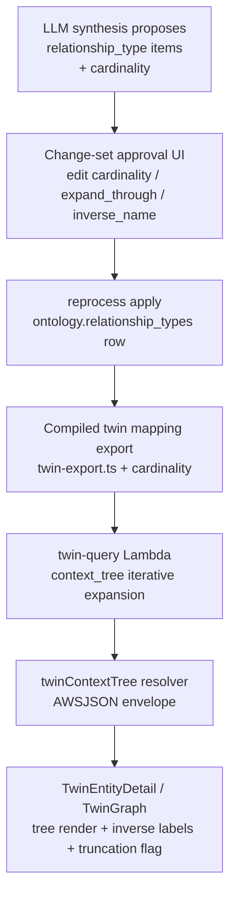

# Ontology Cardinality & Context Tree - Plan

## Goal Capsule

- **Objective:** Add cardinality metadata to ontology relationship types and use it to drive a bounded "context tree" traversal that becomes the Twin Explorer's node neighborhood view — all related parties of a node, without hub fan-out.
- **Product authority:** Eric, via the 2026-07-22 brainstorm dialogue this contract records. Product Contract unchanged by planning enrichment.
- **Authority hierarchy:** Product Contract (R-IDs, AE-IDs) > Planning Contract KTDs > per-unit Approach. Session-settled KTDs are closed decisions; do not re-open them during implementation.
- **Stop conditions:** Surface a genuine blocker instead of guessing when (a) a live Neptune verification invalidates the planned query emission (KTD-1 fallback shapes included), (b) the backfill or direction-flip change-set would mutate types beyond TEI's approved set unexpectedly, or (c) the Twin Explorer surface has conflicting in-flight canary changes.
- **Execution constraint:** The local main checkout is stale — the entire twin layer (`packages/api/src/lib/twin/`, `packages/graph/src/TwinGraph.tsx`, `apps/web/.../twin-explorer/`) exists only on `origin/main`. Implement from a fresh worktree off `origin/main`.

---

## Product Contract

### Summary

Relationship types gain a cardinality value (LLM-proposed, human-approved through the existing change-set flow). A new context-tree traversal expands to-one edges transitively and to-many edges only from the focal node, replacing the depth-selector neighborhood view in the Twin Explorer. A backfill change-set for existing approved types ships with the feature so trees are fully populated at launch.

### Problem Frame

The Twin Explorer's neighborhood view is bounded today by blunt controls: depth limits plus hard caps on edges and entities. Any hop-based expansion from a node like Order explodes through hub nodes — Order → Customer → the customer's thousands of other orders — so the caps truncate arbitrarily rather than meaningfully. Edge direction in the graph is purely semantic (Neptune traverses both ways at equal cost), so direction cannot carry the "don't fan out here" signal. The ontology currently records no relationship multiplicity at all, leaving no principled way to compute "the related parties of this node" versus "this node's siblings."

### Key Decisions

- **Cardinality on the relationship type is the traversal policy driver** — not hop depth, not edge direction, not per-instance data. (session-settled: user-approved — chosen over depth limits and duplicated reverse edges: cardinality bounds fan-out by meaning; depth limits are both too greedy at hubs and too stingy along to-one chains.)
- **One canonical stored direction per relationship type, with `inverse_name` for reverse-direction display.** No duplicated reverse edges. (session-settled: user-approved — chosen over storing both `Has Order` and `For Customer` edges: reverse edges double writes and drift out of sync; the existing `inverse_name` column already carries the display need.)
- **LLM proposes cardinality; humans approve it in the existing change-set flow.** (session-settled: user-directed — chosen over manual-only authoring and inference from instance data: fits the established proposed→approved lifecycle; instance-derived values are wrong on sparse data and unstable.)
- **The context tree replaces the depth-selector neighborhood view.** (session-settled: user-directed — chosen over adding it as a second mode: one mental model for users; existing hard caps remain only as a safety net.)
- **Null cardinality means to-many (conservative), and a backfill change-set ships with the feature.** (session-settled: user-directed — chosen over shipping shallow and backfilling later: null-as-to-many keeps the rule safe permanently, while the launch backfill prevents day-one trees from being shallower than today's depth-2 view.)
- **Many-to-many edges behave as to-many from both sides** — root-only expansion, never transitive. No separate flag distinguishes them from one-to-many for traversal purposes.

### Requirements

**Cardinality metadata**

- R1. Every relationship type can carry a cardinality value, expressed relative to its stored source→target direction: `one_to_one`, `one_to_many`, `many_to_one`, or `many_to_many`. The value is nullable.
- R2. A relationship type can carry an `expand_through` override marking a to-many edge as expandable below the root (e.g., always pull an Order's Items' Products into the tree). No type is expected to enable it at launch.

**Context-tree traversal**

- R3. From a focal node, the traversal expands every edge that is to-one from the current node's perspective, transitively and regardless of stored direction; edges that are to-many from the current node's perspective expand only when the current node is the focal node or the edge type has `expand_through`.
- R4. Null cardinality is treated as to-many.
- R5. Many-to-many is treated as to-many from both endpoints.
- R6. The existing hard caps (edge/entity/depth limits) remain as a safety backstop; when a cap truncates a tree, the UI indicates truncation rather than presenting the tree as complete.

**Twin Explorer UI**

- R7. The context tree replaces the depth-selector neighborhood view as the Twin Explorer's node neighborhood surface.
- R8. Edge labels render from the focal side's perspective: the type's `name` when read along the stored direction, its `inverse_name` when read against it, falling back to `name` when `inverse_name` is unset.

**Approval flow and backfill**

- R9. The pipeline that proposes relationship types also proposes cardinality; the change-set approval surface displays and allows editing cardinality, `expand_through`, and `inverse_name` before approval.
- R10. A one-time LLM-proposed backfill change-set covering existing approved relationship types (TEI's current set) ships with the feature and flows through the normal approval loop.

**Direction normalization**

- R11. A canonical direction convention (owner/whole → owned/part; one-side → many-side for one-to-many) is documented in the ontology guidance, and existing types that contradict it are flipped via change-set — including their already-seeded instance edges.

### Acceptance Examples

- AE1. Bounded Order tree
  - **Covers R3, R5.**
  - **Given** TEI's ontology with cardinality set (Order→Customer many-to-one, Customer→Sales Rep many-to-one, Order→Order Item one-to-many, Order→Ship-To many-to-one).
  - **When** a user focuses an Order in the Twin Explorer.
  - **Then** the tree shows the Order's Customer, Ship-To, Terminal, Sales Location, Order Items, and Bill of Lading, and continues through to-one chains (Customer → its Sales Rep); it does not show the Customer's other Orders or any other node's to-many collections.
- AE2. Conservative null
  - **Covers R4.**
  - **Given** a relationship type with null cardinality reachable one to-one hop from the focal node.
  - **When** the tree is computed.
  - **Then** that edge type appears only where the focal node itself is an endpoint; it is never expanded transitively.
- AE3. Truncation is visible
  - **Covers R6.**
  - **Given** a focal node whose context tree exceeds a safety cap.
  - **When** the tree renders.
  - **Then** the user sees an explicit truncation indicator, not a silently trimmed tree.
- AE4. Inverse labeling
  - **Covers R8.**
  - **Given** `Customer —Has order→ Order` with `inverse_name` "Placed by".
  - **When** an Order is the focal node.
  - **Then** the edge to its Customer reads "Placed by"; when a Customer is focal, the same edge reads "Has order".

### Scope Boundaries

- No cardinality rendering in the graph's edge visuals (crow's-foot markers, label styling) — cardinality drives traversal only.
- The Twin MCP server does not consume the context tree in this work; it can adopt the same primitive later. (Cheap adjacent win allowed: `packages/api/src/lib/twin/describe-ontology.ts` may include cardinality in its relationship descriptions since the export will carry it.)
- No per-instance cardinality — the value lives on the relationship type only.
- No change to how relationship instances are extracted or matched; this work touches type metadata, traversal, and the Explorer surface.

#### Deferred to Follow-Up Work

- Single-query openCypher emission of the whole context tree (type-alternation variable-length paths) as a performance optimization, once verified live (see KTD-1).
- Rendering cardinality in the ontology schema map view (`assembleOntologySchemaGraph` currently selects only slug/name/endpoints).
- Compounding the Neptune dialect + seed/rebuild learnings into `docs/solutions/` (currently only in session memory).

### Dependencies / Assumptions

- Builds on the Twin Explorer neighborhood surface shipped by THINK-327 (`twinNeighbors`, `TwinGraph`, twin-explorer components) — present on `origin/main` only.
- The change-set approval loop (`ontology.change_sets` → `change_set_items`) is the vehicle for cardinality authoring, the backfill, and direction flips.
- The relationship-instance seed loader is external to this repo (LastMile zip/runbook, n8n-invoked Lambda). Direction flips rebuild seeded edges operationally: flip via change-set → compiled twin mapping export regenerates on apply → external loader re-run. The plan documents this step; it does not automate it.
- Twin Explorer UI has active canary churn (THINK-327 evidence, THINK-328 verification); web-only changes must be verified against the canary that carries them.

---

## Planning Contract

### Key Technical Decisions

- KTD-1. **Context-tree traversal executes as bounded iterative expansion inside the twin-query Lambda.** The compiler adds a `context_tree` request kind whose execution is a loop: expand the focal node's one-hop neighborhood, then repeatedly expand the frontier through to-one edge types only, using small per-hop openCypher queries with literal bounds. (session-settled: user-approved — chosen over a single variable-length-path query: Neptune's openCypher dialect has bitten this repo twice (`NONE()`/`ALL()` rejected; VLP bounds constant-only), per-hop queries are unit-testable TypeScript, and safety caps stay enforceable mid-loop. Single-query emission is a deferred optimization behind a live spike.)
- KTD-2. **Cardinality reaches the twin layer through the compiled twin mapping export.** `packages/api/src/lib/ontology/twin-export.ts` adds `cardinality`, `expandThrough`, and `inverseName` to its relationship selection and `TwinMappingRelationship` type; the export regenerates on every change-set apply and is already how `describe-ontology.ts` consumes ontology shape. (session-settled: user-approved — chosen over a new Postgres read in the resolver path: the export is the designed ontology→twin seam.)
- KTD-3. **Backfill change-set items carry full current values plus the proposed cardinality.** `applyRelationshipTypeItem`'s upsert fully overwrites `name`/`description`/`inverse_name`/slugs/aliases on conflict, so a cardinality-only item would wipe fields. The backfill generator reads each approved type's current row and emits complete `proposedValue` objects. (session-settled: user-approved — chosen over making the apply function patch-aware: smaller blast radius; patch-aware apply would change semantics for every existing change-set producer.)
- KTD-4. **New GraphQL query field `twinContextTree(tenantId, canonicalId)` returning the standard `AWSJSON` twin envelope.** Matches every existing twin query (`{ok, results|reason}`, no typed payload), so no AppSync schema work and no payload codegen; only the field addition flows through `ontology`/`twin` codegen consumers (`apps/web`, `apps/cli`, `apps/mobile` — `packages/api` has no codegen script on origin/main).
- KTD-5. **Approval UI surfaces cardinality as directional phrases, stores the enum.** Reviewer-facing labels read from the source type's perspective — "one → one", "one → many", "many → one", "many → many" (with source/target type names in context); the stored values remain `one_to_one|one_to_many|many_to_one|many_to_many`. Resolves the brainstorm's vocabulary question.
- KTD-6. **Direction flips are a change-set plus an operational rebuild runbook, not new migration tooling.** A flip updates the type row (swap `source_type_slugs`/`target_type_slugs`, swap `name`/`inverse_name`, swap `source_binding` endpoints); the compiled export regenerates on apply; seeded Neptune edges are rebuilt by re-running the external loader against the regenerated export. (session-settled: user-approved — chosen over building in-repo edge-rewrite tooling: the loader lives outside this repo and already consumes the export.)
- KTD-7. **The new column ships as a nullable enum-checked text column via a hand-rolled migration.** Pattern: `drizzle/0271_ontology_twin_declarations.sql` header (`-- Purpose:`, `-- creates-column:` markers, psql apply instructions), `ADD COLUMN IF NOT EXISTS`, CHECK constraint admitting NULL, `SET LOCAL lock_timeout/statement_timeout`. Additive only — no expand/contract sequencing needed. Apply to dev via psql before merge so the `db:migrate-manual` deploy gate sees it.

### High-Level Technical Design

Data flow — how cardinality travels from authoring to rendering:



Traversal algorithm (directional guidance, not implementation specification):

```
contextTree(focal):
  tree = {focal}; frontier = [focal]; truncated = false
  # hop 1: focal expands EVERYTHING (its to-many collections included)
  edges = expandAll(focal)                      # per-hop query, literal LIMIT
  admit(edges)
  # subsequent hops: only to-one (from current node's perspective) or expand_through
  while frontier not empty and under caps:
    node = frontier.pop()
    for relType touching node.type:
      perspective = toOneFrom(node, relType)    # uses cardinality + stored direction
      if perspective is to-one OR relType.expandThrough:
        edges = expandTyped(node, relType)      # small directed per-hop query
        admit(edges)                            # adds new nodes to frontier
  if any cap hit: truncated = true
  return {nodes, edges (with sourceId/targetId for label direction), truncated}

toOneFrom(node, relType):
  # relative to stored source→target direction
  one_to_one   → to-one from both ends
  many_to_one  → to-one when node is on the source side
  one_to_many  → to-one when node is on the target side
  many_to_many → never to-one
  null         → treated as to-many (never to-one)
```

Per-hop queries follow the existing `neighbors` emission idioms: `size([rel IN relationships(p) WHERE type(rel)='external_identity']) = 0` fencing (never `NONE()`/`ALL()`), literal numeric bounds, `startNode/endNode` in the payload so the client can resolve `name` vs `inverse_name`.

### Assumptions

- Loop depth is bounded by a literal max (reuse/extend the compiler's existing depth ceiling) plus the existing edge/entity caps; a to-one chain longer than the ceiling reports truncation (R6).
- TEI's approved relationship-type set is small (~16); the backfill change-set is one reviewable draft, and partial apply failure is visible through the existing reprocess ledger (see `docs/solutions/best-practices/business-ontology-change-set-loop-2026-05-17.md`).
- THINK-330 (twin RLS, aclPredicates in `TwinQueryEvent`) is in-flight design; the `context_tree` kind keeps predicates injectable the same way `neighbors` does, and paints no corner.

---

## Implementation Units

### U1. Schema, migration, and GraphQL surface for cardinality

- **Goal:** `ontology.relationship_types` carries nullable `cardinality` and `expand_through`, exposed end-to-end through GraphQL.
- **Requirements:** R1, R2.
- **Dependencies:** none.
- **Files:** `packages/database-pg/src/schema/ontology.ts`; new `packages/database-pg/drizzle/NNNN_ontology_relationship_cardinality.sql` (next free number — check for collisions, latest on origin/main is 0274); `packages/database-pg/graphql/types/ontology.graphql` (`OntologyRelationshipType`, `UpdateOntologyRelationshipTypeInput`); `packages/api/src/lib/ontology/mappers.ts`; codegen runs in `apps/web`, `apps/cli`, `apps/mobile`.
- **Approach:** Mirror the `source_binding`/`source_binding_version` column-comment style; CHECK constraint `cardinality IN (...)` admitting NULL, shaped like `ontology_relationship_types_lifecycle_allowed`. `expand_through boolean NOT NULL DEFAULT false`. Hand-rolled migration per KTD-7 with `-- creates-column: ontology.relationship_types.cardinality` (and `.expand_through`) markers.
- **Execution note:** Apply the migration to dev via `psql "$DATABASE_URL" -v ON_ERROR_STOP=1 -f <file>` before merge; the deploy workflow's `db:migrate-manual` gate checks the declared markers.
- **Test scenarios:**
  - Mapper maps `cardinality`/`expand_through` row values to GraphQL fields, and null cardinality to null (`packages/api/src/lib/ontology/mappers` coverage or the repository test that exercises mapping).
  - Migration file declares `-- creates-column:` markers for both columns (drift reporter contract).
- **Verification:** `pnpm --filter @thinkwork/database-pg build` + `pnpm typecheck` green; `pnpm db:migrate-manual` reports the new columns present on dev after psql apply; codegen diffs committed for web/cli/mobile.

### U2. Change-set pipeline and twin export carry cardinality

- **Goal:** Cardinality and `expand_through` flow through proposal, direct edit, change-set apply, and the compiled twin mapping export.
- **Requirements:** R9 (pipeline half), R1; enables KTD-2.
- **Dependencies:** U1.
- **Files:** `packages/api/src/lib/ontology/reprocess.ts` (`applyRelationshipTypeItem` — add to both `values` and `onConflictDoUpdate.set`); `packages/api/src/lib/ontology/repository.ts` (`updateOntologyRelationshipType` patch fields); `packages/api/src/lib/ontology/suggestions.ts` (`ONTOLOGY_SYNTHESIS_SYSTEM` JSON contract + deterministic fallback proposals gain cardinality examples); `packages/api/src/lib/ontology/twin-export.ts` (relationship select + `TwinMappingRelationship` gains `cardinality`, `expandThrough`, `inverseName`); tests alongside each.
- **Approach:** Follow the exact `inverse_name: nullableString(value.inverseName)` handling for the new fields; verify proposal normalization (`normalizeModelProposal`, `ontologyItemType`) passes the new keys through rather than stripping them.
- **Test scenarios:**
  - `reprocess.test.ts`: applying a `relationship_type` item with cardinality persists it; item without cardinality leaves the column null; re-apply (upsert conflict path) updates cardinality.
  - `repository.test.ts`: patch mutation updates cardinality only when provided (undefined leaves untouched); invalid enum value rejected by CHECK (error surfaced).
  - `suggestions.test.ts`: synthesized/fallback relationship proposals include a valid cardinality value or null — never an out-of-vocabulary string.
  - `twin-export.test.ts`: export rows carry cardinality/expandThrough/inverseName; regenerated export reflects a change-set apply.
- **Verification:** `npx vitest run src/lib/ontology` green from `packages/api`; a dev change-set apply regenerates an export containing the new fields.

### U3. Approval and edit UI for cardinality

- **Goal:** Reviewers see and can edit cardinality, `expand_through`, and `inverse_name` on relationship-type items before approval (R9 UI half).
- **Requirements:** R9; KTD-5.
- **Dependencies:** U1 (codegen).
- **Files:** `apps/web/src/components/settings/knowledge-model/OntologyTripleForm.tsx` (cardinality select + expand_through toggle + inverse_name input in the relationship branch); `apps/web/src/components/settings/knowledge-model/OntologyCandidateSheet.tsx` (render cardinality phrase on relationship items, lines around the source → name → target row); colocated tests.
- **Approach:** Directional phrase labels per KTD-5, rendered with the item's source/target type names for context; store enum values. Follow the existing form defaultValues merge (`...editItem.value`) so unedited fields round-trip (protects the full-value contract of KTD-3).
- **Patterns to follow:** Existing knowledge-model form/sheet conventions; standard-token-filter/header-icon design rules already established for this surface.
- **Test scenarios:**
  - Candidate sheet renders the directional phrase for each cardinality value and renders nothing (not "null") when unset.
  - Triple form submit includes cardinality/expandThrough/inverseName in the edited value, and preserves untouched fields from the original item value.
  - Selecting "many → many" then saving round-trips `many_to_many`.
- **Verification:** `pnpm --filter @thinkwork/web test` + `typecheck`; visual pass on the knowledge-model review surface via the dev web app.

### U4. Cardinality backfill change-set generator

- **Goal:** One operator action produces a reviewable draft change-set proposing cardinality (and missing `inverse_name`) for every currently-approved relationship type (R10).
- **Requirements:** R10; KTD-3.
- **Dependencies:** U1, U2, U3 (the approval surface must display and edit cardinality before the backfill draft is reviewable).
- **Files:** `packages/api/src/lib/ontology/repository.ts` or a sibling module (generator, patterned on `stageOntologyEntityTypeSystemMap`'s programmatic draft change-set); new GraphQL mutation `proposeOntologyCardinalityBackfill` in `packages/database-pg/graphql/types/ontology.graphql` + resolver under `packages/api/src/graphql/resolvers/ontology/`; a small trigger affordance in `apps/web` knowledge-model settings; tests.
- **Approach:** Read all approved relationship types; call the LLM synthesis path (reuse `synthesizeOntologyChangeSetProposals` machinery or a narrow prompt) to propose cardinality per type; emit `relationship_type` `action:"update"` items whose `proposedValue` is the **complete current value plus proposed fields** (KTD-3); create the draft via `createOntologyChangeSet`. Approval and apply then ride the existing loop and reprocess ledger.
- **Test scenarios:**
  - Covers AE2 indirectly: generator skips nothing — every approved type gets an item, including ones the LLM returns no value for (those propose null).
  - Generated items carry full current values (name, slugs, aliases, inverse_name preserved); applying one does not blank any existing field.
  - Idempotence: invoking the mutation twice does not duplicate an open draft (reuse candidate fingerprinting or guard on an existing open backfill draft).
  - LLM failure degrades to items proposing null cardinality rather than failing the whole draft.
- **Verification:** On dev: invoke mutation → review draft in the knowledge-model UI → approve → reprocess ledger shows per-item results; spot-check rows in `ontology.relationship_types`.

### U5. Context-tree traversal (compiler + twin-query Lambda + resolver)

- **Goal:** `twinContextTree(canonicalId)` returns the bounded related-parties tree per R3–R6.
- **Requirements:** R3, R4, R5, R6; KTD-1, KTD-2, KTD-4.
- **Dependencies:** U2 (export carries cardinality).
- **Files:** `packages/api/src/lib/twin/query-compiler.ts` (per-hop emission helpers for a `context_tree` kind); `packages/api/src/handlers/twin-query.ts` (iterative expansion loop, cap enforcement, `truncated` flag in the envelope); `packages/api/src/lib/twin/client.ts`; `packages/api/src/graphql/resolvers/twin/index.ts` (+ `packages/database-pg/graphql/types/twin.graphql` field); tests `packages/api/src/lib/twin/query-compiler.test.ts` (note: contains non-UTF8 fixture bytes; append, don't reformat), `packages/api/src/handlers/twin-query.test.ts`.
- **Approach:** Loop per the HTD algorithm. The handler loads the relationship map (`{slug → {cardinality, expandThrough, inverseName, sourceTypeSlugs, targetTypeSlugs}}`) from the compiled twin mapping export (same read path as `describe-ontology.ts`). Emissions reuse the `neighbors` idioms: `size()`-comprehension fencing for `external_identity`, literal bounds, `startNode`/`endNode` ids in edge payloads. Caps: overall node/edge ceilings plus a literal max hop count; any cap hit sets `truncated: true`. Keep `aclPredicates` injectable exactly as `neighbors` does (THINK-330 seam).
- **Execution note:** Verify each emitted per-hop query shape live against dev Neptune before finalizing — this repo has been burned by dialect differences twice (`NONE()`/`ALL()`, non-literal VLP bounds). Do not switch to a single VLP emission in this unit; that is deferred work.
- **Test scenarios:**
  - Covers AE1: fixture ontology (Order/Customer/Order Item/Ship-To with many_to_one/one_to_many values) — tree from an Order contains its to-one chain (Customer → Sales Rep) and its own Order Items, and never expands Customer's orders.
  - Covers AE2: null-cardinality type reached transitively is not expanded; appears only when focal is an endpoint.
  - Covers AE3: cap-exceeding fixture returns `truncated: true` with partial results.
  - `expand_through: true` on a one_to_many type expands one level below root; `false` does not.
  - many_to_many never enters the to-one frontier from either side (R5).
  - Perspective logic: `one_to_many` is to-one from the target side, `many_to_one` from the source side (exact table from HTD).
  - Compiler emission tests: exact-string cypher assertions matching existing test style; adversarial slugs rejected.
  - Handler enforces tenant scope and returns the standard `{ok:false, reason}` envelope on bad input.
- **Verification:** `npx vitest run src/lib/twin src/handlers/twin-query.test.ts` green; live dev invocation via the twin-query Lambda returns a sane tree for a seeded TEI entity (compare against AE1 expectations).

### U6. Twin Explorer context-tree view (replaces depth selector)

- **Goal:** The node neighborhood surface renders the context tree with inverse-aware edge labels and a truncation indicator; the 1/2 depth buttons are gone (R7, R8, R6-UI).
- **Requirements:** R6, R7, R8; AE3, AE4.
- **Dependencies:** U5 (query live), U1 (codegen).
- **Files:** `apps/web/src/components/settings/twin-explorer/TwinEntityDetail.tsx` (remove the `[1, 2]` depth buttons + `graphDepth` state; call the new query); `packages/graph/src/queries.ts` (new `TwinContextTreeQuery` document); `packages/graph/src/TwinGraph.tsx` (project the context-tree envelope; edge label resolution: stored-direction check via `sourceId`/`targetId` against the focal-side node → `name` or `inverseName` fallback `name`; truncation indicator prop); tests `packages/graph/src/TwinGraph.test.tsx`, `apps/web/src/components/settings/twin-explorer/TwinEntityDetail.test.tsx`.
- **Approach:** Keep `TwinNodeSheet` click-through unchanged. The relationship-type metadata needed for labels arrives in the envelope's edge payloads (U5 includes `inverseName` per edge type) so the client needs no second ontology fetch. Leave `TwinExplorer.tsx`'s overview subgraph (`depth={1}`) untouched — it is not the surface being replaced, and that literal has churned twice already.
- **Patterns to follow:** Existing envelope projection in `buildTwinGraphData`; Work-Item-list visual conventions and the established twin-explorer design rules.
- **Test scenarios:**
  - Covers AE4: edge between focal Order and Customer labels "Placed by" from the Order side, "Has order" from the Customer side; missing `inverseName` falls back to `name`.
  - Covers AE3: envelope with `truncated: true` renders the truncation indicator; `false` renders none.
  - Depth selector absent; component requests `twinContextTree` (not `twinNeighbors`) for the neighborhood section.
  - Empty tree (isolated node) renders the focal node without error.
- **Verification:** `pnpm --filter @thinkwork/web test`, `pnpm --filter @thinkwork/graph test`, `typecheck` green; visual verification on the dev web app against a seeded entity; because this is web-surface work, verify on the canary build that carries it.

### U7. Direction convention, audit, and flip runbook

- **Goal:** The canonical direction convention is documented; TEI types that contradict it are flipped via change-set; the operational rebuild path for seeded edges is written down (R11).
- **Requirements:** R11; KTD-6.
- **Dependencies:** U2 (apply path carries all fields), U4 pattern (programmatic change-set).
- **Files:** ontology guidance doc (`docs/src/content/docs/` ontology page or the knowledge-model guidance surface — match where ontology authoring guidance lives on origin/main); `CONCEPTS.md` (convention sentence on the Context Tree / ontology entries); flip change-set produced through the existing draft mechanism (no new code expected beyond U4's generator patterns); short runbook section inside the guidance doc.
- **Approach:** Audit TEI's approved types against the convention (owner/whole → owned/part; one-side → many-side). For each contradicting type, a change-set item swaps `source_type_slugs`/`target_type_slugs`, swaps `name`/`inverse_name`, and swaps the `source_binding` endpoint declaration. Runbook: approve flip → export regenerates on apply → re-run the external LastMile loader (drain-to-zero before deposit) → spot-check flipped edges via the Twin Explorer.
- **Execution note:** This unit is part code-audit, part operational. Do not attempt in-repo Neptune edge rewrites; the external loader is the rebuild path (KTD-6). Coordinate the loader re-run with Eric — it is deployed outside this repo.
- **Test scenarios:** Test expectation: none for the runbook itself — documentation and operational steps. The flip change-set application is covered by U2's reprocess tests (full-value swap items apply cleanly).
- **Verification:** Guidance doc renders in the docs site build; flip draft reviewed and approved on dev/TEI; post-loader-re-run, a flipped type's edges read correctly in the Explorer (AE4 direction check on a flipped type).

---

## Verification Contract

| Gate | Command / check | Applies to |
|---|---|---|
| Typecheck (all) | `pnpm -r --if-present typecheck` | every unit |
| Lint + format | `pnpm -r --if-present lint && pnpm format:check` | every unit |
| API tests | `npx vitest run src/lib/ontology src/lib/twin src/handlers/twin-query.test.ts` from `packages/api` | U2, U4, U5 |
| DB package build | `pnpm --filter @thinkwork/database-pg build` | U1 |
| Migration drift gate | psql apply to dev, then `pnpm db:migrate-manual` shows new columns present | U1 |
| Web/graph tests | `pnpm --filter @thinkwork/web test && pnpm --filter @thinkwork/graph test` | U3, U6 |
| Codegen freshness | `pnpm --filter @thinkwork/<web|cli|mobile> codegen` produces no uncommitted diff | U1, U4 |
| Live Neptune check | dev twin-query invocation returns AE1-shaped tree; each new cypher shape verified on dev before finalizing | U5 |
| Canary visual check | web changes verified on the canary build that carries them | U3, U6 |
| Full package suites before PR | `pnpm -r --if-present test` | pre-PR |

Known traps: vitest-green ≠ tsc-green (always run typecheck); `@thinkwork/ui` test mocks lack `cn`; `query-compiler.test.ts` contains non-UTF8 fixture bytes — append tests, don't reformat the file.

---

## Definition of Done

- R1–R11 satisfied; AE1–AE4 demonstrably pass (unit fixtures for AE1/AE2/AE4, live dev check for AE1/AE3).
- Backfill change-set proposed, reviewed, and applied on dev; reprocess ledger shows per-item results; TEI's approved types carry reviewed cardinality.
- The Twin Explorer neighborhood surface shows the context tree with no depth selector; truncation indicator wired.
- Migration applied to dev via psql and visible to the `db:migrate-manual` gate before merge.
- Direction convention documented; TEI flip change-set drafted (loader re-run coordinated with Eric may trail as an operational step, but the runbook is written).
- No dead-end or experimental code left in the diff; Product Contract text and IDs unchanged (verified by diff).
- PRs target `main` from a worktree off `origin/main`; post-merge Deploy watched to green.
