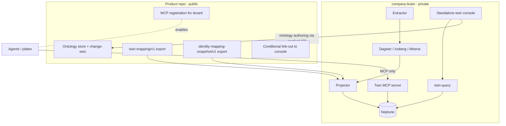
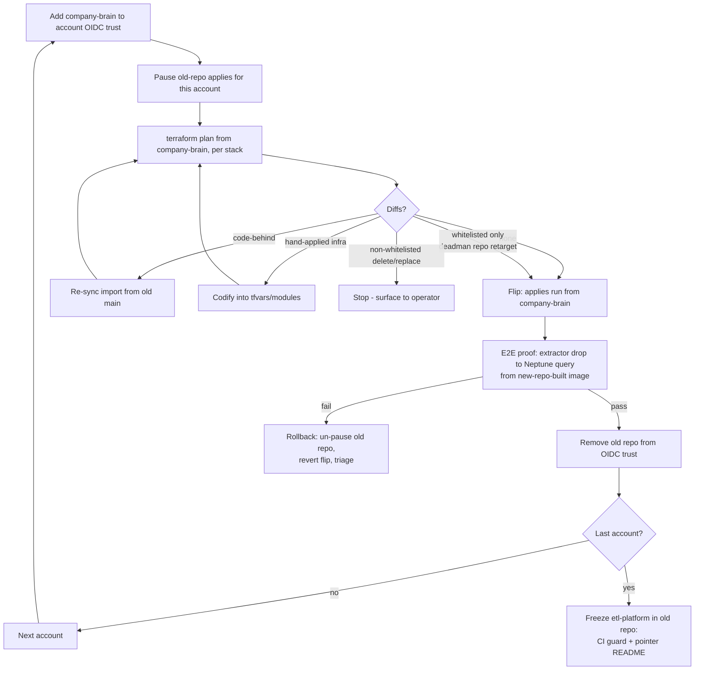

# Company Brain Platform Repo Consolidation - Plan

## Goal Capsule

- **Objective:** Consolidate the Company Brain data platform into a dedicated private repo `thinkwork-ai/company-brain` — extractor through Dagster/Iceberg to the Neptune-loaded graph, twin MCP server, and a fully standalone deployed Explorer/Ontology console — with an internal docs site whose centerpiece is the white-glove bespoke-customer onboarding playbook. Closes THINK-338.
- **Product authority:** the Product Contract below (confirmed with Eric 2026-07-23). One plan owns the whole consolidation program; Track B pipeline features (U2 `twin_derive`, U3 identity-sync in the etl repo) are a separate in-flight workstream this program must not block.
- **Stop conditions:** surface as blocked instead of guessing if (a) a cutover plan shows non-whitelisted destructive diffs (KTD-3), (b) the twin-mapping export cannot be extended to satisfy the Phase D seam validation (KTD-7's fallback fails), or (c) the old repo's frozen state must be modified after archive.
- **Execution profile:** phased A→D; Phases A–C are repo/infra/docs work proven by CI green and live cutover evidence; Phase D is product-code extraction proven by per-customer console verification before any removal ships. Path prefixes in this plan: `etl:` = McPherson-Data/thinkwork (becomes `company-brain` after the move); `product:` = this repo.
- **Tail ownership:** the implementing sessions own CI green in the new repo, both account cutovers with E2E evidence, docs v1 live, and — in Phase D — console live at each customer before the Explorer-removal release ships.

---

## Product Contract

### Summary

Create `thinkwork-ai/company-brain`, a private repo that owns the Company Brain data plane end to end, moved with git history out of the McPherson customer repo and — in a late phase — extracted from the open-source product repo. It ships with per-account CI/CD cutover (McPherson first, then TEI), a productized customer-site extractor, an internal-engineer docs site with a thorough white-glove onboarding playbook branching by customer entry state, and a standalone deployed twin console that replaces the product app's Explorer/Ontology UI.

### Problem Frame

The Company Brain platform is becoming the real product, but it lives in the wrong places. The entire ETL platform — generic pipeline, Iceberg lane, jde_csv bridge, trigger-dispatcher, Dagster infra, dbt, Neptune stack, twin MCP server, ontology seeds, JDE dictionary, landing contract — lives in one customer's repo (`McPherson-Data/thinkwork` → `etl-platform/`), from which both TEI and McPherson deploy. The Meltano Windows extractor is a branch in that same customer repo. Product-side twin code lives in the Apache-2.0 open-source repo, so everything added there is public. Onboarding a new customer today is an engineer coordinating two repos from memory; every customer is bespoke — some have partial AWS resources, some have no AWS account at all — and none of that variation is documented.

### Key Decisions

- **Dedicated private repo named `company-brain`, under the `thinkwork-ai` org.** (session-settled: user-directed — originally created as `twin-platform`, chosen over `digital-twin` and `thinkwork-twin`; renamed `company-brain` 2026-07-23 with the Company Brain naming pivot.)
- **One plan for the whole consolidation program.** (session-settled: user-approved — chosen over planning the repo move or the docs site separately: the seam and contract decisions belong in one place; workstreams are phased, not split into separate plans.)
- **Full UI extraction: MCP is the only runtime seam between product and twin.** (session-settled: user-directed — chosen over splitting the UI by audience or runtime-gating public UI code: plates and all product surfaces reach the twin only via MCP tools mentioned in instructions; there is no tight coupling between plates and the twin. Product code that touches the twin outside MCP moves to the platform repo or retires.)
- **The Explorer/Ontology UI becomes a fully standalone console in `company-brain`, deployed per customer.** (session-settled: user-directed — chosen over keeping conditional UI in the product app: the product app keeps at most a conditional link-out.)
- **Ontology store, change-set machinery, and the twin-mapping export stay product-side for now.** (session-settled: user-directed — chosen over migrating ontology into the platform repo: less migration risk now; the console authors ontology through the product API; moving ontology out is a named future revisit.)
- **White-glove engineer-run installs remain the permanent install story.** (session-settled: user-directed — reaffirms the THINK-334 decision; no plugin shape, no self-serve. Each customer is bespoke and the documentation must carry that, not automation.)
- **Docs audience is internal engineers only.** (session-settled: user-directed — chosen over customer-facing or self-serve docs: the playbook is what our engineers follow; hosting stays internal/private.)
- **Customers with no AWS account are guided to create their own.** (session-settled: user-approved — chosen over creating accounts for them or starting in a ThinkWork-owned account: the runbook's step zero walks the customer through creating their own AWS organization/account; billing is theirs from day one, preserving the "in your account" positioning.)
- **UI extraction is in-program but last.** (session-settled: user-approved — chosen over extracting early or deferring to a follow-up plan: repo move, cutover, and docs land first; the console extraction follows once Track B is stable, so the risky AWS cutover is never coupled to a new app build.)
- **dbt retires in the new repo — by porting, not deletion.** (session-settled: user-approved — research found the live `jde_orders` dbt lane wired into Dagster and the image build; retirement means porting that lane to the Iceberg path and removing dbt from the image and workflow triggers. See KTD-5.)
- **The `identity-mapping-snapshot/v1` export stays a product-published artifact.** The entity-identity crosswalk is product-native (agent routing, Twenty sync); the snapshot at `twin-identity/<tenantId>/latest.json` remains the only identity input the platform's projection reads.
- **Terraform state stays in per-account backends.** Only the source checkout moves; a plan from the new repo is proven no-op-beyond-whitelist before any apply (KTD-3).

The end-state seam:

### Requirements

**Repo bootstrap and code move**

- R1. `company-brain` is a private repo under `thinkwork-ai` with branch protection mirroring the current ruleset (squash-merge, up-to-date branch required), no CLA bot, and CI covering pytest + ruff, terraform validate + checkov, and the Dagster image build.
- R2. `etl-platform/` moves via history-preserving subtree extraction (`git filter-repo`), keeping blame across the 80+ merged PRs of institutional knowledge.
- R3. The extractor branch lands as a first-class `extractor/` directory with its `extraction-definitions/` tree.
- R4. After cutover, the old `etl-platform/` directory in the customer repo is archived with a pointer README, frozen to new merges by a CI guard, and every open PR has an explicit disposition (merged before freeze or re-targeted to the new repo).

**CI/CD and AWS cutover**

- R5. Every customer account's GitHub OIDC deploy-role trust policy adds the new repo before any deploy runs from it (McPherson, TEI, thinkwork dev) — including bootstrapping the roles TEI lacks today.
- R6. Terraform state stays in existing per-account backends; a `plan` from the new repo is verified per account to show zero changes beyond whitelisted diffs (KTD-3) before the first apply.
- R7. Cutover happens one account at a time — McPherson first, then TEI — following the per-account state machine (KTD-2), and each account is proven by a full extractor drop → Dagster → Iceberg → Neptune run from a new-repo-built image before the next begins.
- R8. The Dagster image continues to push to per-account ECR (avoiding the private-registry stale-image trap).

**Extractor productization**

- R9. The extractor ships as a packaged installer with a runbook for customer-site Windows hosts, per-source config templating, and version pinning. Its rollout is decoupled from the repo cutover: customer hosts are untouched by R7 (KTD-6).

**Docs site and white-glove playbook**

- R10. The repo carries an internal docs site (Astro Starlight, same stack as product docs) hosted privately — internal engineers are the only audience.
- R11. The onboarding playbook documents every step of a bespoke customer install, branching by entry state: no AWS account (guide the customer through creating their own organization/account, then obtain cross-account access), partial existing resources (adopt), and greenfield bootstrap. An internal engineer who has never onboarded a customer can follow it end to end.
- R12. Docs v1 covers: architecture mental model with the end-to-end data flow, the versioned contracts (landing contract, natural-key registry, `twin-mapping/v1`, `identity-mapping-snapshot/v1`, `twin_batch` ledger semantics), the two most-used runbooks (customer onboarding, new source system), the ontology guide, the JDE reference and traps ledger, and operations (monitoring, cost model, fresh-account quotas).

**UI and seam extraction (late phase)**

- R13. A standalone twin console (Explorer, Cypher console, predicate/traversal tooling, ontology views) lives in `company-brain` and deploys per customer, authenticating against the customer's existing Cognito pool.
- R14. `twin-query`, the projector, and the twin MCP server are owned and deployed by `company-brain`; the product repo retains only the ontology store and change-set machinery, the two S3 exporters, and tenant MCP registration.
- R15. The product app's twin UI surfaces are removed; at most a conditional link to the console renders when the tenant has a twin MCP registration. After extraction, no product code reads the twin outside MCP. Removal ships only after the console is live and verified at every customer using the Explorer (KTD-7).
- R16. The console performs ontology authoring by calling the product GraphQL API with the tenant's Cognito token.

### Key Flows

- F1. Bespoke customer onboarding (white-glove)
  - **Trigger:** A new customer signs; an internal engineer opens the onboarding playbook.
  - **Steps:** Assess entry state → if no AWS account, walk the customer through creating their own org/account (billing theirs) → obtain cross-account engineer access → bootstrap or adopt per-account infrastructure from `company-brain` Terraform → install and configure the packaged extractor on the customer host → seed ontology → prove the E2E run → register the twin MCP server for the tenant → deploy the twin console.
  - **Outcome:** Customer live on their own account; every step traceable to a playbook section.
- F2. Account cutover (existing customers)
  - **Trigger:** Engineer cuts an existing account (McPherson, then TEI) over to deploying from `company-brain`.
  - **Steps:** Add new repo to the account's OIDC trust → pause old-repo applies for the account → verify plan from the new repo is no-op beyond whitelist → flip deploys → prove a full extractor-to-Neptune run from a new-repo-built image → remove old-repo trust. Customer extractor hosts are untouched throughout; the landing contract is the compatibility line.
  - **Outcome:** Account deploys exclusively from `company-brain`; no infrastructure churn; old repo remained the rollback path until proof passed.

### Acceptance Examples

- AE1. **Covers R5, R6.** Given McPherson's existing per-account state, when `terraform plan` runs from `company-brain` before cutover, then it reports zero changes beyond the whitelisted diffs (the deadman `github_repo` retarget), and the deploy role accepts the new repo's OIDC identity.
- AE2. **Covers R7.** After each account's cutover, a full extractor drop flows through Dagster and Iceberg into Neptune using an image built by the new repo's CI, and the graph answers a query over the new data.
- AE3. **Covers R11.** An engineer who has not previously onboarded a customer follows the playbook for a hypothetical no-AWS-account customer and reaches a proven E2E install without steps that exist only in someone's head.
- AE4. **Covers R14, R15.** After the late-phase extraction, the product repo contains no twin runtime code beyond the ontology machinery, the two exporters, and MCP registration, and agents (including plate-driven turns) still answer twin queries through the MCP server.

### Success Criteria

- McPherson and TEI both deploy from `company-brain` with a proven extractor→Neptune E2E each.
- `etl-platform/` in the customer repo is archived and frozen.
- Docs v1 is live internally: architecture, contracts, and the bespoke-onboarding runbook (R12 set).
- The standalone twin console is deployed at one or more customers.

### Scope Boundaries

**Deferred for later** (named follow-ups, not requirements here):

- Migrating the ontology store, change-set machinery, and twin-mapping compiler out of product Postgres into the platform repo — revisit after the extraction phase proves the seam.
- Folding TEI's LastMile/Twenty nightly ELT (n8n-invoked Lambda) into this repo — recorded as an eventual candidate only.
- Customer-facing or auth-gated documentation of any kind.
- McPherson's production extractor repoint (prod JDE cutover) — strictly independent of this program's repo cutover (KTD-6).

**Outside this product's identity:**

- Customer self-serve onboarding — white-glove engineer-run is the permanent install story.
- Provisioning customers in a ThinkWork-owned AWS account, even temporarily — customer-owned account from step zero, always.

<!-- ce-section: work-relationships -->

### How This Work Fits Together

This plan owns the whole consolidation program: repo bootstrap, code move, CI/CD/AWS cutover, extractor productization, docs site, and the late-phase UI/seam extraction. The surrounding work, as currently understood (not a committed roadmap):

- Track B (U2 `twin_derive`, U3 identity-sync, per docs/plans/2026-07-23-001-feat-mcpherson-dagster-elt-neptune-plan.md) — proceeds independently in the current etl repo; this program sequences around it (KTD-1's snapshot-after-merge rule) and must not block it. Their landed code moves with the extraction.
- THINK-334 white-glove install command (docs/plans/2026-07-22-003-feat-digital-twin-white-glove-install-plan.md, shipped) — `thinkwork twin install` orchestrates across both repos today; the playbook (R11) absorbs and supersedes its runbook role, and the command's etl-repo pointer retargets to `company-brain` at cutover (KTD-10).
- Ontology migration out of product Postgres — enabled by this program's extraction phase; still to decide whether it ever happens.
- Linear process (issue home for platform work, ELT plan doc supersession) — still to decide; see Outstanding Questions.

### Dependencies / Assumptions

- The etl checkout at `McPherson-Data/thinkwork` is the source of truth for the move; its per-account `accounts/<name>.{tfvars,backend.hcl}` pattern carries over, including the pending tfvars-to-SSM secret-hygiene follow-up.
- All product-side seam surfaces (mcp-twin handlers, `twin-query`, `packages/api/src/lib/twin/`, Twin Explorer components, `apps/cli/src/commands/twin/`, both exporters) are merged on `origin/main` — verified 2026-07-23.
- The cross-repo data contract already exists in code and is documented as the only contract surface: `twin-mapping/v1` (product: `packages/api/src/lib/ontology/twin-export.ts`) and `identity-mapping-snapshot/v1` (product: `packages/api/src/lib/entity-identity/graph-projection.ts`), plus the landing contract and `twin_batch` ledger.
- The platform query path does **not** yet compile from the exported twin-mapping artifact: `describe-ontology` reads product Postgres in-process, and the MCP server authenticates against the `tenant_mcp_twin_keys` table. Closing this is Phase D's named pre-extraction validation (U12, KTD-7) — the exports become the only feed into the private plane, or the export format is extended until they can be.
- Each customer Cognito pool can carry an additional app client + callback URLs for the console; changes go through Terraform only, per the Cognito callback-URL runbook (product: `docs/solutions/runbooks/update-cognito-callback-urls-2026-05-22.md`).

### Outstanding Questions

**Deferred to Planning-time follow-ups** (none block implementation start):

- Linear home for platform work (stays in ThinkWork team vs. new team; MCPO- stays customer-ops) and how in-flight platform issues' context migrates — decide at Phase A close.
- Docs-site publishing mechanism beyond in-repo (access-controlled GitHub Pages availability depends on the org's GitHub plan) — KTD-9 makes in-repo the floor; publishing is additive.

---

## Planning Contract

**Product Contract preservation:** changed — dbt Key Decision refined to retire-by-port (research: live `jde_orders` dbt lane); R4 gained PR-disposition/CI-guard language; R6/AE1 bar became "zero changes beyond whitelisted diffs"; F2 gained the pause/flip/prove/remove-trust state machine and the customer-host-untouched clause; the export-compilation assumption was resolved to "does not hold today; U12 closes it." All confirmed via scoping synthesis with Eric 2026-07-23; no product-scope change.

### Key Technical Decisions

- KTD-1. **Repeatable import, snapshot after the current PR set merges, freeze last.** The `git filter-repo` extraction is a scripted, re-runnable import (paths: `etl-platform/`, root `docs/`, root `.github/workflows/`, `extraction-definitions/` from the extractor branch). The old repo's open PRs (Track B #84/#85 with their ordering constraint, fixes #86/#87, UAT #70, extractor #26) get an explicit disposition — default merge-before-snapshot; #26 lands via U2 instead. Final re-run + `git diff` verification against old `main` happens immediately before the freeze guard lands, and freeze is the **last** step after the final account's cutover proof, not an early milestone. Customer-side contributors (scott1) get new-repo access before freeze. (session-settled: user-approved — chosen over snapshot-now-port-later: avoids double-landing Track B mid-flight.)
- KTD-2. **Per-account cutover state machine.** Pause old-repo applies for the account (add the account's stacks to the old repo's `accounts/<name>.skip-stacks`, or pause merges) → plan from new repo, triaged against the whitelist → flip → E2E proof (AE2) → remove the old repo from the account's OIDC trust. The old repo remains fully deployable as the rollback path until proof passes; the two repos never both apply to one account's state. (session-settled: user-approved.)
- KTD-3. **Drift triage with a whitelist, not a bare no-op bar.** Plan diffs classify as: whitelisted (the deadman `github_repo` retarget — etl: `infrastructure/stacks/deadman/main.tf:87`), code-behind (old repo merged something the snapshot missed — re-sync first), or hand-applied infra (codify into tfvars/modules, re-plan — TEI's hand-crafted history makes this likely there). Any delete/replace outside the whitelist stops the cutover. (session-settled: user-approved.)
- KTD-4. **TEI enters the Terraform matrix plan-only until its cutover slot.** TEI (637423202447) is absent from the old repo's `terraform.yml` matrix; its `etl-platform-plan`/`etl-platform-deploy` roles must be bootstrapped (etl: `infrastructure/bootstrap/`) trusting `company-brain`. Its first-ever CI-driven apply is the cutover itself — applies stay manual until then. (session-settled: user-approved.)
- KTD-5. **dbt retires by porting the `jde_orders` lane.** The lane (etl: `dbt/models/staging/stg_jde/`, `dbt/models/marts/sales/order_history.sql`, consumed via `@dbt_assets` in `pipelines/sources/jde_orders/pipeline.py`, registered in `dagster/workspace.yaml`) ports to the Iceberg path; then dbt leaves `dagster/Dockerfile:13-34` (dbt-athena/dbt-duckdb install + `dbt parse`) and the `dbt/**` trigger in `dagster-image.yml`. Dockerfile/workflow edits land with the port so triggers never go dead. (session-settled: user-approved — inherits the brainstorm's dbt decision with the port refinement.)
- KTD-6. **Customer extractor hosts are untouched by the repo cutover.** The landing contract (etl: `etl-platform/landing-contract/`) is the compatibility line; the branch-checkout extractor keeps depositing regardless of which repo builds the pipeline. The R9 packaged installer replaces the branch deployment as its own later rollout with its own runbook, independent of both the repo cutover and McPherson's future prod-extractor repoint.
- KTD-7. **Existing-customer console ordering: link-out → console live → removal release.** The conditional link-out ships first (renders on MCP registration), the console is deployed and verified per customer, and only then does the Explorer-removal product release ship (canary-tag flow). The whole phase is gated on U12's validation that the twin-mapping export can feed ontology description and query compilation; if it cannot, the fallback is extending `twin-mapping/v1` (a format-version bump with the projection's fail-loud gate), never a cross-account DB seam. (session-settled: user-approved.)
- KTD-8. **`graph-projection.ts` splits along the seam.** The Neptune-writing projector half (product: `packages/api/src/lib/entity-identity/graph-projection.ts` MERGE operations, plus `packages/api/src/handlers/identity-graph-projector.ts` and `bulk-rebuild.ts`) moves to the platform; the identity snapshot exporter (`uploadIdentitySnapshot`, currently invoked as a side effect of projection runs) stays product-side and gains its own invocation path so the export survives without the projector.
- KTD-9. **Docs live in-repo as Starlight source; publishing is additive.** The floor is repo-browsable markdown with a locally buildable Starlight site (mirroring product: `docs/astro.config.mjs` conventions). Access-controlled GitHub Pages publishing is enabled if the org plan supports it — a deploy detail, never a gate on R11/R12 content.
- KTD-10. **The etl repo's `stacks/` + `accounts/` layout stays stable through the move** so the product CLI's Terraform wrapper (product: `apps/cli/src/lib/etl-terraform.ts:94`) keeps working; the CLI retarget is naming only — help text and docs move from `McPherson-Data/thinkwork` to `company-brain` (product: `apps/cli/src/commands/twin.ts:36-63`, `apps/cli/src/commands/twin/install.ts:73`).
- KTD-11. **Workflow port rewrites path prefixes and regularizes the stragglers.** All old-repo workflows filter on `etl-platform/**` paths; the new repo keeps the directory name so rewrites are mechanical (repo-name references, matrix account lists). The two known irregulars are fixed in the port: `dagster-mcp.yml` deploys mcpherson-only (thinkwork account is hand-deployed today — add it to the matrix), and `aws-oidc-smoke.yml` becomes the per-account OIDC verification template for cutover.

### High-Level Technical Design

Per-account cutover state machine (KTD-2/KTD-3):

Program phasing: **A** bootstrap + move (U1–U3) → **B** cutover (U4–U8, then U9 freeze) → **C** docs (U10–U11) → **D** extraction (U12–U15). Phase C can start once Phase A lands (content doesn't wait on cutover); Phase D waits on B and Track B stability.

---

## Implementation Units

Unit index:

| U-ID | Title                                     | Key paths                                                             | Depends on |
| ---- | ----------------------------------------- | --------------------------------------------------------------------- | ---------- |
| U1   | Bootstrap repo + scripted import          | new repo root, `tools/import-from-old-repo.sh`                        | —          |
| U2   | Land extractor as `extractor/`            | `extractor/`, `extraction-definitions/`                               | U1         |
| U3   | Port workflows + retarget references      | `.github/workflows/*`, `infrastructure/stacks/deadman/`               | U1         |
| U4   | OIDC trust updates + TEI role bootstrap   | `infrastructure/bootstrap/` per account                               | U3         |
| U5   | McPherson cutover                         | account 024350822488                                                  | U3, U4     |
| U6   | TEI cutover                               | account 637423202447                                                  | U4, U5     |
| U7   | dbt retirement port                       | `dbt/`, `pipelines/sources/jde_orders/`, `dagster/Dockerfile`         | U1         |
| U8   | Product CLI retarget                      | `product: apps/cli`                                                   | U5         |
| U9   | Freeze + archive old etl-platform         | old repo                                                              | U5, U6     |
| U10  | Docs site scaffold + onboarding playbook  | `docs/` (new repo)                                                    | U1         |
| U11  | Docs v1 content + freshness mechanism     | `docs/` (new repo)                                                    | U10        |
| U12  | Pre-extraction seam validation            | `product: packages/api/src/lib/twin/`                                 | U5, U6     |
| U13  | Standalone console + Cognito client       | new repo `console/`, `product: terraform/modules/foundation/cognito/` | U12        |
| U14  | Runtime move + projector split + link-out | new repo, `product: packages/api`                                     | U12, U13   |
| U15  | Product-side Explorer removal release     | `product: apps/web`, `packages/api`                                   | U13, U14   |

### U1. Bootstrap `company-brain` and the scripted history-preserving import

- **Goal:** Private repo exists with branch protection, CI green on the imported tree, and a re-runnable import script so the snapshot can re-sync until freeze.
- **Requirements:** R1, R2; KTD-1.
- **Dependencies:** none.
- **Files:** new repo — imported `etl-platform/` tree (kept under the same directory name per KTD-11), old-repo root `docs/` (solutions/plans/brainstorms trap ledgers), `tools/import-from-old-repo.sh`, `.github/` branch-protection config, `README.md`.
- **Approach:** `git filter-repo` in a scripted, idempotent form: fresh clone of old repo → filter to the KTD-1 path set → fetch into `company-brain` and fast-forward a re-sync branch. Branch protection mirrors the product repo ruleset (squash-merge, up-to-date required); no CLA bot; proprietary license. Record the PR disposition table (KTD-1) in the repo's first issue or `docs/plans/` entry; grant customer-side contributors access.
- **Execution note:** Verify the import with `git log --follow` on a deep file (e.g. the twin projection) proving blame survives, and a full-tree diff against old `main`.
- **Test scenarios:** Test expectation: none — repo scaffolding; CI green on the imported suites (900+ existing tests) is the proof.
- **Verification:** New repo CI (pytest/ruff/mypy, terraform validate/checkov, jsonschema config validation) green on the imported tree; re-running the import script after an old-repo merge produces a clean re-sync diff.

### U2. Land the extractor branch as `extractor/` + `extraction-definitions/`

- **Goal:** The extractor branch's work (JDE decimal scaling, overlap-incremental export, config-table export, `extraction-definitions/` with schema) becomes first-class in the new repo.
- **Requirements:** R3; KTD-1 (PR #26 disposition = re-target here).
- **Dependencies:** U1.
- **Files:** new repo — `extraction-definitions/` (config.schema.json, `_executor_version`, per-dataset `config.yaml` + `extract.sql`), `etl-platform/extractor/executor.py` updates from the branch.
- **Approach:** Import the branch's commits onto the new repo (cherry-pick or branch import via the U1 script), reconciling with whatever `main` moved under it. The `GITHUB_REPO` config in the executor env retargets to `company-brain`. This is landing the code, not R9 productization — the installer/packaging is deferred to its own rollout (KTD-6).
- **Test scenarios:**
  - Existing extractor tests pass in new-repo CI.
  - `extraction-definitions/*/config.yaml` passes the jsonschema CI validation.
- **Verification:** CI green including the config-guard job; branch closed in the old repo with its disposition recorded.

### U3. Port workflows and retarget hardcoded references

- **Goal:** All CI/CD workflows run in the new repo against the same accounts, with every `McPherson-Data/thinkwork` reference retargeted.
- **Requirements:** R5 (whitelist source), R8; KTD-3, KTD-11.
- **Dependencies:** U1.
- **Files:** new repo — `.github/workflows/{terraform,dagster-image,trigger-dispatcher,dagster-mcp,ci,config-guard,aws-oidc-smoke}.yml`; `etl-platform/infrastructure/stacks/deadman/main.tf` (`github_repo`), `etl-platform/infrastructure/bootstrap/variables.tf:10` (default repo), docstrings in `deadman/handler.py`, `extractor/executor.py`, `tests/test_deadman.py`, `bootstrap/README.md`.
- **Approach:** Path filters keep working because the directory name is stable; edits are repo-name references, the dagster-mcp matrix gap (add thinkwork account), and the deadman retarget. Verify the deadman GitHub token can file issues in the private repo **before** cutover — a silent-failure alarm is worse than none. Apply-side workflows stay disabled (environment gate or matrix empty) until U5/U6 flip each account.
- **Test scenarios:**
  - Grep gate: zero `McPherson-Data/thinkwork` references outside git history and the import script.
  - `terraform.yml` PR path runs plan-only against mcpherson + thinkwork with the old-repo trust still in place (expected auth failure until U4 — assert the failure mode is auth, not config).
- **Verification:** `aws-oidc-smoke.yml` passes per account after U4; dagster-image workflow_dispatch builds and pushes to each account's ECR.

### U4. OIDC trust updates and TEI role bootstrap

- **Goal:** Every account's deploy roles trust `company-brain`; TEI gains the roles it never had.
- **Requirements:** R5; KTD-2, KTD-4.
- **Dependencies:** U3.
- **Files:** new repo — `etl-platform/infrastructure/bootstrap/` applied per account (mcpherson 024350822488, thinkwork 487219502366, TEI 637423202447) with `github_repository = thinkwork-ai/company-brain`.
- **Approach:** Re-apply the bootstrap stack per account adding the new repo sub (dual-trust window is deliberate and bounded by KTD-2's per-account sequence). TEI: bootstrap `etl-platform-plan`/`etl-platform-deploy` from scratch; add TEI to the new repo's terraform matrix **plan-only** (KTD-4).
- **Execution note:** Bootstrap is applied locally by convention (not via CI) — follow the old repo's `bootstrap/README.md` procedure.
- **Test scenarios:** Test expectation: none — infra operation; `aws-oidc-smoke.yml` per account is the check.
- **Verification:** Smoke workflow green from `company-brain` against all three accounts; TEI plan job produces a plan (its diffs feed U6's triage).

### U5. McPherson cutover

- **Goal:** McPherson deploys exclusively from `company-brain`, proven E2E.
- **Requirements:** R6, R7, R8; KTD-2, KTD-3; AE1, AE2.
- **Dependencies:** U3, U4.
- **Files:** operational — old repo `accounts/mcpherson.skip-stacks` (pause lever), new repo matrix enable, cutover evidence recorded on THINK-338.
- **Approach:** Execute the KTD-2 state machine. Expected whitelist: deadman retarget. Prove with a full extractor drop → Dagster → Iceberg → Neptune → graph query from a new-repo-built image (AE2), then remove old-repo trust for this account.
- **Execution note:** Run the final U1 re-sync immediately before the plan step so the snapshot carries every old-repo merge.
- **Test scenarios:** Test expectation: none — operational unit; evidence artifacts replace tests (plan output, E2E ledger/query proof).
- **Verification:** AE1 (whitelist-only plan) and AE2 evidence recorded; old-repo trust removed; McPherson deploys green from new repo for a full week of scheduled runs before U6 starts.

### U6. TEI cutover

- **Goal:** TEI's first-ever CI-driven Terraform apply lands cleanly; TEI deploys exclusively from `company-brain`.
- **Requirements:** R6, R7, R8; KTD-2, KTD-3, KTD-4; AE1-equivalent, AE2.
- **Dependencies:** U4, U5.
- **Files:** operational — new repo matrix apply-enable for tei; codified tfvars for any hand-applied drift.
- **Approach:** Same state machine, with extra triage weight on hand-applied infra (TEI tfvars were hand-crafted; history of hand-applied fixes). Codify drift into `accounts/tei.tfvars`/modules until the plan is whitelist-clean, then flip and prove.
- **Test scenarios:** Test expectation: none — operational unit; evidence artifacts replace tests.
- **Verification:** Plan whitelist-clean; AE2 E2E proof at TEI; old-repo trust removed.

### U7. dbt retirement port

- **Goal:** The `jde_orders` dbt lane is ported to the Iceberg path and dbt leaves the image, workflows, and tree.
- **Requirements:** Key Decision (dbt retires); KTD-5.
- **Dependencies:** U1 (lands in the new repo; can proceed in parallel with cutover but must not straddle a cutover window).
- **Files:** new repo — `etl-platform/pipelines/sources/jde_orders/pipeline.py` (drop `@dbt_assets`, use the Iceberg lane), delete `etl-platform/dbt/`, `etl-platform/dagster/Dockerfile` (remove dbt install + parse), `.github/workflows/dagster-image.yml` (drop `dbt/**` trigger), check `pipelines/sources/{jde_customers,twenty_companies}` for dbt references.
- **Approach:** Port the staging view + dedupe mart semantics (`stg_jde__orders`, `order_history`) onto the Iceberg tables that already own dedupe. Dockerfile and workflow edits land in the same PR as the port (KTD-5) so no dead triggers or broken image builds ship.
- **Test scenarios:**
  - Existing jde_orders pipeline tests pass against the ported lane.
  - Parity check: ported `order_history` row counts match the dbt mart on a fixed fixture window.
  - Dagster image builds without dbt and all code locations load (`dagster/workspace.yaml`).
- **Verification:** CI green; a scheduled jde_orders run completes on the ported lane in the thinkwork dev account before the change reaches customer accounts.

### U8. Product CLI retarget

- **Goal:** `thinkwork twin install` names and documents `company-brain` as the etl repo.
- **Requirements:** KTD-10.
- **Dependencies:** U5 (retarget ships after the new repo is the real deploy source).
- **Files:** product — `apps/cli/src/commands/twin.ts` (help text), `apps/cli/src/commands/twin/install.ts` (env fallback docs), `apps/cli/src/lib/twin-install-checks.ts` (expected-repo check if it asserts the remote), tests `apps/cli/__tests__/{twin-install-checks,twin-registration,etl-terraform}.test.ts`, the operator doc page for the command.
- **Approach:** Naming-only per KTD-10 — the `stacks/`+`accounts/` layout contract is unchanged. If `evaluateEtlCheckout` validates the remote URL, accept both names during the transition window.
- **Test scenarios:**
  - Help text and error messages name `company-brain`.
  - `evaluateEtlCheckout` accepts a `company-brain` checkout; rejects an unrelated repo.
- **Verification:** `npx vitest run` green in `apps/cli`; `thinkwork twin install --dry-run` against dev succeeds with a `company-brain` checkout.

### U9. Freeze and archive `etl-platform/` in the old repo

- **Goal:** The old repo's `etl-platform/` is frozen, archived with a pointer, and every open PR has its recorded disposition executed.
- **Requirements:** R4; KTD-1.
- **Dependencies:** U5, U6 (freeze is the last cutover step).
- **Files:** old repo — CI guard workflow failing any PR touching `etl-platform/`, pointer `etl-platform/README.md`, PR disposition closure.
- **Approach:** Final re-sync + diff verification (U1 script), then land the guard and pointer in one PR. The old repo itself stays alive (it is still the customer's repo for non-etl content).
- **Test scenarios:** Guard workflow fails a test PR touching the frozen path; passes one that doesn't.
- **Verification:** Frozen-path PR rejected by CI; disposition table fully closed; THINK-338 updated.

### U10. Docs site scaffold + white-glove onboarding playbook

- **Goal:** Starlight site lives in the new repo with the entry-state-branching onboarding playbook as its centerpiece.
- **Requirements:** R10, R11; KTD-9; AE3.
- **Dependencies:** U1 (content can begin before cutover completes).
- **Files:** new repo — `docs/` Starlight scaffold (mirror product `docs/astro.config.mjs` sidebar conventions), `docs/src/content/docs/onboarding/` playbook pages: entry-state assessment, no-AWS-account walkthrough (customer creates own org/account, billing theirs, cross-account engineer access), adopt-existing-resources, greenfield bootstrap, extractor host install, ontology seed, E2E proof, MCP registration, console deploy.
- **Approach:** Absorb and supersede: etl `etl-platform/docs/onboarding-a-dataset.md`, the product THINK-334 twin-install runbook, the fresh-account traps (Lambda 3008MB quota, sandbox provisioning). Structure the playbook as one spine with entry-state branches, each step naming its verification. Cross-account access pattern and account-creation walkthrough are new content — write them from the TEI/McPherson bring-up evidence trails.
- **Test scenarios:** Test expectation: none — documentation; AE3's fresh-engineer dry-run is the acceptance proof.
- **Verification:** Starlight builds clean locally; AE3 dry-run performed by an engineer who hasn't onboarded a customer (desk-check against a hypothetical no-AWS customer), gaps folded back in.

### U11. Docs v1 content set + freshness mechanism

- **Goal:** The R12 content set is live and has a mechanism keeping it honest as stacks evolve.
- **Requirements:** R12.
- **Dependencies:** U10.
- **Files:** new repo — `docs/src/content/docs/{architecture,contracts,runbooks,ontology,jde,operations}/`; PR template with a docs-impact checkbox; docs build job in CI.
- **Approach:** Architecture (S3/Iceberg storage, Athena compute, Dagster orchestration, projector loader, Neptune graph, Postgres ledgers-only, end-to-end diagram), contracts (landing contract/manifest+admission rules, natural-key registry, both export formats, `twin_batch` semantics), runbooks (onboarding from U10, new source system, Iceberg backfill, clean rebuild/prod cutover, zombie-run recovery, stall/partial-upload semantics), ontology guide (seed recipes, naming standards, facet/source_binding), JDE reference (dictionary, Julian dates, implied decimals, the moved `docs/solutions/` trap ledgers), operations (CloudWatch alarms, deadman token, Athena cost model, fresh-account quotas). Freshness: docs build in CI + PR-template checkbox ("stack change → playbook section updated?") + AE3 re-run at each real onboarding.
- **Test scenarios:** Test expectation: none — documentation; docs build in CI is the mechanical check.
- **Verification:** All six sections populated (no stubs); CI docs build green; PR template live.

### U12. Pre-extraction seam validation

- **Goal:** Prove the twin-mapping export can feed ontology description and query compilation without product Postgres, and design the MCP key-auth replacement — the gate for everything after it.
- **Requirements:** R14 (feasibility); KTD-7.
- **Dependencies:** U5, U6 (platform repo is the deploy source), Track B stable.
- **Files:** product — `packages/api/src/lib/twin/describe-ontology.ts`, `query-compiler.ts`, `packages/api/src/lib/ontology/twin-export.ts` (format extension if needed); new repo — validation spike notes in `docs/plans/`.
- **Approach:** Diff what `describe-ontology`/`query-compiler` read from Postgres against what `twin-mapping/v1` carries. Gap → extend the export (format-version bump; the projection's fail-loud format gate handles skew) — never a cross-account DB read (KTD-7). Design the key-auth replacement for the moved MCP server: keys minted by product-side provisioning (`tkt_` prefix, THINK-333) delivered to the platform via a registration artifact, or a platform-owned key store — pick one and record it as a KTD amendment before U13/U14 start.
- **Execution note:** This is a validation unit — its deliverable is evidence plus the recorded decision, not shipped behavior. If the export cannot be extended to close the gap, stop and surface (Goal Capsule stop condition).
- **Test scenarios:**
  - A compiled ontology description built solely from a real tenant's `latest.json` export matches the Postgres-built one (fixture diff).
  - Format-extension case: old-format artifact is refused loudly by the consumer (fail-loud gate holds).
- **Verification:** Written validation result on THINK-338; KTD amendment recorded in this plan for key auth.

### U13. Standalone console + Cognito app client

- **Goal:** The console (Explorer, Cypher console, predicate/traversal tooling, ontology views) builds and deploys from `company-brain`, authenticating against the customer's Cognito pool.
- **Requirements:** R13, R16; KTD-7.
- **Dependencies:** U12.
- **Files:** new repo — `console/` app (port of product `apps/web/src/components/settings/twin-explorer/` components: TwinExplorer, CypherConsole, PredicateBuilder, TwinEntityDetail, TwinNodeSheet, TwinTraversal), per-account deploy stack; product — `terraform/modules/foundation/cognito/main.tf` new app-client block + callback vars (Terraform-only per the Cognito runbook), `terraform/examples/greenfield/main.tf` wiring.
- **Approach:** Port the components into a small standalone Vite app; data path = the moved twin-query (U14) plus product GraphQL (with the tenant Cognito token) for ontology authoring (R16). Deploy per customer alongside the account's existing stacks. Callback URLs added in Terraform before first login attempt (redirect_mismatch trap).
- **Test scenarios:**
  - Ported component tests pass in the new repo.
  - Auth: valid Cognito token renders Explorer; missing/expired token routes to login; wrong-tenant token gets no data.
  - Ontology authoring round-trip against product GraphQL succeeds with the same token.
- **Verification:** Console live at dev + one customer; an operator completes an Explorer traversal and an ontology edit through it.

### U14. Runtime move, projector split, and conditional link-out

- **Goal:** twin-query, the Neptune projector, and the MCP server deploy from `company-brain`; the identity snapshot exporter survives product-side; the product app links out conditionally.
- **Requirements:** R14; KTD-7, KTD-8.
- **Dependencies:** U12 (and U13 for the link-out target).
- **Files:** new repo — moved handlers/modules (twin-query, mcp-twin + provision-adapter per U12's key decision, projector + bulk-rebuild, `lib/twin/` compiler/guard/client modules) with their Terraform (VPC attach, read-only Neptune IAM mirroring product `terraform/modules/app/lambda-api/handlers.tf:1384-1444`); product — `graph-projection.ts` split (snapshot exporter stays with its own invocation on identity mutations, replacing the projector side-effect at `:538`), conditional link-out in the product nav (renders on active twin MCP registration).
- **Approach:** Move in dependency order: twin-query first (DB-free, cleanest), then projector (with the KTD-8 split landing product-side in the same window), then the MCP server last (needs U12's key-auth decision). Product MCP registration continues to point agents at the twin MCP endpoint — now served from the platform deploy. Note `lib/twin/twenty-live-fetch.ts`/`live-fetch-registry.ts` couple to product connector plumbing — they stay product-side or are dropped from the moved surface; decide at move time and record.
- **Test scenarios:**
  - Covers AE4 partially: agent turn answers a twin query via the platform-served MCP endpoint.
  - Identity mutation still refreshes `twin-identity/<tenantId>/latest.json` with the projector moved (snapshot has its own invocation).
  - Projection run from the platform repo consumes both exports and loads Neptune (E2E on dev).
- **Verification:** Dev + one customer running the platform-served twin runtime for a week with no product-served fallback.

### U15. Product-side Explorer removal release

- **Goal:** The product repo sheds its twin UI and runtime remnants; MCP is the only runtime seam.
- **Requirements:** R15; KTD-7; AE4.
- **Dependencies:** U13, U14 (console live and verified at every customer using the Explorer).
- **Files:** product — delete `apps/web/src/components/settings/twin-explorer/`, twin GraphQL resolvers (`packages/api/src/graphql/resolvers/twin/`) and `packages/database-pg/graphql/types/twin.graphql` read surface (ontology mutations stay), retired handlers + `handlers.tf` blocks, codegen regeneration in all consumers.
- **Approach:** One removal release on the canary-tag flow, shipped only after U13's console is verified at TEI and McPherson (KTD-7 ordering). Ontology authoring GraphQL stays (R16 depends on it). Grep gate for twin runtime imports outside the exporters/registration/ontology surfaces.
- **Test scenarios:**
  - Covers AE4: full-text gate — no product code reads Neptune or serves twin queries; agents still answer twin queries via MCP.
  - Codegen consumers (`apps/cli`, `apps/web`, `apps/mobile`, `packages/api`) build after schema surgery.
- **Verification:** Release deployed to dev/TEI/McPherson; Knowledge nav shows the conditional link-out; product suites green.

---

## Verification Contract

| Gate             | Command / evidence                                                                                | Applies to          |
| ---------------- | ------------------------------------------------------------------------------------------------- | ------------------- |
| New-repo CI      | pytest + ruff + mypy (uv), `terraform validate` + checkov, dagster image build, config jsonschema | U1–U3, U7, U13, U14 |
| Import fidelity  | full-tree diff vs old `main` + `git log --follow` blame spot-check                                | U1, U9              |
| OIDC smoke       | `aws-oidc-smoke.yml` green per account from `company-brain`                                      | U4                  |
| Cutover evidence | whitelist-clean plan output + AE2 E2E ledger/query proof, recorded on THINK-338                   | U5, U6              |
| Product suites   | `pnpm -r --if-present typecheck && pnpm lint && npx vitest run` in touched packages               | U8, U13–U15         |
| Docs build       | Starlight build green in new-repo CI                                                              | U10, U11            |
| AE3 dry-run      | fresh-engineer playbook walkthrough, gaps recorded                                                | U10                 |
| Seam validation  | export-vs-Postgres fixture diff + fail-loud format gate test                                      | U12                 |
| AE4 gate         | grep + live agent twin query via platform MCP after removal                                       | U15                 |

Live AE1/AE2 evidence is operator-recorded per account; it is the cutover acceptance bar, not a pre-merge gate.

---

## Definition of Done

- R1–R16 implemented across the phases; AE1/AE2 proven at McPherson and TEI; AE3 dry-run performed; AE4 proven after the removal release.
- `company-brain` CI green; both accounts deploy exclusively from it; old-repo trust removed; `etl-platform/` frozen with the CI guard and pointer (U9), all open-PR dispositions closed.
- dbt fully out of the new repo with the jde_orders lane ported and parity-checked (U7).
- Docs v1 live: all six R12 sections populated, playbook AE3-tested, freshness mechanism (CI build + PR checkbox) in place.
- Phase D: seam validation recorded with its key-auth KTD amendment; console live at dev + both customers; platform-served runtime stable for a week before the removal release; product repo passes the AE4 grep gate.
- Customer extractor hosts untouched throughout (KTD-6); McPherson prod-extractor repoint not performed as part of this program.
- No dead-end or experimental code from abandoned approaches remains in any repo's diff; hedged/duplicated workflow triggers removed with their source (KTD-5, KTD-11).

---

## Sources & Research

- Linear THINK-338 — the issue's proposal body (target shape, what moves, sequencing) is the substrate this contract refines.
- docs/plans/2026-07-23-001-feat-mcpherson-dagster-elt-neptune-plan.md — Track B scope; dataset semantics live in the etl repo's code registry.
- docs/plans/2026-07-22-003-feat-digital-twin-white-glove-install-plan.md — the install command this program's playbook absorbs; white-glove premise and adopt-vs-create idempotency posture.
- etl repo research (2026-07-23): `.github/workflows/terraform.yml` (per-account matrix, `etl-platform-plan`/`etl-platform-deploy` roles; TEI absent), `dagster-image.yml` (tei present; `dbt/**` trigger), `infrastructure/stacks/deadman/main.tf:87` (repo-name bake), `infrastructure/bootstrap/variables.tf:10` (OIDC sub source), `infrastructure/modules/dagster/main.tf:247-258` (export-prefix IAM), live dbt lane under `dbt/models/` + `pipelines/sources/jde_orders/`.
- Product repo research (origin/main, 2026-07-23): `packages/api/src/lib/twin/describe-ontology.ts` (Postgres-coupled), `packages/api/src/lib/entity-identity/graph-projection.ts` (projector + snapshot exporter in one module; snapshot upload at `:538`), `terraform/modules/app/lambda-api/handlers.tf:531,791-792,865,1152-1159,1384-1444` (twin wiring), `apps/cli/src/lib/etl-terraform.ts:94` (layout contract), `terraform/modules/foundation/cognito/main.tf:36-47` (app-client callbacks), `docs/astro.config.mjs` + `scripts/build-docs.sh` (docs conventions).
- Institutional learnings: docs/solutions/architecture-patterns/github-free-customer-deployments-aws-control-plane-pattern-2026-06-06.md (per-account deploy authority); docs/solutions/workflow-issues/customer-updates-use-release-deploy-not-deploy-controller-2026-07-12.md (image-URI fallback trap); docs/solutions/integration-issues/customer-control-plane-frozen-bootstrap-incompatibility.md (frozen control-plane sequencing); docs/solutions/build-errors/multi-arch-image-lambda-vs-agentcore-split-tags-2026-04-24.md + docs/solutions/workflow-issues/agentcore-runtime-no-auto-repull-requires-explicit-update-2026-04-24.md (ECR tag/repull gotchas); docs/solutions/runbooks/update-cognito-callback-urls-2026-05-22.md (Terraform-only Cognito changes).
- `packages/api/src/lib/ontology/twin-export.ts`, `packages/api/src/lib/entity-identity/graph-projection.ts` — the two contract artifacts, format strings, and the deterministic node-ID scheme.
- docs/POSITIONING.md (Company Brain / Ontology / Knowledge vocabulary; "in your account" posture) and CONCEPTS.md (Company Brain section).
