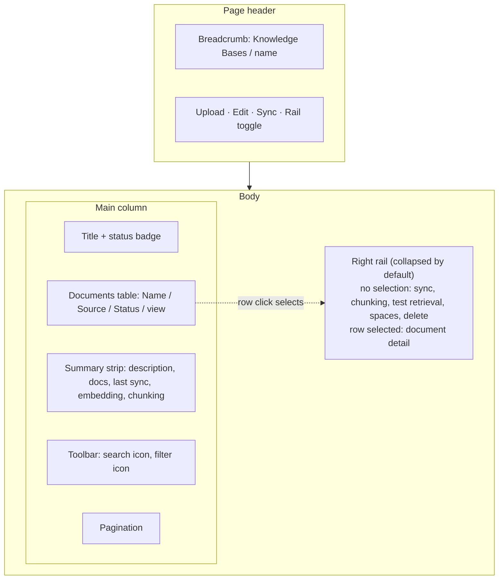
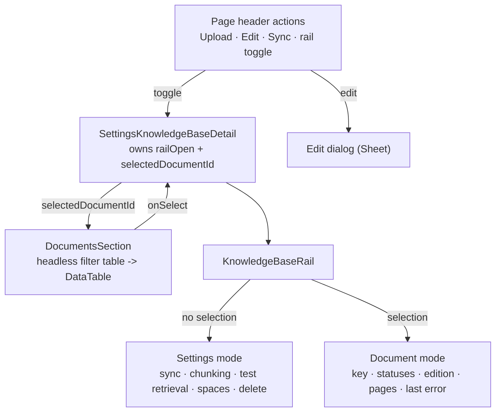

> **OBSOLETE (2026-07-29):** Knowledge Base removed from the product (THINK-402). Never built.

# Knowledge Base Detail Documents Table - Plan

## Goal Capsule

- Objective: make the Knowledge Base detail page a full-width documents table with a collapsible right rail, and let the Knowledge Bases list use its horizontal space.
- Product authority: THINK-345, Eric Odom. Product Contract unchanged by planning.
- Execution profile: web UI change in `apps/web` plus one field-widening in `packages/api/knowledge-base-files.ts`. No schema migration, no Terraform, no Bedrock configuration change.
- Stop conditions: stop and ask if a requirement would need a new database column, a Bedrock data-source change, or a change to how documents are ingested. None of those are in scope.
- Tail ownership: PR to `main`, which auto-deploys dev. McPherson and TEI are tag-pinned and are not part of this work.
- Open blockers: none.

---

## Product Contract

### Summary

The Knowledge Base detail page becomes a full-width table of documents with a collapsible side panel beside it. The panel is dual-mode — Knowledge Base settings when nothing is selected, the selected document's detail when a row is clicked. Upload, Edit, Sync, source details, and the panel toggle move into the page header as icons. On the Knowledge Bases list, the Description column flexes to fill the row.

### Problem Frame

The detail page today renders every section — Documents, Sync, Chunking, Test retrieval, Spaces, Delete — in a single 750px column, so a 173-document Knowledge Base gets a table roughly a third of the viewport wide while the settings sections that an operator reads once a month get equal billing. Long CX SOP filenames such as `CX-0006 Large Bulk Orders and_or McOil Long Haul Freight Requests.pdf` truncate mid-name, and the operator scrolls past four settings sections to reach the pagination control.

Nothing on the page tells the operator whether a specific document actually indexed, what edition it is on, or why it failed. That state exists in the manifest but has no surface. The result is a page that is mostly chrome around the one thing an operator opens it to do: find a document and confirm the agent can read it.

The Knowledge Bases list has the inverse problem — the Description column caps at a fixed width and truncates early while the row has space to spare.

### Key Decisions

- **The rail is toggled, not docked.** (session-settled: user-directed — chosen over an always-docked rail: table width is the page's purpose, and a permanent rail clips long CX filenames roughly 250px earlier at every viewport.) The operator opens the rail when they want settings or document detail, and the table reclaims the width when they close it.

- **One dual-mode rail rather than separate settings sheets plus a document panel.** (session-settled: user-directed — chosen over three modal sheets for sync, chunking, and retrieval alongside a fourth document panel: fewer surfaces to learn, one place to look.) The cost is that the rail switches content on row selection, so its two modes must be visually distinct.

- **The view icon is the only affordance that opens a document.** (session-settled: user-directed — chosen over row-click-to-open: row click is reserved for selection so the rail can show detail without spawning an accidental browser tab.)

- **Upload is always visible in the header.** (session-settled: user-approved — chosen over hiding it on connected-bucket Knowledge Bases: every Knowledge Base already carries exactly one managed-upload source, guaranteed by `ensureManagedUploadSource()` in `packages/api/knowledge-base-manager.ts`, the `uq_kb_sources_managed_upload` index, and the `0277` backfill, so the control is never dead.)

- **The table toolbar reuses the existing collapsible search plus token filter pattern.** (session-settled: user-directed — chosen over an always-expanded search input: it matches Memory, Knowledge Graph, Workflows, and Work Items, and keeps the strip above the table to two icon buttons.)

### Requirements

**Knowledge Bases list**

- R1. The Description column expands to fill the row's remaining width, and the table never scrolls horizontally.
- R2. Description text that exceeds the column truncates with an ellipsis and exposes the full text on hover.

**Detail page shell**

- R3. The detail page renders at the full width and height of its container: the page itself never scrolls, and the table body and side panel scroll independently with the pager pinned to the bottom.
- R4. The page header carries icon actions for Upload, Edit, Sync, source details, and the rail toggle.
- R5. The Knowledge Base description stays printed beneath the title; its document count, last sync, embedding model, and chunking configuration open from the header's source-details control, so the table starts high on the page.
- R6. Upload renders on every Knowledge Base regardless of which sources it has.
- R7. Editing name and description opens a modal sheet from the header Edit icon, separate from the rail.

**Documents table**

- R8. The documents table is the page's primary content, with columns for Name, Source, Status, and row actions.
- R9. The Name column takes the table's remaining width and truncates with an ellipsis, exposing the full document key on hover.
- R10. The row actions column carries a view control that opens the original document in a new browser tab.
- R11. Clicking a row selects it and shows that document's detail in the rail; row click never opens the document.
- R12. The table toolbar carries a collapsible search control and a token filter control, rendered as icon buttons.
- R13. Filtering covers Source and Status.
- R14. Remove is offered only for documents belonging to a managed-upload source.

**Right rail**

- R15. The rail is collapsed by default and toggled from the header.
- R16. Opening the rail narrows the table rather than overlaying it, and the table's truncation adjusts to the narrower width.
- R17. With no row selected, the rail shows Knowledge Base settings: sync state and the sync action, chunking, test retrieval, space bindings, and delete.
- R18. With a row selected, the rail shows that document's detail; selecting a different row replaces the contents.
- R19. Closing the rail clears the row selection, so reopening it returns to Knowledge Base settings.

**Document detail**

- R20. Document detail shows the document name, its full key, its source, its ingest and projection status, its edition, its page count, when it was last indexed, and its last error when one exists.
- R21. Document detail states plainly when a document has no indexed content, so an operator can tell "indexed nothing" apart from "not yet indexed".

### Key Flows

- F1. Find and open a document
  - **Trigger:** Operator opens a Knowledge Base to check a specific SOP.
  - **Steps:** Operator expands the toolbar search, types part of the filename, and clicks the view control on the matching row. The document opens in a new tab at its original location.
  - **Covered by:** R8, R9, R10, R12.

- F2. Diagnose one document's indexing state
  - **Trigger:** A document shows a status other than indexed, or the agent cannot cite it.
  - **Steps:** Operator filters Status, clicks the row, and reads the document's detail in the rail — edition, page count, last indexed time, last error.
  - **Covered by:** R11, R13, R18, R20, R21.

- F3. Change a Knowledge Base setting
  - **Trigger:** Operator wants to re-sync, adjust chunking, or test retrieval.
  - **Steps:** Operator opens the rail from the header, which shows Knowledge Base settings because no row is selected, and acts there. Closing the rail returns the table to full width.
  - **Covered by:** R15, R16, R17, R19.

### Acceptance Examples

- AE1. Rail opening re-truncates the table
  - **Covers R9, R16.**
  - **Given** a document whose name fits the Name column with the rail closed,
  - **When** the operator opens the rail,
  - **Then** the table narrows and the name truncates with an ellipsis, with the full key still available on hover.

- AE2. Connected-bucket documents cannot be removed
  - **Covers R14.**
  - **Given** a document whose source is a connected bucket,
  - **When** the operator views its row and its detail,
  - **Then** no remove control is offered anywhere.

- AE3. Row selection never opens a tab
  - **Covers R10, R11.**
  - **Given** the documents table,
  - **When** the operator clicks a row anywhere other than the view control,
  - **Then** the row is selected and the rail shows its detail, and no browser tab opens.

- AE4. Closing the rail resets its mode
  - **Covers R18, R19.**
  - **Given** a selected row with its detail showing in the rail,
  - **When** the operator closes and reopens the rail,
  - **Then** the rail shows Knowledge Base settings and no row is selected.

- AE5. A failed document explains itself
  - **Covers R20, R21.**
  - **Given** a document whose ingest failed,
  - **When** the operator selects its row,
  - **Then** the rail shows its status and the recorded error rather than an empty panel.

### Layout

### Scope Boundaries

- In-browser preview of `.docx`, `.pptx`, and `.xlsx` documents. THINK-344 owns that, along with the ingestion gap behind it. The view control here opens the original file in a new tab and nothing more.
- Extracting the collapsible search toolbar into a shared component. The pattern is currently duplicated across Memory, Knowledge Graph, Workflows, Work Items, and the Twenty account index; consolidating it is worth doing but is its own change with its own blast radius.
- Changes to Knowledge Base creation or the managed-upload source model. The guarantee this work depends on already holds.
- Redesigning sync, chunking, or retrieval behavior. Those surfaces move into the rail unchanged.

### Dependencies and Assumptions

- The manifest listing API returns six fields today — id, document key, name, status, source kind, and updated-at — while `knowledge_base_documents` holds edition, page count, ingest and projection status, last error, derived prefix, and preprocessor version. R20 needs those fields reaching the client, so this work carries a small API widening alongside the interface change.
- `Sheet` and `DataTable` already exist in `@thinkwork/ui`, and the page header already exposes an unused action slot, so no new primitives are required.
- Every Knowledge Base has exactly one managed-upload source. Verified in `packages/api/knowledge-base-manager.ts` and `packages/database-pg/drizzle/0277_knowledge_base_sources.sql`.

### Success Criteria

- Validated on localhost against the McPherson deployment's CX SOPs Knowledge Base — 173 documents across 18 pages, with filenames long enough to exercise truncation at every rail state.
- An operator can determine whether a named document is retrievable without leaving the page.

### Sources

- `apps/web/src/components/settings/SettingsKnowledgeBases.tsx` — list table; Description cell and column sizing.
- `apps/web/src/components/settings/SettingsKnowledgeBaseDetail.tsx` — detail page; the fixed-width container, the documents table, and the five sections that move into the rail.
- `apps/web/src/components/settings/AgentProfilesSheet.tsx` — existing side-sheet pattern.
- `apps/web/src/components/settings/SettingsMemory.tsx` — the collapsible search plus token filter toolbar this work reuses.
- `apps/web/src/context/PageHeaderContext.tsx` — the header action slot.
- `apps/web/src/lib/kb-files-api.ts` — manifest listing and presigned view URL.
- `packages/database-pg/src/schema/knowledge-bases.ts` — the document fields available for R20.

---

## Planning Contract

### Key Technical Decisions

- KTD-1. **The rail is layout, not a `Sheet`.** `packages/ui/src/components/ui/sheet.tsx` wraps Radix `Dialog` and renders a `fixed inset-0` scrim, so it always overlays and traps focus. R16 requires the rail to narrow the table instead. The rail is therefore a flex sibling of the table column, and `Sheet` is reserved for the Edit dialog in R7. (session-settled: user-directed — chosen over an overlay sheet: the operator judges filename truncation against the table's actual width, which an overlay hides.)

- KTD-2. **Rail visibility and row selection are one piece of state, owned by the detail page.** A single `selectedDocumentId` plus a `railOpen` boolean live in `SettingsKnowledgeBaseDetail`, not inside `DocumentsSection`. Selecting a row opens the rail in document mode; closing the rail clears the selection (R19). Splitting this across components would let the two drift into a state where the rail is open with a stale selection.

- KTD-3. **Token filtering runs through a headless table, mirroring Memory.** `DataTableTokenFilter` requires a TanStack table instance, which `DataTable` does not expose to its callers. `SettingsMemory.tsx:474` already solves this: build a second `useReactTable` with `getFilteredRowModel`, hand it to the filter, and feed its filtered rows to the display `DataTable` as `data`. Reuse that shape rather than threading a table instance out of `DataTable`.

- KTD-4. **The manifest listing widens in place; no new API action.** `listManifest` in `packages/api/knowledge-base-files.ts` builds its response from an explicit Drizzle select list. Every field R20 needs is already a column on `knowledge_base_documents`, so this is an extension of that select and its row mapping. A separate `getDocument` action would add a round trip on every row click for data the list query can carry.

- KTD-5. **The collapsible search is copied, not extracted.** `MemoryToolbarSearch` is local to `SettingsMemory.tsx` and the same pattern is duplicated in four other surfaces. Extracting a shared component would touch five call sites and is out of scope per the Product Contract, so this work adds a sixth local copy and leaves the consolidation to a follow-up.

### High-Level Technical Design

State ownership and the rail's two modes:

The two rail modes are the only branching in the design; everything else is a straight pattern application.

### Assumptions

- Row selection is page-local state, not URL state. A selected document is not linkable, and selection does not survive a reload. Making it linkable would need a route search param and is not requested.
- The panel renders at a fixed width beside the table, inside the content area, matching the table's height rather than the page's. `Resizable` exists in `@thinkwork/ui` if a resizable rail is wanted later, but a fixed width is what the layout decision was made against.
- Selection clears when the table's page changes, since the selected row is no longer visible.
- The header source-details popover reads its values from the existing `KnowledgeBaseDetailQuery` fields, which already carry document count, last sync, embedding model, and chunking.

### Sequencing

U1 first, so the rail's document mode has real fields to render rather than a placeholder. U2 is independent and can land at any point. U3 unblocks U4 and U5; U5 unblocks U6.

---

## Implementation Units

### U1. Widen the manifest listing with document detail fields

- Goal: `listManifest` returns the fields the rail's document mode needs.
- Requirements: R20, R21. Implements KTD-4.
- Dependencies: none.
- Files:
  - `packages/api/knowledge-base-files.ts` — extend the `listManifest` select list and row mapping.
  - `apps/web/src/lib/kb-files-api.ts` — extend `KbManifestDocument`.
  - `packages/api/knowledge-base-files.test.ts` — new suite.
- Approach: add `projection_status`, `edition`, `page_count`, `last_error`, and `effective_from` to the existing select and map them onto the response objects in the same camelCase style as the current fields. `effective_from` backs "last indexed" in R20; the existing `updated_at` stays the row's modification time and keeps its current meaning. Leave `total`, ordering, and pagination untouched. The client interface gains the matching optional fields so existing callers keep compiling.
- Execution note: no test file exists for this module yet. Follow the in-memory table fake and hoisted-mock shape in `packages/api/knowledge-base-manager.test.ts` rather than inventing a harness.
- Patterns to follow: `packages/api/knowledge-base-manager.test.ts` for db mocking; the existing `listManifest` row mapping for naming.
- Test scenarios:
  - A document with every field populated round-trips all of them into the response.
  - A document with null `page_count`, null `last_error`, and null `effective_from` returns nulls rather than omitting the keys or throwing.
  - A document whose `source_id` is null still reports `sourceKind` as `managed-upload`, unchanged from today.
  - `limit` and `offset` still bound the result set, and `total` still counts every document in the Knowledge Base, not the page.
- Verification: the new suite passes and the response shape for pre-existing fields is byte-identical to before.

### U2. Flex the Description column on the Knowledge Bases list

- Goal: Description fills the row's remaining width without introducing horizontal scroll.
- Requirements: R1, R2.
- Dependencies: none.
- Files:
  - `apps/web/src/components/settings/SettingsKnowledgeBases.tsx`
  - `apps/web/src/components/settings/SettingsKnowledgeBases.test.tsx`
- Approach: under `table-fixed`, an unsized column absorbs leftover width — today both Name and Description are unsized, so they split it and Description is further capped by `max-w-md`. Give Name an explicit size, drop the cap from Description, and let Description be the sole unsized column. Apply the `max-w-0` plus `truncate` combination the documents table already uses so the ellipsis actually clips, and carry the full text in a `title` attribute.
- Patterns to follow: the Name column in `SettingsKnowledgeBaseDetail.tsx` — the comment there records that `meta.cellClassName: "max-w-0"` is what makes truncation work under `table-fixed`.
- Test scenarios:
  - A long description renders inside a truncating element and carries the full text in its title attribute.
  - A null description still renders the em-dash placeholder.
  - The table still renders with horizontal scrolling disabled.
- Verification: jsdom computes no layout, so the tests can only pin structure and props. Confirm in a browser that the Description column occupies the space Name previously took and that no horizontal scrollbar appears at any width.

### U3. Rebuild the detail page shell

- Goal: full-width page with header icon actions and the description beneath the title.
- Requirements: R3, R4, R5, R6, R7.
- Dependencies: none.
- Files:
  - `apps/web/src/components/settings/SettingsKnowledgeBaseDetail.tsx`
  - `apps/web/src/context/PageHeaderContext.tsx` — read only; the `action` slot already exists.
- Approach: drop the `max-w-[750px]` wrapper and adopt the fixed-height shell `SettingsTablePane` uses — a `flex h-full min-h-0 flex-col` page with a `shrink-0` title block and a `min-h-0 flex-1` body, so `DataTable`'s `scrollable` mode can pin the pager. Publish Upload, Edit, Sync, and the rail toggle into the page header's `action` slot via `usePageHeaderActions`, using `TooltipIconButton` for each. Upload keeps its hidden file input and renders unconditionally. Keep the description beneath the title and move the four operator facts into a popover behind a header source-details icon, replacing what the Sync section used to display. Introduce the `railOpen` and `selectedDocumentId` state here per KTD-2, and pass a no-op rail placeholder until U5.
- Execution note: the header action slot is keyed by `actionKey` — set one that changes when the rail toggle's state changes, or the header will not re-render the toggle.
- Patterns to follow: `SettingsKnowledgeBases.tsx:40-63` publishes a header controller upward; the same shape works for a page that owns its own actions.
- Test scenarios:
  - The page renders Upload, Edit, Sync, and the rail toggle as labeled controls in the header.
  - Upload renders for a Knowledge Base whose only source is a connected bucket.
  - The description stays on the page; the document count, last sync, embedding model, and chunking open from the header source-details control.
  - Clicking Edit opens the existing name-and-description dialog and does not open the rail.
  - A Knowledge Base in `failed` status still renders its provisioning-failure banner and retry control.
- Verification: the page fills its container at a wide viewport and the header carries four working controls.

### U4. Documents table: view control, selection, search, and filter

- Goal: the table becomes the page's primary content with the interaction model R8 through R14 describe.
- Requirements: R8, R9, R10, R11, R12, R13, R14. Implements KTD-3, KTD-5.
- Dependencies: U3.
- Files:
  - `apps/web/src/components/settings/SettingsKnowledgeBaseDetail.tsx`
  - `apps/web/src/components/settings/SettingsKnowledgeBaseDetail.test.tsx` — new suite.
- Approach: replace `onRowClick` with a selection callback and move `openDocument` behind an icon control in the actions column. Add a collapsible search control and a `DataTableTokenFilter` over Source and Status, wired through a headless `useReactTable` per KTD-3, whose filtered rows become the `DataTable`'s `data`. Move Remove into an overflow control in the same column, rendered only for managed-upload documents. Mark the selected row visually.
- Execution note: `openDocument` opens `about:blank` synchronously before awaiting the presigned URL, to survive popup blockers. Keep that ordering when moving the call behind the icon.
- Patterns to follow: `SettingsMemory.tsx:83-160` for the collapsible search; `SettingsMemory.tsx:474-486` for the headless filter table; `SettingsMemory.tsx:662-680` for the `DataTableTokenFilter` props.
- Test scenarios:
  - Clicking the view control calls the presigned-URL path; clicking the row does not.
  - Clicking a row marks it selected and reports the selection upward.
  - The overflow control offers Remove for a managed-upload document and offers nothing for a connected-bucket document.
  - Filtering by Status narrows the rendered rows, and clearing the filter restores them.
  - Committing a search term narrows rows by name; clearing restores the full set.
  - A long filename renders truncated with the full document key in its title attribute.
- Verification: with McPherson's 173-document Knowledge Base loaded, search and filter both narrow the table, and only the view control opens a tab.

### U5. Right rail in settings mode

- Goal: a collapsible rail that narrows the table and holds the Knowledge Base settings.
- Requirements: R15, R16, R17, R19. Implements KTD-1, KTD-2.
- Dependencies: U3.
- Files:
  - `apps/web/src/components/settings/KnowledgeBaseRail.tsx` — new.
  - `apps/web/src/components/settings/SettingsKnowledgeBaseDetail.tsx`
  - `apps/web/src/components/settings/SettingsKnowledgeBaseDetail.test.tsx`
- Approach: wrap the page body in a flex row whose second child is the rail, rendered only when open, so the table column reflows to the narrower width. Move the existing Chunking, Test retrieval, Spaces-binding, and Delete sections into the rail unchanged — they keep their current behavior, mutations, and confirmation flow. The Sync section keeps its status badge but sheds the four facts the header source-details popover now carries, so the same numbers never appear twice on one screen. Closing the rail clears `selectedDocumentId`.
- Execution note: do not reach for `Sheet` here; KTD-1 records why. The reflow is a layout effect that jsdom does not compute — the tests pin the rail's presence and the table container's structure, and the narrowing itself is confirmed in a browser.
- Patterns to follow: the existing `SettingsSection` and `SettingsRow` shapes carry over verbatim; only their container changes.
- Test scenarios:
  - The rail is absent on first render and appears after the header toggle is activated.
  - With no selection, the rail shows sync state, chunking, test retrieval, spaces, and delete.
  - Toggling the rail closed removes it and clears any selection.
  - The delete-confirmation flow still requires the second confirm before the mutation fires.
  - Sync from the rail disables while a sync is in flight, matching today's behavior.
- Verification: opening the rail visibly narrows the table and the moved sections still work end to end.

### U6. Right rail in document-detail mode

- Goal: selecting a row shows that document's indexing state in the rail.
- Requirements: R18, R20, R21.
- Dependencies: U1, U5.
- Files:
  - `apps/web/src/components/settings/KnowledgeBaseRail.tsx`
  - `apps/web/src/components/settings/SettingsKnowledgeBaseDetail.test.tsx`
- Approach: branch the rail on `selectedDocumentId`. In document mode, render the name, the full document key, the source, the ingest and projection statuses, the edition, the page count, the last indexed time, and the last error when present, from the widened row the table already holds. No additional fetch. Distinguish "indexed with no extractable content" from "not yet indexed" using page count and status together, so R21 has a concrete signal.
- Patterns to follow: `SettingsRow` for label-value pairs; the existing status badge variants for consistency between the table and the rail.
- Test scenarios:
  - Covers AE5. Selecting a failed document shows its status and its recorded error.
  - Selecting a document replaces settings-mode content with document-mode content.
  - Selecting a different row replaces the previously shown document.
  - A document with a null page count and null error renders without empty rows or crashes.
  - An indexed document with zero pages reads differently from a pending document.
- Verification: on McPherson, selecting a CX SOP shows its key, edition, and page count; selecting a failed document shows its error.

---

## Verification Contract

| Gate           | Command                                                                                        | Applies to         |
| -------------- | ---------------------------------------------------------------------------------------------- | ------------------ |
| Web unit tests | `npx vitest run` in `apps/web`                                                                 | U2, U3, U4, U5, U6 |
| API unit tests | `npx vitest run knowledge-base-files.test.ts` in `packages/api`                                | U1                 |
| Types          | `pnpm -r --if-present typecheck`                                                               | all                |
| Lint           | `pnpm -r --if-present lint`                                                                    | all                |
| Formatting     | `pnpm format:check`                                                                            | all                |
| Live check     | `THINKWORK_SPACES_DEV_PORT=5180 pnpm --filter @thinkwork/web dev` against the McPherson `.env` | U2, U4, U5, U6     |

The live check is not optional for the interface units. `docs/solutions/ui-bugs/inline-citations-shipped-inert-twice-2026-07-25.md` records the same components shipping inert twice while every unit test passed, because the tests exercised parsers rather than the rendered tree. Assert on rendered output in the suites, and confirm the behavior in a browser before calling a unit done.

---

## Definition of Done

- Every requirement R1 through R21 is implemented or explicitly deferred in writing.
- The detail page renders full width, and the documents table is the first thing below the title and toolbar.
- Only the view control opens a document; row click selects.
- The rail toggles from the header, narrows the table, and switches between settings and document detail on selection.
- The Description column on the list fills its row and the table never scrolls horizontally.
- All gates in the Verification Contract pass.
- The behavior is confirmed in a browser against McPherson's CX SOPs Knowledge Base, not only in tests.
- No exploratory or dead-end code from abandoned approaches remains in the diff.
