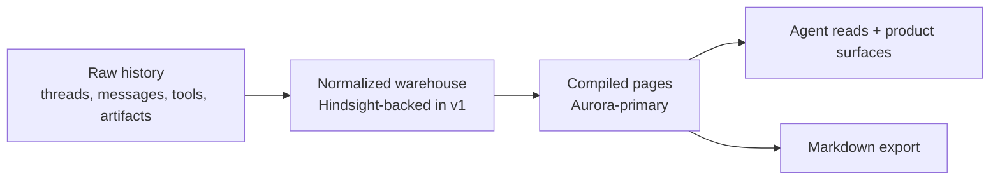
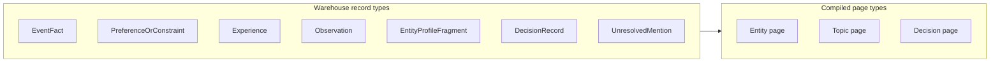
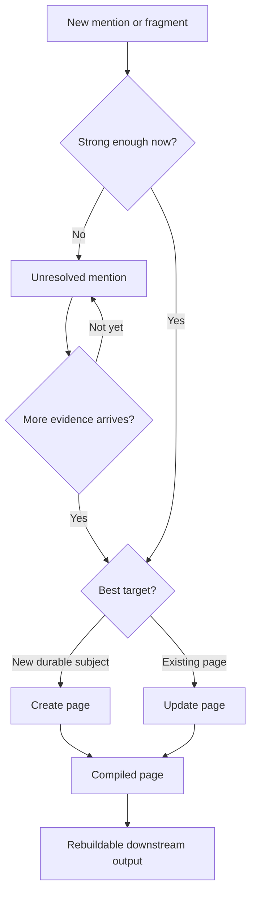

# Compounding Memory Visuals

Simple diagrams for explaining the architecture before implementation planning.

## 1. Raw history -> warehouse -> compiled pages

### Plain-English takeaway
- Raw history is the source stream.
- The warehouse is the canonical retained memory layer.
- Compiled pages are downstream, readable, and rebuildable.

## 2. 7 warehouse record types vs 3 compiled page types

### Plain-English takeaway
- The warehouse stores durable ingredients.
- The compiled layer stores a smaller set of readable outputs.
- `Topic` is a compiled page type, not a warehouse record type.

## 3. Unresolved mention -> page lifecycle

### Plain-English takeaway
- The middle state matters.
- Weak signal should not be dropped, and it should not instantly become page spam.
- Updating should be easier than creating, and creating should be easier than promotion.

## Framing lines to pair with these visuals

- Raw history tells you what happened.
- The warehouse tells you what should be remembered.
- Compiled pages tell you what we know overall.
- Use Hindsight to help remember. Use ThinkWork to decide what that memory becomes.
