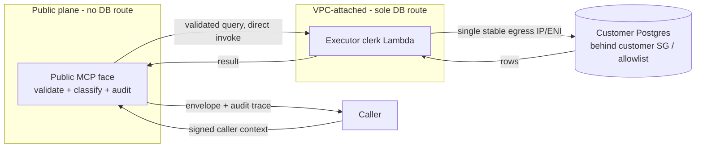

# External Postgres hosting split — dual-plane clerk architecture

## Context

THINK-228 shipped the ThinkWork Analyst query broker against Thinkwork's own
Aurora Postgres cluster: one Lambda, one VPC, one security group, one grant.
THINK-229 (this plan, R18/KTD10) hardens that broker's credential and policy
chain but deliberately does **not** build the next thing a customer will ask
for: pointing Analyst at _their_ Postgres — a database Thinkwork doesn't own,
sitting behind a security group or IP allowlist Thinkwork doesn't control.

That is a different hosting shape, not a bigger version of the same one. The
owned-Aurora broker lives entirely inside Thinkwork's VPC and never crosses a
customer-controlled network boundary. An external database requires Thinkwork
to present a stable, reviewable network identity to a system it doesn't
operate — and every customer security team will ask "what exactly is
connecting, and can I firewall it to one thing?" before they grant access.
This record is the answer to that question, decided now so it doesn't get
freelanced under deal pressure later. Per R18/KTD10, it is **documentation
only** — no clerk Lambda, no VPC changes, no Terraform ships as part of this
plan.

## Decision

**Dual-plane architecture.** Split the Analyst surface for external
Postgres into two Lambdas with two different network postures:

1. **Public MCP face** (existing `analyst-query-broker.ts` shape, extended)
   — receives the signed caller context (THINK-229 U2), verifies it,
   evaluates sidecar policy (U3) and budgets (U4), classifies and validates
   the SQL (existing `analyst-query-gate.ts` single-statement/read-only
   gate), and writes the audit trace. **It has no security-group route to
   any customer database — none, ever.** It is a policy and audit plane, not
   a data plane.
2. **Executor clerk** — a single, narrowly-scoped, VPC-attached Lambda that
   is the _only_ thing in the account with a security-group path to
   customer databases. The public face direct-invokes the clerk
   (Lambda-to-Lambda `RequestResponse`, per the no-fire-and-forget
   convention) with an already-validated, already-policy-checked query; the
   clerk does no policy evaluation of its own — it trusts the plane that
   invoked it (same trust boundary as `mcp-configs.ts` trusting the API
   before it mints a caller context) and just executes.

The reason to split rather than just VPC-attach the existing broker: a
Lambda's security group is an all-or-nothing property of the whole function.
If the broker that also handles policy, budgets, and MCP transport is
VPC-attached, _every_ code path in it — including code that has nothing to
do with reaching a customer database — inherits a route into customer
networks. Narrowing the network-privileged surface to one small,
single-purpose clerk means a security review of "what can reach our
database" is a review of one short file, not the whole broker.

**What the clerk buys the customer:** one Lambda function means one set of
ENIs, which — via a NAT Gateway or a fixed Elastic IP in front of the VPC —
gives Thinkwork **one stable, documentable egress identity** customer
security teams can put in a security-group ingress rule or IP allowlist
instead of "the AWS Lambda IP range" or "trust our token." This is the
concrete product benefit that makes the split worth the operational
overhead of a second Lambda.

## Connection-storm posture: no RDS Proxy, no read replicas — today

**Decision: ship the clerk (when built) with direct per-invocation
connections, no RDS Proxy, no read replica routing.** This mirrors the
owned-Aurora broker's current posture (`analyst-reader-db.ts`, cached
`pg.Client` per warm Lambda instance, reserved concurrency bounding
simultaneous connections) rather than introducing new infrastructure ahead
of a demonstrated need.

This is deliberately not the AWS-recommended default for serverless-to-RDS
at scale — RDS Proxy exists precisely to smooth Lambda's cold-start /
concurrency-driven connection churn. The decision to skip it now is a
scoping call (KTD10's sibling: don't build for a load pattern that doesn't
exist yet), not a claim that direct connections scale indefinitely.

**Concrete build trigger for RDS Proxy / read replicas:** either of —

- Sustained concurrent-connection pressure from **simultaneously-connected
  external tenants** approaching the customer database's `max_connections`
  headroom (reserved concurrency today bounds this per-function, but each
  new external customer adds its own ceiling risk on a database Thinkwork
  doesn't size).
- A measured **connection-establishment latency** contributing materially
  to a query-latency SLO breach (RDS Proxy's connection pooling and
  multiplexing directly targets this; short of an observed breach, it's
  unneeded complexity).

Either trigger converts this from "no" to "build it" — it does not require
a new design record, just execution of the deferred item.

## Owned Aurora stays on the direct path

THINK-229 U1's RDS IAM-token connection (`analyst-reader-db.ts`, per-connect
`@aws-sdk/rds-signer` tokens, TLS verified against the bundled RDS CA) is
**not** rerouted through the clerk. The owned-Aurora broker already lives
inside Thinkwork's own VPC with a security group Thinkwork controls
end-to-end; there is no customer network boundary to cross and therefore no
reason to introduce clerk indirection or its extra hop. The dual-plane split
exists solely because an _external_ database sits behind infrastructure
Thinkwork doesn't own — for owned Aurora, the broker connecting directly
stays strictly simpler and stays exactly as U1 ships it.

## Why not RDS Data API (KTD10)

RDS Data API is the obvious "no persistent connection, no VPC networking to
manage" alternative, and it is rejected for both the broker and the
owned-Aurora leg of any future hosting split, for three independent
reasons — any one of which would be disqualifying on its own:

1. **1 MiB per-call response cap.** The Analyst envelope
   (`analyst-envelope.ts`) already allows result payloads up to **5 MB**
   before falling back to a `result_file` handle. Data API's cap is a fifth
   of that ceiling — it would force a lower envelope limit or a rewrite of
   the large-result path for no benefit.
2. **Writer-instance-only execution.** Data API executes exclusively
   against the cluster writer. Analyst is a **read** workload; routing
   read-only SELECT traffic onto the writer instance defeats any future
   reader-scaling story (including the read-replica option this record
   already reserves as a connection-storm lever) and adds needless
   contention with write traffic on the same instance.
3. **Secret-ARN authentication reintroduces the exact static secret this
   plan removes.** Data API authenticates via a Secrets Manager secret ARN
   — a long-lived stored credential. THINK-229's entire credential-chain
   arc (R1–R6) exists to retire the `analyst_reader` static password in
   favor of per-connect RDS IAM tokens; adopting Data API for any leg of
   Analyst would silently reintroduce the class of risk the rest of this
   plan is designed to remove.

Also relevant, though not independently disqualifying: RDS Data API is an
**owned-Aurora-only** service — it doesn't exist for arbitrary customer
Postgres instances at all, so it was never a candidate for the external leg
in the first place. The rejection above is stated for completeness because
it was evaluated for the owned-Aurora leg of the split.

## What the trust-anchored chain already gives the clerk design for free

The clerk is deferred, but it is deferred _cheaply_ because THINK-229's
other units (U1–U5) build exactly the trust primitives a network-privileged
executor needs, so when the clerk is eventually built it inherits them
rather than inventing its own:

- **Ed25519-signed caller context (U2)** — the public MCP face can pass the
  clerk a request that already carries a verifiable, tamper-evident identity
  (tenant, actor kind, expiry, `bodyHash`) instead of a second ad-hoc
  trust handshake between the two Lambdas. The clerk verifies the same
  signature scheme rather than re-deriving trust.
- **Signed sidecar policy (U3)** — operations, budgets, and role tier are
  already policy the public face evaluates and stamps into the validated
  request before it reaches the clerk; the clerk needs no policy engine of
  its own, only an executor.
- **Broker-side budget enforcement (U4)** — the tenant-day and per-run caps
  are enforced before a query reaches the network-privileged hop, so the
  clerk's blast radius under a compromised or over-eager caller is already
  bounded by the same budgets protecting owned Aurora.
- **The reconciler probe pattern (U5)** — the scheduled reachability / grant
  / drift probe built for owned Aurora is the direct template for probing
  an external connection's health (reachability through the customer's
  allowlist, credential validity, schema drift) and withholding it loudly
  on failure, rather than designing a second withholding mechanism.

In short: the hard trust-and-policy problem is solved once, by U1–U5, for
the connection class Thinkwork controls end-to-end. The clerk, when built,
is mostly a network-topology change wrapped around machinery that already
exists — not a second security model.

## Build trigger

**No clerk Lambda, VPC wiring, or Terraform ships until the first
non-Thinkwork database connects.** This is a hard gate, not a target date:
building ahead of the first real customer means guessing at requirements
(exact egress-identity shape a real customer's security team will accept,
real latency/connection-storm numbers, real allowlist mechanics) that are
unknowable until a specific customer's infrastructure is in front of us.
When that customer conversation starts, this record is the design to
implement against, updated with whatever that customer's actual
constraints turn out to require.

## References

- `docs/plans/2026-07-08-002-feat-analyst-connection-hardening-plan.md` — R18, KTD10, U8 (this plan)
- `docs/plans/2026-07-08-001-feat-thinkwork-analyst-plan.md` — THINK-228, the owned-Aurora broker this record extends
- `packages/lambda/analyst-query-broker.ts` — current single-plane broker (owned Aurora only)
- `packages/lambda/analyst-reader-db.ts` — RDS IAM connect path (U1) the clerk's owned-Aurora leg mirrors
- `packages/lambda/analyst-envelope.ts` — the 5 MB envelope ceiling cited above
- AWS RDS Data API docs (verified 2026-07-08): 1 MiB per-call response cap; writer-instance-only execution; Secrets Manager secret-ARN authentication
