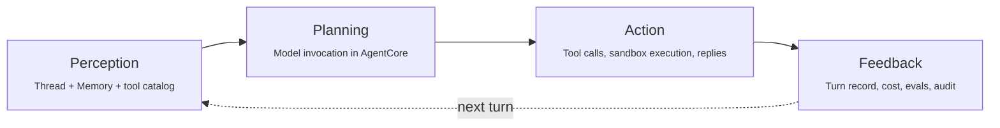

import { Aside } from '@astrojs/starlight/components';

ThinkWork is **the open Agent Harness for Business**. The harness is the engineered structure around the model that turns raw, non-deterministic agent output into reliable, traceable, auditable work. This page is the architecture of that harness — first the mechanics that make it a harness, then the components, then the AWS deployment topology.

There are three useful views of the system:

1. The **harness mechanics** — the agent loop, the four operating guarantees the runtime enforces, the metaphor that ties it together
2. The **conceptual model** — how the six components fit together to do work
3. The **infrastructure model** — what gets deployed in your AWS

Every resource lives in your AWS account. There is no shared infrastructure, no callbacks to external control planes, and no telemetry sent outside your account. That matters because ThinkWork is not just trying to run agents — it is trying to give customers an open, customer-owned harness for AI work.

## The harness mechanics

A model alone is a wild horse. The harness is what turns its motion into useful work — direction, control, recovery, accountability. Every concept in the rest of this page (Threads, Memory, Agents, Connectors, Automations, Control) earns its place by implementing one or more pieces of that harness. This section names the mechanics directly.

<Aside type="tip">
  The "harness" framing comes from the [Definitive Guide to Harness Engineering](https://www.harnessengineering.com/) (Mitchell Hashimoto, 2026). The metaphor: a state-of-the-art model is a powerful but directionless wild horse; the harness is the reins, bit, and bridle that make its power useful. ThinkWork's job is the harness — the engineered structure between your inputs and the model's output that turns potential into reliable, governable work. The rest of this page assumes that frame.
</Aside>

### The PPAF agent loop

Every agent turn in ThinkWork follows the same four-phase cycle: **Perception, Planning, Action, Feedback** (PPAF). The harness implements each phase as a distinct, observable surface — that's what makes turns reproducible and auditable instead of opaque.



- **Perception.** The harness assembles the agent's view of the world: the thread's prior messages, retrieved memory, the tool catalog, the current channel context. This is what Threads + Memory + Connectors produce together — a structured snapshot the model reasons over.
- **Planning.** The model (via AgentCore on Bedrock) decides what to do next. ThinkWork doesn't replace the model's reasoning; it bounds the inputs and channels the outputs.
- **Action.** Tool calls fire (with capability gating), sandbox code executes (with isolation), replies emit (through connectors). Every action is captured as it happens.
- **Feedback.** The turn closes with a durable record: tokens, cost, tool outcomes, guardrail decisions, evaluator scores. That feedback is what the *next* turn perceives — and what an operator reads after the fact.

The four phases are why the docs structure the components the way it does: Threads + Memory + Connectors are the perception substrate; Agents are the planning + action layer; Control is the feedback layer (audit, cost, evaluation). Automations time the loop's entry from the outside.

### The four operating guarantees

Beyond the loop, the harness has four operational properties it commits to delivering on every turn — the **operating guarantees**. These are the four promises a buyer or operator can grab onto and the four dimensions an evaluator can measure:

- **Reliability.** Fault recovery from checkpoints, idempotent writes, behavior consistent under the same inputs. Implemented in: thread durability + RLS, AgentCore retry semantics, Step Functions for automations.
- **Efficiency.** Token budgets and per-agent spend caps, low-latency interactive paths, throughput that scales with usage. Implemented in: Control's budget enforcement, AppSync for streaming, the cost ledger.
- **Security.** Per-agent capability grants, sandboxed execution, I/O filtering for prompt injection and PII. Implemented in: Templates, AgentCore code sandbox, Bedrock Guardrails (`content_filters`), Strands `safety.py`.
- **Traceability.** End-to-end traces per turn, explainable decisions, auditable state. Implemented in: the turn record, the append-only audit log on S3, evaluator scores per turn.

The five governance controls in [Control](/concepts/control/) map 1:N to these four operating guarantees — for example, "Runs in your AWS" implements Security and Traceability; "Cost control and analysis" implements Efficiency. The operating guarantees are the *language*; the controls are the *implementation*.

### State separation: model as compute, harness as state

A single principle underlies everything below: **ThinkWork treats the model as stateless compute. Durable state lives in the harness — threads, memory, audit, cost, policies, and execution records.**

This is the cleanest way to explain why the product exists. A model returns a response and forgets. The harness remembers everything that surrounded the response: which thread it ran inside, what memory was assembled, which tools fired, what the guardrail decided, what the cost was, what the evaluator scored. None of that lives in the model. All of it lives in the harness.

That separation is what makes turns reproducible (re-run a turn against a different model, the harness state is still intact), auditable (every turn has a durable record independent of what the model returned), and recoverable (a failed turn is a thread state, not a lost conversation). It also makes the model swappable — rotating from Sonnet to Opus is a template-id change because the harness owns everything *around* the model.

### The conceptual model maps onto the harness

The conceptual model below — Threads, Memory, Agents, Connectors, Automations, Control — is what most of the rest of this site documents. Reading the components against the harness mechanics keeps the picture coherent: every component is solving a piece of the harness problem (state, perception, planning, action, feedback, governance), not floating in isolation.

## System model

Before getting into the deployment tiers, it helps to frame the runtime in product terms:

```
External systems and users
    ↓
Threads
    ↓
Memory
    ↓
Agents
    ↓
Connectors and responses back out
```

### Threads

Threads are the durable record of work. User chats, connector events, emails, and automations all become threads with history, status, metadata, and auditability.

See [Threads](/concepts/threads/).

### Memory

Memory is the context layer. It determines what gets surfaced into the current turn beyond the latest message, and over time it should be portable through a ThinkWork-owned contract rather than defined by any one backend.

In the current open source app, that mainly means:

- thread history selected for the context window
- document retrieval through Bedrock Knowledge Bases
- long-term memory recall through AWS AgentCore LongTerm memory by default, or Hindsight when configured
- context assembly before model invocation

The default long-term memory setup includes semantic, summarization, user-preference, and episodic strategies.

See [Memory](/concepts/knowledge/).

### Agents

Agents are the execution layer. They receive a thread plus assembled context, decide what to do, call tools, and produce a response.

In managed mode, this execution happens in AgentCore, but the surrounding harness remains ThinkWork's. That distinction is important: managed does not mean vendor-hosted.

See [Agents](/concepts/agents/).

### Connectors

Connectors are the integration boundary. Some connectors bring inbound events into threads, and some expose external tools for agents to call.

This includes:

- channel and event connectors such as Slack, GitHub, and Google Workspace
- tool connectors, including [MCP Tools](/concepts/connectors/mcp-tools/)

See [Connectors](/concepts/connectors/).

## Three-tier deployment model

```
┌─────────────────────────────────────────────────────────────┐
│  App Tier                                                    │
│  AppSync · API Gateway · AgentCore Lambda · Crons · SES     │
│  CloudFront · Connector Lambdas · Step Functions            │
├─────────────────────────────────────────────────────────────┤
│  Data Tier                                                   │
│  Aurora Postgres (pgvector) · S3 (skills, KB, logs)         │
│  Bedrock KB · Secrets Manager                                │
├─────────────────────────────────────────────────────────────┤
│  Foundation Tier                                             │
│  VPC · Subnets · Cognito · KMS · Route53 · ACM · SES Setup  │
└─────────────────────────────────────────────────────────────┘
```

### Foundation tier

The foundation tier provides identity, networking, and encryption. It changes rarely and is the most stable part of the deployment.

| Resource | Purpose |
|----------|---------|
| VPC + subnets | Isolated network with public and private subnets across 2 AZs |
| NAT Gateway | Outbound internet access for private subnet resources |
| Cognito User Pool | User authentication and JWT issuance |
| Cognito Identity Pool | Maps Cognito users to IAM roles for direct AWS resource access |
| KMS keys | Encryption at rest for app data, audit logs, and credential vault |
| Route53 records | DNS for admin app, API, and email |
| ACM certificates | TLS for CloudFront and API Gateway custom domains |
| SES domain identity | Verified sending domain for outbound email |

### Data tier

The data tier holds all persistent state. It depends on the foundation tier for network access and KMS encryption.

| Resource | Purpose |
|----------|---------|
| Aurora Postgres | Primary data store: agents, threads, messages, automations, connectors, users. Also hosts the `pgvector` index used by Bedrock Knowledge Bases — no separate vector DB |
| S3 — skill catalog | `skills/catalog/*.md` — skill packs loaded at invoke time |
| S3 — knowledge docs | Source documents for Bedrock Knowledge Bases |
| S3 — audit logs | Append-only log of every agent invoke (NDJSON, partitioned by date) |
| S3 — assets | Admin and end-user app static files |
| Bedrock Knowledge Base | Vector-indexed document store for inline RAG, backed by Aurora `pgvector` |
| Secrets Manager | DB credentials, OAuth client secrets |

### App tier

The app tier is where computation happens. It depends on both lower tiers.

| Resource | Purpose |
|----------|---------|
| AppSync GraphQL API | Real-time subscriptions (WebSocket), used for streaming responses |
| API Gateway v2 | HTTP queries and mutations, connector webhook ingress |
| AgentCore Lambda | Container-based agent runtime (Python/Strands + Bedrock) |
| Connector Lambdas | One per connector (Slack, GitHub, Google) — handles inbound events |
| Step Functions | Automation runner, routine executor |
| EventBridge | Triggers for scheduled automations |
| Bedrock AgentCore Memory | Always on — automatic per-turn retention into four strategies (semantic, preferences, summaries, episodes) |
| ECS Fargate (optional) | Hindsight memory add-on (if `enable_hindsight = true`) |
| CloudFront | CDN for admin app, end-user app static files |
| SES (sending) | Outbound email from agent responses |

## Data flow: agent invoke

A full round trip from user message to agent response:

```
1. User sends message
   └─ POST /graphql (API Gateway)
      └─ JWT validated by Cognito authorizer
      └─ createMessage resolver → Aurora (writes message record)
      └─ Triggers AgentCore Lambda invocation (async via SQS)

2. AgentCore Lambda receives event
   └─ Reads thread history from Aurora
   └─ Downloads assigned skill packs from S3
   └─ Queries Bedrock Knowledge Base (if assigned) → retrieves relevant chunks
   └─ Agent tools read long-term memories from AgentCore Memory (always on) via the `recall()` tool, and optionally from Hindsight (ECS) when `enable_hindsight = true`
   └─ After the turn completes, the container auto-emits a CreateEvent into AgentCore Memory so background strategies extract facts for future recall
   └─ Builds context: system prompt + selected history + retrieved knowledge + recalled memory + tool config

3. Bedrock inference
   └─ Strands sends context + message to Bedrock (Claude)
   └─ Model may request tool calls
   └─ Tools execute (SQL, S3, HTTP, skill-defined functions)
   └─ Tool results injected, model generates final response

4. Response delivery
   └─ AgentCore writes response message to Aurora
   └─ Publishes AppSync mutation → NewMessageEvent subscription
   └─ Stream chunks published in real time via AppSync
   └─ Thread status updated in Aurora

5. Client receives response
   └─ AppSync WebSocket delivers StreamChunkEvent chunks
   └─ Final NewMessageEvent marks completion
```

## Data flow: connector inbound

```
External service (Slack, GitHub, etc.)
    → POST /connectors/<id>/webhook (API Gateway)
    → Connector Lambda
        └─ Validates signature
        └─ Writes thread record to Aurora (channel=SLACK, metadata={...})
        └─ Invokes AgentCore (same path as user message above)
    → Agent response
        → Outbound connector or tool call posts reply back to Slack/GitHub/etc.
```

## Data flow: MCP tool connector

```
AgentCore receives thread + assembled context
    → Resolves enabled tool connectors from template/agent config
    → Connects to MCP server over HTTP streaming or SSE
    → Discovers available tools for this invocation
    → Model calls MCP tool when needed
    → Tool result returns into the same turn
    → Final response written back to the thread
```

## Data flow: external task webhook

```
External system (LastMile, Linear, etc.)
    → POST /integrations/<provider>/webhook (API Gateway)
    → Webhooks Lambda
        └─ Resolves webhook by token (target_type=task, provider id)
        └─ adapter.verifySignature (opt-in, provider-specific)
        └─ adapter.normalizeEvent → NormalizedEvent
        └─ Resolves the connection via providerUserId
        └─ Resolves the per-user MCP token (auto-refresh on expiry)
        └─ adapter.refresh() → live envelope
        │      (synthetic envelope fallback if refresh fails)
        └─ Upserts external-task thread (channel=TASK, metadata.external.latestEnvelope)
        └─ Writes system message (metadata.kind="external_task_event")
        └─ Awaits [notifyNewMessage, notifyThreadUpdate, sendExternalTaskPush]
    → Mobile task card refreshes via AppSync subscription (~2s)
    → Push notification fires only for assignment / status / due changes
```

## Data flow: automation

```
EventBridge scheduled rule (cron)
    → Step Functions state machine starts
    → Creates AUTO- thread in Aurora
    → Invokes AgentCore with configured prompt
    → (same agent loop as above)
    → Step Functions records execution result
    → Thread marked closed (or failed)
```

## Where state lives

This split is useful to keep in mind:

- **Threads** preserve the canonical record of work in Aurora
- **Memory** combines persisted sources like documents and memories with retrieval-time assembly
- **Agents** are mostly stateless between invocations aside from their configuration
- **Connectors** store credentials and integration configuration, but the resulting work still lands in threads

| What | Where | Backup |
|------|-------|--------|
| Agents, threads, messages | Aurora Postgres | Automated daily snapshots (7-day retention) |
| User accounts | Cognito User Pool | Cognito-managed, multi-AZ |
| Skill packs | S3 (skill catalog bucket) | S3 versioning enabled |
| Knowledge documents | S3 (knowledge bucket) | S3 versioning enabled |
| Audit logs | S3 (audit log bucket) | S3 versioning + lifecycle to Glacier after 90d |
| Memories (managed) | Aurora Postgres | Same as above |
| Memories (Hindsight) | Aurora Postgres + ECS in-flight processing | Same as above |
| OAuth tokens / API keys | SSM Parameter Store (SecureString, KMS) | SSM-managed |
| Terraform state | S3 (tfstate bucket) + DynamoDB (lock table) | S3 versioning enabled |
| Vector index | Aurora Postgres (`pgvector`) | Same as Aurora above |

<Aside type="note">
Because the vector index lives in Aurora (`pgvector`), an Aurora snapshot restore brings back agents, threads, memories, **and** the KB vector index in one shot. The only state that is not in Aurora is binary assets (S3) and a small amount of managed identity or secret state in AWS services such as Cognito and Secrets Manager. You may still want to re-trigger a Knowledge Base sync if source S3 documents have changed since the snapshot.
</Aside>

## Multi-tenancy

ThinkWork is multi-tenant within a single deployment. Every Aurora table has a `tenant_id` column and all queries are tenant-scoped. The Cognito identity pool maps users to tenants at login time.

Row-level security (Postgres RLS) enforces tenant isolation at the database level — even if application code has a bug, a query cannot return data from another tenant.

```sql
-- RLS policy (applied automatically by ThinkWork migrations)
CREATE POLICY tenant_isolation ON threads
  USING (tenant_id = current_setting('app.current_tenant_id')::uuid);
```

## Security model

| Boundary | Enforcement |
|----------|-------------|
| External → API | Cognito JWT (API Gateway authorizer) |
| API → Aurora | IAM auth + VPC security groups |
| AgentCore → Bedrock | IAM role (least privilege) |
| AgentCore → S3 | IAM role (read skills, read KB docs, write audit logs) |
| AgentCore → SSM | IAM role (read credentials for assigned connectors) |
| Tenant isolation | Postgres RLS on all tables |
| Secrets at rest | KMS encryption (dedicated key per secret category) |
| Audit trail | Append-only S3 bucket (no delete permissions on Lambda role) |

## AgentCore container

AgentCore is deployed as a Lambda container image stored in ECR. The image is built from the ThinkWork base image and includes:

- Python 3.12
- [Strands](https://strandsagents.com) agent framework
- Boto3 (Bedrock, S3, SSM, Secrets Manager clients)
- httpx (for skill HTTP tools)
- psycopg3 (Aurora connection)
- The ThinkWork runtime library (tool registration, memory read/write, context assembly)

The container is 512MB compressed. Lambda allocates 3GB memory (configurable), which maps to approximately 2 vCPUs. Cold start time is 3–5 seconds for the first invocation after a period of inactivity; warm invocations start in under 100ms.
