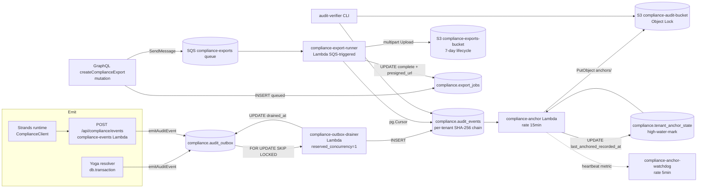

## Substrate flow

Audit events traverse five layers: **emit → outbox → drainer → events → anchor**. Exports run as a parallel slice path that reads from `audit_events` directly.



ASCII fallback for terminal viewers:

```
emit (Yoga in-tx | Strands HTTP)
    -> compliance.audit_outbox
        -> drainer Lambda (single-writer)
            -> compliance.audit_events (per-tenant SHA-256 chain)
                -> anchor Lambda (every 15 min)
                    -> S3 compliance-audit-bucket (Object Lock)
                        -> audit-verifier CLI

audit_events (read API)
    -> /compliance admin browse
    -> async export
        -> compliance.export_jobs (queued)
        -> SQS compliance-exports
        -> export-runner Lambda
            -> S3 compliance-exports-bucket (7-day TTL)
            -> presigned URL (15 min)
```

## Aurora role split

Three roles partition write privileges so a compromise of one cannot tamper with the chain. Provisioned by [`packages/database-pg/drizzle/0070_compliance_aurora_roles.sql`](https://github.com/thinkwork-ai/thinkwork/blob/main/packages/database-pg/drizzle/0070_compliance_aurora_roles.sql); password rotation is `STAGE=<stage> bash scripts/bootstrap-compliance-roles.sh`.

| Role | GRANTs | Used by |
|------|--------|---------|
| `compliance_writer` | `INSERT` on `audit_outbox`, `export_jobs` | `emitAuditEvent` helper (Yoga resolvers + REST handler); `createComplianceExport` mutation |
| `compliance_drainer` | `SELECT, UPDATE` on `audit_outbox`; `SELECT` on `actor_pseudonym`; `INSERT` on `audit_events` | `compliance-outbox-drainer` Lambda; the anchor Lambda also reuses this role for `tenant_anchor_state` UPDATEs (Decision #5 / #6 in the master plan) |
| `compliance_reader` | `SELECT` on all four `compliance.*` tables | U10 read API (`complianceEvents`, `complianceEvent`, `complianceEventByHash`, `complianceTenants`) |

All three roles also have `USAGE ON SCHEMA compliance` (single GRANT covers all three).

The export runner uses the **writer pool** (the main app role) rather than a dedicated `compliance_exporter` role at v1 — its blast radius is bounded by the bucket-scoped IAM grant on the runner Lambda's role, and a fourth Aurora role + secret + bootstrap-script extension would be over-engineering for a single consumer.

## S3 prefix contract

Two S3 buckets, three prefixes:

| Bucket | Prefix | Contents | Retention |
|--------|--------|----------|-----------|
| `thinkwork-{stage}-compliance-anchors` | `anchors/cadence-{cadenceId}.json` | Per-cadence Merkle anchor with global root + RFC 6962 domain-separated leaves | Object Lock GOVERNANCE/COMPLIANCE retention (`var.retention_days`, default 365) |
| `thinkwork-{stage}-compliance-anchors` | `proofs/{tenantId}/{cadenceId}.json` | Per-tenant proof slice (chain-head leaves + Merkle path) | Object Lock retention; shorter per-object override applied by the anchor Lambda (U8b) |
| `thinkwork-{stage}-compliance-exports` | `{tenantId}/{jobId}.{csv\|ndjson}` | Ephemeral export artifact (operator + cross-tenant runs use `multi-tenant/` prefix) | 7-day lifecycle expiration; **NOT** Object Lock |

Anchor bucket Terraform: [`terraform/modules/data/compliance-audit-bucket/`](https://github.com/thinkwork-ai/thinkwork/tree/main/terraform/modules/data/compliance-audit-bucket) — see the module README for the GOVERNANCE→COMPLIANCE cutover playbook.

Exports bucket Terraform: [`terraform/modules/data/compliance-exports-bucket/`](https://github.com/thinkwork-ai/thinkwork/tree/main/terraform/modules/data/compliance-exports-bucket) — designed deliberately without Object Lock; exports are derivable from `audit_events`, so the bucket is delivery plumbing, not a trust anchor.

## RFC 6962 hash chain

The anchor Lambda computes a global Merkle tree across per-tenant chain heads. Domain separation prevents second-preimage forgery on the proof path:

- **Leaf hash:** `sha256(0x00 || tenant_id_bytes || event_hash_bytes)`
- **Node hash:** `sha256(0x01 || left_child_hash || right_child_hash)`

The leading byte (`0x00` for leaves, `0x01` for inner nodes) ensures the hash space of leaves cannot collide with the hash space of internal nodes. Reference implementation: RFC 6962 section 2.1.

Anchor implementation: [`packages/lambda/compliance-anchor.ts`](https://github.com/thinkwork-ai/thinkwork/blob/main/packages/lambda/compliance-anchor.ts) (`computeLeafHash`, `combineNodes`, `buildMerkleTree`, `deriveProofPath`).

Verifier implementation: [`packages/audit-verifier/`](https://github.com/thinkwork-ai/thinkwork/tree/main/packages/audit-verifier) — auditors run the verifier independently against the anchor bucket + their own snapshot of the audit_events table to confirm byte-exact agreement.

## Event-type slate

Phase 3 starter slate (14 events) plus 5 reservations for Phase 6 policy events. Source of truth: [`packages/database-pg/src/schema/compliance.ts`](https://github.com/thinkwork-ai/thinkwork/blob/main/packages/database-pg/src/schema/compliance.ts) `COMPLIANCE_EVENT_TYPES`.

**Phase 3 (active):**

- `auth.signin.success` · `auth.signin.failure` · `auth.signout`
- `user.invited` · `user.created` · `user.disabled` · `user.deleted`
- `agent.created` · `agent.deleted` · `agent.skills_changed`
- `mcp.added` · `mcp.removed`
- `workspace.governance_file_edited`
- `data.export_initiated`

**Phase 6 (reserved, not yet emitted):**

- `policy.evaluated` · `policy.allowed` · `policy.blocked` · `policy.bypassed`
- `approval.recorded`

GraphQL exposes these as UPPER_UNDERSCORE enum values via a bijective codec at [`packages/api/src/lib/compliance/event-type-codec.ts`](https://github.com/thinkwork-ai/thinkwork/blob/main/packages/api/src/lib/compliance/event-type-codec.ts). The drift snapshot test (`packages/api/src/__tests__/compliance-event-type-drift.test.ts`) fails CI when the GraphQL enum and runtime slate disagree.

## Audit-event tier semantics

Each emit site picks a tier; the helper itself is tier-agnostic.

- **Control-evidence:** caller wraps the emit inside `db.transaction(async tx => { ...mutation; await emitAuditEvent(tx, ...); })`. Audit failure rolls back the originating mutation. Used for security-relevant events (auth, data export, agent CRUD).
- **Telemetry:** caller wraps the emit in `try { void emitAuditEvent(...); } catch { logger.warn(...) }`. Audit failure does not block the originating action; an operator alert fires on the audit-write gap. Used for high-volume informational events.

Master plan reference: R6 in [`docs/plans/2026-05-06-011-feat-compliance-audit-event-log-plan.md`](https://github.com/thinkwork-ai/thinkwork/blob/main/docs/plans/2026-05-06-011-feat-compliance-audit-event-log-plan.md).

## Where the wiring lives

| Concern | Path |
|---------|------|
| Schema | [`packages/database-pg/drizzle/0069_compliance_schema.sql`](https://github.com/thinkwork-ai/thinkwork/blob/main/packages/database-pg/drizzle/0069_compliance_schema.sql) + [`src/schema/compliance.ts`](https://github.com/thinkwork-ai/thinkwork/blob/main/packages/database-pg/src/schema/compliance.ts) |
| Aurora roles | [`0070_compliance_aurora_roles.sql`](https://github.com/thinkwork-ai/thinkwork/blob/main/packages/database-pg/drizzle/0070_compliance_aurora_roles.sql) + [`scripts/bootstrap-compliance-roles.sh`](https://github.com/thinkwork-ai/thinkwork/blob/main/scripts/bootstrap-compliance-roles.sh) |
| Emit helper + redaction | [`packages/api/src/lib/compliance/emit.ts`](https://github.com/thinkwork-ai/thinkwork/blob/main/packages/api/src/lib/compliance/emit.ts) + [`redaction.ts`](https://github.com/thinkwork-ai/thinkwork/blob/main/packages/api/src/lib/compliance/redaction.ts) |
| Outbox drainer Lambda | [`packages/lambda/compliance-outbox-drainer.ts`](https://github.com/thinkwork-ai/thinkwork/blob/main/packages/lambda/compliance-outbox-drainer.ts) |
| Strands runtime emit | [`packages/agentcore-strands/agent-container/`](https://github.com/thinkwork-ai/thinkwork/tree/main/packages/agentcore-strands/agent-container) (`compliance_client.py`) + [`packages/api/src/handlers/compliance.ts`](https://github.com/thinkwork-ai/thinkwork/blob/main/packages/api/src/handlers/compliance.ts) |
| Anchor Lambda | [`packages/lambda/compliance-anchor.ts`](https://github.com/thinkwork-ai/thinkwork/blob/main/packages/lambda/compliance-anchor.ts) |
| Anchor bucket Terraform | [`terraform/modules/data/compliance-audit-bucket/`](https://github.com/thinkwork-ai/thinkwork/tree/main/terraform/modules/data/compliance-audit-bucket) |
| Read API | [`packages/api/src/graphql/resolvers/compliance/`](https://github.com/thinkwork-ai/thinkwork/tree/main/packages/api/src/graphql/resolvers/compliance) |
| Admin SPA | [`apps/admin/src/routes/_authed/_tenant/compliance/`](https://github.com/thinkwork-ai/thinkwork/tree/main/apps/admin/src/routes/_authed/_tenant/compliance) + [`components/compliance/`](https://github.com/thinkwork-ai/thinkwork/tree/main/apps/admin/src/components/compliance) |
| Export runner | [`packages/lambda/compliance-export-runner.ts`](https://github.com/thinkwork-ai/thinkwork/blob/main/packages/lambda/compliance-export-runner.ts) |
| Exports bucket Terraform | [`terraform/modules/data/compliance-exports-bucket/`](https://github.com/thinkwork-ai/thinkwork/tree/main/terraform/modules/data/compliance-exports-bucket) |
| Verifier CLI | [`packages/audit-verifier/`](https://github.com/thinkwork-ai/thinkwork/tree/main/packages/audit-verifier) |
