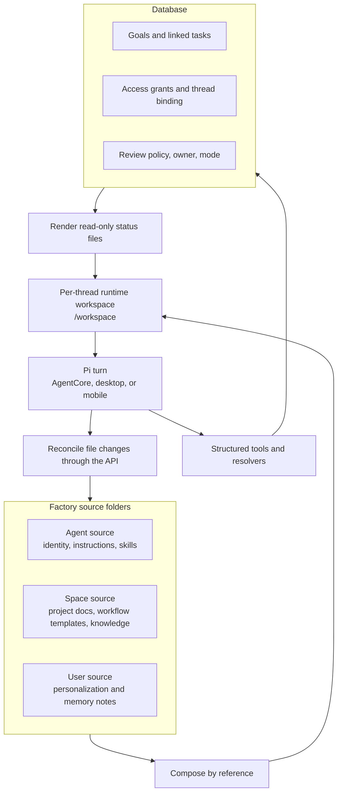

import { Aside } from "@astrojs/starlight/components";

ThinkWork workspaces are split into two kinds of durable state:

- **Files** hold working and narrative content: context, memory notes, docs, decisions, artifacts, handoffs, skills, and instructions the agent reads while working.
- **The database** holds structured workflow state: task status, Goal lifecycle, review policy, access grants, thread bindings, and other values that need transactions.

That split is the point of the architecture. A fact has one authoritative home. Files are portable, readable, diffable, and natural for an agent running in a filesystem. The database is transactional, constrained, and safe for many users, automations, and agent workers updating structured state at the same time.

<Aside type="tip">
  If you remember one rule, remember this: working content changes through
  files; structured status changes through tools and platform actions.
</Aside>

## The model at a glance



## Source and runtime

The **source workspace** is the editable side of the workspace. Settings -> Workspace shows it as three top-level folders:

```text
Workspace
├── Agent
├── Spaces
└── User
```

`Agent` is the tenant-wide baseline. `Spaces` contains one folder per Space. `User` contains the current user's personalization and memory notes.

The **runtime workspace** is what the agent sees for one Thread turn. It is rendered per Thread under a stable thread folder and hydrated into `/workspace` for Pi on AgentCore, desktop, and mobile. Runtime rendering is by reference: it writes a hydrate manifest that points back to the source files instead of copying every Agent, Space, and User file into a permanent per-user tuple.

The runtime does not show the same top-level source folders. It uses the Agent source as the root, merges User context into the root, and mounts only the active Space as singular `Space/`:

```text
/workspace
├── AGENTS.md
├── CONTEXT.md
├── USER.md
├── memory/
├── skills/
├── workspaces/
└── Space/
    ├── CONTEXT.md
    ├── artifacts/
    ├── docs/
    ├── goals/
    └── plans/
```

## Canonical S3 shape

The canonical source folders are tenant-scoped in S3:

```text
tenants/{tenant}/
├── agents/{agent-folder}/
│   ├── AGENTS.md
│   ├── CONTEXT.md
│   ├── skills/
│   └── memory/
├── spaces/{space-folder}/
│   ├── CONTEXT.md
│   ├── artifacts/
│   ├── docs/
│   ├── goals/
│   └── plans/
├── users/{user-folder}/
│   ├── USER.md
│   └── memory/
└── threads/{thread-folder}/
    ├── .hydrate_manifest.json
    ├── .rendered_at
    ├── GOAL.md
    ├── PROGRESS.md
    ├── DECISIONS.md
    ├── ARTIFACTS.md
    └── HANDOFFS.md
```

Folder names are human-readable and filesystem-safe. The stable identity remains the database UUID; the folder name is the readable path.

## Why status is not file-authoritative

`GOAL.md` and `PROGRESS.md` are status files, but they are not the authority for status. They are read-only projections rendered from database rows so the agent can understand the work in normal workspace form.

When an agent completes a task, it uses the task-status tool. That tool writes the database transaction, then the status files can be re-rendered from the new structured state. Editing `PROGRESS.md` text does not change the task row.

## How a turn flows

Every Pi runtime follows the same turn shape:

1. **Compose.** Resolve the Agent, Space, User, Thread, and database status sources.
2. **Hydrate.** Download the manifest-backed files into `/workspace`.
3. **Run.** The agent reads and writes files, calls tools, and produces the reply.
4. **Reconcile.** File-side changes go through the finalize path. The API checks provenance, lanes, access, secret scanning, and object freshness before writing allowed source files back to S3.

Structured state changes do not go through reconcile. They go through tools and resolvers that write the database.

## Current limits

Workspace sync is incremental. Desktop, mobile, and AgentCore check source and manifest freshness, then hydrate the files needed for the turn. They should not download the entire tenant bucket before every turn.

Structured task and Goal progress still depends on platform tools and resolvers. If a user says "DocuSign is complete", the agent should route that intent through task-status tooling; editing `PROGRESS.md` text is not an authoritative status change.

## Related pages

- [Ownership Model](/concepts/agents/workspace-architecture/ownership-model/) explains what belongs in files and what belongs in the database.
- [Turn Lifecycle](/concepts/agents/workspace-architecture/turn-lifecycle/) walks through compose, hydrate, run, and reconcile.
- [Reading the Workspace Tree](/concepts/agents/workspace-architecture/workspace-tree/) explains the folders an operator sees.
- [Workspace Composition](/concepts/agents/workspace-composition/) documents the detailed composition layers.
