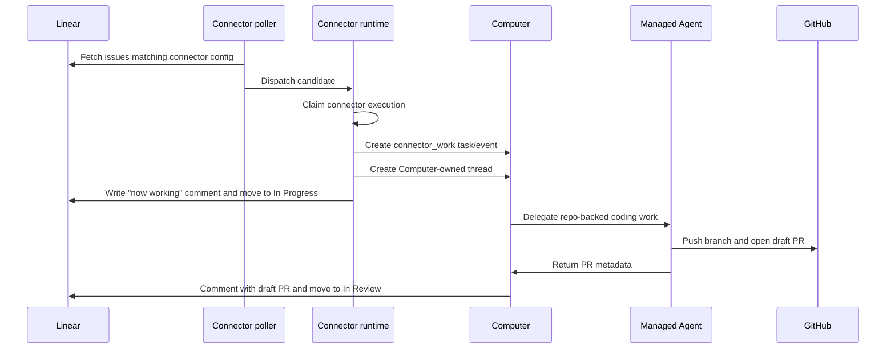

import { Aside } from "@astrojs/starlight/components";

A connector lifecycle is the durable path from an external event or work item into ThinkWork. It records where the work came from, which Computer owns it, what visible thread represents it, which worker handled it, and what was written back to the external provider.

The shipped example is the Symphony Linear connector: a Linear issue with the `symphony` label becomes Computer-owned work, opens a draft PR, comments back on Linear, and moves the Linear card to `In Review`.

## Lifecycle at a glance

The same shape applies to future tracker connectors, even when the external system changes. The provider-specific part is how the connector finds candidates and writes back results. The ThinkWork part is the durable handoff, thread, delegation, and audit trail.

## Durable records

Connector-origin work is intentionally not one giant row. Each record answers a different operational question.

| Record              | Answers                                                                                                   |
| ------------------- | --------------------------------------------------------------------------------------------------------- |
| Connector           | What external source is configured, what credentials does it use, and which Computer should own the work? |
| Connector execution | Did ThinkWork see and claim this external item? What happened during the handoff?                         |
| Computer task       | What work did the Computer accept? Is it pending, completed, failed, or cancelled?                        |
| Computer event      | What audit event did the Computer record for this handoff?                                                |
| Thread              | What visible work artifact should operators and users inspect?                                            |
| Delegation          | Which managed worker did the Computer use, and what was the result?                                       |
| Thread turn         | Did the delegated managed-Agent turn succeed or fail?                                                     |
| Outcome metadata    | What provider writeback, branch, commit, PR, or cleanup result should the UI show?                        |

This split is what lets scheduled polling be safe. A provider item can be seen repeatedly without creating duplicate threads, duplicate tasks, duplicate branches, duplicate PRs, or repeated provider comments.

## Linear checkpoint lifecycle

The current production proof is intentionally narrow:

1. A tenant admin configures a Linear connector in [Admin: Symphony](/applications/admin/symphony/).
2. The connector filters on a Linear team and the `symphony` label.
3. The scheduled connector poller runs without manual Lambda invocation.
4. A fresh matching issue is claimed as a connector execution.
5. ThinkWork creates a `connector_work` Computer task and `connector_work_received` event.
6. ThinkWork creates a Computer-owned connector thread with the Linear issue content.
7. Linear receives a "Symphony agent is now working..." comment and moves to `In Progress`.
8. The Computer delegates the work to a managed Agent through the repo-backed execution path.
9. The managed Agent creates a deterministic branch, commits a tiny change, pushes it, and opens a draft PR.
10. Linear receives a "Symphony agent opened a draft PR..." comment and moves to `In Review`.
11. Symphony Runs shows the lifecycle row with the thread link, PR link, and `Linear: In Review`.

<Aside type="note">
  The checkpoint label is `symphony`. Do not use `symphony-eligible` for the
  current ThinkWork proof; that label belonged to an earlier Symphony project
  path and can create confusing pickup behavior.
</Aside>

## What operators should see

The [Admin: Symphony](/applications/admin/symphony/) Runs tab is the first place to look. A clean successful Linear run should show:

- connector execution state `Terminal`;
- the Linear issue identifier, such as `TECH-70`;
- lifecycle chips for completed Computer task, completed delegation, and succeeded thread turn;
- writeback text such as `Linear: In Review`;
- a PR link, such as `PR #938`;
- an open-thread button.

Operators should not need SQL for the normal checkpoint. SQL remains useful when the UI is unclear or when diagnosing stale historical rows.

## What can go wrong

**No run appears.** The connector may be disabled, paused, not due for polling yet, using the wrong Linear credential, filtering the wrong team/project, or watching the wrong label.

**The Linear issue stays in Todo.** Dispatch writeback likely failed, the Linear workflow lacks the configured `In Progress` state, or the credential cannot update issues.

**The Linear issue stays in In Progress.** PR-producing work likely failed after dispatch. Check GitHub credential setup, repo write access, base branch, and the `In Review` state name.

**Repeated pickup notifications appear.** Idempotency regressed, or another process is watching the same Linear issue. The expected behavior is one pickup comment and one draft-PR comment per external issue.

**Runs shows `GitHub setup required`.** The connector config references a GitHub credential slug that is missing or inactive for the tenant.

**Old rows look active.** Historical proof attempts from before the cleanup fixes may appear as stale dispatching/running rows. Fresh rows are the source of truth; use the runbook's cleanup path only for known stale historical rows.

## Known limits

- **Linear-only.** This lifecycle page documents the shipped tracker proof. Other provider lifecycles should reuse the model but are not yet documented as shipped.
- **Explicit Computer target.** The connector points to one Computer. Automatic external actor matching and team queues are future work.
- **PR-producing work is currently the proof harness.** The current Linear path proves repo-backed coding work with GitHub writeback. It is not yet a generic connector SDK for every provider.

## Related pages

- [Connectors](/concepts/connectors/) — concept overview and vocabulary
- [Admin: Symphony](/applications/admin/symphony/) — setup and run visibility
- [Run the Symphony Linear Checkpoint](/guides/symphony-linear-checkpoint/) — operator guide
- [Computers](/concepts/computers/) — Computer ownership and delegation
- [Threads](/concepts/threads/) — visible work records

## Under the hood

The connector runtime lives in `packages/api/src/lib/connectors/runtime.ts`; the scheduled poller entry point is `packages/api/src/handlers/connector-poller.ts`. Connector schema lives in `packages/database-pg/src/schema/connectors.ts` and `packages/database-pg/src/schema/connector-executions.ts`, with GraphQL types in `packages/database-pg/graphql/types/connectors.graphql`.

Computer tasks and events are defined in `packages/database-pg/src/schema/computers.ts` and handled by `packages/api/src/lib/computers/tasks.ts`, `packages/api/src/lib/computers/events.ts`, and `packages/api/src/handlers/computer-runtime.ts`. The Symphony Runs table reads the stitched lifecycle from GraphQL through `apps/admin/src/routes/_authed/_tenant/symphony.tsx`.

For the exact operational checklist, SQL fallback, and stale cleanup commands, see `docs/runbooks/computer-first-linear-connector-checkpoint.md`.
